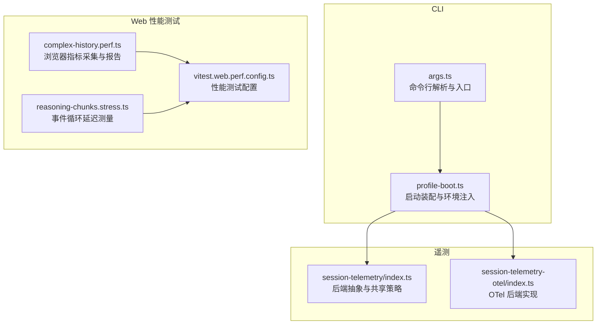
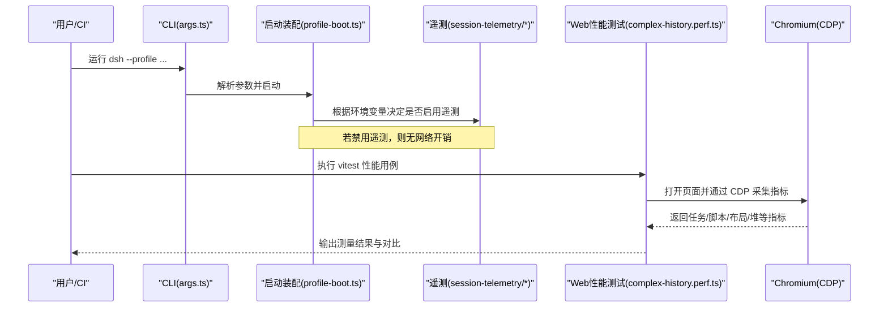
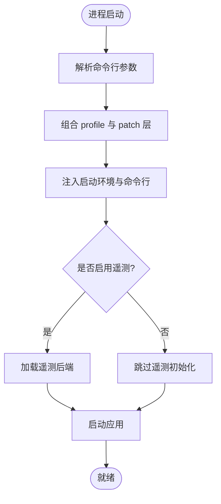
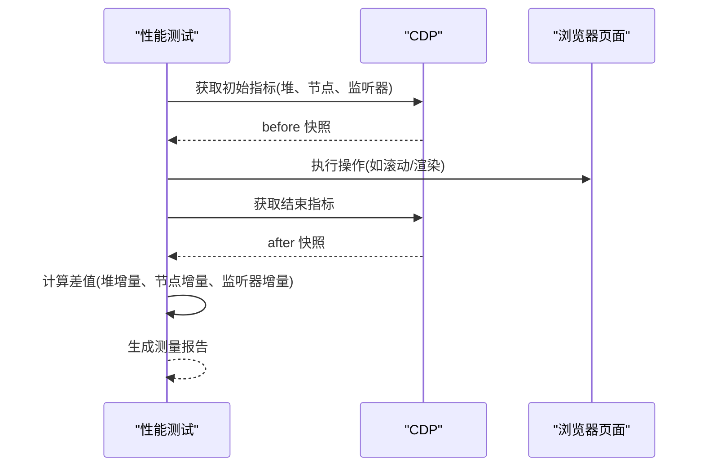
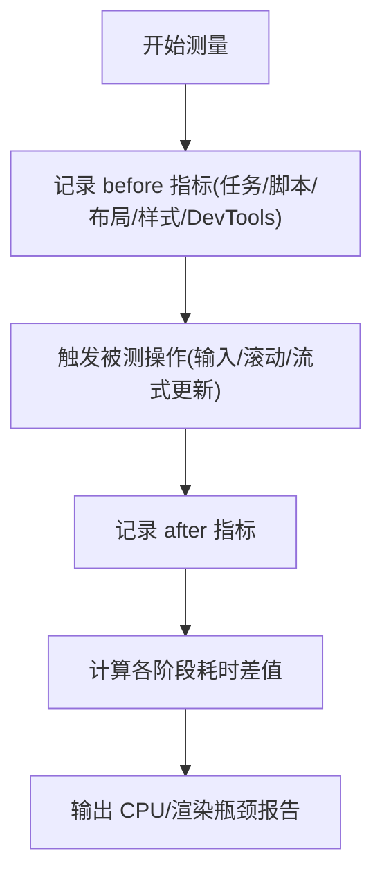
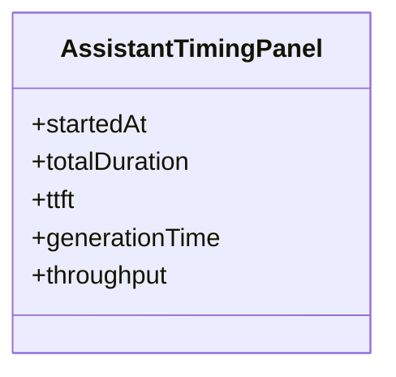
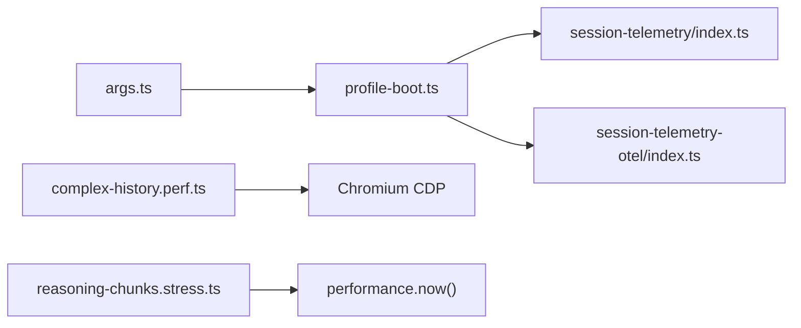

# 性能分析工具

<cite>
**本文引用的文件**
- [BENCHMARK.md](file://BENCHMARK.md)
- [vitest.web.perf.config.ts](file://vitest.web.perf.config.ts)
- [complex-history.perf.ts](file://apps/web/tests/complex-history.perf.ts)
- [reasoning-chunks.stress.ts](file://apps/web/stress-tests/reasoning-chunks.stress.ts)
- [profile-boot.ts](file://apps/cli/src/profile-boot.ts)
- [args.ts](file://apps/cli/src/args.ts)
- [turn-metrics.ts](file://packages/client/ui-conversation/src/client/chat/turn-metrics.ts)
- [TrajectoryTable.tsx](file://packages/client/ui-trajectory/src/client/TrajectoryTable.tsx)
- [session-telemetry/index.ts](file://packages/session/session-telemetry/src/index.ts)
- [session-telemetry-otel/index.ts](file://packages/session/session-telemetry-otel/src/index.ts)
</cite>

## 目录
1. [简介](#简介)
2. [项目结构](#项目结构)
3. [核心组件](#核心组件)
4. [架构总览](#架构总览)
5. [详细组件分析](#详细组件分析)
6. [依赖关系分析](#依赖关系分析)
7. [性能注意事项](#性能注意事项)
8. [故障排查指南](#故障排查指南)
9. [结论](#结论)
10. [附录](#附录)

## 简介
本文件面向开发者与测试工程师，系统化说明 DeepSeek Harness 中的性能分析能力与使用方法。内容覆盖：
- 启动时间分析与可观测性开关
- 内存使用监控（浏览器堆、节点数、监听器）
- CPU/事件循环性能分析（任务耗时、脚本耗时、布局/样式重算）
- 如何启用和配置性能分析模式
- 关键指标含义与解读方法
- 瓶颈识别与优化建议
- 使用性能分析 API 的代码示例路径
- 基准测试的创建与执行方式

## 项目结构
仓库将性能相关能力分布在 CLI 启动链路、Web 端性能测试与遥测服务中：
- CLI 启动与配置注入：负责在应用启动阶段提供环境快照、命令行参数，并支持通过环境变量关闭遥测等运行时行为。
- Web 性能测试：基于 Playwright + Chromium CDP 采集浏览器侧指标（任务、脚本、布局、样式、DevTools 命令耗时；DOM 节点、监听器数量；JS 堆大小），并提供测量封装与报告结构。
- 会话遥测：提供统一的遥测后端抽象与 OTel 实现，用于记录会话级事件（可用于性能相关的审计与追踪）。

图表来源
- [profile-boot.ts:1-301](file://apps/cli/src/profile-boot.ts#L1-L301)
- [args.ts:120-145](file://apps/cli/src/args.ts#L120-L145)
- [complex-history.perf.ts:1-200](file://apps/web/tests/complex-history.perf.ts#L1-L200)
- [reasoning-chunks.stress.ts:1-120](file://apps/web/stress-tests/reasoning-chunks.stress.ts#L1-L120)
- [vitest.web.perf.config.ts:1-16](file://vitest.web.perf.config.ts#L1-L16)
- [session-telemetry/index.ts:47-178](file://packages/session/session-telemetry/src/index.ts#L47-L178)
- [session-telemetry-otel/index.ts:50-168](file://packages/session/session-telemetry-otel/src/index.ts#L50-L168)

章节来源
- [profile-boot.ts:1-301](file://apps/cli/src/profile-boot.ts#L1-L301)
- [args.ts:120-145](file://apps/cli/src/args.ts#L120-L145)
- [vitest.web.perf.config.ts:1-16](file://vitest.web.perf.config.ts#L1-L16)

## 核心组件
- CLI 启动装配与环境注入
  - 负责组装 profile、挂载 patch 层、注入启动环境快照与命令行参数，并在启动窗口内处理信号与失败上报。
  - 支持通过环境变量关闭遥测行，从而减少启动期开销与网络调用。
- Web 性能测试与指标采集
  - 使用 Playwright 控制 Chromium，通过 CDP 获取浏览器性能指标，计算增量耗时与资源占用变化。
  - 提供测量封装函数与结构化报告，便于回归比较与趋势分析。
- 会话遥测后端
  - 定义统一后端接口与共享策略（全量、仅反馈、禁用），OTel 实现根据配置接入或丢弃数据。
  - 可在性能分析中作为“事件轨迹”补充，帮助定位端到端问题。

章节来源
- [profile-boot.ts:142-171](file://apps/cli/src/profile-boot.ts#L142-L171)
- [profile-boot.ts:207-301](file://apps/cli/src/profile-boot.ts#L207-L301)
- [session-telemetry/index.ts:47-178](file://packages/session/session-telemetry/src/index.ts#L47-L178)
- [session-telemetry-otel/index.ts:50-168](file://packages/session/session-telemetry-otel/src/index.ts#L50-L168)

## 架构总览
下图展示从 CLI 启动到 Web 性能测试与遥测的整体交互流程。

图表来源
- [args.ts:120-145](file://apps/cli/src/args.ts#L120-L145)
- [profile-boot.ts:207-301](file://apps/cli/src/profile-boot.ts#L207-L301)
- [session-telemetry-otel/index.ts:50-168](file://packages/session/session-telemetry-otel/src/index.ts#L50-L168)
- [complex-history.perf.ts:544-568](file://apps/web/tests/complex-history.perf.ts#L544-L568)

## 详细组件分析

### 启动时间分析与可观测性开关
- 启动装配会在应用启动前注入环境快照与命令行参数，确保插件能读取一致的启动上下文。
- 通过环境变量可禁用遥测，避免启动期的额外开销。
- 建议在 CI 或本地调试时按需开启/关闭遥测，以平衡可观测性与性能。

图表来源
- [profile-boot.ts:142-171](file://apps/cli/src/profile-boot.ts#L142-L171)
- [profile-boot.ts:207-301](file://apps/cli/src/profile-boot.ts#L207-L301)
- [session-telemetry-otel/index.ts:50-168](file://packages/session/session-telemetry-otel/src/index.ts#L50-L168)

章节来源
- [profile-boot.ts:142-171](file://apps/cli/src/profile-boot.ts#L142-L171)
- [profile-boot.ts:207-301](file://apps/cli/src/profile-boot.ts#L207-L301)
- [session-telemetry-otel/index.ts:50-168](file://packages/session/session-telemetry-otel/src/index.ts#L50-L168)

### 内存使用监控（浏览器）
- 通过 Chromium CDP 获取 JSHeapUsedSize、Nodes、JSEventListeners 等指标，计算前后差值得到内存与 DOM 增长情况。
- 适合评估长会话渲染、大量历史消息、流式更新对内存的影响。

图表来源
- [complex-history.perf.ts:544-568](file://apps/web/tests/complex-history.perf.ts#L544-L568)

章节来源
- [complex-history.perf.ts:544-568](file://apps/web/tests/complex-history.perf.ts#L544-L568)

### CPU 性能分析（事件循环与渲染管线）
- 通过 CDP 的任务时长、脚本时长、布局时长、样式重算时长、DevTools 命令时长等指标，评估主线程压力与渲染效率。
- 结合自定义探针（如点击到首帧、首包到达、首次绘制）可细化端到端体验指标。

图表来源
- [complex-history.perf.ts:544-568](file://apps/web/tests/complex-history.perf.ts#L544-L568)

章节来源
- [complex-history.perf.ts:544-568](file://apps/web/tests/complex-history.perf.ts#L544-L568)

### 响应时间与吞吐（对话轮次）
- 通过 UI 层的计时记录，可计算 TTFT（首 token 时间）、生成耗时、吞吐量（tokens/秒）等指标，辅助评估模型调用与前端渲染的综合表现。
- 这些指标有助于定位模型侧延迟与前端渲染瓶颈。

图表来源
- [TrajectoryTable.tsx:311-344](file://packages/client/ui-trajectory/src/client/TrajectoryTable.tsx#L311-L344)

章节来源
- [TrajectoryTable.tsx:311-344](file://packages/client/ui-trajectory/src/client/TrajectoryTable.tsx#L311-L344)

### 事件循环延迟与交互感知
- 在压力测试中，通过 performance.now() 记录交互处理时间点，衡量事件循环阻塞对用户感知的延迟影响。
- 适用于评估在高负载下 UI 响应性退化情况。

章节来源
- [reasoning-chunks.stress.ts:1-120](file://apps/web/stress-tests/reasoning-chunks.stress.ts#L1-L120)

### 遥测与性能审计
- 遥测后端提供统一接口，支持全量、仅反馈、禁用三种模式。禁用模式下不产生网络开销，适合纯性能场景。
- 在性能分析中，可结合遥测事件进行端到端追踪，但需权衡开销。

章节来源
- [session-telemetry/index.ts:47-178](file://packages/session/session-telemetry/src/index.ts#L47-L178)
- [session-telemetry-otel/index.ts:50-168](file://packages/session/session-telemetry-otel/src/index.ts#L50-L168)

## 依赖关系分析
- CLI 启动装配依赖 profile 组合与 patch 机制，注入环境与命令行参数，并可选择性地挂载遥测后端。
- Web 性能测试依赖 Playwright 与 Chromium CDP，通过 CDP 协议获取底层性能指标。
- 遥测后端与 OTel 实现解耦，由配置决定是否启用及共享策略。

图表来源
- [args.ts:120-145](file://apps/cli/src/args.ts#L120-L145)
- [profile-boot.ts:142-171](file://apps/cli/src/profile-boot.ts#L142-L171)
- [session-telemetry/index.ts:47-178](file://packages/session/session-telemetry/src/index.ts#L47-L178)
- [session-telemetry-otel/index.ts:50-168](file://packages/session/session-telemetry-otel/src/index.ts#L50-L168)
- [complex-history.perf.ts:544-568](file://apps/web/tests/complex-history.perf.ts#L544-L568)
- [reasoning-chunks.stress.ts:1-120](file://apps/web/stress-tests/reasoning-chunks.stress.ts#L1-L120)

章节来源
- [args.ts:120-145](file://apps/cli/src/args.ts#L120-L145)
- [profile-boot.ts:142-171](file://apps/cli/src/profile-boot.ts#L142-L171)
- [session-telemetry/index.ts:47-178](file://packages/session/session-telemetry/src/index.ts#L47-L178)
- [session-telemetry-otel/index.ts:50-168](file://packages/session/session-telemetry-otel/src/index.ts#L50-L168)
- [complex-history.perf.ts:544-568](file://apps/web/tests/complex-history.perf.ts#L544-L568)
- [reasoning-chunks.stress.ts:1-120](file://apps/web/stress-tests/reasoning-chunks.stress.ts#L1-L120)

## 性能注意事项
- 启动期开销
  - 遥测启用会增加初始化与可能的网络调用成本；在纯性能场景中建议禁用遥测以减少干扰。
- 浏览器侧指标
  - 关注任务/脚本/布局/样式/DevTools 耗时的显著上升，通常意味着主线程压力大或渲染复杂度高。
  - 堆内存与节点数持续增长可能提示内存泄漏或未及时释放引用。
- 事件循环
  - 高负载下交互延迟增加，应优先减少长时间同步任务与阻塞操作。
- 遥测策略
  - 全量模式适合问题复现与端到端追踪；仅反馈模式降低开销；禁用模式最小化影响。

[本节为通用指导，无需特定文件来源]

## 故障排查指南
- 遥测未生效
  - 检查环境变量是否设置为禁用；确认遥测行是否存在于组合树中。
  - 参考遥测后端的共享策略与模式解析逻辑。
- 性能测试不稳定
  - 确保浏览器实例稳定、CDP 连接正常；避免与其他高负载任务竞争资源。
  - 使用独立的 workspace 与 session ID 隔离基准任务。
- 指标异常或缺失
  - 确认 CDP 指标名称与取值正确；检查测量封装函数的差值计算逻辑。

章节来源
- [session-telemetry-otel/index.ts:50-168](file://packages/session/session-telemetry-otel/src/index.ts#L50-L168)
- [complex-history.perf.ts:544-568](file://apps/web/tests/complex-history.perf.ts#L544-L568)
- [BENCHMARK.md:1-4](file://BENCHMARK.md#L1-L4)

## 结论
DeepSeek Harness 提供了从 CLI 启动到 Web 端的多层次性能分析能力：
- 通过 CLI 启动装配与环境注入，可灵活控制遥测与启动开销。
- Web 性能测试借助 CDP 采集浏览器侧关键指标，形成可回归的测量报告。
- 会话遥测提供端到端事件追踪，配合性能指标可快速定位瓶颈。
建议在生产与 CI 环境中按场景启用合适的遥测策略，并结合基准测试持续跟踪性能趋势。

[本节为总结，无需特定文件来源]

## 附录

### 如何启用和配置性能分析模式
- 禁用遥测以减少启动与运行期开销
  - 设置相应环境变量以禁用遥测行，避免不必要的初始化与网络调用。
- 运行 Web 性能测试
  - 使用专用配置文件执行性能用例，该配置包含更长的超时与控制台拦截关闭，适合高基数场景。
- 独立基准任务
  - 遵循基准文档，安装 SDK 并运行最小化变体，使用独立工作区与会话 ID 保证隔离。

章节来源
- [profile-boot.ts:142-171](file://apps/cli/src/profile-boot.ts#L142-L171)
- [vitest.web.perf.config.ts:1-16](file://vitest.web.perf.config.ts#L1-L16)
- [BENCHMARK.md:1-4](file://BENCHMARK.md#L1-L4)

### 关键指标含义与解读
- 任务/脚本/布局/样式/DevTools 耗时：反映主线程在不同阶段的负担，显著上升需排查代码复杂度与渲染路径。
- 堆内存与节点/监听器数量：持续增长可能提示内存泄漏或资源未释放。
- TTFT/生成耗时/吞吐量：评估模型响应与前端渲染的综合体验。
- 事件循环延迟：衡量交互响应性，高延迟通常与阻塞任务相关。

章节来源
- [complex-history.perf.ts:544-568](file://apps/web/tests/complex-history.perf.ts#L544-L568)
- [TrajectoryTable.tsx:311-344](file://packages/client/ui-trajectory/src/client/TrajectoryTable.tsx#L311-L344)
- [reasoning-chunks.stress.ts:1-120](file://apps/web/stress-tests/reasoning-chunks.stress.ts#L1-L120)

### 性能瓶颈识别与优化建议
- 主线程繁忙
  - 减少同步阻塞操作，拆分大任务，利用异步与分片渲染。
- 渲染复杂度高
  - 优化列表虚拟化、减少重排重绘，合并 DOM 变更批次。
- 内存泄漏
  - 检查事件监听器与闭包引用，及时清理不再使用的对象。
- 遥测开销
  - 在性能敏感场景禁用遥测或使用仅反馈模式。

[本节为通用指导，无需特定文件来源]

### 使用性能分析 API 的代码示例路径
- 浏览器指标测量封装与差值计算
  - 参考测量函数与指标差值计算逻辑。
- 事件循环延迟测量
  - 参考压力测试中对 performance.now() 的使用。
- 对话轮次计时面板
  - 参考 TTFT、生成耗时与吞吐量的计算与展示。

章节来源
- [complex-history.perf.ts:544-568](file://apps/web/tests/complex-history.perf.ts#L544-L568)
- [reasoning-chunks.stress.ts:1-120](file://apps/web/stress-tests/reasoning-chunks.stress.ts#L1-L120)
- [TrajectoryTable.tsx:311-344](file://packages/client/ui-trajectory/src/client/TrajectoryTable.tsx#L311-L344)

### 基准测试的创建与执行
- 创建性能用例
  - 将性能用例命名为 .perf.ts，置于 apps/web/tests 目录下，以便被性能配置收集。
- 执行性能测试
  - 使用专用配置文件运行，以获得更宽松的超时与更贴近真实环境的测量。
- 独立基准任务
  - 按照基准文档安装 SDK 并运行最小化变体，使用独立工作区与会话 ID。

章节来源
- [vitest.web.perf.config.ts:1-16](file://vitest.web.perf.config.ts#L1-L16)
- [BENCHMARK.md:1-4](file://BENCHMARK.md#L1-L4)