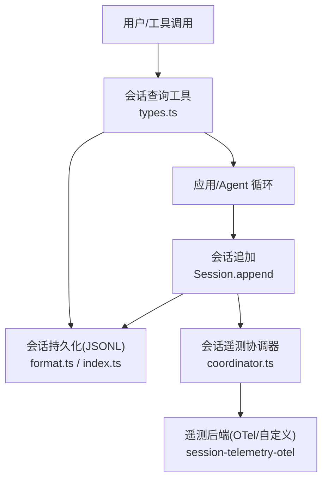
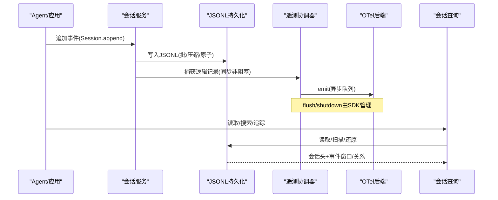
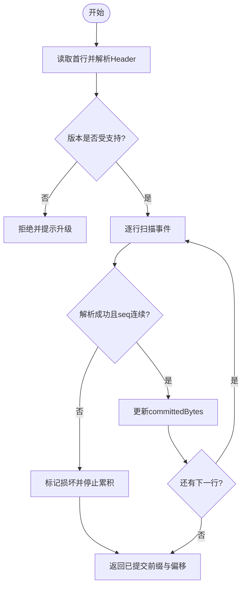
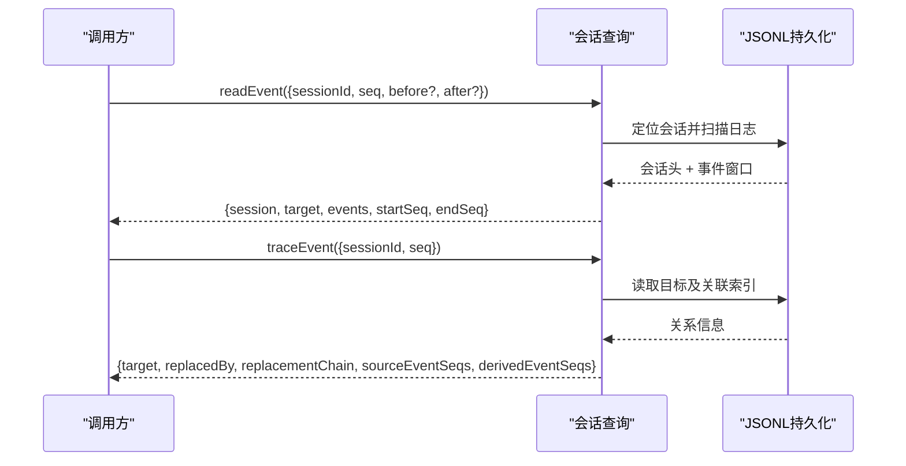
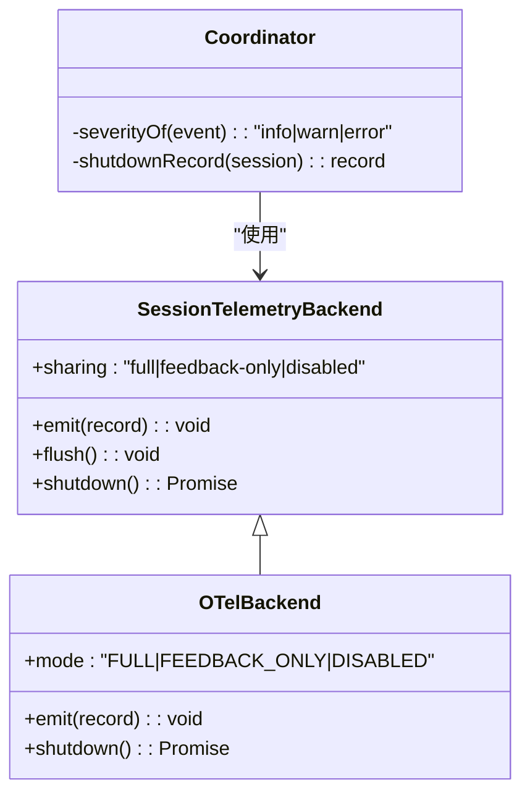
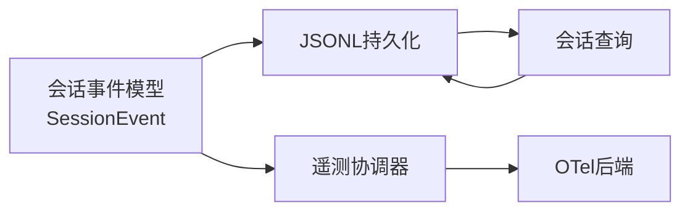

# 日志分析工具

<cite>
**本文引用的文件**
- [packages/session/session-telemetry/src/index.ts](file://packages/session/session-telemetry/src/index.ts)
- [packages/session/session-telemetry/src/coordinator.ts](file://packages/session/session-telemetry/src/coordinator.ts)
- [packages/session/session-telemetry-otel/src/index.ts](file://packages/session/session-telemetry-otel/src/index.ts)
- [packages/session/session-persistence-jsonl/src/format.ts](file://packages/session/session-persistence-jsonl/src/format.ts)
- [packages/session-query/session-query/src/types.ts](file://packages/session-query/session-query/src/types.ts)
- [docs/subsystems/session.md](file://docs/subsystems/session.md)
- [docs/persistence-catalog.md](file://docs/persistence-catalog.md)
- [packages/storage/storage-json/README.md](file://packages/storage/storage-json/README.md)
- [examples/headless-agent/tests/fixtures/session-telemetry-otel-driver.ts](file://examples/headless-agent/tests/fixtures/session-telemetry-otel-driver.ts)
- [apps/cli/tests/telemetry-switch.spec.ts](file://apps/cli/tests/telemetry-switch.spec.ts)
</cite>

## 目录
1. [简介](#简介)
2. [项目结构](#项目结构)
3. [核心组件](#核心组件)
4. [架构总览](#架构总览)
5. [详细组件分析](#详细组件分析)
6. [依赖关系分析](#依赖关系分析)
7. [性能考量](#性能考量)
8. [故障排查指南](#故障排查指南)
9. [结论](#结论)
10. [附录](#附录)

## 简介
本文件面向“日志分析工具”的使用与排障，聚焦以下目标：
- 解释系统日志的结构与格式（会话日志、工具调用日志、错误日志等）
- 说明日志级别配置与过滤方法
- 提供日志查询与分析工具的使用指南
- 指导如何通过日志进行问题诊断与性能分析
- 给出日志轮转与存储策略的配置建议
- 总结常见日志模式的识别与解析技巧

## 项目结构
围绕日志的子系统主要分布在 session、session-query、persistence 与 telemetry 相关包中：
- 会话事件模型与表面折叠：core/session、docs/subsystems/session.md、docs/persistence-catalog.md
- 会话持久化（JSONL 格式、压缩、扫描修复）：session-persistence-jsonl
- 会话查询（事件读取、关系追踪、全文检索）：session-query
- 会话遥测（采集、级别映射、后端导出）：session-telemetry、session-telemetry-otel
- 存储限制与注意事项：storage-json

图表来源
- [packages/session/session-persistence-jsonl/src/format.ts:210-224](file://packages/session/session-persistence-jsonl/src/format.ts#L210-L224)
- [packages/session/session-telemetry/src/coordinator.ts:270-303](file://packages/session/session-telemetry/src/coordinator.ts#L270-L303)
- [packages/session-query/session-query/src/types.ts:126-150](file://packages/session-query/session-query/src/types.ts#L126-L150)

章节来源
- [docs/subsystems/session.md:194-245](file://docs/subsystems/session.md#L194-L245)
- [docs/persistence-catalog.md:12-91](file://docs/persistence-catalog.md#L12-L91)
- [packages/session/session-persistence-jsonl/src/format.ts:210-224](file://packages/session/session-persistence-jsonl/src/format.ts#L210-L224)

## 核心组件
- 会话事件模型：SessionEvent 为不可变的事件记录，包含 seq、time、data 以及可选的表面操作元数据。它是所有日志的基础单元。
- JSONL 会话日志：以 JSONL 行式存储，首行为 SessionHeader，后续行为事件；支持 zstd 压缩与增量扫描修复。
- 会话查询：提供按会话/事件的精确读取、窗口读取、事件关系追踪与全文检索能力。
- 会话遥测：在 append 热路径上捕获逻辑记录，映射严重级别，并通过后端（如 OTel）异步导出；支持关闭模式与反馈仅模式。
- 存储与持久化：JSONL 后端负责落盘、批写、压缩、路径安全编码与损坏恢复；Windows 平台存在已知限制。

章节来源
- [docs/subsystems/session.md:194-245](file://docs/subsystems/session.md#L194-L245)
- [docs/persistence-catalog.md:12-91](file://docs/persistence-catalog.md#L12-L91)
- [packages/session/session-persistence-jsonl/src/format.ts:210-224](file://packages/session/session-persistence-jsonl/src/format.ts#L210-L224)
- [packages/session-query/session-query/src/types.ts:126-150](file://packages/session-query/session-query/src/types.ts#L126-L150)
- [packages/session/session-telemetry/src/index.ts:47-87](file://packages/session/session-telemetry/src/index.ts#L47-L87)

## 架构总览
下图展示了从会话事件产生到持久化与遥测导出的完整链路，以及查询侧如何访问同一份逻辑会话语料。

图表来源
- [packages/session/session-persistence-jsonl/src/format.ts:210-224](file://packages/session/session-persistence-jsonl/src/format.ts#L210-L224)
- [packages/session/session-telemetry/src/index.ts:94-131](file://packages/session/session-telemetry/src/index.ts#L94-L131)
- [packages/session/session-telemetry-otel/src/index.ts:50-84](file://packages/session/session-telemetry-otel/src/index.ts#L50-L84)
- [packages/session-query/session-query/src/types.ts:126-150](file://packages/session-query/session-query/src/types.ts#L126-L150)

## 详细组件分析

### 会话事件与日志格式
- 事件模型：每个事件包含单调递增的 seq、时间戳 time、结构化 data，以及可选 surfaceOp/sourceEventSeqs 用于表面折叠与溯源。
- JSONL 存储：首行是 session 头（版本、id、创建时间、cwd、parentSession、seedLength 等），后续每行一个 StorageRecord；支持 packChunks 将连续块打包为 storage row，读取时透明解码。
- 扫描与修复：SessionLogScanner 逐行解析，遇到损坏或断尾会保留已提交前缀并返回可安全续写的偏移量；拒绝未知版本以避免误判为损坏。

图表来源
- [packages/session/session-persistence-jsonl/src/format.ts:232-247](file://packages/session/session-persistence-jsonl/src/format.ts#L232-L247)
- [packages/session/session-persistence-jsonl/src/format.ts:266-344](file://packages/session/session-persistence-jsonl/src/format.ts#L266-L344)

章节来源
- [docs/subsystems/session.md:194-245](file://docs/subsystems/session.md#L194-L245)
- [docs/persistence-catalog.md:12-91](file://docs/persistence-catalog.md#L12-L91)
- [packages/session/session-persistence-jsonl/src/format.ts:210-224](file://packages/session/session-persistence-jsonl/src/format.ts#L210-L224)
- [packages/session/session-persistence-jsonl/src/format.ts:232-247](file://packages/session/session-persistence-jsonl/src/format.ts#L232-L247)
- [packages/session/session-persistence-jsonl/src/format.ts:266-344](file://packages/session/session-persistence-jsonl/src/format.ts#L266-L344)

### 会话查询工具
- 事件读取：支持对单条事件及其前后窗口进行读取，返回会话头与事件数组，便于定位上下文。
- 事件关系追踪：返回目标事件、被替换链、直接源事件序列与派生事件序列，帮助理解表面折叠与引用关系。
- 全文检索：跨会话与会话内搜索，支持分页游标与多种元数据过滤（类型、时间、表面等）。

图表来源
- [packages/session-query/session-query/src/types.ts:126-150](file://packages/session-query/session-query/src/types.ts#L126-L150)
- [packages/session-query/session-query/src/types.ts:96-124](file://packages/session-query/session-query/src/types.ts#L96-L124)

章节来源
- [packages/session-query/session-query/src/types.ts:96-150](file://packages/session-query/session-query/src/types.ts#L96-L150)

### 会话遥测与级别映射
- 捕获点：在 append 热路径上以非阻塞方式捕获逻辑记录；同时支持按需从规范日志回放。
- 级别映射：根据事件自身结果标志自动映射 severity（例如 tool/result 的 isError、turn/end 的错误原因），未知类型默认 info。
- 后端模式：支持 full、feedback-only、disabled；disabled 模式下不导出数据，仅本地告警。
- 生命周期：emit 必须非阻塞；flush 可选；shutdown 需确保队列排空并静默失败保护。

图表来源
- [packages/session/session-telemetry/src/index.ts:47-87](file://packages/session/session-telemetry/src/index.ts#L47-L87)
- [packages/session/session-telemetry/src/index.ts:94-131](file://packages/session/session-telemetry/src/index.ts#L94-L131)
- [packages/session/session-telemetry/src/coordinator.ts:270-303](file://packages/session/session-telemetry/src/coordinator.ts#L270-L303)
- [packages/session/session-telemetry-otel/src/index.ts:50-84](file://packages/session/session-telemetry-otel/src/index.ts#L50-L84)

章节来源
- [packages/session/session-telemetry/src/index.ts:47-87](file://packages/session/session-telemetry/src/index.ts#L47-L87)
- [packages/session/session-telemetry/src/index.ts:94-131](file://packages/session/session-telemetry/src/index.ts#L94-L131)
- [packages/session/session-telemetry/src/coordinator.ts:270-303](file://packages/session/session-telemetry/src/coordinator.ts#L270-L303)
- [packages/session/session-telemetry-otel/src/index.ts:50-84](file://packages/session/session-telemetry-otel/src/index.ts#L50-L84)

### 日志级别配置与过滤
- 级别来源：severity 由协调器基于事件结果标志计算；可通过 session-telemetry/record 事件监听器进行二次变换（红白名单/脱敏/重分级）。
- 模式开关：通过 OTel 后端的 mode 选择 full/feedback-only/disabled；disabled 下不会导出数据，仅记录本地警告。
- 过滤建议：在 record 监听器中依据 attributes（如 event.type、session.id）与 body 内容实现细粒度过滤与脱敏。

章节来源
- [packages/session/session-telemetry/src/index.ts:24-44](file://packages/session/session-telemetry/src/index.ts#L24-L44)
- [packages/session/session-telemetry/src/coordinator.ts:284-297](file://packages/session/session-telemetry/src/coordinator.ts#L284-L297)
- [packages/session/session-telemetry-otel/src/index.ts:50-84](file://packages/session/session-telemetry-otel/src/index.ts#L50-L84)

### 日志轮转与存储策略
- 存储格式：JSONL 行式日志，首行 header，后续事件行；支持 zstd 压缩以减少体积。
- 路径安全：session id 与项目路径经安全编码，避免穿越与冲突。
- 批写与刷新：协调器控制 preparedSessionCacheSize 与 writeBatchMaxDelayMs；后端 SDK 负责批量与重试。
- 轮转建议：由于当前设计为追加型日志，建议在部署层按时间/大小切分根目录或文件（例如按天归档），并结合外部日志收集器统一处理。
- Windows 限制：rename 无显式 write-through，多进程并发写入存在竞争风险；推荐单进程部署或使用更严格的发布辅助。

章节来源
- [packages/session/session-persistence-jsonl/src/format.ts:19-26](file://packages/session/session-persistence-jsonl/src/format.ts#L19-L26)
- [packages/session/session-persistence-jsonl/src/format.ts:110-167](file://packages/session/session-persistence-jsonl/src/format.ts#L110-L167)
- [packages/session/session-persistence-jsonl/src/index.ts:148-164](file://packages/session/session-persistence-jsonl/src/index.ts#L148-L164)
- [packages/storage/storage-json/README.md:35-39](file://packages/storage/storage-json/README.md#L35-L39)

### 常见问题诊断与性能分析
- 定位失败事件：使用 readEvent 获取目标事件与前后窗口，结合 traceEvent 查看替换链与引用关系，快速定位表面折叠与消息构建过程。
- 工具调用异常：关注 tool/result 的 isError 标志与 turn/end 的错误 reason；这些会被映射为 error 级别，便于告警。
- 性能瓶颈：检查 append 热路径上的 emit 是否为非阻塞；确认 batch 与 flush 策略；评估压缩与打包对 I/O 的影响。
- 数据一致性：利用 scanLog 的 committedBytes 与事件 seq 连续性校验，判断是否存在截断或损坏。

章节来源
- [packages/session-query/session-query/src/types.ts:126-150](file://packages/session-query/session-query/src/types.ts#L126-L150)
- [packages/session/session-telemetry/src/coordinator.ts:284-297](file://packages/session/session-telemetry/src/coordinator.ts#L284-L297)
- [packages/session/session-persistence-jsonl/src/format.ts:266-344](file://packages/session/session-persistence-jsonl/src/format.ts#L266-L344)

## 依赖关系分析
- 会话事件模型被持久化、查询与遥测共同消费，形成强内聚的数据契约。
- 遥测协调器依赖会话事件模型与后端抽象，屏蔽具体导出细节。
- JSONL 持久化提供稳定的物理格式与扫描修复能力，支撑查询与回溯。
- 查询层解耦于持久化实现，通过类型化接口访问逻辑会话语料。

图表来源
- [docs/persistence-catalog.md:12-91](file://docs/persistence-catalog.md#L12-L91)
- [packages/session/session-telemetry/src/index.ts:94-131](file://packages/session/session-telemetry/src/index.ts#L94-L131)
- [packages/session/session-persistence-jsonl/src/format.ts:210-224](file://packages/session/session-persistence-jsonl/src/format.ts#L210-L224)
- [packages/session-query/session-query/src/types.ts:126-150](file://packages/session-query/session-query/src/types.ts#L126-L150)

章节来源
- [docs/persistence-catalog.md:12-91](file://docs/persistence-catalog.md#L12-L91)
- [packages/session/session-telemetry/src/index.ts:94-131](file://packages/session/session-telemetry/src/index.ts#L94-L131)
- [packages/session/session-persistence-jsonl/src/format.ts:210-224](file://packages/session/session-persistence-jsonl/src/format.ts#L210-L224)
- [packages/session-query/session-query/src/types.ts:126-150](file://packages/session-query/session-query/src/types.ts#L126-L150)

## 性能考量
- 热路径非阻塞：emit 必须为队列入队，避免阻塞 Agent 循环。
- 批处理与刷新：合理设置批大小与延迟，平衡吞吐与延迟；必要时在 turn 结束处触发 flush。
- 压缩与打包：zstd 压缩与 chunk 打包可降低 I/O 与磁盘占用，但会增加 CPU 开销；根据硬件与负载权衡。
- 扫描效率：scanLog 仅解析必要范围，配合 committedBytes 快速定位有效前缀，减少无效解析。

[本节为通用指导，无需特定文件来源]

## 故障排查指南
- 事件缺失或顺序错乱：使用 readEvent 获取窗口，结合 traceEvent 检查替换链与引用；若 seq 不连续，检查持久化写入与 fsync 失败场景。
- 遥测未上报：确认 mode 不为 disabled；检查 emit 是否抛出异常并被协调器吞掉；验证 shutdown 是否被调用。
- 查询报错：注意工具层对底层异常的脱敏与标准化，优先查看 warn 日志中的原始信息。
- 平台兼容：Windows 下注意 rename 的 write-through 限制；避免多进程并发写入同一根目录。

章节来源
- [packages/session-query/session-query/src/types.ts:126-150](file://packages/session-query/session-query/src/types.ts#L126-L150)
- [packages/session/session-telemetry/src/index.ts:94-131](file://packages/session/session-telemetry/src/index.ts#L94-L131)
- [packages/storage/storage-json/README.md:35-39](file://packages/storage/storage-json/README.md#L35-L39)

## 结论
本日志体系以不可变的会话事件为核心，通过 JSONL 持久化保证可追溯性，借助会话查询提供强大的定位与回溯能力，并以遥测机制实现可观测性与告警。通过合理的级别映射、过滤策略与存储配置，可在生产环境中高效地进行问题诊断与性能优化。

[本节为总结性内容，无需特定文件来源]

## 附录

### 常用日志模式与解析技巧
- 工具调用失败：tool/result 中 isError=true 或 turn/end 的 reason.kind='error'，应作为 error 级别重点排查。
- 消息折叠与替换：通过 traceEvent 的 replacedBy/replacementChain 与 sourceEventSeqs/derivedEventSeqs 理解表面变化。
- 断尾与损坏：scanLog 返回的 committedBytes 指示安全续写位置；出现损坏时优先回滚至该偏移。
- 遥测模式：disabled 下仅本地告警；feedback-only 仅上传反馈；full 上传完整日志。

章节来源
- [packages/session/session-telemetry/src/coordinator.ts:284-297](file://packages/session/session-telemetry/src/coordinator.ts#L284-L297)
- [packages/session/session-persistence-jsonl/src/format.ts:266-344](file://packages/session/session-persistence-jsonl/src/format.ts#L266-L344)
- [packages/session/session-telemetry-otel/src/index.ts:50-84](file://packages/session/session-telemetry-otel/src/index.ts#L50-L84)