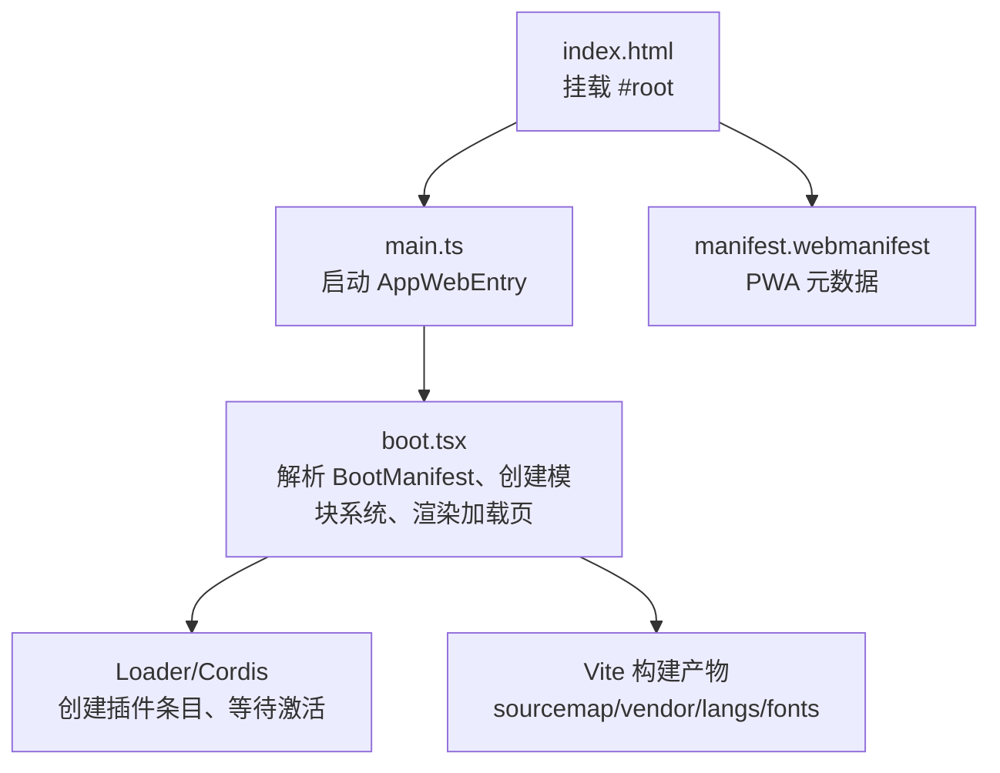
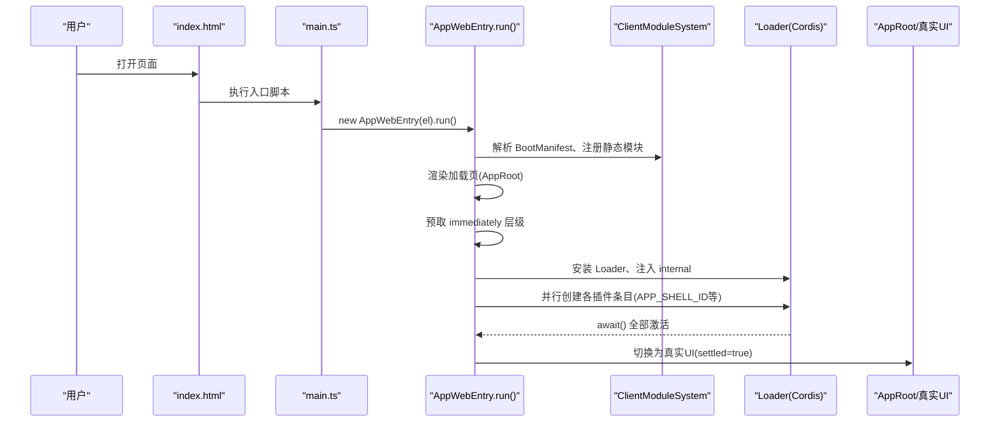
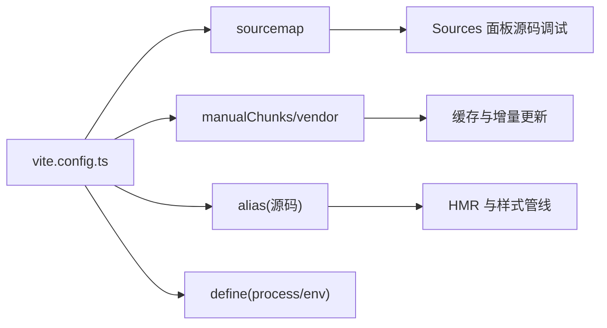

# 浏览器开发者工具

<cite>
**本文引用的文件**
- [apps/web/src/main.ts](file://apps/web/src/main.ts)
- [apps/web/vite.config.ts](file://apps/web/vite.config.ts)
- [apps/web/package.json](file://apps/web/package.json)
- [apps/web/index.html](file://apps/web/index.html)
- [apps/web/public/manifest.webmanifest](file://apps/web/public/manifest.webmanifest)
- [packages/client/web/src/boot.tsx](file://packages/client/web/src/boot.tsx)
- [packages/client/runtime/src/client/contract/store.ts](file://packages/client/runtime/src/client/contract/store.ts)
- [packages/host/apiproxy/src/fetch/client.ts](file://packages/host/apiproxy/src/fetch/client.ts)
- [packages/web/web-fetch-http/tests/fetch-http.spec.ts](file://packages/web/web-fetch-http/tests/fetch-http.spec.ts)
- [apps/web/tests/complex-history.perf.ts](file://apps/web/tests/complex-history.perf.ts)
</cite>

## 目录
1. [简介](#简介)
2. [项目结构](#项目结构)
3. [核心组件](#核心组件)
4. [架构总览](#架构总览)
5. [详细组件分析](#详细组件分析)
6. [依赖关系分析](#依赖关系分析)
7. [性能注意事项](#性能注意事项)
8. [故障排查指南](#故障排查指南)
9. [结论](#结论)
10. [附录](#附录)

## 简介
本指南面向在 DeepSeek Harness 项目中开发 Web 界面的工程师，聚焦于使用 Chrome DevTools 进行高效调试与性能优化。内容覆盖：
- 前端组件调试（React、插槽注入、模块加载）
- 状态管理调试（持久化存储、快照冻结）
- 网络请求调试（fetch 代理、超时与中止）
- 断点设置与 Web 界面调试流程
- 前端性能分析（内存、事件监听器、DOM 节点）
- PWA 与 Service Worker 调试（Manifest、离线能力）
- 移动端调试与响应式布局调试

## 项目结构
DeepSeek Harness 的 Web 应用由 apps/web 作为入口，基于 Vite + React 构建，并通过 @deepseek-ai/dsh-client-web 提供的壳层完成插件化装配与运行时引导。关键入口与配置如下：
- 页面入口 index.html 挂载 #root，并引入 main.ts
- main.ts 仅负责找到挂载点并启动 AppWebEntry
- vite.config.ts 配置源码映射、分包策略、别名与 define 常量，便于调试与缓存
- package.json 提供 dev/build/watch 脚本
- manifest.webmanifest 定义 PWA 元信息

图表来源
- [apps/web/index.html:1-15](file://apps/web/index.html#L1-L15)
- [apps/web/src/main.ts:1-11](file://apps/web/src/main.ts#L1-L11)
- [packages/client/web/src/boot.tsx:1-239](file://packages/client/web/src/boot.tsx#L1-L239)
- [apps/web/vite.config.ts:92-160](file://apps/web/vite.config.ts#L92-L160)
- [apps/web/public/manifest.webmanifest:1-17](file://apps/web/public/manifest.webmanifest#L1-L17)

章节来源
- [apps/web/index.html:1-15](file://apps/web/index.html#L1-L15)
- [apps/web/src/main.ts:1-11](file://apps/web/src/main.ts#L1-L11)
- [apps/web/vite.config.ts:1-161](file://apps/web/vite.config.ts#L1-L161)
- [apps/web/package.json:1-52](file://apps/web/package.json#L1-L52)
- [apps/web/public/manifest.webmanifest:1-17](file://apps/web/public/manifest.webmanifest#L1-L17)

## 核心组件
- 应用启动与引导
  - AppWebEntry 负责解析 BootManifest、初始化 ClientModuleSystem、注册静态模块、渲染加载页、并行预取 immediately 层级、创建 Loader 条目并等待全部激活，最终切换到真实 UI。
  - 通过 status/error/settled 信号驱动加载页与错误展示。
- 状态管理与持久化
  - 客户端 store 封装 getSnapshot/subscribe/update/set，并在开发环境对整体状态进行深冻结；同时实现 localStorage 持久化，失败时降级不影响运行。
- 网络请求代理
  - fetch 代理支持 AbortSignal 中止、超时、重定向拦截等，统一错误码，便于定位问题。

章节来源
- [packages/client/web/src/boot.tsx:68-239](file://packages/client/web/src/boot.tsx#L68-L239)
- [packages/client/runtime/src/client/contract/store.ts:105-154](file://packages/client/runtime/src/client/contract/store.ts#L105-L154)
- [packages/host/apiproxy/src/fetch/client.ts:525-549](file://packages/host/apiproxy/src/fetch/client.ts#L525-L549)

## 架构总览
下图展示了从页面加载到插件装配的关键路径，以及 Vite 构建产物如何影响调试体验。

图表来源
- [apps/web/src/main.ts:1-11](file://apps/web/src/main.ts#L1-L11)
- [packages/client/web/src/boot.tsx:97-208](file://packages/client/web/src/boot.tsx#L97-L208)

## 详细组件分析

### 前端组件调试（React、插槽、模块加载）
- 启动与挂载
  - 在 index.html 中确认 #root 存在，main.ts 会在此元素上挂载应用。若缺失将抛出错误，可在 Sources 面板直接定位。
- 加载页与错误上报
  - AppWebEntry 在 run 过程中维护 status/error/settled，任何装配失败都会停留在加载页并显示错误信息，便于快速定位失败的插件或依赖。
- 模块系统与插槽
  - 壳层通过 ClientModuleSystem 管理插件模块，插槽机制用于扩展 UI。调试时可关注 Loader 的状态事件，观察每个条目的 loading/pending/active/failed 变化。

实践建议
- 在 AppWebEntry.run 处设置断点，逐步检查 BootManifest 解析、模块系统初始化、预取与条目创建过程。
- 在 AppRoot 渲染回调处断点，确认 appShell.renderApp 是否可用。

章节来源
- [apps/web/src/main.ts:1-11](file://apps/web/src/main.ts#L1-L11)
- [packages/client/web/src/boot.tsx:97-143](file://packages/client/web/src/boot.tsx#L97-L143)
- [packages/client/web/src/boot.tsx:160-208](file://packages/client/web/src/boot.tsx#L160-L208)

### 状态管理调试（持久化、冻结、订阅）
- 状态快照与订阅
  - store 暴露 getSnapshot/subscribe，可用于在 React 组件中订阅状态变化，或在控制台手动读取快照。
- 持久化到 localStorage
  - 非浏览器环境自动禁用持久化；浏览器环境下，写入失败会被捕获且不影响 store 运行。可通过 Application 面板查看对应键值。
- 开发环境深冻结
  - 开发模式下会对整体状态进行深冻结，有助于发现意外修改。

实践建议
- 在 attachPersistence 的 setItem/getItem 处设置断点，验证持久化读写行为。
- 在 devFreeze 处设置断点，观察状态对象是否被冻结。

章节来源
- [packages/client/runtime/src/client/contract/store.ts:105-154](file://packages/client/runtime/src/client/contract/store.ts#L105-L154)

### 网络请求调试（fetch 代理、超时、中止）
- 代理层行为
  - 代理层忠实遵循原生 fetch 语义：当传入 AbortSignal 已中止或后续触发中止时，立即拒绝并返回中止错误；也处理超时、跨域重定向拦截等场景。
- 测试用例覆盖
  - 针对非法 URL、URL 含凭据、AbortSignal 中止、超时、重定向拦截、不支持字符集等路径均有断言，可作为调试参考。

实践建议
- 在 doFetch 的信号监听处设置断点，观察 signal.aborted 与 abort 事件触发时机。
- 结合 Network 面板过滤特定域名，核对请求头、响应体与错误码。

章节来源
- [packages/host/apiproxy/src/fetch/client.ts:525-549](file://packages/host/apiproxy/src/fetch/client.ts#L525-L549)
- [packages/web/web-fetch-http/tests/fetch-http.spec.ts:276-380](file://packages/web/web-fetch-http/tests/fetch-http.spec.ts#L276-L380)

### 断点设置与 Web 界面调试流程
推荐断点位置
- 应用入口
  - apps/web/src/main.ts: 启动 AppWebEntry
- 引导阶段
  - packages/client/web/src/boot.tsx: run、prefetchImmediateTier、runPluginBoot、assertEntriesActive
- 状态与持久化
  - packages/client/runtime/src/client/contract/store.ts: attachPersistence、devFreeze
- 网络请求
  - packages/host/apiproxy/src/fetch/client.ts: doFetch

调试步骤
- 在 main.ts 与 boot.tsx 的 run 方法设置断点，观察 BootManifest 与模块系统初始化。
- 在 Loader 状态事件处（如 internal/status）添加日志或断点，跟踪插件条目生命周期。
- 在 Network 面板勾选“保留日志”，避免刷新丢失请求历史。
- 使用 Sources 面板的 XHR/Fetch 断点，按域名或关键字过滤，快速定位问题请求。

章节来源
- [apps/web/src/main.ts:1-11](file://apps/web/src/main.ts#L1-L11)
- [packages/client/web/src/boot.tsx:97-239](file://packages/client/web/src/boot.tsx#L97-L239)
- [packages/client/runtime/src/client/contract/store.ts:105-154](file://packages/client/runtime/src/client/contract/store.ts#L105-L154)
- [packages/host/apiproxy/src/fetch/client.ts:525-549](file://packages/host/apiproxy/src/fetch/client.ts#L525-L549)

### 前端性能分析工具使用方法
- 指标采集
  - 通过 CDP 获取 Performance.getMetrics，收集 DOM 节点数、事件监听器数量、JS 堆使用量等指标，用于评估长会话下的稳定性。
- 常用面板
  - Performance：录制页面交互，分析主线程阻塞、长任务、样式计算与绘制。
  - Memory：拍摄堆快照，对比差异，查找内存泄漏。
  - Network：分析资源加载顺序、缓存命中、大文件传输。
  - Lighthouse：生成性能评分与优化建议。

实践建议
- 在复杂历史或长会话场景中录制 Performance，重点关注长任务与掉帧。
- 使用 Memory 面板对比两次快照，定位未释放的闭包或监听器。

章节来源
- [apps/web/tests/complex-history.perf.ts:515-542](file://apps/web/tests/complex-history.perf.ts#L515-L542)

### PWA 功能与 Service Worker 调试
- Manifest 配置
  - manifest.webmanifest 定义了应用名称、短名、启动地址、作用域与显示模式，图标使用 SVG。
- 调试要点
  - 在 Application 面板查看 Manifest 是否正确加载与解析。
  - 若启用 Service Worker，可在 Application > Service Workers 查看注册状态、更新与缓存策略。
  - 在 Network 面板勾选“Disable cache”以模拟冷启动，验证离线与缓存行为。

章节来源
- [apps/web/public/manifest.webmanifest:1-17](file://apps/web/public/manifest.webmanifest#L1-L17)

### 移动端调试与响应式设计调试技巧
- 设备仿真
  - 使用 Device Toolbar 切换不同设备尺寸与 DPR，验证布局与交互。
- 触控与滚动
  - 在 Elements 面板检查 overflow-x/y 与滚动行为，确保横向溢出与垂直滚动符合预期。
- 视口与缩放
  - 在 Console 中调用 window.innerWidth/innerHeight 验证视口尺寸；使用 Emulation > Sensors 模拟地理位置与传感器。

章节来源
- [apps/web/tests/conversation-column-overflow.e2e.ts:242-260](file://apps/web/tests/conversation-column-overflow.e2e.ts#L242-L260)

## 依赖关系分析
- 构建与调试增强
  - Vite 配置开启 sourcemap，便于源码级调试；通过 manualChunks 将重型依赖拆分至 vendor，提升缓存命中率。
  - alias 将工作区包指向源码，使 CSS 走 Vite 管线，利于热更新与样式调试。
  - define 替换 process.env 与 Node 探针，确保浏览器环境兼容。
- 资源组织
  - 语法高亮相关语言包按需懒加载，字体资源归类到 assets/fonts，便于缓存与调试。

图表来源
- [apps/web/vite.config.ts:92-160](file://apps/web/vite.config.ts#L92-L160)

章节来源
- [apps/web/vite.config.ts:1-161](file://apps/web/vite.config.ts#L1-L161)

## 性能注意事项
- 首屏与懒加载
  - 利用 vendor 与 langs 分包减少首屏体积；确保语法高亮等重型资源按需加载。
- 内存与监听器
  - 关注 JSEventListeners 与 JSHeapUsedSize，避免长会话下内存增长过快。
- 网络与缓存
  - 合理设置资源哈希与分包，提高缓存命中率；必要时禁用缓存以验证冷启动。

[本节为通用指导，不直接分析具体文件]

## 故障排查指南
常见问题与定位方法
- 启动失败
  - 检查 #root 是否存在；在 main.ts 与 boot.tsx 的 run 处设置断点，查看 BootManifest 解析与模块系统初始化。
- 插件未激活
  - 在 assertEntriesActive 处断点，查看 pending/failed 条目及缺失服务；在 Loader 状态事件中观察条目生命周期。
- 状态持久化异常
  - 在 attachPersistence 的 try/catch 处断点，检查 localStorage 权限与配额；确认键名与序列化结果。
- 网络请求异常
  - 在 doFetch 的信号监听处断点，确认 AbortSignal 与超时逻辑；结合 Network 面板核对错误码与响应。

章节来源
- [apps/web/src/main.ts:1-11](file://apps/web/src/main.ts#L1-L11)
- [packages/client/web/src/boot.tsx:210-239](file://packages/client/web/src/boot.tsx#L210-L239)
- [packages/client/runtime/src/client/contract/store.ts:127-147](file://packages/client/runtime/src/client/contract/store.ts#L127-L147)
- [packages/host/apiproxy/src/fetch/client.ts:525-549](file://packages/host/apiproxy/src/fetch/client.ts#L525-L549)

## 结论
通过合理利用 Chrome DevTools 与各层断点，可以在 DeepSeek Harness 中高效定位前端组件、状态、网络与性能问题。结合 Vite 的源码映射与分包策略，以及 PWA 的 Manifest 配置，可显著提升调试效率与用户体验。建议在复杂场景下结合 Performance 与 Memory 面板进行持续监控与优化。

[本节为总结性内容，不直接分析具体文件]

## 附录
- 常用快捷键
  - 条件断点：右键断点设置条件表达式
  - 日志断点：输出变量与调用栈
  - XHR/Fetch 断点：按域名或关键字过滤
- 实用面板组合
  - Elements + Console：快速修改样式与执行脚本
  - Network + Performance：分析资源与主线程瓶颈
  - Application：查看缓存、Storage、Manifest、Service Worker

[本节为通用指导，不直接分析具体文件]