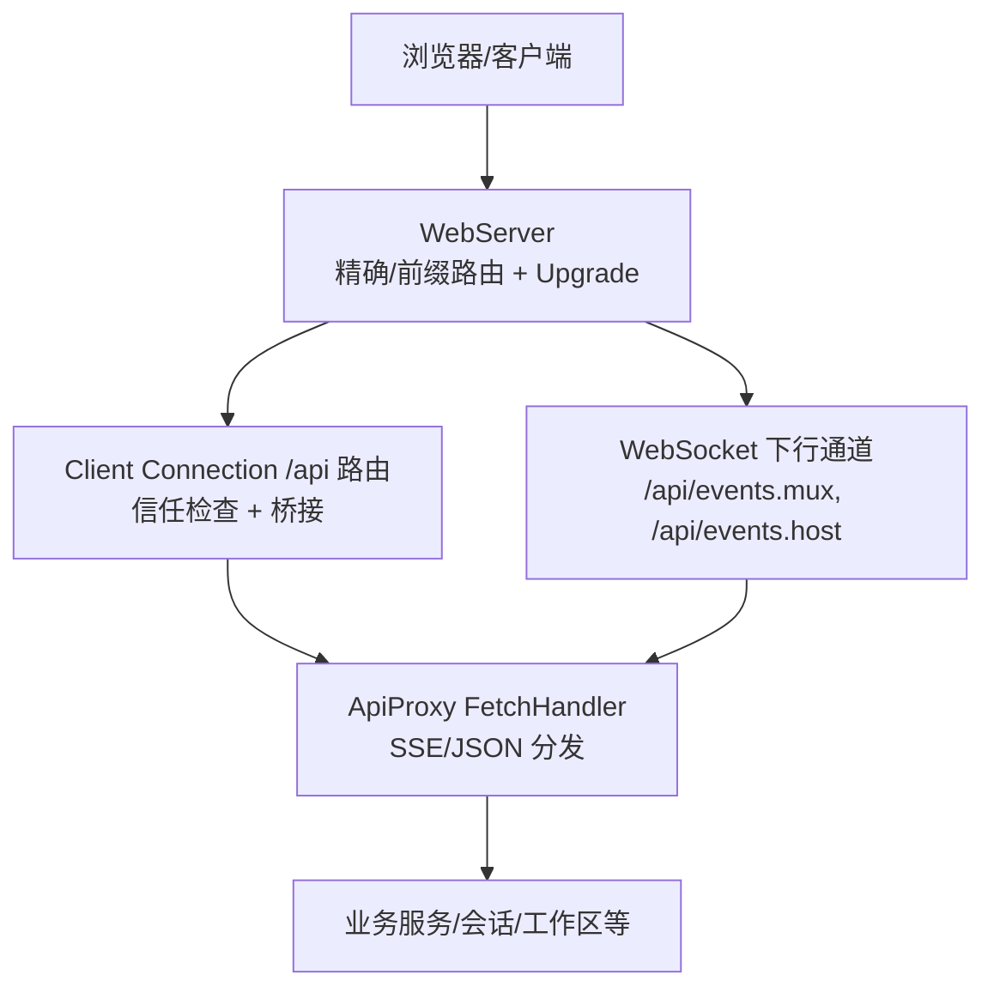
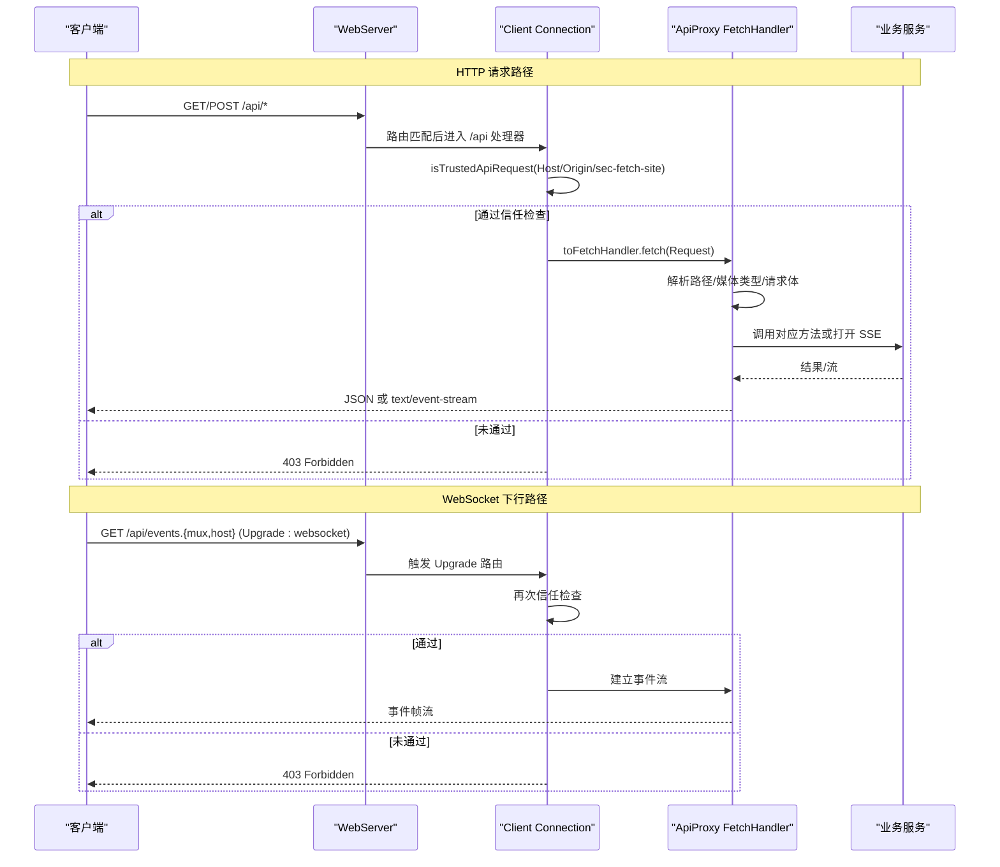
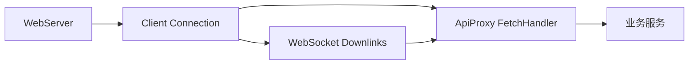
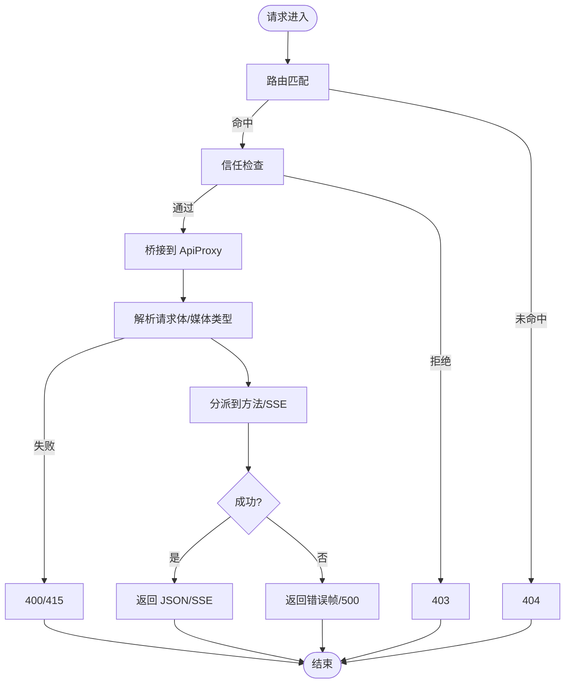

# 网络调试工具

<cite>
**本文引用的文件**
- [packages/host/webserver/src/index.ts](file://packages/host/webserver/src/index.ts)
- [packages/client/connection/src/index.ts](file://packages/client/connection/src/index.ts)
- [packages/client/connection/src/api-path.ts](file://packages/client/connection/src/api-path.ts)
- [packages/client/connection/src/api-request-trust.ts](file://packages/client/connection/src/api-request-trust.ts)
- [packages/host/apiproxy/src/fetch/handler.ts](file://packages/host/apiproxy/src/fetch/handler.ts)
- [packages/client/connection/src/websocket-downlink.ts](file://packages/client/connection/src/websocket-downlink.ts)
- [packages/client/connection/src/client/web-api-client.ts](file://packages/client/connection/src/client/web-api-client.ts)
- [docs/api-gateway.md](file://docs/api-gateway.md)
- [docs/subsystems/web-server.md](file://docs/subsystems/web-server.md)
</cite>

## 目录
1. [简介](#简介)
2. [项目结构](#项目结构)
3. [核心组件](#核心组件)
4. [架构总览](#架构总览)
5. [详细组件分析](#详细组件分析)
6. [依赖关系分析](#依赖关系分析)
7. [性能与可观测性](#性能与可观测性)
8. [故障诊断指南](#故障诊断指南)
9. [结论](#结论)
10. [附录：抓包与流量分析集成](#附录抓包与流量分析集成)

## 简介
本文件面向需要在 Harness 环境中进行网络调试的工程师，覆盖以下目标：
- HTTP 请求/响应调试：API 网关路由、请求拦截与校验、SSE/HTTP 流式响应。
- WebSocket 连接调试：事件下行通道升级、握手安全边界、断连与错误上报。
- 跨域与信任边界：同源校验、DNS 重绑定防护、受信主机白名单。
- 性能分析与超时问题定位：SSE 心跳、流式错误帧、Abort 信号传播。
- 抓包与流量分析：在浏览器端与 Node 侧分别可用的手段与注意事项。

## 项目结构
围绕网络调试的关键路径集中在以下模块：
- Web 服务器与路由注册：提供 HTTP 服务、精确匹配与最长前缀匹配、HTTP Upgrade 支持。
- 客户端连接桥接：将浏览器请求桥接到 Host 的 ApiProxy，并统一执行信任检查。
- API 代理处理：解析请求体、分发到具体方法、返回 SSE 或 JSON。
- WebSocket 下行通道：为事件流提供 WebSocket 升级路径与安全拒绝。
- 信任边界：对 Host、Origin、sec-fetch-site 等头部进行严格校验。

图表来源
- [packages/host/webserver/src/index.ts:147-238](file://packages/host/webserver/src/index.ts#L147-L238)
- [packages/client/connection/src/index.ts:130-195](file://packages/client/connection/src/index.ts#L130-L195)
- [packages/host/apiproxy/src/fetch/handler.ts:243-318](file://packages/host/apiproxy/src/fetch/handler.ts#L243-L318)
- [packages/client/connection/src/websocket-downlink.ts:118-153](file://packages/client/connection/src/websocket-downlink.ts#L118-L153)

章节来源
- [docs/subsystems/web-server.md:1-109](file://docs/subsystems/web-server.md#L1-L109)
- [docs/api-gateway.md:1-165](file://docs/api-gateway.md#L1-L165)

## 核心组件
- WebServer：负责监听、路由匹配、Upgrade 处理、异常兜底（400/404）与优雅关闭。
- Client Connection：挂载 /api 前缀路由，执行信任检查，桥接到 ApiProxy；同时注册 WebSocket 下行 Upgrade。
- ApiProxy FetchHandler：将 /api/* 映射为 RPC 调用，支持 SSE GET 流与 POST JSON 请求，统一错误封装。
- WebSocket Downlinks：管理 mux/host 两个事件通道的上行/下行泵送与失败帧发送。
- 信任检查：基于 Host、Origin、sec-fetch-site 的三重防线，防止 DNS 重绑定与跨站滥用。

章节来源
- [packages/host/webserver/src/index.ts:24-115](file://packages/host/webserver/src/index.ts#L24-L115)
- [packages/client/connection/src/index.ts:46-195](file://packages/client/connection/src/index.ts#L46-L195)
- [packages/host/apiproxy/src/fetch/handler.ts:74-192](file://packages/host/apiproxy/src/fetch/handler.ts#L74-L192)
- [packages/client/connection/src/websocket-downlink.ts:118-153](file://packages/client/connection/src/websocket-downlink.ts#L118-L153)
- [packages/client/connection/src/api-request-trust.ts:1-124](file://packages/client/connection/src/api-request-trust.ts#L1-L124)

## 架构总览
下图展示了从浏览器发起请求到服务端处理的完整链路，包括 HTTP 与 WebSocket 两条路径。

图表来源
- [packages/host/webserver/src/index.ts:147-238](file://packages/host/webserver/src/index.ts#L147-L238)
- [packages/client/connection/src/index.ts:130-195](file://packages/client/connection/src/index.ts#L130-L195)
- [packages/host/apiproxy/src/fetch/handler.ts:243-318](file://packages/host/apiproxy/src/fetch/handler.ts#L243-L318)
- [packages/client/connection/src/websocket-downlink.ts:118-153](file://packages/client/connection/src/websocket-downlink.ts#L118-L153)

## 详细组件分析

### HTTP 请求与响应调试
- 入口与路由
  - WebServer 提供精确匹配与最长前缀匹配，所有 /api 请求由 Client Connection 注册的 prefix 路由接管。
  - 未命中任何路由时返回 404；处理抛错时记录警告并返回 400，避免进程退出。
- 信任检查
  - 每个 /api 请求先执行 isTrustedApiRequest：校验 Host 是否为本机或受信主机；若携带 Origin，则必须与 Host 同源；sec-fetch-site=cross-site 一律拒绝。
  - 特权方法强制仅允许 loopback 访问。
- 请求体与媒体类型
  - POST 仅接受 application/json；非 JSON 返回 415；无法解析 JSON 返回 400。
  - 成功解析后按路径分派到 UNARY_ROUTES 表，再调用 ApiProxy 对应方法。
- 响应格式
  - 普通调用返回 JSON ServerResponse；流式调用以 SSE 形式返回，首行包含注释行用于保持代理存活。
- 调试要点
  - 观察状态码：400/403/404/415/500 的含义与触发条件。
  - 检查 Host/Origin/sec-fetch-site 是否符合预期。
  - 确认 Content-Type 是否为 application/json。
  - 对长耗时操作，关注 AbortSignal 是否被上游取消。

章节来源
- [packages/host/webserver/src/index.ts:147-180](file://packages/host/webserver/src/index.ts#L147-L180)
- [packages/client/connection/src/index.ts:130-173](file://packages/client/connection/src/index.ts#L130-L173)
- [packages/client/connection/src/api-request-trust.ts:90-124](file://packages/client/connection/src/api-request-trust.ts#L90-L124)
- [packages/host/apiproxy/src/fetch/handler.ts:273-318](file://packages/host/apiproxy/src/fetch/handler.ts#L273-L318)
- [packages/host/apiproxy/src/fetch/handler.ts:194-236](file://packages/host/apiproxy/src/fetch/handler.ts#L194-L236)

### API 网关请求跟踪
- 调用链
  - Client Remote 通过 connection.rpc.call('/api', '<namespace>/<method>', { args }, signal) 发起调用。
  - HTTP 载体将其映射为 POST /api/<namespace>/<method>，载荷仅含命名 args。
  - Gateway 解析描述符、校验参数、解析对象/上下文、调用服务、校验返回值。
- 可观测点
  - rpcId：贯穿请求与响应的关联标识，便于日志追踪。
  - 错误封装：业务错误以 200 + ServerResponse 返回；载体层错误使用 4xx/5xx。
  - 取消传播：最终参数为 AbortSignal 的方法会接收上游取消信号。

章节来源
- [docs/api-gateway.md:119-128](file://docs/api-gateway.md#L119-L128)
- [packages/host/apiproxy/src/fetch/handler.ts:178-192](file://packages/host/apiproxy/src/fetch/handler.ts#L178-L192)

### WebSocket 连接调试
- 升级路径
  - 浏览器 GET /api/events.mux 或 /api/events.host 会收到 426 Upgrade Required，提示升级为 WebSocket。
  - 实际 Upgrade 由 WebServer 的 upgrade 事件分发到已注册的 exact-path Upgrade 路由。
- 安全边界
  - 升级前同样执行 isTrustedApiRequest；不通过则直接返回 403。
- 数据流
  - 客户端通过 WebSocketDownlinks 维护上行帧发送与下行帧读取；发生错误时发送 failureFrame。
  - 客户端 web-api-client 中实现 readWebSocket 生成器，解析消息、抛出非法帧错误、处理关闭与中止。
- 调试要点
  - 检查 Upgrade 头与路径是否正确。
  - 关注 403 原因：Host/Origin/sec-fetch-site 是否满足要求。
  - 捕获 frame 解析错误与 socket close 事件，结合 rpcId 定位问题。

章节来源
- [packages/client/connection/src/index.ts:150-195](file://packages/client/connection/src/index.ts#L150-L195)
- [packages/client/connection/src/websocket-downlink.ts:118-153](file://packages/client/connection/src/websocket-downlink.ts#L118-L153)
- [packages/client/connection/src/client/web-api-client.ts:34-91](file://packages/client/connection/src/client/web-api-client.ts#L34-L91)
- [packages/client/connection/src/api-path.ts:1-14](file://packages/client/connection/src/api-path.ts#L1-L14)

### 网络请求拦截与修改
- 拦截点
  - WebServer 路由匹配前后：可用于记录请求/响应元信息（如路径、方法、状态码）。
  - Client Connection /api 处理器：可在桥接前后注入日志、限流、重试策略。
  - ApiProxy FetchHandler：可对请求体/响应体做二次包装（注意不要破坏契约）。
- 修改建议
  - 优先只读：记录请求/响应、耗时、错误堆栈。
  - 谨慎改写：仅在开发环境开启，生产环境默认关闭。
  - 保持契约：不得改变媒体类型、rpcId、方法名与载荷结构。

章节来源
- [packages/host/webserver/src/index.ts:147-238](file://packages/host/webserver/src/index.ts#L147-L238)
- [packages/client/connection/src/index.ts:130-173](file://packages/client/connection/src/index.ts#L130-L173)
- [packages/host/apiproxy/src/fetch/handler.ts:243-318](file://packages/host/apiproxy/src/fetch/handler.ts#L243-L318)

### 跨域请求与同源策略调试
- 同源判定
  - 通过 Host 与 Origin 规范化比较；sec-fetch-site=cross-site 一律拒绝。
  - 无 Origin 的请求仍可通过 Host 围栏（例如纯 HTTP 读取），但需确保 Host 可信。
- 常见现象
  - 403：Host 不可信或跨站标记。
  - 415：非 application/json 的写操作。
  - 426：事件路径需要 WebSocket 升级。
- 排障步骤
  - 确认部署 host/port 与 trustedHosts 配置一致。
  - 检查浏览器是否携带 Origin/sec-fetch-site，以及值是否与 Host 同源。
  - 对于跨源场景，考虑前置反向代理与 CORS 策略（不在本仓库内实现）。

章节来源
- [packages/client/connection/src/api-request-trust.ts:90-124](file://packages/client/connection/src/api-request-trust.ts#L90-L124)
- [packages/client/connection/src/index.ts:130-173](file://packages/client/connection/src/index.ts#L130-L173)

### 网络超时与取消
- 取消传播
  - 请求携带 AbortSignal；SSE 流与 RPC 调用均会响应取消。
  - 客户端在 abort 时主动关闭 WebSocket 连接。
- 超时表现
  - 上游取消会导致流提前结束；服务端可能发送 stream/error 帧。
  - 长时间无数据的 SSE 会发送注释行以保持代理存活。
- 排查建议
  - 在客户端打印 AbortSignal 的触发时机。
  - 在服务端记录流式错误帧与关闭原因。

章节来源
- [packages/client/connection/src/client/web-api-client.ts:66-73](file://packages/client/connection/src/client/web-api-client.ts#L66-L73)
- [packages/host/apiproxy/src/fetch/handler.ts:203-236](file://packages/host/apiproxy/src/fetch/handler.ts#L203-L236)

## 依赖关系分析

图表来源
- [packages/host/webserver/src/index.ts:147-238](file://packages/host/webserver/src/index.ts#L147-L238)
- [packages/client/connection/src/index.ts:130-195](file://packages/client/connection/src/index.ts#L130-L195)
- [packages/host/apiproxy/src/fetch/handler.ts:243-318](file://packages/host/apiproxy/src/fetch/handler.ts#L243-L318)
- [packages/client/connection/src/websocket-downlink.ts:118-153](file://packages/client/connection/src/websocket-downlink.ts#L118-L153)

章节来源
- [packages/host/webserver/src/index.ts:24-115](file://packages/host/webserver/src/index.ts#L24-L115)
- [packages/client/connection/src/index.ts:46-195](file://packages/client/connection/src/index.ts#L46-L195)

## 性能与可观测性
- 关键指标
  - 请求耗时：从 WebServer 进入路由到响应完成。
  - 流式延迟：SSE 首字节时间、增量帧间隔。
  - 错误率：4xx/5xx 比例、stream/error 帧频率。
- 采集位置
  - WebServer：请求进入/离开、Upgrade 生命周期。
  - Client Connection：信任检查耗时、桥接耗时。
  - ApiProxy：方法分派耗时、流式写入耗时。
- 优化建议
  - 减少大请求体：合理设置 maxRequestBodyBytes。
  - 复用连接：SSE/WebSocket 长连接避免频繁握手。
  - 控制并发：前端合理限制并行请求数。

[本节为通用指导，不直接分析具体文件]

## 故障诊断指南
- 常见问题与定位
  - 403 Forbidden：Host 不可信或跨站标记；检查 trustedHosts 与 Origin。
  - 404 Not Found：路径未注册或方法不存在；核对 /api 前缀与方法名。
  - 415 Unsupported Media Type：非 application/json；修正 Content-Type。
  - 426 Upgrade Required：事件路径需 WebSocket；改用 ws/wss。
  - 500 Handler Failure：后端实现崩溃；查看服务端日志与堆栈。
- 调试步骤
  - 抓取浏览器 Network 面板：查看请求头、响应头、状态码、响应体。
  - 检查 WebSocket 控制台：连接状态、消息内容、错误信息。
  - 服务端日志：关注 WebServer 的 warn/error 输出与 ApiProxy 的错误帧。
- 流程图：请求处理主流程

图表来源
- [packages/host/webserver/src/index.ts:147-180](file://packages/host/webserver/src/index.ts#L147-L180)
- [packages/client/connection/src/index.ts:130-173](file://packages/client/connection/src/index.ts#L130-L173)
- [packages/host/apiproxy/src/fetch/handler.ts:273-318](file://packages/host/apiproxy/src/fetch/handler.ts#L273-L318)

章节来源
- [packages/host/webserver/src/index.ts:147-180](file://packages/host/webserver/src/index.ts#L147-L180)
- [packages/host/apiproxy/src/fetch/handler.ts:178-192](file://packages/host/apiproxy/src/fetch/handler.ts#L178-L192)

## 结论
本仓库的网络栈以 WebServer 为入口，通过 Client Connection 的统一信任检查与桥接，将请求分发至 ApiProxy 的业务服务。HTTP 与 WebSocket 两条路径共享安全边界与可观测点，便于进行端到端的调试与性能分析。建议在开发与测试阶段充分利用日志、状态码与错误帧，快速定位问题根因。

[本节为总结性内容，不直接分析具体文件]

## 附录：抓包与流量分析集成
- 浏览器端
  - 使用开发者工具的 Network 面板与 WebSocket 控制台，过滤 /api 路径，查看请求/响应与帧内容。
  - 关注状态码、请求头（Host/Origin/sec-fetch-site）、Content-Type、响应体与 SSE 事件。
- Node 服务端
  - 在 WebServer 与 Client Connection 处添加日志，记录请求进入/离开、错误与取消事件。
  - 对 ApiProxy 的分发与流式写入增加耗时统计，识别瓶颈。
- 外部工具
  - 可使用系统级抓包工具（如 tcpdump、Wireshark）捕获本地回环或局域网流量，配合过滤器只看 /api 相关端口。
  - 对于反向代理后的部署，需在代理层开启访问日志，并与应用日志关联 rpcId。

[本节为通用指导，不直接分析具体文件]