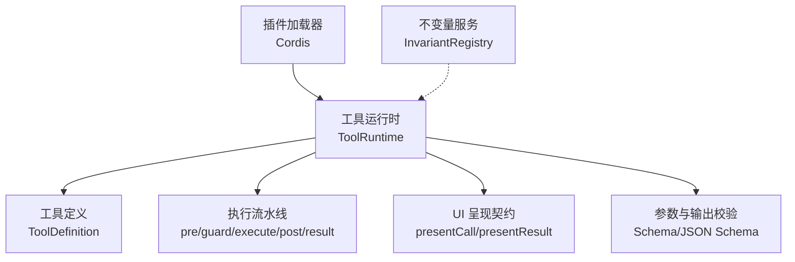
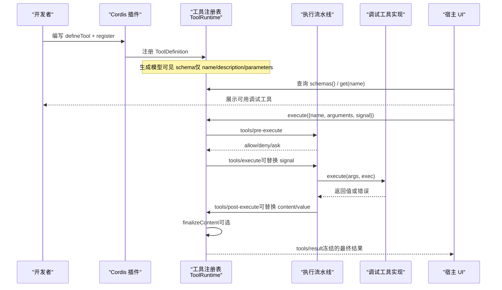
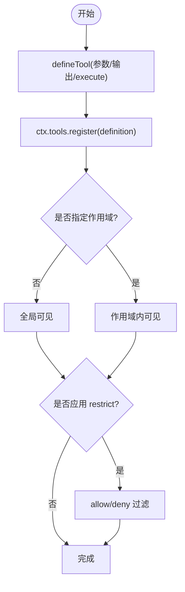
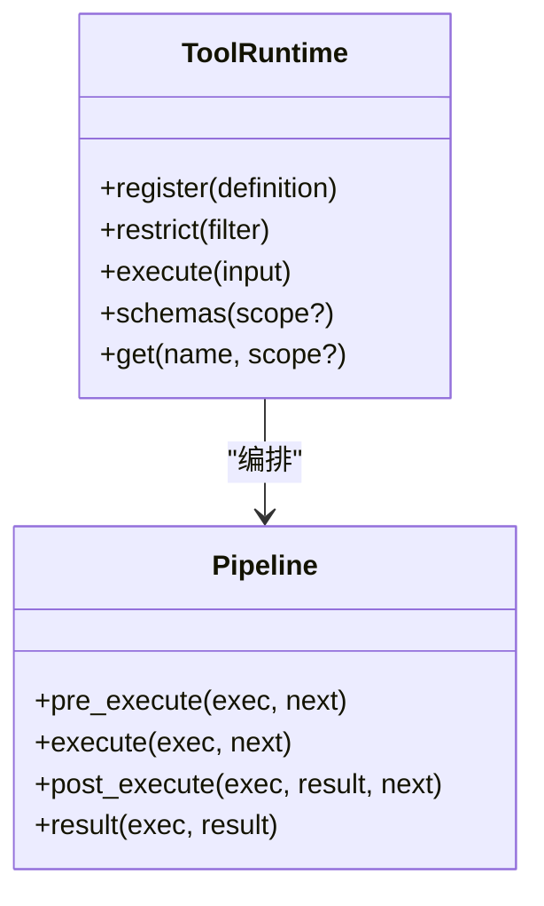
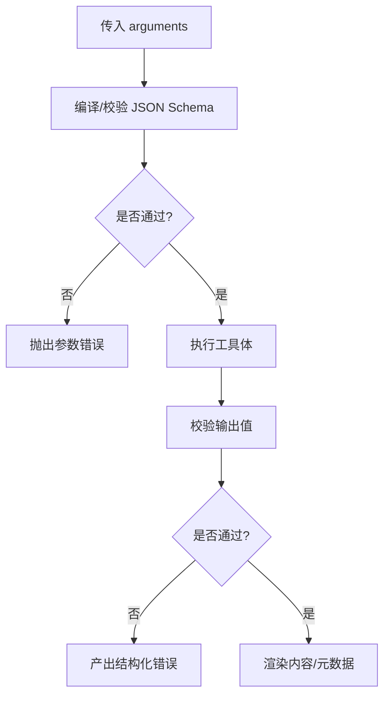
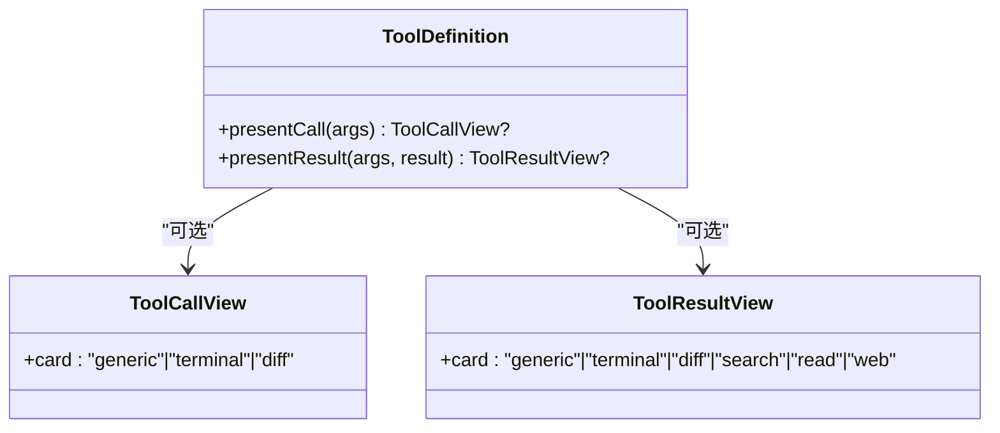
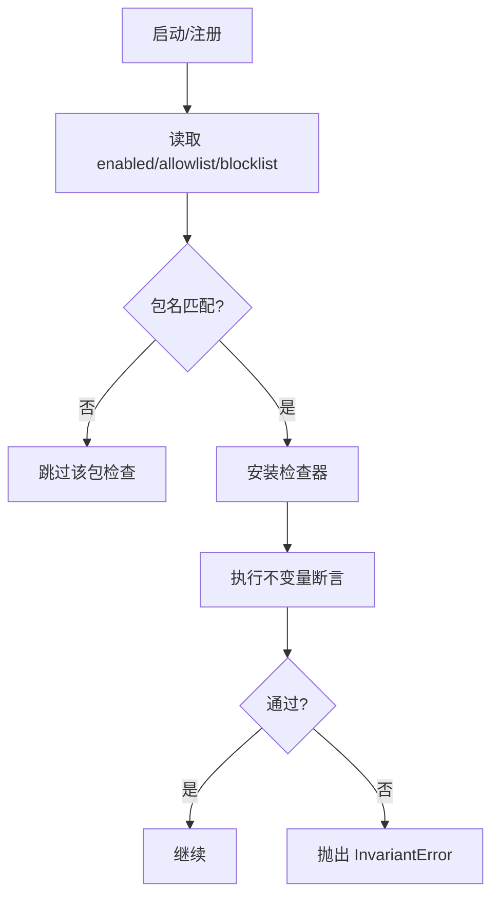
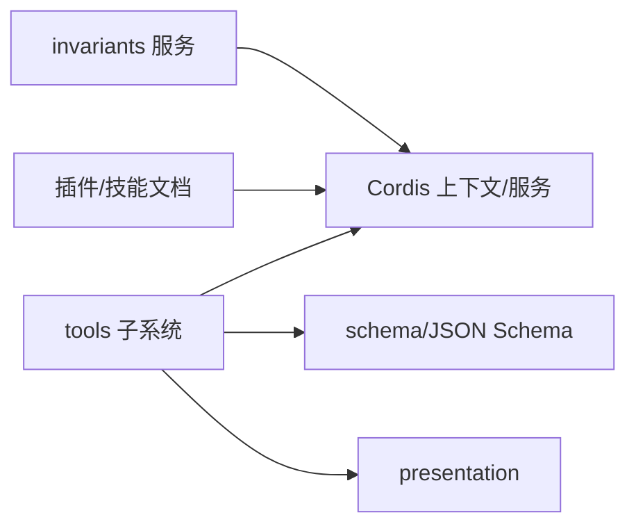

# 自定义调试工具

<cite>
**本文引用的文件**
- [packages/core/tools/src/index.ts](file://packages/core/tools/src/index.ts)
- [packages/core/tools/src/schema.ts](file://packages/core/tools/src/schema.ts)
- [packages/core/tools/src/presentation.ts](file://packages/core/tools/src/presentation.ts)
- [packages/core/tools/src/code-mode.ts](file://packages/core/tools/src/code-mode.ts)
- [packages/runtime-diagnostics/invariants/src/index.ts](file://packages/runtime-diagnostics/invariants/src/index.ts)
- [docs/subsystems/tools.md](file://docs/subsystems/tools.md)
- [docs/cordis-api/registry.zh.md](file://docs/cordis-api/registry.zh.md)
- [docs/cordis-tutorial/01-first-plugin.md](file://docs/cordis-tutorial/01-first-plugin.md)
- [apps/cli/config/agent-presets/cordis/skills/cordis-plugin-development/SKILL.md](file://apps/cli/config/agent-presets/cordis/skills/cordis-plugin-development/SKILL.md)
- [packages/session-query/tool-session-query/tests/tool-session-query.spec.ts](file://packages/session-query/tool-session-query/tests/tool-session-query.spec.ts)
- [packages/extensions/cordis-host-runner/tests/sandbox-context.spec.ts](file://packages/extensions/cordis-host-runner/tests/sandbox-context.spec.ts)
</cite>

## 目录
1. [简介](#简介)
2. [项目结构](#项目结构)
3. [核心组件](#核心组件)
4. [架构总览](#架构总览)
5. [详细组件分析](#详细组件分析)
6. [依赖分析](#依赖分析)
7. [性能考虑](#性能考虑)
8. [故障排查指南](#故障排查指南)
9. [结论](#结论)
10. [附录](#附录)

## 简介
本指南面向希望为系统开发“自定义调试工具”的开发者。调试工具本质上是可注册、可执行、可呈现的工具（Tool），通过统一的工具注册表与执行管线接入系统，既能被模型调用，也能在 UI 中以卡片形式展示运行状态与结果。本文从架构设计、接口规范、模板示例、注册配置、最佳实践到测试验证，提供端到端的开发路径。

## 项目结构
围绕调试工具的核心代码集中在工具子系统与运行时诊断子系统：
- 工具子系统负责工具定义、注册、执行流水线、参数校验、输出渲染与 UI 呈现契约。
- 运行时诊断子系统提供可插拔的不变量检查服务，便于在调试阶段快速发现异常。
- Cordis 插件体系用于以插件方式挂载调试工具与服务，支持生命周期管理与依赖注入。

图表来源
- [packages/core/tools/src/index.ts:1-200](file://packages/core/tools/src/index.ts#L1-L200)
- [packages/core/tools/src/schema.ts:1-200](file://packages/core/tools/src/schema.ts#L1-L200)
- [packages/runtime-diagnostics/invariants/src/index.ts:1-201](file://packages/runtime-diagnostics/invariants/src/index.ts#L1-L201)

章节来源
- [docs/subsystems/tools.md:1-120](file://docs/subsystems/tools.md#L1-L120)
- [docs/cordis-tutorial/01-first-plugin.md:1-96](file://docs/cordis-tutorial/01-first-plugin.md#L1-L96)

## 核心组件
- 工具定义与注册
  - 使用统一 DSL 声明参数与输出类型，并通过 defineTool 创建 ToolDefinition。
  - 通过 ctx.tools.register 注册到全局或作用域内；可通过 restrict 进行可见性过滤。
- 执行流水线
  - pre-execute：允许/拒绝/请求审批。
  - guard：单调守卫，只能减少权限。
  - execute：around-dispatch 包装（超时、重试、指标）。
  - post-execute：接受/替换/增强/阻断结果。
  - result：最终不可变结果通知。
- 参数与输出校验
  - 基于 JSON Schema 子集与作者 DSL，编译并严格校验输入与输出。
- UI 呈现
  - presentCall/presentResult 返回中性呈现意图（通用、终端、差异、搜索、读取、Web），由宿主渲染。
- 不变量检查
  - InvariantRegistry 提供按包名白名单/黑名单启用的运行时不变量检查，失败抛出 InvariantError。

章节来源
- [packages/core/tools/src/index.ts:1-200](file://packages/core/tools/src/index.ts#L1-L200)
- [packages/core/tools/src/schema.ts:1-200](file://packages/core/tools/src/schema.ts#L1-L200)
- [packages/runtime-diagnostics/invariants/src/index.ts:1-201](file://packages/runtime-diagnostics/invariants/src/index.ts#L1-L201)
- [docs/subsystems/tools.md:100-470](file://docs/subsystems/tools.md#L100-L470)

## 架构总览
下图展示了自定义调试工具从注册到执行的完整流程，以及各扩展点如何参与。

图表来源
- [packages/core/tools/src/index.ts:140-200](file://packages/core/tools/src/index.ts#L140-L200)
- [docs/subsystems/tools.md:170-405](file://docs/subsystems/tools.md#L170-L405)

## 详细组件分析

### 组件A：调试工具定义与注册
- 使用 defineTool 声明参数与输出，自动推断 TypeScript 类型并编译为 JSON Schema。
- 通过 ctx.tools.register 注册，支持作用域覆盖与限制（allow/deny）。
- 工具名称唯一，重复注册会失败；reserved 名称（如 run_code）受保护。

图表来源
- [packages/core/tools/src/schema.ts:1-200](file://packages/core/tools/src/schema.ts#L1-L200)
- [packages/core/tools/src/index.ts:480-570](file://packages/core/tools/src/index.ts#L480-L570)
- [docs/subsystems/tools.md:150-170](file://docs/subsystems/tools.md#L150-L170)

章节来源
- [packages/core/tools/src/schema.ts:1-200](file://packages/core/tools/src/schema.ts#L1-L200)
- [packages/core/tools/src/index.ts:480-570](file://packages/core/tools/src/index.ts#L480-L570)
- [docs/subsystems/tools.md:150-170](file://docs/subsystems/tools.md#L150-L170)

### 组件B：执行流水线与扩展点
- pre-execute：可在调度前进行策略判断（允许/拒绝/请求审批）。
- guard：单调守卫，只能拒绝不能放行。
- execute：around-dispatch，适合实现超时、重试、指标收集等横切逻辑。
- post-execute：可对结果进行内容或值替换、附加上下文或阻断。
- result：最终不可变结果的观察者事件。

图表来源
- [packages/core/tools/src/index.ts:140-200](file://packages/core/tools/src/index.ts#L140-L200)
- [docs/subsystems/tools.md:170-405](file://docs/subsystems/tools.md#L170-L405)

章节来源
- [packages/core/tools/src/index.ts:140-200](file://packages/core/tools/src/index.ts#L140-L200)
- [docs/subsystems/tools.md:170-405](file://docs/subsystems/tools.md#L170-L405)

### 组件C：参数与输出校验（Schema/JSON Schema）
- 作者 DSL 将参数与输出描述编译为 JSON Schema 子集，确保强类型与一致性。
- 输入不合法抛出工具参数错误；输出不合法走工具错误路径。
- 支持 oneOf、enum、const、对象开放性与 items 等约束。

图表来源
- [packages/core/tools/src/schema.ts:1-200](file://packages/core/tools/src/schema.ts#L1-L200)
- [docs/subsystems/tools.md:98-152](file://docs/subsystems/tools.md#L98-L152)

章节来源
- [packages/core/tools/src/schema.ts:1-200](file://packages/core/tools/src/schema.ts#L1-L200)
- [docs/subsystems/tools.md:98-152](file://docs/subsystems/tools.md#L98-L152)

### 组件D：UI 呈现契约
- presentCall：展示待执行状态（通用、终端、差异等）。
- presentResult：展示完成状态（终端输出、差异、搜索、读取、Web 检索等）。
- 呈现意图与宿主解耦，宿主根据能力选择渲染。

图表来源
- [packages/core/tools/src/presentation.ts](file://packages/core/tools/src/presentation.ts)
- [docs/subsystems/tools.md:459-468](file://docs/subsystems/tools.md#L459-L468)

章节来源
- [packages/core/tools/src/presentation.ts](file://packages/core/tools/src/presentation.ts)
- [docs/subsystems/tools.md:459-468](file://docs/subsystems/tools.md#L459-L468)

### 组件E：运行时不变量检查（Invariants）
- 通过 InvariantRegistry 按包名启用/禁用检查，支持白名单与黑名单。
- 违反不变量时抛出 InvariantError，包含包名与消息，便于定位。
- 适用于调试期强化契约与快速失败。

图表来源
- [packages/runtime-diagnostics/invariants/src/index.ts:1-201](file://packages/runtime-diagnostics/invariants/src/index.ts#L1-L201)

章节来源
- [packages/runtime-diagnostics/invariants/src/index.ts:1-201](file://packages/runtime-diagnostics/invariants/src/index.ts#L1-L201)

## 依赖分析
- 工具子系统依赖 Cordis 上下文与服务机制，通过 ctx.tools 暴露 API。
- 参数与输出校验依赖 JSON Schema 子集与作者 DSL。
- 不变量服务作为独立 Service，通过配置控制启用范围。
- 插件开发技能文档强调副作用管理、定时器与依赖注入的正确用法。

图表来源
- [packages/core/tools/src/index.ts:1-200](file://packages/core/tools/src/index.ts#L1-L200)
- [packages/runtime-diagnostics/invariants/src/index.ts:1-201](file://packages/runtime-diagnostics/invariants/src/index.ts#L1-L201)
- [apps/cli/config/agent-presets/cordis/skills/cordis-plugin-development/SKILL.md:127-193](file://apps/cli/config/agent-presets/cordis/skills/cordis-plugin-development/SKILL.md#L127-L193)

章节来源
- [packages/core/tools/src/index.ts:1-200](file://packages/core/tools/src/index.ts#L1-L200)
- [packages/runtime-diagnostics/invariants/src/index.ts:1-201](file://packages/runtime-diagnostics/invariants/src/index.ts#L1-L201)
- [apps/cli/config/agent-presets/cordis/skills/cordis-plugin-development/SKILL.md:127-193](file://apps/cli/config/agent-presets/cordis/skills/cordis-plugin-development/SKILL.md#L127-L193)

## 性能考虑
- 合理设置 timeoutMs，避免长时间阻塞；在工具体内响应取消信号。
- isConcurrencySafe 仅在纯分类且无共享可变状态时使用，避免竞态。
- 使用 finalizeContent 对大内容进行裁剪或摘要，降低持久化与传输成本。
- 在 post-execute 中谨慎替换 value/content，避免重复计算与序列化开销。
- 利用 tools/execute 包装统一处理超时与重试，减少重复逻辑。

[本节为通用指导，无需特定文件引用]

## 故障排查指南
- 未知工具：执行未注册工具会返回 UNKNOWN_TOOL 结构化错误。
- 参数非法：参数校验失败抛出工具参数错误，进入工具错误路径。
- 输出非法：工具体返回值不符合输出 schema，会被规范化为错误结果。
- 监听器异常：tools/result 监听器抛错会被捕获并记录，不影响主流程。
- 不变量失败：违反不变量抛出 InvariantError，包含包名与消息，便于定位。

章节来源
- [packages/core/tools/tests/tools.spec.ts:630-665](file://packages/core/tools/tests/tools.spec.ts#L630-L665)
- [packages/core/tools/tests/tools.spec.ts:2432-2449](file://packages/core/tools/tests/tools.spec.ts#L2432-L2449)
- [packages/core/tools/src/index.ts:1656-1676](file://packages/core/tools/src/index.ts#L1656-L1676)
- [packages/runtime-diagnostics/invariants/src/index.ts:49-66](file://packages/runtime-diagnostics/invariants/src/index.ts#L49-L66)

## 结论
自定义调试工具通过统一的工具注册表与执行流水线接入系统，具备强类型参数与输出校验、可扩展的执行钩子、以及与宿主解耦的 UI 呈现契约。结合 Cordis 插件体系与不变量服务，可以在开发调试阶段快速发现问题并确保契约稳定。遵循本文的最佳实践与测试方法，能够高效构建可维护、可观测、可演进的调试工具。

[本节为总结性内容，无需特定文件引用]

## 附录

### 开发模板与步骤
- 第一步：定义工具
  - 使用 defineTool 声明 parameters 与 output，实现 execute。
  - 可选实现 presentCall/presentResult 以定制 UI。
- 第二步：注册工具
  - 在插件 apply 中调用 ctx.tools.register(definition)。
  - 如需作用域隔离，使用 scoped 注册或 restrict 过滤。
- 第三步：配置与启用
  - 通过 Cordis 配置文件组合插件。
  - 如需开启不变量检查，配置 InvariantRegistry 的 enabled/allowlist/blocklist。
- 第四步：测试与验证
  - 使用 ctx.tools.execute 模拟调用，断言结果与呈现。
  - 借助 tools/change、tools/result 事件观察注册与执行。
  - 参考现有工具的测试用例与快照。

章节来源
- [docs/cordis-tutorial/01-first-plugin.md:1-96](file://docs/cordis-tutorial/01-first-plugin.md#L1-L96)
- [packages/session-query/tool-session-query/tests/tool-session-query.spec.ts:236-262](file://packages/session-query/tool-session-query/tests/tool-session-query.spec.ts#L236-L262)
- [packages/extensions/cordis-host-runner/tests/sandbox-context.spec.ts:207-238](file://packages/extensions/cordis-host-runner/tests/sandbox-context.spec.ts#L207-L238)

### 最佳实践与设计模式
- 单一职责：每个工具聚焦一个明确的调试能力。
- 幂等与可重放：presentCall/presentResult 应为纯函数，仅依赖 args。
- 安全与最小权限：通过 restrict 与 guard 限制工具可见性与执行条件。
- 资源清理：在插件中使用 ctx.effect 管理订阅与定时器，确保卸载时释放。
- 可观测性：利用 tools/execute 与 tools/result 统一埋点与日志。

章节来源
- [apps/cli/config/agent-presets/cordis/skills/cordis-plugin-development/SKILL.md:127-193](file://apps/cli/config/agent-presets/cordis/skills/cordis-plugin-development/SKILL.md#L127-L193)
- [docs/cordis-api/registry.zh.md:10-34](file://docs/cordis-api/registry.zh.md#L10-L34)

### 集成与配置要点
- 插件入口：导出 name 与 apply，或通过类继承 Service 注册服务。
- 依赖注入：使用 inject 声明必需服务，或使用 ctx.get 获取可选服务。
- 系统提示：非 native 模式下，工具会在系统提示中折叠与 SDK 说明。
- 代码模式：run_code 子调度的日志可通过 tools/code-dispatch-log 替换。

章节来源
- [packages/core/tools/src/index.ts:30-63](file://packages/core/tools/src/index.ts#L30-L63)
- [packages/core/tools/src/code-mode.ts:146-177](file://packages/core/tools/src/code-mode.ts#L146-L177)
- [docs/cordis-api/registry.zh.md:10-34](file://docs/cordis-api/registry.zh.md#L10-L34)