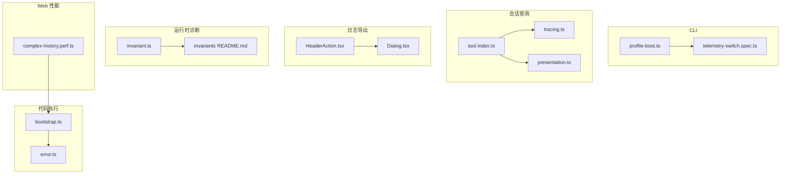
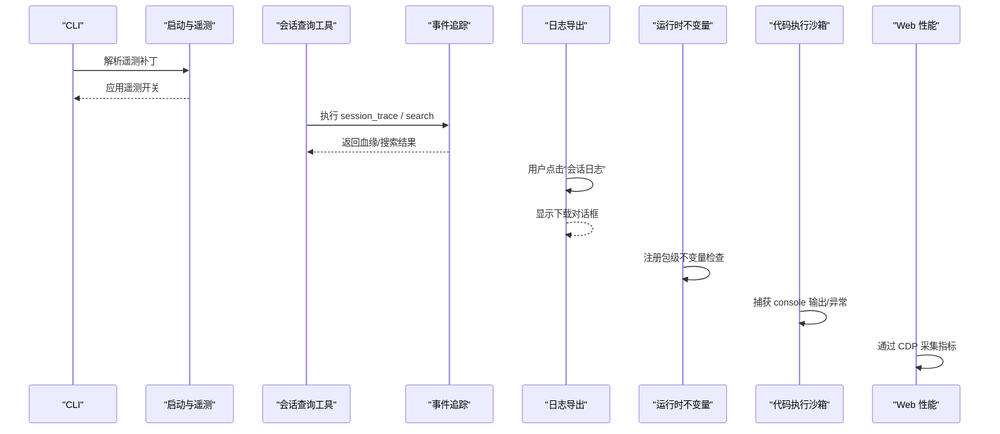
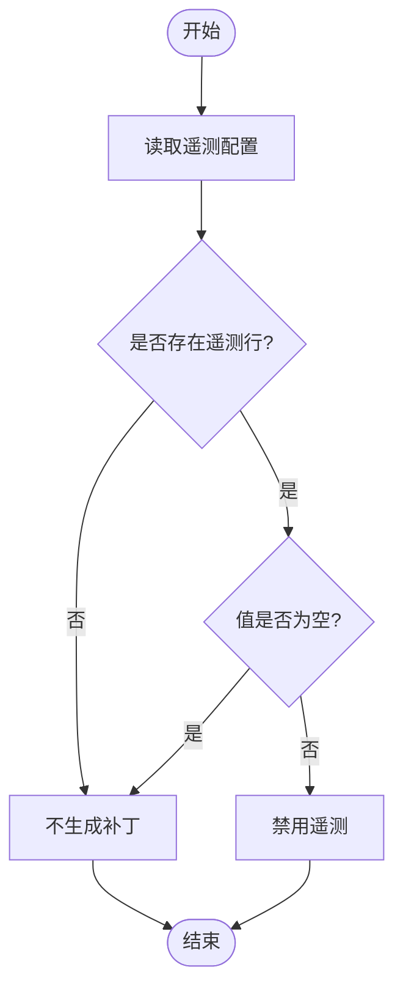
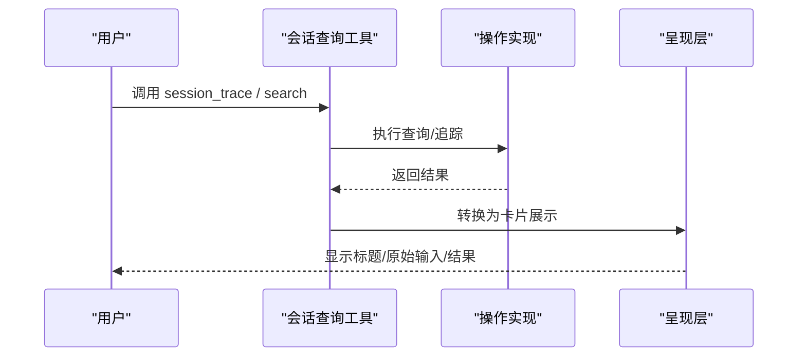
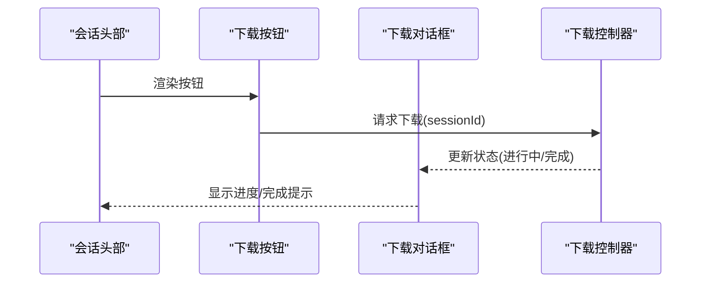
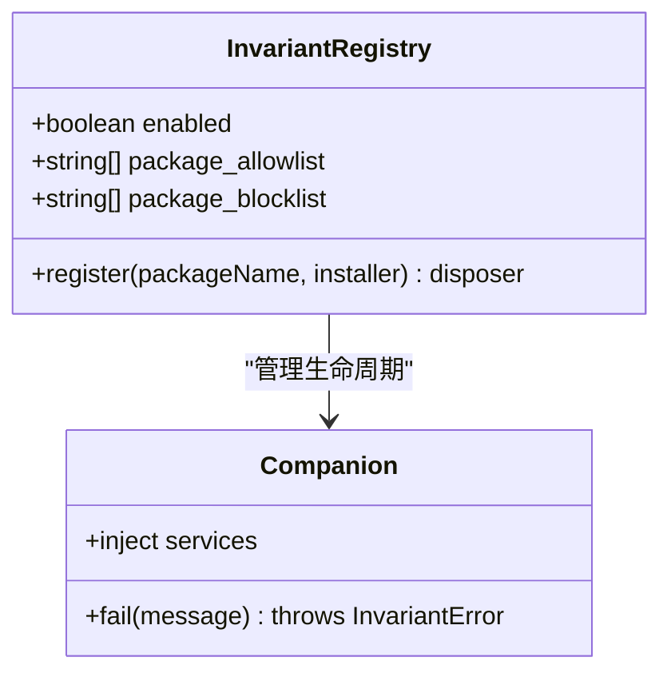
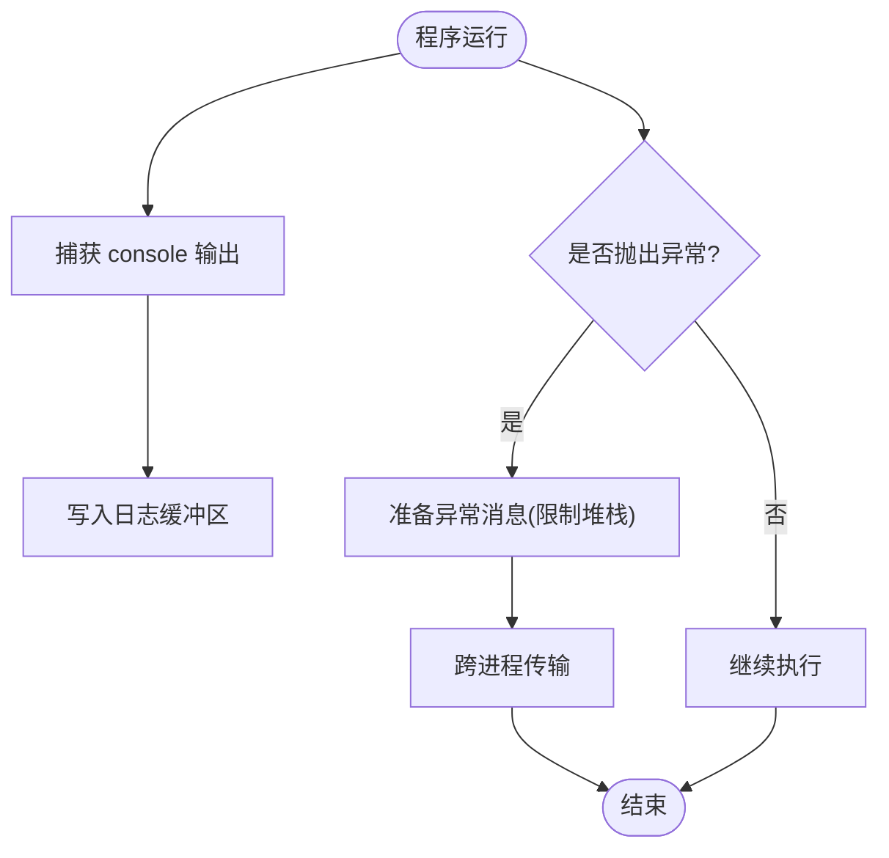
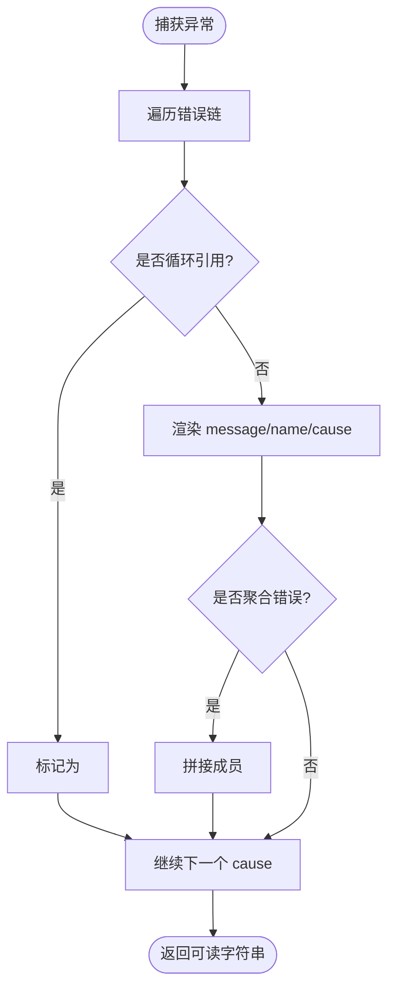
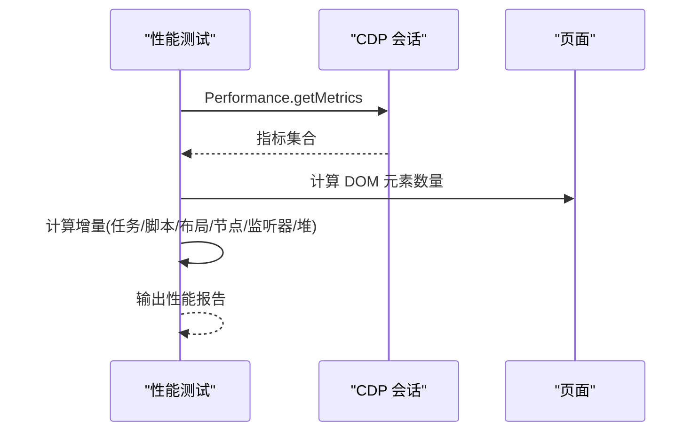
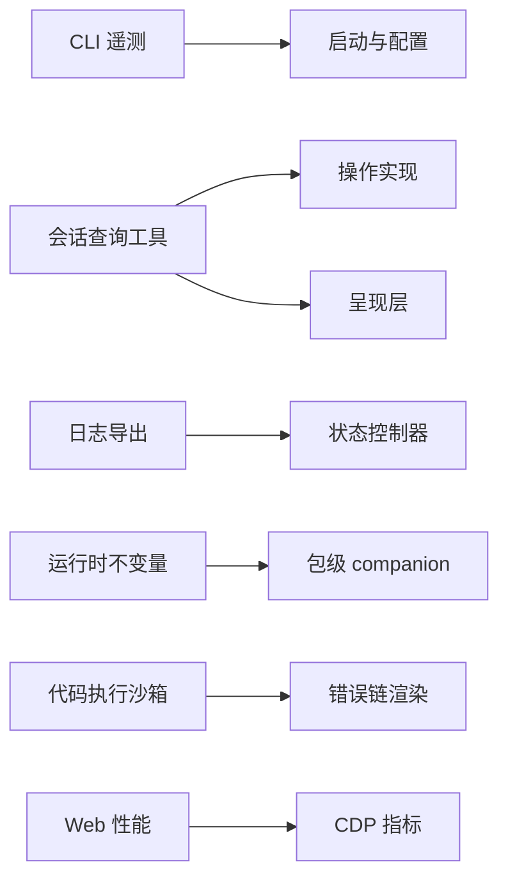

# 调试工具

<cite>
**本文引用的文件**
- [profile-boot.ts](file://apps/cli/src/profile-boot.ts)
- [telemetry-switch.spec.ts](file://apps/cli/tests/telemetry-switch.spec.ts)
- [tracing.ts](file://packages/session-query/session-query/src/tracing.ts)
- [presentation.ts](file://packages/session-query/tool-session-query/src/presentation.ts)
- [index.ts](file://packages/session-query/tool-session-query/src/index.ts)
- [HeaderAction.tsx](file://packages/session-query/session-log-export/src/client/HeaderAction.tsx)
- [Dialog.tsx](file://packages/session-query/session-log-export/src/client/Dialog.tsx)
- [invariant.ts](file://packages/runtime-diagnostics/invariants/src/invariant.ts)
- [README.md](file://packages/runtime-diagnostics/invariants/README.md)
- [bootstrap.ts](file://packages/code-runtime/code-runtime-worker-thread/src/bootstrap.ts)
- [error.ts](file://packages/llm/llm/src/error.ts)
- [complex-history.perf.ts](file://apps/web/tests/complex-history.perf.ts)
</cite>

## 目录
1. [简介](#简介)
2. [项目结构](#项目结构)
3. [核心组件](#核心组件)
4. [架构总览](#架构总览)
5. [详细组件分析](#详细组件分析)
6. [依赖关系分析](#依赖关系分析)
7. [性能考量](#性能考量)
8. [故障排查指南](#故障排查指南)
9. [结论](#结论)
10. [附录](#附录)

## 简介
本文件面向开发者与测试工程师，系统化梳理 deepseek-harness 的调试与诊断能力，覆盖以下主题：
- 内置调试工具：会话追踪、事件溯源、日志导出、运行时不变量检查、错误链渲染。
- 性能分析：浏览器指标采集、内存与任务耗时度量、压力测试入口。
- 日志分析：会话日志下载、事件搜索、会话血缘追踪。
- 调试模式与配置：遥测开关、配置文件注入、最小化配置。
- 浏览器开发者工具集成：CDP 指标、堆快照、事件监听器统计。
- 自定义调试工具：基于工具注册机制扩展查询与导出能力。
- 最佳实践：问题定位流程、可观测性设计原则、避免过度开销。

## 项目结构
仓库将调试与诊断能力分散在多个包中，按职责划分：
- CLI 启动与遥测控制：通过 CLI 层解析并应用遥测补丁，支持按需禁用遥测。
- 会话查询与追踪：提供会话与事件搜索、会话血缘追踪、调用卡片展示。
- 会话日志导出：在 Web UI 中提供“会话日志”下载按钮与对话框。
- 运行时不变量：可配置的不变量注册服务，用于校验关键运行时契约。
- 代码执行沙箱：控制台输出捕获、异常准备、绑定错误类生成。
- LLM 错误链：统一渲染错误链，兼容循环引用与聚合错误。
- Web 性能测试：通过 CDP 采集 Chromium 指标，计算增量与保留状态。

**图表来源**
- [profile-boot.ts:1-200](file://apps/cli/src/profile-boot.ts#L1-L200)
- [telemetry-switch.spec.ts:1-22](file://apps/cli/tests/telemetry-switch.spec.ts#L1-L22)
- [tracing.ts:58-91](file://packages/session-query/session-query/src/tracing.ts#L58-L91)
- [presentation.ts:207-255](file://packages/session-query/tool-session-query/src/presentation.ts#L207-L255)
- [index.ts:66-94](file://packages/session-query/tool-session-query/src/index.ts#L66-L94)
- [HeaderAction.tsx:1-31](file://packages/session-query/session-log-export/src/client/HeaderAction.tsx#L1-L31)
- [Dialog.tsx:1-27](file://packages/session-query/session-log-export/src/client/Dialog.tsx#L1-L27)
- [invariant.ts:1-200](file://packages/runtime-diagnostics/invariants/src/invariant.ts#L1-L200)
- [README.md:1-86](file://packages/runtime-diagnostics/invariants/README.md#L1-L86)
- [bootstrap.ts:103-120](file://packages/code-runtime/code-runtime-worker-thread/src/bootstrap.ts#L103-L120)
- [bootstrap.ts:208-275](file://packages/code-runtime/code-runtime-worker-thread/src/bootstrap.ts#L208-L275)
- [error.ts:102-163](file://packages/llm/llm/src/error.ts#L102-L163)
- [complex-history.perf.ts:515-568](file://apps/web/tests/complex-history.perf.ts#L515-L568)

**章节来源**
- [profile-boot.ts:1-200](file://apps/cli/src/profile-boot.ts#L1-L200)
- [telemetry-switch.spec.ts:1-22](file://apps/cli/tests/telemetry-switch.spec.ts#L1-L22)
- [tracing.ts:58-91](file://packages/session-query/session-query/src/tracing.ts#L58-L91)
- [presentation.ts:207-255](file://packages/session-query/tool-session-query/src/presentation.ts#L207-L255)
- [index.ts:66-94](file://packages/session-query/tool-session-query/src/index.ts#L66-L94)
- [HeaderAction.tsx:1-31](file://packages/session-query/session-log-export/src/client/HeaderAction.tsx#L1-L31)
- [Dialog.tsx:1-27](file://packages/session-query/session-log-export/src/client/Dialog.tsx#L1-L27)
- [invariant.ts:1-200](file://packages/runtime-diagnostics/invariants/src/invariant.ts#L1-L200)
- [README.md:1-86](file://packages/runtime-diagnostics/invariants/README.md#L1-L86)
- [bootstrap.ts:103-120](file://packages/code-runtime/code-runtime-worker-thread/src/bootstrap.ts#L103-L120)
- [bootstrap.ts:208-275](file://packages/code-runtime/code-runtime-worker-thread/src/bootstrap.ts#L208-L275)
- [error.ts:102-163](file://packages/llm/llm/src/error.ts#L102-L163)
- [complex-history.perf.ts:515-568](file://apps/web/tests/complex-history.perf.ts#L515-L568)

## 核心组件
- 遥测开关（CLI）：通过 CLI 层解析遥测补丁，支持硬禁用开关；当存在遥测行时，任何非空值都会禁用遥测。
- 会话与事件追踪：提供 session_trace、session_search、session_event_search 等工具，支持会话血缘与事件溯源。
- 会话日志导出：在会话头部提供“会话日志”下载按钮，弹出对话框显示下载状态。
- 运行时不变量：可配置的服务，允许包级注册不变量检查，支持白名单/黑名单过滤。
- 控制台与异常处理：沙箱内使用受限 console 输出到缓冲区；异常准备限制堆栈长度，避免跨进程传输过大数据。
- 错误链渲染：统一渲染错误链，兼容循环引用与聚合错误，屏蔽不可渲染值。
- Web 性能指标：通过 CDP 获取 Chromium 指标，计算任务耗时、脚本耗时、布局耗时、节点数、事件监听器数量、堆大小等。

**章节来源**
- [telemetry-switch.spec.ts:1-22](file://apps/cli/tests/telemetry-switch.spec.ts#L1-L22)
- [index.ts:66-94](file://packages/session-query/tool-session-query/src/index.ts#L66-L94)
- [HeaderAction.tsx:1-31](file://packages/session-query/session-log-export/src/client/HeaderAction.tsx#L1-L31)
- [README.md:1-86](file://packages/runtime-diagnostics/invariants/README.md#L1-L86)
- [bootstrap.ts:103-120](file://packages/code-runtime/code-runtime-worker-thread/src/bootstrap.ts#L103-L120)
- [bootstrap.ts:208-275](file://packages/code-runtime/code-runtime-worker-thread/src/bootstrap.ts#L208-L275)
- [error.ts:102-163](file://packages/llm/llm/src/error.ts#L102-L163)
- [complex-history.perf.ts:515-568](file://apps/web/tests/complex-history.perf.ts#L515-L568)

## 架构总览
下图展示了从 CLI 遥测控制到会话查询、日志导出、运行时不变量、代码执行与 Web 性能的协作关系。

**图表来源**
- [profile-boot.ts:1-200](file://apps/cli/src/profile-boot.ts#L1-L200)
- [index.ts:66-94](file://packages/session-query/tool-session-query/src/index.ts#L66-L94)
- [tracing.ts:58-91](file://packages/session-query/session-query/src/tracing.ts#L58-L91)
- [HeaderAction.tsx:1-31](file://packages/session-query/session-log-export/src/client/HeaderAction.tsx#L1-L31)
- [README.md:1-86](file://packages/runtime-diagnostics/invariants/README.md#L1-L86)
- [bootstrap.ts:103-120](file://packages/code-runtime/code-runtime-worker-thread/src/bootstrap.ts#L103-L120)
- [complex-history.perf.ts:515-568](file://apps/web/tests/complex-history.perf.ts#L515-L568)

## 详细组件分析

### 遥测开关与调试模式
- 功能要点：
  - CLI 层提供遥测补丁解析逻辑，支持硬禁用开关。
  - 当遥测行存在时，任何非空值均会禁用遥测；若无遥测行则不产生补丁。
- 启用方法：
  - 在 CLI 启动参数或配置中设置遥测相关字段，结合 profile-boot 的解析逻辑生效。
- 配置选项：
  - 遥测开关为布尔或字符串形式的开关，具体行为由解析函数决定。
- 注意事项：
  - 无遥测行的组合不会触发补丁，避免误改默认行为。

**图表来源**
- [telemetry-switch.spec.ts:1-22](file://apps/cli/tests/telemetry-switch.spec.ts#L1-L22)
- [profile-boot.ts:1-200](file://apps/cli/src/profile-boot.ts#L1-L200)

**章节来源**
- [telemetry-switch.spec.ts:1-22](file://apps/cli/tests/telemetry-switch.spec.ts#L1-L22)
- [profile-boot.ts:1-200](file://apps/cli/src/profile-boot.ts#L1-L200)

### 会话查询与事件追踪
- 功能要点：
  - 提供 session_search、session_event_search、session_trace 等工具，支持会话与事件检索、血缘追踪。
  - 呈现层将调用转换为通用卡片，便于理解与回放。
- 使用方式：
  - 在会话中调用工具进行历史会话搜索或当前会话事件追踪。
- 输出说明：
  - 文本输出与调用卡片展示，包含原始输入与结果摘要。

**图表来源**
- [index.ts:66-94](file://packages/session-query/tool-session-query/src/index.ts#L66-L94)
- [presentation.ts:207-255](file://packages/session-query/tool-session-query/src/presentation.ts#L207-L255)
- [tracing.ts:58-91](file://packages/session-query/session-query/src/tracing.ts#L58-L91)

**章节来源**
- [index.ts:66-94](file://packages/session-query/tool-session-query/src/index.ts#L66-L94)
- [presentation.ts:207-255](file://packages/session-query/tool-session-query/src/presentation.ts#L207-L255)
- [tracing.ts:58-91](file://packages/session-query/session-query/src/tracing.ts#L58-L91)

### 会话日志导出
- 功能要点：
  - 在会话头部提供“会话日志”下载按钮，点击后弹出对话框显示下载状态。
  - 对话框与按钮共享控制器状态，支持多会话并发下载。
- 使用方式：
  - 打开会话，点击“会话日志”，等待下载完成。
- 交互细节：
  - 按钮禁用态与忙态提示，对话框自动关闭或保持可见。

**图表来源**
- [HeaderAction.tsx:1-31](file://packages/session-query/session-log-export/src/client/HeaderAction.tsx#L1-L31)
- [Dialog.tsx:1-27](file://packages/session-query/session-log-export/src/client/Dialog.tsx#L1-L27)

**章节来源**
- [HeaderAction.tsx:1-31](file://packages/session-query/session-log-export/src/client/HeaderAction.tsx#L1-L31)
- [Dialog.tsx:1-27](file://packages/session-query/session-log-export/src/client/Dialog.tsx#L1-L27)

### 运行时不变量检查
- 功能要点：
  - 提供可配置的不变量注册服务，支持包级白名单/黑名单过滤。
  - 每个包可注册其运行时契约检查，失败时抛出带稳定 code 的错误。
- 使用方式：
  - 在插件组合中挂载服务，并为需要检查的包注册 companion。
- 配置选项：
  - enabled、package_allowlist、package_blocklist。
- 注意事项：
  - 服务本身不包含产品检查，仅作为基础设施；companion 负责具体规则。

**图表来源**
- [README.md:1-86](file://packages/runtime-diagnostics/invariants/README.md#L1-L86)
- [invariant.ts:1-200](file://packages/runtime-diagnostics/invariants/src/invariant.ts#L1-L200)

**章节来源**
- [README.md:1-86](file://packages/runtime-diagnostics/invariants/README.md#L1-L86)
- [invariant.ts:1-200](file://packages/runtime-diagnostics/invariants/src/invariant.ts#L1-L200)

### 控制台与异常处理（代码执行沙箱）
- 功能要点：
  - 沙箱内提供受限 console，将输出格式化后推入缓冲区，便于后续分析与回放。
  - 异常准备限制堆栈长度，避免跨进程传输过大数据；绑定错误类确保类型一致。
- 使用方式：
  - 在程序中使用 console.log/info/warn/error/debug，输出会被捕获。
  - 抛出的异常会被标准化为可传输的消息。
- 注意事项：
  - 控制台仅暴露五个级别，避免完整 Node console API 带来的副作用。

**图表来源**
- [bootstrap.ts:103-120](file://packages/code-runtime/code-runtime-worker-thread/src/bootstrap.ts#L103-L120)
- [bootstrap.ts:208-275](file://packages/code-runtime/code-runtime-worker-thread/src/bootstrap.ts#L208-L275)

**章节来源**
- [bootstrap.ts:103-120](file://packages/code-runtime/code-runtime-worker-thread/src/bootstrap.ts#L103-L120)
- [bootstrap.ts:208-275](file://packages/code-runtime/code-runtime-worker-thread/src/bootstrap.ts#L208-L275)

### 错误链渲染
- 功能要点：
  - 统一渲染错误链，兼容循环引用与聚合错误，屏蔽不可渲染值。
  - 对包装错误去重，避免重复信息。
- 使用方式：
  - 捕获任意 thrown value，调用 errorChain 获取可读字符串。
- 注意事项：
  - 仅用于诊断表面（消息、通知、日志），不应解析结果进行业务判断。

**图表来源**
- [error.ts:102-163](file://packages/llm/llm/src/error.ts#L102-L163)

**章节来源**
- [error.ts:102-163](file://packages/llm/llm/src/error.ts#L102-L163)

### Web 性能指标采集
- 功能要点：
  - 通过 CDP 获取 Chromium 指标，包括任务耗时、脚本耗时、布局耗时、节点数、事件监听器数量、堆大小等。
  - 计算前后差值，评估性能变化与内存增长。
- 使用方式：
  - 在测试或性能基准中调用 CDP 接口，收集指标并比较。
- 注意事项：
  - 指标可用性因环境而异，需做必要校验。

**图表来源**
- [complex-history.perf.ts:515-568](file://apps/web/tests/complex-history.perf.ts#L515-L568)

**章节来源**
- [complex-history.perf.ts:515-568](file://apps/web/tests/complex-history.perf.ts#L515-L568)

## 依赖关系分析
- CLI 遥测与启动：CLI 层解析遥测补丁，影响整体遥测行为。
- 会话查询与呈现：工具层依赖操作实现与呈现层，形成“调用-结果-展示”的闭环。
- 日志导出与状态：按钮与对话框共享控制器状态，保证一致性。
- 运行时不变量与服务：服务管理 companion 的生命周期，包级注册决定检查范围。
- 代码执行与错误：沙箱控制台与异常处理为上层提供稳定的可观测性基础。
- Web 性能与 CDP：测试层直接依赖 CDP 接口，采集真实浏览器指标。

**图表来源**
- [profile-boot.ts:1-200](file://apps/cli/src/profile-boot.ts#L1-L200)
- [index.ts:66-94](file://packages/session-query/tool-session-query/src/index.ts#L66-L94)
- [presentation.ts:207-255](file://packages/session-query/tool-session-query/src/presentation.ts#L207-L255)
- [HeaderAction.tsx:1-31](file://packages/session-query/session-log-export/src/client/HeaderAction.tsx#L1-L31)
- [README.md:1-86](file://packages/runtime-diagnostics/invariants/README.md#L1-L86)
- [bootstrap.ts:103-120](file://packages/code-runtime/code-runtime-worker-thread/src/bootstrap.ts#L103-L120)
- [error.ts:102-163](file://packages/llm/llm/src/error.ts#L102-L163)
- [complex-history.perf.ts:515-568](file://apps/web/tests/complex-history.perf.ts#L515-L568)

**章节来源**
- [profile-boot.ts:1-200](file://apps/cli/src/profile-boot.ts#L1-L200)
- [index.ts:66-94](file://packages/session-query/tool-session-query/src/index.ts#L66-L94)
- [presentation.ts:207-255](file://packages/session-query/tool-session-query/src/presentation.ts#L207-L255)
- [HeaderAction.tsx:1-31](file://packages/session-query/session-log-export/src/client/HeaderAction.tsx#L1-L31)
- [README.md:1-86](file://packages/runtime-diagnostics/invariants/README.md#L1-L86)
- [bootstrap.ts:103-120](file://packages/code-runtime/code-runtime-worker-thread/src/bootstrap.ts#L103-L120)
- [error.ts:102-163](file://packages/llm/llm/src/error.ts#L102-L163)
- [complex-history.perf.ts:515-568](file://apps/web/tests/complex-history.perf.ts#L515-L568)

## 性能考量
- 指标选择：优先关注任务耗时、脚本耗时、布局耗时、节点数、事件监听器数量、堆大小等关键指标。
- 采样策略：在关键路径前后采集指标，计算差值以评估变更影响。
- 内存泄漏检测：通过堆大小与节点数趋势判断潜在泄漏；结合事件监听器数量识别未释放监听。
- 压力测试：使用浏览器压力测试入口观察响应性与资源占用，但需注意硬件差异导致的噪声。
- 优化建议：减少不必要的 DOM 操作、避免长任务阻塞、及时移除事件监听、合理缓存与复用对象。

[本节为通用指导，不直接分析具体文件]

## 故障排查指南
- 遥测问题：
  - 确认遥测开关是否被硬禁用；检查是否存在遥测行及配置值。
- 会话查询失败：
  - 检查会话 ID 与事件序列号是否正确；查看血缘追踪结果是否完整。
- 日志导出失败：
  - 确认下载控制器状态与网络权限；重试或刷新会话。
- 不变量检查失败：
  - 查看包级 companion 注册的检查项；根据错误码定位具体契约违反点。
- 控制台输出缺失：
  - 确认程序在沙箱内运行且使用了受限 console；检查缓冲区容量与输出格式。
- 异常信息不完整：
  - 使用错误链渲染获取完整上下文；注意循环引用与不可渲染值的处理。
- 性能退化：
  - 通过 CDP 指标对比前后版本；聚焦任务耗时与堆增长；定位热点模块。

**章节来源**
- [telemetry-switch.spec.ts:1-22](file://apps/cli/tests/telemetry-switch.spec.ts#L1-L22)
- [tracing.ts:58-91](file://packages/session-query/session-query/src/tracing.ts#L58-L91)
- [HeaderAction.tsx:1-31](file://packages/session-query/session-log-export/src/client/HeaderAction.tsx#L1-L31)
- [README.md:1-86](file://packages/runtime-diagnostics/invariants/README.md#L1-L86)
- [bootstrap.ts:103-120](file://packages/code-runtime/code-runtime-worker-thread/src/bootstrap.ts#L103-L120)
- [error.ts:102-163](file://packages/llm/llm/src/error.ts#L102-L163)
- [complex-history.perf.ts:515-568](file://apps/web/tests/complex-history.perf.ts#L515-L568)

## 结论
deepseek-harness 提供了完整的调试与诊断体系：从 CLI 遥测控制到会话查询、日志导出、运行时不变量、代码执行沙箱与 Web 性能指标。通过组合这些工具，开发者可以高效定位问题、验证变更影响并持续优化性能。建议在开发流程中常态化使用这些能力，建立可观测性基线，并在发布前进行性能回归与内存泄漏检测。

[本节为总结，不直接分析具体文件]

## 附录
- 自定义调试工具创建：
  - 基于工具注册机制，定义名称、描述、参数、输出、超时与执行逻辑。
  - 提供调用卡片呈现，便于理解与回放。
- 最佳实践：
  - 明确可观测性目标，避免过度采集。
  - 使用不变量检查保障关键契约。
  - 通过错误链渲染提升诊断效率。
  - 在性能敏感路径使用 CDP 指标进行量化评估。

[本节为补充说明，不直接分析具体文件]