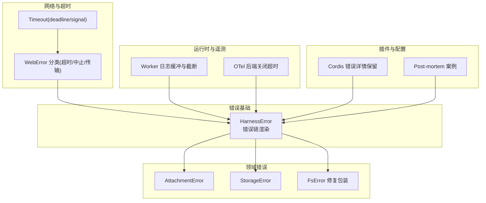
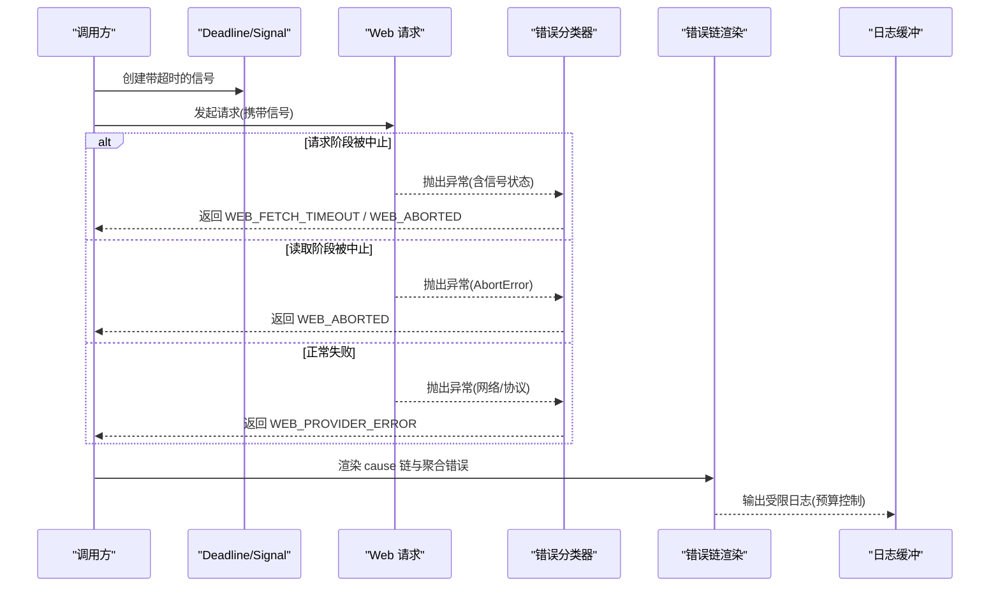
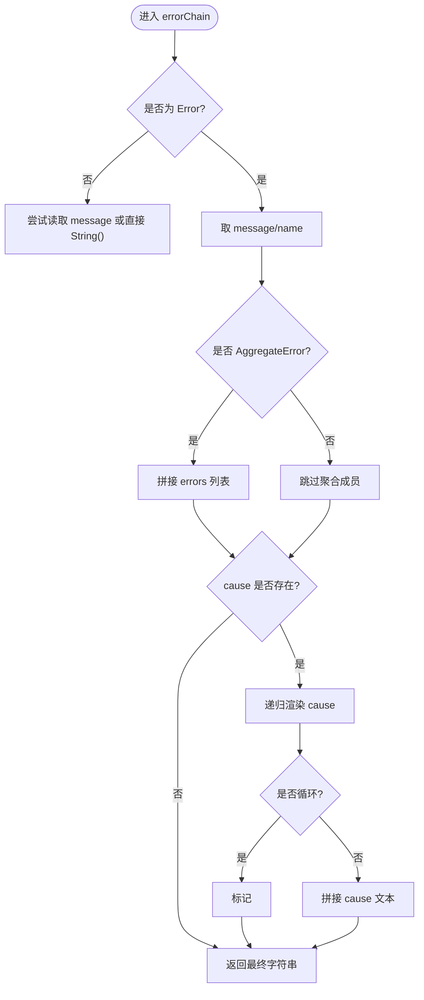
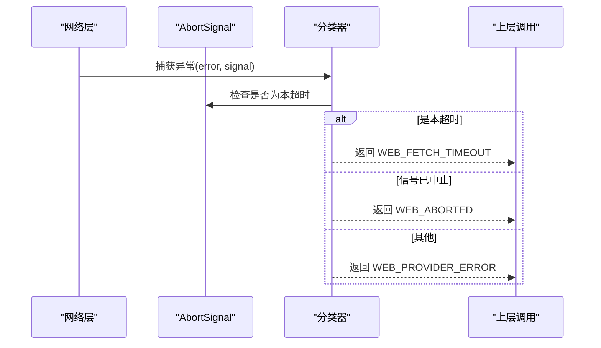
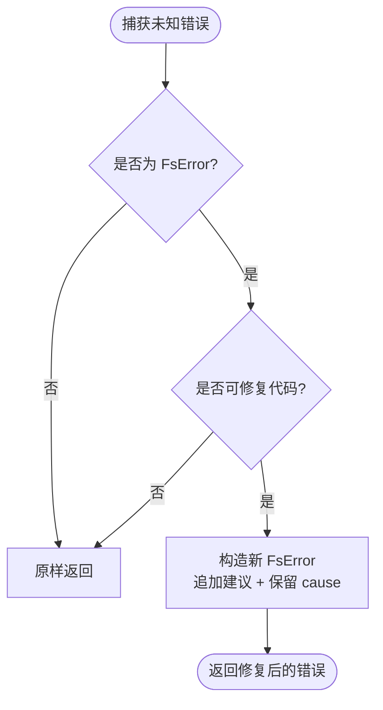
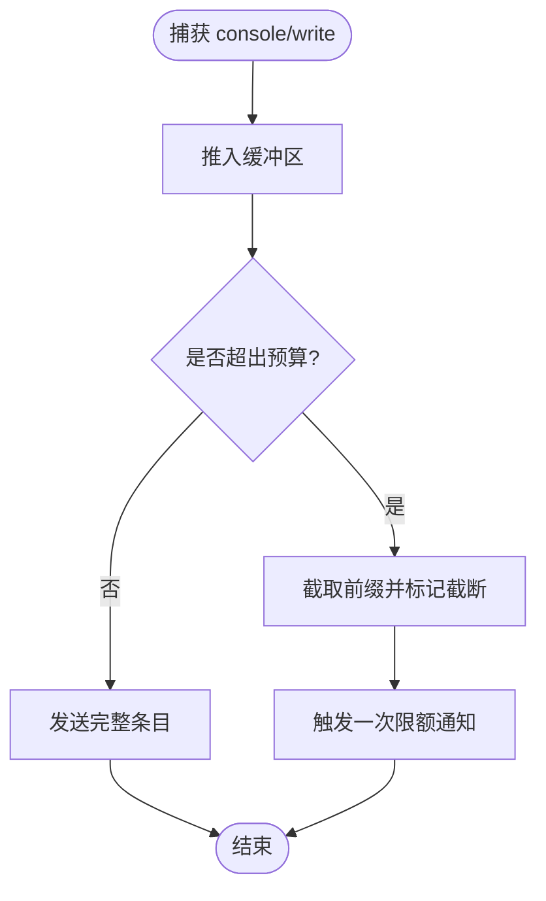
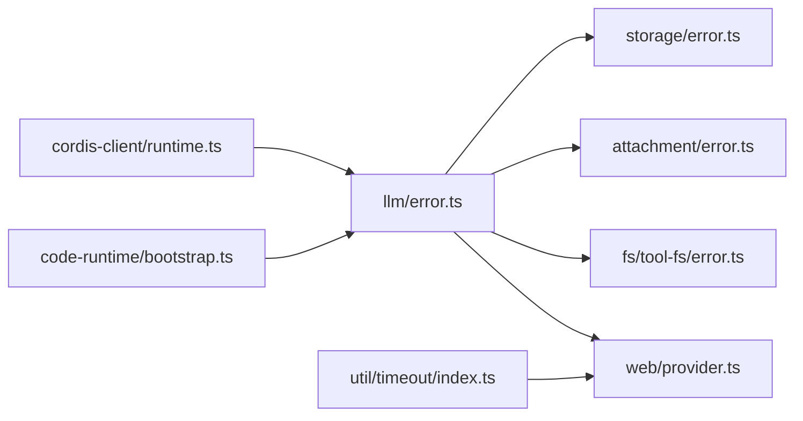

# 错误分析

<cite>
**本文引用的文件**
- [packages/llm/llm/src/error.ts](file://packages/llm/llm/src/error.ts)
- [packages/attachment/attachment/src/error.ts](file://packages/attachment/attachment/src/error.ts)
- [packages/fs/tool-fs/src/error.ts](file://packages/fs/tool-fs/src/error.ts)
- [packages/storage/storage/src/error.ts](file://packages/storage/storage/src/error.ts)
- [packages/web/web-fetch-http/src/provider.ts](file://packages/web/web-fetch-http/src/provider.ts)
- [packages/util/timeout/src/index.ts](file://packages/util/timeout/src/index.ts)
- [packages/code-runtime/code-runtime-worker-thread/src/bootstrap.ts](file://packages/code-runtime/code-runtime-worker-thread/src/bootstrap.ts)
- [packages/session/session-telemetry-otel/src/index.ts](file://packages/session/session-telemetry-otel/src/index.ts)
- [packages/extensions/cordis-client-runner/src/client/runtime.ts](file://packages/extensions/cordis-client-runner/src/client/runtime.ts)
- [docs/postmortem/README.md](file://docs/postmortem/README.md)
- [docs/postmortem/0001-acp-default-export-drops-inject.md](file://docs/postmortem/0001-acp-default-export-drops-inject.md)
- [docs/postmortem/0002-js-expression-disabled-filesystem-tools.md](file://docs/postmortem/0002-js-expression-disabled-filesystem-tools.md)
- [docs/postmortem/0004-landlock-partial-notice-misclassified-child-failures.md](file://docs/postmortem/0004-landlock-partial-notice-misclassified-child-failures.md)
</cite>

## 目录
1. [简介](#简介)
2. [项目结构](#项目结构)
3. [核心组件](#核心组件)
4. [架构总览](#架构总览)
5. [详细组件分析](#详细组件分析)
6. [依赖关系分析](#依赖关系分析)
7. [性能考量](#性能考量)
8. [故障排查指南](#故障排查指南)
9. [结论](#结论)
10. [附录](#附录)

## 简介
本指南面向开发与运维团队，系统化说明如何在本仓库中分析并诊断各类错误（JavaScript 错误、系统/平台错误、网络错误等），包括堆栈跟踪解读、常见错误模式识别、Post-mortem 分析方法、常见错误场景复现与修复步骤，以及日志分析与关键信息提取技巧。文档基于仓库内现有错误类型定义、错误链渲染、网络错误分类、超时与中止处理、日志缓冲与截断、以及历史 Post-mortem 案例进行总结与提炼。

## 项目结构
围绕错误处理的关键代码分布在多个包中：
- LLM 层提供统一的 HarnessError 基类、错误码常量、上下文窗口/配额超限识别、错误链渲染工具。
- 附件、存储、文件系统工具各自维护领域错误类型或错误修复包装。
- Web 网络层将底层 fetch/stream 错误按“超时/中止/传输失败”分类为统一错误。
- 超时工具提供 deadline/signal 机制，用于区分超时与取消。
- 代码运行时 worker 线程对 console 输出和流写入进行捕获与预算控制，避免日志爆炸。
- 遥测后端在禁用模式下记录本地反馈警告，并在关闭时设置超时保护。
- Cordis 客户端运行器在加载失败时保留原始 message 与 stack，便于上报与调试。
- Post-mortem 文档记录了真实故障的根因、时间线、防护与教训。

图表来源
- [packages/llm/llm/src/error.ts:1-164](file://packages/llm/llm/src/error.ts#L1-L164)
- [packages/attachment/attachment/src/error.ts:1-27](file://packages/attachment/attachment/src/error.ts#L1-L27)
- [packages/storage/storage/src/error.ts:1-36](file://packages/storage/storage/src/error.ts#L1-L36)
- [packages/fs/tool-fs/src/error.ts:1-35](file://packages/fs/tool-fs/src/error.ts#L1-L35)
- [packages/web/web-fetch-http/src/provider.ts:225-240](file://packages/web/web-fetch-http/src/provider.ts#L225-L240)
- [packages/util/timeout/src/index.ts:33-63](file://packages/util/timeout/src/index.ts#L33-L63)
- [packages/code-runtime/code-runtime-worker-thread/src/bootstrap.ts:66-153](file://packages/code-runtime/code-runtime-worker-thread/src/bootstrap.ts#L66-L153)
- [packages/session/session-telemetry-otel/src/index.ts:141-168](file://packages/session/session-telemetry-otel/src/index.ts#L141-L168)
- [packages/extensions/cordis-client-runner/src/client/runtime.ts:469-494](file://packages/extensions/cordis-client-runner/src/client/runtime.ts#L469-L494)
- [docs/postmortem/README.md:1-19](file://docs/postmortem/README.md#L1-L19)

章节来源
- [packages/llm/llm/src/error.ts:1-164](file://packages/llm/llm/src/error.ts#L1-L164)
- [packages/attachment/attachment/src/error.ts:1-27](file://packages/attachment/attachment/src/error.ts#L1-L27)
- [packages/storage/storage/src/error.ts:1-36](file://packages/storage/storage/src/error.ts#L1-L36)
- [packages/fs/tool-fs/src/error.ts:1-35](file://packages/fs/tool-fs/src/error.ts#L1-L35)
- [packages/web/web-fetch-http/src/provider.ts:225-240](file://packages/web/web-fetch-http/src/provider.ts#L225-L240)
- [packages/util/timeout/src/index.ts:33-63](file://packages/util/timeout/src/index.ts#L33-L63)
- [packages/code-runtime/code-runtime-worker-thread/src/bootstrap.ts:66-153](file://packages/code-runtime/code-runtime-worker-thread/src/bootstrap.ts#L66-L153)
- [packages/session/session-telemetry-otel/src/index.ts:141-168](file://packages/session/session-telemetry-otel/src/index.ts#L141-L168)
- [packages/extensions/cordis-client-runner/src/client/runtime.ts:469-494](file://packages/extensions/cordis-client-runner/src/client/runtime.ts#L469-L494)
- [docs/postmortem/README.md:1-19](file://docs/postmortem/README.md#L1-L19)

## 核心组件
- 统一错误基类与错误码：通过稳定的 code 字段进行分类与路由，避免解析人类可读消息。
- 错误链渲染：将 cause 链与 AggregateError 成员安全地拼接为可读字符串，支持循环引用与“敌意访问器”保护。
- 领域错误：附件、存储、文件系统工具分别定义错误类型或在边界追加可恢复建议。
- 网络错误分类：依据 AbortSignal 区分“超时/中止/传输失败”，保持上层策略一致。
- 超时与中止：deadline/signal 组合，明确区分超时与外部取消。
- 日志缓冲与截断：限制输出字节数，避免日志风暴影响性能与稳定性。
- 插件加载错误细节：保留原始 message 与 stack，便于跨进程上报与定位。
- 遥测关闭保护：为 SDK 关闭设置超时，防止阻塞整体退出流程。

章节来源
- [packages/llm/llm/src/error.ts:1-164](file://packages/llm/llm/src/error.ts#L1-L164)
- [packages/attachment/attachment/src/error.ts:1-27](file://packages/attachment/attachment/src/error.ts#L1-L27)
- [packages/storage/storage/src/error.ts:1-36](file://packages/storage/storage/src/error.ts#L1-L36)
- [packages/fs/tool-fs/src/error.ts:1-35](file://packages/fs/tool-fs/src/error.ts#L1-L35)
- [packages/web/web-fetch-http/src/provider.ts:225-240](file://packages/web/web-fetch-http/src/provider.ts#L225-L240)
- [packages/util/timeout/src/index.ts:33-63](file://packages/util/timeout/src/index.ts#L33-L63)
- [packages/code-runtime/code-runtime-worker-thread/src/bootstrap.ts:66-153](file://packages/code-runtime/code-runtime-worker-thread/src/bootstrap.ts#L66-L153)
- [packages/session/session-telemetry-otel/src/index.ts:141-168](file://packages/session/session-telemetry-otel/src/index.ts#L141-L168)
- [packages/extensions/cordis-client-runner/src/client/runtime.ts:469-494](file://packages/extensions/cordis-client-runner/src/client/runtime.ts#L469-L494)

## 架构总览
下图展示了从调用方到错误分类、渲染与上报的主路径，涵盖网络请求、超时控制、错误链渲染与日志缓冲。

图表来源
- [packages/util/timeout/src/index.ts:33-63](file://packages/util/timeout/src/index.ts#L33-L63)
- [packages/web/web-fetch-http/src/provider.ts:225-240](file://packages/web/web-fetch-http/src/provider.ts#L225-L240)
- [packages/llm/llm/src/error.ts:102-164](file://packages/llm/llm/src/error.ts#L102-L164)
- [packages/code-runtime/code-runtime-worker-thread/src/bootstrap.ts:66-153](file://packages/code-runtime/code-runtime-worker-thread/src/bootstrap.ts#L66-L153)

## 详细组件分析

### 统一错误基类与错误链渲染
- 设计要点
  - 所有错误携带稳定 code，供上层按类型路由；message 仅用于诊断。
  - 支持标准 ErrorOptions.cause 链式传递，AggregateError 成员一并展示。
  - 错误链渲染函数会检测循环引用与“敌意访问器”，保证 UI/日志不崩溃。
  - 提供 isHarnessError 类型守卫，用于边界处判断。
- 复杂度与性能
  - 渲染过程递归遍历 cause 链，使用 Set 追踪当前路径，避免重复渲染共享节点。
  - 对非 Error 值做安全降级，确保任何输入都能产出可读字符串。
- 适用场景
  - 网络、LLM、子系统错误统一上报与展示。
  - 需要同时保留结构化 code 与人类可读串的场景。

图表来源
- [packages/llm/llm/src/error.ts:102-164](file://packages/llm/llm/src/error.ts#L102-L164)

章节来源
- [packages/llm/llm/src/error.ts:1-164](file://packages/llm/llm/src/error.ts#L1-L164)

### 网络错误分类（Web 层）
- 设计要点
  - 根据 AbortSignal 的状态与原因，将底层异常分类为“超时/中止/传输失败”。
  - 超时由内部 deadline 产生，中止可能来自上游取消或外层超时，传输失败为底层网络问题。
- 处理流程
  - 捕获异常后先检查是否为本超时信号触发；若是则归类为超时。
  - 若信号已中止但非本超时，则归类为中止。
  - 否则归类为传输失败，并附带原始错误信息。

图表来源
- [packages/web/web-fetch-http/src/provider.ts:225-240](file://packages/web/web-fetch-http/src/provider.ts#L225-L240)
- [packages/util/timeout/src/index.ts:33-63](file://packages/util/timeout/src/index.ts#L33-L63)

章节来源
- [packages/web/web-fetch-http/src/provider.ts:225-240](file://packages/web/web-fetch-http/src/provider.ts#L225-L240)
- [packages/util/timeout/src/index.ts:33-63](file://packages/util/timeout/src/index.ts#L33-L63)

### 文件系统工具的错误修复包装
- 设计要点
  - 针对特定 FsError 代码（如版本过期或未观测）追加可恢复建议，提升模型侧可操作性。
  - 保留原始 code 与 cause，以便重试/权限/UI 层继续按类型路由。
- 适用场景
  - 写/编辑操作前需先读文件的冲突场景。
  - 需要向用户或模型提示“重新读取后再重试”的情况。

图表来源
- [packages/fs/tool-fs/src/error.ts:1-35](file://packages/fs/tool-fs/src/error.ts#L1-L35)

章节来源
- [packages/fs/tool-fs/src/error.ts:1-35](file://packages/fs/tool-fs/src/error.ts#L1-L35)

### 存储与附件错误
- 存储错误
  - 使用枚举化 code 表达后端未找到、挂载冲突、版本不匹配等状态。
  - 适合持久化与介质层面的错误分类与重试策略。
- 附件错误
  - 为避免循环依赖，独立实现与 HarnessError 同形的错误类型，仍通过 code 路由。
  - 适用于宿主 RPC 映射与跨进程边界。

章节来源
- [packages/storage/storage/src/error.ts:1-36](file://packages/storage/storage/src/error.ts#L1-L36)
- [packages/attachment/attachment/src/error.ts:1-27](file://packages/attachment/attachment/src/error.ts#L1-L27)

### 日志缓冲与截断（Worker 线程）
- 设计要点
  - 对 console 方法与 stream.write 进行拦截，统一写入有预算限制的缓冲区。
  - 达到预算后丢弃后续内容，并仅输出一个能容纳的前缀片段，避免内存与带宽膨胀。
- 适用场景
  - 子进程/工作线程大量日志输出，需控制体积与顺序。
  - 需要保证主进程收到的日志有序且可控。

图表来源
- [packages/code-runtime/code-runtime-worker-thread/src/bootstrap.ts:66-153](file://packages/code-runtime/code-runtime-worker-thread/src/bootstrap.ts#L66-L153)

章节来源
- [packages/code-runtime/code-runtime-worker-thread/src/bootstrap.ts:66-153](file://packages/code-runtime/code-runtime-worker-thread/src/bootstrap.ts#L66-L153)

### 插件加载错误详情保留
- 设计要点
  - 当组件加载失败时，保留原始 message 与 stack，便于跨进程上报与定位。
  - 对非对象错误进行安全降级，确保始终可序列化。
- 适用场景
  - Cordis 插件体系中的加载失败报告。
  - 需要最小侵入地保留诊断信息的场景。

章节来源
- [packages/extensions/cordis-client-runner/src/client/runtime.ts:469-494](file://packages/extensions/cordis-client-runner/src/client/runtime.ts#L469-L494)

### 遥测后端关闭保护
- 设计要点
  - 在禁用模式下记录本地反馈警告，避免静默丢失。
  - 为 SDK 关闭设置超时，防止个别处置器卡住整个退出流程。
- 适用场景
  - 资源释放阶段的兜底保护。
  - 多插件树共存时的优雅退出。

章节来源
- [packages/session/session-telemetry-otel/src/index.ts:141-168](file://packages/session/session-telemetry-otel/src/index.ts#L141-L168)

## 依赖关系分析
- 低耦合高内聚
  - 错误基类位于 LLM 包，领域错误在各包独立实现，通过 code 契约解耦。
  - 网络层依赖超时工具，但不直接感知具体业务错误类型。
  - 日志缓冲与错误渲染相互独立，分别关注输出与诊断。
- 潜在风险
  - 若多处重复实现错误渲染逻辑，易导致不一致；应优先复用统一渲染函数。
  - 跨进程错误需确保 message/stack/code 三要素齐全，避免诊断信息丢失。

图表来源
- [packages/llm/llm/src/error.ts:1-164](file://packages/llm/llm/src/error.ts#L1-L164)
- [packages/web/web-fetch-http/src/provider.ts:225-240](file://packages/web/web-fetch-http/src/provider.ts#L225-L240)
- [packages/fs/tool-fs/src/error.ts:1-35](file://packages/fs/tool-fs/src/error.ts#L1-L35)
- [packages/attachment/attachment/src/error.ts:1-27](file://packages/attachment/attachment/src/error.ts#L1-L27)
- [packages/storage/storage/src/error.ts:1-36](file://packages/storage/storage/src/error.ts#L1-L36)
- [packages/util/timeout/src/index.ts:33-63](file://packages/util/timeout/src/index.ts#L33-L63)
- [packages/code-runtime/code-runtime-worker-thread/src/bootstrap.ts:66-153](file://packages/code-runtime/code-runtime-worker-thread/src/bootstrap.ts#L66-L153)
- [packages/extensions/cordis-client-runner/src/client/runtime.ts:469-494](file://packages/extensions/cordis-client-runner/src/client/runtime.ts#L469-L494)

## 性能考量
- 错误链渲染应避免深层嵌套导致的性能退化；当前实现通过路径集合去重与异常捕获，保证健壮性。
- 日志缓冲严格限制字节预算，避免 OOM 与 I/O 拥塞；注意合理设置上限以平衡可观测性与开销。
- 网络错误分类基于信号状态，O(1) 判定，无额外 IO。
- 插件加载错误详情保留应尽量轻量，避免在热路径复制大对象。

## 故障排查指南

### 如何分析不同类型的错误信息
- JavaScript 错误
  - 优先查看 code 字段进行路由；message 仅用于辅助理解。
  - 使用错误链渲染获取 cause 全貌，注意循环引用与不可渲染值的占位符。
- 系统/平台错误
  - 关注平台相关错误码（如 Landlock 通知误分类），结合 Post-mortem 中的“信息性与致命性诊断共享命名空间”的教训，精确排除。
- 网络错误
  - 依据分类结果（超时/中止/传输失败）决定重试策略：超时通常可重试，中止不应重试，传输失败需结合具体错误码与网络环境。

章节来源
- [packages/llm/llm/src/error.ts:102-164](file://packages/llm/llm/src/error.ts#L102-L164)
- [docs/postmortem/0004-landlock-partial-notice-misclassified-child-failures.md:50-56](file://docs/postmortem/0004-landlock-partial-notice-misclassified-child-failures.md#L50-L56)
- [packages/web/web-fetch-http/src/provider.ts:225-240](file://packages/web/web-fetch-http/src/provider.ts#L225-L240)

### 错误堆栈跟踪的解读方法
- 优先定位最外层错误与 cause 链起点，再向下追溯至具体模块。
- 对于插件加载错误，利用保留的 stack 快速定位加载入口与注入点。
- 注意区分“加载时错误”与“请求时错误”，前者多在模块初始化阶段。

章节来源
- [packages/extensions/cordis-client-runner/src/client/runtime.ts:469-494](file://packages/extensions/cordis-client-runner/src/client/runtime.ts#L469-L494)
- [docs/postmortem/0001-acp-default-export-drops-inject.md:27-55](file://docs/postmortem/0001-acp-default-export-drops-inject.md#L27-L55)

### 常用错误模式识别
- 上下文窗口超限：通过关键词与正则识别，归类为固定 code，便于前端提示与裁剪策略。
- 配额耗尽：识别“余额/配额/额度耗尽”等表述，归类为终端错误，避免盲目重试。
- 文件系统冲突：FS_STALE_VERSION/FS_NOT_OBSERVED 需先读后写，追加建议提升自愈能力。
- 网络超时/中止/传输失败：依据信号与异常来源分类，指导重试与回退。

章节来源
- [packages/llm/llm/src/error.ts:24-100](file://packages/llm/llm/src/error.ts#L24-L100)
- [packages/fs/tool-fs/src/error.ts:1-35](file://packages/fs/tool-fs/src/error.ts#L1-L35)
- [packages/web/web-fetch-http/src/provider.ts:225-240](file://packages/web/web-fetch-http/src/provider.ts#L225-L240)

### Post-mortem 分析方法
- 执行摘要：用一段话说明“什么坏了、根因、为何漏过、持久教训”。
- 时间线：按事件顺序还原，标注关键决策点与验证手段。
- 根因分析：区分表面症状与真正机制，必要时隔离复现。
- 防护措施：新增测试、静态校验、文档规则，确保同类问题下次“大声失败”。
- 教训沉淀：形成团队共识与规范，避免重复踩坑。

章节来源
- [docs/postmortem/README.md:1-19](file://docs/postmortem/README.md#L1-L19)
- [docs/postmortem/0001-acp-default-export-drops-inject.md:1-114](file://docs/postmortem/0001-acp-default-export-drops-inject.md#L1-L114)
- [docs/postmortem/0002-js-expression-disabled-filesystem-tools.md:1-48](file://docs/postmortem/0002-js-expression-disabled-filesystem-tools.md#L1-L48)
- [docs/postmortem/0004-landlock-partial-notice-misclassified-child-failures.md:50-56](file://docs/postmortem/0004-landlock-partial-notice-misclassified-child-failures.md#L50-L56)

### 常见错误场景复现与修复步骤
- ACP 服务器连接崩溃（默认导出丢弃 inject）
  - 复现：通过真实编辑器连接，观察 session/new 报错。
  - 修复：移除多余的默认导出，使 Loader 正确解析命名导出。
  - 防护：增加无 API Key 的端到端测试，覆盖真实加载路径。
- 文件系统快照工具永久禁用
  - 复现：使用包含条件表达式配置的 YAML 启动，检查工具注册情况。
  - 修复：改用显式覆盖配置，避免在元数据位置使用表达式。
  - 防护：静态校验拒绝在元数据中使用表达式；快照框架拒绝 UNKNOWN_TOOL 结果。
- Landlock 部分强制通知误分类子进程失败
  - 复现：在受限环境中观察子进程失败分类。
  - 修复：精确排除信息性行，未知致命行保持 fail-closed。
  - 防护：适配器保留下层结构化失败，不替换为泛化类别。

章节来源
- [docs/postmortem/0001-acp-default-export-drops-inject.md:27-55](file://docs/postmortem/0001-acp-default-export-drops-inject.md#L27-L55)
- [docs/postmortem/0002-js-expression-disabled-filesystem-tools.md:30-41](file://docs/postmortem/0002-js-expression-disabled-filesystem-tools.md#L30-L41)
- [docs/postmortem/0004-landlock-partial-notice-misclassified-child-failures.md:50-56](file://docs/postmortem/0004-landlock-partial-notice-misclassified-child-failures.md#L50-L56)

### 错误日志的分析技巧与关键信息提取
- 关键字段
  - code：用于自动化路由与告警阈值。
  - message：用于人类阅读与检索。
  - stack：用于定位源码位置与调用链。
  - cause：用于追溯根本原因。
- 技巧
  - 使用错误链渲染一次性获得完整诊断串，避免多次拼接遗漏。
  - 对日志输出启用预算控制，避免日志风暴掩盖关键信息。
  - 在跨进程边界保留 message 与 stack，确保远程可观测性。
  - 对网络错误按超时/中止/传输失败分类，分别制定重试与回退策略。

章节来源
- [packages/llm/llm/src/error.ts:102-164](file://packages/llm/llm/src/error.ts#L102-L164)
- [packages/code-runtime/code-runtime-worker-thread/src/bootstrap.ts:66-153](file://packages/code-runtime/code-runtime-worker-thread/src/bootstrap.ts#L66-L153)
- [packages/extensions/cordis-client-runner/src/client/runtime.ts:469-494](file://packages/extensions/cordis-client-runner/src/client/runtime.ts#L469-L494)
- [packages/web/web-fetch-http/src/provider.ts:225-240](file://packages/web/web-fetch-http/src/provider.ts#L225-L240)

## 结论
本指南基于仓库内的错误类型定义、错误链渲染、网络错误分类、超时与中止处理、日志缓冲与截断、以及真实 Post-mortem 案例，提供了从错误识别、堆栈解读、模式归纳到 Post-mortem 与修复落地的完整方法论。建议在团队中推广“按 code 路由、保留 cause 链、预算化日志、真实路径测试”的实践，以降低故障成本并提升可观测性。

## 附录
- 术语
  - 错误链：通过 cause 串联的多层错误，反映完整的失败路径。
  - 聚合错误：同时包含多个子错误的容器，常用于批量失败场景。
  - 超时与中止：超时由内部计时器触发，中止可由上游取消或外层超时引起。
- 参考
  - 统一错误基类与错误链渲染：[packages/llm/llm/src/error.ts:1-164](file://packages/llm/llm/src/error.ts#L1-L164)
  - 网络错误分类：[packages/web/web-fetch-http/src/provider.ts:225-240](file://packages/web/web-fetch-http/src/provider.ts#L225-L240)
  - 超时工具：[packages/util/timeout/src/index.ts:33-63](file://packages/util/timeout/src/index.ts#L33-L63)
  - 日志缓冲：[packages/code-runtime/code-runtime-worker-thread/src/bootstrap.ts:66-153](file://packages/code-runtime/code-runtime-worker-thread/src/bootstrap.ts#L66-L153)
  - 插件错误详情：[packages/extensions/cordis-client-runner/src/client/runtime.ts:469-494](file://packages/extensions/cordis-client-runner/src/client/runtime.ts#L469-L494)
  - Post-mortem 示例：[docs/postmortem:1-19](file://docs/postmortem/README.md#L1-L19)