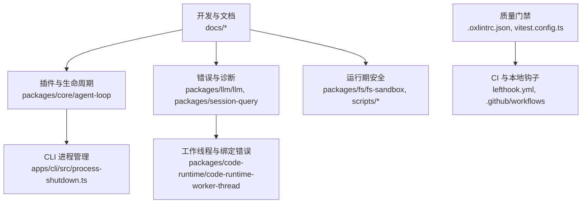
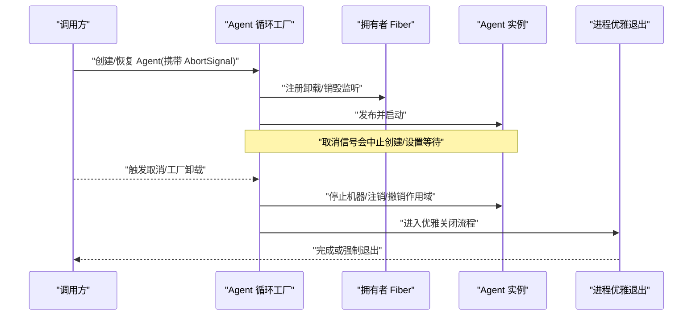
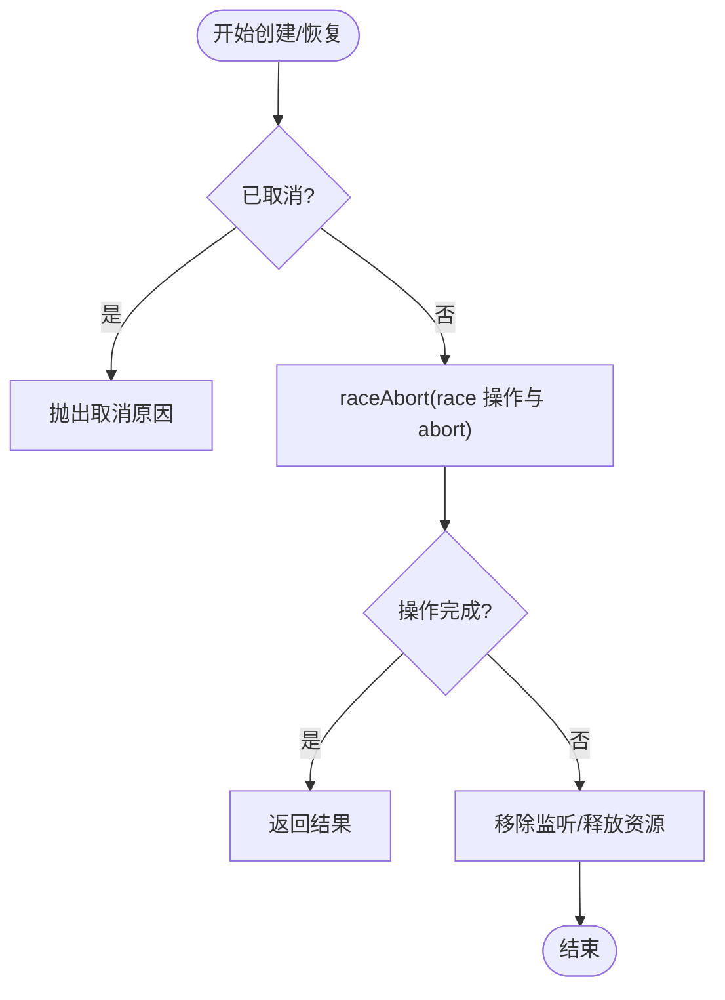
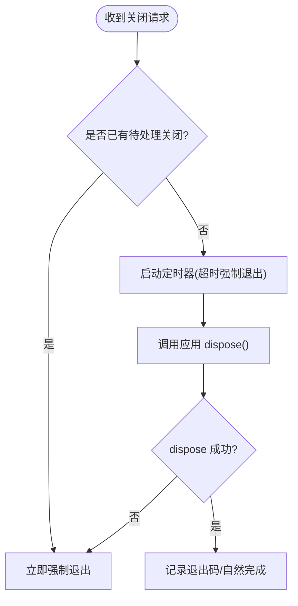
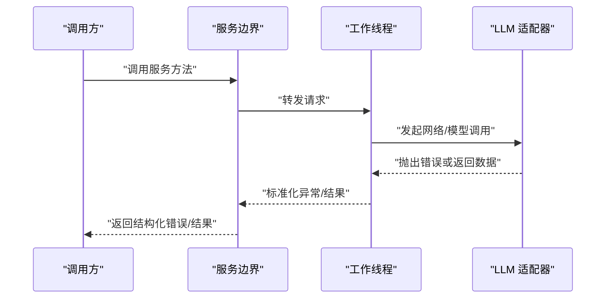
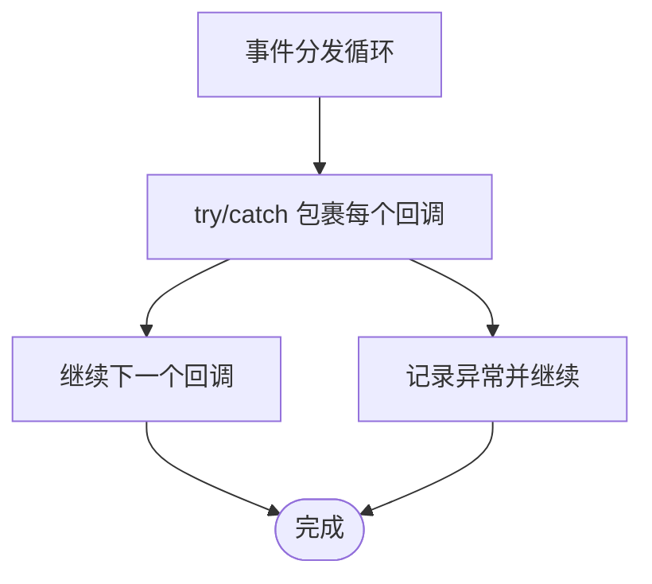
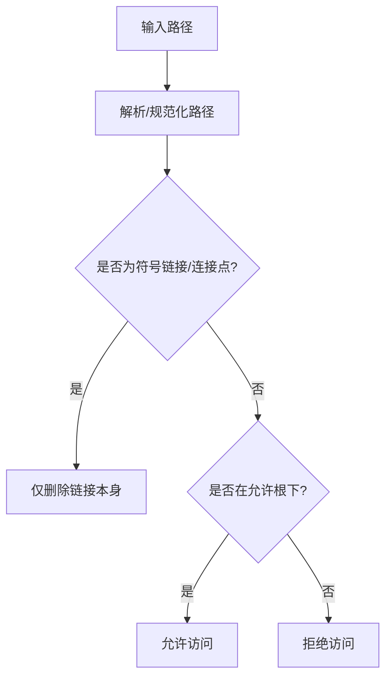
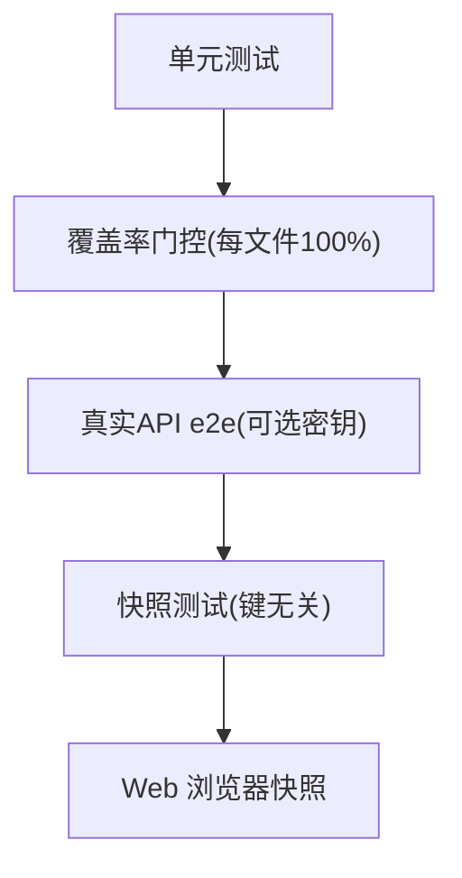
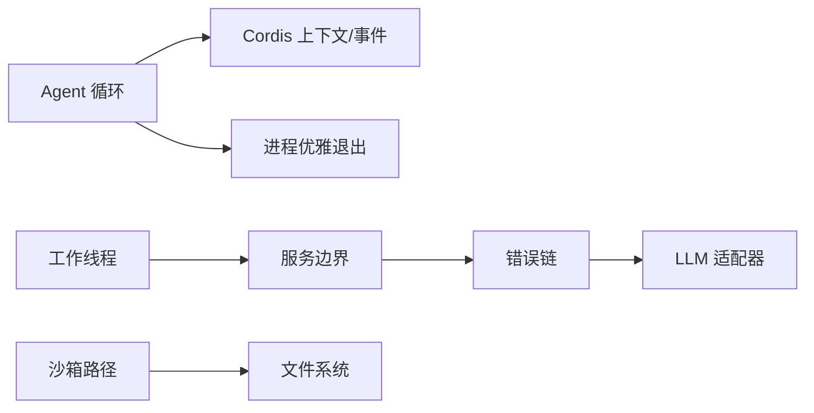

# 代码质量最佳实践

<cite>
**本文引用的文件**
- [防御性模式](file://docs/defensive-patterns.md)
- [测试策略](file://docs/testing.md)
- [开发指南](file://docs/development.md)
- [Cordis 入门](file://docs/cordis-primer.md)
- [错误链渲染](file://packages/llm/llm/src/error.ts)
- [会话查询服务边界](file://packages/session-query/tool-session-query/src/service-boundary.ts)
- [Agent 循环工厂与取消](file://packages/core/agent-loop/src/index.ts)
- [CLI 进程优雅退出](file://apps/cli/src/process-shutdown.ts)
- [工作线程异常准备与绑定错误](file://packages/code-runtime/code-runtime-worker-thread/src/bootstrap.ts)
- [工具执行对非 Error 抛出的处理](file://packages/core/tools/tests/tools.spec.ts)
- [沙箱路径包含检查](file://packages/fs/fs-sandbox/tests/containment.spec.ts)
- [配置来源所有权校验脚本](file://scripts/verify-config-source-ownership.ts)
- [Oxlint 规则配置](file://.oxlintrc.json)
- [Vitest 配置与覆盖率门控](file://vitest.config.ts)
</cite>

## 目录
1. [简介](#简介)
2. [项目结构](#项目结构)
3. [核心组件](#核心组件)
4. [架构总览](#架构总览)
5. [详细组件分析](#详细组件分析)
6. [依赖关系分析](#依赖关系分析)
7. [性能考量](#性能考量)
8. [故障排查指南](#故障排查指南)
9. [结论](#结论)
10. [附录](#附录)

## 简介
本指南面向 DeepSeek Harness 仓库的开发者与维护者，聚焦于可落地的代码质量最佳实践：防御性编程、错误处理策略、异步状态管理与资源清理、回调异常隔离、并发安全、环境变量与路径安全、代码审查清单与质量门禁、可测试性与单元测试原则、以及命名与注释规范。内容基于仓库现有实现与文档提炼而成，并辅以流程图与时序图帮助理解关键流程。

## 项目结构
仓库采用多包（packages）+ 应用（apps）+ 示例（examples）+ 脚本（scripts）的多层组织方式。核心质量保障由以下部分构成：
- 防御性模式与测试策略文档，定义“契约两侧一致”“异步状态不等于同步状态”“清理必须达到静默”等硬约束。
- 类型与运行时质量门禁：Oxlint 严格规则、Vitest 单测与覆盖率门控、构建产物一致性校验。
- 生命周期与事件框架：Cordis 插件体系提供声明式注册、可逆副作用、事件分发与中间件式拦截。
- 运行期安全：子进程环境清洗、临时文件私有化、路径包含与链接防护。

**图表来源**
- [Cordis 入门](file://docs/cordis-primer.md:15-45)
- [开发指南](file://docs/development.md:90-117)
- [Oxlint 规则配置](file://.oxlintrc.json:1-322)
- [Vitest 配置与覆盖率门控](file://vitest.config.ts:117-286)

**章节来源**
- [开发指南:90-117](file://docs/development.md#L90-L117)
- [Cordis 入门:15-45](file://docs/cordis-primer.md#L15-L45)

## 核心组件
- 防御性模式：正交结果独立上报、公共约定两侧一致、异步状态与同步状态分离、清理必须到达静默、回调异常在调度器内隔离、禁止将不可信输出暴露到环境或可预测路径、对符号链接与 Windows 连接点的安全删除。
- 错误处理：统一错误链渲染、服务边界错误转换、工作线程异常消息裁剪与类型化拒绝。
- 异步与并发：AbortSignal 驱动的取消、工厂级生命周期跟踪、进程级优雅退出与强制退出升级。
- 安全与路径：沙箱路径包含检查、环境变量注入白名单、临时文件权限控制。
- 质量门禁：Oxlint 严格规则、Vitest 单测与覆盖率门控、构建产物与配置来源校验。

**章节来源**
- [防御性模式:7-33](file://docs/defensive-patterns.md#L7-L33)
- [错误链渲染:102-130](file://packages/llm/llm/src/error.ts#L102-L130)
- [会话查询服务边界:143-179](file://packages/session-query/tool-session-query/src/service-boundary.ts#L143-L179)
- [工作线程异常准备与绑定错误:208-275](file://packages/code-runtime/code-runtime-worker-thread/src/bootstrap.ts#L208-L275)
- [Agent 循环工厂与取消:92-139](file://packages/core/agent-loop/src/index.ts#L92-L139)
- [CLI 进程优雅退出:1-78](file://apps/cli/src/process-shutdown.ts#L1-L78)
- [沙箱路径包含检查:33-57](file://packages/fs/fs-sandbox/tests/containment.spec.ts#L33-L57)
- [配置来源所有权校验脚本:25-56](file://scripts/verify-config-source-ownership.ts#L25-L56)
- [Oxlint 规则配置:1-322](file://.oxlintrc.json#L1-L322)
- [Vitest 配置与覆盖率门控:117-286](file://vitest.config.ts#L117-L286)

## 架构总览
下图展示从调用方到 Agent 循环、再到清理的生命周期与取消传播路径，体现“取消即中断、清理必达静默”的原则。

**图表来源**
- [Agent 循环工厂与取消:92-139](file://packages/core/agent-loop/src/index.ts#L92-L139)
- [CLI 进程优雅退出:22-78](file://apps/cli/src/process-shutdown.ts#L22-L78)

## 详细组件分析

### 组件A：Agent 循环与取消（异步状态管理）
- 使用 AbortController/AbortSignal 聚合多个所有者（调用方取消、Fiber 卸载、工厂销毁），确保任何一侧终止都能及时中断正在进行的创建/等待。
- 通过 raceAbort/raceAbortCall 将取消原因转换为明确的错误，避免悬挂等待。
- 工厂级 track/waitWhileActive 保证所有启动任务与活跃 Agent 的 teardown 在 dispose 时全部完成。

**图表来源**
- [Agent 循环工厂与取消:92-139](file://packages/core/agent-loop/src/index.ts#L92-L139)

**章节来源**
- [Agent 循环工厂与取消:92-139](file://packages/core/agent-loop/src/index.ts#L92-L139)

### 组件B：进程优雅退出（资源清理）
- 提供 shutdown/interrupt 双入口：正常关闭等待 dispose 完成；收到信号后升级为强制退出，防止僵尸进程。
- 超时保护：超过阈值直接强制退出，避免无限挂起。
- 幂等设计：重复调用不会重复退出或重复计时。

**图表来源**
- [CLI 进程优雅退出:22-78](file://apps/cli/src/process-shutdown.ts#L22-L78)

**章节来源**
- [CLI 进程优雅退出:1-78](file://apps/cli/src/process-shutdown.ts#L1-L78)

### 组件C：错误链与服务边界（错误处理策略）
- 错误链渲染：递归展开 Error.cause 与 AggregateError，避免深层包装掩盖真实原因。
- 服务边界：对外只暴露结构化错误与可读信息，内部捕获不可打印错误并降级为安全占位。
- 工作线程异常：限制堆栈/消息大小，避免跨进程传输过大对象；为绑定调用生成类型化错误类，便于调用方区分错误来源。

**图表来源**
- [错误链渲染:102-130](file://packages/llm/llm/src/error.ts#L102-L130)
- [会话查询服务边界:143-179](file://packages/session-query/tool-session-query/src/service-boundary.ts#L143-L179)
- [工作线程异常准备与绑定错误:208-275](file://packages/code-runtime/code-runtime-worker-thread/src/bootstrap.ts#L208-L275)

**章节来源**
- [错误链渲染:102-130](file://packages/llm/llm/src/error.ts#L102-L130)
- [会话查询服务边界:143-179](file://packages/session-query/tool-session-query/src/service-boundary.ts#L143-L179)
- [工作线程异常准备与绑定错误:208-275](file://packages/code-runtime/code-runtime-worker-thread/src/bootstrap.ts#L208-L275)

### 组件D：回调异常隔离与并发安全
- 回调异常必须在调度器中 try/catch 包裹，避免单个订阅者破坏核心生命周期。
- 工具执行对非 Error 抛出进行规范化处理，确保错误信息稳定呈现。
- 并发方面，Agent 循环通过 AbortSignal 与工厂级跟踪确保并发创建/取消的正确性。

**图表来源**
- [工具执行对非 Error 抛出的处理:2402-2430](file://packages/core/tools/tests/tools.spec.ts#L2402-L2430)
- [Agent 循环工厂与取消:92-139](file://packages/core/agent-loop/src/index.ts#L92-L139)

**章节来源**
- [工具执行对非 Error 抛出的处理:2402-2430](file://packages/core/tools/tests/tools.spec.ts#L2402-L2430)
- [Agent 循环工厂与取消:92-139](file://packages/core/agent-loop/src/index.ts#L92-L139)

### 组件E：环境变量与路径安全
- 环境变量：禁止在配置中内联敏感值，统一通过凭证解析与环境快照获取；CI 与本地均受校验脚本约束。
- 路径安全：沙箱路径包含检查支持别名根、缺失目标与常规文件段落的语义判断；对符号链接与 Windows 连接点采用安全的 unlink 流程，避免跟随链接进入目标目录。

**图表来源**
- [沙箱路径包含检查:33-57](file://packages/fs/fs-sandbox/tests/containment.spec.ts#L33-L57)
- [配置来源所有权校验脚本:25-56](file://scripts/verify-config-source-ownership.ts#L25-L56)

**章节来源**
- [沙箱路径包含检查:33-57](file://packages/fs/fs-sandbox/tests/containment.spec.ts#L33-L57)
- [配置来源所有权校验脚本:25-56](file://scripts/verify-config-source-ownership.ts#L25-L56)

### 组件F：可测试性与单元测试原则
- 分层测试：单元、覆盖率门控、真实 API e2e、快照、Web 浏览器快照；强调“验证世界而非自报告”“优先真实实现而非 mock”。
- 覆盖率要求：按文件 100% 覆盖，未覆盖行常被视为死代码需删除；针对无 pwsh 主机豁免特定文件，CI 仍保持全量。
- 真实入口路径测试：以构建产物作为入口，暴露 tsx 遮蔽的问题；e2e 测试负责资源创建与销毁。

**图表来源**
- [测试策略:7-14](file://docs/testing.md#L7-L14)
- [Vitest 配置与覆盖率门控:160-286](file://vitest.config.ts#L160-L286)

**章节来源**
- [测试策略:7-14](file://docs/testing.md#L7-L14)
- [Vitest 配置与覆盖率门控:160-286](file://vitest.config.ts#L160-L286)

### 组件G：代码规范、命名约定与注释标准
- Oxlint 规则：禁用 var、prefer-const、await-thenable、no-floating-promises、no-explicit-any 等；严格模板表达式、switch 穷尽检查；样式风格（缩进、分号、引号、逗号尾随、最大行长）。
- 测试与示例放宽：测试允许非 Error 抛出、require-await 关闭；示例允许演示回调不 await。
- 注释与 JSDoc：通过 type-equiv 机制保持文档与源码一致，JSDoc 变更需同步更新文档片段。

**章节来源**
- [Oxlint 规则配置:1-322](file://.oxlintrc.json#L1-L322)
- [开发指南:153-172](file://docs/development.md#L153-L172)

## 依赖关系分析
- 模块耦合：Agent 循环依赖 Cordis 上下文与事件系统；错误链与边界服务于 LLM 与工具调用；CLI 进程管理协调应用级 teardown。
- 外部依赖：Node 进程 API、文件系统 API、网络请求（LLM 适配器）、终端/Shell（pwsh/bash）。
- 潜在环：通过 Cordis 的事件与 effect 解耦，避免直接循环导入；构建阶段通过 Host/Client 两个程序集合规避 Context 合并冲突。

**图表来源**
- [Cordis 入门:15-45](file://docs/cordis-primer.md#L15-L45)
- [Agent 循环工厂与取消:92-139](file://packages/core/agent-loop/src/index.ts#L92-L139)
- [CLI 进程优雅退出:22-78](file://apps/cli/src/process-shutdown.ts#L22-L78)
- [错误链渲染:102-130](file://packages/llm/llm/src/error.ts#L102-L130)
- [会话查询服务边界:143-179](file://packages/session-query/tool-session-query/src/service-boundary.ts#L143-L179)
- [工作线程异常准备与绑定错误:208-275](file://packages/code-runtime/code-runtime-worker-thread/src/bootstrap.ts#L208-L275)
- [沙箱路径包含检查:33-57](file://packages/fs/fs-sandbox/tests/containment.spec.ts#L33-L57)

**章节来源**
- [Cordis 入门:15-45](file://docs/cordis-primer.md#L15-L45)
- [Agent 循环工厂与取消:92-139](file://packages/core/agent-loop/src/index.ts#L92-L139)
- [CLI 进程优雅退出:22-78](file://apps/cli/src/process-shutdown.ts#L22-L78)
- [错误链渲染:102-130](file://packages/llm/llm/src/error.ts#L102-L130)
- [会话查询服务边界:143-179](file://packages/session-query/tool-session-query/src/service-boundary.ts#L143-L179)
- [工作线程异常准备与绑定错误:208-275](file://packages/code-runtime/code-runtime-worker-thread/src/bootstrap.ts#L208-L275)
- [沙箱路径包含检查:33-57](file://packages/fs/fs-sandbox/tests/containment.spec.ts#L33-L57)

## 性能考量
- 避免在回调中执行昂贵操作；事件分发应轻量，复杂逻辑下沉至服务层。
- 错误链渲染需防循环与超大堆栈；工作线程异常消息需截断，减少跨进程传输成本。
- 覆盖率门控按文件 100%，有助于发现冗余分支与死代码，但需警惕“仅覆盖不验证行为”的风险。

[本节为通用指导，无需具体文件引用]

## 故障排查指南
- 进程卡住或无法退出：检查是否缺少 dispose 完成等待；确认优雅退出超时是否合理；查看是否有未释放的监听器或定时任务。
- 错误信息不完整：使用错误链渲染定位 cause 链；在服务边界捕获不可打印错误并降级。
- 路径越权或链接劫持：确认路径包含检查是否启用；对符号链接/连接点使用安全删除流程。
- 测试不稳定：优先复现真实入口路径问题；使用快照与 e2e 验证外部行为；避免过度 mock 导致“绿单但产品损坏”。

**章节来源**
- [CLI 进程优雅退出:22-78](file://apps/cli/src/process-shutdown.ts#L22-L78)
- [错误链渲染:102-130](file://packages/llm/llm/src/error.ts#L102-L130)
- [会话查询服务边界:143-179](file://packages/session-query/tool-session-query/src/service-boundary.ts#L143-L179)
- [沙箱路径包含检查:33-57](file://packages/fs/fs-sandbox/tests/containment.spec.ts#L33-L57)
- [测试策略:21-35](file://docs/testing.md#L21-L35)

## 结论
本指南总结了仓库在防御性编程、错误处理、异步与资源管理、安全与路径防护、质量门禁与测试方面的成熟实践。建议在日常开发中遵循“契约两侧一致”“清理必达静默”“回调异常隔离”“环境变量与路径安全”“真实入口路径测试”等原则，并结合 Oxlint 与 Vitest 的门控持续改进代码质量。

[本节为总结，无需具体文件引用]

## 附录
- 代码审查清单（建议）
  - 是否遵循防御性模式（正交结果、公共约定两侧一致、异步状态分离、清理静默、回调异常隔离、环境与路径安全、链接安全删除）？
  - 错误处理是否使用错误链与服务边界？是否对非 Error 抛出做了规范化？
  - 异步取消是否正确传播？是否避免悬挂等待？
  - 资源清理是否 await 子任务完成？是否先关闭监听再终止？
  - 环境变量是否通过凭证与环境快照注入？是否存在内联敏感值？
  - 路径访问是否经过沙箱包含检查？是否避免跟随符号链接/连接点？
  - 单测是否覆盖真实入口路径？是否验证外部世界而非自报告？
  - 覆盖率是否达到每文件 100%？未覆盖行是否为死代码？
  - 是否符合 Oxlint 规则与风格约定？JSDoc 是否与源码一致？

- 质量检查工具
  - Oxlint：严格类型与风格规则，预提交与 CI 双重保障。
  - Vitest：分层测试与覆盖率门控，支持进程隔离与平台差异豁免。
  - 构建与校验脚本：配置来源所有权校验、构建产物一致性检查。

**章节来源**
- [防御性模式:7-33](file://docs/defensive-patterns.md#L7-L33)
- [测试策略:7-14](file://docs/testing.md#L7-L14)
- [Oxlint 规则配置:1-322](file://.oxlintrc.json#L1-L322)
- [Vitest 配置与覆盖率门控:117-286](file://vitest.config.ts#L117-L286)
- [配置来源所有权校验脚本:25-56](file://scripts/verify-config-source-ownership.ts#L25-L56)