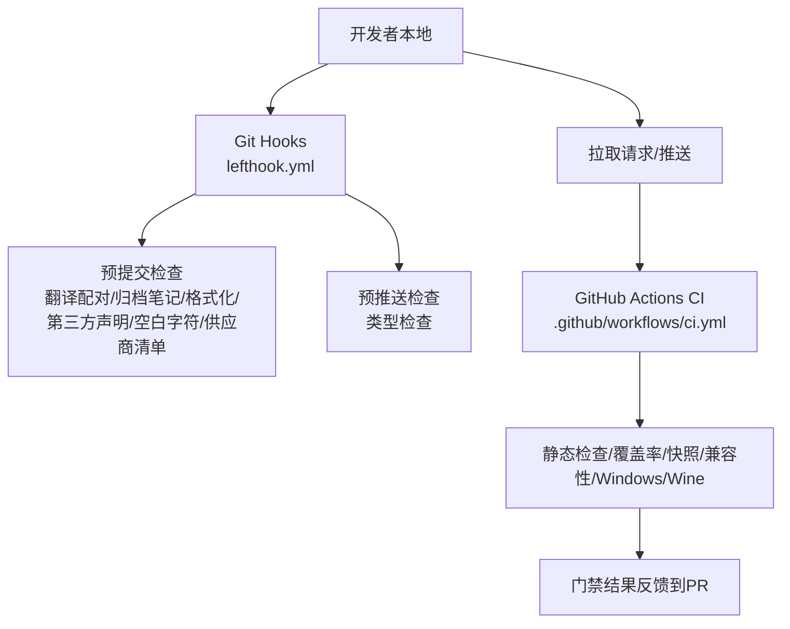
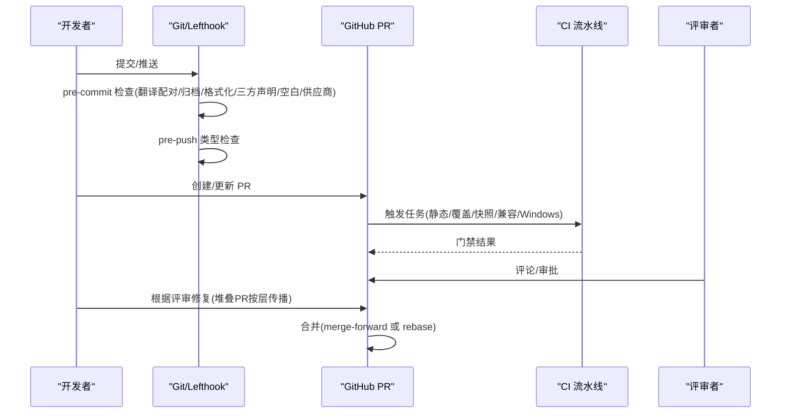
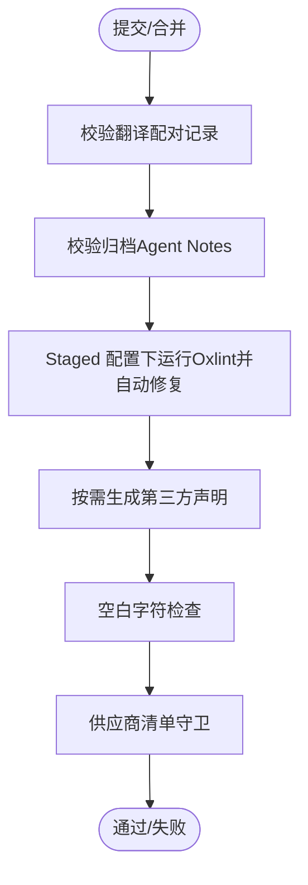
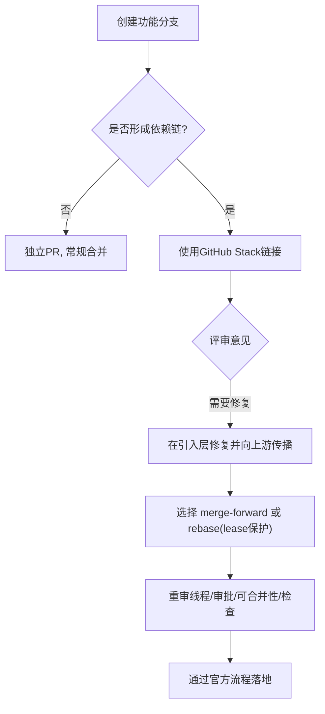
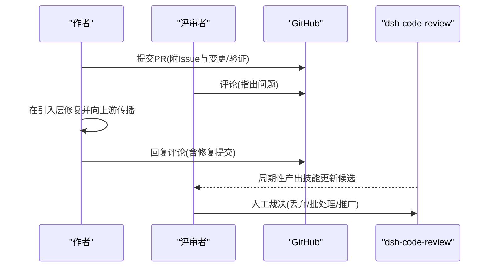
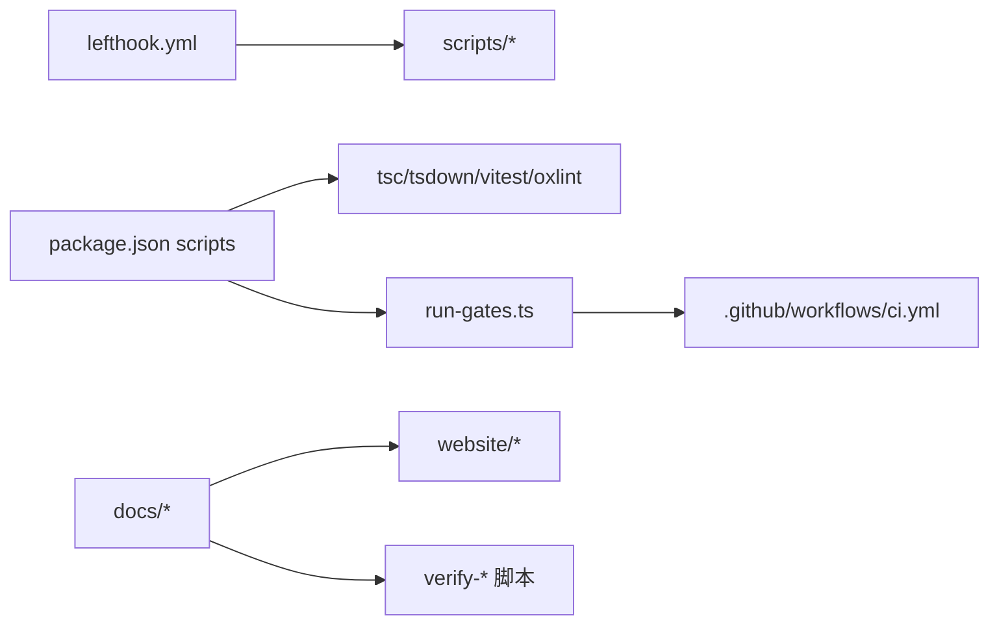

# 团队协作最佳实践

<cite>
**本文引用的文件**
- [CONTRIBUTING.md](file://CONTRIBUTING.md)
- [.github/pull_request_template.md](file://.github/pull_request_template.md)
- [lefthook.yml](file://lefthook.yml)
- [package.json](file://package.json)
- [.oxlintrc.json](file://.oxlintrc.json)
- [.editorconfig](file://.editorconfig)
- [.github/workflows/ci.yml](file://.github/workflows/ci.yml)
- [docs/development.md](file://docs/development.md)
- [AGENTS.md](file://AGENTS.md)
- [docs/cookbook/maintaining-dsh-code-review.md](file://docs/cookbook/maintaining-dsh-code-review.md)
- [docs/cookbook/responding-to-pr-review-on-a-stack.md](file://docs/cookbook/responding-to-pr-review-on-a-stack.md)
</cite>

## 目录
1. [简介](#简介)
2. [项目结构](#项目结构)
3. [核心组件](#核心组件)
4. [架构总览](#架构总览)
5. [详细组件分析](#详细组件分析)
6. [依赖关系分析](#依赖关系分析)
7. [性能与效率考量](#性能与效率考量)
8. [故障排查指南](#故障排查指南)
9. [结论](#结论)
10. [附录](#附录)

## 简介
本指南面向团队日常协作，聚焦代码规范、分支与版本管理、代码审查流程、提交信息与变更日志、文档协作、冲突解决与合并策略、知识分享与技术债务管理、以及沟通协作工具使用。内容基于仓库现有配置与工作流，确保可执行、可审计、可复用。

## 项目结构
仓库采用多工作区（workspaces）组织：应用、包、脚本、文档、网站等分层清晰；通过根 package.json 的 scripts 统一编排构建、测试、检查与发布；CI 在 GitHub Actions 中按“车道”并行执行静态检查、覆盖率、快照、兼容性矩阵与平台门禁。

**图表来源**
- [lefthook.yml:5-56](file://lefthook.yml#L5-L56)
- [.github/workflows/ci.yml:1-120](file://.github/workflows/ci.yml#L1-L120)

**章节来源**
- [package.json:19-142](file://package.json#L19-L142)
- [docs/development.md:107-125](file://docs/development.md#L107-L125)
- [.github/workflows/ci.yml:1-120](file://.github/workflows/ci.yml#L1-L120)

## 核心组件
- 代码规范与质量门禁
  - 编辑器约定：LF 行尾、末尾换行（.editorconfig）。
  - 静态检查与风格：Oxlint + Stylistic 规则集（.oxlintrc.json），pre-commit 自动修复并生成第三方声明。
  - 钩子：lefthook 在 pre-commit/pre-merge-commit/pre-push 阶段执行快速本地门禁。
- 分支与版本管理
  - 主分支为 master；CI 对 push 到 master 和 PR 事件触发不同策略。
  - 支持 GitHub 原生堆叠 PR 与 merge-forward/rebase 两种历史更新方式。
- 代码审查流程
  - PR 模板要求关联 Issue、变更与验证摘要。
  - 针对堆叠 PR 的评审修复定位与传播有专门指南。
  - 定期维护 dsh-code-review 技能，沉淀评审经验为可执行清单。
- 提交信息与变更日志
  - PR 模板强制关联 Issue，并在详情区域填写变更与验证。
  - 非平凡变更需附带 Agent Note 记录决策背景与权衡。
- 文档协作
  - 文档同步与校验通过 doc-sync 与多种 verify-* 脚本保障一致性。
  - 国际化文件通过配对合并驱动与 pre-commit 校验保证成对一致。
- 冲突解决与合并策略
  - 推荐 merge-forward 或受 lease 保护的 rebase；禁止裸 --force。
  - 堆叠 PR 必须通过官方 stack 对象落地，顺序由 GitHub 权威判定。
- 知识分享与技术债务
  - 通过 AGENTS.md 与 docs 体系沉淀约定与模式；TODO/FIXME/XXX 标记技术债优先级。
- 协作工具
  - Git + Lefthook + GitHub Actions + pnpm 工作区；必要时使用 gh stack 管理堆叠 PR。

**章节来源**
- [.editorconfig:1-9](file://.editorconfig#L1-L9)
- [.oxlintrc.json:1-322](file://.oxlintrc.json#L1-L322)
- [lefthook.yml:5-56](file://lefthook.yml#L5-L56)
- [.github/workflows/ci.yml:1-120](file://.github/workflows/ci.yml#L1-L120)
- [.github/pull_request_template.md:1-14](file://.github/pull_request_template.md#L1-L14)
- [docs/cookbook/responding-to-pr-review-on-a-stack.md:1-33](file://docs/cookbook/responding-to-pr-review-on-a-stack.md#L1-L33)
- [docs/cookbook/maintaining-dsh-code-review.md:1-65](file://docs/cookbook/maintaining-dsh-code-review.md#L1-L65)
- [AGENTS.md:98-142](file://AGENTS.md#L98-L142)
- [docs/development.md:101-125](file://docs/development.md#L101-L125)

## 架构总览
下图展示从本地开发到 CI 门禁再到 PR 合并的端到端协作链路。

**图表来源**
- [lefthook.yml:5-56](file://lefthook.yml#L5-L56)
- [.github/workflows/ci.yml:1-120](file://.github/workflows/ci.yml#L1-L120)
- [docs/cookbook/responding-to-pr-review-on-a-stack.md:15-33](file://docs/cookbook/responding-to-pr-review-on-a-stack.md#L15-L33)

## 详细组件分析

### 代码规范与编码标准
- 文本约定
  - 统一 LF 行尾与末尾换行，避免跨平台差异。
- 静态检查与风格
  - 启用严格 TypeScript 规则、禁止 any、禁止未处理 Promise、限制模板字符串等；测试与示例有差异化放宽。
  - 样式规则：缩进、分号、引号、逗号、行尾、最大行长等。
- 自动化
  - pre-commit 对暂存区进行翻译配对校验、归档笔记校验、Staged 配置文件下的 Oxlint 自动修复、第三方声明再生成、空白字符检查与供应商清单守卫。
  - pre-push 执行完整类型检查，确保宿主侧构建产物就绪后再做客户端类型检查。

**图表来源**
- [lefthook.yml:5-39](file://lefthook.yml#L5-L39)
- [.oxlintrc.json:1-322](file://.oxlintrc.json#L1-L322)
- [.editorconfig:1-9](file://.editorconfig#L1-L9)

**章节来源**
- [.editorconfig:1-9](file://.editorconfig#L1-L9)
- [.oxlintrc.json:1-322](file://.oxlintrc.json#L1-L322)
- [lefthook.yml:5-39](file://lefthook.yml#L5-L39)

### 分支策略与版本管理
- 主分支
  - master 为主干；push 到 master 会触发串行演练与缓存预热。
- 堆叠 PR
  - 以 GitHub 原生 stack 为权威，子 PR 自底向上依赖；修复应落在引入问题的层并向上游传播。
- 历史更新策略
  - 允许 merge-forward 或 rebase，但重写必须受 lease 保护，禁止裸 force；每次重写后重新审阅线程、审批、可合并性与检查。
- 版本与发布
  - 通过根脚本 release:* 系列命令完成版本号提升、打包、校验与发布；CI 提供多平台与兼容性信号。

**图表来源**
- [docs/cookbook/responding-to-pr-review-on-a-stack.md:7-33](file://docs/cookbook/responding-to-pr-review-on-a-stack.md#L7-L33)
- [.github/workflows/ci.yml:561-696](file://.github/workflows/ci.yml#L561-L696)
- [package.json:129-135](file://package.json#L129-L135)

**章节来源**
- [docs/cookbook/responding-to-pr-review-on-a-stack.md:7-33](file://docs/cookbook/responding-to-pr-review-on-a-stack.md#L7-L33)
- [.github/workflows/ci.yml:561-696](file://.github/workflows/ci.yml#L561-L696)
- [package.json:129-135](file://package.json#L129-L135)

### 代码审查流程与评审清单
- PR 模板
  - 强制关联 Issue；非草稿人类 PR 至少引用一个同仓库 Issue；解决型 PR 与 Issue 优先级同步。
  - 变更与验证摘要必填，便于评审聚焦。
- 评审修复传播
  - 每个问题映射到引入层修复，再沿依赖链向上游传播；回复需在原评论线程内说明修复与当前提交。
- 技能化评审
  - 定期维护 dsh-code-review 技能，将评审经验沉淀为可执行清单；操作者人工裁决候选变更，避免清单膨胀与误采纳。

**图表来源**
- [.github/pull_request_template.md:1-14](file://.github/pull_request_template.md#L1-L14)
- [docs/cookbook/responding-to-pr-review-on-a-stack.md:15-33](file://docs/cookbook/responding-to-pr-review-on-a-stack.md#L15-L33)
- [docs/cookbook/maintaining-dsh-code-review.md:1-65](file://docs/cookbook/maintaining-dsh-code-review.md#L1-L65)

**章节来源**
- [.github/pull_request_template.md:1-14](file://.github/pull_request_template.md#L1-L14)
- [docs/cookbook/responding-to-pr-review-on-a-stack.md:15-33](file://docs/cookbook/responding-to-pr-review-on-a-stack.md#L15-L33)
- [docs/cookbook/maintaining-dsh-code-review.md:1-65](file://docs/cookbook/maintaining-dsh-code-review.md#L1-L65)

### 提交信息与变更日志规范
- 提交信息
  - 遵循仓库约定（如单行主题、正文结构化），配合 PR 模板中的“变更与验证”摘要，使变更意图可追溯。
- 变更日志
  - 通过 PR 与 Issue 关联形成变更脉络；非平凡变更需附带 Agent Note 记录决策背景、替代方案与后果。
- 文档同步
  - 文档改动通过 doc-sync 与 verify-* 脚本校验；国际化文件通过配对合并驱动保持成对一致。

**章节来源**
- [.github/pull_request_template.md:1-14](file://.github/pull_request_template.md#L1-L14)
- [AGENTS.md:122-142](file://AGENTS.md#L122-L142)
- [docs/development.md:101-125](file://docs/development.md#L101-L125)

### 文档编写与维护协作流程
- 文档即代码
  - 文档片段可编译、类型可校验；通过 manifest 注册需要同步的类型等价块，doc-typecheck 与 verify-type-equiv 保障一致性。
- 国际化
  - 使用 .i18n.yaml 配对文件；pre-commit 校验配对记录；合并时由自定义 merge driver 自动推导冲突记录。
- 站点构建
  - website 使用 VitePress 投影双语文档；docs:build 与 verify-doc-site-fragments 保障站点完整性。

**章节来源**
- [docs/development.md:163-172](file://docs/development.md#L163-L172)
- [docs/development.md:101-116](file://docs/development.md#L101-L116)
- [package.json:89-96](file://package.json#L89-L96)

### 冲突解决与合并策略
- 冲突定位
  - 优先在引入问题的层修复，再沿依赖链向上游传播；每处修复保持独立提交，便于回溯。
- 合并策略
  - 允许 merge-forward 或 rebase；重写必须使用 --force-with-lease 并检测远程移动；禁止裸 --force。
- 官方堆叠
  - 依赖链必须通过 GitHub 原生 stack 对象落地；若未链接，系统会在同一作者链上自动链接，混合作者需确认。

**章节来源**
- [docs/cookbook/responding-to-pr-review-on-a-stack.md:7-33](file://docs/cookbook/responding-to-pr-review-on-a-stack.md#L7-L33)
- [AGENTS.md:126-128](file://AGENTS.md#L126-L128)

### 知识分享与技术债务管理
- 知识沉淀
  - 通过 AGENTS.md、docs 与 Agent Notes 沉淀约定、架构与过程；非平凡变更必须补充或更新 Agent Note。
- 技术债
  - 使用 TODO/FIXME/XXX 标记优先级；release 前不得遗留阻塞级 FIXME；通过 doc-sync 与 verify-* 持续治理。
- 评审技能
  - 定期维护 dsh-code-review 技能，将评审经验转化为可执行清单，减少重复判断成本。

**章节来源**
- [AGENTS.md:98-142](file://AGENTS.md#L98-L142)
- [docs/development.md:153-162](file://docs/development.md#L153-L162)
- [docs/cookbook/maintaining-dsh-code-review.md:1-65](file://docs/cookbook/maintaining-dsh-code-review.md#L1-L65)

### 团队沟通与协作工具使用指南
- 版本控制与协作
  - Git + GitHub；使用 gh stack 管理堆叠 PR；通过 PR 模板与 Issue 建立上下文。
- 本地门禁
  - Lefthook 负责 pre-commit/pre-merge-commit/pre-push 快速检查；pnpm 工作区统一脚本入口。
- CI 与质量
  - GitHub Actions 按车道并行执行静态检查、覆盖率、快照、兼容性矩阵与 Windows 信号；master 推送触发串行演练与缓存预热。
- 文档与站点
  - docs 与 website 协同；doc-sync 与站点构建脚本保障文档质量与链接有效性。

**章节来源**
- [docs/development.md:107-125](file://docs/development.md#L107-L125)
- [package.json:19-142](file://package.json#L19-L142)
- [.github/workflows/ci.yml:1-120](file://.github/workflows/ci.yml#L1-L120)

## 依赖关系分析
- 本地到 CI 的依赖
  - lefthook 依赖 scripts 与 node_modules；CI 依赖 pnpm 缓存、Playwright 浏览器与 Wine 依赖。
- 脚本与工具
  - package.json 的 scripts 串联 tsc、tsdown、vitest、oxlint、publint、knip 等；run-gates.ts 聚合 gate 集合。
- 文档与站点
  - docs 与 website 共享源；verify-* 脚本校验文档片段、链接与站点碎片。

**图表来源**
- [lefthook.yml:5-56](file://lefthook.yml#L5-L56)
- [package.json:19-142](file://package.json#L19-L142)
- [.github/workflows/ci.yml:1-120](file://.github/workflows/ci.yml#L1-L120)

**章节来源**
- [package.json:19-142](file://package.json#L19-L142)
- [lefthook.yml:5-56](file://lefthook.yml#L5-L56)
- [.github/workflows/ci.yml:1-120](file://.github/workflows/ci.yml#L1-L120)

## 性能与效率考量
- 本地快速门禁
  - 仅对暂存区执行轻量检查；完整门禁交由 CI，避免阻塞开发节奏。
- CI 并行与缓存
  - 按车道并行执行；pnpm store 与 Playwright/Wine 缓存显著缩短安装与下载时间；failover 机制保障稳定性。
- 构建优化
  - Host/Client 双聚合构建顺序明确；Typert 仅在宿主阶段运行，减少不必要开销。

**章节来源**
- [docs/development.md:107-125](file://docs/development.md#L107-L125)
- [.github/workflows/ci.yml:96-176](file://.github/workflows/ci.yml#L96-L176)
- [.github/workflows/ci.yml:561-696](file://.github/workflows/ci.yml#L561-L696)

## 故障排查指南
- 本地门禁失败
  - 查看 lefthook 输出；按提示修复翻译配对、归档笔记、格式与三方声明；必要时重新安装 hooks。
- CI 失败
  - 对照车道定位失败项；检查 Node 版本、缓存键、Playwright/Wine 依赖；必要时切换 failover 池。
- 堆叠 PR 问题
  - 确认 GitHub stack 权威顺序；在引入层修复并向上游传播；重写后重新审阅线程与检查。
- 文档不一致
  - 运行 doc-sync 与相关 verify-*；修复国际化配对与站点碎片。

**章节来源**
- [lefthook.yml:5-56](file://lefthook.yml#L5-L56)
- [.github/workflows/ci.yml:1-120](file://.github/workflows/ci.yml#L1-L120)
- [docs/cookbook/responding-to-pr-review-on-a-stack.md:15-33](file://docs/cookbook/responding-to-pr-review-on-a-stack.md#L15-L33)
- [docs/development.md:101-125](file://docs/development.md#L101-L125)

## 结论
通过将规范、流程与工具固化为可执行的门禁与脚本，团队能够在保证质量的前提下高效协作。建议持续完善技能化评审、文档同步与 CI 可靠性，并以 Agent Notes 沉淀关键决策，降低人员流动带来的知识损耗。

## 附录
- 贡献参与
  - 当前阶段暂不接受外部 PR；可通过讨论、生态插件、博客与问答等方式参与社区建设。

**章节来源**
- [CONTRIBUTING.md:1-24](file://CONTRIBUTING.md#L1-L24)