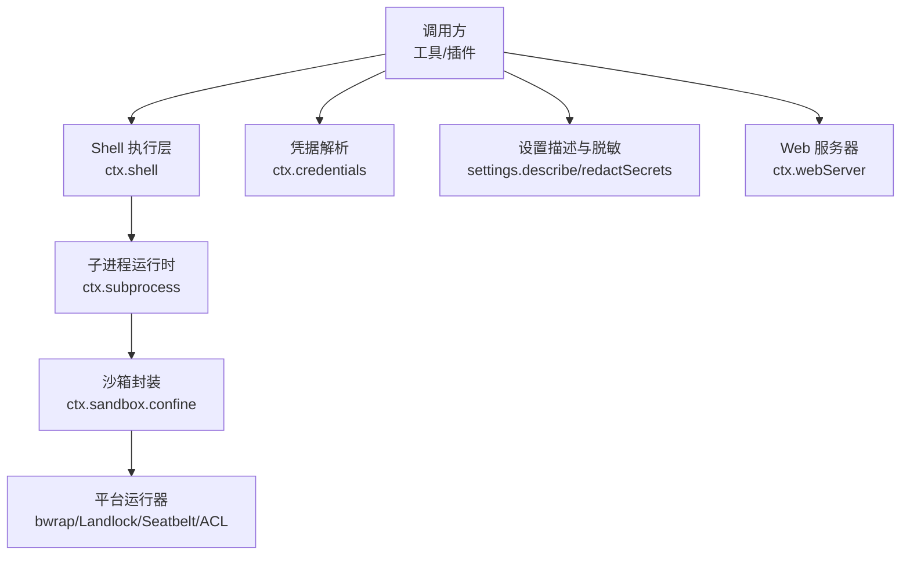
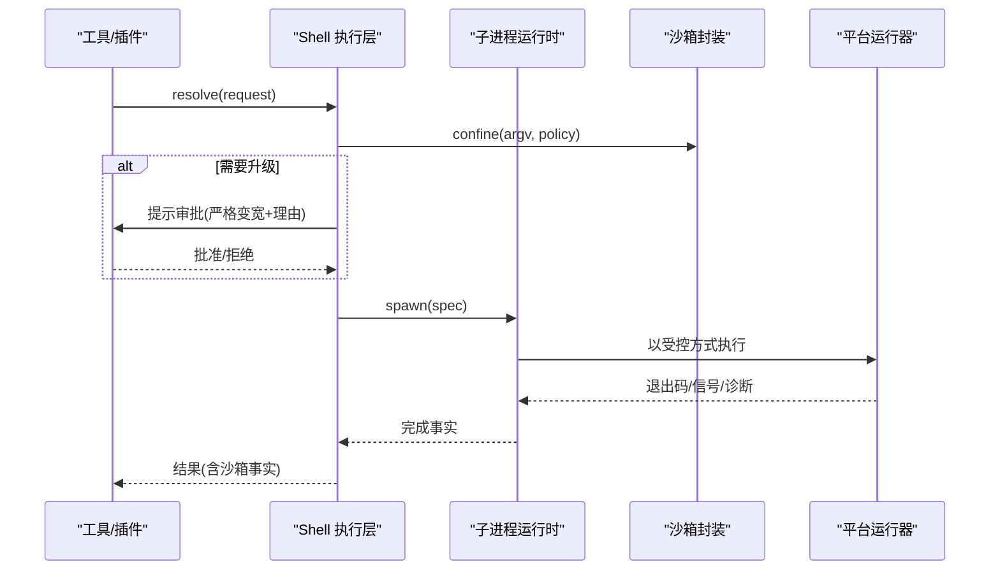
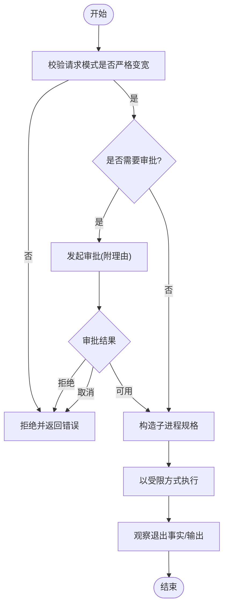
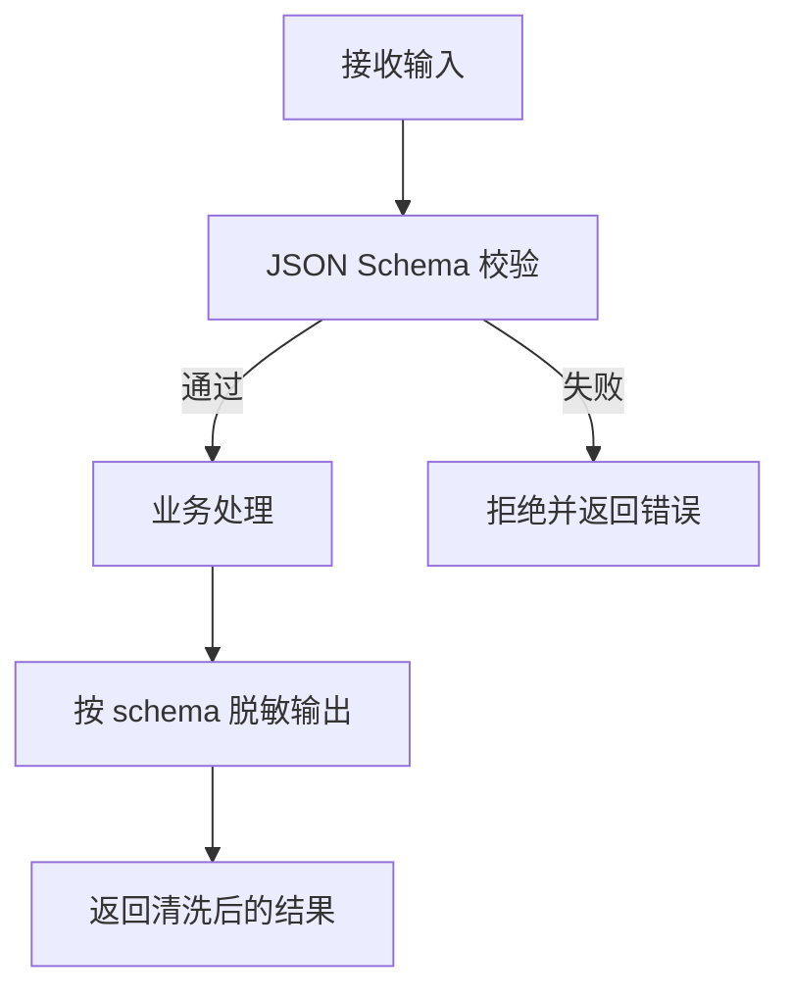
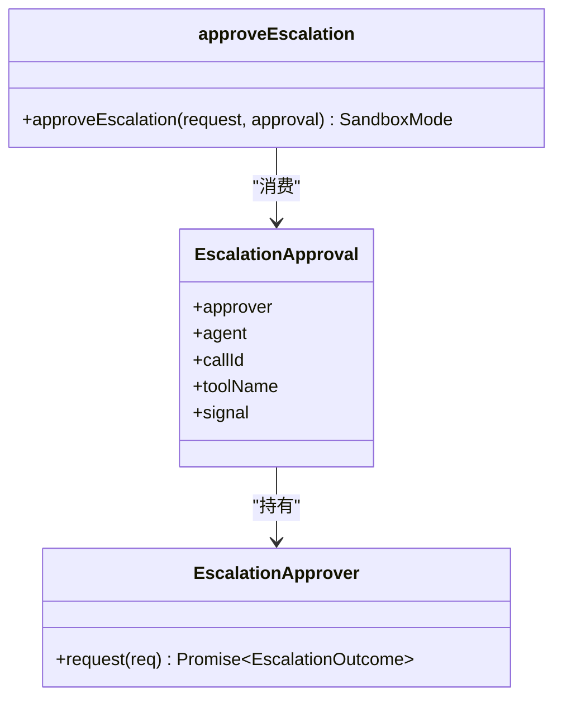
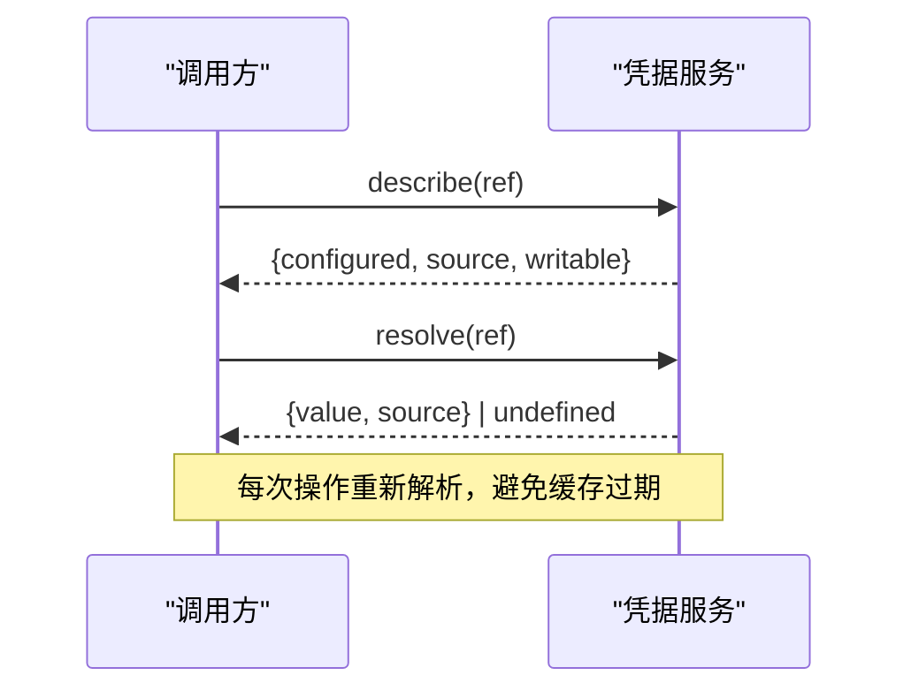
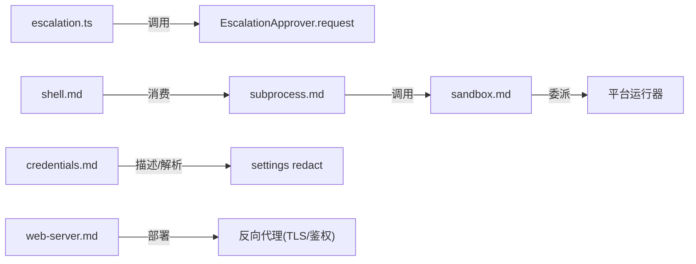
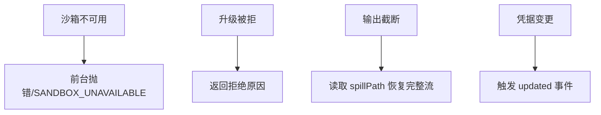

# 安全编码最佳实践

<cite>
**本文引用的文件**
- [packages/sandbox/sandbox/src/escalation.ts](file://packages/sandbox/sandbox/src/escalation.ts)
- [native/landlock-run/AGENTS.md](file://native/landlock-run/AGENTS.md)
- [docs/subsystems/sandbox.md](file://docs/subsystems/sandbox.md)
- [docs/subsystems/shell.md](file://docs/subsystems/shell.md)
- [docs/subsystems/subprocess.md](file://docs/subsystems/subprocess.md)
- [docs/subsystems/credentials.md](file://docs/subsystems/credentials.md)
- [packages/credentials/credentials/src/index.ts](file://packages/credentials/credentials/src/index.ts)
- [packages/settings/settings/tests/redact.spec.ts](file://packages/settings/settings/tests/redact.spec.ts)
- [packages/extensions/cordis-host-runner/src/inspect-registry.ts](file://packages/extensions/cordis-host-runner/src/inspect-registry.ts)
- [docs/subsystems/web-server.md](file://docs/subsystems/web-server.md)
- [packages/host/webserver/README.md](file://packages/host/webserver/README.md)
- [.agents/notes/proposed/process/2026-06-11-supply-chain-and-vendor-drift.md](file://.agents/notes/proposed/process/2026-06-11-supply-chain-and-vendor-drift.md)
</cite>

## 目录
1. [简介](#简介)
2. [项目结构](#项目结构)
3. [核心组件](#核心组件)
4. [架构总览](#架构总览)
5. [详细组件分析](#详细组件分析)
6. [依赖关系分析](#依赖关系分析)
7. [性能与安全权衡](#性能与安全权衡)
8. [故障排查与事件响应](#故障排查与事件响应)
9. [结论](#结论)
10. [附录：工具与清单](#附录工具与清单)

## 简介
本指南面向在 Harness 生态中实现“安全优先”的开发者，聚焦以下主题：进程隔离与资源限制、输入验证与输出清洗、认证授权与权限控制、敏感信息与密钥管理、沙箱与容器安全、网络安全与通信加密、漏洞扫描与安全审计、以及安全事件响应与恢复。内容基于仓库中的子系统文档与源码实现，提供可操作的流程、模式与检查点。

## 项目结构
围绕安全的关键子系统分布在如下位置：
- 进程与子进程：subprocess、shell、sandbox
- 凭据与配置：credentials、settings（含脱敏）
- Web 服务：web-server
- 原生沙箱运行器：native/landlock-run
- 供应链与漏洞扫描建议：.agents/notes 中的过程提案

图表来源
- [docs/subsystems/shell.md:13-99](file://docs/subsystems/shell.md#L13-L99)
- [docs/subsystems/subprocess.md:11-130](file://docs/subsystems/subprocess.md#L11-L130)
- [docs/subsystems/sandbox.md:9-94](file://docs/subsystems/sandbox.md#L9-L94)
- [docs/subsystems/credentials.md:18-50](file://docs/subsystems/credentials.md#L18-L50)
- [docs/subsystems/web-server.md:29-47](file://docs/subsystems/web-server.md#L29-L47)

章节来源
- [docs/subsystems/shell.md:1-100](file://docs/subsystems/shell.md#L1-L100)
- [docs/subsystems/subprocess.md:1-130](file://docs/subsystems/subprocess.md#L1-L130)
- [docs/subsystems/sandbox.md:1-94](file://docs/subsystems/sandbox.md#L1-L94)
- [docs/subsystems/credentials.md:1-50](file://docs/subsystems/credentials.md#L1-L50)
- [docs/subsystems/web-server.md:1-47](file://docs/subsystems/web-server.md#L1-L47)

## 核心组件
- 沙箱与升级审批：通过严格变宽策略与用户审批通道，确保仅在必要时提升权限，且“失败即关闭”。
- 子进程与环境：统一的 spawn/spec/handle 抽象，强制显式配置、环境变量清理、树级终止。
- 凭据与设置：引用式凭据、每操作重解析、描述面不暴露值；设置描述支持按 schema 脱敏。
- Web 服务：仅 loopback 默认绑定，无 TLS/鉴权/源策略，需前置反向代理加固。
- 原生运行器：最小化二进制、静态链接、不可被环境覆盖，规则不可创建则退出而非降级。

章节来源
- [packages/sandbox/sandbox/src/escalation.ts:22-190](file://packages/sandbox/sandbox/src/escalation.ts#L22-L190)
- [docs/subsystems/subprocess.md:11-130](file://docs/subsystems/subprocess.md#L11-L130)
- [docs/subsystems/credentials.md:18-50](file://docs/subsystems/credentials.md#L18-L50)
- [docs/subsystems/web-server.md:29-47](file://docs/subsystems/web-server.md#L29-L47)
- [native/landlock-run/AGENTS.md:9-16](file://native/landlock-run/AGENTS.md#L9-L16)

## 架构总览
下图展示一次受限命令执行的端到端路径，包括沙箱升级审批、子进程启动与结果归因。

图表来源
- [docs/subsystems/shell.md:13-99](file://docs/subsystems/shell.md#L13-L99)
- [docs/subsystems/subprocess.md:89-130](file://docs/subsystems/subprocess.md#L89-L130)
- [docs/subsystems/sandbox.md:9-94](file://docs/subsystems/sandbox.md#L9-L94)
- [packages/sandbox/sandbox/src/escalation.ts:143-190](file://packages/sandbox/sandbox/src/escalation.ts#L143-L190)

## 详细组件分析

### 进程隔离与资源限制（沙箱 + 子进程）
- 模式与执行策略：read-only / workspace-write / danger-full-access，配合工作区根与 session 标识，保证每次能力调用的边界清晰。
- 升级审批：仅允许“严格变宽”，必须附带非空理由并通过审批通道，失败即关闭。
- 子进程规范：spawn spec 全量显式（argv、cwd、stdio、graceMs、signal、env），禁止 shell 解释；stdout/stderr 支持收集并溢出到文件；terminate 统一 SIGTERM→grace→SIGKILL 树级终止。
- 平台运行器约束：规则不可创建或内核不支持时直接退出，绝不回退为无约束执行；二进制不可由环境变量覆盖。

图表来源
- [packages/sandbox/sandbox/src/escalation.ts:143-190](file://packages/sandbox/sandbox/src/escalation.ts#L143-L190)
- [docs/subsystems/subprocess.md:89-130](file://docs/subsystems/subprocess.md#L89-L130)
- [native/landlock-run/AGENTS.md:9-16](file://native/landlock-run/AGENTS.md#L9-L16)

章节来源
- [docs/subsystems/sandbox.md:9-94](file://docs/subsystems/sandbox.md#L9-L94)
- [docs/subsystems/shell.md:141-165](file://docs/subsystems/shell.md#L141-L165)
- [docs/subsystems/subprocess.md:89-130](file://docs/subsystems/subprocess.md#L89-L130)
- [native/landlock-run/AGENTS.md:9-16](file://native/landlock-run/AGENTS.md#L9-L16)

### 输入验证与输出清洗
- 输入验证：对 inspect provider 的输入/输出使用 JSON Schema 校验，违规直接拒绝，避免下游处理不可信数据。
- 输出清洗：对外暴露的设置描述支持按 schema 标记 secret/credential-ref 字段进行脱敏，防止密钥泄露到 UI 或日志。
- 模型可见性：当沙箱拒绝文件访问时，返回标准化 denial marker 与升级提示，引导重试路径。

图表来源
- [packages/extensions/cordis-host-runner/src/inspect-registry.ts:227-248](file://packages/extensions/cordis-host-runner/src/inspect-registry.ts#L227-L248)
- [packages/settings/settings/tests/redact.spec.ts:22-104](file://packages/settings/settings/tests/redact.spec.ts#L22-L104)
- [packages/sandbox/sandbox/src/escalation.ts:63-86](file://packages/sandbox/sandbox/src/escalation.ts#L63-L86)

章节来源
- [packages/extensions/cordis-host-runner/src/inspect-registry.ts:221-248](file://packages/extensions/cordis-host-runner/src/inspect-registry.ts#L221-L248)
- [packages/settings/settings/tests/redact.spec.ts:22-104](file://packages/settings/settings/tests/redact.spec.ts#L22-L104)
- [packages/sandbox/sandbox/src/escalation.ts:63-86](file://packages/sandbox/sandbox/src/escalation.ts#L63-L86)

### 认证授权与权限控制（沙箱升级审批）
- 设计要点：将“谁可以做什么”映射为“当前有效模式 → 目标模式”的严格变宽表；任何升级必须携带理由并经审批通道。
- 失败即关闭：缺少审批服务、无 agent、用户拒绝、取消或不可用均直接报错，不会静默放行。
- 审计自包含：审批请求包含 agent、toolName、callId、reason，便于追踪与回放。

图表来源
- [packages/sandbox/sandbox/src/escalation.ts:95-129](file://packages/sandbox/sandbox/src/escalation.ts#L95-L129)
- [packages/sandbox/sandbox/src/escalation.ts:143-190](file://packages/sandbox/sandbox/src/escalation.ts#L143-L190)

章节来源
- [packages/sandbox/sandbox/src/escalation.ts:22-190](file://packages/sandbox/sandbox/src/escalation.ts#L22-L190)

### 敏感信息保护与密钥管理
- 引用式凭据：配置只保存引用（如环境变量名），实际值由 Provider 管理；每次操作重新解析，支持热更新。
- 描述面安全：describe 仅返回“是否配置/来源/可写”，从不暴露值；本地 Provider 对进程环境注入的引用标记为不可写，防止影子覆盖。
- 设置脱敏：settings.describe 支持 redactSecrets，按 schema 标记的 secret/credential-ref 字段从 base/user/value 中剔除，并记录位置。

图表来源
- [docs/subsystems/credentials.md:18-50](file://docs/subsystems/credentials.md#L18-L50)
- [packages/credentials/credentials/src/index.ts:75-99](file://packages/credentials/credentials/src/index.ts#L75-L99)
- [packages/settings/settings/tests/redact.spec.ts:106-169](file://packages/settings/settings/tests/redact.spec.ts#L106-L169)

章节来源
- [docs/subsystems/credentials.md:1-50](file://docs/subsystems/credentials.md#L1-L50)
- [packages/credentials/credentials/src/index.ts:75-99](file://packages/credentials/credentials/src/index.ts#L75-L99)
- [packages/settings/settings/tests/redact.spec.ts:106-169](file://packages/settings/settings/tests/redact.spec.ts#L106-L169)

### 沙箱环境与容器安全
- 进程级沙箱：通过 ctx.sandbox.confine 将 argv 包装为受限执行，后端选择 bwrap/Landlock/Seatbelt/Windows ACL restricted token。
- 平台运行器约束：规则不可创建或内核不支持时直接退出；二进制与入口包不接受环境变量覆盖；测试通过函数参数注入。
- 容器/微虚拟机：作为独立能力实现存在，不属于 ctx.sandbox 提供者范畴；如需更强隔离，应选用容器/微 VM 方案并在上层编排。

章节来源
- [docs/subsystems/sandbox.md:9-94](file://docs/subsystems/sandbox.md#L9-L94)
- [native/landlock-run/AGENTS.md:9-16](file://native/landlock-run/AGENTS.md#L9-L16)

### 网络安全与通信加密
- Web 服务器默认仅监听 loopback；若绑定 0.0.0.0 会暴露到网络，但当前版本不提供 TLS、鉴权或源策略。
- 部署建议：生产环境务必前置反向代理（Nginx/Traefik 等）启用 HTTPS、鉴权与 CORS/Origin 策略；开发环境保持 127.0.0.1。

章节来源
- [docs/subsystems/web-server.md:29-47](file://docs/subsystems/web-server.md#L29-L47)
- [packages/host/webserver/README.md:19-23](file://packages/host/webserver/README.md#L19-L23)

### 漏洞扫描与安全审计
- 供应链漂移与漏洞扫描：建议在 CI 中集成 advisory 扫描（如 osv-scanner 或 pnpm audit），在锁文件变更 PR 与定时任务上运行；供应商包更新走清单同步流程。
- 构建产物校验：平台包打包前校验二进制存在性与可执行位；入口包校验 lib 产物；发布流水线字节级核对安装产物。

章节来源
- [.agents/notes/proposed/process/2026-06-11-supply-chain-and-vendor-drift.md:18-36](file://.agents/notes/proposed/process/2026-06-11-supply-chain-and-vendor-drift.md#L18-L36)
- [native/landlock-run/AGENTS.md:38-46](file://native/landlock-run/AGENTS.md#L38-L46)

## 依赖关系分析
- 低耦合：沙箱升级审批仅依赖最小接口形状，不引入审批/agent 包，降低循环依赖风险。
- 明确边界：子进程规范屏蔽平台差异，shell 层负责超时/中止分类，sandbox 层专注文件效果策略。
- 外部依赖：Web 服务依赖 node:http；原生运行器仅依赖 libc 并静态链接 musl，减少攻击面。

图表来源
- [packages/sandbox/sandbox/src/escalation.ts:95-129](file://packages/sandbox/sandbox/src/escalation.ts#L95-L129)
- [docs/subsystems/shell.md:13-99](file://docs/subsystems/shell.md#L13-L99)
- [docs/subsystems/subprocess.md:89-130](file://docs/subsystems/subprocess.md#L89-L130)
- [docs/subsystems/sandbox.md:9-94](file://docs/subsystems/sandbox.md#L9-L94)
- [docs/subsystems/credentials.md:18-50](file://docs/subsystems/credentials.md#L18-L50)
- [docs/subsystems/web-server.md:29-47](file://docs/subsystems/web-server.md#L29-L47)

章节来源
- [packages/sandbox/sandbox/src/escalation.ts:95-129](file://packages/sandbox/sandbox/src/escalation.ts#L95-L129)
- [docs/subsystems/shell.md:13-99](file://docs/subsystems/shell.md#L13-L99)
- [docs/subsystems/subprocess.md:89-130](file://docs/subsystems/subprocess.md#L89-L130)
- [docs/subsystems/sandbox.md:9-94](file://docs/subsystems/sandbox.md#L9-L94)
- [docs/subsystems/credentials.md:18-50](file://docs/subsystems/credentials.md#L18-L50)
- [docs/subsystems/web-server.md:29-47](file://docs/subsystems/web-server.md#L29-L47)

## 性能与安全权衡
- 沙箱模式：read-only 最保守，workspace-write 平衡效率与隔离，danger-full-access 仅用于必要场景且需审批。
- 子进程输出：collect 模式有内存上限并可溢出到文件，兼顾吞吐与可恢复性；pipe/inherit 适用于协议流与诊断。
- 凭据解析：每次操作重新解析带来轻微开销，但避免缓存导致密钥过期问题。
- Web 服务：loopback 默认零暴露；生产前置代理增加 TLS 握手与鉴权成本，但显著提升安全性。

[本节为通用指导，不直接分析具体文件]

## 故障排查与事件响应
- 沙箱不可用：当 confined 模式无可用的后端时，抛出 SANDBOX_UNAVAILABLE；前台执行直接失败，后台作业记录 runnerFailed。
- 升级失败：严格变宽不满足、缺少审批服务、无 agent、用户拒绝/取消/不可用，均返回明确错误文本，便于定位。
- 输出截断：CollectedOutput.truncated 指示丢失，spillPath 指向完整流文件，便于取证。
- 事件与审计：凭据变更触发 credentials/updated；沙箱拒绝与升级审批请求自带审计信息（agent/toolName/callId/reason）。

图表来源
- [docs/subsystems/shell.md:141-165](file://docs/subsystems/shell.md#L141-L165)
- [packages/sandbox/sandbox/src/escalation.ts:157-190](file://packages/sandbox/sandbox/src/escalation.ts#L157-L190)
- [docs/subsystems/subprocess.md:13-37](file://docs/subsystems/subprocess.md#L13-L37)
- [docs/subsystems/credentials.md:48-50](file://docs/subsystems/credentials.md#L48-L50)

章节来源
- [docs/subsystems/shell.md:141-165](file://docs/subsystems/shell.md#L141-L165)
- [packages/sandbox/sandbox/src/escalation.ts:157-190](file://packages/sandbox/sandbox/src/escalation.ts#L157-L190)
- [docs/subsystems/subprocess.md:13-37](file://docs/subsystems/subprocess.md#L13-L37)
- [docs/subsystems/credentials.md:48-50](file://docs/subsystems/credentials.md#L48-L50)

## 结论
- 以“失败即关闭”和“严格变宽”为核心原则，贯穿沙箱、子进程与审批链路。
- 通过引用式凭据与设置脱敏，确保密钥不出配置面、不在 UI/日志泄露。
- 将网络暴露面收敛至 loopback，生产环境强制前置反向代理。
- 借助原生运行器的最小化二进制与静态链接，降低攻击面；结合 CI 的漏洞扫描与制品校验，形成闭环。
- 建立清晰的故障分类与审计线索，支撑快速定位与恢复。

[本节为总结，不直接分析具体文件]

## 附录：工具与清单
- 推荐在 CI 中集成 advisory 扫描（osv-scanner 或 pnpm audit），在锁文件变更 PR 与定时任务上运行。
- 平台包与入口包在打包阶段进行二进制与产物校验，确保发布一致性。
- 对 Web 服务，生产部署必须启用 HTTPS、鉴权与源策略（通过反向代理）。

章节来源
- [.agents/notes/proposed/process/2026-06-11-supply-chain-and-vendor-drift.md:18-36](file://.agents/notes/proposed/process/2026-06-11-supply-chain-and-vendor-drift.md#L18-L36)
- [native/landlock-run/AGENTS.md:38-46](file://native/landlock-run/AGENTS.md#L38-L46)
- [docs/subsystems/web-server.md:29-47](file://docs/subsystems/web-server.md#L29-L47)
- [packages/host/webserver/README.md:19-23](file://packages/host/webserver/README.md#L19-L23)