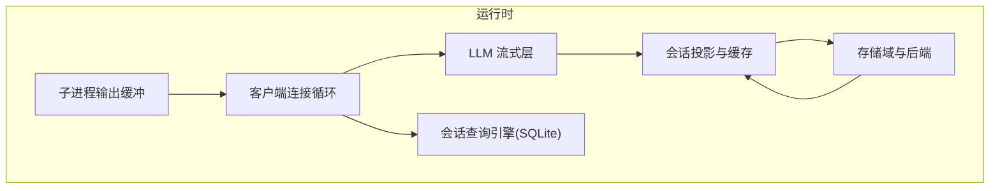
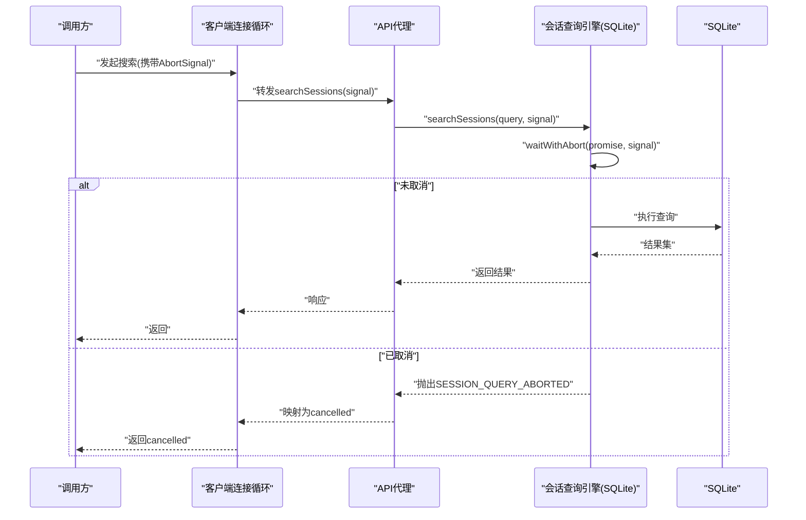
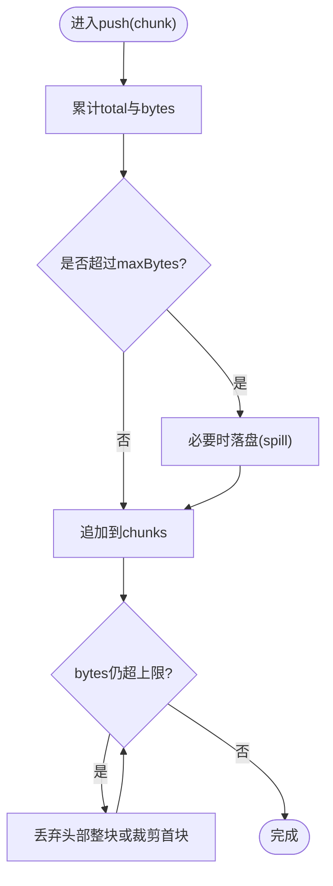
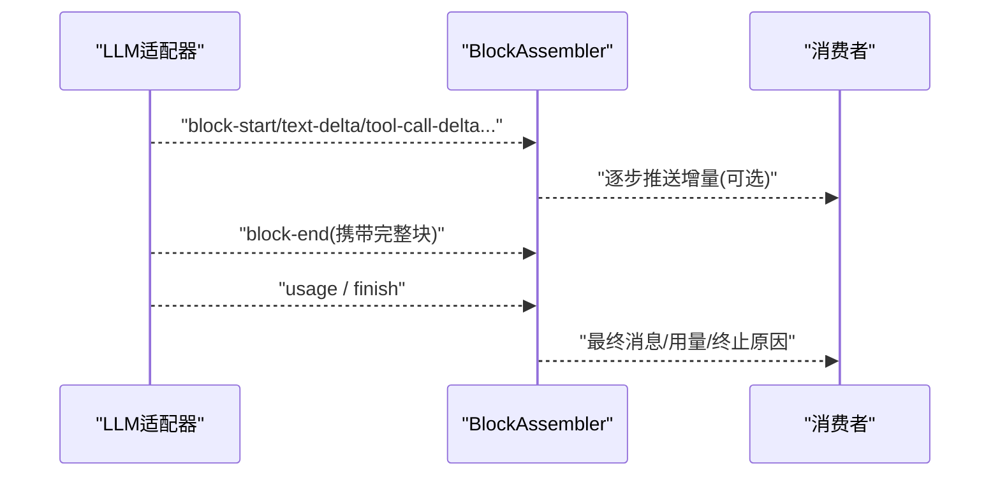
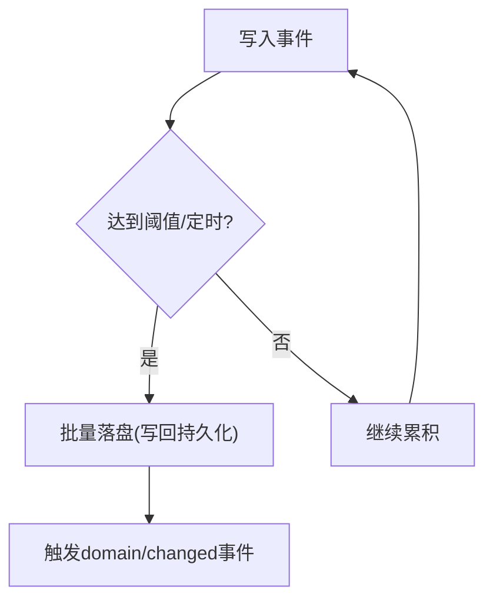
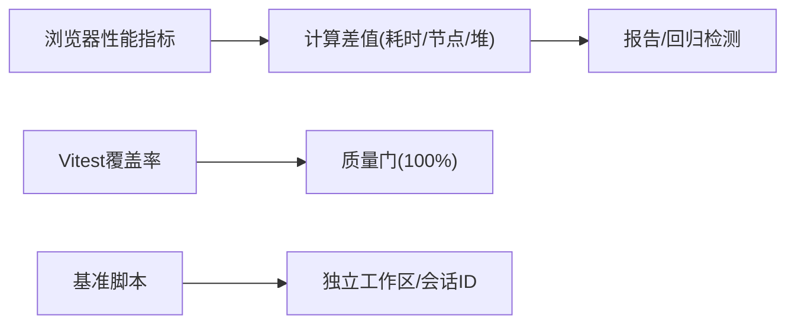
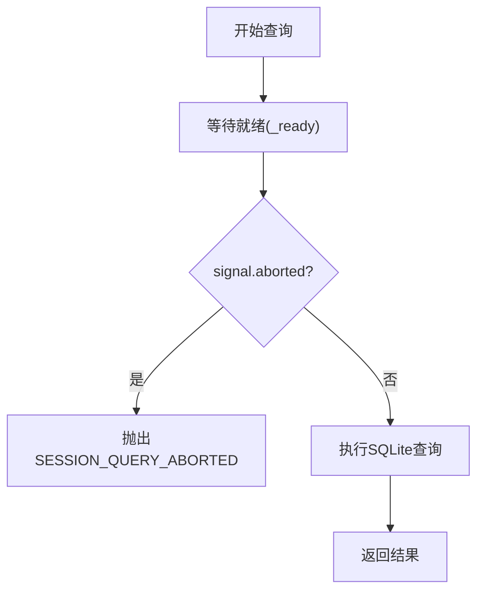
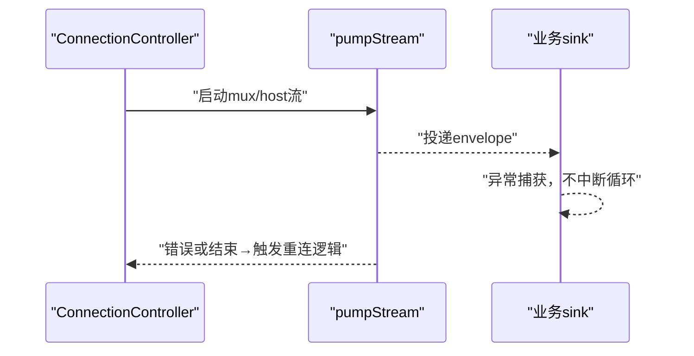
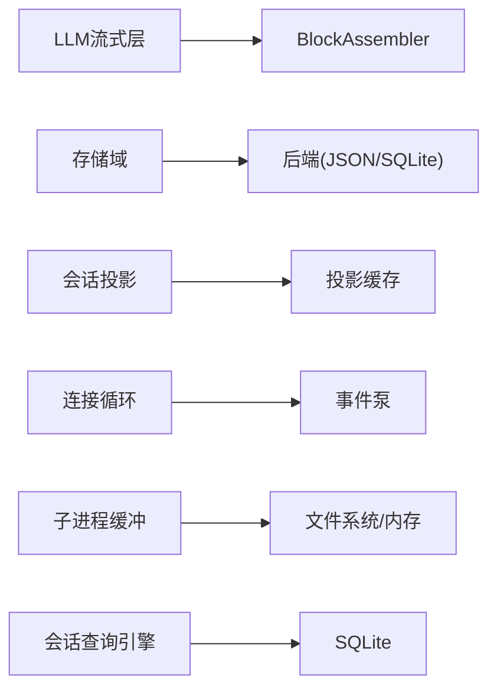

# 性能优化最佳实践

<cite>
**本文引用的文件**
- [BENCHMARK.md](file://BENCHMARK.md)
- [README.md](file://README.md)
- [package.json](file://package.json)
- [vitest.config.ts](file://vitest.config.ts)
- [llm-streaming.md](file://docs/subsystems/llm-streaming.md)
- [storage.md](file://docs/subsystems/storage.md)
- [session-projection.md](file://docs/subsystems/session-projection.md)
- [client/connection/src/client/connection.ts](file://packages/client/connection/src/client/connection.ts)
- [client/connection/tests/connection.client.spec.ts](file://packages/client/connection/tests/connection.client.spec.ts)
- [subprocess-local/src/spawn.ts](file://packages/subprocess/subprocess-local/src/spawn.ts)
- [e2b/subprocess-e2b/src/terminal.ts](file://packages/e2b/subprocess-e2b/src/terminal.ts)
- [session-query-sqlite/src/index.ts](file://packages/session-query/session-query-sqlite/src/index.ts)
- [session-query-sqlite/tests/sqlite.spec.ts](file://packages/session-query/session-query-sqlite/tests/sqlite.spec.ts)
- [host/apiproxy/tests/api-proxy-search.spec.ts](file://packages/host/apiproxy/tests/api-proxy-search.spec.ts)
- [core/agent-loop/src/index.ts](file://packages/core/agent-loop/src/index.ts)
- [session/session-persistence/tests/write-behind.spec.ts](file://packages/session/session-persistence/tests/write-behind.spec.ts)
- [session/session-projection-cache/tests/cache.spec.ts](file://packages/session/session-projection-cache/tests/cache.spec.ts)
- [client/runtime/tests/fake-api.client.ts](file://packages/client/runtime/tests/fake-api.client.ts)
- [client/connection/tests/fake-api.client.ts](file://packages/client/connection/tests/fake-api.client.ts)
- [client/ui-skill/tests/browser-plugin.client.spec.ts](file://packages/client/ui-skill/tests/browser-plugin.client.spec.ts)
- [apps/web/tests/complex-history.perf.ts](file://apps/web/tests/complex-history.perf.ts)
</cite>

## 目录
1. [简介](#简介)
2. [项目结构](#项目结构)
3. [核心组件](#核心组件)
4. [架构总览](#架构总览)
5. [详细组件分析](#详细组件分析)
6. [依赖关系分析](#依赖关系分析)
7. [性能考量](#性能考量)
8. [故障排查指南](#故障排查指南)
9. [结论](#结论)
10. [附录](#附录)

## 简介
本文件面向 DeepSeek Harness 的性能优化与调优，聚焦以下主题：内存管理与垃圾回收、异步与并发、流式数据与背压、缓存策略与数据结构选择、性能监控与诊断、数据库查询与索引、网络请求与连接池、基准测试与回归检测。内容基于仓库中的子系统文档与关键实现，提供可操作的实践建议与可视化说明。

## 项目结构
DeepSeek Harness 采用插件化架构（Cordis），将能力拆分为多个包与子系统。与性能密切相关的模块包括：
- LLM 流式调用与适配器契约
- 存储域与后端抽象（JSON/SQLite）
- 会话投影与持久化缓存
- 客户端连接与重连循环
- 子进程输出缓冲与溢出落盘
- 会话查询引擎（SQLite）
- Web 前端性能指标采集



**图示来源**
- [llm-streaming.md:154-308](file://docs/subsystems/llm-streaming.md#L154-L308)
- [storage.md:26-99](file://docs/subsystems/storage.md#L26-L99)
- [session-projection.md:9-107](file://docs/subsystems/session-projection.md#L9-L107)
- [client/connection/src/client/connection.ts:107-130](file://packages/client/connection/src/client/connection.ts#L107-L130)
- [subprocess-local/src/spawn.ts:123-153](file://packages/subprocess/subprocess-local/src/spawn.ts#L123-L153)
- [session-query-sqlite/src/index.ts:1064-1083](file://packages/session-query/session-query-sqlite/src/index.ts#L1064-L1083)

**章节来源**
- [README.md:1-58](file://README.md#L1-L58)
- [llm-streaming.md:154-308](file://docs/subsystems/llm-streaming.md#L154-L308)
- [storage.md:26-99](file://docs/subsystems/storage.md#L26-L99)
- [session-projection.md:9-107](file://docs/subsystems/session-projection.md#L9-L107)

## 核心组件
- LLM 流式协议与装配器：统一块起始/结束、增量文本/推理/工具调用、用量统计与终止原因；提供 BlockAssembler 将原始流重组为完整消息。
- 存储域与后端：通过 DomainSpec 声明表结构与版本，后端以 kv 面暴露原子写入；读路径从权威内存快照同步返回，写路径串行队列并先持久后改内存。
- 会话投影与缓存：纯函数 apply/view 驱动状态演进，支持冷读阶梯（缓存行→持久化尾部→注册表恢复→回写），按阈值/定时强制落盘。
- 客户端连接循环：复用 AbortController 管理多路事件泵，错误帧收敛到重连，隔离 sink 异常避免级联崩溃。
- 子进程输出缓冲：内存窗口 + 溢出落盘，保持最近 N 字节用于诊断，丢弃头部或裁剪首块以维持精确窗口。
- 会话查询引擎：AbortSignal 贯穿等待，首次搜索共享就绪 Promise，取消在就绪边界检查以避免无谓 SQLite 访问。

**章节来源**
- [llm-streaming.md:154-308](file://docs/subsystems/llm-streaming.md#L154-L308)
- [storage.md:26-99](file://docs/subsystems/storage.md#L26-L99)
- [session-projection.md:9-107](file://docs/subsystems/session-projection.md#L9-L107)
- [client/connection/src/client/connection.ts:107-130](file://packages/client/connection/src/client/connection.ts#L107-L130)
- [subprocess-local/src/spawn.ts:123-153](file://packages/subprocess/subprocess-local/src/spawn.ts#L123-L153)
- [session-query-sqlite/src/index.ts:1064-1083](file://packages/session-query/session-query-sqlite/src/index.ts#L1064-L1083)

## 架构总览
下图展示一次“会话搜索”的端到端流程，体现取消传播、连接循环与 SQLite 查询的协作。



**图示来源**
- [client/connection/src/client/connection.ts:107-130](file://packages/client/connection/src/client/connection.ts#L107-L130)
- [session-query-sqlite/src/index.ts:1064-1083](file://packages/session-query/session-query-sqlite/src/index.ts#L1064-L1083)
- [host/apiproxy/tests/api-proxy-search.spec.ts:853-880](file://packages/host/apiproxy/tests/api-proxy-search.spec.ts#L853-L880)

## 详细组件分析

### 内存管理与垃圾回收优化
- 使用固定大小内存窗口与溢出落盘控制子进程输出内存峰值，避免长流导致堆增长。
- 存储域写路径串行化，先持久再改内存，减少并发竞争与锁粒度；读取走内存快照，零拷贝语义。
- 会话投影状态变更仅在引用变化时触发下游更新，降低无用渲染与序列化开销。
- 连接循环中复用 AbortController 与生成号，避免重复创建对象与泄漏。



**图示来源**
- [subprocess-local/src/spawn.ts:123-153](file://packages/subprocess/subprocess-local/src/spawn.ts#L123-L153)

**章节来源**
- [subprocess-local/src/spawn.ts:123-153](file://packages/subprocess/subprocess-local/src/spawn.ts#L123-L153)
- [storage.md:26-99](file://docs/subsystems/storage.md#L26-L99)
- [session-projection.md:9-107](file://docs/subsystems/session-projection.md#L9-L107)
- [client/connection/src/client/connection.ts:107-130](file://packages/client/connection/src/client/connection.ts#L107-L130)

### 异步操作与并发处理调优
- 连接循环使用 Promise.all 并行打开两条事件流，并通过 generation 与 AbortController 保证生命周期一致。
- 会话查询引擎对等待进行 abort 包装，确保在 readiness 之后仍可快速取消，避免阻塞 SQLite。
- 首次搜索共享就绪 Promise，合并并发启动，减少重复初始化成本。
- AgentLoop 在资源创建前注册中止回调，防止卸载竞态导致的泄漏。

```mermaid
sequenceDiagram
participant Loop as "连接循环"
participant Mux as "mux流"
participant Host as "host流"
participant Sink as "业务sink"
Loop->>Loop : "创建generation与AbortController"
Loop->>Mux : "pumpStream(mux, onMuxEnvelope, settle)"
Loop->>Host : "pumpStream(host, onHostEnvelope, settle)"
Note over Loop,Mux : "任一失败或新generation覆盖则abort当前控制器"
Mux-->>Sink : "envelope"
Host-->>Sink : "envelope"
Sink-->>Sink : "异常被隔离，不触发重连"
```

**图示来源**
- [client/connection/src/client/connection.ts:107-130](file://packages/client/connection/src/client/connection.ts#L107-L130)
- [client/connection/tests/connection.client.spec.ts:120-164](file://packages/client/connection/tests/connection.client.spec.ts#L120-L164)
- [core/agent-loop/src/index.ts:474-487](file://packages/core/agent-loop/src/index.ts#L474-L487)

**章节来源**
- [client/connection/src/client/connection.ts:107-130](file://packages/client/connection/src/client/connection.ts#L107-L130)
- [client/connection/tests/connection.client.spec.ts:120-164](file://packages/client/connection/tests/connection.client.spec.ts#L120-L164)
- [session-query-sqlite/tests/sqlite.spec.ts:281-309](file://packages/session-query/session-query-sqlite/tests/sqlite.spec.ts#L281-L309)
- [core/agent-loop/src/index.ts:474-487](file://packages/core/agent-loop/src/index.ts#L474-L487)

### 流式数据处理与背压
- LLM 适配器遵循“usage 在 finish 之前、空完成视为可重试错误”等契约，BlockAssembler 安全折叠增量块，忽略越界 delta 保护内存。
- 客户端 fake stream 使用 inbox + wake 模式，消费完即 await，避免堆积；支持 abort 信号及时退出。
- 终端输出通过标记解析延迟发布，直到找到起始标记，减少无效缓冲。



**图示来源**
- [llm-streaming.md:154-308](file://docs/subsystems/llm-streaming.md#L154-L308)
- [client/runtime/tests/fake-api.client.ts:336-366](file://packages/client/runtime/tests/fake-api.client.ts#L336-L366)
- [client/connection/tests/fake-api.client.ts:283-313](file://packages/client/connection/tests/fake-api.client.ts#L283-L313)
- [e2b/subprocess-e2b/src/terminal.ts:61-89](file://packages/e2b/subprocess-e2b/src/terminal.ts#L61-L89)

**章节来源**
- [llm-streaming.md:154-308](file://docs/subsystems/llm-streaming.md#L154-L308)
- [client/runtime/tests/fake-api.client.ts:336-366](file://packages/client/runtime/tests/fake-api.client.ts#L336-L366)
- [client/connection/tests/fake-api.client.ts:283-313](file://packages/client/connection/tests/fake-api.client.ts#L283-L313)
- [e2b/subprocess-e2b/src/terminal.ts:61-89](file://packages/e2b/subprocess-e2b/src/terminal.ts#L61-L89)

### 缓存策略与数据结构选择
- 会话投影缓存：按 turn/end 与 session 释放两个强制点落盘；支持按事件计数与时间间隔节流；冷读阶梯最小化 I/O。
- 存储域：KV 表+全局单例，写路径串行、读路径内存快照；版本化 domain/spec 保障向后兼容。
- 客户端技能列表缓存：失败的 fetch 不污染键，允许重试；已完成的 fetch 可被后续调用复用。



**图示来源**
- [session-projection-cache/tests/cache.spec.ts:120-168](file://packages/session/session-projection-cache/tests/cache.spec.ts#L120-L168)
- [session-projection.md:103-147](file://docs/subsystems/session-projection.md#L103-L147)
- [storage.md:26-99](file://docs/subsystems/storage.md#L26-L99)
- [client/ui-skill/tests/browser-plugin.client.spec.ts:230-254](file://packages/client/ui-skill/tests/browser-plugin.client.spec.ts#L230-L254)

**章节来源**
- [session-projection-cache/tests/cache.spec.ts:120-168](file://packages/session/session-projection-cache/tests/cache.spec.ts#L120-L168)
- [session-projection.md:103-147](file://docs/subsystems/session-projection.md#L103-L147)
- [storage.md:26-99](file://docs/subsystems/storage.md#L26-L99)
- [client/ui-skill/tests/browser-plugin.client.spec.ts:230-254](file://packages/client/ui-skill/tests/browser-plugin.client.spec.ts#L230-L254)

### 性能监控与诊断
- Web 性能指标：通过 ChromiumMetrics 计算 wall/task/script/layout/recalcStyle/devtools 等耗时差值，以及节点数、监听器、堆占用变化。
- 覆盖率与质量门：Vitest 配置开启 v8 覆盖率，严格每文件 100% 阈值，配合自定义 reporter 定位未覆盖位置。
- 基准运行：根级脚本与文档指引了如何运行基准与回放。



**图示来源**
- [apps/web/tests/complex-history.perf.ts:544-568](file://apps/web/tests/complex-history.perf.ts#L544-L568)
- [vitest.config.ts:160-283](file://vitest.config.ts#L160-L283)
- [BENCHMARK.md:1-4](file://BENCHMARK.md#L1-L4)

**章节来源**
- [apps/web/tests/complex-history.perf.ts:544-568](file://apps/web/tests/complex-history.perf.ts#L544-L568)
- [vitest.config.ts:160-283](file://vitest.config.ts#L160-L283)
- [BENCHMARK.md:1-4](file://BENCHMARK.md#L1-L4)

### 数据库查询优化与索引设计经验
- 查询取消：waitWithAbort 在等待期间监听 abort，避免长时间阻塞；在 readiness 之后再次检查取消，确保不会进入 SQLite 访问。
- 并发启动优化：首次搜索共享就绪 Promise，避免重复初始化。
- 错误分类：将 SESSION_QUERY_ABORTED 与内部错误区分，便于上层路由与降级。



**图示来源**
- [session-query-sqlite/src/index.ts:1064-1083](file://packages/session-query/session-query-sqlite/src/index.ts#L1064-L1083)
- [session-query-sqlite/tests/sqlite.spec.ts:1669-1700](file://packages/session-query/session-query-sqlite/tests/sqlite.spec.ts#L1669-L1700)
- [session-query-sqlite/tests/sqlite.spec.ts:281-309](file://packages/session-query/session-query-sqlite/tests/sqlite.spec.ts#L281-L309)
- [host/apiproxy/tests/api-proxy-search.spec.ts:853-880](file://packages/host/apiproxy/tests/api-proxy-search.spec.ts#L853-L880)

**章节来源**
- [session-query-sqlite/src/index.ts:1064-1083](file://packages/session-query/session-query-sqlite/src/index.ts#L1064-L1083)
- [session-query-sqlite/tests/sqlite.spec.ts:1669-1700](file://packages/session-query/session-query-sqlite/tests/sqlite.spec.ts#L1669-L1700)
- [session-query-sqlite/tests/sqlite.spec.ts:281-309](file://packages/session-query/session-query-sqlite/tests/sqlite.spec.ts#L281-L309)
- [host/apiproxy/tests/api-proxy-search.spec.ts:853-880](file://packages/host/apiproxy/tests/api-proxy-search.spec.ts#L853-L880)

### 网络请求优化与连接池配置建议
- 连接循环：使用 generation 与 AbortController 管理生命周期，错误帧收敛到重连，sink 异常隔离，避免级联影响。
- 流式传输：fake stream 使用 inbox/wake 模式，消费完即挂起，避免忙轮询；支持 abort 快速退出。
- 连接池：存储域后端通过名称路由，可按需挂载不同后端；SQLite 适合频繁更新的文档型数据，JSON 适合人类可读与原子替换。



**图示来源**
- [client/connection/src/client/connection.ts:107-130](file://packages/client/connection/src/client/connection.ts#L107-L130)
- [client/connection/tests/connection.client.spec.ts:120-164](file://packages/client/connection/tests/connection.client.spec.ts#L120-L164)
- [client/runtime/tests/fake-api.client.ts:336-366](file://packages/client/runtime/tests/fake-api.client.ts#L336-L366)
- [storage.md:26-47](file://docs/subsystems/storage.md#L26-L47)

**章节来源**
- [client/connection/src/client/connection.ts:107-130](file://packages/client/connection/src/client/connection.ts#L107-L130)
- [client/connection/tests/connection.client.spec.ts:120-164](file://packages/client/connection/tests/connection.client.spec.ts#L120-L164)
- [client/runtime/tests/fake-api.client.ts:336-366](file://packages/client/runtime/tests/fake-api.client.ts#L336-L366)
- [storage.md:26-47](file://docs/subsystems/storage.md#L26-L47)

### 性能基准测试与回归检测
- 基准运行：遵循根级文档，使用独立工作区与会话 ID 隔离任务。
- 覆盖率门禁：Vitest 配置启用 v8 覆盖率，设置 perFile 100% 阈值，CI 下输出详细未覆盖位置。
- Web 性能回归：通过复杂历史场景的 perf 用例采集指标差值，作为回归基线。

**章节来源**
- [BENCHMARK.md:1-4](file://BENCHMARK.md#L1-L4)
- [vitest.config.ts:160-283](file://vitest.config.ts#L160-L283)
- [apps/web/tests/complex-history.perf.ts:544-568](file://apps/web/tests/complex-history.perf.ts#L544-L568)
- [package.json:34-47](file://package.json#L34-L47)

## 依赖关系分析
- LLM 流式层依赖适配器契约与 BlockAssembler，向上提供统一的消息与用量模型。
- 存储域解耦后端实现，服务提供者通过名称路由挂载，消费者仅依赖领域接口。
- 会话投影依赖事件源与持久化缓存，形成“热路径内存快照 + 冷路径落盘恢复”的组合。
- 客户端连接循环依赖事件泵与业务 sink，屏蔽底层错误与重连细节。
- 子进程输出缓冲依赖文件系统/内存池，提供稳定诊断尾部。
- 会话查询引擎依赖 SQLite，封装取消与就绪协调。



**图示来源**
- [llm-streaming.md:154-308](file://docs/subsystems/llm-streaming.md#L154-L308)
- [storage.md:26-99](file://docs/subsystems/storage.md#L26-L99)
- [session-projection.md:9-107](file://docs/subsystems/session-projection.md#L9-L107)
- [client/connection/src/client/connection.ts:107-130](file://packages/client/connection/src/client/connection.ts#L107-L130)
- [subprocess-local/src/spawn.ts:123-153](file://packages/subprocess/subprocess-local/src/spawn.ts#L123-L153)
- [session-query-sqlite/src/index.ts:1064-1083](file://packages/session-query/session-query-sqlite/src/index.ts#L1064-L1083)

**章节来源**
- [llm-streaming.md:154-308](file://docs/subsystems/llm-streaming.md#L154-L308)
- [storage.md:26-99](file://docs/subsystems/storage.md#L26-L99)
- [session-projection.md:9-107](file://docs/subsystems/session-projection.md#L9-L107)
- [client/connection/src/client/connection.ts:107-130](file://packages/client/connection/src/client/connection.ts#L107-L130)
- [subprocess-local/src/spawn.ts:123-153](file://packages/subprocess/subprocess-local/src/spawn.ts#L123-L153)
- [session-query-sqlite/src/index.ts:1064-1083](file://packages/session-query/session-query-sqlite/src/index.ts#L1064-L1083)

## 性能考量
- 内存管理
  - 限制流式缓冲区大小，溢出立即落盘，避免堆膨胀。
  - 使用只读快照与不可变消息，减少深拷贝与意外修改。
  - 投影状态仅在引用变化时触发下游，降低渲染与序列化成本。
- 异步与并发
  - 使用 AbortSignal 贯穿所有长耗时操作，确保快速取消。
  - 共享就绪 Promise 合并并发启动，减少重复初始化。
  - 连接循环隔离 sink 异常，避免级联崩溃。
- 流式与背压
  - 遵循 LLM 适配器契约，保证块顺序与用量正确性。
  - 消费端按需推进，避免忙轮询与内存堆积。
- 缓存与数据结构
  - 投影缓存结合阈值与定时落盘，冷读阶梯最小化 I/O。
  - 存储域 KV 表+全局单例，读写分离，版本化演进。
- 监控与诊断
  - 采集浏览器指标差值，建立回归基线。
  - 覆盖率门禁与详细未覆盖报告，提升代码质量。
- 数据库与索引
  - 查询前检查取消，避免无效 SQLite 访问。
  - 根据访问模式选择后端（SQLite 适合高频更新文档）。
- 网络与连接池
  - 连接循环统一错误收敛与重连策略。
  - 后端按名称路由，灵活切换与扩展。

[本节为通用指导，不直接分析具体文件]

## 故障排查指南
- 连接层问题
  - 错误帧收敛到重连而非转发给业务层；sink 异常不影响泵循环。
- 查询取消
  - waitWithAbort 在 readiness 之后再次检查取消，避免进入 SQLite。
  - 上层将 SESSION_QUERY_ABORTED 映射为 cancelled，其他错误保留内部码。
- 子进程输出
  - 若诊断尾部缺失，检查 maxBytes 与 spill 开关；确认头部裁剪逻辑是否生效。
- 投影缓存
  - 若冷读不一致，检查 stateVersion 与日志截断；必要时触发全量重放。

**章节来源**
- [client/connection/tests/connection.client.spec.ts:120-164](file://packages/client/connection/tests/connection.client.spec.ts#L120-L164)
- [session-query-sqlite/src/index.ts:1064-1083](file://packages/session-query/session-query-sqlite/src/index.ts#L1064-L1083)
- [session-query-sqlite/tests/sqlite.spec.ts:1669-1700](file://packages/session-query/session-query-sqlite/tests/sqlite.spec.ts#L1669-L1700)
- [host/apiproxy/tests/api-proxy-search.spec.ts:853-880](file://packages/host/apiproxy/tests/api-proxy-search.spec.ts#L853-L880)
- [subprocess-local/src/spawn.ts:123-153](file://packages/subprocess/subprocess-local/src/spawn.ts#L123-L153)
- [session-projection-cache/tests/cache.spec.ts:120-168](file://packages/session/session-projection-cache/tests/cache.spec.ts#L120-L168)

## 结论
通过统一的流式契约、严格的取消传播、内存友好的缓冲策略、健壮的缓存与存储域设计，以及完善的监控与质量门禁，DeepSeek Harness 在多层面实现了高性能与高可靠性。建议在新增功能时遵循上述原则，并结合基准与覆盖率门禁持续验证性能回归。

[本节为总结，不直接分析具体文件]

## 附录
- 运行基准：参考根级文档，使用独立工作区与会话 ID。
- 覆盖率门禁：Vitest 配置启用 v8 覆盖率，设置 perFile 100% 阈值。
- 脚本入口：根 package.json 提供 test/test:coverage/test:web:perf 等命令。

**章节来源**
- [BENCHMARK.md:1-4](file://BENCHMARK.md#L1-L4)
- [vitest.config.ts:160-283](file://vitest.config.ts#L160-L283)
- [package.json:34-47](file://package.json#L34-L47)