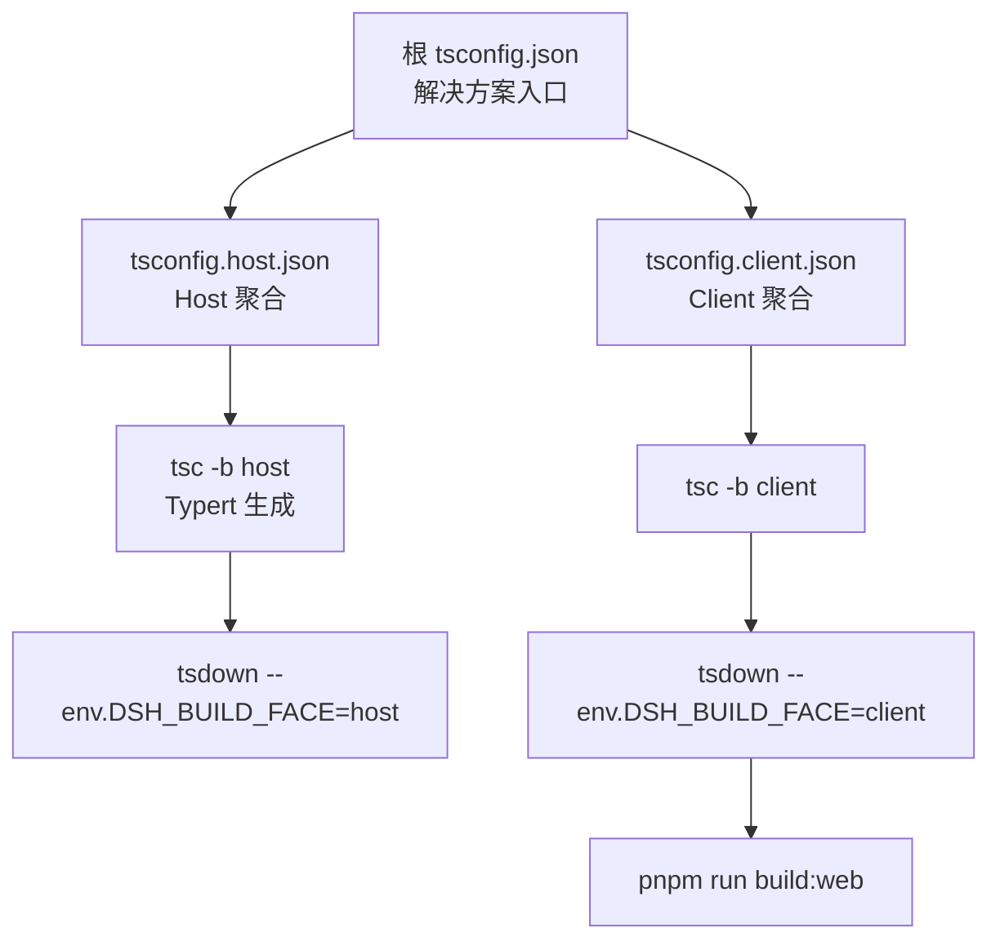
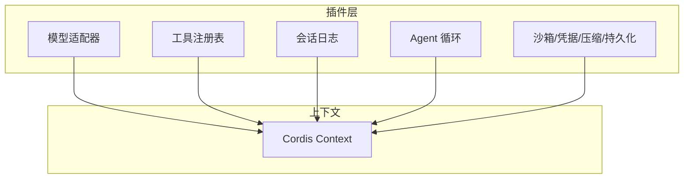
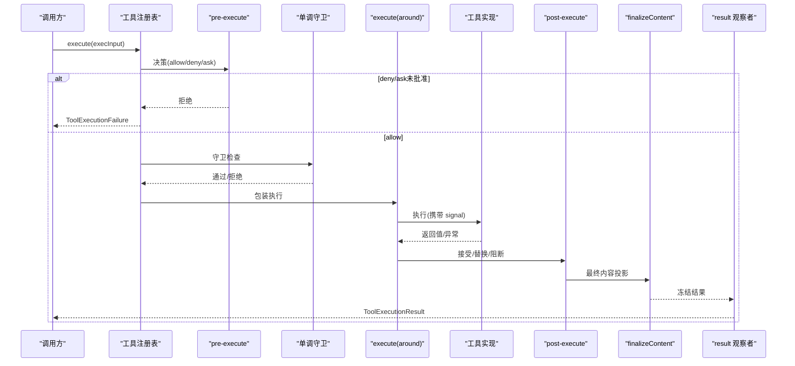
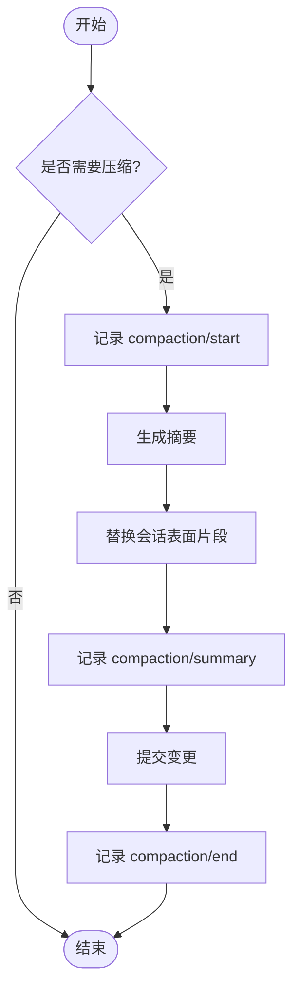
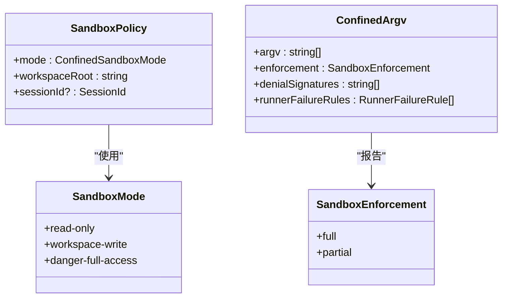
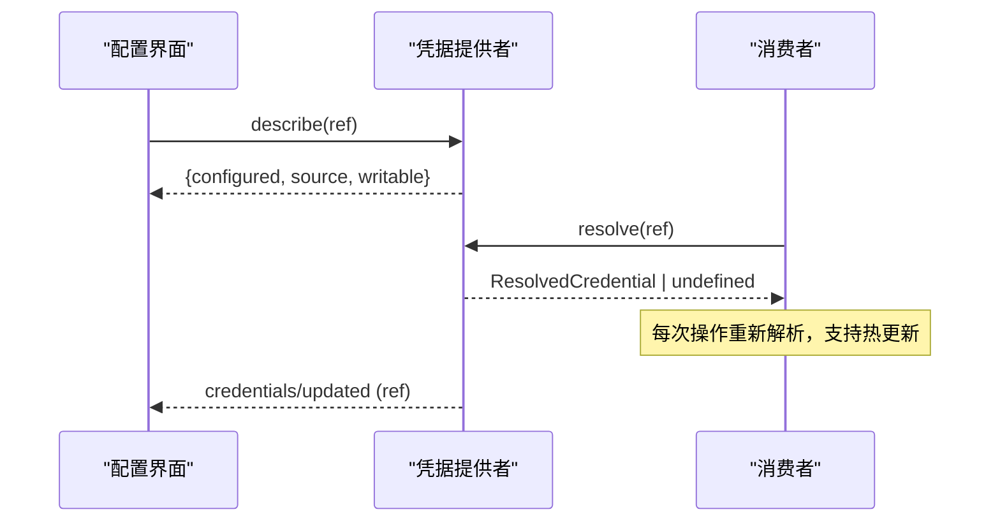
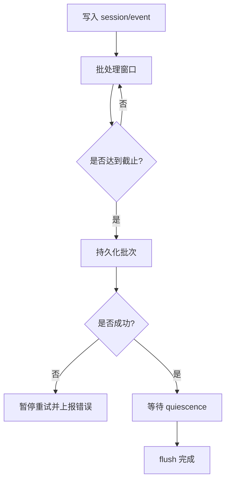
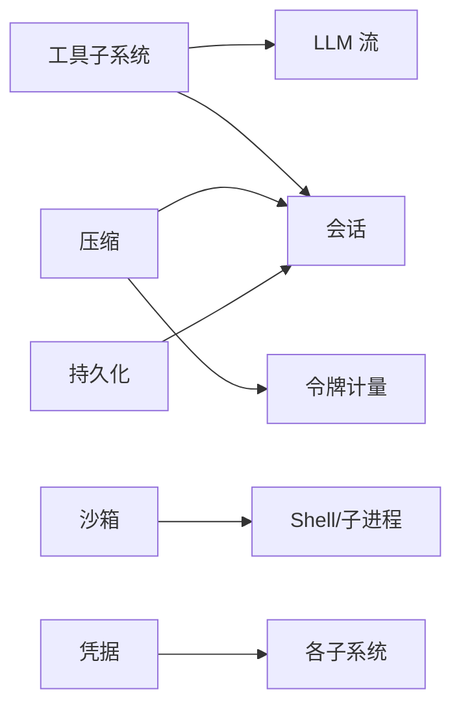

# 最佳实践

<cite>
**本文引用的文件**
- [README.md](file://README.md)
- [development.md](file://docs/development.md)
- [testing.md](file://docs/testing.md)
- [architecture.md](file://docs/architecture.md)
- [defensive-patterns.md](file://docs/defensive-patterns.md)
- [sandbox.md](file://docs/subsystems/sandbox.md)
- [credentials.md](file://docs/subsystems/credentials.md)
- [tools.md](file://docs/subsystems/tools.md)
- [compaction.md](file://docs/subsystems/compaction.md)
- [persistence.md](file://docs/subsystems/persistence.md)
- [responding-to-pr-review-on-a-stack.md](file://docs/cookbook/responding-to-pr-review-on-a-stack.md)
</cite>

## 目录
1. [引言](#引言)
2. [项目结构](#项目结构)
3. [核心组件](#核心组件)
4. [架构总览](#架构总览)
5. [详细组件分析](#详细组件分析)
6. [依赖关系分析](#依赖关系分析)
7. [性能考量](#性能考量)
8. [故障排查指南](#故障排查指南)
9. [结论](#结论)
10. [附录](#附录)

## 引言
本指南汇总了经过验证的开发模式与架构设计原则，覆盖代码组织、模块化、错误处理、防御性编程、性能优化、安全编码、测试策略、可维护性与可扩展性、团队协作与代码审查，以及来自实际项目的成功案例与经验。内容基于仓库中的架构文档、子系统说明、测试策略与开发流程规范提炼而成，旨在帮助团队在复杂插件化系统中保持一致的高质量交付。

## 项目结构
- 多包 Monorepo：Host 与 Client 两个聚合程序通过独立 tsconfig 管理，避免类型合并冲突；根 tsconfig 仅作为解决方案入口与路径门面。
- 构建顺序：先 Host lib（含 Typert 生成），再 Client tsdown，最后 Web 构建；脚本与示例统一通过 base paths 解析到 src，保证测试与静态分析一致性。
- 工作流：Lefthook 本地快速门禁（staged 校验、修复、空格检查、供应商清单守卫）；CI 按车道分组执行，关键 e2e 使用真实 API key 自跳过策略。

图表来源
- [development.md:44-88](file://docs/development.md#L44-L88)

章节来源
- [development.md:44-88](file://docs/development.md#L44-L88)

## 核心组件
- 插件化上下文：一切皆插件，能力以“服务定义 + 提供者 + 消费者”三件套暴露，便于替换与组合。
- 会话日志：append-only 的 SessionEvent 是模型可见上下文的唯一事实源，所有持久化、回放、遥测均派生于此。
- 工具管线：注册、限制、守卫、执行、后置处理、结果观察，形成可插拔的执行水落线。
- 沙箱：进程级隔离，提供 read-only/workspace-write/danger-full-access 模式与后端差异化报告。
- 凭据：引用式配置，运行时逐操作解析，支持热更新与只读来源保护。
- 压缩：可选能力，对会话表面进行摘要压缩，降低上下文压力并保留可重建性。
- 持久化：抽象持久化服务，JSONL/SQLite 两种后端，支持崩溃恢复、版本拒绝、轻量快照。

章节来源
- [architecture.md:9-129](file://docs/architecture.md#L9-L129)
- [tools.md:9-721](file://docs/subsystems/tools.md#L9-L721)
- [sandbox.md:1-219](file://docs/subsystems/sandbox.md#L1-L219)
- [credentials.md:1-134](file://docs/subsystems/credentials.md#L1-L134)
- [compaction.md:1-239](file://docs/subsystems/compaction.md#L1-L239)
- [persistence.md:1-386](file://docs/subsystems/persistence.md#L1-L386)

## 架构总览
系统围绕 Cordis 插件框架组织，通过 profile/bundle 分层装配，能力以 seam 形式解耦。事件驱动贯穿会话、工具、LLM 流等关键路径，确保可观测、可回放、可恢复。

图表来源
- [architecture.md:9-129](file://docs/architecture.md#L9-L129)

## 详细组件分析

### 工具执行管线（安全性与可观测性）
- 注册与限制：ToolDefinition 包含参数 schema、输出 schema、execute、可选 finalizeContent、并发安全标记与 UI 呈现。ToolRestriction 允许 allow/deny 过滤全局工具集。
- 执行水落线：pre-execute（允许/拒绝/请求审批）→ 单调守卫 → execute（around-dispatch 包装）→ post-execute（接受/替换/阻断）→ finalizeContent → result 观察。
- 取消与超时：调用方 AbortSignal 贯穿生命周期；timeoutMs 为协作式预算，由策略包装器执行。
- 结果冻结：成功值经 JSON Schema 校验后冻结，presentation 与 meta 单独计算，最终结果不可变。

图表来源
- [tools.md:170-405](file://docs/subsystems/tools.md#L170-L405)
- [tools.md:478-574](file://docs/subsystems/tools.md#L478-L574)

章节来源
- [tools.md:9-721](file://docs/subsystems/tools.md#L9-L721)

### 会话压缩（性能与上下文管理）
- 触发：pressure/context-overflow 自动触发，或 compactNow/compactRegion 手动触发。
- 事务边界：compaction/start → 摘要 → compaction/summary → user/message 替换 → compaction/end，崩溃时可通过 start/end 不匹配检测孤儿锁。
- 工具结果剪枝：可选工具结果裁剪，减少文本大小，保留 rich-block 顺序。
- 度量：tokenMeter 估算 token 用量，指导阈值与保留策略。

图表来源
- [compaction.md:9-89](file://docs/subsystems/compaction.md#L9-L89)
- [compaction.md:128-195](file://docs/subsystems/compaction.md#L128-L195)

章节来源
- [compaction.md:1-239](file://docs/subsystems/compaction.md#L1-L239)

### 进程沙箱（安全与隔离）
- 模式：read-only/workspace-write/danger-full-access；full/partial 报告后端实际约束力。
- 策略：每调用解析 SandboxPolicy，携带 sessionId/workspaceRoot，支持并发不同策略。
- 失败分类：runnerFailureRules 区分“沙箱基础设施失败”与“被沙箱拒绝”，denialSignatures 用于跨后端识别拒绝原因。
- 失败关闭：无可用后端抛出不可用错误，禁止静默放行。

图表来源
- [sandbox.md:9-94](file://docs/subsystems/sandbox.md#L9-L94)
- [sandbox.md:96-157](file://docs/subsystems/sandbox.md#L96-L157)

章节来源
- [sandbox.md:1-219](file://docs/subsystems/sandbox.md#L1-L219)

### 凭据管理（安全与热更新）
- 引用式配置：settings/cordis.yml 仅保存环境变量名等引用，值由 provider 提供。
- 逐操作解析：每次操作重新 resolve，支持密钥轮换即时生效。
- 描述与写入保护：describe 返回 configured/source/writable，防止只读来源被误写。
- 事件：credentials/updated 通知持久化变更，UI 刷新状态。

图表来源
- [credentials.md:18-50](file://docs/subsystems/credentials.md#L18-L50)
- [credentials.md:60-104](file://docs/subsystems/credentials.md#L60-L104)

章节来源
- [credentials.md:1-134](file://docs/subsystems/credentials.md#L1-L134)

### 会话持久化（可靠性与可恢复性）
- 追加日志：session/event 同步广播，后台批量写入，flush 作为排序与错误观察点。
- 崩溃恢复：冷加载发现未闭合 turn 时合成 interrupted 结束，保持平衡；live session 不注入中断。
- 版本拒绝：未知格式直接拒绝并提示升级方向，避免静默降级。
- 轻量快照：listSnapshots 返回 header+revision，低成本感知变更。

图表来源
- [persistence.md:9-20](file://docs/subsystems/persistence.md#L9-L20)
- [persistence.md:92-125](file://docs/subsystems/persistence.md#L92-L125)

章节来源
- [persistence.md:1-386](file://docs/subsystems/persistence.md#L1-L386)

## 依赖关系分析
- 插件间通过 ctx 键访问服务，避免硬耦合；能力 seam 将接口、实现、消费者分离。
- 工具注册表依赖 LLM 流词汇与工具 schema；压缩依赖会话与 token 计量；持久化依赖会话事件。
- 沙箱与凭据为横切关注点，被多个子系统消费。

图表来源
- [architecture.md:39-129](file://docs/architecture.md#L39-L129)
- [tools.md:9-152](file://docs/subsystems/tools.md#L9-L152)
- [compaction.md:1-89](file://docs/subsystems/compaction.md#L1-L89)
- [persistence.md:1-20](file://docs/subsystems/persistence.md#L1-L20)
- [sandbox.md:1-24](file://docs/subsystems/sandbox.md#L1-L24)
- [credentials.md:1-20](file://docs/subsystems/credentials.md#L1-L20)

章节来源
- [architecture.md:39-129](file://docs/architecture.md#L39-L129)

## 性能考量
- 会话压缩：在压力或上下文溢出时自动压缩历史，减少模型输入成本；工具结果剪枝进一步降低文本体积。
- 持久化批处理：固定批窗口与延迟截止，减少 I/O 次数；flush 作为有序观察点，避免阻塞主循环。
- 工具并发：isConcurrencySafe 标记允许并行执行，exclusive 形成屏障；合理划分任务粒度提升吞吐。
- 资源清理：dispose 必须到达静止态，先关闭监听再终止子进程，避免孤儿与竞态。

章节来源
- [compaction.md:60-89](file://docs/subsystems/compaction.md#L60-L89)
- [persistence.md:9-20](file://docs/subsystems/persistence.md#L9-L20)
- [tools.md:60-74](file://docs/subsystems/tools.md#L60-L74)
- [defensive-patterns.md:19-21](file://docs/defensive-patterns.md#L19-L21)

## 故障排查指南
- 防御性模式：
  - 正交结果独立上报：避免嵌套标志导致误判。
  - 公共契约两侧一致：对外暴露规范化结果，隐藏内部差异。
  - 异步状态非同步状态：明确区间与所有权，避免误用 idle/status。
  - 回调异常隔离：分发器包裹 try/catch，防止坏订阅者破坏核心。
  - 环境隔离：子进程清污 env，临时文件私有权限，避免链接劫持。
  - 符号链接删除：先 lstat 判断再 unlink，避免跟随目标。
- 工具失败：UNKNOWN_TOOL、INVALID_ARGS、INVALID_TOOL_OUTPUT 等结构化错误，便于定位。
- 沙箱失败：区分 runnerFailureRules 与 denialSignatures，前者为基础设施问题，后者为策略拒绝。
- 持久化失败：flush 失败通过 agent/error 上报，不污染会话事件；版本拒绝提示升级方向。

章节来源
- [defensive-patterns.md:7-34](file://docs/defensive-patterns.md#L7-L34)
- [tools.md:327-405](file://docs/subsystems/tools.md#L327-L405)
- [sandbox.md:96-157](file://docs/subsystems/sandbox.md#L96-L157)
- [persistence.md:92-125](file://docs/subsystems/persistence.md#L92-L125)

## 结论
本仓库采用插件化与事件驱动的架构，通过能力 seam 解耦关键子系统，配合严格的测试策略、防御性编程与安全编码实践，实现了高可维护性与可扩展性。建议在新增功能时优先选择已文档化的扩展点，遵循工具/压缩/持久化/沙箱/凭据的既定契约，并以真实入口与端到端场景验证行为。团队协作上，遵循堆叠 PR 的审查与落地流程，确保修复溯源与传播正确。

## 附录

### 测试策略与质量保证
- 分层测试：单元（vitest）、覆盖率门（行级 100%）、真实 API e2e、快照（keyless 预期输出）、Web 浏览器快照。
- 真实优先：尽量使用真实实现而非 mock，仅在昂贵或非确定性边界使用模拟。
- 世界验证：外部断言与字节级对比，避免“自报告”欺骗。
- 真实入口：以构建产物运行 bin/worker，暴露 tsx 掩盖的问题。
- 子进程启动：CI 与有构建的通道从 lib 启动示例，避免手写 tsx 入口。

章节来源
- [testing.md:7-50](file://docs/testing.md#L7-L50)

### 团队协作与代码审查
- 堆叠 PR 审查：每个 PR 对应一个 worktree，修复落在引入问题的层并向上传播；使用官方 stack 特性与技能进行链接与落地。
- 审查要点：验证声明与实际代码一致，重跑相关 gates，确保分支链顺序与可合并性。

章节来源
- [responding-to-pr-review-on-a-stack.md:1-33](file://docs/cookbook/responding-to-pr-review-on-a-stack.md#L1-L33)

### 安全编码建议
- 凭据引用化：配置中不存放明文，运行时逐操作解析，支持热更新与只读来源保护。
- 进程隔离：默认最小权限模式，必要时显式放宽；区分基础设施失败与策略拒绝。
- 输入净化：工具参数严格 schema 校验，输出冻结后再投影；避免将不可信输出带入环境或可预测路径。

章节来源
- [credentials.md:1-50](file://docs/subsystems/credentials.md#L1-L50)
- [sandbox.md:9-24](file://docs/subsystems/sandbox.md#L9-L24)
- [tools.md:98-152](file://docs/subsystems/tools.md#L98-L152)

### 可维护性与可扩展性原则
- 插件即能力：新增行为挂载到已文档化扩展点，避免修改循环本身。
- 事件驱动：会话日志为单一事实源，所有模型可见输入必须可重建。
- 能力 seam：服务定义/提供者/消费者三要素齐备，便于替换与组合。

章节来源
- [architecture.md:99-129](file://docs/architecture.md#L99-L129)