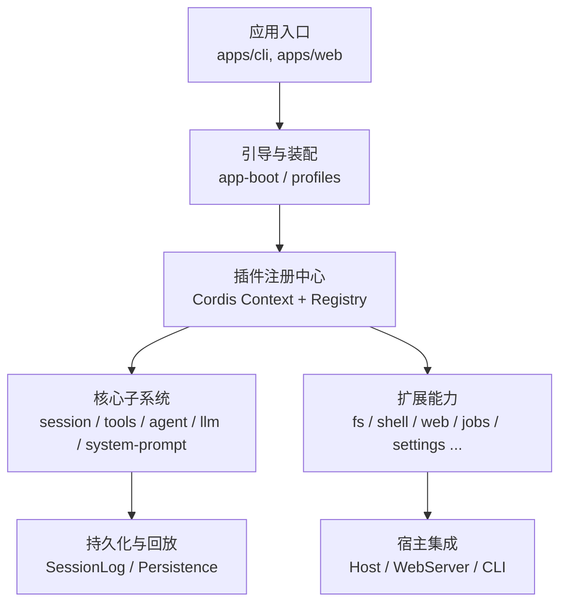
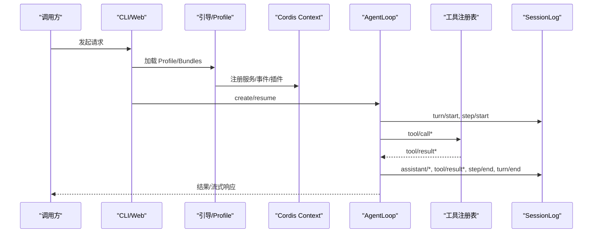
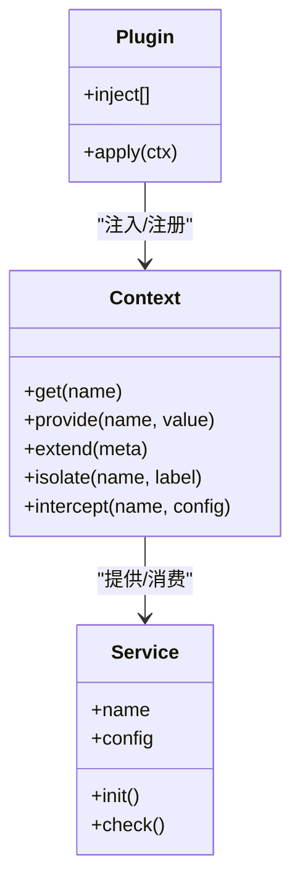
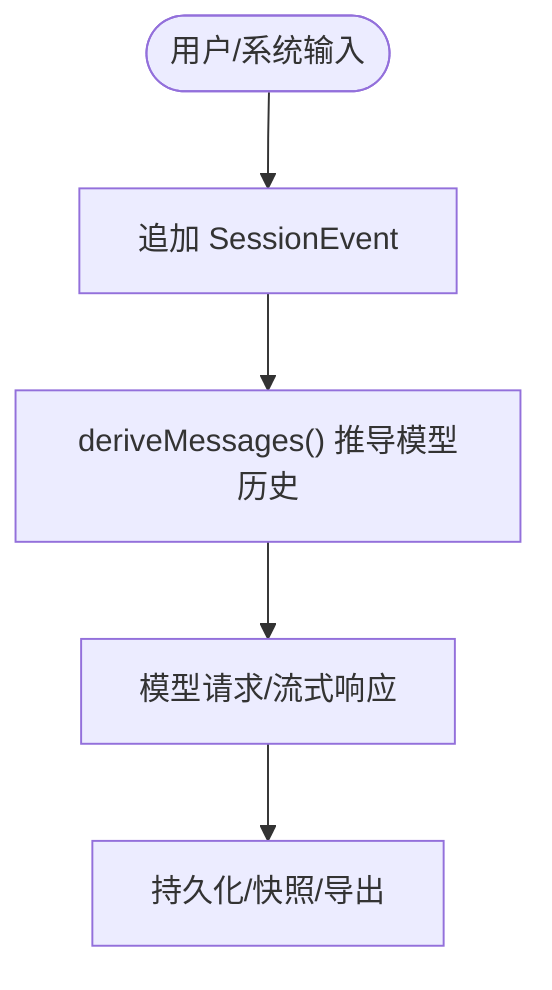
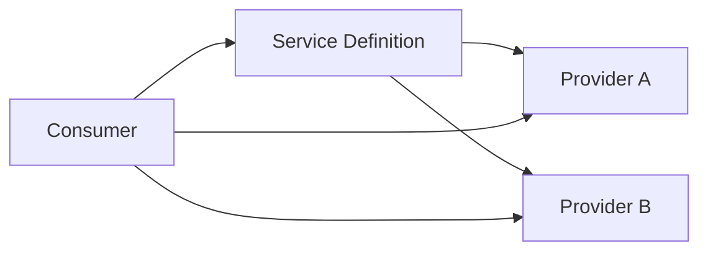
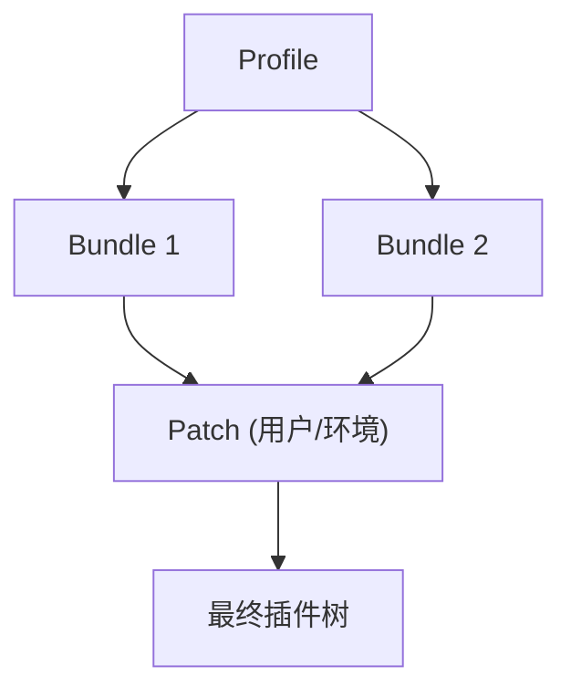
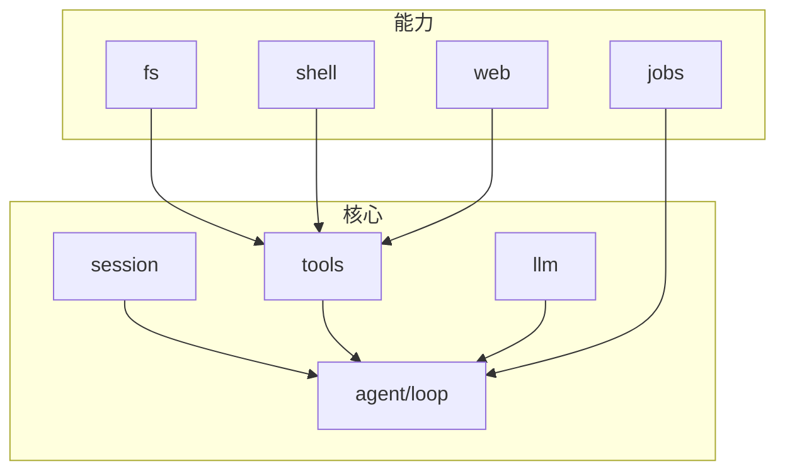

# 架构设计最佳实践

<cite>
**本文引用的文件**
- [docs/architecture.md](file://docs/architecture.md)
- [docs/cordis-primer.md](file://docs/cordis-primer.md)
- [docs/module-graph.md](file://docs/module-graph.md)
- [docs/subsystems/core.md](file://docs/subsystems/core.md)
- [docs/cordis-api/service.md](file://docs/cordis-api/service.md)
- [docs/cordis-api/context.md](file://docs/cordis-api/context.md)
- [apps/cli/src/plugin.ts](file://apps/cli/src/plugin.ts)
- [docs/defensive-patterns.md](file://docs/defensive-patterns.md)
- [docs/cookbook/adding-a-package.md](file://docs/cookbook/adding-a-package.md)
</cite>

## 目录
1. [引言](#引言)
2. [项目结构](#项目结构)
3. [核心组件](#核心组件)
4. [架构总览](#架构总览)
5. [详细组件分析](#详细组件分析)
6. [依赖分析](#依赖分析)
7. [性能考虑](#性能考虑)
8. [故障排查指南](#故障排查指南)
9. [结论](#结论)
10. [附录](#附录)

## 引言
本文件面向插件化架构的设计与实现，围绕 DeepSeek Harness（dsh）的 Cordis 插件框架、服务定位器、上下文传播、能力接缝、事件总线、会话日志驱动的可观测性，以及“微服务思想在单体中的应用”等主题，提供可操作的架构原则、模式与权衡。文档以仓库中的官方文档与源码为依据，强调边界清晰、可替换、可扩展与可维护。

## 项目结构
- 顶层采用多包 monorepo：apps（CLI/Web）、packages（按领域分组的核心能力）、docs（架构与子系统文档）、examples（示例配置与用例）。
- 运行期由“配置文件驱动的插件树”装配：Profile 声明 Bundle 列表，Bundle 提供补丁与代码挂载点；启动时按序叠加，形成最终上下文与服务图。
- 模块依赖通过 peerDependencies 表达运行时关系，并由脚本生成模块依赖图，便于审计耦合与演进风险。



**图表来源**
- [docs/architecture.md:15-37](file://docs/architecture.md#L15-L37)
- [docs/module-graph.md:8-119](file://docs/module-graph.md#L8-L119)

**章节来源**
- [docs/architecture.md:15-37](file://docs/architecture.md#L15-L37)
- [docs/module-graph.md:8-119](file://docs/module-graph.md#L8-L119)

## 核心组件
- 插件与上下文：插件通过 Service 或函数形式声明 inject 与 apply，将能力注册到 ctx；Context 是服务容器与子作用域创建者。
- 事件总线：emit/waterfall/parallel/serial 四种分发模式构成跨插件通信契约，用于观察、拦截、编排与策略控制。
- 会话日志：append-only 的 SessionEvent 流是模型可见事实的唯一真实来源，所有历史推导、回放、遥测、持久化均基于此。
- 能力接缝：Service Definition / Provider / Consumer 三角色分离，使同一接口可被多种后端替换（如 fs、shell、subprocess、llm）。
- 插件装配：Profile/Bundles/Patches 分层叠加，支持热插拔与覆盖；CLI 提供 profile 插件管理并自动同步层栈。

**章节来源**
- [docs/cordis-primer.md:7-14](file://docs/cordis-primer.md#L7-L14)
- [docs/cordis-api/context.md:8-12](file://docs/cordis-api/context.md#L8-L12)
- [docs/architecture.md:53-61](file://docs/architecture.md#L53-L61)
- [docs/architecture.md:92-103](file://docs/architecture.md#L92-L103)
- [apps/cli/src/plugin.ts:1-10](file://apps/cli/src/plugin.ts#L1-L10)

## 架构总览
下图展示从 CLI/Web 启动到插件装配、核心循环、工具执行与会话日志的端到端流程。



**图表来源**
- [docs/architecture.md:63-90](file://docs/architecture.md#L63-L90)
- [docs/subsystems/core.md:7-19](file://docs/subsystems/core.md#L7-L19)

## 详细组件分析

### 插件与上下文（服务定位器与作用域）
- 服务定位：插件通过 ctx.get/inject 获取服务，避免硬编码依赖；ctx.provide 注册当前 fiber 拥有的服务，卸载时自动清理。
- 作用域隔离：ctx.extend/isolate 创建子上下文，实现服务级隔离与配置拦截（intercept），支撑多租户/多会话/多预设场景。
- 动态安全：客户端/宿主侧对动态插件进行白名单校验，仅暴露声明的服务与方法，防止越权访问框架内部。



**图表来源**
- [docs/cordis-api/context.md:14-96](file://docs/cordis-api/context.md#L14-L96)
- [docs/cordis-api/service.md:6-12](file://docs/cordis-api/service.md#L6-L12)

**章节来源**
- [docs/cordis-api/context.md:14-96](file://docs/cordis-api/context.md#L14-L96)
- [docs/cordis-api/service.md:6-12](file://docs/cordis-api/service.md#L6-L12)
- [docs/cordis-primer.md:7-14](file://docs/cordis-primer.md#L7-L14)

### 事件系统与拦截（Waterfall/并行/串行）
- 事件类型：emit（无返回，顺序观察）、waterfall（可短路，顺序包装）、parallel（并发）、serial（有序且可返回）。
- 拦截点：agent/pre-step、tools/*、llm/stream 等关键路径通过 waterfall 允许策略与适配器链式处理。
- 可靠性：监听器失败需隔离，避免破坏核心生命周期；异步状态与同步状态严格区分。

```mermaid
flowchart TD
Start(["进入 Waterfall"]) --> L1["Listener 1"]
L1 --> |next()| L2["Listener 2"]
L2 --> |next()| L3["Listener 3"]
L3 --> End(["返回结果/短路"])
L1 -.->|短路| End
L2 -.->|短路| End
```

**图表来源**
- [docs/cordis-primer.md:15-34](file://docs/cordis-primer.md#L15-L34)
- [docs/architecture.md:53-61](file://docs/architecture.md#L53-L61)

**章节来源**
- [docs/cordis-primer.md:15-34](file://docs/cordis-primer.md#L15-L34)
- [docs/architecture.md:53-61](file://docs/architecture.md#L53-L61)

### 会话日志与可观测性（Append-only 事实源）
- 单一事实源：SessionEvent 追加写入，模型历史 derive 自日志，保证可回放、可重建、可审计。
- 模型可见即日志：任何到达模型请求的内容必须能从日志重构，新增模型可见输入需新增事件类型。
- 回放与投影：UI、遥测、压缩、查询等均基于日志派生，确保一致性与幂等。



**图表来源**
- [docs/architecture.md:92-97](file://docs/architecture.md#L92-L97)
- [docs/subsystems/core.md:244-248](file://docs/subsystems/core.md#L244-L248)

**章节来源**
- [docs/architecture.md:92-97](file://docs/architecture.md#L92-L97)
- [docs/subsystems/core.md:244-248](file://docs/subsystems/core.md#L244-L248)

### 能力接缝与解耦（Definition/Provider/Consumer）
- 角色分离：定义接口（Service Definition）、提供实现（Provider）、消费使用（Consumer）三者解耦，独立演进与发布。
- 典型接缝：fs、shell、subprocess、llm、web、jobs、settings 等均以 provider 形式替换，保持上层稳定。
- 组合方式：通过 Profile/Bundles 选择不同 provider 组合，实现产品形态切换（Web/Headless）。



**图表来源**
- [docs/architecture.md:98-103](file://docs/architecture.md#L98-L103)
- [docs/cookbook/adding-a-package.md:49-69](file://docs/cookbook/adding-a-package.md#L49-L69)

**章节来源**
- [docs/architecture.md:98-103](file://docs/architecture.md#L98-L103)
- [docs/cookbook/adding-a-package.md:49-69](file://docs/cookbook/adding-a-package.md#L49-L69)

### 插件装配与依赖管理（Profile/Bundles/Patches）
- 分层叠加：Profile 列出 Bundles，按序叠加；Patch 可替换行或插入新行，支持运行时覆盖。
- 自动同步：CLI 根据已安装依赖自动 reconcile bundles 列表，新增 bundle 声明即激活。
- 可观测装配：dump-config 输出实际装配树，便于调试与审计。



**图表来源**
- [docs/architecture.md:15-37](file://docs/architecture.md#L15-L37)
- [apps/cli/src/plugin.ts:47-91](file://apps/cli/src/plugin.ts#L47-L91)

**章节来源**
- [docs/architecture.md:15-37](file://docs/architecture.md#L15-L37)
- [apps/cli/src/plugin.ts:47-91](file://apps/cli/src/plugin.ts#L47-L91)

### 微服务思想在单体中的应用
- 服务化拆分：每个能力以包为单位，职责单一、接口稳定，像“微服务”一样独立演进。
- 进程内边界：通过 Context 作用域、ScopeKey、Isolate 实现逻辑上的“进程隔离”，避免共享可变状态。
- 事件驱动：跨包通信以事件为主，降低耦合，提高可测试性与可观测性。
- 可替换后端：provider 机制让存储、网络、沙箱等能力可无缝替换，类似“服务发现+路由”。

**章节来源**
- [docs/architecture.md:9-13](file://docs/architecture.md#L9-L13)
- [docs/subsystems/core.md:7-19](file://docs/subsystems/core.md#L7-L19)
- [docs/cordis-api/context.md:39-96](file://docs/cordis-api/context.md#L39-L96)

## 依赖分析
- 模块依赖图由脚本生成，反映 peerDependencies 的运行时关系；可按组查看核心、LLM、FS、Shell、Web、Session 等包的耦合情况。
- 关键依赖方向：core/session/tools/agent-loop 处于中心位置，其他子系统围绕其协作；llm、fs、shell、web 等作为能力提供者接入。
- 建议：新增包应遵循“最小依赖、明确边界、接口稳定”的原则，优先通过事件与 service seam 交互，避免直接引用具体实现。



**图表来源**
- [docs/module-graph.md:8-119](file://docs/module-graph.md#L8-L119)

**章节来源**
- [docs/module-graph.md:8-119](file://docs/module-graph.md#L8-L119)

## 性能考虑
- 事件分发模式选择：高频低开销用 emit；需要改写/短路用 waterfall；需要并发副作用用 parallel；需要有序决策用 serial。
- 日志驱动减少重复计算：模型历史从日志派生，避免额外缓存与一致性成本。
- 作用域隔离减少锁竞争：通过 isolate/scope 将服务实例限定在最小范围，降低全局状态争用。
- 懒加载与按需装配：Profile/Bundles 按需启用能力，减少冷启动与内存占用。
- 资源释放：effect/disposer 确保订阅、定时器、外部句柄及时回收，避免泄漏。

[本节为通用指导，不直接分析具体文件]

## 故障排查指南
- 生命周期与异步状态：
  - 不要将 followup/status/whenIdle 当作单条消息完成语义；明确区间与所有权。
  - dispose 必须等待真正静默，而非仅发出中止信号。
- 回调异常隔离：监听器抛错不应影响后续 listener 与核心流程。
- 安全与环境：
  - 命令执行环境清洗敏感变量；临时文件使用私有目录与随机名。
  - 符号链接/junction 删除需谨慎，避免跟随目标。
- 事件与拦截：
  - waterfall 中未调用 next() 会短路下游，确认策略是否有意为之。
  - 事件模式与调用点必须匹配，否则行为不符合预期。

**章节来源**
- [docs/defensive-patterns.md:7-33](file://docs/defensive-patterns.md#L7-L33)
- [docs/cordis-primer.md:15-34](file://docs/cordis-primer.md#L15-L34)

## 结论
该仓库以 Cordis 插件框架为核心，构建了高内聚、低耦合、可替换、可演进的单体架构。通过“能力接缝 + 事件驱动 + 会话日志 + 作用域隔离”的组合，实现了类微服务的模块化与可观测性，同时保持了单进程的简单部署与调试体验。实践中应坚持：
- 明确边界：以 Service Definition 为中心，Provider/Consumer 解耦。
- 显式依赖：通过 inject 与 context 获取服务，避免隐式全局。
- 可观测优先：一切模型可见事实入日志，便于回放与诊断。
- 渐进演化：先以插件/补丁扩展，再评估是否需要拆包或引入新 provider。

[本节为总结，不直接分析具体文件]

## 附录
- 术语与参考：
  - 插件/上下文/事件：参见 Cordis Primer 与 API 文档。
  - 核心循环与会话：参见 Core 子系统文档。
  - 模块依赖：参见 Module Graph 文档。
  - 防御性编程：参见 Defensive Patterns。

[本节为索引，不直接分析具体文件]