# 测试策略最佳实践

<cite>
**本文引用的文件**
- [vitest.config.ts](file://vitest.config.ts)
- [vitest.e2e.config.ts](file://vitest.e2e.config.ts)
- [vitest.web.config.ts](file://vitest.web.config.ts)
- [vitest.shared.ts](file://vitest.shared.ts)
- [testing.md](file://docs/testing.md)
- [test-invariants.ts](file://scripts/test-invariants.ts)
- [coverage-exempt.ts](file://scripts/coverage-exempt.ts)
- [support.ts](file://apps/web/tests/support.ts)
- [args.spec.ts](file://apps/cli/tests/args.spec.ts)
- [reasoning-chunks.stress.ts](file://apps/web/stress-tests/reasoning-chunks.stress.ts)
- [vitest.web.perf.config.ts](file://vitest.web.perf.config.ts)
</cite>

## 目录
1. [简介](#简介)
2. [项目结构](#项目结构)
3. [核心组件](#核心组件)
4. [架构总览](#架构总览)
5. [详细组件分析](#详细组件分析)
6. [依赖关系分析](#依赖关系分析)
7. [性能考量](#性能考量)
8. [故障排查指南](#故障排查指南)
9. [结论](#结论)
10. [附录](#附录)

## 简介
本文件基于仓库现有测试配置与实践，系统化阐述分层测试策略（单元测试、集成测试、端到端测试）、模拟与存根使用场景、测试数据与环境管理、快照与视觉回归、性能与负载测试自动化、覆盖率与质量门禁、持续集成与测试自动化工作流，以及调试与排障方法。目标是让不同技术背景的读者都能理解并落地一套可维护、可度量、可演进的测试体系。

## 项目结构
仓库采用多包+多应用的多层测试组织：
- 单元测试：按包隔离，位于各包的 tests 目录，统一由 Vitest 聚合运行，覆盖范围限定在 packages/*/src。
- 端到端测试：分为“真实 API e2e”和“Web 浏览器 e2e”，分别通过独立配置文件控制超时、并发与包含范围。
- 快照与视觉回归：键无关的会话 JSONL 与 UI 截图/文本快照，CI 强制只读回放模式，本地记录需人工审查。
- 性能与压力测试：独立的 Web 性能配置与压力用例，用于评估渲染与交互响应。

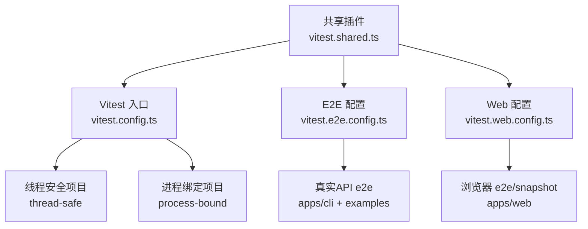

图示来源
- [vitest.config.ts:117-159](file://vitest.config.ts#L117-L159)
- [vitest.e2e.config.ts:31-57](file://vitest.e2e.config.ts#L31-L57)
- [vitest.web.config.ts:16-35](file://vitest.web.config.ts#L16-L35)
- [vitest.shared.ts:15-42](file://vitest.shared.ts#L15-L42)

章节来源
- [vitest.config.ts:85-159](file://vitest.config.ts#L85-L159)
- [vitest.e2e.config.ts:5-57](file://vitest.e2e.config.ts#L5-L57)
- [vitest.web.config.ts:5-35](file://vitest.web.config.ts#L5-L35)
- [vitest.shared.ts:1-42](file://vitest.shared.ts#L1-42)

## 核心组件
- 测试分层与范围
  - 单元测试：packages/*/*/tests/**/*.spec.ts、apps/*/tests/**/*.spec.ts、examples/*/tests/**/*.spec.ts、scripts/**/*.spec.ts。
  - 端到端：apps/cli/tests/*.e2e.ts、examples/*/tests/*.e2e.ts；Web 浏览器 e2e：apps/web/tests/*.e2e.ts 与 *.snapshot.ts。
- 覆盖率门禁
  - 使用 v8 提供者，阈值 perFile 为 true，语句/分支/函数/行均为 100%。
  - 针对平台差异与重型套件提供排除与豁免机制。
- 环境初始化与不变量
  - 全局 setupFiles 注入 test-invariants，自动挂载各包 invariant 伴生服务，确保服务拓扑与生命周期正确。
- 装饰器与路径解析
  - 通过标准装饰器插件与 tsconfig.base.json 路径映射，保证测试始终解析到源码而非构建产物。

章节来源
- [vitest.config.ts:85-159](file://vitest.config.ts#L85-L159)
- [vitest.config.ts:160-283](file://vitest.config.ts#L160-L283)
- [test-invariants.ts:1-47](file://scripts/test-invariants.ts#L1-L47)
- [vitest.shared.ts:15-42](file://vitest.shared.ts#L15-L42)

## 架构总览
下图展示从测试入口到执行环境的整体流程，包括多线程/进程隔离、覆盖率采集、环境变量加载与快照回放模式。

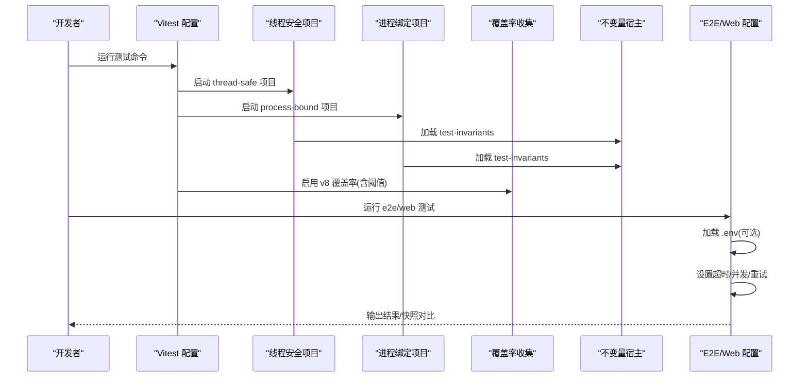

图示来源
- [vitest.config.ts:117-159](file://vitest.config.ts#L117-L159)
- [vitest.config.ts:160-283](file://vitest.config.ts#L160-L283)
- [vitest.e2e.config.ts:5-57](file://vitest.e2e.config.ts#L5-L57)
- [vitest.web.config.ts:5-35](file://vitest.web.config.ts#L5-L35)
- [test-invariants.ts:1-47](file://scripts/test-invariants.ts#L1-L47)

## 详细组件分析

### 单元测试与覆盖率门禁
- 目标与范围
  - 以包为单位组织 spec，聚焦边界条件、错误路径、事件顺序、并发竞态与契约回归。
- 覆盖率要求
  - 每文件 100% 阈值，v8 提供者，仅统计 packages/*/src 下的 TS/TSX 源文件。
  - 对类型文件、bin/worker 入口、客户端 GUI 债务区域等进行精确排除，避免误报。
- 平台与工具链适配
  - Windows 不支持的包/测试集被显式排除；pwsh 缺失时豁免特定文件，保持 CI 与本地一致性。
- 重型套件豁免
  - 将编译器分析与脚本类测试从 instrumented 门中移除，但仍在未插桩并行门中执行，保证正确性信号不丢失。

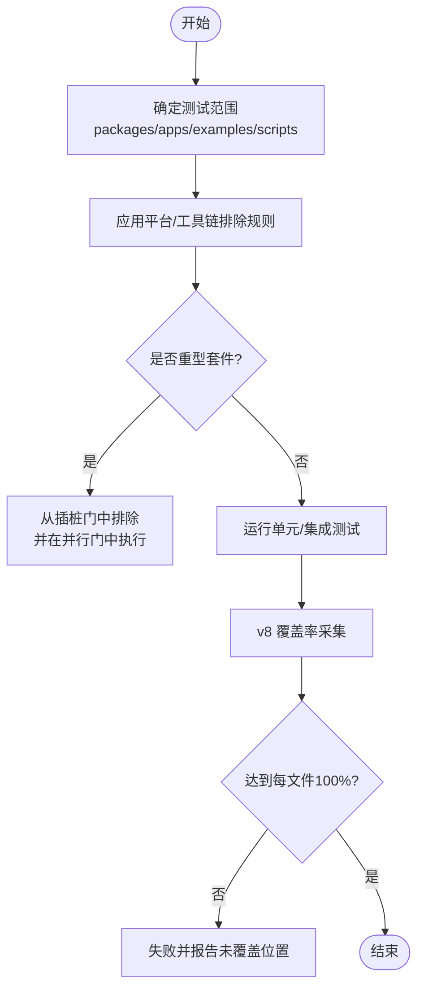

图示来源
- [vitest.config.ts:85-159](file://vitest.config.ts#L85-L159)
- [vitest.config.ts:160-283](file://vitest.config.ts#L160-L283)
- [coverage-exempt.ts:1-42](file://scripts/coverage-exempt.ts#L1-L42)

章节来源
- [vitest.config.ts:85-159](file://vitest.config.ts#L85-L159)
- [vitest.config.ts:160-283](file://vitest.config.ts#L160-L283)
- [coverage-exempt.ts:1-42](file://scripts/coverage-exempt.ts#L1-L42)

### 端到端测试（真实 API）
- 适用范围
  - apps/cli 与 examples 的 e2e 用例，调用真实模型/第三方 API。
- 关键特性
  - 超时与重试：较长超时与 2 次重试，缓解瞬时抖动。
  - 并发控制：通过环境变量限制最大工作进程，便于共享配额保护。
  - 密钥管理：支持 .env 或环境变量注入；无密钥时自跳过，保障 keyless CI。
- 最佳实践
  - 优先真实实现而非 mock；仅在昂贵/非确定性边界进行替换。
  - 资源创建与释放由测试自身负责，避免跨测试污染。

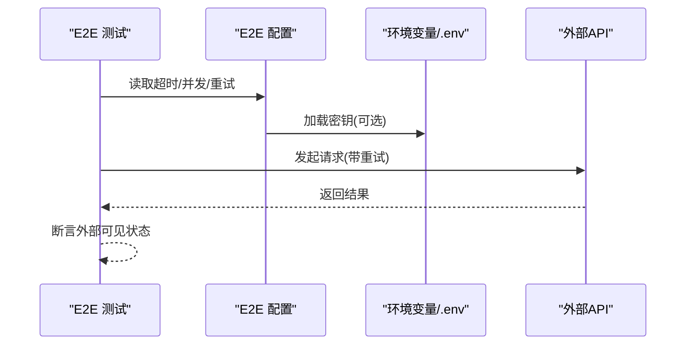

图示来源
- [vitest.e2e.config.ts:5-57](file://vitest.e2e.config.ts#L5-L57)

章节来源
- [vitest.e2e.config.ts:5-57](file://vitest.e2e.config.ts#L5-L57)

### Web 浏览器 e2e 与视觉回归
- 适用范围
  - apps/web 的 e2e 与 snapshot 用例，构建产物作为被测页面。
- 关键特性
  - 串行执行：共享浏览器实例，降低资源竞争。
  - 超长超时：适应浏览器启动与真实模型回合。
  - 回放模式：CI 强制只读回放，禁止写入预期输出；本地记录需人工审查。
- 辅助能力
  - 语言环境固定、端口探测、工作区连接、失败截图等支撑函数。

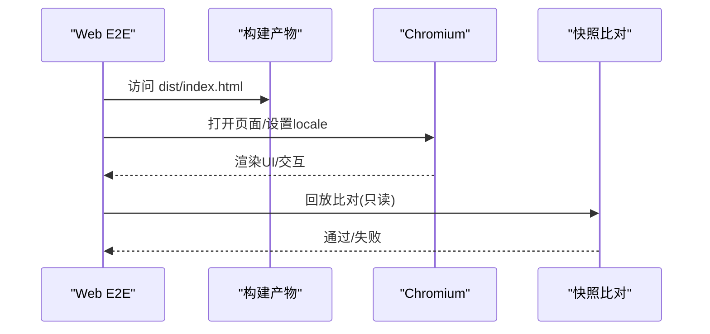

图示来源
- [vitest.web.config.ts:5-35](file://vitest.web.config.ts#L5-L35)
- [support.ts:8-39](file://apps/web/tests/support.ts#L8-L39)

章节来源
- [vitest.web.config.ts:5-35](file://vitest.web.config.ts#L5-L35)
- [support.ts:8-39](file://apps/web/tests/support.ts#L8-L39)

### 测试数据管理与环境配置
- 测试数据
  - 键无关的会话 JSONL 与 UI 快照作为黄金基准；ACP 与 headless 场景分别维护各自快照目录。
- 环境配置
  - 通过 vitest.e2e.config.ts 与 vitest.web.config.ts 动态加载 .env；无密钥时自跳过，保证 keyless 开发体验。
- 不变量与伴生服务
  - 全局 setup 自动发现并挂载各包 invariant 伴生，确保服务拓扑一致性与生命周期正确。

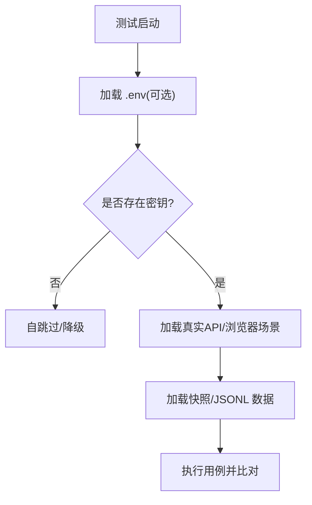

图示来源
- [vitest.e2e.config.ts:5-14](file://vitest.e2e.config.ts#L5-L14)
- [vitest.web.config.ts:5-14](file://vitest.web.config.ts#L5-L14)
- [test-invariants.ts:1-47](file://scripts/test-invariants.ts#L1-L47)

章节来源
- [vitest.e2e.config.ts:5-14](file://vitest.e2e.config.ts#L5-L14)
- [vitest.web.config.ts:5-14](file://vitest.web.config.ts#L5-L14)
- [test-invariants.ts:1-47](file://scripts/test-invariants.ts#L1-L47)

### 模拟与存根的使用指南
- 何时使用
  - 昂贵或非确定性边界（LLM 适配器、网络、时钟）建议使用模拟；下游尽量走真实实现。
- 如何验证
  - 桥接测试使用脚本化 mock 模型配合真实工具与执行器，验证字节流转与副作用。
- 示例参考
  - CLI 参数解析测试通过 vi.spyOn(process.exit/write) 捕获退出码与输出，验证错误路径与帮助行为。

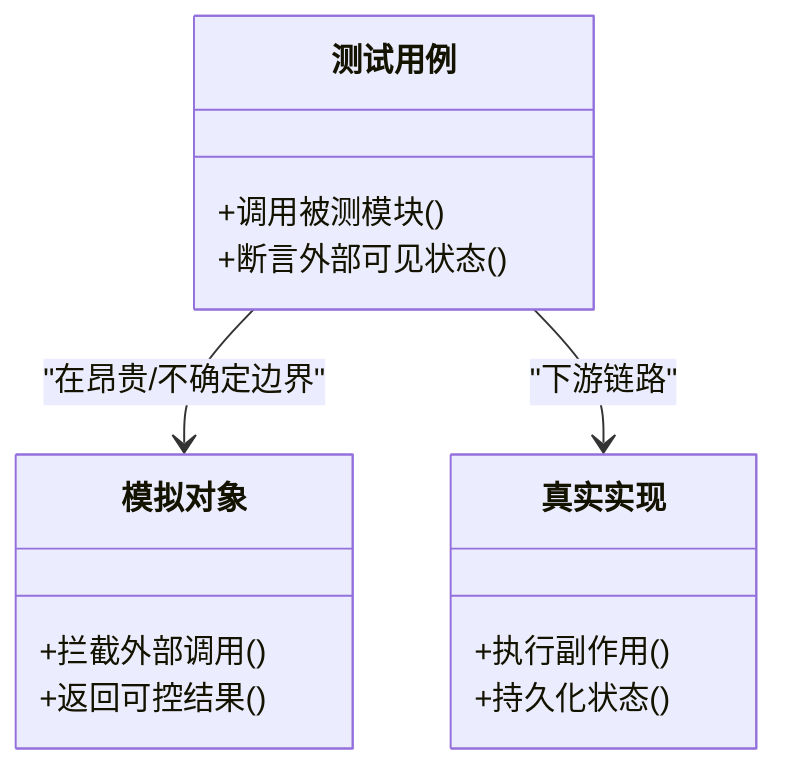

图示来源
- [docs/testing.md:21-29](file://docs/testing.md#L21-L29)
- [args.spec.ts:1-107](file://apps/cli/tests/args.spec.ts#L1-L107)

章节来源
- [docs/testing.md:21-29](file://docs/testing.md#L21-L29)
- [args.spec.ts:1-107](file://apps/cli/tests/args.spec.ts#L1-L107)

### 快照测试与视觉回归
- 键无关快照
  - 传输契约与呈现层通过键无关场景覆盖；ACP 重放录制会话，比较归一化的 JSON-RPC 与重持久化日志。
- 浏览器视觉回归
  - CI 强制回放模式，禁止写入；本地记录与刷新需人工审查差异。
- 最佳实践
  - 任何非平凡模型/协议/人类可见变更都应新增或更新键无关场景；不要以 PR 理由替代可运行示例。

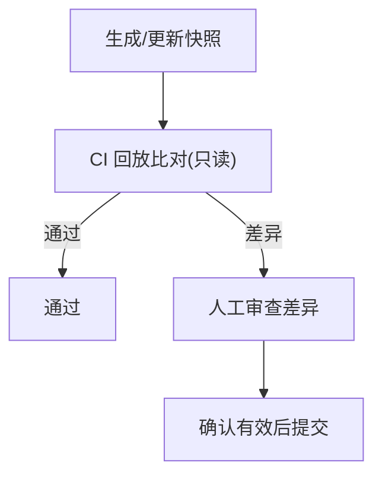

图示来源
- [docs/testing.md:12-15](file://docs/testing.md#L12-L15)
- [docs/testing.md:47-50](file://docs/testing.md#L47-L50)

章节来源
- [docs/testing.md:12-15](file://docs/testing.md#L12-L15)
- [docs/testing.md:47-50](file://docs/testing.md#L47-L50)

### 性能测试与负载测试自动化
- 浏览器压力测试
  - 通过独立配置与用例，向渲染管线注入大量推理分片，测量主线程延迟与交互响应预算。
- 配置要点
  - 超长超时、禁用控制台拦截、单独包含 perf 用例，避免影响常规 CI 门。
- 指标与断言
  - 统计已发射分片数、心跳样本、最大主线程延迟与交互延迟，确保 UI 保持响应。

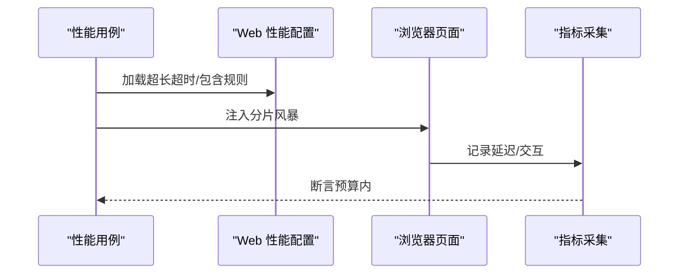

图示来源
- [vitest.web.perf.config.ts:1-16](file://vitest.web.perf.config.ts#L1-L16)
- [reasoning-chunks.stress.ts:1-154](file://apps/web/stress-tests/reasoning-chunks.stress.ts#L1-L154)

章节来源
- [vitest.web.perf.config.ts:1-16](file://vitest.web.perf.config.ts#L1-L16)
- [reasoning-chunks.stress.ts:1-154](file://apps/web/stress-tests/reasoning-chunks.stress.ts#L1-L154)

### 覆盖率要求与代码质量门禁
- 覆盖率门槛
  - 每文件 100%，v8 提供者，严格阈值；未达标会输出具体未覆盖位置。
- 豁免与排除
  - 平台不支持、pwsh 缺失、客户端 GUI 债务区域、生成器源码等均有明确排除策略。
- 重型套件优化
  - 通过环境变量控制豁免列表，减少插桩开销，同时保留正确性信号。

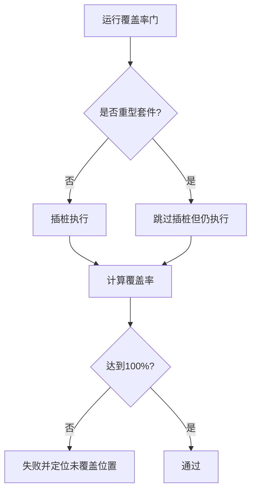

图示来源
- [vitest.config.ts:160-283](file://vitest.config.ts#L160-L283)
- [coverage-exempt.ts:1-42](file://scripts/coverage-exempt.ts#L1-L42)

章节来源
- [vitest.config.ts:160-283](file://vitest.config.ts#L160-L283)
- [coverage-exempt.ts:1-42](file://scripts/coverage-exempt.ts#L1-L42)

### 持续集成与测试自动化工作流
- 分层执行
  - 单元测试与覆盖率门：聚合所有包与脚本 spec，按线程安全/进程绑定拆分项目。
  - 真实 API e2e：受并发与密钥控制，适合有密钥的 CI 流水线。
  - Web 浏览器 e2e：构建产物先行，CI 强制回放模式。
- 关键开关
  - 超时、重试、并发、环境变量、快照模式等均在配置中集中声明，便于在不同环境复用。

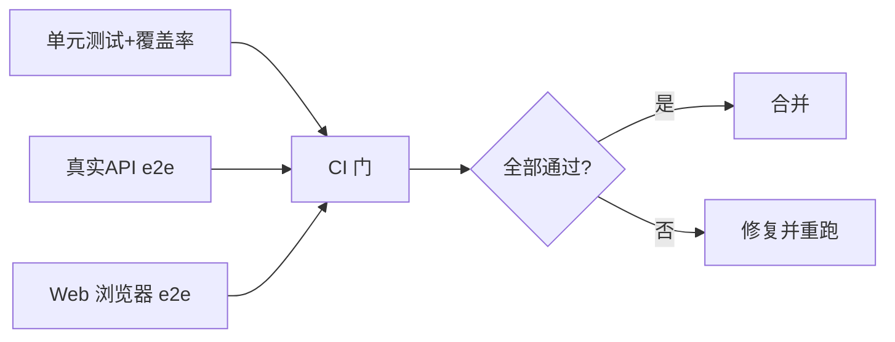

图示来源
- [vitest.config.ts:117-159](file://vitest.config.ts#L117-L159)
- [vitest.e2e.config.ts:31-57](file://vitest.e2e.config.ts#L31-L57)
- [vitest.web.config.ts:16-35](file://vitest.web.config.ts#L16-L35)

章节来源
- [vitest.config.ts:117-159](file://vitest.config.ts#L117-L159)
- [vitest.e2e.config.ts:31-57](file://vitest.e2e.config.ts#L31-L57)
- [vitest.web.config.ts:16-35](file://vitest.web.config.ts#L16-L35)

## 依赖关系分析
- 配置间依赖
  - vitest.shared.ts 提供通用装饰器插件与 execArgv 选项，被 unit/e2e/web 配置复用。
  - vitest.web.perf.config.ts 继承 web 配置并扩展性能用例集合。
- 运行时依赖
  - test-invariants 在 setupFiles 中注入，贯穿所有测试项目，确保服务拓扑一致。
  - coverage-exempt 通过环境变量控制豁免集合，影响覆盖率门的行为。

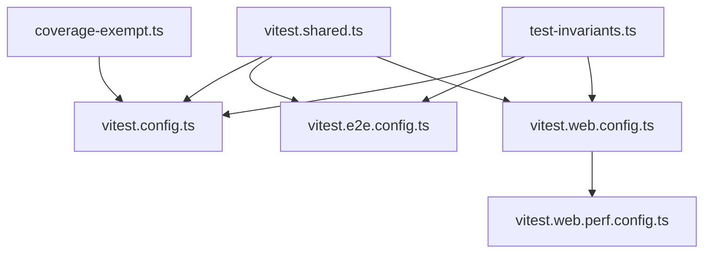

图示来源
- [vitest.shared.ts:15-42](file://vitest.shared.ts#L15-L42)
- [vitest.config.ts:117-159](file://vitest.config.ts#L117-L159)
- [vitest.e2e.config.ts:31-57](file://vitest.e2e.config.ts#L31-L57)
- [vitest.web.config.ts:16-35](file://vitest.web.config.ts#L16-L35)
- [vitest.web.perf.config.ts:1-16](file://vitest.web.perf.config.ts#L1-L16)
- [test-invariants.ts:1-47](file://scripts/test-invariants.ts#L1-L47)
- [coverage-exempt.ts:1-42](file://scripts/coverage-exempt.ts#L1-L42)

章节来源
- [vitest.shared.ts:15-42](file://vitest.shared.ts#L15-L42)
- [vitest.config.ts:117-159](file://vitest.config.ts#L117-L159)
- [vitest.e2e.config.ts:31-57](file://vitest.e2e.config.ts#L31-L57)
- [vitest.web.config.ts:16-35](file://vitest.web.config.ts#L16-L35)
- [vitest.web.perf.config.ts:1-16](file://vitest.web.perf.config.ts#L1-L16)
- [test-invariants.ts:1-47](file://scripts/test-invariants.ts#L1-L47)
- [coverage-exempt.ts:1-42](file://scripts/coverage-exempt.ts#L1-L42)

## 性能考量
- 并发与隔离
  - 线程安全与进程绑定两类项目分离，避免进程级状态污染；E2E 通过 maxWorkers 控制并发。
- 超时与重试
  - 真实 API 与 Web 场景均设置更长超时；E2E 默认重试 2 次，提升稳定性。
- 快照与回放
  - CI 强制回放模式，避免意外写入；本地记录需人工审查，防止漂移累积。
- 压力测试
  - 独立配置与用例隔离，避免干扰常规门；关注主线程延迟与交互响应预算。

[本节为通用指导，不直接分析具体文件]

## 故障排查指南
- 常见问题定位
  - 覆盖率不达标：查看未覆盖位置报告，确认是否为死代码或需要补充测试。
  - 平台相关失败：检查 Windows 不支持的包/测试排除；确认 pwsh 可用性。
  - 密钥缺失导致跳过：确认 .env 或环境变量是否正确注入；必要时调整并发。
  - 浏览器快照不一致：确认 CI 回放模式；本地记录需人工审查差异。
- 调试技巧
  - 使用支持函数获取自由端口、失败截图与工作区连接，快速复现问题。
  - 通过 CLI 参数解析测试中的 spy 技巧，捕获退出码与输出，验证错误路径。

章节来源
- [vitest.config.ts:160-283](file://vitest.config.ts#L160-L283)
- [vitest.e2e.config.ts:5-57](file://vitest.e2e.config.ts#L5-L57)
- [support.ts:41-121](file://apps/web/tests/support.ts#L41-L121)
- [args.spec.ts:1-107](file://apps/cli/tests/args.spec.ts#L1-L107)

## 结论
本仓库建立了清晰的分层测试体系：以严格的覆盖率门禁保障单元质量，以键无关快照与浏览器回放保障端到端行为，以压力测试保障用户体验。通过环境变量与配置集中管理，兼顾本地开发与 CI 的一致性。建议在新功能规划阶段即明确覆盖层级、快照策略与性能预算，确保测试资产与实现同步演进。

[本节为总结性内容，不直接分析具体文件]

## 附录
- 术语
  - 键无关测试：不依赖外部密钥的测试，用于稳定回归。
  - 快照回放：CI 中只读比对预期输出，禁止写入。
  - 不变量：服务拓扑与生命周期约束，确保测试环境一致性。
- 参考
  - 测试政策文档与 Agent Notes 提供背景与决策依据。

[本节为概念性内容，不直接分析具体文件]