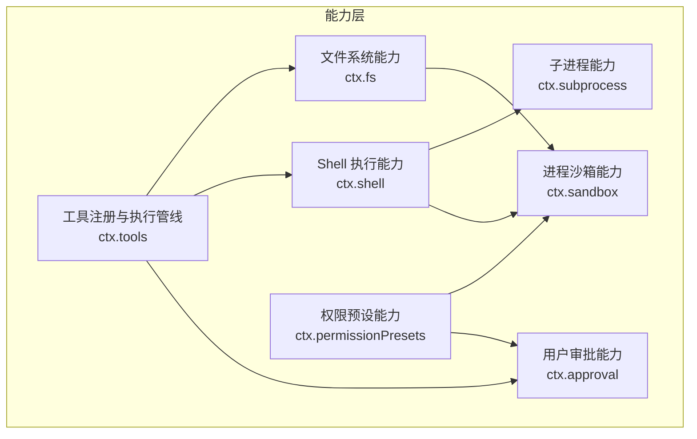
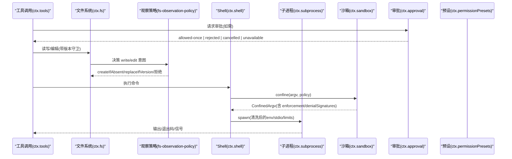
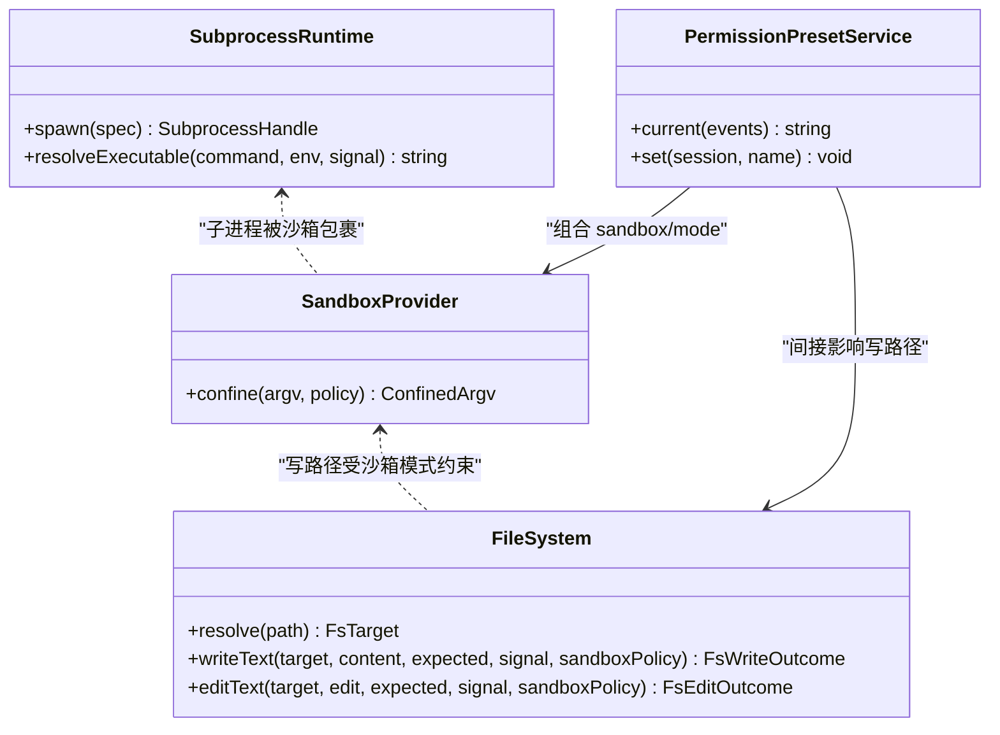
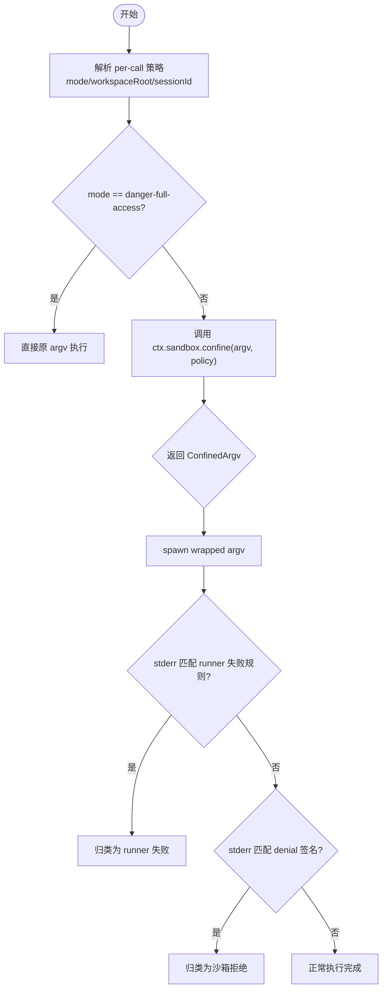
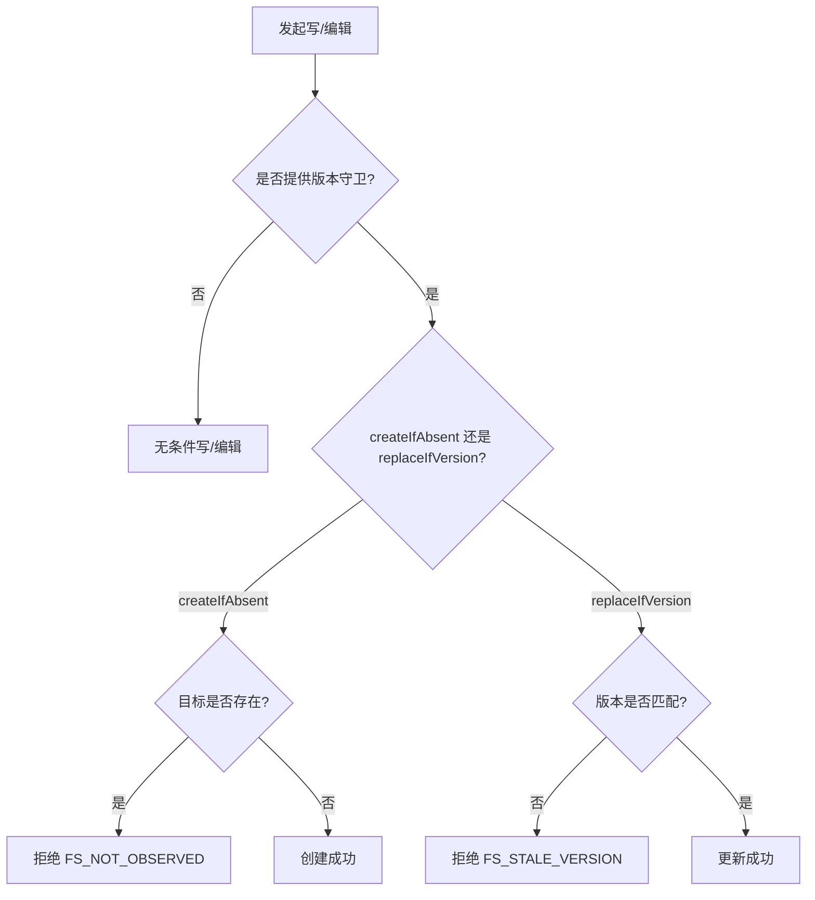
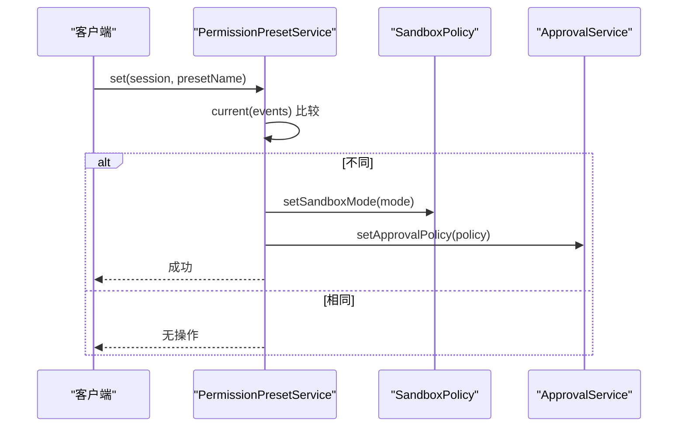
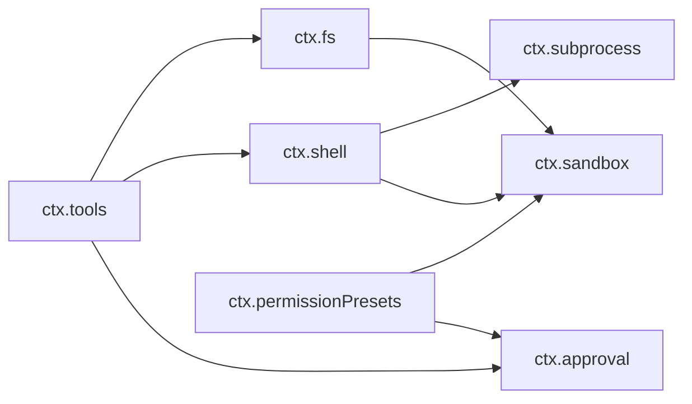

# 安全架构

<cite>
**本文引用的文件**
- [docs/capability-seams.md](file://docs/capability-seams.md)
- [docs/architecture.md](file://docs/architecture.md)
- [docs/subsystems/sandbox.md](file://docs/subsystems/sandbox.md)
- [docs/subsystems/permission-presets.md](file://docs/subsystems/permission-presets.md)
- [docs/subsystems/approval.md](file://docs/subsystems/approval.md)
- [docs/subsystems/filesystem.md](file://docs/subsystems/filesystem.md)
- [docs/subsystems/subprocess.md](file://docs/subsystems/subprocess.md)
- [packages/sandbox/sandbox/src/index.ts](file://packages/sandbox/sandbox/src/index.ts)
- [packages/interaction/permission-presets/src/index.ts](file://packages/interaction/permission-presets/src/index.ts)
</cite>

## 目录
1. [简介](#简介)
2. [项目结构](#项目结构)
3. [核心组件](#核心组件)
4. [架构总览](#架构总览)
5. [详细组件分析](#详细组件分析)
6. [依赖关系分析](#依赖关系分析)
7. [性能与资源限制](#性能与资源限制)
8. [故障排查指南](#故障排查指南)
9. [结论](#结论)
10. [附录：最佳实践与常见问题](#附录最佳实践与常见问题)

## 简介
本文件系统性阐述 DeepSeek Harness 的安全架构，围绕 Capability Seams 的安全模型、服务定义/提供者/消费者角色分离、沙箱进程隔离（文件系统访问控制、网络权限、资源限制）、权限预设系统、安全边界设计原则与实现策略展开。同时给出威胁模型、防护措施、安全配置最佳实践与常见安全问题解决方案，帮助读者在理解代码级实现的同时，掌握部署与运维层面的安全要点。

## 项目结构
Harness 以 Cordis 插件体系组织能力，通过“能力接缝（Capability Seam）”将可替换的能力拆分为服务定义、服务提供者与服务消费者三层。与安全相关的关键子系统包括：
- 进程沙箱：ctx.sandbox（抽象）+ sandbox-local（Linux bwrap/Landlock、macOS Seatbelt、Windows ACL）
- 子进程管理：ctx.subprocess（抽象）+ subprocess-local（环境清理、输出收集、终止升级）
- 文件系统：ctx.fs（抽象）+ fs-local/fs-sandbox + fs-observation-policy（读前观察、版本守卫）
- 用户审批：ctx.approval（ask/never 策略、审计事件）
- 权限预设：ctx.permissionPresets（组合 sandbox/mode 与 approval/policy 的预设表）
- 工具执行管线：ctx.tools（前置/后置策略、单调性守卫、结果观测）

图表来源
- [docs/capability-seams.md:1-472](file://docs/capability-seams.md#L1-L472)
- [docs/subsystems/sandbox.md:1-219](file://docs/subsystems/sandbox.md#L1-L219)
- [docs/subsystems/filesystem.md:1-496](file://docs/subsystems/filesystem.md#L1-L496)
- [docs/subsystems/subprocess.md:1-325](file://docs/subsystems/subprocess.md#L1-L325)
- [docs/subsystems/approval.md:1-171](file://docs/subsystems/approval.md#L1-L171)
- [docs/subsystems/permission-presets.md:1-132](file://docs/subsystems/permission-presets.md#L1-L132)

章节来源
- [docs/architecture.md:1-130](file://docs/architecture.md#L1-L130)
- [docs/capability-seams.md:1-472](file://docs/capability-seams.md#L1-L472)

## 核心组件
- Capability Seams 安全模型
  - 每个能力由“服务定义（Service Definition）—服务提供者（Service Provider）—消费者（Consumer）”构成，解耦接口、实现与调用方，使安全策略可在提供者侧独立演进（如将本地 bash 替换为沙箱化 bash）。
  - 关键能力包括：shell、fs、subprocess、sandbox、approval、tools、permission-presets。

- 沙箱系统（进程隔离）
  - 模式：read-only、workspace-write、danger-full-access；仅前两种可下发给提供者，danger-full-access 直接绕过 confinement。
  - 执行策略：按每次能力调用解析完整策略（mode + workspaceRoot + sessionId），确保并发会话互不干扰。
  - 后端报告：enforcement 为 full/partial，partial 表示内核 ABI 或平台限制导致无法完全约束，需要拒绝或显式提示。

- 权限预设系统
  - 将独立的两个开关（sandbox/mode 与 approval/policy）打包为预设，默认提供 workspace-write（ask）与 danger-full-access（never）。
  - 切换时记录 log-only 的 permission/preset 事件，再写入各自 setter；current() 从事件折叠推导当前有效预设。

- 用户审批
  - 策略：ask（委派答案器链，无答案则 unavailable）与 never（直接 rejected）。
  - 审计：approval/asked + approval/decided 成对日志，不可进入模型转录；失败关闭（fail-closed）。

- 文件系统访问控制
  - 目标标识：FsTarget/FsTargetKey/FsVersion 均为不透明类型，禁止消费端解析。
  - 写守卫：createIfAbsent / replaceIfVersion；编辑需版本匹配，否则 FS_STALE_VERSION。
  - 观察策略：fs/* 事件门决定 write/edit 意图，未观察到则拒绝或降级。

- 子进程与环境
  - 环境变量：DSH_* 命名空间受控，父进程会清洗环境，显式 env 覆盖才生效。
  - 输出收集：bounded 内存 + 可选 spill 文件，支持增量读取与丢失标记。
  - 终止升级：SIGTERM → graceMs → SIGKILL，跨平台树级终止。

章节来源
- [docs/subsystems/sandbox.md:1-219](file://docs/subsystems/sandbox.md#L1-L219)
- [docs/subsystems/permission-presets.md:1-132](file://docs/subsystems/permission-presets.md#L1-L132)
- [docs/subsystems/approval.md:1-171](file://docs/subsystems/approval.md#L1-L171)
- [docs/subsystems/filesystem.md:1-496](file://docs/subsystems/filesystem.md#L1-L496)
- [docs/subsystems/subprocess.md:1-325](file://docs/subsystems/subprocess.md#L1-L325)

## 架构总览
下图展示了安全相关能力的交互关系：工具调用经 ctx.tools 进入，必要时触发 ctx.approval 审批；文件操作走 ctx.fs 并受 fs-observation-policy 约束；命令执行走 ctx.shell，经由 ctx.subprocess 启动子进程，并由 ctx.sandbox 施加文件效果限制；权限预设统一编排 sandbox 与 approval 策略。

图表来源
- [docs/subsystems/filesystem.md:1-496](file://docs/subsystems/filesystem.md#L1-L496)
- [docs/subsystems/sandbox.md:1-219](file://docs/subsystems/sandbox.md#L1-L219)
- [docs/subsystems/subprocess.md:1-325](file://docs/subsystems/subprocess.md#L1-L325)
- [docs/subsystems/approval.md:1-171](file://docs/subsystems/approval.md#L1-L171)
- [docs/subsystems/permission-presets.md:1-132](file://docs/subsystems/permission-presets.md#L1-L132)

## 详细组件分析

### Capability Seams 安全模型与角色分离
- 服务定义：声明 ctx.<key> 与领域类型，作为稳定契约（如 SandboxProvider、FileSystem、SubprocessRuntime）。
- 服务提供者：实现具体能力（如 sandbox-local、fs-local、subprocess-local）。
- 消费者：面向模型的工具或上层逻辑（如 tool-fs、tool-bash、agent-loop）。
- 优势：安全策略与实现可在提供者侧独立演进，不影响工具 schema 与模型可见面。

图表来源
- [packages/sandbox/sandbox/src/index.ts:1-179](file://packages/sandbox/sandbox/src/index.ts#L1-L179)
- [docs/subsystems/filesystem.md:1-496](file://docs/subsystems/filesystem.md#L1-L496)
- [docs/subsystems/subprocess.md:1-325](file://docs/subsystems/subprocess.md#L1-L325)
- [packages/interaction/permission-presets/src/index.ts:1-434](file://packages/interaction/permission-presets/src/index.ts#L1-L434)

章节来源
- [docs/capability-seams.md:1-472](file://docs/capability-seams.md#L1-L472)
- [docs/architecture.md:1-130](file://docs/architecture.md#L1-L130)

### 沙箱系统：进程隔离机制
- 模式与强制度
  - read-only：仅允许必要 sink（如 /dev/null）；workspace-write：允许工作区与后端临时目录；danger-full-access：绕过限制。
  - enforcement=full/partial：partial 时需拒绝或暴露风险。
- 每调用策略
  - 解析 SandboxExecutionPolicy（mode/workspaceRoot/sessionId），保证并发会话隔离。
  - 返回 ConfinedArgv（wrapped argv + enforcement + denialSignatures + runnerFailureRules）。
- 失败分类
  - 先判断 runner 失败规则（exit code + stderr 签名），再判断 denial 签名；避免把“沙箱基础设施失败”误判为“任务失败”。

图表来源
- [docs/subsystems/sandbox.md:1-219](file://docs/subsystems/sandbox.md#L1-L219)
- [packages/sandbox/sandbox/src/index.ts:1-179](file://packages/sandbox/sandbox/src/index.ts#L1-L179)

章节来源
- [docs/subsystems/sandbox.md:1-219](file://docs/subsystems/sandbox.md#L1-L219)
- [packages/sandbox/sandbox/src/index.ts:1-179](file://packages/sandbox/sandbox/src/index.ts#L1-L179)

### 文件系统访问控制与版本守卫
- 目标与元数据
  - FsTarget/FsTargetKey/FsVersion 不透明，禁止消费端解析；stat/lstat/listDir 仅提供元数据。
- 写/编辑守卫
  - writeText：createIfAbsent 或 replaceIfVersion；未提供 expected 则为无条件覆盖。
  - editText：先校验版本再匹配文本，原子替换；缺失目标报 FS_STALE_VERSION。
- 观察策略
  - fs/write-intent、fs/edit-intent 单槽水落；fs/observed 记录存在/不存在及版本。
  - 未观察到：createIfAbsent 可能命中已存在；edit 拒绝 FS_NOT_OBSERVED/FS_NOT_FOUND。

图表来源
- [docs/subsystems/filesystem.md:1-496](file://docs/subsystems/filesystem.md#L1-L496)

章节来源
- [docs/subsystems/filesystem.md:1-496](file://docs/subsystems/filesystem.md#L1-L496)

### 子进程与环境、网络与资源限制
- 环境清洗：父进程 DSH_* 会被清洗，仅显式 env 项合并；避免凭据泄漏。
- 输出收集：bounded 内存 + 可选 spill 文件；支持 offset 读取与 lossy 标记。
- 终止升级：SIGTERM→graceMs→SIGKILL，跨平台树级终止。
- 网络权限：文档明确网络与进程可见性不在沙箱模式词汇内；如需网络限制，应在更高层（容器/微VM/远程执行）或网络代理中实现。
- 资源限制：子进程规格显式指定（cwd/stdio/grace/signal/env），无隐式默认；超时/取消由调用方负责。

章节来源
- [docs/subsystems/subprocess.md:1-325](file://docs/subsystems/subprocess.md#L1-L325)
- [docs/subsystems/sandbox.md:1-219](file://docs/subsystems/sandbox.md#L1-L219)

### 权限预设系统：设计与使用
- 预设表：name → {sandbox, approval, name?, description?}，默认包含 workspace-write 与 danger-full-access。
- 当前预设推导：从 session 事件折叠 sandbox/mode 与 approval/policy，优先保留用户选择，否则匹配预设表，否则 custom。
- 切换流程：记录 permission/preset（log-only），再写入 setSandboxMode/setApprovalPolicy（仅当值变化）。
- 安全要求：必须挂载能 confinement 的 shell 执行器；否则加载时报错。

图表来源
- [docs/subsystems/permission-presets.md:1-132](file://docs/subsystems/permission-presets.md#L1-L132)
- [packages/interaction/permission-presets/src/index.ts:1-434](file://packages/interaction/permission-presets/src/index.ts#L1-L434)

章节来源
- [docs/subsystems/permission-presets.md:1-132](file://docs/subsystems/permission-presets.md#L1-L132)
- [packages/interaction/permission-presets/src/index.ts:1-434](file://packages/interaction/permission-presets/src/index.ts#L1-L434)

### 用户审批：策略与审计
- 策略：ask（委派答案器链，无答案则 unavailable）与 never（直接 rejected）。
- 审计：approval/asked + approval/decided 成对日志，不可进入模型转录；失败关闭。
- 调用方：工具/Shell 等仅在 turn 内发起审批，确保审计事件与持久化边界一致。

章节来源
- [docs/subsystems/approval.md:1-171](file://docs/subsystems/approval.md#L1-L171)

## 依赖关系分析
- 松耦合：能力通过 ctx.* 注入，提供者与消费者仅依赖服务定义，便于替换实现。
- 安全边界：
  - 沙箱：仅对文件效果做 confinement；网络/进程可见性需其他机制补充。
  - 文件系统：通过 fs-observation-policy 与版本守卫防止竞态与越权。
  - 子进程：环境清洗、输出有界、树级终止，避免泄露与僵尸进程。
- 潜在循环：能力之间通过事件与回调协作，但无直接强耦合；通过 Cordis 作用域与生命周期管理避免环。

图表来源
- [docs/capability-seams.md:1-472](file://docs/capability-seams.md#L1-L472)

章节来源
- [docs/capability-seams.md:1-472](file://docs/capability-seams.md#L1-L472)

## 性能与资源限制
- 文件系统
  - 读操作无 timeoutMs，取消通过信号传播；大文件用 streamText/readBytes(maxBytes) 控制内存。
  - 列表与 stat 不读取内容，减少 IO 压力。
- 子进程
  - 输出 collect 模式有 maxBytes 与 spill 上限，避免 OOM；lossy 标记提示头部丢失。
  - terminate 升级时间窗口 graceMs 可控，避免长时间挂起。
- 沙箱
  - partial enforcement 下应拒绝高风险操作或向用户暴露风险。
  - 多后端探测与缓存降低启动开销。

[本节为通用指导，无需特定文件引用]

## 故障排查指南
- 沙箱不可用
  - 现象：SandboxUnavailableError（SANDBOX_UNAVAILABLE）。
  - 处理：安装/启用对应后端（bwrap/Landlock、Seatbelt、ACL restricted-token），或切换到 danger-full-access（谨慎）。
- 沙箱拒绝
  - 现象：stderr 匹配 denialSignatures（EROFS/EACCES/EPERM 等）。
  - 处理：调整 mode 至 workspace-write，或确认路径在工作区内。
- 文件系统版本冲突
  - 现象：FS_STALE_VERSION。
  - 处理：重新读取最新内容并携带新版本守卫重试。
- 未观察到文件
  - 现象：FS_NOT_OBSERVED/FS_NOT_FOUND。
  - 处理：先执行读/查看以产生 fs/observed 记录，再进行写/编辑。
- 审批不可用
  - 现象：unavailable。
  - 处理：检查是否有可用 answerer，或在 headless 场景设置 approval/policy=never。

章节来源
- [docs/subsystems/sandbox.md:1-219](file://docs/subsystems/sandbox.md#L1-L219)
- [docs/subsystems/filesystem.md:1-496](file://docs/subsystems/filesystem.md#L1-L496)
- [docs/subsystems/approval.md:1-171](file://docs/subsystems/approval.md#L1-L171)

## 结论
Harness 通过 Capability Seams 将安全能力模块化，结合沙箱、文件系统守卫、子进程管理与用户审批，形成纵深防御。权限预设简化了策略编排，事件驱动的审计与回放保证了可观测性与可恢复性。部署时应根据运行环境选择合适的沙箱后端与预设，并在网络与资源层面补充限制，以实现端到端的安全闭环。

[本节为总结，无需特定文件引用]

## 附录：最佳实践与常见问题

- 安全配置最佳实践
  - 默认采用 workspace-write + ask 预设；仅在可信环境中使用 danger-full-access。
  - 始终启用能 confinement 的 shell 执行器；若无法提供，禁止加载 permission-presets。
  - 对敏感工具调用开启审批；headless/CI 使用 never 策略并配合最小权限。
  - 对大文件读写使用流式接口与字节上限；避免一次性加载。
  - 子进程输出使用 collect 模式并设置 spill 上限，防止磁盘耗尽。
  - 定期审查沙箱 enforcement 状态，partial 模式下拒绝高风险操作。

- 常见安全问题与解决
  - 越权写文件：确保 fs-observation-policy 已加载，并使用 replaceIfVersion 守卫。
  - 信息泄露：避免将凭据放入 DSH_*；使用子进程环境清洗与最小 env 传递。
  - 资源耗尽：为所有外部进程设置超时与输出上限；监控 spill 文件大小。
  - 网络滥用：沙箱不控制网络，需在容器/代理层限制出站连接与域名白名单。
  - 回滚困难：利用 session 事件与 projection 缓存进行冷读恢复；保持审计事件完整。

[本节为通用指导，无需特定文件引用]