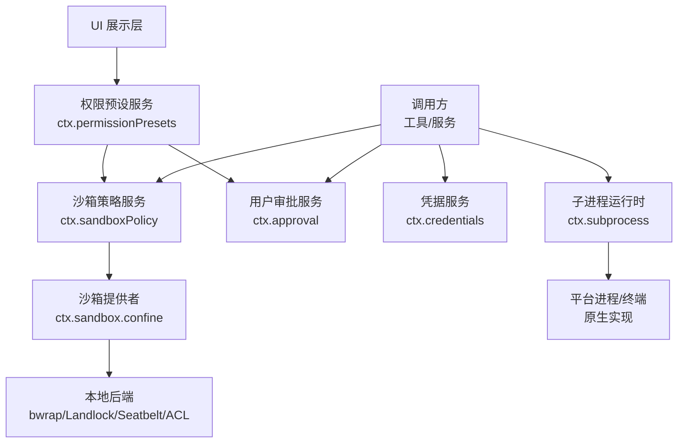
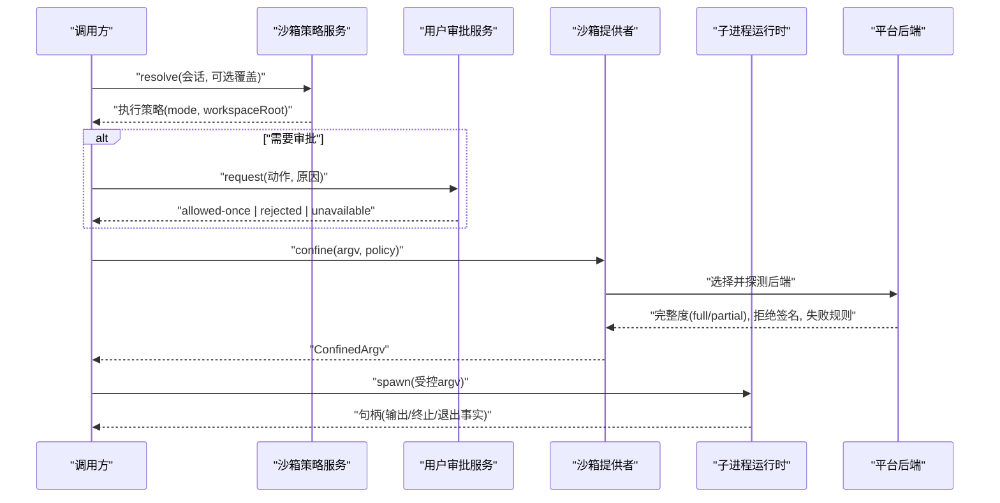
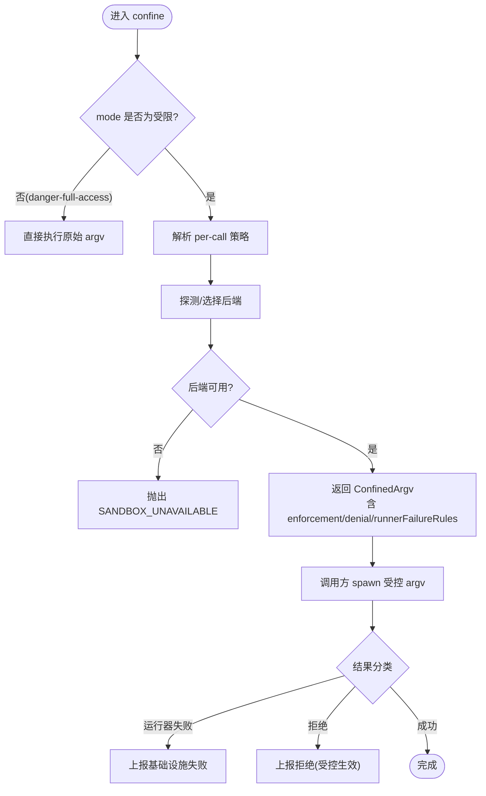
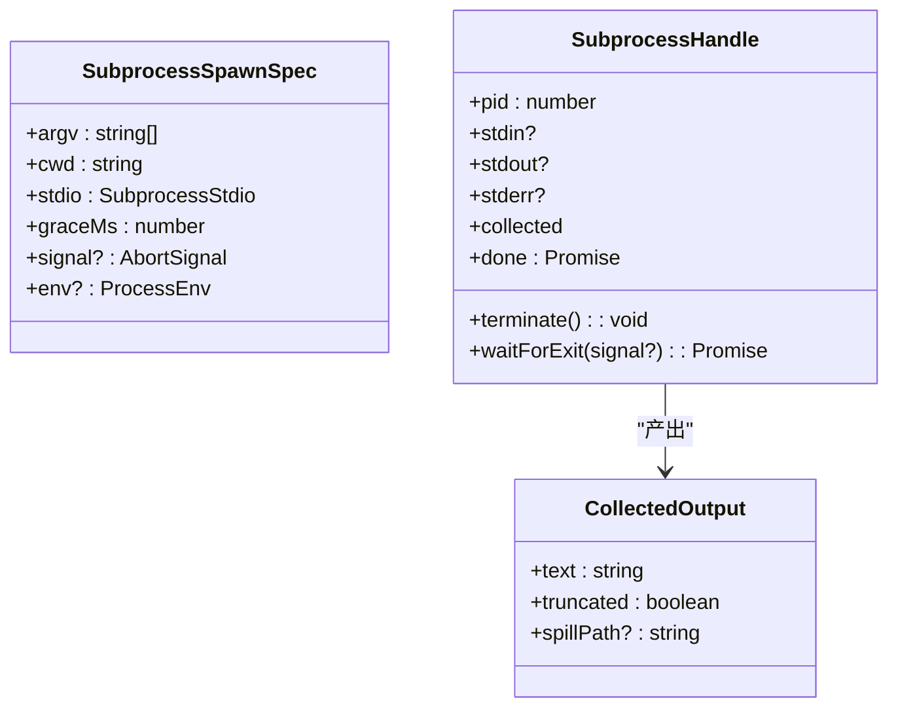
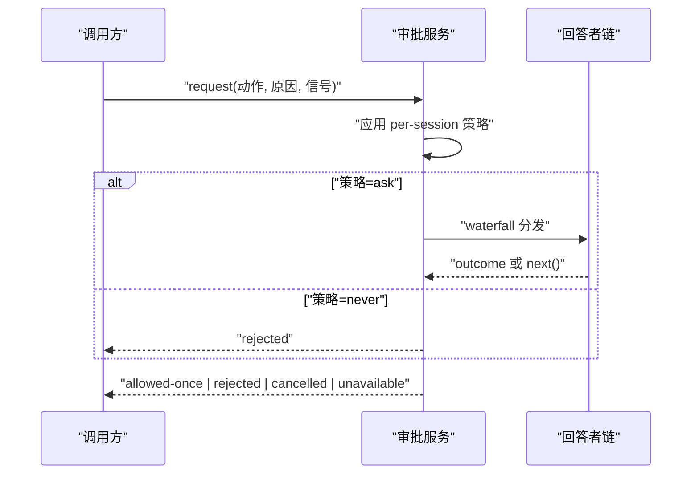
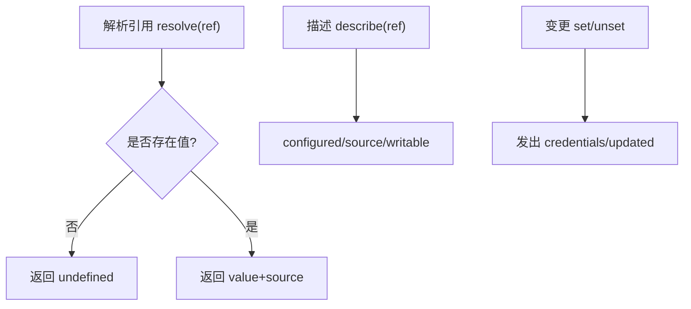
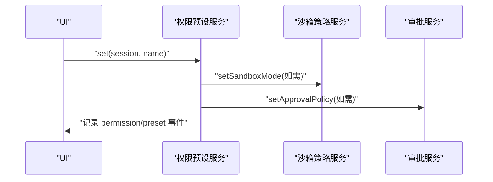
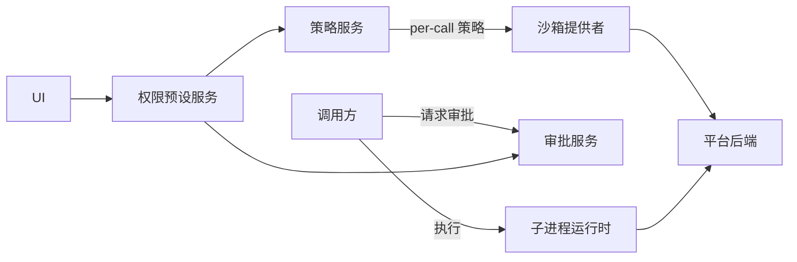

# 安全边界设计

<cite>
**本文引用的文件**
- [docs/subsystems/sandbox.md](file://docs/subsystems/sandbox.md)
- [packages/sandbox/sandbox/README.md](file://packages/sandbox/sandbox/README.md)
- [docs/subsystems/subprocess.md](file://docs/subsystems/subprocess.md)
- [docs/subsystems/approval.md](file://docs/subsystems/approval.md)
- [docs/subsystems/credentials.md](file://docs/subsystems/credentials.md)
- [docs/subsystems/permission-presets.md](file://docs/subsystems/permission-presets.md)
- [packages/client/ui-permission-presets/src/client/presentation.ts](file://packages/client/ui-permission-presets/src/client/presentation.ts)
- [examples/acp-agent/README.md](file://examples/acp-agent/README.md)
- [packages/shell/bash-sandbox/tests/landlock.e2e.ts](file://packages/shell/bash-sandbox/tests/landlock.e2e.ts)
- [native/landlock-run/packages/linux-x64/prebuilds.json](file://native/landlock-run/packages/linux-x64/prebuilds.json)
- [.agents/notes/implemented/architecture/2026-07-12-agent-scope-runtime-design.md](file://.agents/notes/implemented/architecture/2026-07-12-agent-scope-runtime-design.md)
- [packages/session-query/tool-session-query/src/input.ts](file://packages/session-query/tool-session-query/src/input.ts)
- [docs/testing.md](file://docs/testing.md)
</cite>

## 目录
1. [引言](#引言)
2. [项目结构](#项目结构)
3. [核心组件](#核心组件)
4. [架构总览](#架构总览)
5. [详细组件分析](#详细组件分析)
6. [依赖关系分析](#依赖关系分析)
7. [性能与可靠性考量](#性能与可靠性考量)
8. [故障排查指南](#故障排查指南)
9. [结论](#结论)
10. [附录](#附录)

## 引言
本文件围绕系统级安全边界的划分原则与设计模式，阐述进程边界、内存边界与数据边界；定义信任模型与可信计算基（TCB）的最小化策略；说明安全上下文管理、作用域隔离与状态同步机制；描述安全事件的捕获、处理与响应策略；给出威胁分析、风险评估与防护实施指南；并提供安全架构验证方法与测试策略。内容基于仓库中沙箱、子进程、用户审批、凭据、权限预设等子系统的设计与实现文档进行归纳。

## 项目结构
与安全边界相关的关键能力集中在以下子系统：
- 进程沙箱：以“能力接缝”方式提供 per-call 的文件效果限制，封装平台后端差异，统一返回受控 argv 与执行完整性报告。
- 子进程：统一管理可执行查找、环境变量命名空间、stdio 处置、树级终止与输出收集。
- 用户审批：对敏感操作进行一次性授权决策，支持 ask/never 策略与审计事件。
- 凭据：将密钥从配置中解耦，按引用解析并支持热更新。
- 权限预设：将沙箱模式与审批策略打包为可选的“权限选择器”，驱动 UI 与策略写入。
- 运行时信任边界：区分同进程契约与跨进程/序列化/持久化边界，仅在所有权变更时复制。

图表来源
- [docs/subsystems/sandbox.md:1-219](file://docs/subsystems/sandbox.md#L1-L219)
- [docs/subsystems/subprocess.md:1-325](file://docs/subsystems/subprocess.md#L1-L325)
- [docs/subsystems/approval.md:1-171](file://docs/subsystems/approval.md#L1-L171)
- [docs/subsystems/credentials.md:1-134](file://docs/subsystems/credentials.md#L1-L134)
- [docs/subsystems/permission-presets.md:1-132](file://docs/subsystems/permission-presets.md#L1-L132)

章节来源
- [docs/subsystems/sandbox.md:1-219](file://docs/subsystems/sandbox.md#L1-L219)
- [docs/subsystems/subprocess.md:1-325](file://docs/subsystems/subprocess.md#L1-L325)
- [docs/subsystems/approval.md:1-171](file://docs/subsystems/approval.md#L1-L171)
- [docs/subsystems/credentials.md:1-134](file://docs/subsystems/credentials.md#L1-L134)
- [docs/subsystems/permission-presets.md:1-132](file://docs/subsystems/permission-presets.md#L1-L132)

## 核心组件
- 进程沙箱（Sandbox）
  - 职责：将待执行的 argv 包装为在受限模式下运行的命令，返回受控 argv、执行完整性（full/partial）、拒绝签名与运行器失败规则。
  - 模式：read-only、workspace-write、danger-full-access；仅前两种可发送给提供者。
  - 失败关闭：无可用后端时抛出不可用错误，禁止静默放行。
- 子进程（Subprocess）
  - 职责：可执行查找、DSH_* 环境变量命名空间、stdio 处置、收集输出、树级终止、终端原语。
  - 语义：spawn 立即返回句柄；terminate 统一 SIGTERM→grace→SIGKILL；waitForExit 观察整棵树。
- 用户审批（Approval）
  - 职责：对具体动作进行一次性授权，策略 ask/never，审计日志记录，fail-closed 默认。
- 凭据（Credentials）
  - 职责：以引用形式管理密钥，每次操作重新解析，空值视为未配置，变更事件用于界面刷新。
- 权限预设（Permission Presets）
  - 职责：将沙箱模式与审批策略打包为可切换的预设，驱动 UI 与策略写入，保留用户意图事件。

章节来源
- [docs/subsystems/sandbox.md:1-219](file://docs/subsystems/sandbox.md#L1-L219)
- [docs/subsystems/subprocess.md:1-325](file://docs/subsystems/subprocess.md#L1-L325)
- [docs/subsystems/approval.md:1-171](file://docs/subsystems/approval.md#L1-L171)
- [docs/subsystems/credentials.md:1-134](file://docs/subsystems/credentials.md#L1-L134)
- [docs/subsystems/permission-presets.md:1-132](file://docs/subsystems/permission-presets.md#L1-L132)

## 架构总览
下图展示了典型一次受限执行的调用链：调用方先解析策略，必要时请求审批，再调用沙箱包装 argv，最后通过子进程启动受控进程。

图表来源
- [docs/subsystems/sandbox.md:41-156](file://docs/subsystems/sandbox.md#L41-L156)
- [docs/subsystems/approval.md:31-132](file://docs/subsystems/approval.md#L31-L132)
- [docs/subsystems/subprocess.md:89-174](file://docs/subsystems/subprocess.md#L89-L174)

## 详细组件分析

### 进程沙箱：模式、执行完整性与失败分类
- 模式与作用域
  - read-only：仅允许必要写入（如 /dev/null），不授予工作区写权限。
  - workspace-write：允许在工作区根与后端承诺的临时区域写入。
  - danger-full-access：绕过限制，不调用 ctx.sandbox。
- 执行完整性
  - full：后端能完全约束该模式承诺的所有文件效果。
  - partial：因内核 ABI 或平台 ACL 限制，只能约束部分效果；要求绝对边界的调用应拒绝或显式提示。
- 失败分类
  - 运行器失败：exit 非零 + 信息行过滤后匹配致命签名，表示沙箱基础设施失败。
  - 拒绝：由后端产生的特定 stderr 片段识别，表明受控命令被正确阻止。
- 失败关闭
  - 无可用后端时抛出不可用错误，禁止静默放行到不受限路径。

图表来源
- [docs/subsystems/sandbox.md:9-39](file://docs/subsystems/sandbox.md#L9-L39)
- [docs/subsystems/sandbox.md:96-156](file://docs/subsystems/sandbox.md#L96-L156)

章节来源
- [docs/subsystems/sandbox.md:9-39](file://docs/subsystems/sandbox.md#L9-L39)
- [docs/subsystems/sandbox.md:96-156](file://docs/subsystems/sandbox.md#L96-L156)
- [packages/sandbox/sandbox/README.md:1-44](file://packages/sandbox/sandbox/README.md#L1-L44)

### 子进程：环境、IO 与终止
- 环境变量命名空间
  - DSH_* 为 Harness 自有命名空间；实现会先剥离父进程中的 DSH_*，再由调用方显式合并，避免意外泄露。
- IO 处置
  - stdin/stdout/stderr 三种模式：忽略、管道、收集（带溢出回退与 spill 文件）。
- 终止与回收
  - terminate 统一 SIGTERM→grace→SIGKILL；waitForExit 等待整棵进程树退出，便于构建分层清理。
- 终端原语
  - spawnTerminal 负责真实终端分配、UTF-8 文本传输、前台进程组信号与会话级终止。

图表来源
- [docs/subsystems/subprocess.md:13-87](file://docs/subsystems/subprocess.md#L13-L87)
- [docs/subsystems/subprocess.md:89-174](file://docs/subsystems/subprocess.md#L89-L174)
- [docs/subsystems/subprocess.md:221-245](file://docs/subsystems/subprocess.md#L221-L245)

章节来源
- [docs/subsystems/subprocess.md:13-87](file://docs/subsystems/subprocess.md#L13-L87)
- [docs/subsystems/subprocess.md:89-174](file://docs/subsystems/subprocess.md#L89-L174)
- [docs/subsystems/subprocess.md:221-245](file://docs/subsystems/subprocess.md#L221-L245)

### 用户审批：策略、水线与审计
- 策略
  - ask：委派给已组合的回答者链，无回答者则 fail-closed 返回 unavailable。
  - never：直接拒绝，不触发交互。
- 请求与结果
  - 每个请求生成唯一 id，审计成对记录 asked/decided。
  - 结果 allowed-once 仅授权本次动作；其他结果均拒绝。
- 作用域与事件
  - 审计事件 log-only，不入模型转录；策略变更通过运行时上下文快照可见。

图表来源
- [docs/subsystems/approval.md:31-88](file://docs/subsystems/approval.md#L31-L88)
- [docs/subsystems/approval.md:84-132](file://docs/subsystems/approval.md#L84-L132)

章节来源
- [docs/subsystems/approval.md:31-88](file://docs/subsystems/approval.md#L31-L88)
- [docs/subsystems/approval.md:84-132](file://docs/subsystems/approval.md#L84-L132)

### 凭据：引用、热更新与只读视图
- 引用与解析
  - 以 POSIX 风格环境变量名作为引用；每次操作重新解析，支持热更新。
  - 空存储值视为未配置，不会伪装为有效密钥。
- 描述与变更
  - describe 暴露是否可写、当前来源，但不暴露值本身。
  - set/unset 提交到提供方源；变更事件用于界面刷新。

图表来源
- [docs/subsystems/credentials.md:9-50](file://docs/subsystems/credentials.md#L9-L50)
- [docs/subsystems/credentials.md:48-134](file://docs/subsystems/credentials.md#L48-L134)

章节来源
- [docs/subsystems/credentials.md:9-50](file://docs/subsystems/credentials.md#L9-L50)
- [docs/subsystems/credentials.md:48-134](file://docs/subsystems/credentials.md#L48-L134)

### 权限预设：将两个独立控制面打包
- 预设表
  - 将 sandbox/mode 与 approval/policy 绑定为可切换项，默认包含 workspace-write+ask 与 danger-full-access+never。
- 当前预设推导
  - 根据会话的有效模式与策略推导 current()，若无法匹配则返回 derived custom。
- 切换流程
  - set(session, name) 记录 permission/preset 事件，并仅写入发生变化的旋钮。

图表来源
- [docs/subsystems/permission-presets.md:9-68](file://docs/subsystems/permission-presets.md#L9-L68)
- [docs/subsystems/permission-presets.md:64-126](file://docs/subsystems/permission-presets.md#L64-L126)

章节来源
- [docs/subsystems/permission-presets.md:9-68](file://docs/subsystems/permission-presets.md#L9-L68)
- [docs/subsystems/permission-presets.md:64-126](file://docs/subsystems/permission-presets.md#L64-L126)

### 信任模型与 TCB 最小化
- 信任边界原则
  - 同进程内使用只读借用；跨解析器、队列、模型、持久化、文件、worker、进程或网络边界时，必须序列化、校验并拥有解码后的值。
  - 回调隔离：监听器可能任意扩展代码且可抛错，发布与提交路径需按事件契约包含失败。
- TCB 最小化
  - 仅将必要的内核/平台能力（如 Landlock/bwrap/Seatbelt/ACL）暴露给沙箱后端；其余逻辑保持在用户态服务中。
  - 凭据与审批策略不在配置中硬编码，而是通过引用与策略事件动态注入。

章节来源
- [.agents/notes/implemented/architecture/2026-07-12-agent-scope-runtime-design.md:186-201](file://.agents/notes/implemented/architecture/2026-07-12-agent-scope-runtime-design.md#L186-L201)
- [docs/subsystems/sandbox.md:1-219](file://docs/subsystems/sandbox.md#L1-L219)
- [docs/subsystems/credentials.md:1-134](file://docs/subsystems/credentials.md#L1-L134)

### 安全上下文、作用域隔离与状态同步
- 上下文
  - 会话携带不可变 cwd 作为工作区边界；策略 per-call 传递，避免共享可变状态。
- 作用域
  - 审批事件按 agent 作用域分发；沙箱后端按 session/workspace 隔离临时目录与 SID。
- 状态同步
  - 策略变更通过事件与快照传播；权限预设切换先记录意图事件，再写入各旋钮。

章节来源
- [docs/subsystems/sandbox.md:41-94](file://docs/subsystems/sandbox.md#L41-L94)
- [docs/subsystems/approval.md:84-132](file://docs/subsystems/approval.md#L84-L132)
- [docs/subsystems/permission-presets.md:46-68](file://docs/subsystems/permission-presets.md#L46-L68)

### 安全事件：捕获、处理与响应
- 事件类型
  - 审批：approval/asked 与 approval/decided 成对审计。
  - 凭据：credentials/updated 反映存储侧变更。
  - 权限：permission/preset 记录用户意图。
- 处理策略
  - 审计事件 log-only，不入模型转录；UI 通过事件刷新显示。
  - 失败关闭：审批 unavailable、沙箱不可用等场景均拒绝执行。

章节来源
- [docs/subsystems/approval.md:84-132](file://docs/subsystems/approval.md#L84-L132)
- [docs/subsystems/credentials.md:48-134](file://docs/subsystems/credentials.md#L48-L134)
- [docs/subsystems/permission-presets.md:64-68](file://docs/subsystems/permission-presets.md#L64-L68)

## 依赖关系分析
- 耦合与内聚
  - 沙箱策略服务与提供者解耦：策略 per-call 传递，提供者无状态或仅持有后端能力缓存。
  - 子进程与沙箱协作：沙箱返回受控 argv，子进程负责执行与生命周期管理。
  - 审批与预设：预设服务依赖审批服务写入策略；审批服务不感知预设。
- 外部依赖
  - 平台后端：Linux bwrap/Landlock、macOS Seatbelt、Windows ACL restricted-token。
  - 预构建二进制：例如 landlock-run 静态链接 musl 的可执行体。

图表来源
- [docs/subsystems/sandbox.md:1-219](file://docs/subsystems/sandbox.md#L1-L219)
- [docs/subsystems/subprocess.md:1-325](file://docs/subsystems/subprocess.md#L1-L325)
- [docs/subsystems/approval.md:1-171](file://docs/subsystems/approval.md#L1-L171)
- [docs/subsystems/permission-presets.md:1-132](file://docs/subsystems/permission-presets.md#L1-L132)
- [native/landlock-run/packages/linux-x64/prebuilds.json:1-10](file://native/landlock-run/packages/linux-x64/prebuilds.json#L1-L10)

章节来源
- [docs/subsystems/sandbox.md:1-219](file://docs/subsystems/sandbox.md#L1-L219)
- [docs/subsystems/subprocess.md:1-325](file://docs/subsystems/subprocess.md#L1-L325)
- [docs/subsystems/approval.md:1-171](file://docs/subsystems/approval.md#L1-L171)
- [docs/subsystems/permission-presets.md:1-132](file://docs/subsystems/permission-presets.md#L1-L132)
- [native/landlock-run/packages/linux-x64/prebuilds.json:1-10](file://native/landlock-run/packages/linux-x64/prebuilds.json#L1-L10)

## 性能与可靠性考量
- 执行完整性与降级
  - 当后端仅 partial 时，要求绝对边界的调用应拒绝或向用户呈现风险；避免误以为完全受控。
- 资源与超时
  - 子进程 graceMs 控制优雅终止窗口；collect 模式限制内存占用并支持 spill 文件恢复。
- 并发与隔离
  - per-call 策略避免共享可变状态；不同会话可同时以不同策略执行。
- 失败快速失败
  - 沙箱不可用即中止；审批 unavailable 即拒绝；凭据未配置即视为不存在。

[本节为通用指导，无需特定文件引用]

## 故障排查指南
- 沙箱不可用
  - 现象：抛出 SANDBOX_UNAVAILABLE；常见于缺少 bwrap/Landlock/Seatbelt/ACL 运行器。
  - 处理：安装所需运行器或切换到 danger-full-access（仅限受控场景）。
- 运行器失败 vs 拒绝
  - 运行器失败：exit 非零 + 致命签名匹配，表示基础设施问题。
  - 拒绝：stderr 匹配后端 denialSignatures，表示受控生效。
- 审批未决
  - 现象：审批 unavailable 或 cancelled；检查策略是否为 ask，以及是否有可用的回答者。
- 凭据未配置
  - 现象：resolve 返回 undefined；检查引用是否指向有效来源，避免空值。

章节来源
- [docs/subsystems/sandbox.md:152-156](file://docs/subsystems/sandbox.md#L152-L156)
- [docs/subsystems/sandbox.md:96-148](file://docs/subsystems/sandbox.md#L96-L148)
- [docs/subsystems/approval.md:21-47](file://docs/subsystems/approval.md#L21-L47)
- [docs/subsystems/credentials.md:18-50](file://docs/subsystems/credentials.md#L18-L50)

## 结论
本设计通过“能力接缝”将进程、数据与权限控制解耦为可替换的后端与服务，确保：
- 进程边界：通过沙箱与子进程运行时严格限制文件效果与执行环境。
- 内存边界：跨边界数据序列化与校验，避免对象劫持与越界访问。
- 数据边界：凭据引用与审批策略动态注入，避免硬编码与泄露。
- 信任最小化：TCB 仅包含必要内核/平台能力，其余逻辑保持用户态。
- 可观测性：审计事件与策略快照提供可追踪的安全上下文。
- 可验证性：结合单元、快照、端到端与真实 API 测试，保障安全行为稳定。

[本节为总结性内容，无需特定文件引用]

## 附录

### 威胁分析与风险评估（基于现有设计）
- 威胁
  - 逃逸：旧内核 ABI 或平台 ACL 导致 partial 执行完整性。
  - 权限提升：危险模式被滥用或审批被绕过。
  - 信息泄露：环境变量或凭据未正确清洗/解析。
- 评估
  - 影响：文件系统破坏、数据外泄、会话污染。
  - 可能性：取决于平台能力与配置；partial 场景需显式拒绝。
- 防护
  - 强制 fail-closed；partial 时拒绝关键操作；审批 ask/never 策略；凭据每操作解析。

[本节为概念性内容，无需特定文件引用]

### 安全架构验证与测试策略
- 单元测试：覆盖边界条件、错误路径、事件顺序与并发竞态。
- 覆盖率门禁：包源码行级 100% 覆盖（特定平台除外）。
- 真实 API e2e：有密钥场景验证端到端行为。
- 快照测试：键无关的预期输出，锁定协议与呈现。
- 浏览器快照：Web GUI 回放对比。
- 沙箱专项：在 Linux 上通过探针检测 Landlock 可用性，并以 e2e 验证受限执行。

章节来源
- [docs/testing.md:1-50](file://docs/testing.md#L1-L50)
- [packages/shell/bash-sandbox/tests/landlock.e2e.ts:26-54](file://packages/shell/bash-sandbox/tests/landlock.e2e.ts#L26-L54)

### 实践要点与最佳实践
- 始终使用 per-call 策略，避免共享可变状态。
- 对 partial 执行完整性保持警惕，必要时拒绝。
- 审批策略默认 ask，自动化场景使用 never。
- 凭据引用优先，避免在配置中硬编码密钥。
- 使用权限预设统一 UI 与策略写入，减少人为失误。

章节来源
- [docs/subsystems/sandbox.md:41-94](file://docs/subsystems/sandbox.md#L41-L94)
- [docs/subsystems/approval.md:31-47](file://docs/subsystems/approval.md#L31-L47)
- [docs/subsystems/credentials.md:18-50](file://docs/subsystems/credentials.md#L18-L50)
- [docs/subsystems/permission-presets.md:9-68](file://docs/subsystems/permission-presets.md#L9-L68)
- [packages/client/ui-permission-presets/src/client/presentation.ts:1-22](file://packages/client/ui-permission-presets/src/client/presentation.ts#L1-L22)
- [examples/acp-agent/README.md:24-25](file://examples/acp-agent/README.md#L24-L25)