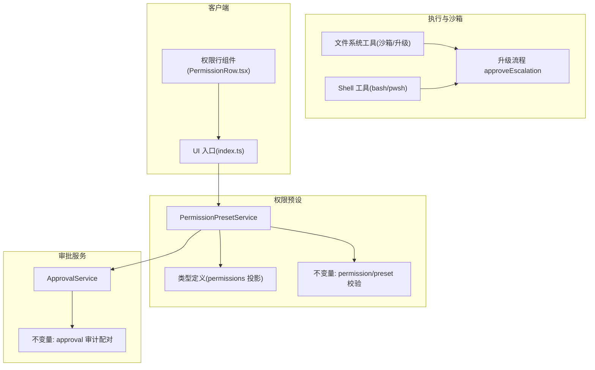
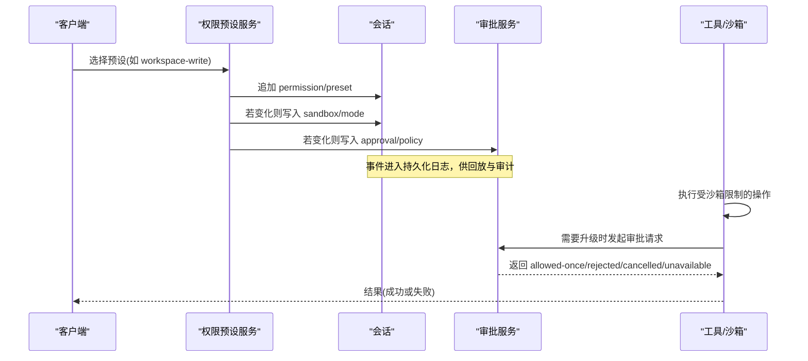
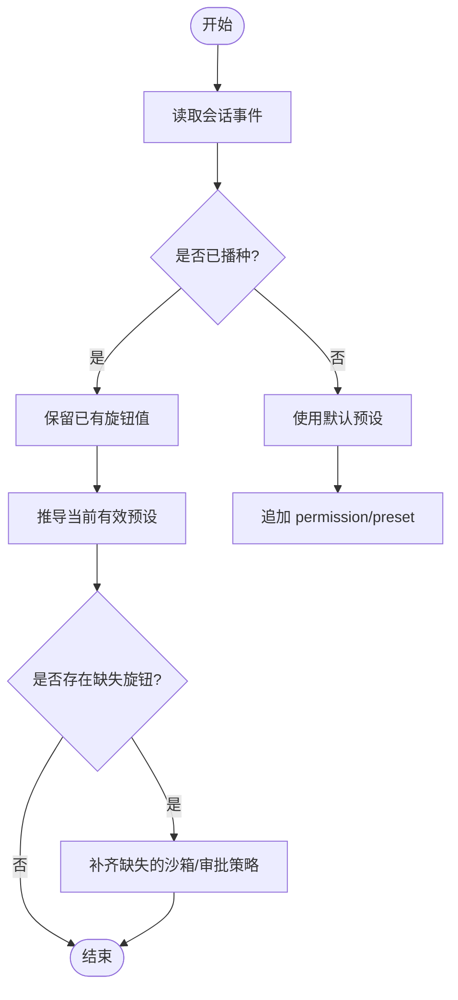
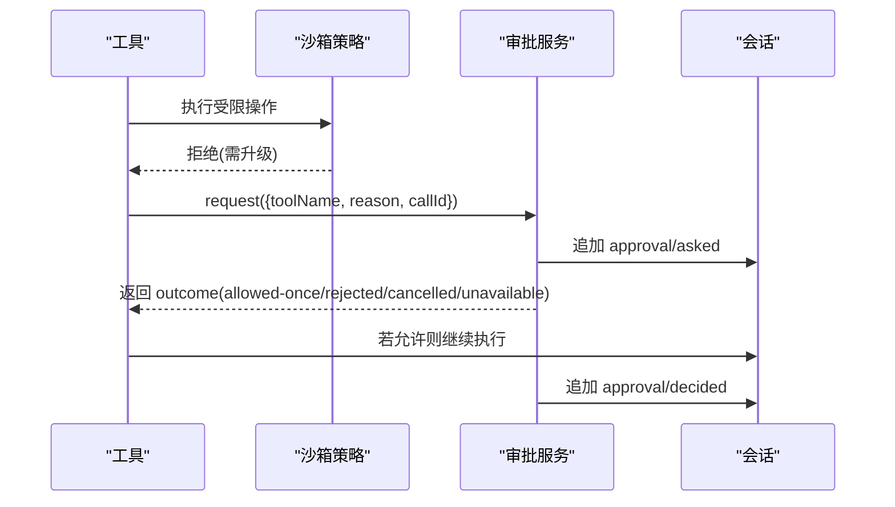
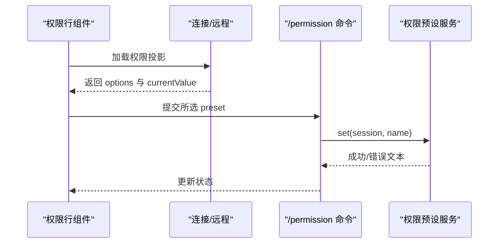
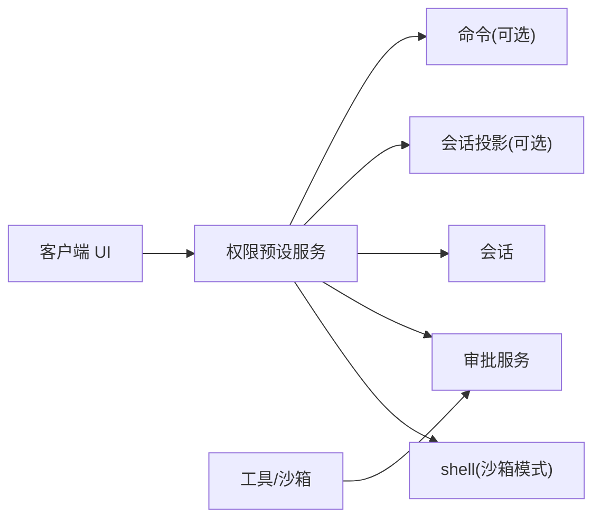

# 权限控制系统

<cite>
**本文引用的文件**
- [packages/interaction/permission-presets/src/index.ts](file://packages/interaction/permission-presets/src/index.ts)
- [packages/interaction/permission-presets/src/types.ts](file://packages/interaction/permission-presets/src/types.ts)
- [packages/interaction/permission-presets/src/invariant.ts](file://packages/interaction/permission-presets/src/invariant.ts)
- [docs/subsystems/permission-presets.md](file://docs/subsystems/permission-presets.md)
- [packages/interaction/user-approval/src/index.ts](file://packages/interaction/user-approval/src/index.ts)
- [packages/interaction/user-approval/src/invariant.ts](file://packages/interaction/user-approval/src/invariant.ts)
- [packages/fs/tool-fs/src/sandbox.ts](file://packages/fs/tool-fs/src/sandbox.ts)
- [packages/shell/tool-bash/tests/tools.spec.ts](file://packages/shell/tool-bash/tests/tools.spec.ts)
- [packages/shell/tool-pwsh/tests/tools.spec.ts](file://packages/shell/tool-pwsh/tests/tools.spec.ts)
- [packages/sandbox/sandbox/tests/escalation.spec.ts](file://packages/sandbox/sandbox/tests/escalation.spec.ts)
- [packages/client/ui-permission-presets/src/client/index.ts](file://packages/client/ui-permission-presets/src/client/index.ts)
- [packages/client/ui-permission-presets/src/client/PermissionRow.tsx](file://packages/client/ui-permission-presets/src/client/PermissionRow.tsx)
- [apps/web/tests/permission-policy-context.e2e.ts](file://apps/web/tests/permission-policy-context.e2e.ts)
</cite>

## 目录
1. [简介](#简介)
2. [项目结构](#项目结构)
3. [核心组件](#核心组件)
4. [架构总览](#架构总览)
5. [详细组件分析](#详细组件分析)
6. [依赖关系分析](#依赖关系分析)
7. [性能考虑](#性能考虑)
8. [故障排查指南](#故障排查指南)
9. [结论](#结论)
10. [附录](#附录)

## 简介
本文件系统围绕“权限预设”与“审批策略”两大独立控制旋钮，提供可组合、可审计、可回放的权限决策体系。其核心目标是：
- 通过预设（如 workspace-write、danger-full-access）将沙箱模式与审批策略打包为易用的用户选项。
- 在会话生命周期内动态评估并切换权限，同时保证所有变更以事件形式持久化，支持回放与审计。
- 将权限控制与工具执行、沙箱执行、审批服务解耦，形成清晰的职责边界与扩展点。
- 提供用户界面集成，使前端能安全地展示和切换权限，并在必要时进行确认与提示。

## 项目结构
权限相关能力分布在多个包中，按职责分层组织：
- 权限预设层：负责预设表管理、当前有效预设推导、设置项注册、会话初始化时补齐缺失的权限事实。
- 审批服务层：负责审批策略应用、交互式问答、审计日志对（asked/decided）、策略切换通知。
- 沙箱与工具层：在执行路径上依据当前沙箱模式限制或拒绝操作，并在需要时发起升级请求。
- 客户端 UI 层：订阅会话投影，渲染权限选择器，调用命令完成切换。
- 不变量与测试：确保事件契约、词汇表与配对关系的正确性。

**图表来源**
- [packages/interaction/permission-presets/src/index.ts:159-278](file://packages/interaction/permission-presets/src/index.ts#L159-L278)
- [packages/interaction/permission-presets/src/types.ts:12-44](file://packages/interaction/permission-presets/src/types.ts#L12-L44)
- [packages/interaction/permission-presets/src/invariant.ts:14-31](file://packages/interaction/permission-presets/src/invariant.ts#L14-L31)
- [packages/interaction/user-approval/src/index.ts:192-348](file://packages/interaction/user-approval/src/index.ts#L192-L348)
- [packages/interaction/user-approval/src/invariant.ts:58-75](file://packages/interaction/user-approval/src/invariant.ts#L58-L75)
- [packages/fs/tool-fs/src/sandbox.ts:52-108](file://packages/fs/tool-fs/src/sandbox.ts#L52-L108)
- [packages/shell/tool-bash/tests/tools.spec.ts:608-630](file://packages/shell/tool-bash/tests/tools.spec.ts#L608-L630)
- [packages/shell/tool-pwsh/tests/tools.spec.ts:575-601](file://packages/shell/tool-pwsh/tests/tools.spec.ts#L575-L601)
- [packages/client/ui-permission-presets/src/client/index.ts:45-53](file://packages/client/ui-permission-presets/src/client/index.ts#L45-L53)
- [packages/client/ui-permission-presets/src/client/PermissionRow.tsx:36-63](file://packages/client/ui-permission-presets/src/client/PermissionRow.tsx#L36-L63)

**章节来源**
- [docs/subsystems/permission-presets.md:1-132](file://docs/subsystems/permission-presets.md#L1-L132)

## 核心组件
- PermissionPresetService：维护预设表、默认预设、会话初始权限补齐、当前有效预设推导、设置项注册、权限投影与命令注册。
- ApprovalService：实现审批策略（ask/never）、交互式审批、审计日志对、策略切换对用户可见的通知。
- 沙箱与工具执行：基于当前沙箱模式限制文件/命令执行；当模型重试请求更宽权限时，触发升级流程并经审批服务决定。
- 客户端 UI：读取会话投影中的权限选择，渲染下拉框，提交 /permission 命令完成切换。

**章节来源**
- [packages/interaction/permission-presets/src/index.ts:159-278](file://packages/interaction/permission-presets/src/index.ts#L159-L278)
- [packages/interaction/user-approval/src/index.ts:192-348](file://packages/interaction/user-approval/src/index.ts#L192-L348)
- [packages/fs/tool-fs/src/sandbox.ts:52-108](file://packages/fs/tool-fs/src/sandbox.ts#L52-L108)
- [packages/client/ui-permission-presets/src/client/index.ts:45-53](file://packages/client/ui-permission-presets/src/client/index.ts#L45-L53)

## 架构总览
权限系统由“预设层 + 审批层 + 执行层 + 客户端层”构成，通过会话事件流串联，确保可回放、可审计、可扩展。

**图表来源**
- [packages/interaction/permission-presets/src/index.ts:375-430](file://packages/interaction/permission-presets/src/index.ts#L375-L430)
- [packages/interaction/user-approval/src/index.ts:257-348](file://packages/interaction/user-approval/src/index.ts#L257-L348)
- [packages/fs/tool-fs/src/sandbox.ts:95-108](file://packages/fs/tool-fs/src/sandbox.ts#L95-L108)

## 详细组件分析

### 权限预设系统设计与实现
- 预设表：包含 workspace-write（沙箱模式 workspace-write，审批 ask）与 danger-full-access（沙箱模式 danger-full-access，审批 never），以及可选的名称与描述用于客户端展示。
- 当前有效预设推导：从会话事件折叠出最近一次选择的预设、沙箱模式与审批策略；若无匹配则返回派生状态 custom，仅用于显示，不可作为切换目标。
- 会话初始化：为新会话补齐缺失的权限事实，优先使用用户默认预设；对已存在部分事件的会话，保留已有值并补齐缺失项。
- 设置项与投影：注册设置项保存默认预设；注册 permissions 投影，将三个旋钮事件折叠为 select 视图，供客户端消费。

**图表来源**
- [packages/interaction/permission-presets/src/index.ts:394-430](file://packages/interaction/permission-presets/src/index.ts#L394-L430)

**章节来源**
- [packages/interaction/permission-presets/src/index.ts:159-278](file://packages/interaction/permission-presets/src/index.ts#L159-L278)
- [packages/interaction/permission-presets/src/index.ts:375-430](file://packages/interaction/permission-presets/src/index.ts#L375-L430)
- [docs/subsystems/permission-presets.md:9-68](file://docs/subsystems/permission-presets.md#L9-L68)

### 审批策略与动态权限检查
- 审批策略：ask（委托给答案者链，无答案者则 fail-closed）与 never（自动拒绝）。策略切换会向模型注入通知，使其感知当前策略。
- 动态检查：工具在执行前根据当前沙箱模式判断是否需要升级；如需升级，则调用审批服务发起请求，附带理由与上下文。
- 审计对：每次审批都会记录 asked/decided 事件对，确保可回放与合规审计。

**图表来源**
- [packages/fs/tool-fs/src/sandbox.ts:52-108](file://packages/fs/tool-fs/src/sandbox.ts#L52-L108)
- [packages/interaction/user-approval/src/index.ts:257-348](file://packages/interaction/user-approval/src/index.ts#L257-L348)

**章节来源**
- [packages/interaction/user-approval/src/index.ts:192-348](file://packages/interaction/user-approval/src/index.ts#L192-L348)
- [packages/fs/tool-fs/src/sandbox.ts:52-108](file://packages/fs/tool-fs/src/sandbox.ts#L52-L108)

### 权限继承机制
- 会话级覆盖：每个会话可通过 approval/policy 事件覆盖默认策略；子会话在委派时可标记 source 为 delegation，便于追踪来源。
- 预设绑定：预设切换会同时写入 sandbox/mode 与 approval/policy，从而在后续执行中继承新的权限上下文。
- 推导优先：current() 优先保留用户最后选择的预设（当仍匹配），否则按声明顺序匹配第一个条目，否则返回 custom。

**章节来源**
- [packages/interaction/permission-presets/src/index.ts:304-321](file://packages/interaction/permission-presets/src/index.ts#L304-L321)
- [packages/interaction/user-approval/src/index.ts:104-147](file://packages/interaction/user-approval/src/index.ts#L104-L147)

### 用户界面与权限控制的集成
- 投影消费：客户端通过 sessionProjections 的 permissions 键获取当前可用选项与当前值。
- 交互流程：用户在 UI 中选择预设后，调用 /permission 命令完成切换；命令处理器解析输入并调用权限预设服务 set()。
- 行为约束：当当前环境不可用时（如无权限服务），UI 隐藏该控件；选择危险权限时需进行确认与提示。

**图表来源**
- [packages/client/ui-permission-presets/src/client/index.ts:45-53](file://packages/client/ui-permission-presets/src/client/index.ts#L45-L53)
- [packages/client/ui-permission-presets/src/client/PermissionRow.tsx:36-63](file://packages/client/ui-permission-presets/src/client/PermissionRow.tsx#L36-L63)
- [packages/interaction/permission-presets/src/index.ts:254-278](file://packages/interaction/permission-presets/src/index.ts#L254-L278)

**章节来源**
- [packages/client/ui-permission-presets/src/client/index.ts:45-53](file://packages/client/ui-permission-presets/src/client/index.ts#L45-L53)
- [packages/client/ui-permission-presets/src/client/PermissionRow.tsx:36-63](file://packages/client/ui-permission-presets/src/client/PermissionRow.tsx#L36-L63)
- [apps/web/tests/permission-policy-context.e2e.ts:91-140](file://apps/web/tests/permission-policy-context.e2e.ts#L91-L140)

### 权限决策的生命周期管理
- 会话创建：权限预设服务监听 session/created，补齐缺失权限事实。
- 运行期切换：set() 先记录用户意图（permission/preset），再按需写入沙箱与审批策略事件。
- 审批生命周期：request() 要求处于 open turn 内，记录 asked 事件，分发到答案者链，记录 decided 事件，确保审计对完整。

**章节来源**
- [packages/interaction/permission-presets/src/index.ts:220-278](file://packages/interaction/permission-presets/src/index.ts#L220-L278)
- [packages/interaction/user-approval/src/index.ts:257-348](file://packages/interaction/user-approval/src/index.ts#L257-L348)

### 权限审计、日志记录与违规检测
- 审计日志：审批服务记录 approval/asked 与 approval/decided 事件对；权限预设记录 permission/preset 事件；沙箱模式与审批策略分别记录 sandbox/mode 与 approval/policy。
- 不变量校验：
  - 权限预设不变量：校验 permission/preset 的 preset 值必须存在于预设表中。
  - 审批不变量：校验 asked/decided 配对、turn 边界、策略词汇表闭合。
- 违规检测：当出现未知预设、未配对审批事件、非法策略值等，不变量会报告失败，阻止非法状态进入系统。

**章节来源**
- [packages/interaction/permission-presets/src/invariant.ts:14-31](file://packages/interaction/permission-presets/src/invariant.ts#L14-L31)
- [packages/interaction/user-approval/src/invariant.ts:58-75](file://packages/interaction/user-approval/src/invariant.ts#L58-L75)
- [packages/interaction/user-approval/tests/invariant.spec.ts:88-106](file://packages/interaction/user-approval/tests/invariant.spec.ts#L88-L106)

## 依赖关系分析
- 预设服务依赖：
  - ctx.shell：读取沙箱模式能力事实，确保预设可绑定沙箱模式。
  - ctx.approval：写入审批策略，驱动审批服务。
  - ctx.sessions：监听会话创建与列表，补齐初始权限。
  - 可选：sessionProjections、commands，用于投影与命令注册。
- 审批服务依赖：
  - 会话事件：turn/start、turn/end 用于判定 open turn。
  - 系统提示：注入策略说明，使模型感知当前审批策略。
- 工具与沙箱：
  - 文件系统工具与 shell 工具在执行前检查沙箱模式，必要时发起升级请求。
- 客户端：
  - 通过会话投影读取权限选择，调用命令完成切换。

**图表来源**
- [packages/interaction/permission-presets/src/index.ts:180-278](file://packages/interaction/permission-presets/src/index.ts#L180-L278)
- [packages/interaction/user-approval/src/index.ts:192-237](file://packages/interaction/user-approval/src/index.ts#L192-L237)
- [packages/fs/tool-fs/src/sandbox.ts:52-108](file://packages/fs/tool-fs/src/sandbox.ts#L52-L108)
- [packages/client/ui-permission-presets/src/client/index.ts:45-53](file://packages/client/ui-permission-presets/src/client/index.ts#L45-L53)

**章节来源**
- [packages/interaction/permission-presets/src/index.ts:180-278](file://packages/interaction/permission-presets/src/index.ts#L180-L278)
- [packages/interaction/user-approval/src/index.ts:192-237](file://packages/interaction/user-approval/src/index.ts#L192-L237)

## 性能考虑
- 事件折叠：权限投影采用 O(n) 遍历事件进行折叠，但仅在事件变更时触发视图计算，整体开销可控。
- 最小化写入：set() 仅在值变化时写入对应旋钮事件，避免冗余日志。
- 审批链路：审批请求在 open turn 内进行，确保审计对完整；答案者链异常被归一化为 unavailable，避免额外重试成本。
- 客户端渲染：UI 仅在投影变化时刷新，减少不必要的重绘。

[本节为通用指导，不直接分析具体文件]

## 故障排查指南
- 未知预设：当尝试切换到不在预设表中的名称时，resolve() 会抛出错误；请检查预设配置与传入名称。
- 未配对审批事件：不变量会检测 approval/asked 与 approval/decided 的配对关系；若缺失或重复，将报告失败。
- 非严格升级：当工具请求的升级并非严格更宽权限时，会被拒绝且不触发审批；请检查当前模式与请求模式。
- 无审批通道：在未挂载审批服务或未路由到代理时，升级请求会失败；请确保审批服务已正确组成。
- 非封闭后端：在非封禁环境下，升级字段不可用；请检查组合配置是否启用了沙箱能力。

**章节来源**
- [packages/interaction/permission-presets/src/index.ts:346-352](file://packages/interaction/permission-presets/src/index.ts#L346-L352)
- [packages/interaction/user-approval/src/invariant.ts:58-75](file://packages/interaction/user-approval/src/invariant.ts#L58-L75)
- [packages/shell/tool-bash/tests/tools.spec.ts:608-630](file://packages/shell/tool-bash/tests/tools.spec.ts#L608-L630)
- [packages/shell/tool-pwsh/tests/tools.spec.ts:575-601](file://packages/shell/tool-pwsh/tests/tools.spec.ts#L575-L601)
- [packages/sandbox/sandbox/tests/escalation.spec.ts:57-82](file://packages/sandbox/sandbox/tests/escalation.spec.ts#L57-L82)

## 结论
权限控制系统通过预设与审批策略的组合，提供了灵活且安全的权限管理能力。其设计强调：
- 可组合：预设将沙箱与审批打包，简化用户操作。
- 可审计：所有关键决策以事件形式持久化，支持回放与合规审查。
- 可扩展：通过答案者链与投影机制，便于接入不同 UI 与策略。
- 可验证：不变量确保事件契约与词汇表的正确性，降低运行时风险。

[本节为总结，不直接分析具体文件]

## 附录
- 最佳实践
  - 为新会话配置明确的默认预设，避免 derive 无法匹配导致 custom 状态。
  - 在生产环境中谨慎启用 danger-full-access，并确保有完善的审计与监控。
  - 使用审批策略 ask 以获得交互式保护；在 CI 或无人值守场景使用 never 以自动化拒绝。
- 常见场景解决方案
  - 只读工作区：选择 read-only 或等效策略，禁止写操作。
  - 工作区内写入：选择 workspace-write，允许在工作区与临时目录写入，超出范围需审批。
  - 全量访问：选择 danger-full-access，关闭审批提示，适用于可信环境与调试用途。

[本节为通用指导，不直接分析具体文件]