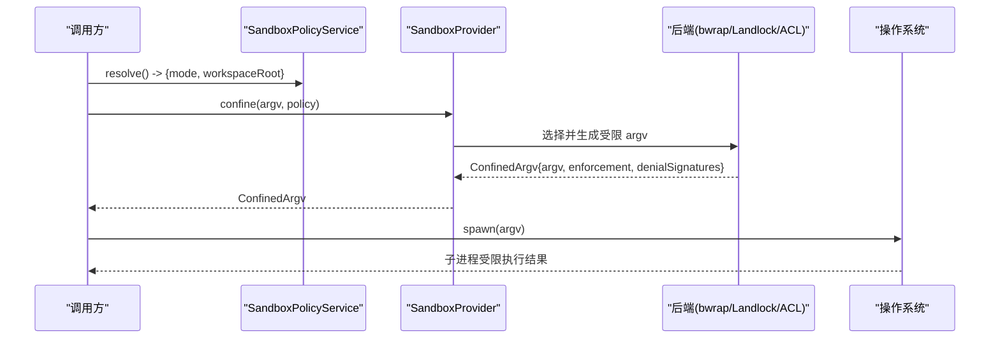
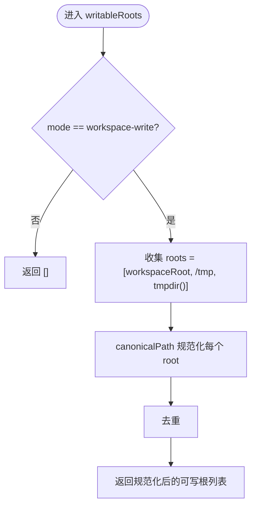
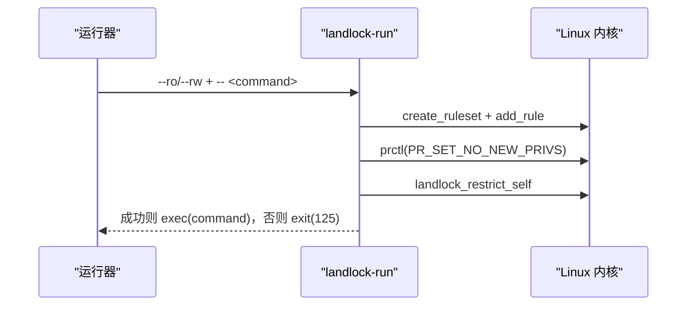
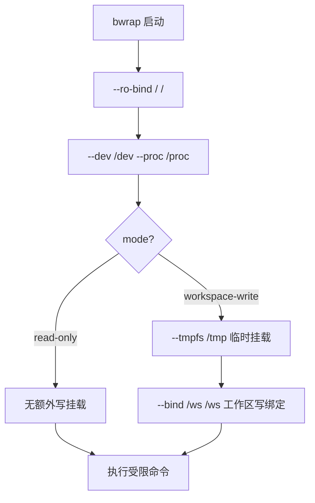
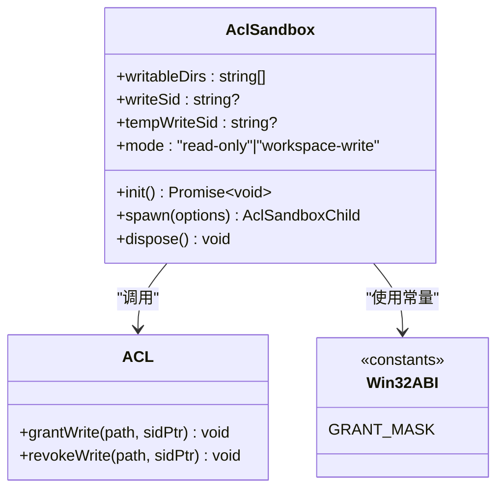
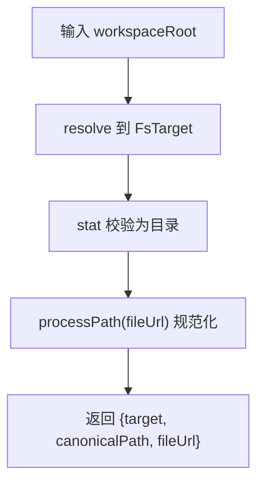
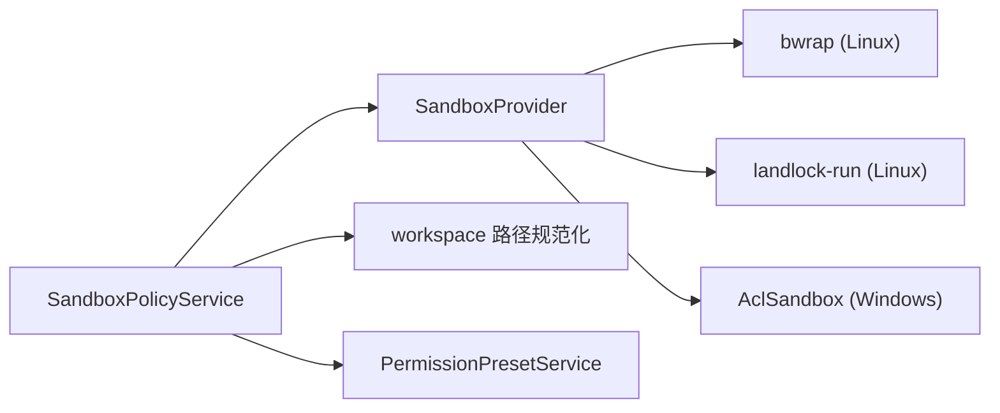

# 文件系统保护

<cite>
**本文引用的文件**
- [packages/sandbox/sandbox/src/index.ts](file://packages/sandbox/sandbox/src/index.ts)
- [packages/sandbox/sandbox/src/roots.ts](file://packages/sandbox/sandbox/src/roots.ts)
- [packages/sandbox/sandbox-policy/src/index.ts](file://packages/sandbox/sandbox-policy/src/index.ts)
- [packages/sandbox/sandbox-local/tests/bwrap.e2e.ts](file://packages/sandbox/sandbox-local/tests/bwrap.e2e.ts)
- [packages/sandbox/sandbox-local/tests/local.spec.ts](file://packages/sandbox/sandbox-local/tests/local.spec.ts)
- [native/landlock-run/packages/entry/src/main.c](file://native/landlock-run/packages/entry/src/main.c)
- [packages/sandbox/sandbox-windows-acl/src/index.ts](file://packages/sandbox/sandbox-windows-acl/src/index.ts)
- [packages/sandbox/sandbox-windows-acl/src/acl.ts](file://packages/sandbox/sandbox-windows-acl/src/acl.ts)
- [packages/sandbox/sandbox-windows-acl/src/win32-abi.ts](file://packages/sandbox/sandbox-windows-acl/src/win32-abi.ts)
- [packages/fs/fs-local/src/win32.ts](file://packages/fs/fs-local/src/win32.ts)
- [packages/workspace/workspace/src/paths.ts](file://packages/workspace/workspace/src/paths.ts)
- [packages/lsp/lsp-stdio/src/host.ts](file://packages/lsp/lsp-stdio/src/host.ts)
- [packages/interaction/permission-presets/src/index.ts](file://packages/interaction/permission-presets/src/index.ts)
- [packages/shell/bash-sandbox/tests/landlock.e2e.ts](file://packages/shell/bash-sandbox/tests/landlock.e2e.ts)
- [packages/sandbox/sandbox/tests/roots.spec.ts](file://packages/sandbox/sandbox/tests/roots.spec.ts)
</cite>

## 目录
1. [简介](#简介)
2. [项目结构](#项目结构)
3. [核心组件](#核心组件)
4. [架构总览](#架构总览)
5. [详细组件分析](#详细组件分析)
6. [依赖关系分析](#依赖关系分析)
7. [性能考量](#性能考量)
8. [故障排除指南](#故障排除指南)
9. [结论](#结论)
10. [附录：配置示例与最佳实践](#附录：配置示例与最佳实践)

## 简介
本文件面向“文件系统保护”能力，系统性说明 DeepSeek Harness 在 Linux、macOS、Windows 上的多后端沙箱策略如何统一对外暴露三种模式：只读模式、工作区写入模式、完全访问模式。文档覆盖以下要点：
- 访问控制策略的抽象与实现（SandboxMode、SandboxPolicy、ConfinedArgv）
- Landlock 内核模块的文件系统权限控制流程与 ABI 协商
- bwrap 绑定挂载技术的工作方式与临时目录语义差异
- Windows ACL 基于受限令牌与 DACL 的写权限管理
- 工作区根目录识别与规范化路径处理
- 文件操作审计、权限验证与异常处理
- 完整配置示例与故障排除指引

## 项目结构
围绕文件系统保护的关键代码分布在如下位置：
- 沙箱抽象与策略服务：sandbox、sandbox-policy
- 平台后端：Linux Landlock 原生入口、bwrap 测试与行为约定、Windows ACL 实现
- 路径与工作区规范：workspace paths、LSP host 规范化
- 权限预设与命令：permission presets
- 工具层集成：shell 执行器对沙箱的使用

```mermaid
graph TB
A["调用方(工具/Shell)"] --> B["SandboxProvider<br/>confine(argv, policy)"]
B --> C{"后端选择"}
C --> |Linux(bwrap)| D["bwrap 绑定挂载<br/>--ro-bind / --tmpfs /tmp --bind /ws"]
C --> |Linux(Landlock)| E["landlock-run<br/>--ro/--rw + exec"]
C --> |Windows| F["AclSandbox<br/>受限令牌+DACL授权"]
B --> G["返回 ConfinedArgv<br/>enforcement/denialSignatures"]
G --> H["子进程以受限 argv 启动"]
```

图表来源
- [packages/sandbox/sandbox/src/index.ts:158-176](file://packages/sandbox/sandbox/src/index.ts#L158-L176)
- [packages/sandbox/sandbox-local/tests/bwrap.e2e.ts:53-108](file://packages/sandbox/sandbox-local/tests/bwrap.e2e.ts#L53-L108)
- [native/landlock-run/packages/entry/src/main.c:1-36](file://native/landlock-run/packages/entry/src/main.c#L1-L36)
- [packages/sandbox/sandbox-windows-acl/src/index.ts:1-41](file://packages/sandbox/sandbox-windows-acl/src/index.ts#L1-L41)

章节来源
- [packages/sandbox/sandbox/src/index.ts:1-179](file://packages/sandbox/sandbox/src/index.ts#L1-L179)
- [packages/sandbox/sandbox-policy/src/index.ts:85-110](file://packages/sandbox/sandbox-policy/src/index.ts#L85-L110)

## 核心组件
- 沙箱模式与策略
  - SandboxMode：'read-only' | 'workspace-write' | 'danger-full-access'
  - SandboxPolicy：包含 mode、workspaceRoot、sessionId 等
  - ConfinedArgv：封装受限 argv、enforcement 完整性、denialSignatures、runnerFailureRules
- 可写根推导
  - writableRoots：将模式映射为“可写根”的规范化列表（仅 workspace-write 生效）
- 工作区根规范化
  - realpathNormalize：通过 fs.realpath 解析符号链接、尾斜杠、.. 段
  - canonicalizeWorkspace：校验并标准化工作区路径
- 权限预设
  - PermissionPresetService：提供默认预设与切换命令，绑定 sandbox 模式与审批策略

章节来源
- [packages/sandbox/sandbox/src/index.ts:23-72](file://packages/sandbox/sandbox/src/index.ts#L23-L72)
- [packages/sandbox/sandbox/src/roots.ts:1-56](file://packages/sandbox/sandbox/src/roots.ts#L1-L56)
- [packages/workspace/workspace/src/paths.ts:1-22](file://packages/workspace/workspace/src/paths.ts#L1-L22)
- [packages/lsp/lsp-stdio/src/host.ts:25-59](file://packages/lsp/lsp-stdio/src/host.ts#L25-L59)
- [packages/interaction/permission-presets/src/index.ts:154-178](file://packages/interaction/permission-presets/src/index.ts#L154-L178)

## 架构总览
下图展示了从调用方到具体后端的执行序列，以及不同平台的差异化行为。



图表来源
- [packages/sandbox/sandbox/src/index.ts:158-176](file://packages/sandbox/sandbox/src/index.ts#L158-L176)
- [packages/sandbox/sandbox-policy/src/index.ts:85-110](file://packages/sandbox/sandbox-policy/src/index.ts#L85-L110)

## 详细组件分析

### 模式与可写根推导
- read-only：不授予任何可写根
- workspace-write：授予工作区根 + 平台临时目录（/tmp 与 os.tmpdir()），并进行去重与规范化
- danger-full-access：绕过限制（由上层策略决定是否允许）



图表来源
- [packages/sandbox/sandbox/src/roots.ts:43-55](file://packages/sandbox/sandbox/src/roots.ts#L43-L55)

章节来源
- [packages/sandbox/sandbox/src/roots.ts:1-56](file://packages/sandbox/sandbox/src/roots.ts#L1-L56)
- [packages/sandbox/sandbox/tests/roots.spec.ts:1-39](file://packages/sandbox/sandbox/tests/roots.spec.ts#L1-L39)

### Linux：Landlock 内核模块
- landlock-run 作为自限制后执行的入口程序，负责：
  - 解析 CLI：--probe、--ro、--rw、-- <argv...>
  - 创建规则集并与内核 ABI 协商（MAX_ABI 向下兼容）
  - 设置 no_new_privs 并 restrict_self，随后 exec 被包装的命令
  - 失败时退出码 125，避免无约束执行
- 错误诊断：stderr 输出结构化信息，便于上层区分“运行器失败”和“拒绝访问”



图表来源
- [native/landlock-run/packages/entry/src/main.c:1-36](file://native/landlock-run/packages/entry/src/main.c#L1-L36)
- [native/landlock-run/packages/entry/src/main.c:220-267](file://native/landlock-run/packages/entry/src/main.c#L220-L267)

章节来源
- [native/landlock-run/packages/entry/src/main.c:1-200](file://native/landlock-run/packages/entry/src/main.c#L1-L200)
- [packages/shell/bash-sandbox/tests/landlock.e2e.ts:26-54](file://packages/shell/bash-sandbox/tests/landlock.e2e.ts#L26-L54)

### Linux：bwrap 绑定挂载
- bwrap 通过只读绑定整个根文件系统，并将工作区根以读写方式绑定，同时挂载一个临时的 /tmp（进程生命周期内有效）
- 行为验证：
  - read-only 下禁止写操作，且保留可读/可执行
  - workspace-write 下允许在工作区内写，并在临时 /tmp 中写，但宿主 /tmp 不受影响
  - 拒绝签名与 enforcement 完整性由后端提供



图表来源
- [packages/sandbox/sandbox-local/tests/local.spec.ts:64-80](file://packages/sandbox/sandbox-local/tests/local.spec.ts#L64-L80)
- [packages/sandbox/sandbox-local/tests/bwrap.e2e.ts:53-108](file://packages/sandbox/sandbox-local/tests/bwrap.e2e.ts#L53-L108)

章节来源
- [packages/sandbox/sandbox-local/tests/bwrap.e2e.ts:53-108](file://packages/sandbox/sandbox-local/tests/bwrap.e2e.ts#L53-L108)
- [packages/sandbox/sandbox-local/tests/local.spec.ts:53-80](file://packages/sandbox/sandbox-local/tests/local.spec.ts#L53-L80)

### Windows：ACL 受限令牌与 DACL
- 使用 WRITE_RESTRICTED 令牌，结合工作区 SID 与临时目录 SID 的交集检查，精确限制写访问
- 工作区 SID 基于工作区路径确定性生成，跨会话复用；临时目录 SID 每实例独立，防止跨会话泄漏
- 通过 DACL 授权（GRANT_MASK：Write+Delete，不含 WRITE_DAC/WRITE_OWNER），确保子进程无法逃逸
- 原子替换文件时读取目标 DACL 并恢复，失败时抛出明确错误



图表来源
- [packages/sandbox/sandbox-windows-acl/src/index.ts:160-214](file://packages/sandbox/sandbox-windows-acl/src/index.ts#L160-L214)
- [packages/sandbox/sandbox-windows-acl/src/acl.ts:136-244](file://packages/sandbox/sandbox-windows-acl/src/acl.ts#L136-L244)
- [packages/sandbox/sandbox-windows-acl/src/win32-abi.ts:45-71](file://packages/sandbox/sandbox-windows-acl/src/win32-abi.ts#L45-L71)

章节来源
- [packages/sandbox/sandbox-windows-acl/src/index.ts:1-435](file://packages/sandbox/sandbox-windows-acl/src/index.ts#L1-L435)
- [packages/sandbox/sandbox-windows-acl/src/acl.ts:136-244](file://packages/sandbox/sandbox-windows-acl/src/acl.ts#L136-L244)
- [packages/sandbox/sandbox-windows-acl/src/win32-abi.ts:45-71](file://packages/sandbox/sandbox-windows-acl/src/win32-abi.ts#L45-L71)
- [packages/fs/fs-local/src/win32.ts:72-100](file://packages/fs/fs-local/src/win32.ts#L72-L100)

### 工作区根识别与规范化
- realpathNormalize：通过 fs.realpath 解析符号链接、尾斜杠、.. 段，保证唯一性
- canonicalizeWorkspace：解析并校验工作区为目录，返回稳定标识与 URI
- 在沙箱策略中，workspaceRoot 始终为绝对路径，供各后端一致使用



图表来源
- [packages/workspace/workspace/src/paths.ts:1-22](file://packages/workspace/workspace/src/paths.ts#L1-L22)
- [packages/lsp/lsp-stdio/src/host.ts:25-59](file://packages/lsp/lsp-stdio/src/host.ts#L25-L59)

章节来源
- [packages/workspace/workspace/src/paths.ts:1-22](file://packages/workspace/workspace/src/paths.ts#L1-L22)
- [packages/lsp/lsp-stdio/src/host.ts:25-59](file://packages/lsp/lsp-stdio/src/host.ts#L25-L59)

### 权限预设与命令
- 提供预设：workspace-write（需要审批）、danger-full-access（无需审批）
- 支持通过命令切换当前会话的权限预设，并联动审批策略

章节来源
- [packages/interaction/permission-presets/src/index.ts:154-178](file://packages/interaction/permission-presets/src/index.ts#L154-L178)

## 依赖关系分析
- 沙箱抽象层（sandbox）定义模式、策略与受限 argv 契约
- 策略服务（sandbox-policy）维护部署默认模式与工作区根
- 平台后端：
  - Linux：bwrap（绑定挂载）与 Landlock（内核规则集）
  - Windows：ACL（受限令牌 + DACL）
- 路径与规范化：workspace 与 LSP host 提供一致性路径处理
- 权限预设：将模式与审批策略绑定，提供用户界面与命令



图表来源
- [packages/sandbox/sandbox-policy/src/index.ts:85-110](file://packages/sandbox/sandbox-policy/src/index.ts#L85-L110)
- [packages/sandbox/sandbox/src/index.ts:158-176](file://packages/sandbox/sandbox/src/index.ts#L158-L176)
- [packages/sandbox/sandbox-windows-acl/src/index.ts:160-214](file://packages/sandbox/sandbox-windows-acl/src/index.ts#L160-L214)

章节来源
- [packages/sandbox/sandbox-policy/src/index.ts:85-110](file://packages/sandbox/sandbox-policy/src/index.ts#L85-L110)
- [packages/sandbox/sandbox/src/index.ts:158-176](file://packages/sandbox/sandbox/src/index.ts#L158-L176)

## 性能考量
- Landlock：规则集创建与 ABI 协商开销较小；restrict_self 后继承至所有子进程，适合频繁小任务
- bwrap：每次执行需构建命名空间与挂载点，适合隔离要求高的场景；临时 /tmp 提升安全性但增加 I/O 隔离成本
- Windows ACL：首次 grant 可能触发 ACE 传播，后续命中 exact-ACE 跳过；大工作区应避免重复全树传播
- 路径规范化：realpath 与 stat 调用带来少量系统调用开销，建议缓存工作区规范化结果

[本节为通用指导，不直接分析具体文件]

## 故障排除指南
- 沙箱不可用
  - 现象：请求受限模式但无可用后端
  - 处理：安装 bubblewrap、启用 Landlock 内核或确保 Windows 受限令牌可用；必要时切换到 danger-full-access
  - 参考：SandboxUnavailableError 的错误信息与提示
- Landlock 未启用或 ABI 不支持
  - 现象：landlock-run 探针失败或报告 partial/full
  - 处理：检查内核是否启用 Landlock；关注 stderr 中的诊断信息
- bwrap 受限导致写失败
  - 现象：read-only 模式下写失败，stderr 包含“read-only file system”
  - 处理：确认模式与挂载策略；如需写，切换到 workspace-write
- Windows ACL 授权失败
  - 现象：初始化或替换文件时报错，Win32 错误码明确
  - 处理：检查工作区与临时目录所有权、DACL 权限；确保 manageDacls 与调用方职责一致
- 工作区路径无效
  - 现象：canonicalizeWorkspace 报错“not a directory”或无法解析
  - 处理：确保路径存在且为目录；使用 realpathNormalize 进行规范化

章节来源
- [packages/sandbox/sandbox/src/index.ts:118-144](file://packages/sandbox/sandbox/src/index.ts#L118-L144)
- [native/landlock-run/packages/entry/src/main.c:107-130](file://native/landlock-run/packages/entry/src/main.c#L107-L130)
- [packages/sandbox/sandbox-local/tests/bwrap.e2e.ts:63-71](file://packages/sandbox/sandbox-local/tests/bwrap.e2e.ts#L63-L71)
- [packages/fs/fs-local/src/win32.ts:72-100](file://packages/fs/fs-local/src/win32.ts#L72-L100)
- [packages/lsp/lsp-stdio/src/host.ts:32-59](file://packages/lsp/lsp-stdio/src/host.ts#L32-L59)

## 结论
本文件系统保护方案通过统一的模式抽象与策略服务，屏蔽了 Linux（Landlock/bwrap）与 Windows（ACL）的差异，提供了安全可控的文件访问边界。read-only 保障最小权限，workspace-write 在限定范围内允许写操作，danger-full-access 用于特殊场景。配合路径规范化、权限预设与完善的错误诊断，可在多平台上实现一致的安全体验。

[本节为总结，不直接分析具体文件]

## 附录：配置示例与最佳实践
- 部署默认模式与工作区根
  - 在策略服务中设置 mode 与 workspaceRoot；workspaceRoot 将被规范化为绝对路径
- 权限预设
  - 使用预设快速切换 sandbox 模式与审批策略；可通过命令动态调整
- 平台注意事项
  - Linux：优先使用 Landlock 以获得内核级限制；bwrap 提供更强的隔离与临时 /tmp
  - Windows：确保工作区与临时目录由调用方拥有；避免重复全树传播 ACE
- 审计与日志
  - 记录每次 confined 调用的模式、工作区根与后端选择
  - 捕获并上报 runnerFailureRules 与 denialSignatures，便于定位问题

章节来源
- [packages/sandbox/sandbox-policy/src/index.ts:85-110](file://packages/sandbox/sandbox-policy/src/index.ts#L85-L110)
- [packages/interaction/permission-presets/src/index.ts:154-178](file://packages/interaction/permission-presets/src/index.ts#L154-L178)