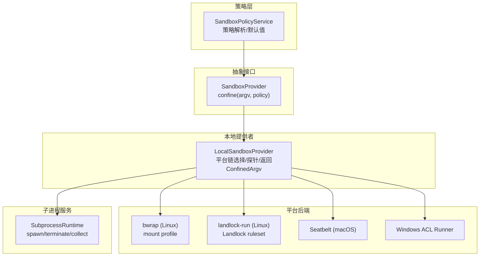
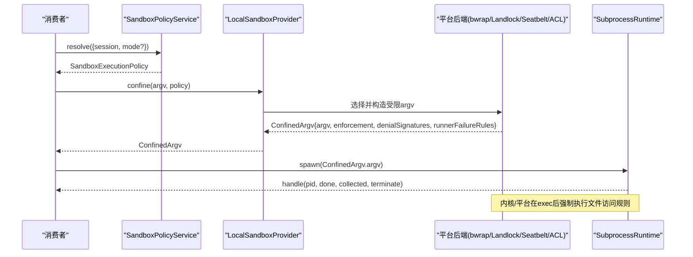
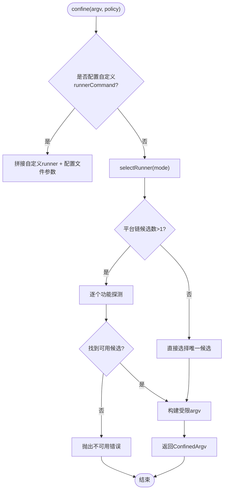
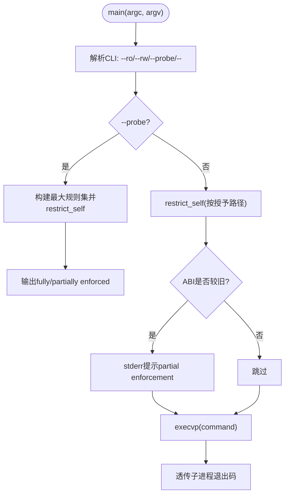
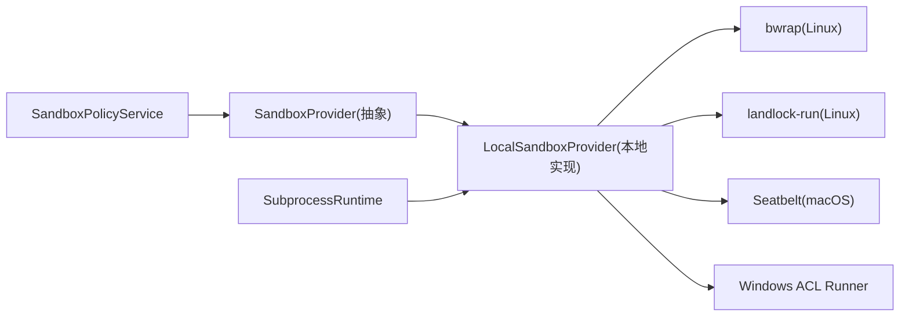

# 沙箱系统

<cite>
**本文引用的文件**
- [packages/sandbox/sandbox/src/index.ts](file://packages/sandbox/sandbox/src/index.ts)
- [packages/sandbox/sandbox-local/src/index.ts](file://packages/sandbox/sandbox-local/src/index.ts)
- [packages/sandbox/sandbox-policy/src/index.ts](file://packages/sandbox/sandbox-policy/src/index.ts)
- [native/landlock-run/packages/entry/src/main.c](file://native/landlock-run/packages/entry/src/main.c)
- [native/landlock-run/docs/cli-contract.md](file://native/landlock-run/docs/cli-contract.md)
- [native/landlock-run/README.md](file://native/landlock-run/README.md)
- [docs/subsystems/sandbox.md](file://docs/subsystems/sandbox.md)
- [docs/subsystems/subprocess.md](file://docs/subsystems/subprocess.md)
- [examples/acp-agent/partial-landlock.cordis.yml](file://examples/acp-agent/partial-landlock.cordis.yml)
</cite>

## 目录
1. [简介](#简介)
2. [项目结构](#项目结构)
3. [核心组件](#核心组件)
4. [架构总览](#架构总览)
5. [详细组件分析](#详细组件分析)
6. [依赖关系分析](#依赖关系分析)
7. [性能考虑](#性能考虑)
8. [故障排查指南](#故障排查指南)
9. [结论](#结论)
10. [附录](#附录)

## 简介
本文件系统围绕“进程隔离与最小权限执行”展开，重点说明：
- 进程隔离机制：通过平台后端（Linux Landlock、bwrap、macOS Seatbelt、Windows ACL）对子进程进行文件系统访问控制。
- 网络与进程可见性：当前沙箱模式聚焦于“文件效果”限制；网络与进程可见性不在该词汇表内，由其他子系统或容器化方案承担。
- 资源限制策略：超时、优雅退出、输出收集与溢出转储等由子进程服务统一提供。
- Landlock 内核模块：自限制后执行的 C 启动器，按 ABI 协商能力并报告“完全/部分”强制。
- 策略配置与环境隔离：每调用解析策略（只读/工作区可写/危险全开），结合会话上下文与工作区根路径。
- 子进程管理、监控与异常处理：统一的句柄、终止升级、输出收集与结果归因。
- 性能优化、调试技巧与常见问题：探针缓存、链选择、失败分类、回退策略。
- 完整配置示例与最佳实践：基于仓库中的示例与文档。

## 项目结构
沙箱系统由“抽象接口 + 本地提供者 + 策略服务 + 原生 Landlock 启动器”组成，并与“子进程服务”协同完成受控执行。

图表来源
- [packages/sandbox/sandbox/src/index.ts:152-176](file://packages/sandbox/sandbox/src/index.ts#L152-L176)
- [packages/sandbox/sandbox-local/src/index.ts:150-166](file://packages/sandbox/sandbox-local/src/index.ts#L150-L166)
- [docs/subsystems/subprocess.md:276-321](file://docs/subsystems/subprocess.md#L276-L321)

章节来源
- [docs/subsystems/sandbox.md:1-219](file://docs/subsystems/sandbox.md#L1-L219)
- [packages/sandbox/sandbox/src/index.ts:1-179](file://packages/sandbox/sandbox/src/index.ts#L1-L179)
- [packages/sandbox/sandbox-local/src/index.ts:1-568](file://packages/sandbox/sandbox-local/src/index.ts#L1-L568)
- [docs/subsystems/subprocess.md:1-325](file://docs/subsystems/subprocess.md#L1-L325)

## 核心组件
- 抽象沙箱接口：定义 confine(argv, policy) 契约，要求“失败关闭”，禁止静默无约束透传。
- 本地提供者：按平台选择运行器链（Linux 优先 bwrap，其次 landlock；macOS Seatbelt；Windows ACL），功能探测并缓存结果，返回 ConfinedArgv（包含 argv、enforcement、denialSignatures、runnerFailureRules）。
- 策略服务：集中管理部署默认模式、工作区根、会话覆盖，为每次能力调用解析出 SandboxExecutionPolicy。
- Landlock 启动器：C 实现，设置 no_new_privs，创建规则集，exec 子命令；支持 --probe 报告 full/partial/unusable。
- 子进程服务：提供 spawn/terminate/collect，树级终止、输出收集与溢出转储、超时与优雅退出。

章节来源
- [packages/sandbox/sandbox/src/index.ts:23-176](file://packages/sandbox/sandbox/src/index.ts#L23-L176)
- [packages/sandbox/sandbox-local/src/index.ts:250-333](file://packages/sandbox/sandbox-local/src/index.ts#L250-L333)
- [packages/sandbox/sandbox-policy/src/index.ts:91-151](file://packages/sandbox/sandbox-policy/src/index.ts#L91-L151)
- [native/landlock-run/packages/entry/src/main.c:220-299](file://native/landlock-run/packages/entry/src/main.c#L220-L299)
- [docs/subsystems/subprocess.md:89-174](file://docs/subsystems/subprocess.md#L89-L174)

## 架构总览
下图展示一次受限执行的端到端流程：消费者解析策略 → 调用 confine → 本地提供者选择后端 → 生成受限 argv → 子进程服务启动 → 内核/平台强制。

图表来源
- [packages/sandbox/sandbox-policy/src/index.ts:126-142](file://packages/sandbox/sandbox-policy/src/index.ts#L126-L142)
- [packages/sandbox/sandbox/src/index.ts:164-176](file://packages/sandbox/sandbox/src/index.ts#L164-L176)
- [packages/sandbox/sandbox-local/src/index.ts:316-333](file://packages/sandbox/sandbox-local/src/index.ts#L316-L333)
- [docs/subsystems/subprocess.md:276-321](file://docs/subsystems/subprocess.md#L276-L321)

## 详细组件分析

### 抽象沙箱接口与错误模型
- 模式与强制程度：
  - 模式：read-only、workspace-write、danger-full-access（仅前两种进入 provider）。
  - 强制程度：full/partial（older ABI 或平台边界导致的部分强制需被消费者感知）。
- 失败关闭：当无可用的后端时抛出不可用错误，禁止静默降级到无约束执行。
- 诊断与分类：
  - denialSignatures：不同后端产生的拒绝文本方言，用于区分“被沙箱阻止”。
  - runnerFailureRules：结构化规则，用于识别“启动器/运行器失败”而非“命令被阻止”。

章节来源
- [packages/sandbox/sandbox/src/index.ts:23-144](file://packages/sandbox/sandbox/src/index.ts#L23-L144)
- [docs/subsystems/sandbox.md:9-157](file://docs/subsystems/sandbox.md#L9-L157)

### 本地提供者：平台链选择与封装
- 平台链：
  - Linux：bwrap → landlock（优先 mount profile，回退到 Landlock）。
  - macOS：Seatbelt。
  - Windows：ACL restricted-token runner。
- 功能探测：首次按需探测各候选，缓存结果；单候选直接选择。
- 返回 ConfinedArgv：包含 argv、enforcement、denialSignatures、runnerFailureRules。
- Windows ACL 写入授权：
  - 工作区 SID 的 ACE 跨会话复用（standing grant）。
  - 会话私有临时目录与独立 SID（revocable），在提供者销毁时回收。

图表来源
- [packages/sandbox/sandbox-local/src/index.ts:316-333](file://packages/sandbox/sandbox-local/src/index.ts#L316-L333)
- [packages/sandbox/sandbox-local/src/index.ts:492-539](file://packages/sandbox/sandbox-local/src/index.ts#L492-L539)
- [packages/sandbox/sandbox-local/src/index.ts:358-443](file://packages/sandbox/sandbox-local/src/index.ts#L358-L443)

章节来源
- [packages/sandbox/sandbox-local/src/index.ts:150-187](file://packages/sandbox/sandbox-local/src/index.ts#L150-L187)
- [packages/sandbox/sandbox-local/src/index.ts:250-333](file://packages/sandbox/sandbox-local/src/index.ts#L250-L333)
- [packages/sandbox/sandbox-local/src/index.ts:492-564](file://packages/sandbox/sandbox-local/src/index.ts#L492-L564)

### Landlock 启动器：内核级文件访问控制
- 工作原理：
  - 设置 no_new_privs，创建规则集，添加允许的路径与访问位，restrict_self 应用到当前线程，exec 子命令。
  - 规则集随 execve 继承，所有后代进程同样受限。
- ABI 协商：
  - 根据内核支持的 ABI 级别计算 handled_access_fs，报告 full/partial。
- CLI 契约：
  - --ro/--rw 授予读/读写；--probe 测试强制能力；-- 分隔命令。
  - 失败退出码 125，成功则透传子进程状态。

图表来源
- [native/landlock-run/packages/entry/src/main.c:132-182](file://native/landlock-run/packages/entry/src/main.c#L132-L182)
- [native/landlock-run/packages/entry/src/main.c:220-299](file://native/landlock-run/packages/entry/src/main.c#L220-L299)
- [native/landlock-run/docs/cli-contract.md:5-35](file://native/landlock-run/docs/cli-contract.md#L5-L35)

章节来源
- [native/landlock-run/packages/entry/src/main.c:1-299](file://native/landlock-run/packages/entry/src/main.c#L1-L299)
- [native/landlock-run/docs/cli-contract.md:1-35](file://native/landlock-run/docs/cli-contract.md#L1-L35)
- [native/landlock-run/README.md:1-61](file://native/landlock-run/README.md#L1-L61)

### 策略服务：每调用解析与默认值
- 优先级：显式 approved mode > 会话覆盖 > 部署默认。
- 工作区根：会话 cwd 作为 workspace-write 边界；无会话时使用配置的 fallback root。
- 注入系统提示：将当前策略渲染为上下文片段，便于回放与审计。

章节来源
- [packages/sandbox/sandbox-policy/src/index.ts:32-52](file://packages/sandbox/sandbox-policy/src/index.ts#L32-L52)
- [packages/sandbox/sandbox-policy/src/index.ts:91-151](file://packages/sandbox/sandbox-policy/src/index.ts#L91-L151)

### 子进程服务：执行环境隔离与资源管理
- 环境变量：DSH_* 命名空间受控，父环境清洗后再合并。
- stdio 模式：pipe/inherit/collect（含溢出转储 spill）。
- 终止策略：SIGTERM→graceMs→SIGKILL 升级，跨平台树级终止。
- 输出收集：offset-based 读取，支持 lossy 与 spill 恢复。

章节来源
- [docs/subsystems/subprocess.md:9-174](file://docs/subsystems/subprocess.md#L9-L174)
- [docs/subsystems/subprocess.md:221-321](file://docs/subsystems/subprocess.md#L221-L321)

## 依赖关系分析
- 抽象接口与实现解耦：SandboxProvider 定义契约，LocalSandboxProvider 负责平台适配。
- 策略与服务分离：SandboxPolicyService 集中策略，避免在各消费端重复决策。
- 原生与 JS 协作：JS 层负责编排与诊断，C 层专注内核 API 的最小攻击面。
- 平台差异收敛：denialSignatures 与 runnerFailureRules 将后端方言标准化。

图表来源
- [packages/sandbox/sandbox/src/index.ts:152-176](file://packages/sandbox/sandbox/src/index.ts#L152-L176)
- [packages/sandbox/sandbox-local/src/index.ts:150-166](file://packages/sandbox/sandbox-local/src/index.ts#L150-L166)
- [docs/subsystems/subprocess.md:276-321](file://docs/subsystems/subprocess.md#L276-L321)

章节来源
- [packages/sandbox/sandbox/src/index.ts:1-179](file://packages/sandbox/sandbox/src/index.ts#L1-L179)
- [packages/sandbox/sandbox-local/src/index.ts:1-568](file://packages/sandbox/sandbox-local/src/index.ts#L1-L568)
- [docs/subsystems/subprocess.md:1-325](file://docs/subsystems/subprocess.md#L1-L325)

## 性能考虑
- 探针缓存：平台链选择结果缓存，避免重复探测开销。
- 最小二进制：Landlock 启动器静态链接 musl，减少依赖与启动成本。
- 输出收集：collect 模式支持内存尾缓冲与 spill 文件，避免大输出阻塞。
- 优雅退出：graceMs 控制 SIGTERM→SIGKILL 升级窗口，降低强制杀进程的资源抖动。
- 工作区 ACE 复用：Windows ACL 的工作区写入授权跨会话复用，减少重复传播成本。

[本节为通用指导，不直接分析具体文件]

## 故障排查指南
- 无法启用沙箱：
  - 现象：抛出不可用错误。
  - 原因：平台无可用后端或内核不支持 Landlock。
  - 处理：安装 bubblewrap、确保 Landlock 启用、或使用 danger-full-access（谨慎）。
- 部分强制（partial）：
  - 现象：Landlock 报告 older ABI，仍受限但非全部访问受控。
  - 处理：升级内核或改用 bwrap；消费者需感知 partial 并调整策略。
- 误分类“命令未运行”：
  - 现象：子进程退出码 125 但实际是命令自身返回。
  - 处理：同时检查 stderr 中 landlock-run: 前缀的诊断行，遵循 runnerFailureRules。
- 拒绝诊断方言：
  - 现象：不同后端产生不同的拒绝文本。
  - 处理：使用 ConfinedArgv.denialSignatures 精确匹配，避免跨后端误判。
- Windows ACL 边界：
  - 现象：Everyone 与硬链接导致的潜在越界。
  - 处理：接受 partial 声明，必要时采用更严格策略或容器化。

章节来源
- [packages/sandbox/sandbox/src/index.ts:118-144](file://packages/sandbox/sandbox/src/index.ts#L118-L144)
- [packages/sandbox/sandbox-local/src/index.ts:200-240](file://packages/sandbox/sandbox-local/src/index.ts#L200-L240)
- [native/landlock-run/docs/cli-contract.md:20-35](file://native/landlock-run/docs/cli-contract.md#L20-L35)

## 结论
本沙箱系统以“策略先行、后端解耦、失败关闭”为核心原则，通过平台适配层统一了 Linux/macOS/Windows 的文件访问限制语义，并以 Landlock 启动器提供内核级最小权限保障。配合子进程服务的资源管理与输出收集，实现了安全、可观测且可回退的执行环境。对于需要更强隔离的场景，建议结合容器或微虚拟机方案。

[本节为总结，不直接分析具体文件]

## 附录

### 配置选项与最佳实践
- 部署默认模式：
  - 推荐 read-only，仅在明确需要时切换到 workspace-write。
  - danger-full-access 仅用于不受信度高的场景或开发调试。
- 工作区根：
  - 使用会话 cwd 作为 workspace-write 边界；无会话时配置 fallback root。
- 平台选择：
  - Linux 优先 bwrap（mount profile 更接近模式词汇），回退 Landlock。
  - macOS 使用 Seatbelt；Windows 使用 ACL runner。
- 诊断与可观测性：
  - 记录每次调用的策略快照（mode、workspaceRoot、sessionId）。
  - 使用 denialSignatures 与 runnerFailureRules 区分“被阻止”和“启动失败”。
- 性能与安全平衡：
  - 利用 collect+spill 控制输出大小与完整性。
  - 合理设置 graceMs，兼顾优雅退出与资源回收。

章节来源
- [packages/sandbox/sandbox-policy/src/index.ts:60-151](file://packages/sandbox/sandbox-policy/src/index.ts#L60-L151)
- [packages/sandbox/sandbox-local/src/index.ts:150-187](file://packages/sandbox/sandbox-local/src/index.ts#L150-L187)
- [docs/subsystems/subprocess.md:52-174](file://docs/subsystems/subprocess.md#L52-L174)

### 完整配置示例
- 替换沙箱提供者以模拟 Landlock 部分强制：
  - 参考示例配置，禁用默认 sandbox-local，插入测试夹具以模拟 partial landlock。

章节来源
- [examples/acp-agent/partial-landlock.cordis.yml:1-14](file://examples/acp-agent/partial-landlock.cordis.yml#L1-L14)