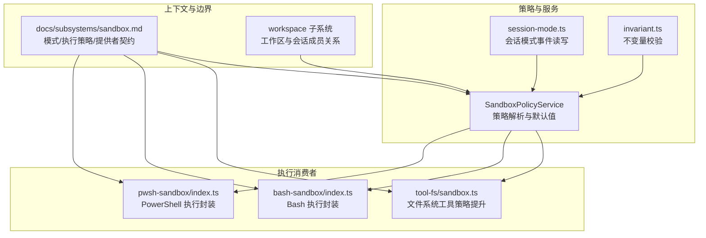
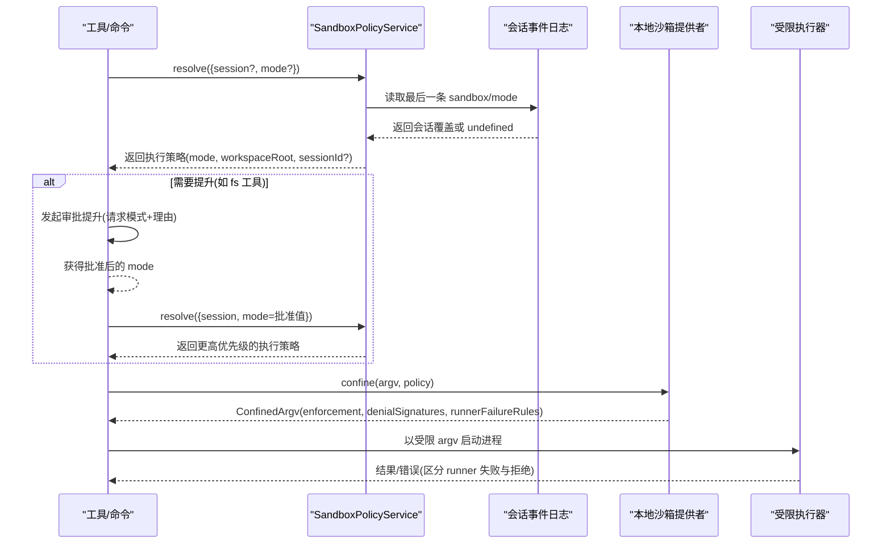
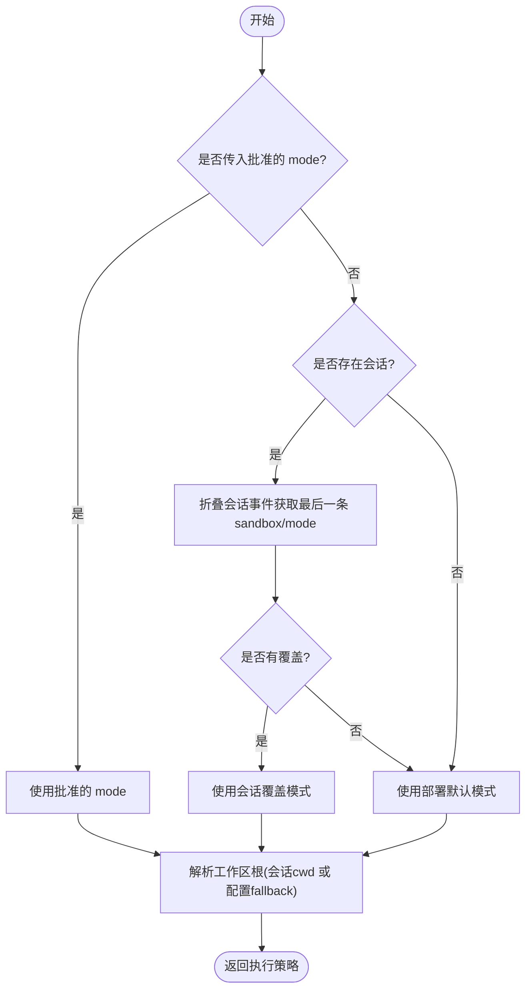
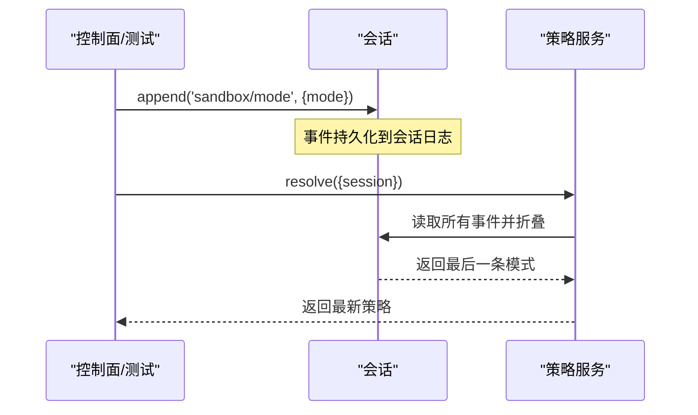
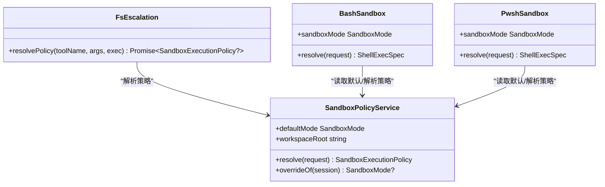
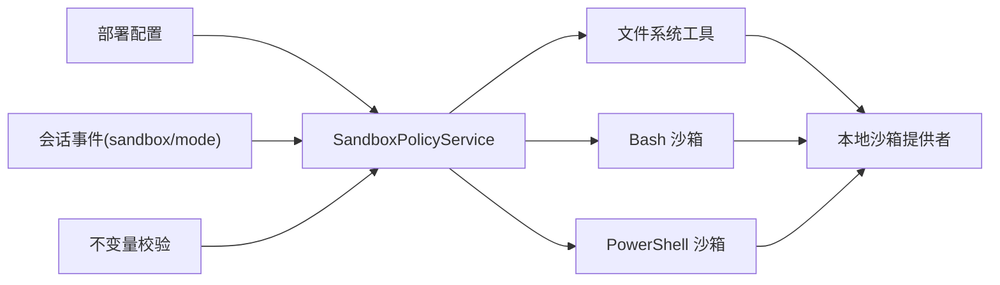

# 策略管理系统

<cite>
**本文引用的文件**
- [packages/sandbox/README.md](file://packages/sandbox/README.md)
- [docs/subsystems/sandbox.md](file://docs/subsystems/sandbox.md)
- [packages/sandbox/sandbox-policy/src/index.ts](file://packages/sandbox/sandbox-policy/src/index.ts)
- [packages/sandbox/sandbox-policy/src/session-mode.ts](file://packages/sandbox/sandbox-policy/src/session-mode.ts)
- [packages/sandbox/sandbox-policy/src/invariant.ts](file://packages/sandbox/sandbox-policy/src/invariant.ts)
- [packages/sandbox/sandbox-policy/tests/policy.spec.ts](file://packages/sandbox/sandbox-policy/tests/policy.spec.ts)
- [packages/fs/tool-fs/src/sandbox.ts](file://packages/fs/tool-fs/src/sandbox.ts)
- [packages/shell/bash-sandbox/src/index.ts](file://packages/shell/bash-sandbox/src/index.ts)
- [packages/shell/pwsh-sandbox/src/index.ts](file://packages/shell/pwsh-sandbox/src/index.ts)
- [docs/subsystems/workspace.md](file://docs/subsystems/workspace.md)
- [packages/workspace/README.md](file://packages/workspace/README.md)
- [.agents/notes/implemented/feature/2026-07-25-subagent-policy-inheritance.zh.md](file://.agents/notes/implemented/feature/2026-07-25-subagent-policy-inheritance.zh.md)
</cite>

## 目录
1. [简介](#简介)
2. [项目结构](#项目结构)
3. [核心组件](#核心组件)
4. [架构总览](#架构总览)
5. [详细组件分析](#详细组件分析)
6. [依赖关系分析](#依赖关系分析)
7. [性能考虑](#性能考虑)
8. [故障排查指南](#故障排查指南)
9. [结论](#结论)
10. [附录：配置参考与最佳实践](#附录：配置参考与最佳实践)

## 简介
本文件系统性地梳理并文档化“沙箱策略管理”的完整机制，覆盖策略定义、解析与执行、优先级与继承、动态更新与版本回滚、验证测试与部署流程，以及与会话、工作区的关联关系。目标是让非技术读者也能理解策略如何生效，同时为开发者提供可操作的实现参考与排障指引。

## 项目结构
围绕沙箱策略的核心由以下包与文档组成：
- 能力边界与子系统说明：sandbox 家族与 docs/subsystems/sandbox.md
- 策略服务与持久化事件：sandbox-policy（服务、会话模式事件、不变量校验）
- 策略消费者：bash/pwsh 沙箱、文件系统工具
- 工作区与会话关联：workspace 子系统与文档

图表来源
- [packages/sandbox/README.md:1-16](file://packages/sandbox/README.md#L1-L16)
- [docs/subsystems/sandbox.md:1-219](file://docs/subsystems/sandbox.md#L1-L219)
- [packages/sandbox/sandbox-policy/src/index.ts:1-155](file://packages/sandbox/sandbox-policy/src/index.ts#L1-L155)
- [packages/sandbox/sandbox-policy/src/session-mode.ts:1-72](file://packages/sandbox/sandbox-policy/src/session-mode.ts#L1-L72)
- [packages/sandbox/sandbox-policy/src/invariant.ts:1-43](file://packages/sandbox/sandbox-policy/src/invariant.ts#L1-L43)
- [packages/fs/tool-fs/src/sandbox.ts:75-108](file://packages/fs/tool-fs/src/sandbox.ts#L75-L108)
- [packages/shell/bash-sandbox/src/index.ts:51-86](file://packages/shell/bash-sandbox/src/index.ts#L51-L86)
- [packages/shell/pwsh-sandbox/src/index.ts:59-94](file://packages/shell/pwsh-sandbox/src/index.ts#L59-L94)
- [docs/subsystems/workspace.md:116-116](file://docs/subsystems/workspace.md#L116-L116)

章节来源
- [packages/sandbox/README.md:1-16](file://packages/sandbox/README.md#L1-L16)
- [docs/subsystems/sandbox.md:1-219](file://docs/subsystems/sandbox.md#L1-L219)

## 核心组件
- SandboxPolicyService（策略服务）
  - 维护部署级默认模式与 fallback 工作区根路径
  - 每次能力调用时解析出完整的 per-call 执行策略（模式 + 工作区根 + 可选 sessionId）
  - 将当前策略注入系统提示上下文，便于模型回放与审计
- session-mode（会话模式事件）
  - 通过追加式会话事件 sandbox/mode 记录模式切换
  - effectiveSandboxMode 对事件日志进行折叠，得到会话最终模式
  - setSandboxMode 是唯一的写入路径，保证幂等与可重放
- invariant（不变量校验）
  - 在加载与新增事件时对 sandbox/mode 的值域做严格校验
  - 发现未知模式即触发不变量失败，阻止非法状态进入系统
- 策略消费者
  - 文件系统工具：在执行前解析策略，必要时走审批提升流程
  - Bash/PowerShell 沙箱：将 per-call 策略注入执行规格，确保进程受控

章节来源
- [packages/sandbox/sandbox-policy/src/index.ts:60-155](file://packages/sandbox/sandbox-policy/src/index.ts#L60-L155)
- [packages/sandbox/sandbox-policy/src/session-mode.ts:1-72](file://packages/sandbox/sandbox-policy/src/session-mode.ts#L1-L72)
- [packages/sandbox/sandbox-policy/src/invariant.ts:1-43](file://packages/sandbox/sandbox-policy/src/invariant.ts#L1-L43)
- [packages/fs/tool-fs/src/sandbox.ts:75-108](file://packages/fs/tool-fs/src/sandbox.ts#L75-L108)
- [packages/shell/bash-sandbox/src/index.ts:51-86](file://packages/shell/bash-sandbox/src/index.ts#L51-L86)
- [packages/shell/pwsh-sandbox/src/index.ts:59-94](file://packages/shell/pwsh-sandbox/src/index.ts#L59-L94)

## 架构总览
下图展示策略从“部署默认 → 会话覆盖 → 单次批准提升”的优先级链，以及消费者如何消费该策略。

图表来源
- [packages/sandbox/sandbox-policy/src/index.ts:126-142](file://packages/sandbox/sandbox-policy/src/index.ts#L126-L142)
- [packages/sandbox/sandbox-policy/src/session-mode.ts:44-71](file://packages/sandbox/sandbox-policy/src/session-mode.ts#L44-L71)
- [docs/subsystems/sandbox.md:41-94](file://docs/subsystems/sandbox.md#L41-L94)
- [packages/fs/tool-fs/src/sandbox.ts:87-108](file://packages/fs/tool-fs/src/sandbox.ts#L87-L108)
- [packages/shell/bash-sandbox/src/index.ts:79-86](file://packages/shell/bash-sandbox/src/index.ts#L79-L86)
- [packages/shell/pwsh-sandbox/src/index.ts:87-94](file://packages/shell/pwsh-sandbox/src/index.ts#L87-L94)

## 详细组件分析

### 策略解析与优先级
- 优先级顺序（从高到低）
  1) 单次批准的显式 mode（覆盖会话模式）
  2) 会话最后一条 sandbox/mode 事件（持久化、可重放）
  3) 部署默认 mode（配置项）
- 工作区根解析
  - 优先使用会话 header.cwd 的规范路径
  - 无会话或无 cwd 时回退到配置的 workspaceRoot
- 输出
  - 返回包含 mode、workspaceRoot、sessionId（有会话时）的执行策略对象
- 系统提示注入
  - 将当前策略渲染为人类可读文本，随模型历史一起回放，便于审计与调试

图表来源
- [packages/sandbox/sandbox-policy/src/index.ts:126-142](file://packages/sandbox/sandbox-policy/src/index.ts#L126-L142)
- [packages/sandbox/sandbox-policy/src/session-mode.ts:44-58](file://packages/sandbox/sandbox-policy/src/session-mode.ts#L44-L58)
- [docs/subsystems/sandbox.md:41-67](file://docs/subsystems/sandbox.md#L41-L67)

章节来源
- [packages/sandbox/sandbox-policy/src/index.ts:60-155](file://packages/sandbox/sandbox-policy/src/index.ts#L60-L155)
- [packages/sandbox/sandbox-policy/src/session-mode.ts:1-72](file://packages/sandbox/sandbox-policy/src/session-mode.ts#L1-L72)
- [docs/subsystems/sandbox.md:41-94](file://docs/subsystems/sandbox.md#L41-L94)

### 策略的动态更新、版本管理与回滚
- 动态更新
  - 通过 setSandboxMode 向当前会话追加一条 sandbox/mode 事件
  - 下一次受限调用会重新折叠事件日志，立即生效
- 版本管理
  - 事件日志天然具备版本语义：每条事件代表一次变更，按时间顺序可重放
  - effectiveSandboxMode 仅关注“最后一条”，无需额外状态存储
- 回滚
  - 回滚即再次追加一条新的 sandbox/mode 事件，覆盖之前的状态
  - 由于只读折叠，任何中间态都可被后续事件覆盖，支持任意次回滚

图表来源
- [packages/sandbox/sandbox-policy/src/session-mode.ts:60-71](file://packages/sandbox/sandbox-policy/src/session-mode.ts#L60-L71)
- [packages/sandbox/sandbox-policy/src/index.ts:126-142](file://packages/sandbox/sandbox-policy/src/index.ts#L126-L142)

章节来源
- [packages/sandbox/sandbox-policy/src/session-mode.ts:1-72](file://packages/sandbox/sandbox-policy/src/session-mode.ts#L1-L72)
- [packages/sandbox/sandbox-policy/src/index.ts:126-142](file://packages/sandbox/sandbox-policy/src/index.ts#L126-L142)

### 策略继承与覆盖（含子代理）
- 继承原则
  - 子代理在首次 await 之前捕获父会话的策略覆盖快照
  - 仅复制显式会话覆盖项，不复制部署默认值或一次性授权
  - 审批策略不继承：同一次捕获会把每个子代理钉定为“从不”
- 覆盖行为
  - 子代理可基于自身会话继续追加新的 sandbox/mode 事件，形成独立覆盖链
  - 取消后重新委派会取得新快照，避免旧覆盖污染

章节来源
- [.agents/notes/implemented/feature/2026-07-25-subagent-policy-inheritance.zh.md:1-13](file://.agents/notes/implemented/feature/2026-07-25-subagent-policy-inheritance.zh.md#L1-L13)

### 策略与执行：文件系统与 Shell
- 文件系统工具
  - 在执行前解析策略；若携带提升参数则走审批流程，批准后以更高模式执行
  - 始终携带调用会话的工作区根作为写入边界
- Shell（Bash/PowerShell）
  - 将 per-call 策略注入执行规格，确保进程受限
  - 报告执行完整性（full/partial）与拒绝特征，用于上层诊断

图表来源
- [packages/fs/tool-fs/src/sandbox.ts:75-108](file://packages/fs/tool-fs/src/sandbox.ts#L75-L108)
- [packages/shell/bash-sandbox/src/index.ts:51-86](file://packages/shell/bash-sandbox/src/index.ts#L51-L86)
- [packages/shell/pwsh-sandbox/src/index.ts:59-94](file://packages/shell/pwsh-sandbox/src/index.ts#L59-L94)
- [packages/sandbox/sandbox-policy/src/index.ts:91-155](file://packages/sandbox/sandbox-policy/src/index.ts#L91-L155)

章节来源
- [packages/fs/tool-fs/src/sandbox.ts:75-108](file://packages/fs/tool-fs/src/sandbox.ts#L75-L108)
- [packages/shell/bash-sandbox/src/index.ts:51-86](file://packages/shell/bash-sandbox/src/index.ts#L51-L86)
- [packages/shell/pwsh-sandbox/src/index.ts:59-94](file://packages/shell/pwsh-sandbox/src/index.ts#L59-L94)

### 策略与会话、工作区的关联
- 会话
  - 策略覆盖以会话为单位隔离，不同会话互不可见
  - 策略通过会话事件日志持久化，重启后可重放恢复
- 工作区
  - 工作区根来自会话 header.cwd 的规范路径；无会话时回退到配置
  - 工作区实体拥有有序 sessionIds，成员资格需同时满足账本 id 与 header 规范 cwd 一致

章节来源
- [packages/sandbox/sandbox-policy/src/index.ts:126-142](file://packages/sandbox/sandbox-policy/src/index.ts#L126-L142)
- [docs/subsystems/workspace.md:116-116](file://docs/subsystems/workspace.md#L116-L116)
- [packages/workspace/README.md:1-14](file://packages/workspace/README.md#L1-L14)

## 依赖关系分析
- 松耦合
  - 策略服务仅依赖会话事件与配置，不感知具体平台后端
  - 消费者通过统一接口消费策略，屏蔽后端差异
- 关键依赖
  - 会话事件：sandbox/mode 事件是唯一状态源
  - 不变量：防止非法模式进入系统
  - 提供者契约：confine 必须返回受限 argv 或失败关闭，禁止静默放行

图表来源
- [packages/sandbox/sandbox-policy/src/index.ts:60-155](file://packages/sandbox/sandbox-policy/src/index.ts#L60-L155)
- [packages/sandbox/sandbox-policy/src/invariant.ts:1-43](file://packages/sandbox/sandbox-policy/src/invariant.ts#L1-L43)
- [docs/subsystems/sandbox.md:152-157](file://docs/subsystems/sandbox.md#L152-L157)

章节来源
- [packages/sandbox/sandbox-policy/src/index.ts:60-155](file://packages/sandbox/sandbox-policy/src/index.ts#L60-L155)
- [packages/sandbox/sandbox-policy/src/invariant.ts:1-43](file://packages/sandbox/sandbox-policy/src/invariant.ts#L1-L43)
- [docs/subsystems/sandbox.md:152-157](file://docs/subsystems/sandbox.md#L152-L157)

## 性能考虑
- 策略解析开销极低：仅读取会话事件末尾并折叠，时间复杂度 O(n) 且 n 通常很小
- 工作区根解析使用规范路径，避免符号链接带来的歧义
- 系统提示注入仅在组装提示时计算，避免热路径重复计算
- 建议
  - 避免频繁切换模式；批量操作前设置一次模式
  - 大会话中尽量合并模式切换，减少事件数量

[本节为通用指导，不直接分析具体文件]

## 故障排查指南
- 常见错误与定位
  - 未知模式：不变量校验会在加载或新增事件时报错，检查事件数据是否合法
  - 无法沙箱：当无可用后端时会抛出不可用错误，检查平台能力与提供者可用性
  - 部分执行：某些平台 ABI 或 ACL 限制导致 partial 执行，需在消费端拒绝或提示
- 诊断要点
  - 查看会话事件日志中的最后一条 sandbox/mode
  - 检查系统提示上下文中的策略渲染文本
  - 区分 runner 失败与拒绝：先匹配 runner 失败规则，再匹配拒绝特征

章节来源
- [packages/sandbox/sandbox-policy/src/invariant.ts:16-33](file://packages/sandbox/sandbox-policy/src/invariant.ts#L16-L33)
- [docs/subsystems/sandbox.md:152-157](file://docs/subsystems/sandbox.md#L152-L157)
- [packages/sandbox/sandbox-policy/tests/policy.spec.ts:126-141](file://packages/sandbox/sandbox-policy/tests/policy.spec.ts#L126-L141)

## 结论
本策略管理系统以“会话事件日志”为核心，实现了安全、可重放、易回滚的沙箱策略机制。通过清晰的优先级链（批准 > 会话覆盖 > 部署默认），配合严格的不变量校验与统一的消费者接口，系统在保障安全的同时保持了良好的可观测性与可维护性。结合工作区与会话的关联，策略能够精准限定写入边界，支撑多场景下的安全执行。

[本节为总结，不直接分析具体文件]

## 附录：配置参考与最佳实践

### 配置参考
- 部署配置（SandboxPolicyService）
  - mode：初始模式，默认 read-only
  - workspaceRoot：无会话或无 cwd 时的回退根路径
- 会话模式事件
  - 类型：sandbox/mode
  - 字段：mode（受限于枚举）、source（可选，标记委派种子）
- 执行策略
  - mode：read-only | workspace-write | danger-full-access
  - workspaceRoot：绝对路径
  - sessionId：存在会话时携带

章节来源
- [packages/sandbox/sandbox-policy/src/index.ts:60-104](file://packages/sandbox/sandbox-policy/src/index.ts#L60-L104)
- [packages/sandbox/sandbox-policy/src/session-mode.ts:24-38](file://packages/sandbox/sandbox-policy/src/session-mode.ts#L24-L38)
- [docs/subsystems/sandbox.md:9-39](file://docs/subsystems/sandbox.md#L9-L39)

### 最佳实践
- 默认保守：部署默认设置为 read-only，按需放宽
- 最小权限：尽可能使用 read-only，仅在必要时切换到 workspace-write
- 明确边界：确保会话 cwd 指向正确的工作区根，避免误写
- 审批前置：需要提升时先走审批流程，记录理由与目标模式
- 事件治理：避免频繁切换模式，集中批处理
- 回滚策略：通过追加新事件快速回滚到期望状态
- 验证先行：利用不变量与单元测试覆盖异常路径

章节来源
- [packages/sandbox/sandbox-policy/tests/policy.spec.ts:42-141](file://packages/sandbox/sandbox-policy/tests/policy.spec.ts#L42-L141)
- [packages/sandbox/sandbox-policy/src/invariant.ts:16-33](file://packages/sandbox/sandbox-policy/src/invariant.ts#L16-L33)
- [docs/subsystems/sandbox.md:41-94](file://docs/subsystems/sandbox.md#L41-L94)