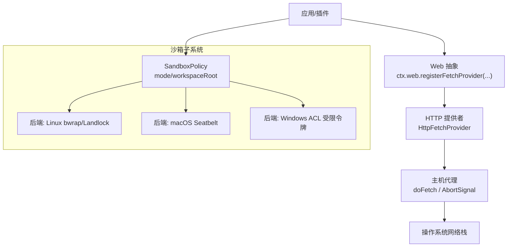
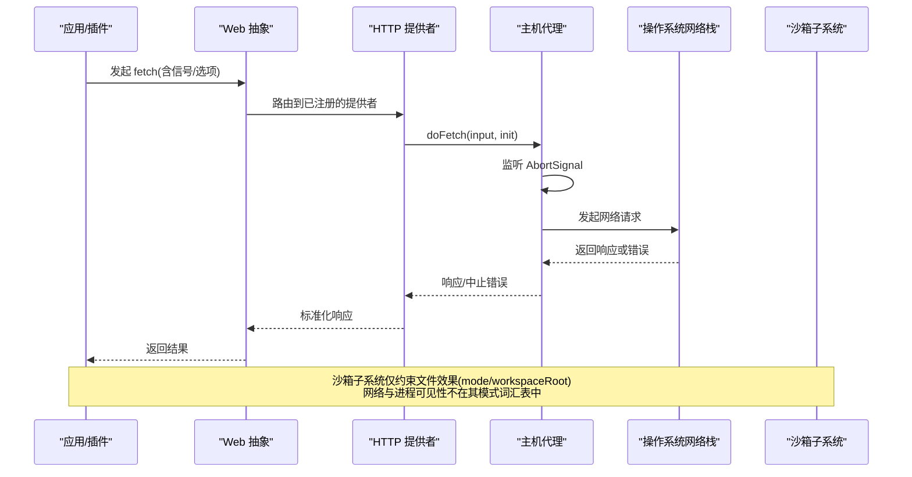
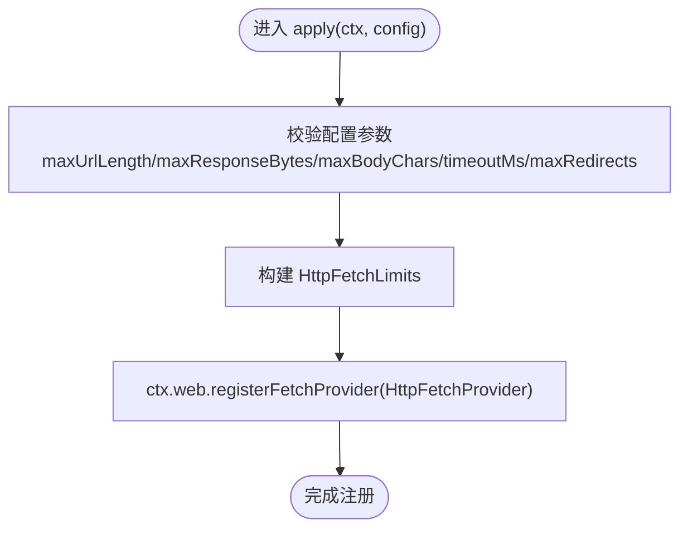
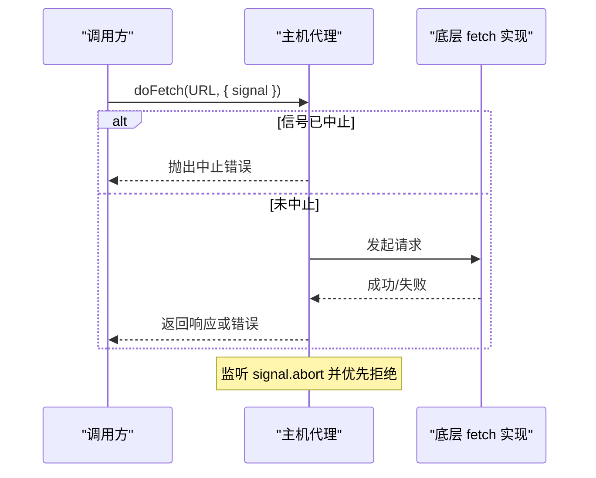
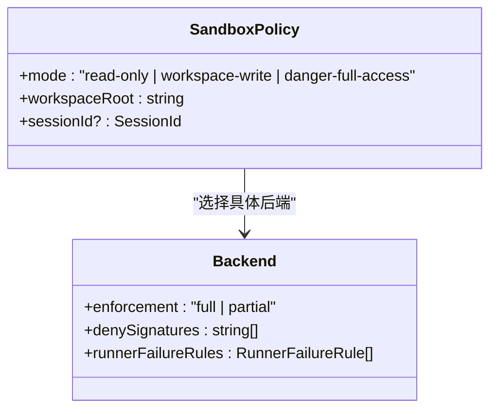
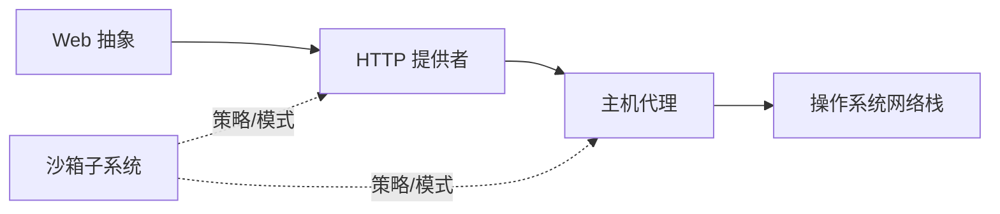

# 网络访问控制

<cite>
**本文引用的文件**
- [packages/web/web-fetch-http/src/index.ts](file://packages/web/web-fetch-http/src/index.ts)
- [packages/host/apiproxy/src/fetch/client.ts](file://packages/host/apiproxy/src/fetch/client.ts)
- [packages/web/web-fetch-http/tests/fetch-http.spec.ts](file://packages/web/web-fetch-http/tests/fetch-http.spec.ts)
- [packages/client/connection/tests/loopback-hostname.client.spec.ts](file://packages/client/connection/tests/loopback-hostname.client.spec.ts)
- [docs/subsystems/sandbox.md](file://docs/subsystems/sandbox.md)
- [.agents/notes/implemented/feature/2026-08-08-windows-acl-restricted-token-sandbox.md](file://.agents/notes/implemented/feature/2026-08-08-windows-acl-restricted-token-sandbox.md)
- [native/landlock-run/packages/entry/src/main.c](file://native/landlock-run/packages/entry/src/main.c)
</cite>

## 目录
1. [简介](#简介)
2. [项目结构](#项目结构)
3. [核心组件](#核心组件)
4. [架构总览](#架构总览)
5. [详细组件分析](#详细组件分析)
6. [依赖关系分析](#依赖关系分析)
7. [性能考量](#性能考量)
8. [故障排查指南](#故障排查指南)
9. [结论](#结论)
10. [附录](#附录)

## 简介
本文件聚焦沙箱环境中的网络访问控制，围绕“策略、隔离、拦截、监控、超时与连接管理”展开。仓库中网络能力由“Web 抽象 + HTTP 提供者 + 主机代理”组成：Web 层提供统一的 fetch 接口与限制配置；主机代理负责信号中止与超时语义；沙箱子系统通过进程级隔离（Linux Landlock/bwrap、macOS Seatbelt、Windows ACL 受限令牌）对子进程的文件与可见性进行约束，但明确将网络与进程可见性排除在沙箱模式之外。因此，网络访问控制在本仓库中主要体现为：
- 请求前校验与过滤（URL、长度、重定向、内容类型等）
- 超时与取消（AbortSignal）
- 日志记录与脱敏（测试工具中对请求头载荷的清洗）
- 平台隔离与最小权限原则（通过沙箱限制子进程可触达的资源面，网络面需配合外部机制或策略）

## 项目结构
与网络访问控制直接相关的代码集中在以下位置：
- Web 抽象与 HTTP 提供者：定义 fetch 配置、限制、注册与默认值
- 主机代理：实现 abort/timeout 语义，确保底层实现不会阻塞取消
- 沙箱子系统：定义进程级隔离模式与执行策略（不含网络），并说明各平台的实现现状
- 安全辅助：回环地址判定、请求头清洗等

图表来源
- [packages/web/web-fetch-http/src/index.ts:83-101](file://packages/web/web-fetch-http/src/index.ts#L83-L101)
- [packages/host/apiproxy/src/fetch/client.ts:525-549](file://packages/host/apiproxy/src/fetch/client.ts#L525-L549)
- [docs/subsystems/sandbox.md:9-39](file://docs/subsystems/sandbox.md#L9-L39)

章节来源
- [packages/web/web-fetch-http/src/index.ts:33-101](file://packages/web/web-fetch-http/src/index.ts#L33-L101)
- [packages/host/apiproxy/src/fetch/client.ts:525-549](file://packages/host/apiproxy/src/fetch/client.ts#L525-L549)
- [docs/subsystems/sandbox.md:9-39](file://docs/subsystems/sandbox.md#L9-L39)

## 核心组件
- Web 抽象与 HTTP 提供者
  - 提供统一配置项：最大 URL 长度、响应体大小、解码后字符数、默认超时、同域重定向次数、User-Agent
  - 启动时校验配置合法性并注册到 ctx.web
- 主机代理
  - 保证 AbortSignal 的及时拒绝，避免底层实现忽略信号导致超时/取消失效
- 沙箱子系统
  - 以 mode/workspaceRoot 描述文件效果策略，明确网络与进程可见性不在该词汇表内
  - 平台后端报告 enforcement 完整性（full/partial）

章节来源
- [packages/web/web-fetch-http/src/index.ts:33-101](file://packages/web/web-fetch-http/src/index.ts#L33-L101)
- [packages/host/apiproxy/src/fetch/client.ts:525-549](file://packages/host/apiproxy/src/fetch/client.ts#L525-L549)
- [docs/subsystems/sandbox.md:9-39](file://docs/subsystems/sandbox.md#L9-L39)

## 架构总览
下图展示一次网络请求从调用方到操作系统的完整路径，以及沙箱子系统对进程资源面的约束边界。

图表来源
- [packages/web/web-fetch-http/src/index.ts:83-101](file://packages/web/web-fetch-http/src/index.ts#L83-L101)
- [packages/host/apiproxy/src/fetch/client.ts:525-549](file://packages/host/apiproxy/src/fetch/client.ts#L525-L549)
- [docs/subsystems/sandbox.md:9-39](file://docs/subsystems/sandbox.md#L9-L39)

## 详细组件分析

### Web 抽象与 HTTP 提供者：策略与限制
- 配置项与默认值
  - 最大 URL 长度、响应体字节上限、解码字符上限、默认超时、同域重定向次数、User-Agent
  - 启动时对配置进行断言（正数、有限、整数范围等）
- 注册流程
  - 解析配置后构造 HttpFetchLimits，并通过 ctx.web.registerFetchProvider 注册
- 请求前校验与分类
  - 测试覆盖 URL 方案、凭据、长度、内容类型分类等规则

图表来源
- [packages/web/web-fetch-http/src/index.ts:83-101](file://packages/web/web-fetch-http/src/index.ts#L83-L101)

章节来源
- [packages/web/web-fetch-http/src/index.ts:33-101](file://packages/web/web-fetch-http/src/index.ts#L33-L101)
- [packages/web/web-fetch-http/tests/fetch-http.spec.ts:43-59](file://packages/web/web-fetch-http/tests/fetch-http.spec.ts#L43-L59)

### 主机代理：超时与取消
- 行为要点
  - 若传入 AbortSignal，立即检查是否已中止；否则监听中止事件并在中止时拒绝 Promise
  - 即使底层 handler 忽略信号，上层仍会按信号原因抛出中止错误，确保超时/取消语义不被绕过
- 适用场景
  - 长耗时请求、重试/取消链、流式处理中断

图表来源
- [packages/host/apiproxy/src/fetch/client.ts:525-549](file://packages/host/apiproxy/src/fetch/client.ts#L525-L549)

章节来源
- [packages/host/apiproxy/src/fetch/client.ts:525-549](file://packages/host/apiproxy/src/fetch/client.ts#L525-L549)

### 沙箱子系统：网络权限与平台隔离
- 模式与执行策略
  - 模式仅约束文件效果：read-only、workspace-write、danger-full-access
  - 明确声明：网络与进程可见性不在该词汇表内
  - enforcement 完整性：full/partial，用于提示当前后端能保障的程度
- 平台实现现状
  - Linux：bwrap/Landlock，Landlock ABI 逐步增强，部分旧 ABI 下为 partial
  - macOS：Seatbelt 后端
  - Windows：ACL 受限令牌，存在 Everyone/hard-link 等边界导致的 partial 情况
- 建议
  - 在网络侧采用“白名单/最小权限”策略，结合外部防火墙或网关
  - 对敏感目标（如内网、数据库）使用域名/IP 白名单与证书校验
  - 将网络策略与沙箱策略解耦，分别治理

图表来源
- [docs/subsystems/sandbox.md:9-39](file://docs/subsystems/sandbox.md#L9-L39)
- [docs/subsystems/sandbox.md:120-150](file://docs/subsystems/sandbox.md#L120-L150)

章节来源
- [docs/subsystems/sandbox.md:9-39](file://docs/subsystems/sandbox.md#L9-L39)
- [.agents/notes/implemented/feature/2026-08-08-windows-acl-restricted-token-sandbox.md:11-35](file://.agents/notes/implemented/feature/2026-08-08-windows-acl-restricted-token-sandbox.md#L11-L35)
- [native/landlock-run/packages/entry/src/main.c:67-94](file://native/landlock-run/packages/entry/src/main.c#L67-L94)

### 安全辅助：回环地址判定与请求头清洗
- 回环地址判定
  - 支持 localhost、IPv6 回环、IPv4 127/8 段；拒绝畸形或非回环地址
- 请求头清洗
  - 测试工具对特定请求头载荷进行替换，便于快照稳定与安全

章节来源
- [packages/client/connection/tests/loopback-hostname.client.spec.ts:1-18](file://packages/client/connection/tests/loopback-hostname.client.spec.ts#L1-L18)

## 依赖关系分析
- Web 抽象依赖 HTTP 提供者；HTTP 提供者依赖主机代理；主机代理依赖操作系统网络栈
- 沙箱子系统与网络路径解耦：它约束进程文件效果，不直接决定网络连通性
- 测试用例验证了 URL 校验、内容类型分类、回环地址判定等关键分支

图表来源
- [packages/web/web-fetch-http/src/index.ts:83-101](file://packages/web/web-fetch-http/src/index.ts#L83-L101)
- [packages/host/apiproxy/src/fetch/client.ts:525-549](file://packages/host/apiproxy/src/fetch/client.ts#L525-L549)
- [docs/subsystems/sandbox.md:9-39](file://docs/subsystems/sandbox.md#L9-L39)

章节来源
- [packages/web/web-fetch-http/src/index.ts:83-101](file://packages/web/web-fetch-http/src/index.ts#L83-L101)
- [packages/host/apiproxy/src/fetch/client.ts:525-549](file://packages/host/apiproxy/src/fetch/client.ts#L525-L549)
- [docs/subsystems/sandbox.md:9-39](file://docs/subsystems/sandbox.md#L9-L39)

## 性能考量
- 超时与取消
  - 合理设置 timeoutMs，避免过长等待；利用 AbortSignal 快速释放资源
- 重定向与响应体
  - 限制 maxRedirects 防止重定向风暴；限制 maxResponseBytes 与 maxBodyChars 控制内存占用
- 并发与连接池
  - 当前仓库未内置连接池；在高并发场景建议使用宿主环境的连接复用机制（如 Node.js http/https Agent）
- 日志与脱敏
  - 对敏感头部进行清洗，减少日志泄露风险

[本节为通用指导，不直接分析具体文件]

## 故障排查指南
- 请求被拒绝或超时
  - 检查是否启用了 AbortSignal 且正确触发
  - 确认 timeoutMs 是否过小或被宿主环境调整
- URL 校验失败
  - 检查 scheme、凭据、长度是否符合限制
- 内容类型分类异常
  - 确认 Content-Type 头格式与预期一致
- 回环地址误判
  - 核对主机名是否为合法的回环地址
- 沙箱相关报错
  - 关注 enforcement 是否为 partial；必要时提升后端版本或切换平台特性

章节来源
- [packages/host/apiproxy/src/fetch/client.ts:525-549](file://packages/host/apiproxy/src/fetch/client.ts#L525-L549)
- [packages/web/web-fetch-http/tests/fetch-http.spec.ts:43-59](file://packages/web/web-fetch-http/tests/fetch-http.spec.ts#L43-L59)
- [packages/client/connection/tests/loopback-hostname.client.spec.ts:1-18](file://packages/client/connection/tests/loopback-hostname.client.spec.ts#L1-L18)
- [docs/subsystems/sandbox.md:9-39](file://docs/subsystems/sandbox.md#L9-L39)

## 结论
- 本仓库的网络访问控制以“策略+限制+超时/取消”为核心，通过 Web 抽象与 HTTP 提供者实现统一的请求治理
- 沙箱子系统专注于进程文件效果的最小化授权，网络与进程可见性不在其模式范围内，需借助外部机制或策略配合
- 建议在部署侧结合防火墙/网关/白名单，实现更细粒度的网络访问控制；在应用侧通过配置项与校验逻辑强化安全性与稳定性

[本节为总结性内容，不直接分析具体文件]

## 附录
- 最佳实践
  - 始终启用并正确配置超时与取消
  - 严格限制 URL 长度、重定向次数与响应体大小
  - 对敏感目标实施白名单与证书校验
  - 日志脱敏，避免泄露凭据与内部信息
  - 将网络策略与沙箱策略解耦，分别治理
- 常见问题
  - 超时/取消无效：检查信号传递与底层实现是否遵循约定
  - URL 校验失败：检查方案、凭据与长度
  - 沙箱 partial：了解平台限制，必要时升级内核/后端或调整策略

[本节为通用指导，不直接分析具体文件]