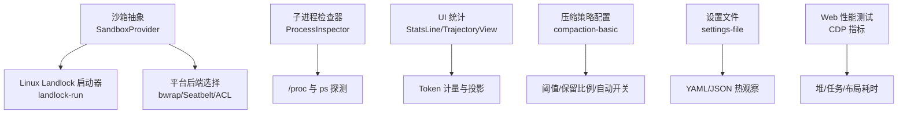
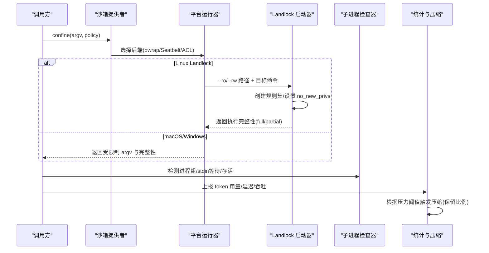
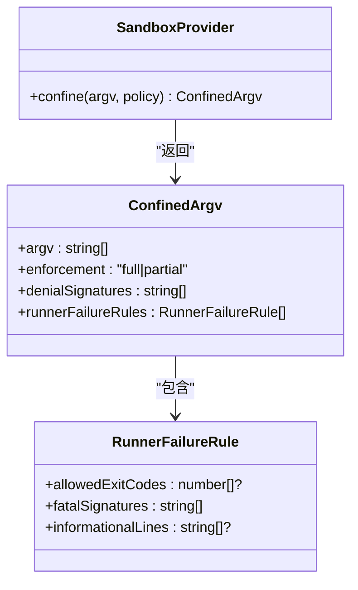
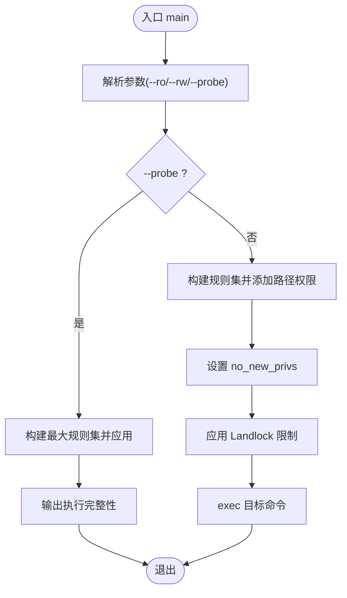
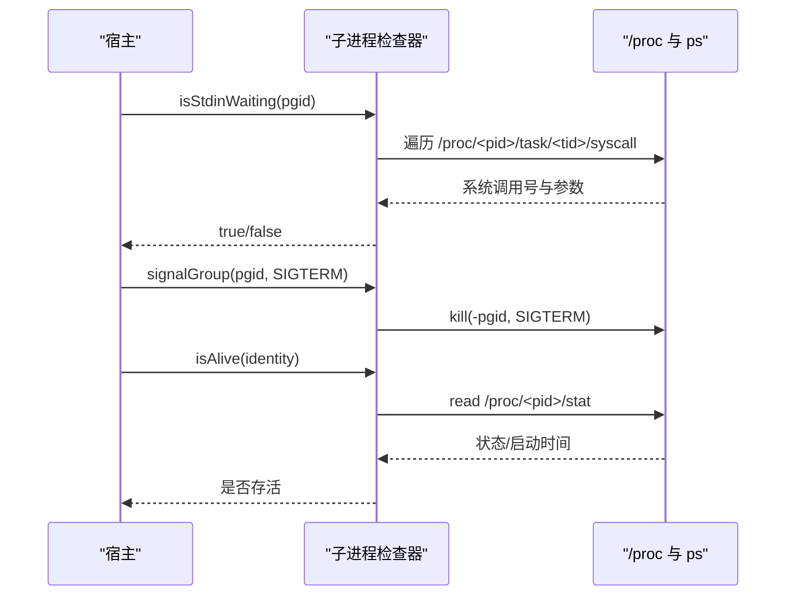
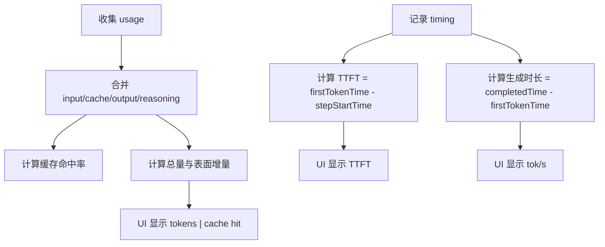
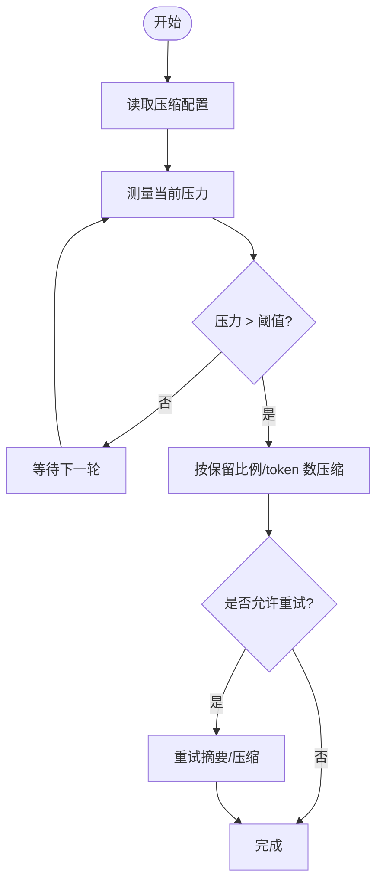
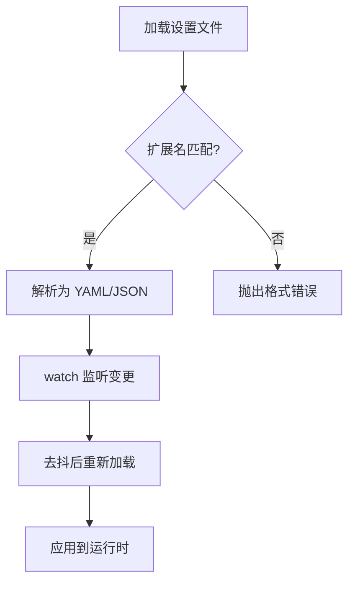
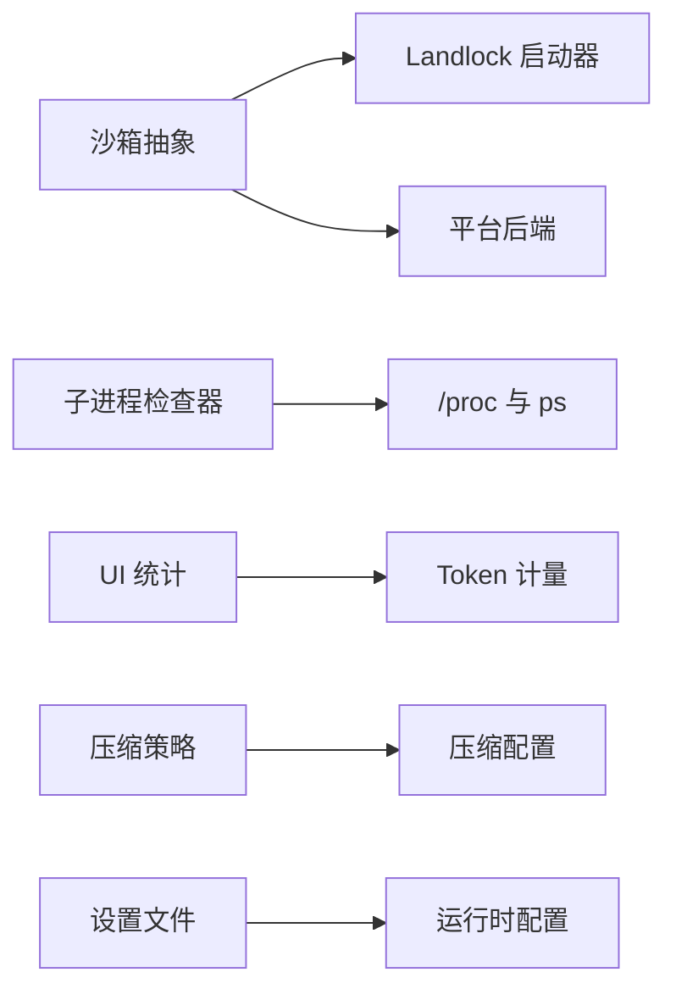

# 资源限制管理

<cite>
**本文引用的文件**
- [native/landlock-run/packages/entry/src/main.c](file://native/landlock-run/packages/entry/src/main.c)
- [packages/sandbox/sandbox/src/index.ts](file://packages/sandbox/sandbox/src/index.ts)
- [docs/subsystems/sandbox.md](file://docs/subsystems/sandbox.md)
- [packages/subprocess/subprocess-local/src/process-inspector.ts](file://packages/subprocess/subprocess-local/src/process-inspector.ts)
- [packages/client/ui-conversation/src/client/chat/StatsLine.tsx](file://packages/client/ui-conversation/src/client/chat/StatsLine.tsx)
- [packages/client/ui-trajectory/src/client/TrajectoryView.tsx](file://packages/client/ui-trajectory/src/client/TrajectoryView.tsx)
- [packages/compaction/compaction-basic/src/config.ts](file://packages/compaction/compaction-basic/src/config.ts)
- [packages/settings/settings-file/src/index.ts](file://packages/settings/settings-file/src/index.ts)
- [apps/web/tests/complex-history.perf.ts](file://apps/web/tests/complex-history.perf.ts)
</cite>

## 目录
1. [简介](#简介)
2. [项目结构](#项目结构)
3. [核心组件](#核心组件)
4. [架构总览](#架构总览)
5. [详细组件分析](#详细组件分析)
6. [依赖关系分析](#依赖关系分析)
7. [性能考量](#性能考量)
8. [故障诊断指南](#故障诊断指南)
9. [结论](#结论)
10. [附录](#附录)

## 简介
本文件围绕“资源限制管理”展开，聚焦代码库中已实现或可观测的资源控制与治理机制。重点包括：
- 进程级文件系统访问限制（沙箱）：通过平台后端（Linux Landlock、macOS Seatbelt、Windows ACL）对子进程的文件效果进行约束，并以“完全/部分”执行完整性报告给上层。
- 进程生命周期与终止：基于进程组、会话和系统调用状态检测，实现安全的信号发送与回收。
- 资源使用统计与可视化：Token 用量、首字延迟、吞吐等指标在 UI 层聚合展示；浏览器端性能指标用于前端性能分析。
- 配置与动态策略：压缩策略阈值、设置文件监听与热更新，为资源占用（如上下文窗口压力）提供可调参数。
- 告警与自动回收：以“压力阈值 + 保留比例”驱动上下文压缩，避免无界增长。

说明：仓库未直接实现 CPU/内存 cgroups/ulimit 级别的硬限制；但提供了进程隔离、资源使用度量与自适应压缩等关键能力，可作为资源治理的基础。

## 项目结构
与资源限制相关的代码分布在以下模块：
- 沙箱抽象与文档：定义模式、执行策略、执行完整性与失败规则。
- Linux Landlock 启动器：最小化 C 程序，创建并应用 Landlock 规则集，再 exec 目标命令。
- 本地子进程检查器：跨平台读取 /proc、ps 等，判断进程存活、前台进程组、是否阻塞于标准输入等。
- 客户端指标与统计：聚合 token 用量、TTFT、吞吐等，并在界面呈现。
- 压缩策略配置：按模型路由的压力阈值与保留比例，支持 auto 开关。
- 设置文件：支持 YAML/JSON 配置与热观察。
- Web 性能测试：通过 Chrome DevTools Protocol 采集堆、任务耗时等指标。

**图示来源**
- [packages/sandbox/sandbox/src/index.ts:158-176](file://packages/sandbox/sandbox/src/index.ts#L158-L176)
- [native/landlock-run/packages/entry/src/main.c:230-298](file://native/landlock-run/packages/entry/src/main.c#L230-L298)
- [packages/subprocess/subprocess-local/src/process-inspector.ts:273-319](file://packages/subprocess/subprocess-local/src/process-inspector.ts#L273-L319)
- [packages/client/ui-conversation/src/client/chat/StatsLine.tsx:183-213](file://packages/client/ui-conversation/src/client/chat/StatsLine.tsx#L183-L213)
- [packages/client/ui-trajectory/src/client/TrajectoryView.tsx:76-118](file://packages/client/ui-trajectory/src/client/TrajectoryView.tsx#L76-L118)
- [packages/compaction/compaction-basic/src/config.ts:19-72](file://packages/compaction/compaction-basic/src/config.ts#L19-L72)
- [packages/settings/settings-file/src/index.ts:32-67](file://packages/settings/settings-file/src/index.ts#L32-L67)
- [apps/web/tests/complex-history.perf.ts:519-568](file://apps/web/tests/complex-history.perf.ts#L519-L568)

**章节来源**
- [packages/sandbox/sandbox/src/index.ts:1-179](file://packages/sandbox/sandbox/src/index.ts#L1-L179)
- [docs/subsystems/sandbox.md:1-219](file://docs/subsystems/sandbox.md#L1-L219)
- [native/landlock-run/packages/entry/src/main.c:1-299](file://native/landlock-run/packages/entry/src/main.c#L1-L299)
- [packages/subprocess/subprocess-local/src/process-inspector.ts:1-375](file://packages/subprocess/subprocess-local/src/process-inspector.ts#L1-L375)
- [packages/client/ui-conversation/src/client/chat/StatsLine.tsx:183-213](file://packages/client/ui-conversation/src/client/chat/StatsLine.tsx#L183-L213)
- [packages/client/ui-trajectory/src/client/TrajectoryView.tsx:76-118](file://packages/client/ui-trajectory/src/client/TrajectoryView.tsx#L76-L118)
- [packages/compaction/compaction-basic/src/config.ts:1-72](file://packages/compaction/compaction-basic/src/config.ts#L1-L72)
- [packages/settings/settings-file/src/index.ts:32-67](file://packages/settings/settings-file/src/index.ts#L32-L67)
- [apps/web/tests/complex-history.perf.ts:515-568](file://apps/web/tests/complex-history.perf.ts#L515-L568)

## 核心组件
- 沙箱抽象与策略
  - 定义受限模式（只读、工作区写入、危险全访问）、执行策略、执行完整性（full/partial）以及失败分类规则。
  - 提供者必须返回受限制的 argv 或在包装/执行阶段失败关闭，禁止静默放行。
- Linux Landlock 启动器
  - 解析 CLI（--ro/--rw/--probe），创建规则集，设置 no_new_privs，应用限制后 exec 目标命令。
  - 探针输出“完全/部分”执行信息，供上层判定能力边界。
- 子进程检查器
  - 读取 /proc/<pid>/stat、task/<tid>/syscall、mem 等，判断进程组是否有活动成员、是否阻塞于 stdin、构建进程树、安全发送信号。
- 资源使用统计
  - 聚合 token 用量、缓存命中、首字延迟、生成时长与吞吐，并在 UI 行中显示。
- 压缩策略
  - 按模型路由的压力阈值与保留比例，支持自动开关，避免上下文无限增长。
- 设置文件
  - 支持 YAML/JSON 扩展名识别与热观察，默认路径位于 harness home 下。
- Web 性能指标
  - 通过 CDP 获取任务/脚本/布局耗时、节点数、监听器数量、堆大小等，用于前端性能分析。

**章节来源**
- [packages/sandbox/sandbox/src/index.ts:23-116](file://packages/sandbox/sandbox/src/index.ts#L23-L116)
- [native/landlock-run/packages/entry/src/main.c:132-298](file://native/landlock-run/packages/entry/src/main.c#L132-L298)
- [packages/subprocess/subprocess-local/src/process-inspector.ts:27-167](file://packages/subprocess/subprocess-local/src/process-inspector.ts#L27-L167)
- [packages/client/ui-conversation/src/client/chat/StatsLine.tsx:183-213](file://packages/client/ui-conversation/src/client/chat/StatsLine.tsx#L183-L213)
- [packages/client/ui-trajectory/src/client/TrajectoryView.tsx:76-118](file://packages/client/ui-trajectory/src/client/TrajectoryView.tsx#L76-L118)
- [packages/compaction/compaction-basic/src/config.ts:19-72](file://packages/compaction/compaction-basic/src/config.ts#L19-L72)
- [packages/settings/settings-file/src/index.ts:32-67](file://packages/settings/settings-file/src/index.ts#L32-L67)
- [apps/web/tests/complex-history.perf.ts:519-568](file://apps/web/tests/complex-history.perf.ts#L519-L568)

## 架构总览
下图展示了从沙箱策略到具体执行、再到资源监控与压缩的端到端流程。

**图示来源**
- [packages/sandbox/sandbox/src/index.ts:158-176](file://packages/sandbox/sandbox/src/index.ts#L158-L176)
- [native/landlock-run/packages/entry/src/main.c:230-298](file://native/landlock-run/packages/entry/src/main.c#L230-L298)
- [packages/subprocess/subprocess-local/src/process-inspector.ts:273-319](file://packages/subprocess/subprocess-local/src/process-inspector.ts#L273-L319)
- [packages/client/ui-conversation/src/client/chat/StatsLine.tsx:183-213](file://packages/client/ui-conversation/src/client/chat/StatsLine.tsx#L183-L213)
- [packages/compaction/compaction-basic/src/config.ts:19-72](file://packages/compaction/compaction-basic/src/config.ts#L19-L72)

## 详细组件分析

### 沙箱与执行策略
- 模式与完整性
  - 受限模式包含只读与工作区写入；危险全访问不进入沙箱。
  - 执行完整性分为 full/partial，反映当前后端或内核 ABI 能覆盖的范围。
- 失败分类
  - 区分“运行器失败”（尚未执行命令）与“拒绝签名”（被沙箱正确阻止）。
- 提供者契约
  - 必须返回受限制 argv 或失败关闭，不允许静默绕过。

**图示来源**
- [packages/sandbox/sandbox/src/index.ts:74-116](file://packages/sandbox/sandbox/src/index.ts#L74-L116)
- [packages/sandbox/sandbox/src/index.ts:158-176](file://packages/sandbox/sandbox/src/index.ts#L158-L176)

**章节来源**
- [packages/sandbox/sandbox/src/index.ts:23-116](file://packages/sandbox/sandbox/src/index.ts#L23-L116)
- [docs/subsystems/sandbox.md:9-156](file://docs/subsystems/sandbox.md#L9-L156)

### Linux Landlock 启动器
- 功能
  - 解析 --ro/--rw/--probe，创建规则集，设置 no_new_privs，应用限制后 exec 目标命令。
  - 探针输出“完全/部分”执行信息，供上层判定能力边界。
- 错误处理
  - 无法创建规则集或内核不支持时失败关闭，不会执行不受限的命令。
  - 旧 ABI 会输出“部分执行”提示，但仍尽可能限制。

**图示来源**
- [native/landlock-run/packages/entry/src/main.c:132-298](file://native/landlock-run/packages/entry/src/main.c#L132-L298)

**章节来源**
- [native/landlock-run/packages/entry/src/main.c:1-299](file://native/landlock-run/packages/entry/src/main.c#L1-L299)

### 子进程检查器与回收
- 能力
  - 读取 /proc 与 ps，判断进程组是否有活动成员、是否阻塞于 stdin、构建进程树、安全发送信号。
  - 针对 Linux 架构映射不同系统调用号，解析 syscall 参数判断是否等待 stdin。
- 回收策略
  - 先尝试向进程组发送信号，若仍存活则按身份精确杀死，防止 PID 复用导致的误杀。

**图示来源**
- [packages/subprocess/subprocess-local/src/process-inspector.ts:132-167](file://packages/subprocess/subprocess-local/src/process-inspector.ts#L132-L167)
- [packages/subprocess/subprocess-local/src/process-inspector.ts:273-319](file://packages/subprocess/subprocess-local/src/process-inspector.ts#L273-L319)

**章节来源**
- [packages/subprocess/subprocess-local/src/process-inspector.ts:1-375](file://packages/subprocess/subprocess-local/src/process-inspector.ts#L1-L375)

### 资源使用统计与可视化
- Token 用量与缓存命中
  - 聚合输入、输出、推理、缓存读写等字段，计算缓存命中率与总量。
- 首字延迟与吞吐
  - 基于 stepStartTime、firstTokenTime、completedTime 计算 TTFT 与 tok/s。
- 上下文压力
  - 压力值来自最近一次请求的 prompt 侧 token 计数，替换而非累加，避免历史污染。

**图示来源**
- [packages/client/ui-conversation/src/client/chat/StatsLine.tsx:183-213](file://packages/client/ui-conversation/src/client/chat/StatsLine.tsx#L183-L213)
- [packages/client/ui-trajectory/src/client/TrajectoryView.tsx:76-118](file://packages/client/ui-trajectory/src/client/TrajectoryView.tsx#L76-L118)

**章节来源**
- [packages/client/ui-conversation/src/client/chat/StatsLine.tsx:183-213](file://packages/client/ui-conversation/src/client/chat/StatsLine.tsx#L183-L213)
- [packages/client/ui-trajectory/src/client/TrajectoryView.tsx:76-118](file://packages/client/ui-trajectory/src/client/TrajectoryView.tsx#L76-L118)

### 压缩策略与自动回收
- 配置项
  - thresholdRatio：触发压缩的压力阈值比例。
  - retainRatio/retainTokens：保留比例或绝对 token 数。
  - summarizationProvider/model：摘要提供者与模型。
  - maxTokens/compactionRetries/maxOverflowRetries：上限与重试次数。
  - auto：是否启用自动压缩。
- 行为
  - 当压力超过阈值时，按保留策略压缩上下文，避免无界增长。

**图示来源**
- [packages/compaction/compaction-basic/src/config.ts:19-72](file://packages/compaction/compaction-basic/src/config.ts#L19-L72)

**章节来源**
- [packages/compaction/compaction-basic/src/config.ts:1-72](file://packages/compaction/compaction-basic/src/config.ts#L1-L72)

### 配置管理与动态调整
- 设置文件
  - 支持 .yaml/.yml/.json 扩展名识别，默认路径位于 harness home 下。
  - 支持 watch 与 debounceMs，实现配置热更新。
- 沙箱策略
  - 每调用解析策略，支持会话覆盖与部署默认值组合。

**图示来源**
- [packages/settings/settings-file/src/index.ts:32-67](file://packages/settings/settings-file/src/index.ts#L32-L67)

**章节来源**
- [packages/settings/settings-file/src/index.ts:32-67](file://packages/settings/settings-file/src/index.ts#L32-L67)
- [docs/subsystems/sandbox.md:41-94](file://docs/subsystems/sandbox.md#L41-L94)

### Web 性能分析与指标采集
- 通过 CDP 获取任务/脚本/布局耗时、节点数、监听器数量、堆大小等。
- 用于评估页面交互与渲染性能，辅助定位瓶颈。

**章节来源**
- [apps/web/tests/complex-history.perf.ts:515-568](file://apps/web/tests/complex-history.perf.ts#L515-L568)

## 依赖关系分析
- 沙箱抽象依赖平台后端；Linux 场景由 landlock-run 提供最小化执行环境。
- 子进程检查器依赖 /proc 与 ps，屏蔽平台差异。
- UI 统计依赖 token 计量与 timing 数据，形成用户可见的资源使用视图。
- 压缩策略依赖配置与测量结果，驱动上下文回收。
- 设置文件为上述能力提供统一配置源与热更新。

**图示来源**
- [packages/sandbox/sandbox/src/index.ts:158-176](file://packages/sandbox/sandbox/src/index.ts#L158-L176)
- [native/landlock-run/packages/entry/src/main.c:230-298](file://native/landlock-run/packages/entry/src/main.c#L230-L298)
- [packages/subprocess/subprocess-local/src/process-inspector.ts:273-319](file://packages/subprocess/subprocess-local/src/process-inspector.ts#L273-L319)
- [packages/client/ui-conversation/src/client/chat/StatsLine.tsx:183-213](file://packages/client/ui-conversation/src/client/chat/StatsLine.tsx#L183-L213)
- [packages/compaction/compaction-basic/src/config.ts:19-72](file://packages/compaction/compaction-basic/src/config.ts#L19-L72)
- [packages/settings/settings-file/src/index.ts:32-67](file://packages/settings/settings-file/src/index.ts#L32-L67)

**章节来源**
- [packages/sandbox/sandbox/src/index.ts:1-179](file://packages/sandbox/sandbox/src/index.ts#L1-L179)
- [native/landlock-run/packages/entry/src/main.c:1-299](file://native/landlock-run/packages/entry/src/main.c#L1-L299)
- [packages/subprocess/subprocess-local/src/process-inspector.ts:1-375](file://packages/subprocess/subprocess-local/src/process-inspector.ts#L1-L375)
- [packages/client/ui-conversation/src/client/chat/StatsLine.tsx:183-213](file://packages/client/ui-conversation/src/client/chat/StatsLine.tsx#L183-L213)
- [packages/compaction/compaction-basic/src/config.ts:1-72](file://packages/compaction/compaction-basic/src/config.ts#L1-L72)
- [packages/settings/settings-file/src/index.ts:32-67](file://packages/settings/settings-file/src/index.ts#L32-L67)

## 性能考量
- 沙箱开销
  - Landlock 规则集创建与规则添加为 O(n) 路径数；建议最小化 --ro/--rw 列表，仅授予必要路径。
- 子进程检查
  - 遍历 /proc 与 task 目录存在 I/O 成本；应仅在必要时调用，并缓存结果。
- 统计与压缩
  - 统计聚合应在事件边界进行，避免频繁刷新；压缩触发需结合压力阈值与保留比例，减少不必要的摘要调用。
- Web 性能
  - 使用 CDP 指标时应批量采集与去抖，避免阻塞主线程。

[本节为通用指导，不直接分析具体文件]

## 故障诊断指南
- 沙箱不可用
  - 现象：请求受限模式但无可用后端。
  - 处理：安装 bubblewrap、确保 Landlock 内核可用、macOS 使用 sandbox-exec、Windows 确保 ACL runner 可启动；否则降级为危险全访问。
- Landlock 部分执行
  - 现象：旧 ABI 导致部分访问未被治理。
  - 处理：升级内核或接受 partial 报告，避免依赖未治理的访问。
- 子进程未回收
  - 现象：进程组残留或僵尸进程。
  - 处理：使用进程检查器确认存活状态，先向进程组发信号，再按身份精确杀死。
- 压缩未触发
  - 现象：上下文持续增长。
  - 处理：检查压力阈值配置与 auto 开关；确认测量值是否正确上报。
- 设置未生效
  - 现象：配置修改未热更新。
  - 处理：确认扩展名与路径；检查 watch 与 debounceMs；查看日志中的解析错误。

**章节来源**
- [packages/sandbox/sandbox/src/index.ts:118-144](file://packages/sandbox/sandbox/src/index.ts#L118-L144)
- [native/landlock-run/packages/entry/src/main.c:230-298](file://native/landlock-run/packages/entry/src/main.c#L230-L298)
- [packages/subprocess/subprocess-local/src/process-inspector.ts:273-319](file://packages/subprocess/subprocess-local/src/process-inspector.ts#L273-L319)
- [packages/compaction/compaction-basic/src/config.ts:19-72](file://packages/compaction/compaction-basic/src/config.ts#L19-L72)
- [packages/settings/settings-file/src/index.ts:32-67](file://packages/settings/settings-file/src/index.ts#L32-L67)

## 结论
本仓库在资源限制管理方面提供了坚实的进程级隔离与治理能力：
- 通过沙箱抽象与平台后端，实现对子进程文件效果的细粒度控制，并以完整/部分执行报告透明反馈。
- 借助子进程检查器，实现安全的进程发现、状态判断与回收。
- 通过 token 计量与 UI 统计，提供直观的资源使用视图；配合压缩策略，实现上下文自动回收。
- 设置文件与热观察为动态调优提供基础。

对于 CPU/内存的硬性限制（cgroups/ulimit），当前仓库未直接实现；可在部署层结合容器编排与系统工具，与本仓库的沙箱与统计能力协同，形成完整的资源治理闭环。

[本节为总结性内容，不直接分析具体文件]

## 附录
- 术语
  - 沙箱：对子进程文件访问进行限制的执行环境。
  - 执行完整性：后端或内核对承诺的文件效果的实际覆盖程度。
  - 压力阈值：触发上下文压缩的临界点。
  - 保留比例：压缩后保留的上下文比例或 token 数。
- 最佳实践
  - 最小化沙箱授权路径，遵循最小权限原则。
  - 合理设置压缩阈值与保留比例，平衡上下文质量与资源占用。
  - 定期审查设置文件，确保配置与运行环境一致。
  - 在 CI/CD 中集成 Landlock 探针，提前发现内核能力缺失。

[本节为补充信息，不直接分析具体文件]