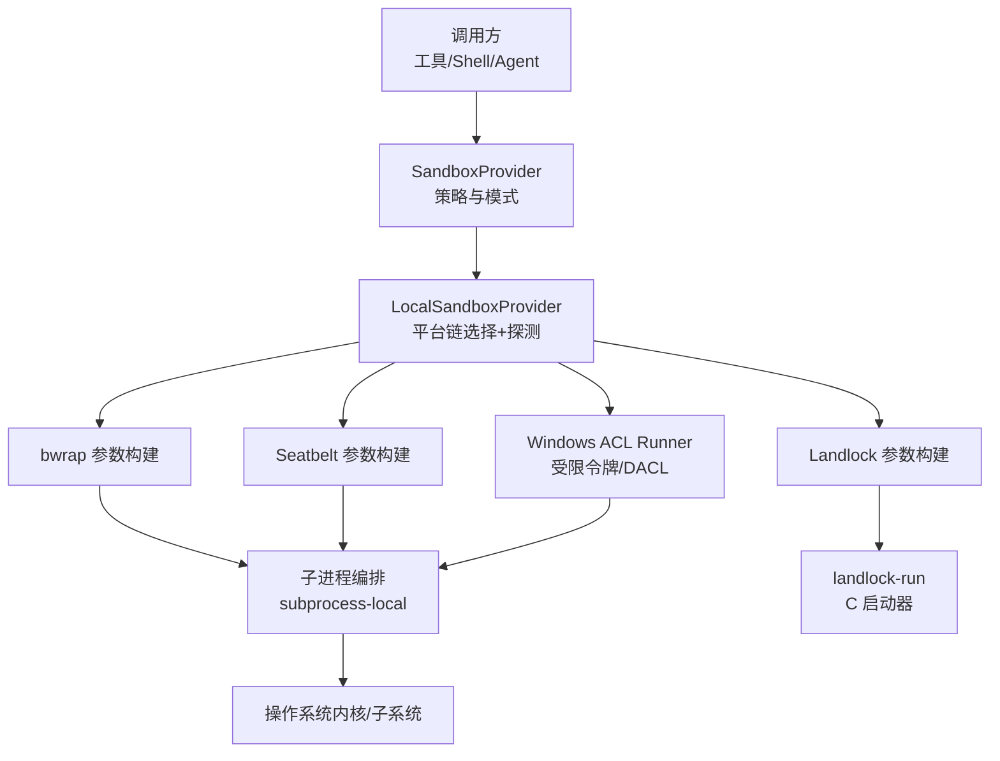
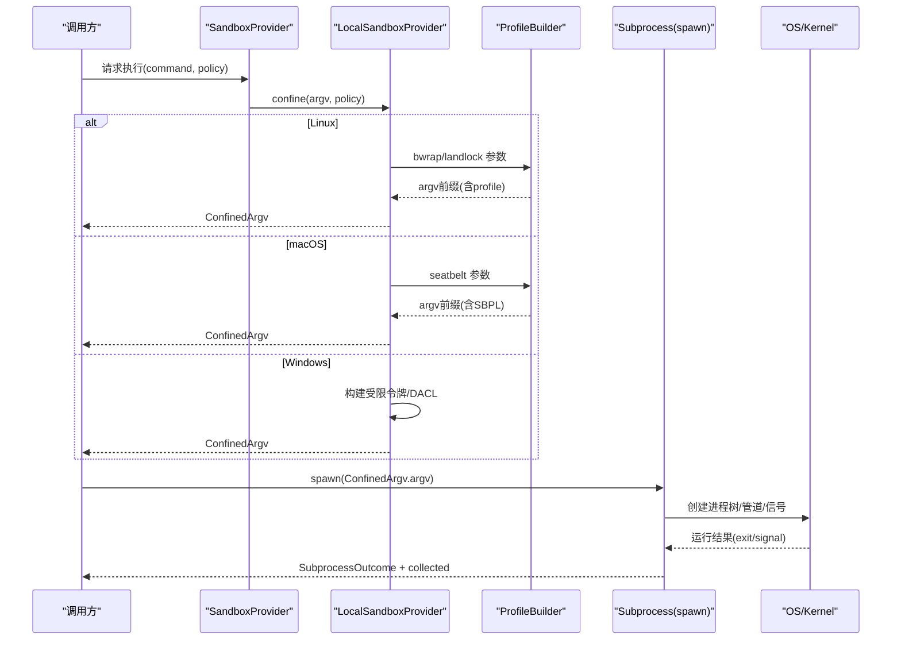
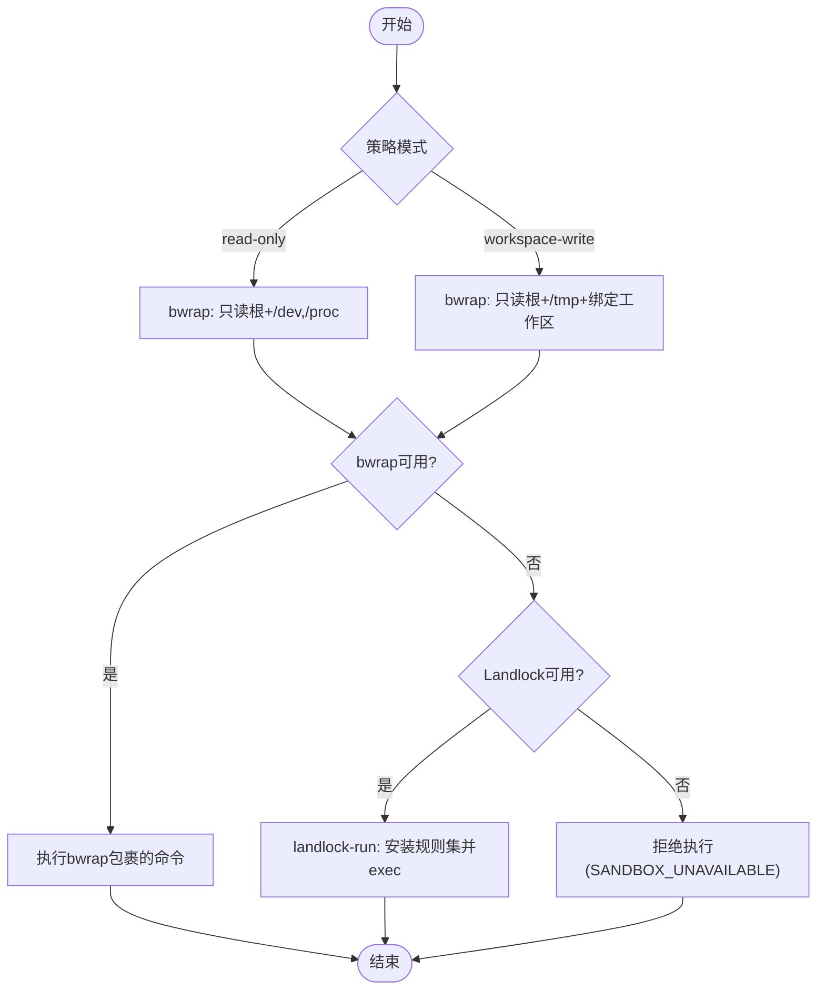
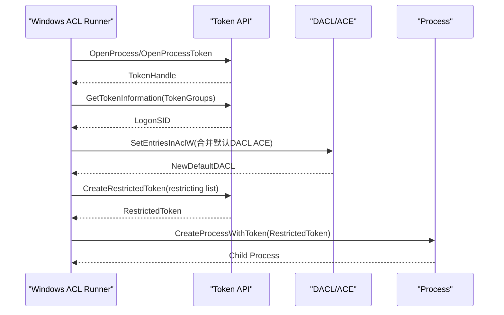
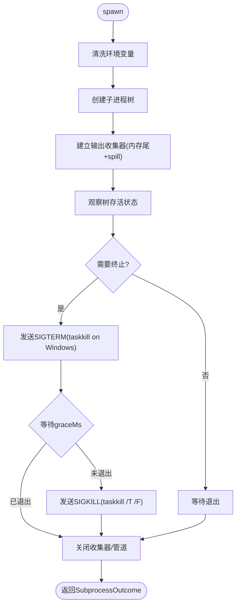
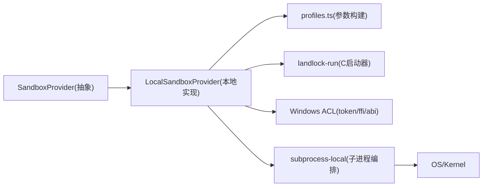

# 进程隔离机制

<cite>
**本文引用的文件**
- [packages/sandbox/sandbox/src/index.ts](file://packages/sandbox/sandbox/src/index.ts)
- [packages/sandbox/sandbox-local/src/index.ts](file://packages/sandbox/sandbox-local/src/index.ts)
- [packages/sandbox/sandbox-local/src/profiles.ts](file://packages/sandbox/sandbox-local/src/profiles.ts)
- [native/landlock-run/packages/entry/src/main.c](file://native/landlock-run/packages/entry/src/main.c)
- [packages/subprocess/subprocess/src/types.ts](file://packages/subprocess/subprocess/src/types.ts)
- [packages/subprocess/subprocess-local/src/spawn.ts](file://packages/subprocess/subprocess-local/src/spawn.ts)
- [packages/sandbox/sandbox-windows-acl/src/token.ts](file://packages/sandbox/sandbox-windows-acl/src/token.ts)
- [packages/sandbox/sandbox-windows-acl/src/ffi.ts](file://packages/sandbox/sandbox-windows-acl/src/ffi.ts)
- [packages/sandbox/sandbox-windows-acl/src/win32-abi.ts](file://packages/sandbox/sandbox-windows-acl/src/win32-abi.ts)
</cite>

## 目录
1. [简介](#简介)
2. [项目结构](#项目结构)
3. [核心组件](#核心组件)
4. [架构总览](#架构总览)
5. [详细组件分析](#详细组件分析)
6. [依赖关系分析](#依赖关系分析)
7. [性能考量](#性能考量)
8. [故障排查指南](#故障排查指南)
9. [结论](#结论)
10. [附录：配置示例与优化建议](#附录配置示例与优化建议)

## 简介
本文件系统性阐述 DeepSeek Harness 中的“进程隔离机制”，覆盖 Linux（bwrap/Landlock）、macOS（Seatbelt）与 Windows（ACL 受限令牌）三大平台。重点说明：
- 进程启动时的权限降级、资源限制与安全上下文切换流程
- 不同平台的策略选择、功能探测与失败关闭策略
- 进程间通信的安全边界与隔离策略
- 生命周期管理、异常处理与调试技巧
- 各平台配置要点与性能优化建议

## 项目结构
围绕进程隔离的关键代码分布在以下模块：
- 沙箱服务抽象与本地实现：定义策略、模式、执行完整性报告，以及按平台选择并封装子进程
- 平台配置文件生成器：为 bwrap、Landlock、Seatbelt 生成各自参数
- Landlock 原生启动器：在 Linux 上以最小 C 程序安装规则集并 exec 目标命令
- 子进程编排：统一的环境清理、输出收集、树级终止与优雅退出
- Windows ACL 受限令牌：通过 Win32 API 创建受限令牌、调整默认 DACL 并派生子进程

图表来源
- [packages/sandbox/sandbox/src/index.ts:152-176](file://packages/sandbox/sandbox/src/index.ts#L152-L176)
- [packages/sandbox/sandbox-local/src/index.ts:159-187](file://packages/sandbox/sandbox-local/src/index.ts#L159-L187)
- [packages/sandbox/sandbox-local/src/profiles.ts:16-58](file://packages/sandbox/sandbox-local/src/profiles.ts#L16-L58)
- [native/landlock-run/packages/entry/src/main.c:13-35](file://native/landlock-run/packages/entry/src/main.c#L13-L35)
- [packages/subprocess/subprocess-local/src/spawn.ts:317-361](file://packages/subprocess/subprocess-local/src/spawn.ts#L317-L361)

章节来源
- [packages/sandbox/sandbox/src/index.ts:23-72](file://packages/sandbox/sandbox/src/index.ts#L23-L72)
- [packages/sandbox/sandbox-local/src/index.ts:1-42](file://packages/sandbox/sandbox-local/src/index.ts#L1-L42)
- [packages/sandbox/sandbox-local/src/profiles.ts:1-59](file://packages/sandbox/sandbox-local/src/profiles.ts#L1-L59)
- [native/landlock-run/packages/entry/src/main.c:1-36](file://native/landlock-run/packages/entry/src/main.c#L1-L36)
- [packages/subprocess/subprocess/src/types.ts:1-104](file://packages/subprocess/subprocess/src/types.ts#L1-L104)

## 核心组件
- 沙箱服务抽象：定义 SandboxMode（read-only/workspace-write/danger-full-access）、SandboxPolicy、ConfinedArgv、RunnerFailureRule 等，提供 confine(argv, policy) 接口
- 本地沙箱提供者：按平台选择 runner 链（Linux: bwrap→Landlock；macOS: Seatbelt；Windows: ACL），进行功能探测并返回受控 argv 及执行完整性
- 平台参数构建器：将策略转换为具体 runner 的参数（bwrap mount、Landlock allow-list、Seatbelt SBPL）
- Landlock 启动器：C 程序，设置 no_new_privs、创建规则集、应用规则后 exec 目标命令，支持 --probe 探测 ABI 能力
- 子进程编排：统一环境清洗、输出收集（内存尾 + spill 文件）、树级终止（POSIX 组信号/Windows taskkill）、SIGTERM→SIGKILL 升级
- Windows ACL 受限令牌：打开当前进程令牌、提取 logon SID、构造 restricting list、合并默认 DACL ACE、创建受限令牌并派生子进程

章节来源
- [packages/sandbox/sandbox/src/index.ts:23-176](file://packages/sandbox/sandbox/src/index.ts#L23-L176)
- [packages/sandbox/sandbox-local/src/index.ts:250-344](file://packages/sandbox/sandbox-local/src/index.ts#L250-L344)
- [packages/sandbox/sandbox-local/src/profiles.ts:16-58](file://packages/sandbox/sandbox-local/src/profiles.ts#L16-L58)
- [native/landlock-run/packages/entry/src/main.c:220-299](file://native/landlock-run/packages/entry/src/main.c#L220-L299)
- [packages/subprocess/subprocess-local/src/spawn.ts:326-544](file://packages/subprocess/subprocess-local/src/spawn.ts#L326-L544)
- [packages/sandbox/sandbox-windows-acl/src/token.ts:15-223](file://packages/sandbox/sandbox-windows-acl/src/token.ts#L15-L223)

## 架构总览
下图展示从调用方到内核的完整隔离路径，包括策略解析、runner 选择、参数构建、子进程编排与平台安全子系统交互。

图表来源
- [packages/sandbox/sandbox/src/index.ts:152-176](file://packages/sandbox/sandbox/src/index.ts#L152-L176)
- [packages/sandbox/sandbox-local/src/index.ts:316-344](file://packages/sandbox/sandbox-local/src/index.ts#L316-L344)
- [packages/sandbox/sandbox-local/src/profiles.ts:16-58](file://packages/sandbox/sandbox-local/src/profiles.ts#L16-L58)
- [packages/subprocess/subprocess-local/src/spawn.ts:326-361](file://packages/subprocess/subprocess-local/src/spawn.ts#L326-L361)

## 详细组件分析

### Linux：bwrap 与 Landlock
- 策略映射
  - read-only：bwrap 使用只读根绑定与 /dev、/proc 挂载；Landlock 仅授予读/执行与 /dev/null 写
  - workspace-write：bwrap 额外挂载临时 /tmp 并绑定工作区；Landlock 增加 /tmp 与工作区写入
- 功能探测
  - bwrap：尝试以只读模式运行一个无害命令，成功即认为可用
  - Landlock：调用原生 landlock-run 的 --probe，根据内核 ABI 能力判断 full/partial
- 执行流程
  - 若 bwrap 不可用则回退至 Landlock；两者均失败则拒绝执行（fail-closed）
  - Landlock 启动器设置 no_new_privs、创建规则集、应用规则后 exec 目标命令
- 错误诊断
  - 不同 runner 的 denial signatures 与 runner failure rules 用于区分“被沙箱拒绝”和“runner 自身失败”

图表来源
- [packages/sandbox/sandbox-local/src/profiles.ts:16-36](file://packages/sandbox/sandbox-local/src/profiles.ts#L16-L36)
- [packages/sandbox/sandbox-local/src/index.ts:67-91](file://packages/sandbox/sandbox-local/src/index.ts#L67-L91)
- [native/landlock-run/packages/entry/src/main.c:220-299](file://native/landlock-run/packages/entry/src/main.c#L220-L299)

章节来源
- [packages/sandbox/sandbox-local/src/profiles.ts:16-36](file://packages/sandbox/sandbox-local/src/profiles.ts#L16-L36)
- [packages/sandbox/sandbox-local/src/index.ts:67-112](file://packages/sandbox/sandbox-local/src/index.ts#L67-L112)
- [native/landlock-run/packages/entry/src/main.c:13-35](file://native/landlock-run/packages/entry/src/main.c#L13-L35)
- [native/landlock-run/packages/entry/src/main.c:220-299](file://native/landlock-run/packages/entry/src/main.c#L220-L299)

### macOS：Seatbelt
- 策略映射
  - read-only：使用 deny file-write* 并允许 /dev/null 写入
  - workspace-write：基于 writableRoots 动态追加可写子路径
- 功能探测
  - 通过 sandbox-exec 应用 read-only 配置文件并运行 true，成功即认为可用
- 执行流程
  - 直接选择 Seatbelt（darwin 链唯一候选），失败时 fail-closed
- 错误诊断
  - 使用 Seatbelt 专属 denial signature 识别内核拒绝行为

章节来源
- [packages/sandbox/sandbox-local/src/profiles.ts:38-58](file://packages/sandbox/sandbox-local/src/profiles.ts#L38-L58)
- [packages/sandbox/sandbox-local/src/index.ts:76-91](file://packages/sandbox/sandbox-local/src/index.ts#L76-L91)
- [packages/sandbox/sandbox-local/src/index.ts:159-166](file://packages/sandbox/sandbox-local/src/index.ts#L159-L166)

### Windows：ACL 受限令牌
- 策略映射
  - read-only：restricting list 包含 logon SID 与 Everyone，禁止写操作
  - workspace-write：restricting list 加入工作区 SID 与可选临时目录 SID，允许受限写
- 关键步骤
  - 打开当前进程令牌，提取 logon SID
  - 合并默认 DACL ACE，确保新对象创建可通过 pass-2 检查
  - 创建受限令牌（WRITE_RESTRICTED），派生子进程
- 安全边界
  - 由于 Everyone 必须存在于 restricting list 中，存在 NTFS 硬链接别名等已知边界，因此声明为 partial enforcement
- 错误诊断
  - 通过 Win32 错误码与格式化消息定位失败点

图表来源
- [packages/sandbox/sandbox-windows-acl/src/token.ts:23-42](file://packages/sandbox/sandbox-windows-acl/src/token.ts#L23-L42)
- [packages/sandbox/sandbox-windows-acl/src/token.ts:112-145](file://packages/sandbox/sandbox-windows-acl/src/token.ts#L112-L145)
- [packages/sandbox/sandbox-windows-acl/src/token.ts:195-223](file://packages/sandbox/sandbox-windows-acl/src/token.ts#L195-L223)
- [packages/sandbox/sandbox-windows-acl/src/ffi.ts:434-468](file://packages/sandbox/sandbox-windows-acl/src/ffi.ts#L434-L468)

章节来源
- [packages/sandbox/sandbox-windows-acl/src/token.ts:15-223](file://packages/sandbox/sandbox-windows-acl/src/token.ts#L15-L223)
- [packages/sandbox/sandbox-windows-acl/src/ffi.ts:59-468](file://packages/sandbox/sandbox-windows-acl/src/ffi.ts#L59-L468)
- [packages/sandbox/sandbox-windows-acl/src/win32-abi.ts:1-26](file://packages/sandbox/sandbox-windows-acl/src/win32-abi.ts#L1-L26)

### 子进程编排与生命周期管理
- 环境清理
  - 子进程环境基于 scrubbedParentEnv，过滤敏感键，Windows 下大小写不敏感合并
- 输出收集
  - 内存尾部保留 + spill 文件兜底，支持增量读取与丢失标记
- 树级终止
  - POSIX：向负进程组发送 SIGTERM，graceMs 后升级为 SIGKILL；Windows：taskkill /T /F
- 生命周期
  - 监听 exit/close，延迟关闭收集流，保证管道释放与结果稳定
- 安全边界
  - 子进程继承父进程句柄时需考虑存活后代对输出的持有，grace 期保障回收

图表来源
- [packages/subprocess/subprocess-local/src/spawn.ts:326-361](file://packages/subprocess/subprocess-local/src/spawn.ts#L326-L361)
- [packages/subprocess/subprocess-local/src/spawn.ts:439-457](file://packages/subprocess/subprocess-local/src/spawn.ts#L439-L457)
- [packages/subprocess/subprocess-local/src/spawn.ts:470-505](file://packages/subprocess/subprocess-local/src/spawn.ts#L470-L505)
- [packages/subprocess/subprocess/src/types.ts:75-118](file://packages/subprocess/subprocess/src/types.ts#L75-L118)

章节来源
- [packages/subprocess/subprocess-local/src/spawn.ts:30-47](file://packages/subprocess/subprocess-local/src/spawn.ts#L30-L47)
- [packages/subprocess/subprocess-local/src/spawn.ts:104-251](file://packages/subprocess/subprocess-local/src/spawn.ts#L104-L251)
- [packages/subprocess/subprocess-local/src/spawn.ts:253-315](file://packages/subprocess/subprocess-local/src/spawn.ts#L253-L315)
- [packages/subprocess/subprocess/src/types.ts:75-194](file://packages/subprocess/subprocess/src/types.ts#L75-L194)

## 依赖关系分析
- 沙箱抽象层与本地实现解耦：上层仅依赖 SandboxProvider 接口，本地实现负责平台差异
- 平台参数构建器独立：profiles.ts 集中生成各 runner 参数，便于测试与维护
- Landlock 启动器作为最小可信面：纯 C 实现，避免运行时库依赖，降低攻击面
- Windows ACL 通过 FFI 绑定 Win32 API：ABI 常量与结构体由验证脚本保证一致性
- 子进程编排与沙箱解耦：confine 返回 argv，实际 spawn 由 subprocess-local 统一处理

图表来源
- [packages/sandbox/sandbox/src/index.ts:152-176](file://packages/sandbox/sandbox/src/index.ts#L152-L176)
- [packages/sandbox/sandbox-local/src/index.ts:316-344](file://packages/sandbox/sandbox-local/src/index.ts#L316-L344)
- [packages/sandbox/sandbox-local/src/profiles.ts:16-58](file://packages/sandbox/sandbox-local/src/profiles.ts#L16-L58)
- [native/landlock-run/packages/entry/src/main.c:220-299](file://native/landlock-run/packages/entry/src/main.c#L220-L299)
- [packages/sandbox/sandbox-windows-acl/src/token.ts:195-223](file://packages/sandbox/sandbox-windows-acl/src/token.ts#L195-L223)
- [packages/subprocess/subprocess-local/src/spawn.ts:326-361](file://packages/subprocess/subprocess-local/src/spawn.ts#L326-L361)

章节来源
- [packages/sandbox/sandbox/src/index.ts:23-176](file://packages/sandbox/sandbox/src/index.ts#L23-L176)
- [packages/sandbox/sandbox-local/src/index.ts:159-187](file://packages/sandbox/sandbox-local/src/index.ts#L159-L187)
- [packages/sandbox/sandbox-windows-acl/src/ffi.ts:434-468](file://packages/sandbox/sandbox-windows-acl/src/ffi.ts#L434-L468)

## 性能考量
- 平台选择与探测缓存
  - 首次 confine 时完成 runner 链探测与选择，后续复用结果，减少重复开销
- Landlock ABI 协商
  - 根据内核 ABI 能力裁剪规则集，避免不必要系统调用，提升兼容性
- 输出收集策略
  - 内存尾 + spill 文件平衡内存占用与可恢复性；溢出时自动丢弃头部，保持尾部完整
- 终止效率
  - POSIX 组信号一次广播，Windows taskkill 树级终止，grace 期短且幂等
- Windows ACL
  - 工作区 ACE 跨会话复用，减少重复传播；临时目录 SID 一次性分配并在 dispose 时撤销

[本节为通用指导，无需特定文件引用]

## 故障排查指南
- 常见失败分类
  - 沙箱不可用：无可用 runner（bwrap 缺失、Landlock 不支持、Seatbelt 不可用、Windows ACL 受限令牌创建失败）
  - Runner 失败：runner 自身错误（如 landlock-run 无法创建规则集、sandbox-exec 拒绝配置）
  - 命令被拒绝：子进程因策略被内核/子系统拒绝（不同平台 denial signatures 不同）
- 诊断要点
  - 检查 ConfinedArgv.enforcement 与 denialSignatures，确认当前后端与拒绝语义
  - 关注 runnerFailureRules 中的 allowedExitCodes 与 fatalSignatures，区分 runner 失败与命令失败
  - Windows：通过 FormatMessageW 获取详细错误信息，定位具体 API 失败点
- 调试技巧
  - 使用 --probe 验证 Landlock 能力
  - 在开发环境注入 fake runner/executable，模拟失败路径
  - 启用 spill 文件查看完整输出，结合 lossy 标志判断是否截断

章节来源
- [packages/sandbox/sandbox/src/index.ts:74-116](file://packages/sandbox/sandbox/src/index.ts#L74-L116)
- [packages/sandbox/sandbox-local/src/index.ts:200-240](file://packages/sandbox/sandbox-local/src/index.ts#L200-L240)
- [packages/sandbox/sandbox-windows-acl/src/ffi.ts:454-468](file://packages/sandbox/sandbox-windows-acl/src/ffi.ts#L454-L468)
- [native/landlock-run/packages/entry/src/main.c:117-130](file://native/landlock-run/packages/entry/src/main.c#L117-L130)

## 结论
该进程隔离机制通过统一的策略抽象与平台适配，实现了跨 Linux/macOS/Windows 的一致安全边界。其核心优势包括：
- 明确的分层设计：策略定义、平台参数构建、子进程编排相互解耦
- 健壮的功能探测与失败关闭：确保不会在无保护情况下执行命令
- 细粒度的错误分类：区分 runner 失败、命令被拒与沙箱不可用
- 可扩展的平台支持：新增平台只需实现参数构建与受限令牌逻辑

[本节为总结，无需特定文件引用]

## 附录：配置示例与优化建议
- Linux
  - 优先使用 bwrap；若不可用则回退 Landlock
  - 合理设置 probeTimeoutMs，避免长时间阻塞
  - 对于旧内核，接受 partial enforcement 并评估风险
- macOS
  - 确保 sandbox-exec 可用；注意 Apple 已标记 CLI 弃用但仍在分发
  - 使用 writableRoots 精确控制可写范围
- Windows
  - 使用受限令牌与默认 DACL 合并，确保新对象创建不受限
  - 注意 Everyone 在 restricting list 中的影响与 NTFS 硬链接边界
  - 利用临时目录 SID 隔离会话临时数据，并在 dispose 时撤销
- 子进程
  - 合理配置 graceMs，兼顾快速回收与优雅退出
  - 使用 spill 文件捕获完整输出，避免长输出导致内存膨胀

[本节为通用指导，无需特定文件引用]