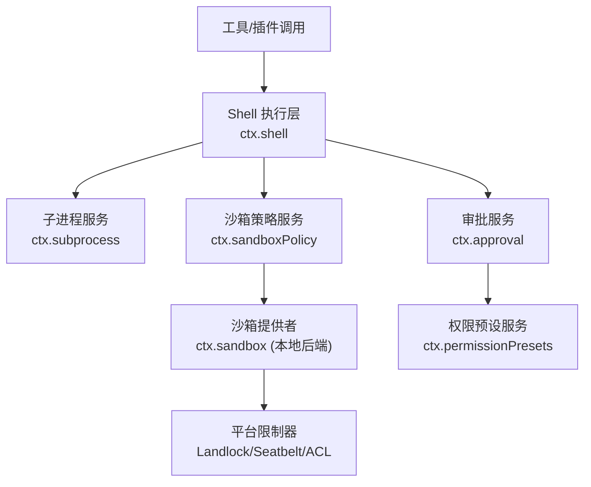
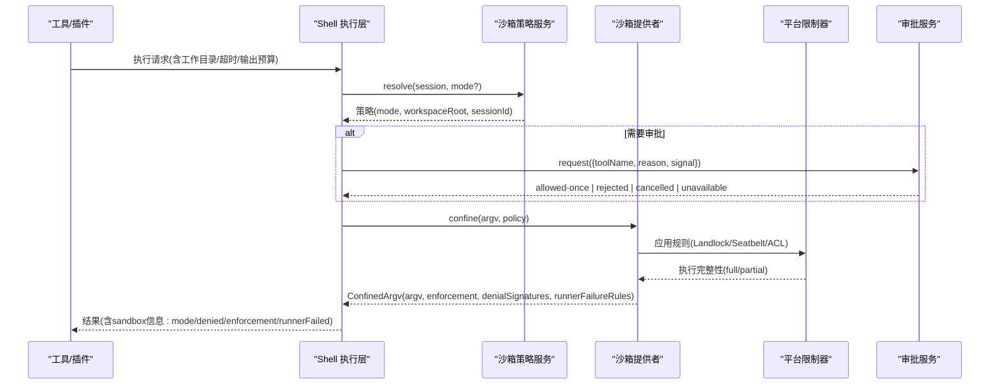
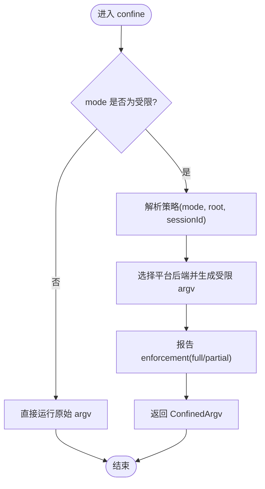
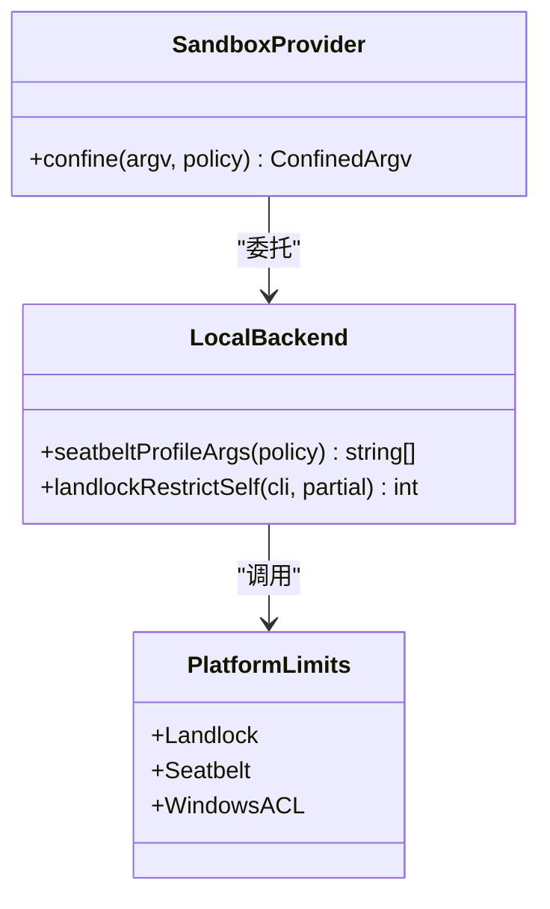
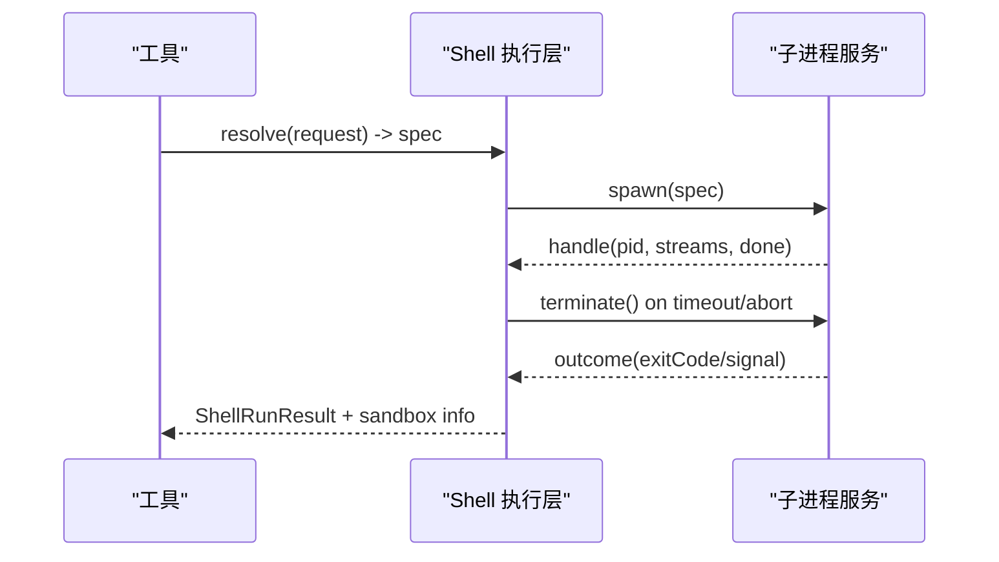
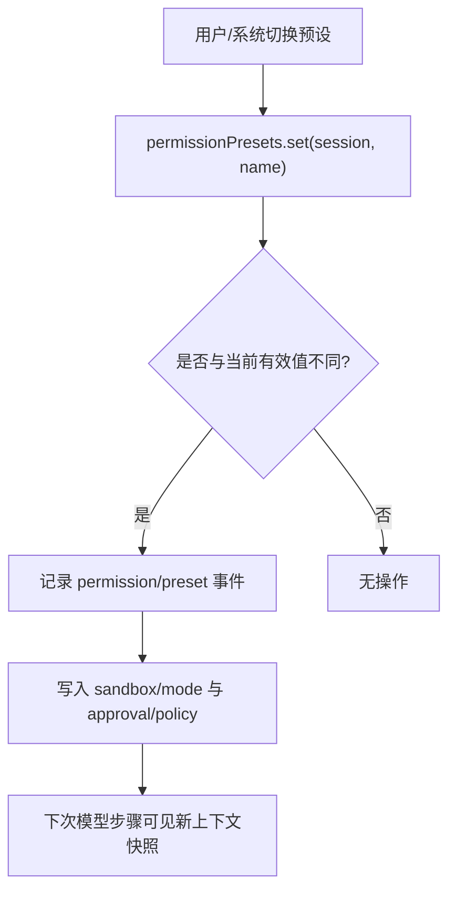
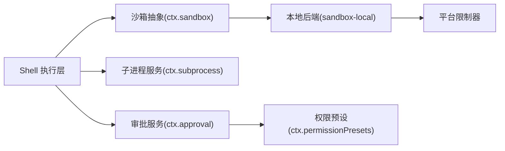

# 安全边界实现

<cite>
**本文引用的文件**
- [docs/subsystems/sandbox.md](file://docs/subsystems/sandbox.md)
- [docs/subsystems/permission-presets.md](file://docs/subsystems/permission-presets.md)
- [docs/subsystems/approval.md](file://docs/subsystems/approval.md)
- [docs/subsystems/shell.md](file://docs/subsystems/shell.md)
- [docs/subsystems/subprocess.md](file://docs/subsystems/subprocess.md)
- [packages/sandbox/sandbox/src/index.ts](file://packages/sandbox/sandbox/src/index.ts)
- [packages/sandbox/sandbox-policy/src/index.ts](file://packages/sandbox/sandbox-policy/src/index.ts)
- [packages/sandbox/sandbox-local/src/profiles.ts](file://packages/sandbox/sandbox-local/src/profiles.ts)
- [native/landlock-run/packages/entry/src/main.c](file://native/landlock-run/packages/entry/src/main.c)
- [packages/shell/bash-local/src/index.ts](file://packages/shell/bash-local/src/index.ts)
- [packages/extensions/cordis-client-runner/src/client/runtime.ts](file://packages/extensions/cordis-client-runner/src/client/runtime.ts)
</cite>

## 目录
1. [简介](#简介)
2. [项目结构](#项目结构)
3. [核心组件](#核心组件)
4. [架构总览](#架构总览)
5. [详细组件分析](#详细组件分析)
6. [依赖关系分析](#依赖关系分析)
7. [性能与资源限制](#性能与资源限制)
8. [故障排查指南](#故障排查指南)
9. [结论](#结论)
10. [附录：配置示例与最佳实践](#附录配置示例与最佳实践)

## 简介
本文件聚焦能力接缝系统中的“安全边界”实现，覆盖插件架构中的安全模型设计、进程级隔离、文件系统访问控制、网络请求限制、权限策略的制定与执行、沙箱环境的配置与管理（资源/时间/内存限制）、安全审计日志记录与分析方法，以及常见安全问题与最佳实践。文档以代码级事实为依据，结合子系统文档与关键源码路径进行说明，帮助读者在不深入源码的情况下理解整体设计与落地方式。

## 项目结构
安全边界由多个子系统协同完成：
- 进程沙箱能力家族：定义抽象服务、策略解析与本地平台后端，负责将受控命令封装为受限执行环境。
- Shell 执行层：在工具调用中注入沙箱策略，统一输出与超时/终止语义。
- 子进程服务：提供跨平台的进程管理、环境变量清洗、输出收集与树级终止。
- 审批与权限预设：将“沙箱模式 + 审批策略”打包为用户可切换的预设，并持久化审计事件。
- 内核/系统级限制：Linux Landlock、macOS Seatbelt、Windows ACL 受限令牌等。

图表来源
- [docs/subsystems/shell.md:1-100](file://docs/subsystems/shell.md#L1-L100)
- [docs/subsystems/subprocess.md:1-120](file://docs/subsystems/subprocess.md#L1-L120)
- [docs/subsystems/sandbox.md:1-120](file://docs/subsystems/sandbox.md#L1-L120)
- [docs/subsystems/permission-presets.md:1-70](file://docs/subsystems/permission-presets.md#L1-L70)
- [docs/subsystems/approval.md:1-100](file://docs/subsystems/approval.md#L1-L100)

章节来源
- [docs/subsystems/sandbox.md:1-120](file://docs/subsystems/sandbox.md#L1-L120)
- [docs/subsystems/shell.md:1-120](file://docs/subsystems/shell.md#L1-L120)
- [docs/subsystems/subprocess.md:1-120](file://docs/subsystems/subprocess.md#L1-L120)
- [docs/subsystems/permission-presets.md:1-70](file://docs/subsystems/permission-presets.md#L1-L70)
- [docs/subsystems/approval.md:1-100](file://docs/subsystems/approval.md#L1-L100)

## 核心组件
- 进程沙箱抽象与策略
  - 抽象服务 ctx.sandbox：对 argv 进行受限包装，返回受控 argv 及执行完整性报告；失败时关闭（fail-closed）。
  - 策略服务 ctx.sandboxPolicy：按会话与部署默认值解析每调用策略，包含 mode、workspaceRoot、sessionId。
  - 本地后端：Linux bwrap/Landlock、macOS Seatbelt、Windows ACL 受限令牌。
- Shell 执行层
  - 将沙箱策略注入到每次 shell 执行；报告 denied/enforcement/runnerFailed。
- 子进程服务
  - 提供 spawn、terminate、collect 输出、环境变量清洗、树级终止。
- 审批与权限预设
  - 审批服务 ctx.approval：ask/never 策略，审计事件成对记录。
  - 权限预设：将 sandbox/mode 与 approval/policy 组合为可切换预设，持久化 permission/preset。

章节来源
- [docs/subsystems/sandbox.md:10-120](file://docs/subsystems/sandbox.md#L10-L120)
- [docs/subsystems/shell.md:140-170](file://docs/subsystems/shell.md#L140-L170)
- [docs/subsystems/subprocess.md:130-250](file://docs/subsystems/subprocess.md#L130-L250)
- [docs/subsystems/permission-presets.md:1-70](file://docs/subsystems/permission-presets.md#L1-L70)
- [docs/subsystems/approval.md:1-100](file://docs/subsystems/approval.md#L1-L100)

## 架构总览
下图展示了从工具调用到内核限制的完整链路，包括策略解析、审批、沙箱包装与平台限制。

图表来源
- [docs/subsystems/shell.md:140-170](file://docs/subsystems/shell.md#L140-L170)
- [docs/subsystems/sandbox.md:150-219](file://docs/subsystems/sandbox.md#L150-L219)
- [docs/subsystems/approval.md:100-171](file://docs/subsystems/approval.md#L100-L171)

## 详细组件分析

### 进程沙箱与策略解析
- 模式与执行完整性
  - 模式：read-only、workspace-write、danger-full-access。仅前两种可发送给提供者；danger-full-access 直接绕过限制。
  - 执行完整性：full/partial，用于告知上层是否实现了承诺的全部文件效果。
- 每调用策略
  - 包含 mode、workspaceRoot、sessionId；resolve 接受 session 与可选的显式 mode 覆盖。
- 抽象接口
  - ctx.sandbox.confine(argv, policy) 返回 ConfinedArgv 或抛出不可用错误；禁止静默放行。
  - ctx.sandboxPolicy.resolve() 解析最终策略；overrideOf() 读取会话覆盖。

图表来源
- [docs/subsystems/sandbox.md:10-120](file://docs/subsystems/sandbox.md#L10-L120)
- [packages/sandbox/sandbox/src/index.ts:158-185](file://packages/sandbox/sandbox/src/index.ts#L158-L185)
- [packages/sandbox/sandbox-policy/src/index.ts:91-213](file://packages/sandbox/sandbox-policy/src/index.ts#L91-L213)

章节来源
- [docs/subsystems/sandbox.md:10-120](file://docs/subsystems/sandbox.md#L10-L120)
- [packages/sandbox/sandbox/src/index.ts:158-185](file://packages/sandbox/sandbox/src/index.ts#L158-L185)
- [packages/sandbox/sandbox-policy/src/index.ts:91-213](file://packages/sandbox/sandbox-policy/src/index.ts#L91-L213)

### 平台限制器：Linux Landlock、macOS Seatbelt、Windows ACL
- Linux Landlock
  - 通过 landlock 系统调用创建规则集，设置 no_new_privs，限制读写/执行路径；ABI 降级协商并报告 partial。
- macOS Seatbelt
  - 使用 SBPL 配置文件，默认 deny file-write*，按需允许特定根目录（如 /dev/null、工作区根）。
- Windows ACL
  - 使用受限令牌与工作区 SID，报告部分执行完整性（Everyone/hard-link 边界）。

图表来源
- [packages/sandbox/sandbox-local/src/profiles.ts:38-58](file://packages/sandbox/sandbox-local/src/profiles.ts#L38-L58)
- [native/landlock-run/packages/entry/src/main.c:220-267](file://native/landlock-run/packages/entry/src/main.c#L220-L267)
- [docs/subsystems/sandbox.md:150-219](file://docs/subsystems/sandbox.md#L150-L219)

章节来源
- [packages/sandbox/sandbox-local/src/profiles.ts:38-58](file://packages/sandbox/sandbox-local/src/profiles.ts#L38-L58)
- [native/landlock-run/packages/entry/src/main.c:220-267](file://native/landlock-run/packages/entry/src/main.c#L220-L267)
- [docs/subsystems/sandbox.md:150-219](file://docs/subsystems/sandbox.md#L150-L219)

### Shell 执行层与子进程管理
- Shell 执行层
  - 将策略注入到每次执行；结果中包含 sandbox 信息（mode、denied、enforcement、runnerFailed）。
  - 支持前台 run 与后台 start；输出收集与溢出回退至 spill 文件。
- 子进程服务
  - 提供 spawn、terminate（SIGTERM→grace→SIGKILL 升级）、waitForExit；环境变量清洗（DSH_* 命名空间）；输出收集（截断提示与 spill 路径）。

图表来源
- [docs/subsystems/shell.md:105-170](file://docs/subsystems/shell.md#L105-L170)
- [docs/subsystems/subprocess.md:130-250](file://docs/subsystems/subprocess.md#L130-L250)

章节来源
- [docs/subsystems/shell.md:105-170](file://docs/subsystems/shell.md#L105-L170)
- [docs/subsystems/subprocess.md:130-250](file://docs/subsystems/subprocess.md#L130-L250)

### 审批与权限预设
- 审批服务
  - ask/never 策略；每次 ask 成对记录审计事件（approval/asked 与 approval/decided）；未打开轮次或审计写入失败则拒绝。
- 权限预设
  - 将 sandbox/mode 与 approval/policy 组合为预设；current() 基于当前旋钮状态推导；set() 写入变更并记录 permission/preset 事件。

图表来源
- [docs/subsystems/permission-presets.md:44-70](file://docs/subsystems/permission-presets.md#L44-L70)
- [docs/subsystems/approval.md:100-171](file://docs/subsystems/approval.md#L100-L171)

章节来源
- [docs/subsystems/permission-presets.md:44-70](file://docs/subsystems/permission-presets.md#L44-L70)
- [docs/subsystems/approval.md:100-171](file://docs/subsystems/approval.md#L100-L171)

### 插件架构中的安全模型
- 插件上下文保护
  - 动态加载插件时，apply 接收的是被守卫的上下文，确保插件无法越权访问宿主服务；违规上报 guard failure。
- 能力边界
  - 沙箱、审批、权限行是明确边界；预设不能自行放宽自身限制，否则破坏隔离。

章节来源
- [packages/extensions/cordis-client-runner/src/client/runtime.ts:402-437](file://packages/extensions/cordis-client-runner/src/client/runtime.ts#L402-L437)
- [docs/subsystems/permission-presets.md:44-70](file://docs/subsystems/permission-presets.md#L44-L70)

## 依赖关系分析
- 松耦合与职责分离
  - Shell 不关心具体平台限制，只消费策略与结果；子进程服务专注进程生命周期与环境；沙箱提供者聚合平台后端；审批与预设独立于执行路径。
- 外部依赖
  - 平台限制器依赖内核/系统能力（Landlock ABI、Seatbelt、ACL）；若不可用则 fail-closed。
- 潜在循环依赖
  - 通过抽象服务与事件解耦，避免循环；策略与服务注册在启动阶段完成。

图表来源
- [docs/subsystems/shell.md:1-120](file://docs/subsystems/shell.md#L1-L120)
- [docs/subsystems/sandbox.md:1-120](file://docs/subsystems/sandbox.md#L1-L120)
- [docs/subsystems/approval.md:1-100](file://docs/subsystems/approval.md#L1-L100)

章节来源
- [docs/subsystems/shell.md:1-120](file://docs/subsystems/shell.md#L1-L120)
- [docs/subsystems/sandbox.md:1-120](file://docs/subsystems/sandbox.md#L1-L120)
- [docs/subsystems/approval.md:1-100](file://docs/subsystems/approval.md#L1-L100)

## 性能与资源限制
- 时间限制
  - Shell 执行层支持 timeoutMs 与 graceMs；子进程服务在终止时采用 SIGTERM→grace→SIGKILL 升级，确保进程树清理。
- 内存与输出限制
  - 输出收集支持 maxBytes，溢出时保留尾部并落盘 spill 文件；代码运行时也支持内存上限与输出上限。
- 资源限制建议
  - 合理设置 timeoutMs、maxOutputBytes、maxSpillBytes；对长时间任务使用后台进程并监控 done。

章节来源
- [docs/subsystems/shell.md:105-170](file://docs/subsystems/shell.md#L105-L170)
- [docs/subsystems/subprocess.md:130-250](file://docs/subsystems/subprocess.md#L130-L250)
- [packages/shell/bash-local/src/index.ts:75-103](file://packages/shell/bash-local/src/index.ts#L75-L103)

## 故障排查指南
- 沙箱不可用
  - 当受限模式无可用后端时，ctx.sandbox 抛出 SANDBOX_UNAVAILABLE；前台执行会立即失败，后台作业记录 runnerFailed。
- 部分执行完整性
  - 旧版 Landlock ABI 或 Windows ACL 边界导致 partial；要求绝对边界的调用应拒绝或上报。
- 审批失败
  - 未打开轮次或审计写入失败会导致拒绝；检查会话状态与持久化可用性。
- 输出溢出
  - 检查 CollectedOutput.truncated 与 spillPath；必要时调整 maxBytes 或启用 spill。

章节来源
- [docs/subsystems/sandbox.md:150-219](file://docs/subsystems/sandbox.md#L150-L219)
- [docs/subsystems/shell.md:140-170](file://docs/subsystems/shell.md#L140-L170)
- [docs/subsystems/approval.md:100-171](file://docs/subsystems/approval.md#L100-L171)

## 结论
该能力接缝系统通过“策略解析—审批—沙箱包装—平台限制”的分层设计，实现了进程级隔离、文件系统访问控制与严格的失败关闭策略。Shell 与子进程服务提供统一的执行与资源管理语义；审批与权限预设将安全策略产品化，便于用户可控切换与审计追踪。平台后端适配多操作系统，保证在不同环境下的一致安全语义。

## 附录：配置示例与最佳实践

- 安全配置示例（路径参考）
  - 沙箱模式与策略解析：[docs/subsystems/sandbox.md:10-120](file://docs/subsystems/sandbox.md#L10-L120)
  - 权限预设表与默认值：[docs/subsystems/permission-presets.md:9-43](file://docs/subsystems/permission-presets.md#L9-L43)
  - 审批策略与审计事件：[docs/subsystems/approval.md:31-89](file://docs/subsystems/approval.md#L31-L89)
  - Shell 执行参数与输出限制：[docs/subsystems/shell.md:17-99](file://docs/subsystems/shell.md#L17-L99)
  - 子进程环境与输出收集：[docs/subsystems/subprocess.md:13-88](file://docs/subsystems/subprocess.md#L13-L88)

- 权限控制代码（路径参考）
  - 沙箱抽象与 confine：[packages/sandbox/sandbox/src/index.ts:158-185](file://packages/sandbox/sandbox/src/index.ts#L158-L185)
  - 策略解析与覆盖：[packages/sandbox/sandbox-policy/src/index.ts:91-213](file://packages/sandbox/sandbox-policy/src/index.ts#L91-L213)
  - Seatbelt 配置文件生成：[packages/sandbox/sandbox-local/src/profiles.ts:38-58](file://packages/sandbox/sandbox-local/src/profiles.ts#L38-L58)
  - Landlock 规则安装：[native/landlock-run/packages/entry/src/main.c:220-267](file://native/landlock-run/packages/entry/src/main.c#L220-L267)
  - Shell 执行参数校验：[packages/shell/bash-local/src/index.ts:75-103](file://packages/shell/bash-local/src/index.ts#L75-L103)
  - 插件上下文守卫：[packages/extensions/cordis-client-runner/src/client/runtime.ts:402-437](file://packages/extensions/cordis-client-runner/src/client/runtime.ts#L402-L437)

- 安全最佳实践
  - 始终使用受限模式（read-only/workspace-write），仅在必要时才使用 danger-full-access。
  - 为所有外部命令执行设置 timeoutMs 与输出上限，启用 spill 以便回溯。
  - 使用审批流程对敏感操作进行人工确认，并在 UI 中展示 pending 审批。
  - 关注 enforcement=partial 的情况，对需要绝对边界的场景采取拒绝或降级策略。
  - 定期审查权限预设，确保最小权限原则；避免在预设中放宽自身限制。

- 常见问题解决方案
  - 沙箱不可用：检查平台能力（Landlock/Seatbelt/ACL）与内核版本；必要时回退到受限更弱的模式或容器化执行。
  - 输出溢出：增大 maxBytes 或启用 spill；对长输出任务使用后台进程并增量读取。
  - 审批失败：确认会话处于打开轮次；检查审计存储与回放一致性。