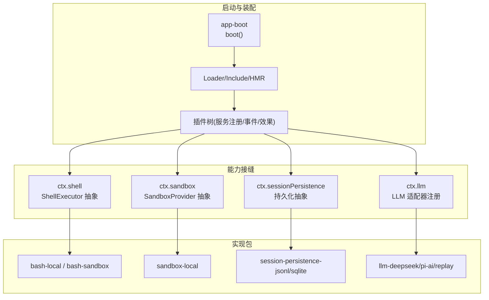
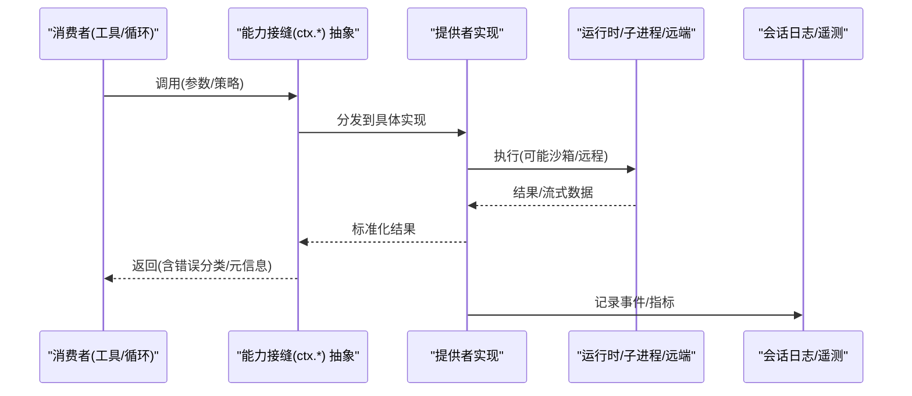
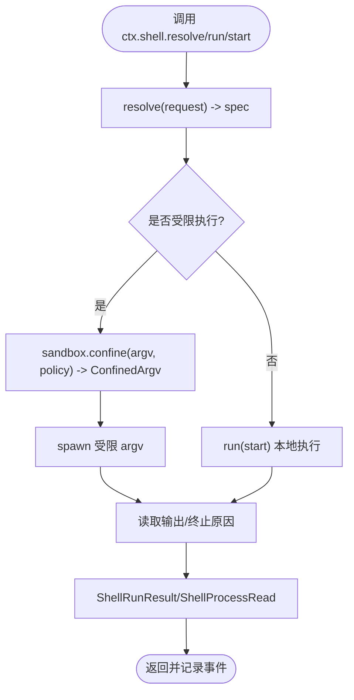
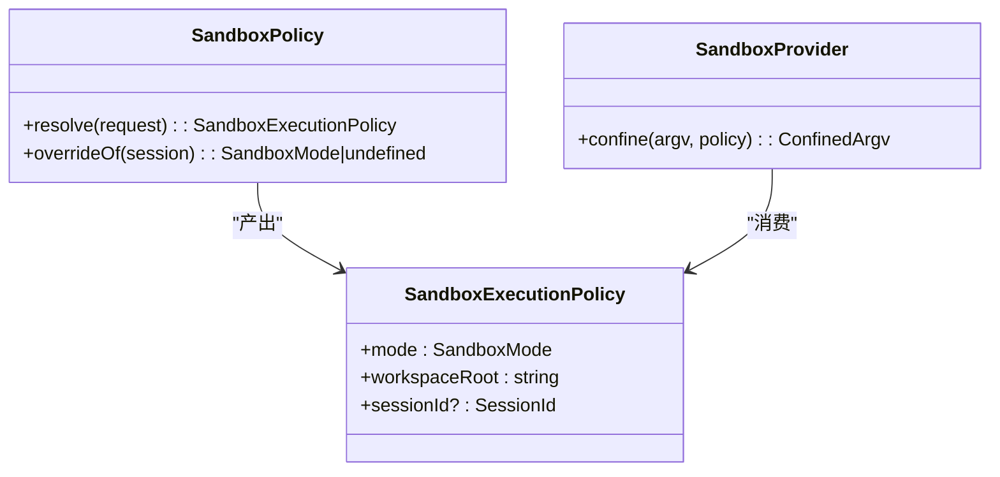
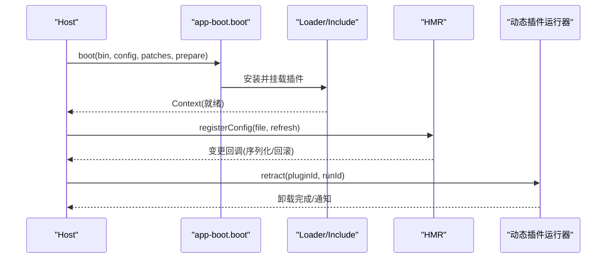
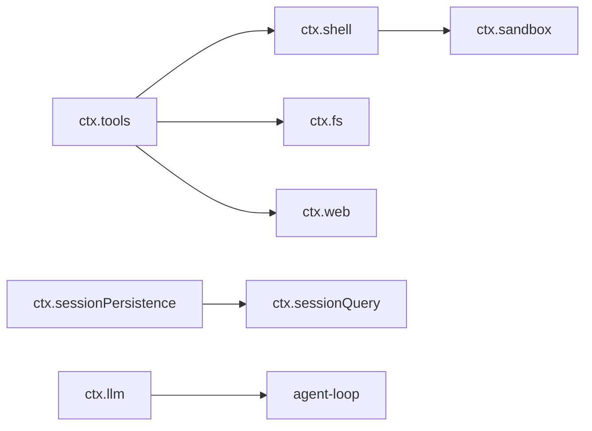

# 实现模式与最佳实践

<cite>
**本文引用的文件**
- [docs/capability-seams.md](file://docs/capability-seams.md)
- [docs/architecture.md](file://docs/architecture.md)
- [docs/testing.md](file://docs/testing.md)
- [docs/subsystems/sandbox.md](file://docs/subsystems/sandbox.md)
- [docs/subsystems/shell.md](file://docs/subsystems/shell.md)
- [packages/boot/app-boot/src/index.ts](file://packages/boot/app-boot/src/index.ts)
- [packages/host/plugin-inventory/src/types.ts](file://packages/host/plugin-inventory/src/types.ts)
- [packages/extensions/cordis-client-runner/src/client/runtime.ts](file://packages/extensions/cordis-client-runner/src/client/runtime.ts)
- [packages/test-support/llm-mock-server/src/index.ts](file://packages/test-support/llm-mock-server/src/index.ts)
- [packages/session/session-persistence-sqlite/tests/sqlite.spec.ts](file://packages/session/session-persistence-sqlite/tests/sqlite.spec.ts)
- [packages/session/session-persistence/src/coordinator.ts](file://packages/session/session-persistence/src/coordinator.ts)
- [packages/sandbox/sandbox-policy/src/session-mode.ts](file://packages/sandbox/sandbox-policy/src/session-mode.ts)
- [packages/e2b/subprocess-e2b/tests/subprocess.spec.ts](file://packages/e2b/subprocess-e2b/tests/subprocess.spec.ts)
- [apps/web/tests/complex-history.perf.ts](file://apps/web/tests/complex-history.perf.ts)
</cite>

## 目录
1. [简介](#简介)
2. [项目结构](#项目结构)
3. [核心组件](#核心组件)
4. [架构总览](#架构总览)
5. [详细组件分析](#详细组件分析)
6. [依赖关系分析](#依赖关系分析)
7. [性能考量](#性能考量)
8. [故障排查指南](#故障排查指南)
9. [结论](#结论)
10. [附录](#附录)

## 简介
本文件面向“能力接缝系统”的实现模式与最佳实践，聚焦统一设计模式（接口适配、错误处理、性能优化）、可插拔能力（动态加载、配置管理、状态同步）、测试策略（单元/集成/端到端）以及本地/沙箱/远程实现的差异与联系。同时提供性能监控与调试技巧、迁移指南与版本升级建议，帮助读者在 DeepSeek Harness 的 Cordis 插件体系下安全地扩展和替换能力。

## 项目结构
DeepSeek Harness 以 Cordis 为框架：每个功能都是插件，通过服务声明、提供者注册与消费者使用形成“能力接缝”。启动时按层装配 bundle/profile，支持热重载与补丁覆盖；运行时通过 ctx 键暴露能力，消费方仅依赖抽象契约，不感知具体实现。



图表来源
- [packages/boot/app-boot/src/index.ts:757-773](file://packages/boot/app-boot/src/index.ts#L757-L773)
- [docs/capability-seams.md:412-469](file://docs/capability-seams.md#L412-L469)

章节来源
- [docs/architecture.md:9-37](file://docs/architecture.md#L9-L37)
- [packages/boot/app-boot/src/index.ts:246-287](file://packages/boot/app-boot/src/index.ts#L246-L287)

## 核心组件
- 能力接缝三角色：服务定义（Service Definition）、服务提供者（Service Provider）、消费者（Consumer）。一个 seam 是完整的能力集合，而非单一接口。
- 关键 ctx 键：shell、sandbox、sessionPersistence、llm、tools、jobs、storage、web 等，均遵循“抽象 + 多实现 + 稳定消费面”的模式。
- 启动与配置：app-boot.boot 负责初始化上下文、安装 Loader、应用补丁、挂载插件；HMR 支持配置热更新与回滚。
- 动态加载：Cordis 客户端运行器支持动态插件的装载、卸载与重入保护，保证生命周期安全。

章节来源
- [docs/capability-seams.md:412-469](file://docs/capability-seams.md#L412-L469)
- [packages/boot/app-boot/src/index.ts:757-773](file://packages/boot/app-boot/src/index.ts#L757-L773)
- [packages/extensions/cordis-client-runner/src/client/runtime.ts:303-331](file://packages/extensions/cordis-client-runner/src/client/runtime.ts#L303-L331)

## 架构总览
下图展示典型能力接缝的调用链：消费者通过 ctx 调用抽象服务，由具体提供者执行，必要时跨进程或远端执行，并通过事件与日志保持可观测性。



图表来源
- [docs/capability-seams.md:412-469](file://docs/capability-seams.md#L412-L469)
- [docs/subsystems/shell.md:231-267](file://docs/subsystems/shell.md#L231-L267)
- [docs/subsystems/sandbox.md:166-217](file://docs/subsystems/sandbox.md#L166-L217)

## 详细组件分析

### Shell 执行接缝（本地/沙箱/远程）
- 抽象：ShellExecutor（resolve/run/start），统一前台/后台执行语义，输出截断与溢出路径、超时/中止分类、环境注入（DSH_*）。
- 提供者：
  - 本地：bash-local，直接子进程执行。
  - 沙箱：bash-sandbox，结合 sandbox-local 对 argv 进行限制包装，报告 denial/runnerFailure。
  - 远程：通过 subprocess 抽象（如 e2b）将命令调度到远端容器。
- 消费者：tool-bash 等模型可见工具，仅依赖抽象契约。



图表来源
- [docs/subsystems/shell.md:17-99](file://docs/subsystems/shell.md#L17-L99)
- [docs/subsystems/shell.md:105-221](file://docs/subsystems/shell.md#L105-L221)
- [docs/subsystems/sandbox.md:41-94](file://docs/subsystems/sandbox.md#L41-L94)

章节来源
- [docs/subsystems/shell.md:1-304](file://docs/subsystems/shell.md#L1-L304)
- [docs/subsystems/sandbox.md:1-219](file://docs/subsystems/sandbox.md#L1-L219)

### 沙箱策略与执行
- 策略解析：sandboxPolicy.resolve 根据部署默认、会话覆盖、工作区根目录计算每调用一次的执行策略。
- 模式：read-only、workspace-write、danger-full-access；enforcement 区分 full/partial。
- 失败分类：denialSignatures（被沙箱拒绝）、runnerFailureRules（沙箱运行器失败）。



图表来源
- [docs/subsystems/sandbox.md:41-94](file://docs/subsystems/sandbox.md#L41-L94)
- [docs/subsystems/sandbox.md:166-217](file://docs/subsystems/sandbox.md#L166-L217)

章节来源
- [docs/subsystems/sandbox.md:1-219](file://docs/subsystems/sandbox.md#L1-L219)
- [packages/sandbox/sandbox-policy/src/session-mode.ts:44-71](file://packages/sandbox/sandbox-policy/src/session-mode.ts#L44-L71)

### 会话持久化接缝（JSONL/SQLite）
- 抽象：sessionPersistence 提供 load/list/append 等能力，后端实现共享同一 SessionEvent 词汇。
- 协调器：adoptStoredEvents 对历史事件进行迁移与采用，确保回放一致性。
- 版本兼容：SQLite 后端通过 schema version 校验，拒绝不兼容数据库。

```mermaid
sequenceDiagram
participant Loop as "Agent 循环"
participant Pers as "sessionPersistence 抽象"
participant Backend as "JSONL/SQLite 后端"
participant Coord as "coordinator"
Loop->>Pers : append(events)
Pers->>Backend : 写入
Loop->>Pers : load(id)/list()
Pers->>Backend : 读取
Backend-->>Pers : 原始事件
Pers->>Coord : adoptStoredEvents(迁移/校验)
Coord-->>Loop : 标准化事件序列
```

图表来源
- [docs/capability-seams.md:412-469](file://docs/capability-seams.md#L412-L469)
- [packages/session/session-persistence/src/coordinator.ts:559-573](file://packages/session/session-persistence/src/coordinator.ts#L559-L573)
- [packages/session/session-persistence-sqlite/tests/sqlite.spec.ts:352-377](file://packages/session/session-persistence-sqlite/tests/sqlite.spec.ts#L352-L377)

章节来源
- [packages/session/session-persistence/src/coordinator.ts:559-573](file://packages/session/session-persistence/src/coordinator.ts#L559-L573)
- [packages/session/session-persistence-sqlite/tests/sqlite.spec.ts:352-377](file://packages/session/session-persistence-sqlite/tests/sqlite.spec.ts#L352-L377)

### LLM 适配器接缝（本地/回放/远程）
- 抽象：ctx.llm 提供消息与流式对话的统一词汇，适配器注册后供 agent-loop 与 compaction 使用。
- 实现：llm-deepseek、llm-pi-ai、llm-replay（测试用）。
- 错误与恢复：流式分片前/后的失败需分别验证，确保无副作用消息产生。

章节来源
- [docs/capability-seams.md:412-469](file://docs/capability-seams.md#L412-L469)

### 动态加载与配置管理
- 启动：app-boot.boot 安装 Loader，应用 patches，挂载插件；prepare 阶段失败标记为 host preparation failed。
- 热更新：HMR 监听配置文件变更，串行化刷新，失败回滚并广播 hmr/config-update-failed。
- 动态插件：cordis-client-runner 支持 retract/dispose，清理资源并通知观察者。



图表来源
- [packages/boot/app-boot/src/index.ts:757-773](file://packages/boot/app-boot/src/index.ts#L757-L773)
- [packages/extensions/cordis-client-runner/src/client/runtime.ts:303-331](file://packages/extensions/cordis-client-runner/src/client/runtime.ts#L303-L331)

章节来源
- [packages/boot/app-boot/src/index.ts:246-287](file://packages/boot/app-boot/src/index.ts#L246-L287)
- [packages/extensions/cordis-client-runner/src/client/runtime.ts:303-331](file://packages/extensions/cordis-client-runner/src/client/runtime.ts#L303-L331)

### 状态同步与会话事件
- 会话日志是唯一事实源，所有模型可见输入必须可回放。
- 沙箱模式切换通过 session 追加 sandbox/mode 事件，回放即状态。
- 持久化后端统一事件词汇，协调器负责迁移与校验。

章节来源
- [docs/architecture.md:92-97](file://docs/architecture.md#L92-L97)
- [packages/sandbox/sandbox-policy/src/session-mode.ts:44-71](file://packages/sandbox/sandbox-policy/src/session-mode.ts#L44-L71)
- [packages/session/session-persistence/src/coordinator.ts:559-573](file://packages/session/session-persistence/src/coordinator.ts#L559-L573)

## 依赖关系分析
- 低耦合：消费者仅依赖抽象（ctx.*），实现包通过插件机制注册。
- 事件驱动：能力相关行为通过事件（agent/*、tools/*、fs/* 等）解耦。
- 可替换性：同一 ctx 键可有多个实现（如 shell、sandbox、sessionPersistence、llm）。



图表来源
- [docs/capability-seams.md:412-469](file://docs/capability-seams.md#L412-L469)

章节来源
- [docs/capability-seams.md:412-469](file://docs/capability-seams.md#L412-L469)

## 性能考量
- 流式处理：LLM 流式分片需关注内存与背压，避免阻塞主线程。
- 输出截断：shell/web 大输出应使用 spill 存储，避免内存膨胀。
- 快照与回放：会话日志回放用于 UI 与遥测，注意索引与分页。
- 浏览器压力测试：复杂历史场景下渲染与滚动性能需专项验证。

章节来源
- [apps/web/tests/complex-history.perf.ts:37-916](file://apps/web/tests/complex-history.perf.ts#L37-L916)

## 故障排查指南
- 沙箱不可用：当受限执行无可用后端时抛出 SANDBOX_UNAVAILABLE，需检查平台能力与配置。
- 子进程连接不可用：e2b 等远端执行在重连期间可能被中止，需处理 AbortSignal。
- 数据库版本不兼容：SQLite 打开时会校验 schema version，旧/新版本均会拒绝，需升级或降级。
- 模拟服务器异常：测试中 mock server 捕获处理器异常并返回结构化错误，便于定位问题。

章节来源
- [docs/subsystems/sandbox.md:152-157](file://docs/subsystems/sandbox.md#L152-L157)
- [packages/e2b/subprocess-e2b/tests/subprocess.spec.ts:1244-1277](file://packages/e2b/subprocess-e2b/tests/subprocess.spec.ts#L1244-L1277)
- [packages/session/session-persistence-sqlite/tests/sqlite.spec.ts:352-377](file://packages/session/session-persistence-sqlite/tests/sqlite.spec.ts#L352-L377)
- [packages/test-support/llm-mock-server/src/index.ts:674-713](file://packages/test-support/llm-mock-server/src/index.ts#L674-L713)

## 结论
DeepSeek Harness 通过 Cordis 插件体系与能力接缝实现了高度可插拔、可替换的系统架构。统一的抽象契约、稳定的消费面、完善的错误分类与事件回放机制，使得本地/沙箱/远程实现可以无缝切换。配合严格的测试分层与性能基准，能够在保证质量的同时快速演进能力。

## 附录

### 测试策略与最佳实践
- 单元测试：覆盖边界条件、错误路径、事件顺序与并发竞态；每个注册点需有 HMR 安全测试。
- 覆盖率门禁：包内源码行级 100% 覆盖率；未覆盖行常为死代码。
- 真实 API 端到端：带密钥测试验证模型与第三方服务；无密钥 CI 自跳过。
- 快照测试：无密钥场景锁定外部行为与协议；ACP/headless/web GUI 各有快照套件。
- 优先真实实现：仅对昂贵或非确定性边界做模拟；桥接测试使用脚本化 mock 模型+真实工具/执行器。

章节来源
- [docs/testing.md:7-50](file://docs/testing.md#L7-L50)

### 迁移指南与版本升级建议
- 会话日志版本：新增事件类型需具备可转换性；禁止静默忽略未知事件。
- 持久化后端：SQLite 版本不兼容将拒绝打开；升级时需先迁移或回退。
- 配置热更新：HMR 失败会回滚到上一良好状态；插件效果短暂可见但会被补偿。
- 动态插件：retract/dispose 需确保资源释放与观察者通知。

章节来源
- [packages/session/session-persistence-sqlite/tests/sqlite.spec.ts:352-377](file://packages/session/session-persistence-sqlite/tests/sqlite.spec.ts#L352-L377)
- [packages/boot/app-boot/src/index.ts:246-287](file://packages/boot/app-boot/src/index.ts#L246-L287)
- [packages/extensions/cordis-client-runner/src/client/runtime.ts:303-331](file://packages/extensions/cordis-client-runner/src/client/runtime.ts#L303-L331)

### 性能监控与调试技巧
- 使用会话日志回放定位问题：从 event 流推导模型可见上下文。
- 沙箱诊断：利用 denialSignatures 与 runnerFailureRules 区分命令失败与沙箱拒绝。
- 浏览器性能：通过复杂历史场景压测观察渲染与滚动表现。
- 模拟服务器：捕获请求/响应与错误码，辅助网络与协议调试。

章节来源
- [docs/architecture.md:92-97](file://docs/architecture.md#L92-L97)
- [docs/subsystems/sandbox.md:96-150](file://docs/subsystems/sandbox.md#L96-L150)
- [apps/web/tests/complex-history.perf.ts:37-916](file://apps/web/tests/complex-history.perf.ts#L37-L916)
- [packages/test-support/llm-mock-server/src/index.ts:674-713](file://packages/test-support/llm-mock-server/src/index.ts#L674-L713)