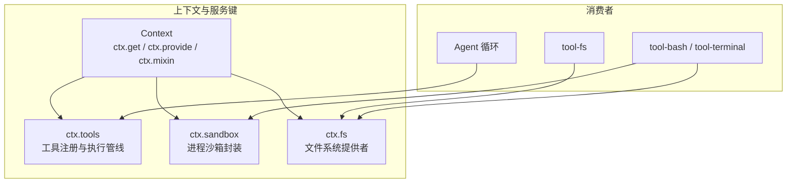
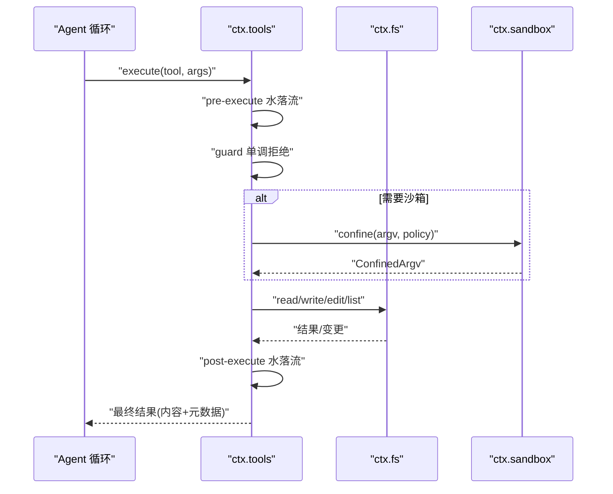
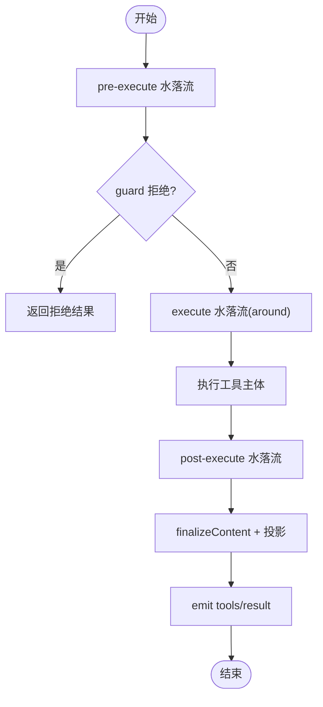
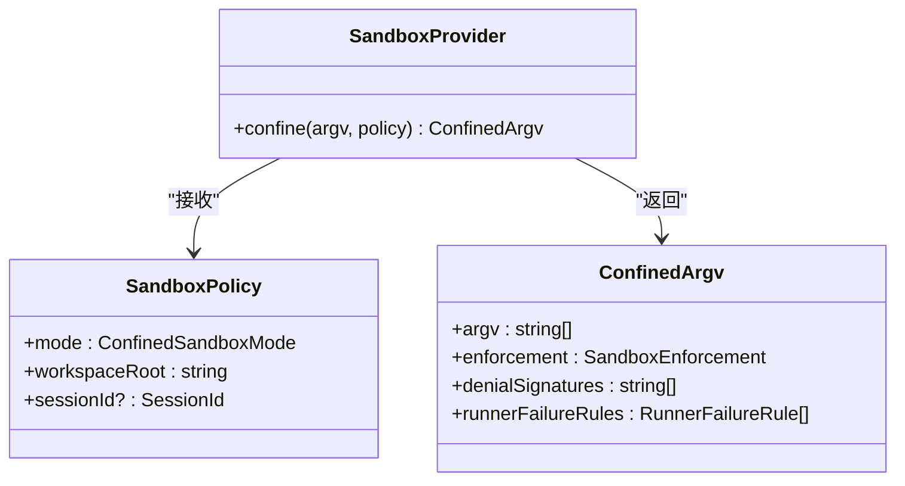
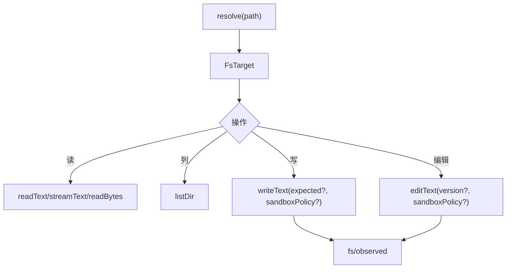
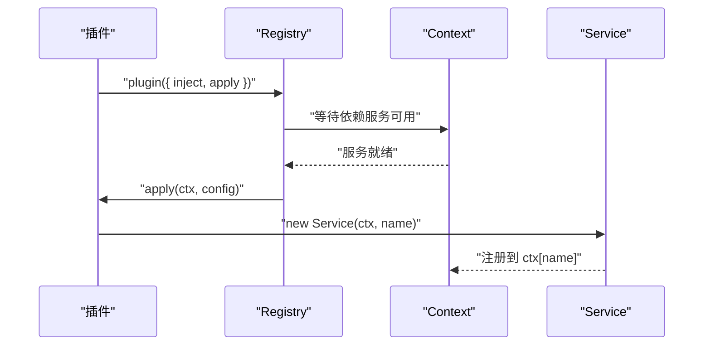
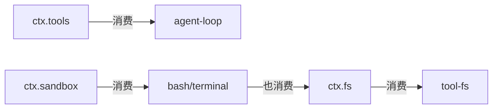

# 服务定义与接口

<cite>
**本文引用的文件**
- [packages/core/tools/src/index.ts](file://packages/core/tools/src/index.ts)
- [packages/fs/fs/src/index.ts](file://packages/fs/fs/src/index.ts)
- [packages/sandbox/sandbox/src/index.ts](file://packages/sandbox/sandbox/src/index.ts)
- [docs/capability-seams.md](file://docs/capability-seams.md)
- [docs/cordis-api/context.md](file://docs/cordis-api/context.md)
- [docs/cordis-api/service.md](file://docs/cordis-api/service.md)
- [docs/cordis-api/registry.md](file://docs/cordis-api/registry.md)
</cite>

## 目录
1. [简介](#简介)
2. [项目结构](#项目结构)
3. [核心组件](#核心组件)
4. [架构总览](#架构总览)
5. [详细组件分析](#详细组件分析)
6. [依赖关系分析](#依赖关系分析)
7. [性能考量](#性能考量)
8. [故障排查指南](#故障排查指南)
9. [结论](#结论)
10. [附录](#附录)

## 简介
本文件聚焦能力接缝系统中的“服务定义与接口”，围绕 ctx.tools、ctx.sandbox、ctx.fs 等关键服务的抽象设计、类型契约、注册与发现机制、版本管理与向后兼容、生命周期钩子与错误处理约定进行系统化说明，并给出实现与扩展这些接口的实践建议。

## 项目结构
能力接缝系统通过 Cordis 上下文（Context）暴露统一的服务键（如 tools、sandbox、fs），各能力以 Service 子类形式提供具体实现，并通过插件机制在运行时装配。工具执行管线、沙箱封装与文件系统读写分别位于独立包中，彼此通过稳定的服务键解耦。

图表来源
- [docs/capability-seams.md:412-470](file://docs/capability-seams.md#L412-L470)
- [docs/cordis-api/context.md:237-365](file://docs/cordis-api/context.md#L237-L365)

章节来源
- [docs/capability-seams.md:412-470](file://docs/capability-seams.md#L412-L470)
- [docs/cordis-api/context.md:237-365](file://docs/cordis-api/context.md#L237-L365)

## 核心组件
- 服务基类与符号：Service 提供 name、init/check/config/invoke/extend/tracker/resolveConfig 等符号键，用于生命周期、可配置性与可调用包装。
- 上下文与注入：Context 提供 extend/isolate/intercept/get/set/provide/accessor/mixin 等能力，支持作用域隔离、拦截配置与依赖注入。
- 插件注册：Registry 提供 inject/plugin，声明式依赖与加载，支持对象/函数/类三种插件形态。

章节来源
- [docs/cordis-api/service.md:14-103](file://docs/cordis-api/service.md#L14-L103)
- [docs/cordis-api/context.md:14-163](file://docs/cordis-api/context.md#L14-L163)
- [docs/cordis-api/registry.md:8-57](file://docs/cordis-api/registry.md#L8-L57)

## 架构总览
下图展示工具执行管线、沙箱与文件系统的协作关系：Agent 循环通过 ctx.tools 调度工具；工具可能调用 ctx.fs 进行读写，或通过 ctx.sandbox 包裹子进程执行；策略与观察点通过事件水落流（waterfall）和 emit 模式接入。

图表来源
- [packages/core/tools/src/index.ts:137-208](file://packages/core/tools/src/index.ts#L137-L208)
- [packages/core/tools/src/index.ts:826-837](file://packages/core/tools/src/index.ts#L826-L837)
- [packages/fs/fs/src/index.ts:44-78](file://packages/fs/fs/src/index.ts#L44-L78)
- [packages/sandbox/sandbox/src/index.ts:146-176](file://packages/sandbox/sandbox/src/index.ts#L146-L176)

## 详细组件分析

### 工具服务（ctx.tools）
- 角色：工具注册表与受控执行管线，负责预检查、守卫、around 执行、后处理与结果观测。
- 关键类型与契约：
  - ToolDefinition：包含 schema、output.render/presentationMeta、execute、finalizeContent、timeoutMs、isConcurrencySafe、presentCall/presentResult。
  - ToolExecution/ToolDispatchExecution：描述一次调用的身份、参数、信号与作用域。
  - ToolExecutionResult：成功或失败的可序列化结果。
  - PreToolDecision/PostToolDecision：允许/拒绝/询问与接受/替换/阻断的决策。
  - ToolGuard：单调守卫，返回拒绝原因或 undefined。
- 事件与水落流：
  - 'tools/pre-execute'：准入前决策。
  - 'tools/execute'：around 执行，可替换信号但不可移除。
  - 'tools/post-execute'：结果可被接受、替换或阻断。
  - 'tools/code-dispatch-log'：对 run_code 子调用的日志内容做可替换投影。
  - 'tools/result'：最终结果的只读观测。
  - 'tools/change'：全局可见的工具集合变化通知。
- 呈现模式：native/code/both，code 模式仅暴露 run_code 传输，并在提示中注入 SDK 生成段。
- 作用域与限制：支持 per-scope 注册、restrict 过滤、presentAs 切换呈现模式。

图表来源
- [packages/core/tools/src/index.ts:137-208](file://packages/core/tools/src/index.ts#L137-L208)
- [packages/core/tools/src/index.ts:221-288](file://packages/core/tools/src/index.ts#L221-L288)
- [packages/core/tools/src/index.ts:582-600](file://packages/core/tools/src/index.ts#L582-L600)

章节来源
- [packages/core/tools/src/index.ts:137-208](file://packages/core/tools/src/index.ts#L137-L208)
- [packages/core/tools/src/index.ts:221-288](file://packages/core/tools/src/index.ts#L221-L288)
- [packages/core/tools/src/index.ts:582-600](file://packages/core/tools/src/index.ts#L582-L600)
- [packages/core/tools/src/index.ts:826-837](file://packages/core/tools/src/index.ts#L826-L837)
- [packages/core/tools/src/index.ts:946-974](file://packages/core/tools/src/index.ts#L946-L974)
- [packages/core/tools/src/index.ts:1037-1062](file://packages/core/tools/src/index.ts#L1037-L1062)
- [packages/core/tools/src/index.ts:1110-1116](file://packages/core/tools/src/index.ts#L1110-L1116)

### 沙箱服务（ctx.sandbox）
- 角色：将待执行的 argv 按策略 confine 为受限执行体，返回新 argv、执行完整性与拒绝特征。
- 关键类型与契约：
  - SandboxMode：read-only | workspace-write | danger-full-access。
  - SandboxPolicy/SandboxExecutionPolicy：每调用解析出的策略（含 mode、workspaceRoot、sessionId）。
  - ConfinedArgv：包裹后的 argv、enforcement、denialSignatures、runnerFailureRules。
  - 错误：SANDBOX_UNAVAILABLE 与 SandboxUnavailableError。
- 使用约定：调用方传入精确 argv，不传 shell 字符串；后端必须 fail-closed，禁止静默放行。

图表来源
- [packages/sandbox/sandbox/src/index.ts:23-72](file://packages/sandbox/sandbox/src/index.ts#L23-L72)
- [packages/sandbox/sandbox/src/index.ts:90-116](file://packages/sandbox/sandbox/src/index.ts#L90-L116)
- [packages/sandbox/sandbox/src/index.ts:146-176](file://packages/sandbox/sandbox/src/index.ts#L146-L176)

章节来源
- [packages/sandbox/sandbox/src/index.ts:23-72](file://packages/sandbox/sandbox/src/index.ts#L23-L72)
- [packages/sandbox/sandbox/src/index.ts:90-116](file://packages/sandbox/sandbox/src/index.ts#L90-L116)
- [packages/sandbox/sandbox/src/index.ts:146-176](file://packages/sandbox/sandbox/src/index.ts#L146-L176)

### 文件系统服务（ctx.fs）
- 角色：面向执行世界的稳定目标抽象，提供路径解析、元信息、文本/二进制读取、目录列举与原子写入/编辑。
- 关键类型与契约：
  - FileSystem 抽象类：resolve/processPath/fileUrl/contains/stat/lstat/readText/streamText/readBytes/listDir/writeText/editText。
  - FsTarget/FsVersion/FsWriteIntent/FsEditRequest/FsInfo/FsDirEntry 等类型。
  - 事件：fs/write-intent、fs/edit-intent（单槽水落流）、fs/observed（同步记录）。
- 安全与策略：sandboxMode 默认值由后端提供；write/edit 支持预期版本与沙箱策略；读取有 maxBytes 上限防止无界缓冲。

图表来源
- [packages/fs/fs/src/index.ts:80-250](file://packages/fs/fs/src/index.ts#L80-L250)
- [packages/fs/fs/src/index.ts:44-78](file://packages/fs/fs/src/index.ts#L44-L78)

章节来源
- [packages/fs/fs/src/index.ts:44-78](file://packages/fs/fs/src/index.ts#L44-L78)
- [packages/fs/fs/src/index.ts:80-250](file://packages/fs/fs/src/index.ts#L80-L250)

### 服务注册、发现与依赖注入
- 服务注册：Service 子类构造时立即注册到 ctx.name，随 fiber 卸载自动移除。
- 依赖注入：ctx.inject(deps, callback) 等待所需服务可用后运行回调，服务变更会重新运行。
- 插件形态：函数/类/对象三种入口，均支持 Config 校验、inject 声明与 provide 名称。
- 作用域与拦截：ctx.extend/isolate/intercept 创建子上下文，隔离服务实现与合并拦截配置。

图表来源
- [docs/cordis-api/registry.md:8-57](file://docs/cordis-api/registry.md#L8-L57)
- [docs/cordis-api/context.md:14-96](file://docs/cordis-api/context.md#L14-L96)
- [docs/cordis-api/service.md:6-12](file://docs/cordis-api/service.md#L6-L12)

章节来源
- [docs/cordis-api/registry.md:8-57](file://docs/cordis-api/registry.md#L8-L57)
- [docs/cordis-api/context.md:14-96](file://docs/cordis-api/context.md#L14-L96)
- [docs/cordis-api/service.md:6-12](file://docs/cordis-api/service.md#L6-L12)

### 接口版本管理与向后兼容性
- 稳定键名：ctx.tools、ctx.sandbox、ctx.fs 作为能力接缝键长期稳定，实现可在不同包中替换。
- 渐进增强：新增可选字段（如 output.presentationMeta、timeoutMs、isConcurrencySafe）保持旧实现兼容。
- 事件演进：水落流事件采用 next() 委托语义，新增监听器不影响既有行为；emit 事件用于观测，不改变主流程。
- 呈现模式：tools 的 code/native/both 模式在不破坏 native 的前提下引入新交互面。

章节来源
- [packages/core/tools/src/index.ts:221-288](file://packages/core/tools/src/index.ts#L221-L288)
- [packages/core/tools/src/index.ts:650-674](file://packages/core/tools/src/index.ts#L650-L674)
- [packages/fs/fs/src/index.ts:44-78](file://packages/fs/fs/src/index.ts#L44-L78)

### 生命周期钩子与错误处理约定
- 生命周期：Service 通过符号键暴露 init/extend/tracker 等扩展点；插件 fiber 卸载时清理服务与 effect。
- 工具生命周期：pre-execute → guard → execute → post-execute → finalize → result，任一阶段均可标准化错误。
- 错误约定：
  - 未知工具：UNKNOWN_TOOL。
  - 输出非法：INVALID_TOOL_OUTPUT。
  - 沙箱不可用：SANDBOX_UNAVAILABLE。
  - 取消：ABORTED/ABORTED_BEFORE_DISPATCH。
- 观测与审计：tools/result、fs/observed 提供不可变快照，便于回放与诊断。

章节来源
- [packages/core/tools/src/index.ts:468-522](file://packages/core/tools/src/index.ts#L468-L522)
- [packages/sandbox/sandbox/src/index.ts:118-144](file://packages/sandbox/sandbox/src/index.ts#L118-L144)
- [docs/cordis-api/service.md:25-103](file://docs/cordis-api/service.md#L25-L103)

### 自定义服务提供者示例（TypeScript 风格）
以下为实现与扩展三个关键服务的步骤指引（不含代码片段，仅路径引用）：
- 实现 ctx.fs 后端：
  - 参考抽象类与类型定义位置，实现 resolve/processPath/fileUrl/contains/stat/lstat/readText/streamText/readBytes/listDir/writeText/editText。
  - 如需加入意图守卫，订阅 fs/write-intent 与 fs/edit-intent 水落流。
  - 参考路径：[packages/fs/fs/src/index.ts:80-250](file://packages/fs/fs/src/index.ts#L80-L250)、[packages/fs/fs/src/index.ts:44-78](file://packages/fs/fs/src/index.ts#L44-L78)
- 实现 ctx.sandbox 后端：
  - 继承 SandboxProvider，实现 confine(argv, policy)，返回 ConfinedArgv 并保证 fail-closed。
  - 参考路径：[packages/sandbox/sandbox/src/index.ts:146-176](file://packages/sandbox/sandbox/src/index.ts#L146-L176)
- 扩展 ctx.tools：
  - 通过 ToolRuntime.register 注册新工具，声明 output.schema/render/presentationMeta，必要时提供 presentCall/presentResult。
  - 使用 restrict/guard/presentAs 控制可见性、守卫与呈现模式。
  - 参考路径：[packages/core/tools/src/index.ts:1037-1062](file://packages/core/tools/src/index.ts#L1037-L1062)、[packages/core/tools/src/index.ts:1110-1116](file://packages/core/tools/src/index.ts#L1110-L1116)、[packages/core/tools/src/index.ts:946-974](file://packages/core/tools/src/index.ts#L946-L974)

章节来源
- [packages/fs/fs/src/index.ts:44-78](file://packages/fs/fs/src/index.ts#L44-L78)
- [packages/fs/fs/src/index.ts:80-250](file://packages/fs/fs/src/index.ts#L80-L250)
- [packages/sandbox/sandbox/src/index.ts:146-176](file://packages/sandbox/sandbox/src/index.ts#L146-L176)
- [packages/core/tools/src/index.ts:946-974](file://packages/core/tools/src/index.ts#L946-L974)
- [packages/core/tools/src/index.ts:1037-1062](file://packages/core/tools/src/index.ts#L1037-L1062)
- [packages/core/tools/src/index.ts:1110-1116](file://packages/core/tools/src/index.ts#L1110-L1116)

## 依赖关系分析
- 消费关系：agent-loop 依赖 ctx.tools；tool-fs 依赖 ctx.fs；bash/terminal 工具依赖 ctx.sandbox 与 ctx.fs。
- 能力图：capability-seams 文档列出所有服务键、拥有者、实现者与直接消费者，体现解耦与可替换性。

图表来源
- [docs/capability-seams.md:412-470](file://docs/capability-seams.md#L412-L470)

章节来源
- [docs/capability-seams.md:412-470](file://docs/capability-seams.md#L412-L470)

## 性能考量
- 工具并发：run_code 子调用支持并行度上限，避免资源争用。
- 结果投影：output.render/presentationMeta 需幂等且快速，避免阻塞流水线。
- 沙箱策略：per-call 策略解析应在调用边界完成，减少重复计算。
- 文件系统：streamText/readBytes 支持流式与大文件限制，避免内存峰值。

章节来源
- [packages/core/tools/src/index.ts:665-674](file://packages/core/tools/src/index.ts#L665-L674)
- [packages/fs/fs/src/index.ts:178-199](file://packages/fs/fs/src/index.ts#L178-L199)

## 故障排查指南
- 未知工具：检查工具是否已注册及当前作用域可见性（restrict/presentAs）。
- 输出非法：核对 output.schema 与 render 返回值是否符合 JSON 可序列化要求。
- 沙箱不可用：确认宿主环境满足 confinement 要求或降级到危险模式。
- 取消与超时：确保工具主体响应 AbortSignal，并在 around 层正确恢复信号。
- 事件调试：订阅 tools/result、fs/observed 获取不可变快照定位问题。

章节来源
- [packages/core/tools/src/index.ts:468-522](file://packages/core/tools/src/index.ts#L468-L522)
- [packages/sandbox/sandbox/src/index.ts:118-144](file://packages/sandbox/sandbox/src/index.ts#L118-L144)
- [packages/fs/fs/src/index.ts:44-78](file://packages/fs/fs/src/index.ts#L44-L78)

## 结论
能力接缝系统通过稳定的服务键与抽象接口，将工具执行、沙箱与文件系统解耦为可替换模块。借助 Cordis 的上下文、插件与事件机制，系统在可扩展性、可测试性与可维护性方面提供了坚实基础。遵循本文的契约与约定，可实现高质量的服务提供者与扩展。

## 附录
- 服务键一览与角色说明参见能力接缝文档表格。
- 上下文与插件 API 详见 cordis-api 文档。

章节来源
- [docs/capability-seams.md:412-470](file://docs/capability-seams.md#L412-L470)
- [docs/cordis-api/context.md:237-365](file://docs/cordis-api/context.md#L237-L365)
- [docs/cordis-api/registry.md:8-57](file://docs/cordis-api/registry.md#L8-L57)