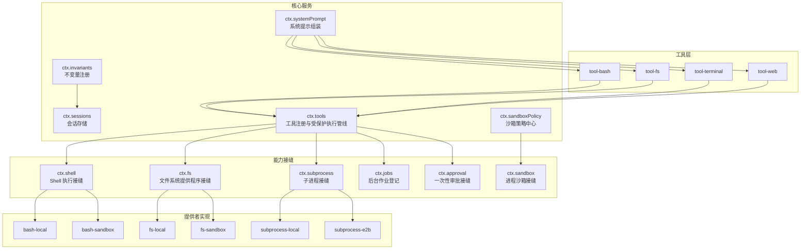
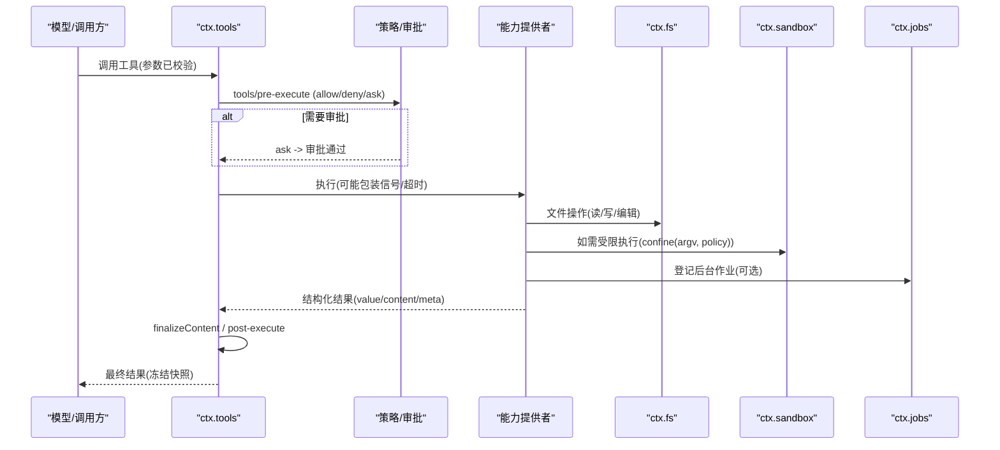
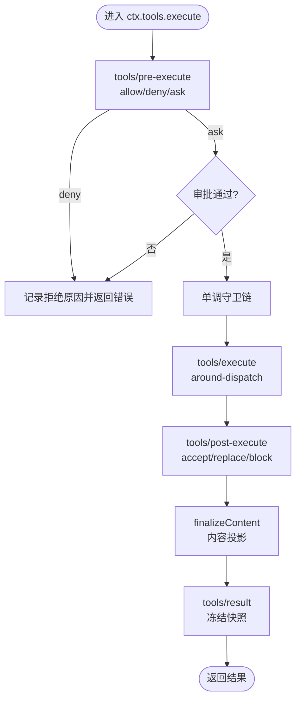
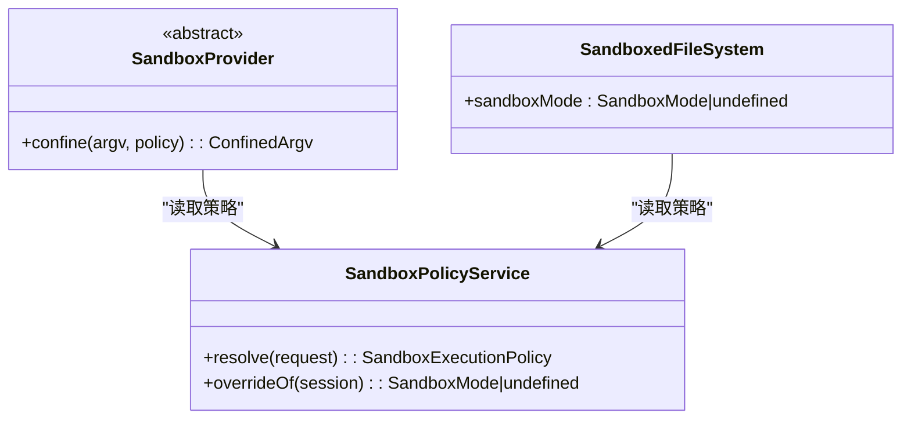
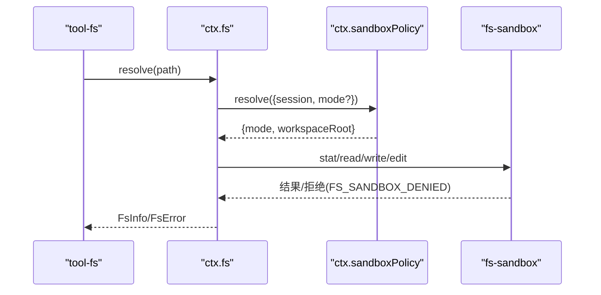
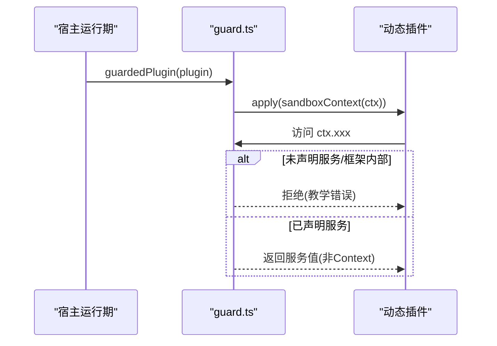
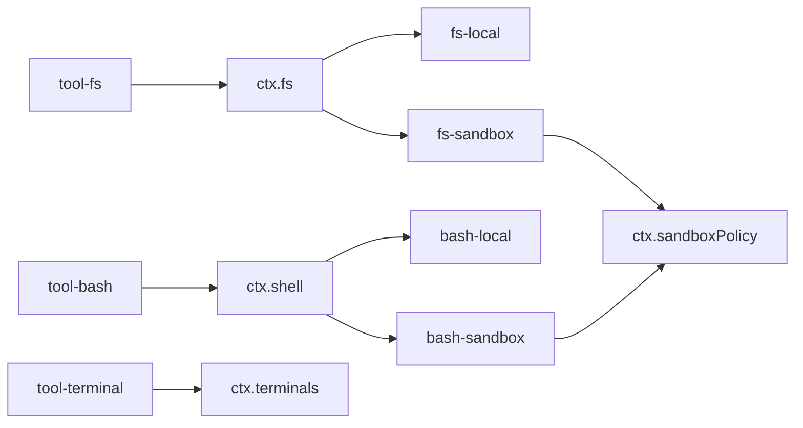

# 能力接缝系统

<cite>
**本文引用的文件**
- [docs/capability-seams.md](file://docs/capability-seams.md)
- [docs/capability-seams.zh.md](file://docs/capability-seams.zh.md)
- [docs/subsystems/tools.md](file://docs/subsystems/tools.md)
- [docs/subsystems/sandbox.md](file://docs/subsystems/sandbox.md)
- [docs/subsystems/extensions.md](file://docs/subsystems/extensions.md)
- [packages/fs/fs/src/index.ts](file://packages/fs/fs/src/index.ts)
- [packages/fs/fs-sandbox/src/index.ts](file://packages/fs/fs-sandbox/src/index.ts)
- [packages/fs/tool-str-replace-editor/src/index.ts](file://packages/fs/tool-str-replace-editor/src/index.ts)
- [packages/extensions/cordis-host-runner/src/guard.ts](file://packages/extensions/cordis-host-runner/src/guard.ts)
- [packages/extensions/cordis-client-runner/src/client/runtime.ts](file://packages/extensions/cordis-client-runner/src/client/runtime.ts)
- [packages/core/scope/src/index.ts](file://packages/core/scope/src/index.ts)
- [packages/api/gateway/tests/gateway.client.spec.ts](file://packages/api/gateway/tests/gateway.client.spec.ts)
- [packages/fs/fs/tests/service.spec.ts](file://packages/fs/fs/tests/service.spec.ts)
- [packages/fs/fs-sandbox/tests/fs-sandbox.spec.ts](file://packages/fs/fs-sandbox/tests/fs-sandbox.spec.ts)
</cite>

## 目录
1. [简介](#简介)
2. [项目结构](#项目结构)
3. [核心组件](#核心组件)
4. [架构总览](#架构总览)
5. [详细组件分析](#详细组件分析)
6. [依赖关系分析](#依赖关系分析)
7. [性能考虑](#性能考虑)
8. [故障排查指南](#故障排查指南)
9. [结论](#结论)
10. [附录](#附录)

## 简介
本文件系统性阐述 Harness 的“能力接缝（Capability Seams）”安全模型与插件架构。能力接缝将“服务定义、服务提供者、消费者”三角色解耦，使同一能力可被替换实现而不影响模型可见的工具契约；同时通过 ctx.tools、ctx.sandbox、ctx.fs 等关键接缝提供统一的安全边界与执行策略。文档还覆盖注册机制、生命周期管理、错误处理策略，并给出扩展能力的实践路径与参考代码片段位置。

## 项目结构
能力接缝在仓库中以“包级职责分离”的方式组织：
- 服务定义：声明 ctx.<key> 与服务词汇（如 ShellExecutor、FsTarget）。
- 服务提供者：实现或注册具体能力（如本地 bash、沙箱 bash、远程执行）。
- 消费者：面向模型的工具与上层逻辑（如 tool-bash、tool-fs），仅依赖服务定义。

下图展示了能力接缝的整体视图（节选关键节点）：

图表来源
- [docs/capability-seams.md:10-196](file://docs/capability-seams.md#L10-L196)
- [docs/subsystems/tools.md:478-574](file://docs/subsystems/tools.md#L478-L574)
- [docs/subsystems/sandbox.md:166-217](file://docs/subsystems/sandbox.md#L166-L217)

章节来源
- [docs/capability-seams.md:10-196](file://docs/capability-seams.md#L10-L196)
- [docs/capability-seams.zh.md:10-198](file://docs/capability-seams.zh.md#L10-L198)

## 核心组件
- ctx.tools：工具注册表与受保护的执行管线，负责 pre-execute → guards → execute → post-execute → finalizeContent → result 的全链路控制、并发模式、超时协作、结果观测与内容脱敏/溢出策略。
- ctx.sandbox：进程沙箱接缝，封装 argv 到受限执行环境，返回 ConfinedArgv（含 enforcement、denialSignatures、runnerFailureRules），禁止静默绕过。
- ctx.fs：文件系统提供程序接缝，抽象 read/write/edit/stream/stat/list 等原语；支持 sandboxMode 事实与版本守卫；fs-sandbox 按共享策略限制变更。
- ctx.sandboxPolicy：统一的沙箱策略中心，解析 per-call 模式与工作区根，确保 bash 与 fs 不会限制到不同根。
- ctx.subprocess：子进程接缝，统一进程坐标、树/会话生命周期、stdio 处置、终端机制与 kill 升级。
- ctx.jobs：后台作业登记与控制器，供 bash/PTY/subagent 等生产者登记工作，tool-jobs 提供模型侧控制面。
- ctx.approval：一次性审批决策，通过 approval/request 瀑布分派，缺失时失败关闭。

章节来源
- [docs/subsystems/tools.md:478-721](file://docs/subsystems/tools.md#L478-L721)
- [docs/subsystems/sandbox.md:9-157](file://docs/subsystems/sandbox.md#L9-L157)
- [packages/fs/fs/src/index.ts:80-105](file://packages/fs/fs/src/index.ts#L80-L105)
- [packages/fs/fs-sandbox/src/index.ts:33-60](file://packages/fs/fs-sandbox/src/index.ts#L33-L60)

## 架构总览
能力接缝以“接口稳定、实现可替换”为核心原则。消费方只依赖服务定义；提供者通过 Cordis 服务注册暴露实现；组合时通过 cordis.yml 选择具体实现。安全边界贯穿三层：
- 工具执行管线：pre/post 策略、单调守卫、around-dispatch、finalizeContent、result 观测。
- 沙箱与策略：per-call 策略解析、后端强制执行报告、拒绝方言与运行器失败分类。
- 插件上下文隔离：动态插件的 ctx 门面仅暴露白名单能力，拒绝泄露 Context 或框架内部。

图表来源
- [docs/subsystems/tools.md:170-405](file://docs/subsystems/tools.md#L170-L405)
- [docs/subsystems/sandbox.md:41-157](file://docs/subsystems/sandbox.md#L41-L157)

## 详细组件分析

### 工具执行管线（ctx.tools）
- 注册与可见性：register() 支持全局与作用域注册；restrict() 对全局工具进行 allow/deny 过滤；schemas() 产出模型可见的 ToolSchema[]（严格白名单，不泄漏执行回调）。
- 执行流水线：
  - tools/pre-execute：允许、拒绝或请求一次性审批。
  - 单调守卫：不可逆地缩小权限。
  - tools/execute：around-dispatch，可替换信号但不可移除。
  - tools/post-execute：接受、替换 content/value、附加上下文或阻断为错误。
  - finalizeContent：定义级最终内容投影（用于脱敏/溢出）。
  - tools/result：最终观察者，接收冻结的执行与结果。
- 并发与超时：isConcurrencySafe 决定并行/独占；timeoutMs 为协作式超时预算。
- 结果语义：value 是执行本地规范值；content 是模型可见内容；meta 携带元数据；concludesTurn 可结束本轮。

图表来源
- [docs/subsystems/tools.md:170-405](file://docs/subsystems/tools.md#L170-L405)

章节来源
- [docs/subsystems/tools.md:478-721](file://docs/subsystems/tools.md#L478-L721)

### 沙箱与策略（ctx.sandbox、ctx.sandboxPolicy）
- 模式与强制：read-only、workspace-write、danger-full-access；enforcement 报告 full/partial。
- per-call 策略：resolve() 解析 mode + workspaceRoot + sessionId；provider 不得静默绕过。
- 返回物：ConfinedArgv 包含 argv、enforcement、denialSignatures、runnerFailureRules；消费者据此区分“命令被拒绝”和“运行器失败”。
- 策略中心：sandboxPolicy 统一默认模式与工作区根，避免 bash 与 fs 限制到不同根。

图表来源
- [docs/subsystems/sandbox.md:166-217](file://docs/subsystems/sandbox.md#L166-L217)
- [packages/fs/fs/src/index.ts:80-105](file://packages/fs/fs/src/index.ts#L80-L105)
- [packages/fs/fs-sandbox/src/index.ts:33-60](file://packages/fs/fs-sandbox/src/index.ts#L33-L60)

章节来源
- [docs/subsystems/sandbox.md:9-157](file://docs/subsystems/sandbox.md#L9-L157)

### 文件系统接缝（ctx.fs）
- 抽象 FileSystem 提供 readText、streamText、stat、list、write、edit 等原语；目标保持身份稳定；读写原子化。
- sandboxMode：后端暴露默认限制模式，工具层据此展示可升级字段。
- 沙箱实现：fs-sandbox 继承本地实现并按策略限制变更；观察策略通过 fs/* 事件门禁贡献基于观测状态的检查。
- 工具集成：tool-fs 通过 ctx.fs 执行读/写/编辑，并将拒绝映射为 FS_SANDBOX_DENIED 等结构化错误。

图表来源
- [packages/fs/fs/src/index.ts:80-105](file://packages/fs/fs/src/index.ts#L80-L105)
- [packages/fs/fs-sandbox/src/index.ts:33-60](file://packages/fs/fs-sandbox/src/index.ts#L33-L60)
- [packages/fs/tool-str-replace-editor/src/index.ts:81-98](file://packages/fs/tool-str-replace-editor/src/index.ts#L81-L98)

章节来源
- [packages/fs/fs/src/index.ts:80-105](file://packages/fs/fs/src/index.ts#L80-L105)
- [packages/fs/fs-sandbox/src/index.ts:33-60](file://packages/fs/fs-sandbox/src/index.ts#L33-L60)
- [packages/fs/tool-str-replace-editor/src/index.ts:81-134](file://packages/fs/tool-str-replace-editor/src/index.ts#L81-L134)

### 插件架构与安全边界
- 动态插件上下文门面：仅暴露 ctx.tools.register、ctx.on、ctx.provide、timer 辅助与已声明注入的服务；拒绝访问 root/fiber/registry/extend/plugin 等框架内部；拒绝赋值（只读）。
- 服务返回值防护：任何注入服务若返回 Context，将被拒绝，防止逃逸回运行时。
- 客户端/宿主两侧守卫对称：浏览器与宿主均维护各自 Context 类的安全规则，避免跨半部逃逸。
- 作用域隔离：createScope 创建 scoped context，继承父作用域的依赖 API，拥有自身注册与生命周期。

图表来源
- [packages/extensions/cordis-host-runner/src/guard.ts:657-836](file://packages/extensions/cordis-host-runner/src/guard.ts#L657-L836)
- [packages/extensions/cordis-client-runner/src/client/runtime.ts:402-437](file://packages/extensions/cordis-client-runner/src/client/runtime.ts#L402-L437)
- [packages/core/scope/src/index.ts:129-156](file://packages/core/scope/src/index.ts#L129-L156)

章节来源
- [packages/extensions/cordis-host-runner/src/guard.ts:657-836](file://packages/extensions/cordis-host-runner/src/guard.ts#L657-L836)
- [packages/extensions/cordis-client-runner/src/client/runtime.ts:402-437](file://packages/extensions/cordis-client-runner/src/client/runtime.ts#L402-L437)
- [packages/core/scope/src/index.ts:129-156](file://packages/core/scope/src/index.ts#L129-L156)

### 能力接缝的注册机制、生命周期与错误处理
- 注册机制：通过 Cordis Service 声明与插件加载；服务键唯一，重复注册会失败；作用域注册可遮蔽全局。
- 生命周期：fiber 启动/就绪后服务可用；fiber dispose 后服务移除；异常时回滚注册（如网关命名空间启动失败会回滚 Remote 注册）。
- 错误处理：
  - 工具管线：未知工具报 UNKNOWN_TOOL；参数/输出非法分别报 INVALID_ARGS/INVALID_TOOL_OUTPUT；取消导致 ABORTED_BEFORE_DISPATCH 或 ABORTED。
  - 沙箱：无可用后端抛 SANDBOX_UNAVAILABLE；拒绝方言与运行器失败分类帮助定位问题。
  - 文件系统：FS_SANDBOX_DENIED、FS_NOT_FOUND、FS_NOT_REGULAR_FILE 等结构化错误。
  - 插件上下文：拒绝泄露 Context、拒绝访问未声明服务与框架内部。

章节来源
- [packages/api/gateway/tests/gateway.client.spec.ts:599-617](file://packages/api/gateway/tests/gateway.client.spec.ts#L599-L617)
- [packages/fs/fs/tests/service.spec.ts:85-120](file://packages/fs/fs/tests/service.spec.ts#L85-L120)
- [packages/fs/fs-sandbox/tests/fs-sandbox.spec.ts:30-67](file://packages/fs/fs-sandbox/tests/fs-sandbox.spec.ts#L30-L67)
- [docs/subsystems/tools.md:170-405](file://docs/subsystems/tools.md#L170-L405)
- [docs/subsystems/sandbox.md:152-157](file://docs/subsystems/sandbox.md#L152-L157)

## 依赖关系分析
- 耦合与内聚：
  - 消费方仅依赖服务定义，提升内聚、降低耦合。
  - 提供者之间相互独立，通过相同定义并列注册。
- 直接/间接依赖：
  - tool-* 依赖 ctx.tools；shell/terminal/web 工具依赖对应接缝。
  - fs-sandbox 依赖 sandboxPolicy 与本地 fs 实现。
- 循环依赖：通过服务键与事件解耦，避免直接循环。
- 外部依赖与集成点：
  - 平台后端（bwrap/Landlock、Seatbelt、Windows ACL）由 sandbox-local 适配。
  - 远程执行（E2B）作为能力接缝的兄弟实现，不侵入现有 provider。

图表来源
- [docs/capability-seams.md:10-196](file://docs/capability-seams.md#L10-L196)
- [docs/subsystems/sandbox.md:166-217](file://docs/subsystems/sandbox.md#L166-L217)

章节来源
- [docs/capability-seams.md:10-196](file://docs/capability-seams.md#L10-L196)
- [docs/subsystems/sandbox.md:166-217](file://docs/subsystems/sandbox.md#L166-L217)

## 性能考虑
- 工具执行：
  - isConcurrencySafe 允许并行组减少等待；exclusive 保证顺序。
  - timeoutMs 协作式超时，需实现正确响应 AbortSignal。
  - finalizeContent 与 spill 策略避免大文本阻塞传输。
- 沙箱：
  - per-call 策略解析一次，避免重复计算。
  - enforcement 报告 partial/full 帮助快速降级或告警。
- 文件系统：
  - streamText 流式读取避免内存峰值。
  - 版本守卫减少竞态导致的脏读。

[本节为通用指导，无需特定文件引用]

## 故障排查指南
- 工具调用失败：
  - 检查 tools/pre-execute 是否 deny/ask；确认审批通道可用。
  - 查看 monotonic guards 是否引入拒绝。
  - 核对 isConcurrencySafe 与 timeoutMs 设置。
- 沙箱相关：
  - 若出现 SANDBOX_UNAVAILABLE，检查后端可用性。
  - 使用 denialSignatures 与 runnerFailureRules 区分“命令被拒绝”与“运行器失败”。
- 文件系统：
  - FS_SANDBOX_DENIED：检查工作区根与模式；确认 fs-sandbox 策略生效。
  - FS_NOT_FOUND/FS_NOT_REGULAR_FILE：检查路径与类型。
- 插件上下文：
  - 若报错“sandbox ctx does not expose ...”，检查是否在 inject 中声明所需服务。
  - 若服务返回 Context 被拒，改为返回数据并通过 own plugin ctx 交互。

章节来源
- [docs/subsystems/tools.md:170-405](file://docs/subsystems/tools.md#L170-L405)
- [docs/subsystems/sandbox.md:152-157](file://docs/subsystems/sandbox.md#L152-L157)
- [packages/fs/tool-str-replace-editor/src/index.ts:81-134](file://packages/fs/tool-str-replace-editor/src/index.ts#L81-L134)
- [packages/extensions/cordis-host-runner/src/guard.ts:657-836](file://packages/extensions/cordis-host-runner/src/guard.ts#L657-L836)

## 结论
能力接缝通过“定义-提供者-消费者”三角色解耦，结合 ctx.tools、ctx.sandbox、ctx.fs 等关键接缝，构建了可扩展且安全的执行环境。策略中心与沙箱后端确保一致的约束；工具管线提供细粒度的审计与控制；插件上下文门面关闭了逃逸面。遵循该模型可实现安全、可替换、可演进的能力体系。

[本节为总结，无需特定文件引用]

## 附录

### 如何正确使用与扩展能力接缝（示例路径）
- 定义服务：在服务定义包中声明 Service 与词汇类型，挂载到 ctx.<key>。
  - 参考：[packages/fs/fs/src/index.ts:80-105](file://packages/fs/fs/src/index.ts#L80-L105)
- 实现提供者：在提供者包中实现或注册具体能力，遵守定义契约。
  - 参考：[packages/fs/fs-sandbox/src/index.ts:33-60](file://packages/fs/fs-sandbox/src/index.ts#L33-L60)
- 编写消费者：在工具包中通过 ctx.<key> 调用，不依赖提供者类型。
  - 参考：[packages/fs/tool-str-replace-editor/src/index.ts:81-98](file://packages/fs/tool-str-replace-editor/src/index.ts#L81-L98)
- 注册与组合：在 cordis.yml 中选择具体提供者；作用域注册遮蔽全局。
  - 参考：[docs/subsystems/tools.md:478-574](file://docs/subsystems/tools.md#L478-L574)
- 安全边界：动态插件仅能访问白名单能力；拒绝泄露 Context。
  - 参考：[packages/extensions/cordis-host-runner/src/guard.ts:657-836](file://packages/extensions/cordis-host-runner/src/guard.ts#L657-L836)
- 生命周期与错误：服务随 fiber 生命周期管理；异常时回滚注册。
  - 参考：[packages/api/gateway/tests/gateway.client.spec.ts:599-617](file://packages/api/gateway/tests/gateway.client.spec.ts#L599-L617)

章节来源
- [packages/fs/fs/src/index.ts:80-105](file://packages/fs/fs/src/index.ts#L80-L105)
- [packages/fs/fs-sandbox/src/index.ts:33-60](file://packages/fs/fs-sandbox/src/index.ts#L33-L60)
- [packages/fs/tool-str-replace-editor/src/index.ts:81-98](file://packages/fs/tool-str-replace-editor/src/index.ts#L81-L98)
- [docs/subsystems/tools.md:478-574](file://docs/subsystems/tools.md#L478-L574)
- [packages/extensions/cordis-host-runner/src/guard.ts:657-836](file://packages/extensions/cordis-host-runner/src/guard.ts#L657-L836)
- [packages/api/gateway/tests/gateway.client.spec.ts:599-617](file://packages/api/gateway/tests/gateway.client.spec.ts#L599-L617)