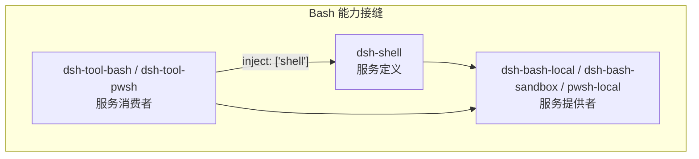
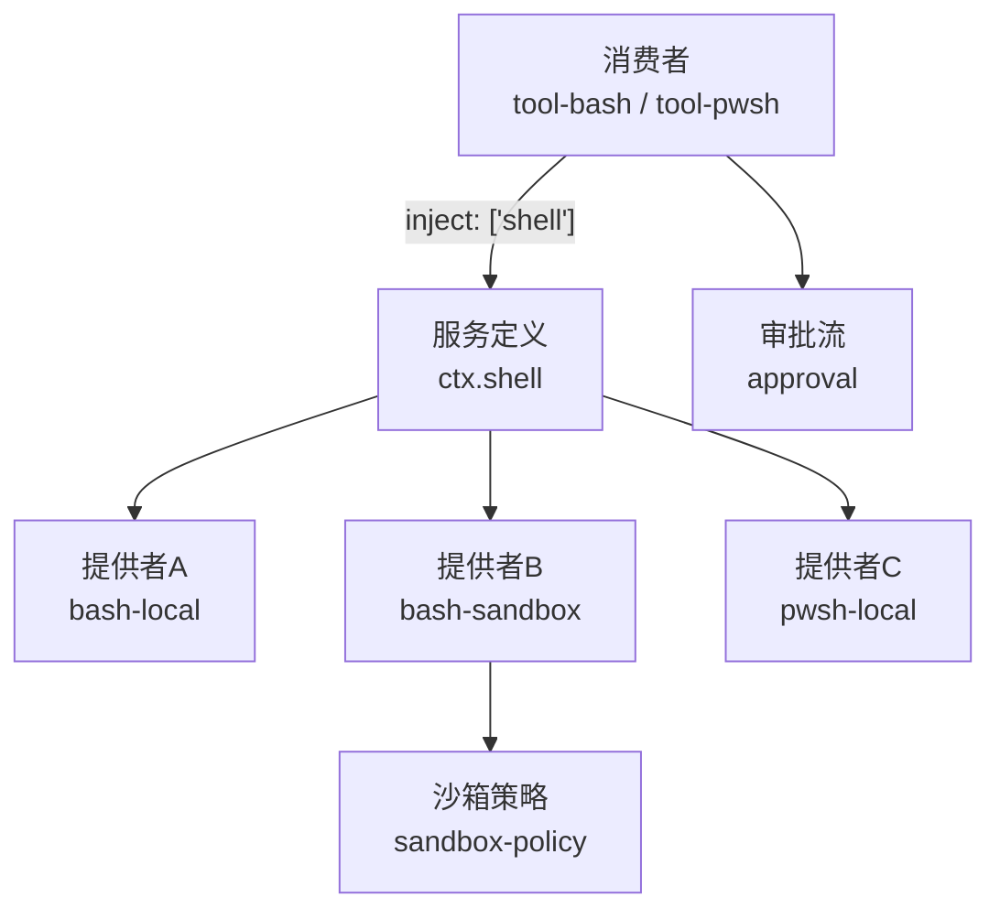
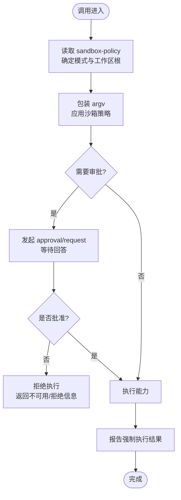
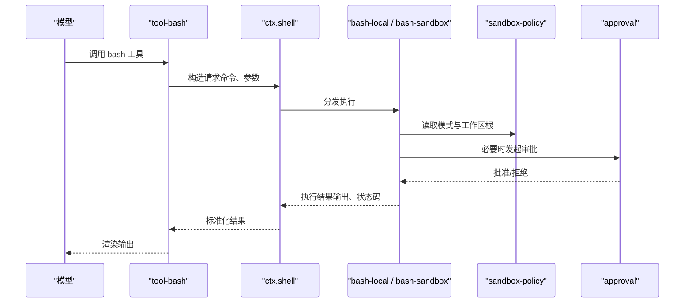
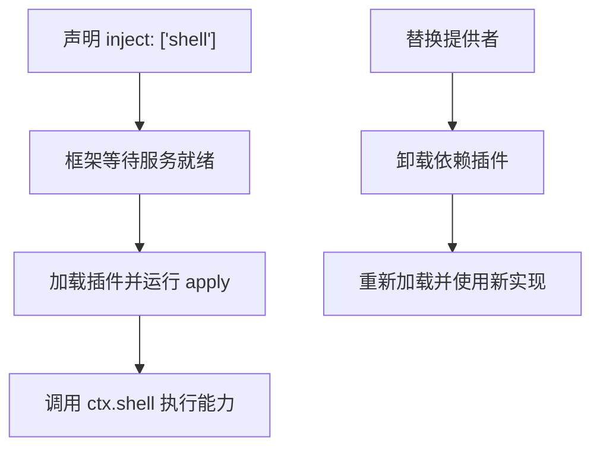
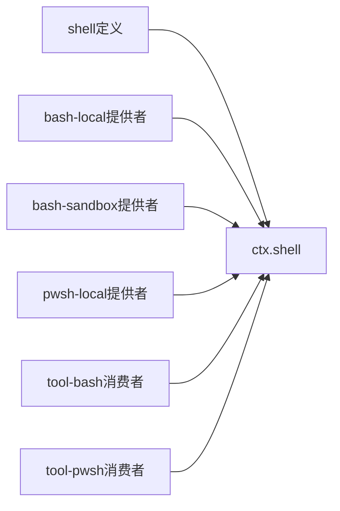

# 角色分离机制

<cite>
**本文引用的文件**
- [能力接缝与核心服务（英文）](file://docs/capability-seams.md)
- [能力接缝与核心服务（中文）](file://docs/capability-seams.zh.md)
- [能力的三种角色设计（英文）](file://docs/user/develop/practice/index.md)
- [能力的三种角色设计（中文）](file://docs/user/develop/practice/index.zh.md)
- [插件与服务教程：服务](file://docs/cordis-tutorial/03-services.md)
- [插件与服务教程：服务（中文）](file://docs/cordis-tutorial/03-services.zh.md)
- [Cordis 基础概念](file://docs/cordis-primer.md)
- [作用域注册子系统](file://docs/subsystems/scope.md)
- [权限预设子系统](file://docs/subsystems/permission-presets.md)
- [子代理委派策略捕获实现](file://packages/subagent/subagent/src/child-agent.ts)
- [子代理可延续策略继承测试](file://packages/subagent/subagent/tests/continuation-inheritance.spec.ts)
- [Web 权限与审批实现说明](file://.agents/notes/implemented/feature/2026-07-23-web-permission-and-approval.md)
- [信任边界与所有权规则（Agent Note）](file://.agents/notes/implemented/architecture/2026-07-12-agent-scope-runtime-design.md)
</cite>

## 目录
1. [简介](#简介)
2. [项目结构](#项目结构)
3. [核心组件](#核心组件)
4. [架构总览](#架构总览)
5. [详细组件分析](#详细组件分析)
6. [依赖关系分析](#依赖关系分析)
7. [性能考虑](#性能考虑)
8. [故障排查指南](#故障排查指南)
9. [结论](#结论)
10. [附录](#附录)

## 简介
本文件系统性阐述 DeepSeek Harness 中“能力接缝”的角色分离机制，聚焦三个角色——服务定义者、服务提供者、服务消费者——的职责边界、交互模式与安全保证。文档以 Bash 执行能力为贯穿示例，解释如何通过 Cordis 的服务注册与注入机制实现可替换实现、作用域隔离、权限控制与访问验证，并给出角色间通信协议与数据流转的图示化说明。同时总结最佳实践，帮助读者正确设计与使用角色分离。

## 项目结构
Harness 将“能力接缝”拆分为三块：
- 服务定义：声明 ctx 键、请求/结果类型与服务契约，通常是一个抽象类或具体注册服务。
- 服务提供者：实现或注册该服务的具体能力，如本地执行、沙箱执行、远程执行等。
- 服务消费者：面向模型与插件的调用面，通过 inject 声明对服务的依赖，不直接导入提供方类型。

下图展示了 Bash 能力在包层面的角色划分与依赖方向。

**图表来源**
- [能力接缝与核心服务（英文）:126-131](file://docs/capability-seams.md#L126-L131)
- [能力接缝与核心服务（中文）:128-133](file://docs/capability-seams.zh.md#L128-L133)
- [能力的三种角色设计（中文）:11-27](file://docs/user/develop/practice/index.zh.md#L11-L27)

**章节来源**
- [能力接缝与核心服务（英文）:1-472](file://docs/capability-seams.md#L1-L472)
- [能力接缝与核心服务（中文）:1-474](file://docs/capability-seams.zh.md#L1-L474)
- [能力的三种角色设计（中文）:1-156](file://docs/user/develop/practice/index.zh.md#L1-L156)

## 核心组件
- 服务定义（Service Definition）
  - 职责：拥有 ctx 键与领域词汇（请求/结果类型），对外暴露稳定的服务契约；可以是抽象类或具体注册服务，但不应是纯 TypeScript 接口。
  - 典型位置：shell 能力中的 ShellExecutor、ShellRunResult、ShellProcess 等类型与服务声明。
- 服务提供者（Service Provider）
  - 职责：提供具体实现，如本地进程执行、沙箱执行、远程执行；通过 Cordis 插件机制注册到服务定义。
  - 安全关注：按每次调用包装 argv、应用沙箱策略、报告强制执行结果。
- 服务消费者（Consumer）
  - 职责：面向模型与插件的能力入口，注册工具 schema、编排调用流程；仅依赖服务定义，不感知提供方细节。
  - 依赖管理：通过 inject 声明所需服务键，由框架保证加载顺序与可用性。

**章节来源**
- [能力的三种角色设计（英文）:7-27](file://docs/user/develop/practice/index.md#L7-L27)
- [能力的三种角色设计（中文）:7-27](file://docs/user/develop/practice/index.zh.md#L7-L27)
- [能力接缝与核心服务（中文）:448-454](file://docs/capability-seams.zh.md#L448-L454)

## 架构总览
下图从系统层面展示“能力接缝”的整体架构：服务定义作为契约中心，多个提供者并行实现同一契约，消费者通过注入消费稳定接口；安全与权限通过沙箱策略与审批流在关键边界处实施。

**图表来源**
- [能力接缝与核心服务（英文）:126-131](file://docs/capability-seams.md#L126-L131)
- [能力接缝与核心服务（中文）:448-456](file://docs/capability-seams.zh.md#L448-L456)

## 详细组件分析

### 角色职责与边界
- 服务定义者
  - 拥有 ctx 键与领域类型，确保消费者与提供者只依赖契约。
  - 避免引入实现细节，保持向后兼容与可替换性。
- 服务提供者
  - 负责具体执行路径（本地、沙箱、远程）。
  - 在每次调用时应用策略（如 argv 包装、文件系统限制、进程生命周期管理）。
- 服务消费者
  - 面向模型的工具注册与调用编排。
  - 通过 inject 声明依赖，不直接引用提供方类型。

**章节来源**
- [能力的三种角色设计（中文）:11-27](file://docs/user/develop/practice/index.zh.md#L11-L27)
- [能力接缝与核心服务（中文）:448-454](file://docs/capability-seams.zh.md#L448-L454)

### 插件架构中的安全边界
- 作用域隔离
  - 通过 ScopeKey 与 ScopedLayers 实现按 Agent 的作用域可见性与生命周期归属，确保注册与事件路由限定于特定作用域。
- 权限控制
  - 通过 sandbox-policy 统一保存部署默认模式与工作区根目录；bash 与 fs 两类强制执行组件读取该服务，避免不同根目录的限制冲突。
  - permission-presets 将沙箱模式与审批策略打包为预设，一次切换写入两个旋钮值，并在日志中记录用户意图。
- 访问验证
  - approval/request 瀑布式事件分派一次性权限决策；没有回答方时以不可用关闭失败。
  - 子代理委派时捕获父会话的策略覆盖，并将审批策略固定为 never，防止越权。

**图表来源**
- [能力接缝与核心服务（中文）:450-456](file://docs/capability-seams.zh.md#L450-L456)
- [权限预设子系统:44-68](file://docs/subsystems/permission-presets.md#L44-L68)
- [子代理委派策略捕获实现:177-204](file://packages/subagent/subagent/src/child-agent.ts#L177-L204)

**章节来源**
- [作用域注册子系统:1-60](file://docs/subsystems/scope.md#L1-L60)
- [权限预设子系统:1-132](file://docs/subsystems/permission-presets.md#L1-L132)
- [子代理委派策略捕获实现:177-204](file://packages/subagent/subagent/src/child-agent.ts#L177-L204)
- [子代理可延续策略继承测试:72-92](file://packages/subagent/subagent/tests/continuation-inheritance.spec.ts#L72-L92)
- [Web 权限与审批实现说明:1-13](file://.agents/notes/implemented/feature/2026-07-23-web-permission-and-approval.md#L1-L13)

### 核心服务与可替换能力接缝的区别
- 核心服务
  - 属于系统骨架（如 tools、sessions、systemPrompt），通常无多实现，承担横切能力。
- 可替换能力接缝
  - 具备明确的服务定义与多个提供者（如 shell、fs、web、subprocess），通过配置选择实现，消费者保持稳定。

**章节来源**
- [能力接缝与核心服务（中文）:414-471](file://docs/capability-seams.zh.md#L414-L471)

### 不同实现包如何提供相同接口的安全保证
- 所有提供者实现同一服务定义，消费者仅依赖定义。
- 执行前策略检查与包装（argv 包装、文件系统限制）在提供者层实施。
- 审批流在关键操作前进行一次性决策，未获批准则拒绝执行。
- 子代理委派时继承父策略并锁定审批策略，防止越权。

**章节来源**
- [能力接缝与核心服务（中文）:448-456](file://docs/capability-seams.zh.md#L448-L456)
- [子代理委派策略捕获实现:177-204](file://packages/subagent/subagent/src/child-agent.ts#L177-L204)

### 角色间通信协议与数据流转（以 Bash 为例）

**图表来源**
- [能力接缝与核心服务（中文）:448-456](file://docs/capability-seams.zh.md#L448-L456)
- [权限预设子系统:44-68](file://docs/subsystems/permission-presets.md#L44-L68)

**章节来源**
- [能力接缝与核心服务（中文）:448-456](file://docs/capability-seams.zh.md#L448-L456)
- [权限预设子系统:44-68](file://docs/subsystems/permission-presets.md#L44-L68)

### 角色间依赖关系的声明与管理机制
- 通过 Cordis 的 inject 声明服务依赖，框架保证依赖就绪后再加载插件。
- 服务替换时，依赖插件自动卸载并重新加载，避免持有过期引用。
- 上下文拦截（intercept）可为特定服务注入配置，支持细粒度行为调整。

**图表来源**
- [插件与服务教程：服务（中文）:59-78](file://docs/cordis-tutorial/03-services.zh.md#L59-L78)
- [Cordis 基础概念:7-13](file://docs/cordis-primer.md#L7-L13)

**章节来源**
- [插件与服务教程：服务（中文）:59-78](file://docs/cordis-tutorial/03-services.zh.md#L59-L78)
- [Cordis 基础概念:7-13](file://docs/cordis-primer.md#L7-L13)

### 代码级示例路径（不展示代码内容）
- 服务定义与提供者示例：
  - [能力的三种角色设计（中文）:60-109](file://docs/user/develop/practice/index.zh.md#L60-L109)
- 消费者示例：
  - [能力的三种角色设计（中文）:111-138](file://docs/user/develop/practice/index.zh.md#L111-L138)
- 组合配置示例：
  - [能力的三种角色设计（中文）:140-145](file://docs/user/develop/practice/index.zh.md#L140-L145)

**章节来源**
- [能力的三种角色设计（中文）:60-145](file://docs/user/develop/practice/index.zh.md#L60-L145)

## 依赖关系分析
下图汇总了 shell 相关服务与其提供者、消费者的依赖关系，体现“定义—提供者—消费者”的解耦结构。

**图表来源**
- [能力接缝与核心服务（英文）:126-131](file://docs/capability-seams.md#L126-L131)
- [能力接缝与核心服务（中文）:128-133](file://docs/capability-seams.zh.md#L128-L133)

**章节来源**
- [能力接缝与核心服务（英文）:1-472](file://docs/capability-seams.md#L1-L472)
- [能力接缝与核心服务（中文）:1-474](file://docs/capability-seams.zh.md#L1-L474)

## 性能考虑
- 服务替换的热插拔：依赖驱动加载与自动卸载减少重启成本，避免持有过期引用。
- 策略检查前置：在提供者层尽早应用沙箱策略，减少无效执行。
- 审批流最小化：仅在必要时发起审批，降低延迟。
- 作用域隔离：ScopedLayers 按需创建与回收，避免全局状态膨胀。

[本节为通用指导，无需特定文件来源]

## 故障排查指南
- 插件处于 PENDING 状态
  - 检查 inject 声明是否完整，确认所需服务已注册。
  - 查看 cordis.yml 中是否包含对应提供者。
- 服务替换后行为异常
  - 确认依赖插件已卸载并重新加载。
  - 检查 intercept 配置是否正确合并。
- 权限被拒绝
  - 检查 sandbox-policy 的模式与工作区根设置。
  - 查看 approval/request 事件流是否有回答方。
- 子代理越权
  - 确认委派时捕获了父策略覆盖，并将审批策略固定为 never。

**章节来源**
- [插件与服务教程：服务（中文）:59-78](file://docs/cordis-tutorial/03-services.zh.md#L59-L78)
- [权限预设子系统:44-68](file://docs/subsystems/permission-presets.md#L44-L68)
- [子代理委派策略捕获实现:177-204](file://packages/subagent/subagent/src/child-agent.ts#L177-L204)

## 结论
Harness 通过“服务定义—服务提供者—服务消费者”的角色分离，实现了能力接缝的可替换性与稳定性。结合作用域隔离、权限预设与审批流，系统在安全边界上提供了严格的访问控制与强制执行。依赖声明与动态加载机制确保了服务替换的平滑过渡，使不同实现包能够在同一契约下安全协作。遵循本文的最佳实践，可以设计出高内聚、低耦合且易于演进的能力模块。

[本节为总结，无需特定文件来源]

## 附录
- 术语
  - seam：完整能力（服务定义 + 一个或多个提供者 + 一个或多个消费者），不是单一角色。
  - 作用域：按 Agent 标识的可见性与生命周期归属。
  - 预设：将沙箱模式与审批策略打包为用户可选的安全级别。

**章节来源**
- [能力接缝与核心服务（中文）:414-471](file://docs/capability-seams.zh.md#L414-L471)
- [作用域注册子系统:1-60](file://docs/subsystems/scope.md#L1-L60)
- [权限预设子系统:1-132](file://docs/subsystems/permission-presets.md#L1-L132)