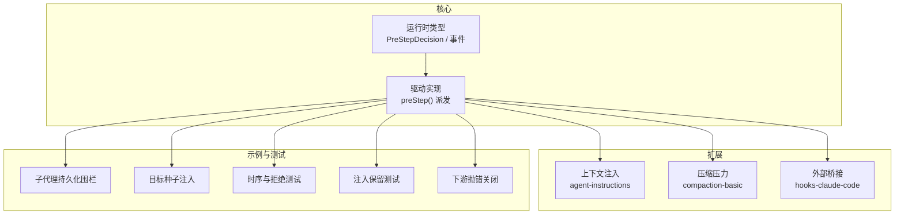
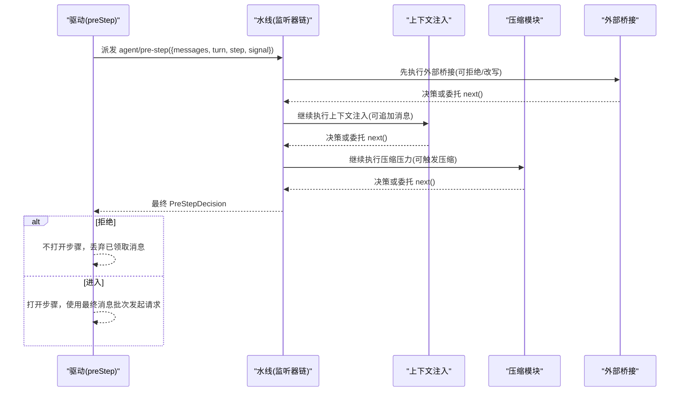
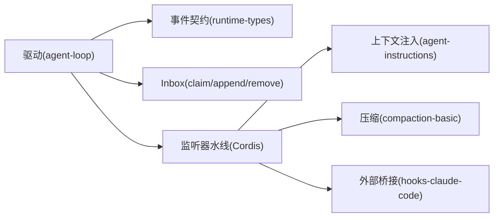

# Agent Pre-Step 钩子

<cite>
**本文引用的文件**
- [packages/core/agent/src/runtime-types.ts](file://packages/core/agent/src/runtime-types.ts)
- [packages/core/agent-loop/src/agent.ts](file://packages/core/agent-loop/src/agent.ts)
- [packages/context/agent-instructions/src/index.ts](file://packages/context/agent-instructions/src/index.ts)
- [packages/compaction/compaction-basic/src/index.ts](file://packages/compaction/compaction-basic/src/index.ts)
- [packages/hooks/hooks-claude-code/src/index.ts](file://packages/hooks/hooks-claude-code/src/index.ts)
- [examples/acp-agent/tests/fixtures/subagent-durability-failure.ts](file://examples/acp-agent/tests/fixtures/subagent-durability-failure.ts)
- [examples/headless-agent/tests/fixtures/goal-domain/seed-goal.ts](file://examples/headless-agent/tests/fixtures/goal-domain/seed-goal.ts)
- [packages/core/agent-loop/tests/loop.spec.ts](file://packages/core/agent-loop/tests/loop.spec.ts)
- [packages/core/agent-loop/tests/interception.spec.ts](file://packages/core/agent-loop/tests/interception.spec.ts)
- [packages/goal/goal-round-driver/tests/goal-round-driver.spec.ts](file://packages/goal/goal-round-driver/tests/goal-round-driver.spec.ts)
- [docs/subsystems/core.md](file://docs/subsystems/core.md)
</cite>

## 目录
1. [简介](#简介)
2. [项目结构](#项目结构)
3. [核心组件](#核心组件)
4. [架构总览](#架构总览)
5. [详细组件分析](#详细组件分析)
6. [依赖关系分析](#依赖关系分析)
7. [性能考量](#性能考量)
8. [故障排查指南](#故障排查指南)
9. [结论](#结论)
10. [附录](#附录)

## 简介
Agent Pre-Step 钩子是 Agent 在执行每个步骤之前触发的串行拦截点。它允许插件在“即将进入步骤”的时机对消息批次进行校验、改写或拒绝，从而实现输入验证、权限检查、日志记录、上下文注入、压缩触发等通用能力。该钩子在轮次内部、任何模型请求之前执行，是保证安全与一致性的关键扩展点。

## 项目结构
围绕 agent/pre-step 的关键代码分布在以下位置：
- 类型与事件契约：定义 PreStepDecision、agent/pre-step 事件签名与语义
- 驱动实现：在每步开始前声明式地派发 pre-step 并收集决策
- 典型用法：上下文注入、压缩压力、外部桥接（如 Claude Code）
- 测试用例：覆盖时序、拒绝、异常传播、注入保留等边界行为

图表来源
- [packages/core/agent/src/runtime-types.ts:219-231](file://packages/core/agent/src/runtime-types.ts#L219-L231)
- [packages/core/agent-loop/src/agent.ts:225-243](file://packages/core/agent-loop/src/agent.ts#L225-L243)
- [packages/context/agent-instructions/src/index.ts:322-348](file://packages/context/agent-instructions/src/index.ts#L322-L348)
- [packages/compaction/compaction-basic/src/index.ts:147-165](file://packages/compaction/compaction-basic/src/index.ts#L147-L165)
- [packages/hooks/hooks-claude-code/src/index.ts:217-235](file://packages/hooks/hooks-claude-code/src/index.ts#L217-L235)

章节来源
- [docs/subsystems/core.md:211-235](file://docs/subsystems/core.md#L211-L235)

## 核心组件
- PreStepDecision：决定进入步骤并附带消息，或直接拒绝不进入步骤
- agent/pre-step 事件：携带当前 Agent、被领取的消息批次、轮次/步骤坐标、取消信号；通过 next() 调用后续监听器并返回决策
- 驱动 preStep：在打开步骤前派发事件，合并系统上下文，将最终决策转为进入或拒绝

章节来源
- [packages/core/agent/src/runtime-types.ts:52-55](file://packages/core/agent/src/runtime-types.ts#L52-L55)
- [packages/core/agent/src/runtime-types.ts:219-231](file://packages/core/agent/src/runtime-types.ts#L219-L231)
- [packages/core/agent-loop/src/agent.ts:225-243](file://packages/core/agent-loop/src/agent.ts#L225-L243)

## 架构总览
下图展示了从驱动到监听器的完整调用链，以及决策如何影响步骤是否进入。

图表来源
- [packages/core/agent-loop/src/agent.ts:225-243](file://packages/core/agent-loop/src/agent.ts#L225-L243)
- [packages/hooks/hooks-claude-code/src/index.ts:217-235](file://packages/hooks/hooks-claude-code/src/index.ts#L217-L235)
- [packages/context/agent-instructions/src/index.ts:322-348](file://packages/context/agent-instructions/src/index.ts#L322-L348)
- [packages/compaction/compaction-basic/src/index.ts:147-165](file://packages/compaction/compaction-basic/src/index.ts#L147-L165)

## 详细组件分析

### 驱动侧：preStep 派发与决策合并
- 在 running 阶段为每个提议的步骤调用 preStep
- 从 inbox 中 claim 待处理消息作为 messages
- 组装系统上下文，并通过 waterflow 派发 agent/pre-step
- 若决策为 reject，则不打开步骤；若 enter，则将最终消息批次用于后续请求

章节来源
- [packages/core/agent-loop/src/agent.ts:225-243](file://packages/core/agent-loop/src/agent.ts#L225-L243)
- [docs/subsystems/core.md:211-235](file://docs/subsystems/core.md#L211-L235)

### 上下文注入：agent-instructions
- 在 pre-step 中等待投影稳定，读取 nextStep 中的工作区上下文
- 根据决策与步骤序号决定是否保留上下文到下一批或折叠进进入消息
- 确保直接提示在前、运行时上下文在后，避免顺序问题

章节来源
- [packages/context/agent-instructions/src/index.ts:322-348](file://packages/context/agent-instructions/src/index.ts#L322-L348)

### 压缩压力：compaction-basic
- 在每个 pre-step 检查是否需要压缩，避免上下文溢出
- 捕获配置错误并降级继续，不影响主流程
- 结合 request-error 做上下文溢出恢复与重试

章节来源
- [packages/compaction/compaction-basic/src/index.ts:147-165](file://packages/compaction/compaction-basic/src/index.ts#L147-L165)
- [packages/compaction/compaction-basic/src/index.ts:179-223](file://packages/compaction/compaction-basic/src/index.ts#L179-L223)

### 外部桥接：hooks-claude-code
- 将外部 UserPromptSubmit 映射为 PreStepDecision
- 支持 deny/ask/pass 三种决策，并在 enter 时追加上下文
- 保持与其他监听器的协作：先运行外部逻辑，再委托 next()

章节来源
- [packages/hooks/hooks-claude-code/src/index.ts:217-235](file://packages/hooks/hooks-claude-code/src/index.ts#L217-L235)

### 示例与测试要点
- 在 pre-step 中延迟创建目标或子代理，以对齐日志顺序与持久化
- 在 pre-step 中注入目标，使目标在首个真实步骤边界生效
- 验证 pre-step 仅对每个提议步骤触发一次，且在步骤打开之前
- 验证在 pre-step 开始之后提交的 inject 上下文不会被丢失或被拒绝步骤吞掉
- 验证下游监听器抛错会关闭整个步骤提案，不会进入模型请求

章节来源
- [examples/acp-agent/tests/fixtures/subagent-durability-failure.ts:109-117](file://examples/acp-agent/tests/fixtures/subagent-durability-failure.ts#L109-L117)
- [examples/headless-agent/tests/fixtures/goal-domain/seed-goal.ts:9-18](file://examples/headless-agent/tests/fixtures/goal-domain/seed-goal.ts#L9-L18)
- [packages/core/agent-loop/tests/loop.spec.ts:867-893](file://packages/core/agent-loop/tests/loop.spec.ts#L867-L893)
- [packages/core/agent-loop/tests/interception.spec.ts:423-456](file://packages/core/agent-loop/tests/interception.spec.ts#L423-L456)
- [packages/goal/goal-round-driver/tests/goal-round-driver.spec.ts:576-594](file://packages/goal/goal-round-driver/tests/goal-round-driver.spec.ts#L576-L594)

### 执行上下文、可用数据与返回值
- 上下文参数
  - agent：当前 Agent 实例，可用于读取状态、写入 inbox、发送 followup/steer/inject
  - messages：本次步骤被领取的消息批次（不可变），用于校验与改写
  - turn/step：轮次与步骤编号，便于定位与审计
  - signal：当前轮次的取消信号，所有异步操作应尊重其中止
- 返回值
  - { kind: 'reject' }：拒绝进入该步骤，已领取消息将被丢弃且不产生模型请求
  - { kind: 'enter'; messages: [...] }：进入步骤并使用新的消息批次（必须包含所有需要进入的内容）
- 调用约定
  - 必须调用 next() 以继续后续监听器；不调用会中断链路
  - 可在 next() 前后执行副作用（如日志、指标、前置检查）
  - 抛出异常会被视为失败，导致步骤提案被关闭

章节来源
- [packages/core/agent/src/runtime-types.ts:219-231](file://packages/core/agent/src/runtime-types.ts#L219-L231)
- [packages/core/agent/src/runtime-types.ts:52-55](file://packages/core/agent/src/runtime-types.ts#L52-L55)

### 常见使用模式与最佳实践
- 输入验证与权限检查
  - 在 pre-step 中校验 messages 的来源、内容白名单、敏感信息过滤
  - 基于 source.kind 或自定义元数据进行授权判断，必要时 reject
- 日志与审计
  - 在进入前记录请求摘要、用户意图、策略版本
  - 结合 agent/error 与 session 事件完成闭环审计
- 上下文注入
  - 使用 agent.inject 提交非阻塞上下文，或在 pre-step 中折叠进入消息
  - 注意步骤 1 且无消息时的特殊语义，避免产生空步骤请求
- 性能监控与压缩
  - 在 pre-step 中触发压缩压力，避免上下文溢出
  - 使用 token meter 与阈值控制压缩频率
- 异步与取消
  - 所有异步操作需检查 signal.aborted 或 await signal.throwIfAborted()
  - 长耗时任务应在 pre-step 中快速失败或退避
- 错误恢复
  - 捕获可恢复错误并降级继续；对不可恢复错误统一上报
  - 结合 agent/request-error 做重试或补偿

[本节为通用指导，无需具体文件引用]

## 依赖关系分析
- 驱动层依赖事件契约与 Inbox 的 claim/append/remove
- 各扩展通过 Cordis 事件机制注册监听器，形成串行水线
- 外部桥接将第三方决策映射为标准 PreStepDecision
- 测试覆盖时序、拒绝、异常传播、注入保留等行为

图表来源
- [packages/core/agent-loop/src/agent.ts:225-243](file://packages/core/agent-loop/src/agent.ts#L225-L243)
- [packages/core/agent/src/runtime-types.ts:219-231](file://packages/core/agent/src/runtime-types.ts#L219-L231)
- [packages/context/agent-instructions/src/index.ts:322-348](file://packages/context/agent-instructions/src/index.ts#L322-L348)
- [packages/compaction/compaction-basic/src/index.ts:147-165](file://packages/compaction/compaction-basic/src/index.ts#L147-L165)
- [packages/hooks/hooks-claude-code/src/index.ts:217-235](file://packages/hooks/hooks-claude-code/src/index.ts#L217-L235)

章节来源
- [docs/subsystems/core.md:211-235](file://docs/subsystems/core.md#L211-L235)

## 性能考量
- 预检尽量轻量：避免在 pre-step 中进行昂贵 I/O；必要时异步但需考虑超时与取消
- 批量处理：合并多次注入或压缩决策，减少重复计算
- 缓存与去重：对相同上下文的合成结果进行缓存，避免重复 compose
- 节流与退避：压缩与重试遵循策略，避免风暴
- 观测性：通过事件与指标记录 pre-step 耗时、拒绝率、改写次数

[本节为通用指导，无需具体文件引用]

## 故障排查指南
- 步骤未进入
  - 检查是否有监听器返回 reject
  - 查看下游监听器是否抛错导致关闭
- 上下文丢失
  - 确认是否在 pre-step 后正确折叠或保留注入上下文
  - 注意步骤 1 且无消息的特殊路径
- 异步卡住
  - 检查 signal 是否被忽略或未正确传播
  - 确认 await 链是否受取消影响
- 压缩未触发
  - 检查阈值与测量是否正确
  - 查看 request-error 是否走对了恢复路径

章节来源
- [packages/goal/goal-round-driver/tests/goal-round-driver.spec.ts:576-594](file://packages/goal/goal-round-driver/tests/goal-round-driver.spec.ts#L576-L594)
- [packages/core/agent-loop/tests/interception.spec.ts:423-456](file://packages/core/agent-loop/tests/interception.spec.ts#L423-L456)
- [packages/compaction/compaction-basic/src/index.ts:179-223](file://packages/compaction/compaction-basic/src/index.ts#L179-L223)

## 结论
Agent Pre-Step 钩子提供了在步骤执行前的强一致性拦截能力。通过标准决策类型与水线机制，插件可以在同一扩展点实现验证、权限、日志、注入、压缩等多种职责。遵循取消语义、错误隔离与性能约束，可以构建安全、可观测且高效的 Agent 执行流水线。

## 附录
- 参考文档
  - 核心子系统说明与拦截决策
  - 运行时类型与事件契约
- 相关测试
  - 时序、拒绝、异常传播、注入保留等场景

章节来源
- [docs/subsystems/core.md:211-235](file://docs/subsystems/core.md#L211-L235)
- [packages/core/agent/src/runtime-types.ts:219-231](file://packages/core/agent/src/runtime-types.ts#L219-L231)
- [packages/core/agent-loop/tests/loop.spec.ts:867-893](file://packages/core/agent-loop/tests/loop.spec.ts#L867-L893)
- [packages/core/agent-loop/tests/interception.spec.ts:423-456](file://packages/core/agent-loop/tests/interception.spec.ts#L423-L456)
- [packages/goal/goal-round-driver/tests/goal-round-driver.spec.ts:576-594](file://packages/goal/goal-round-driver/tests/goal-round-driver.spec.ts#L576-L594)