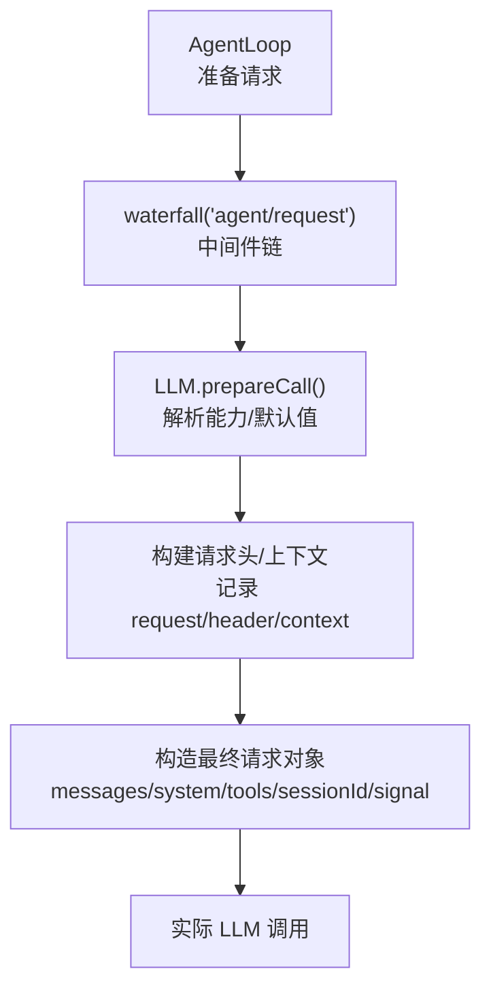
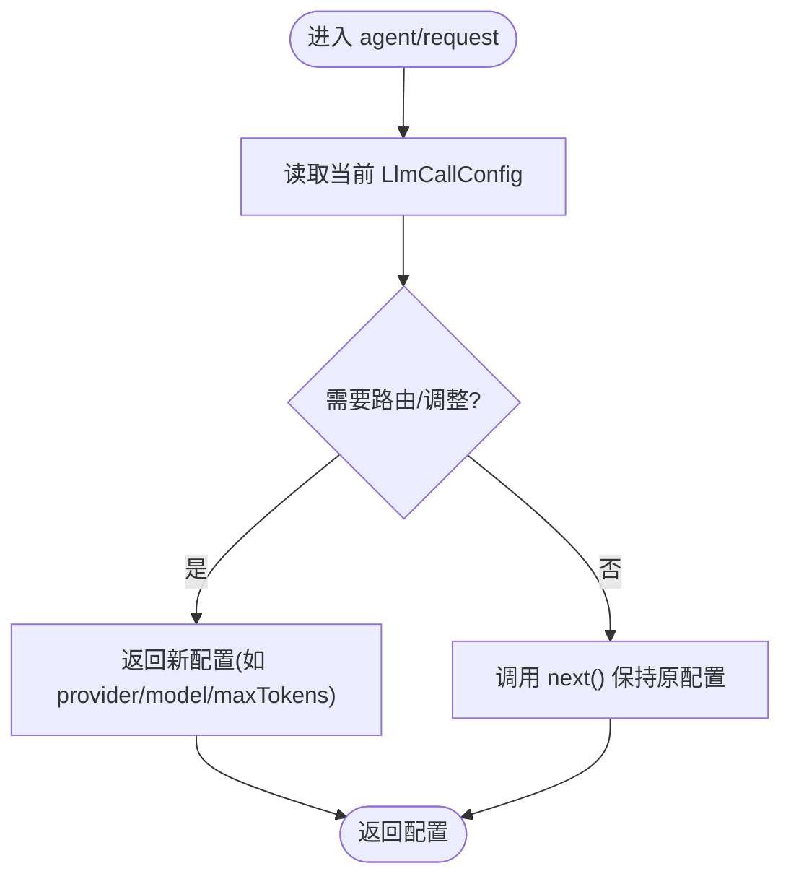
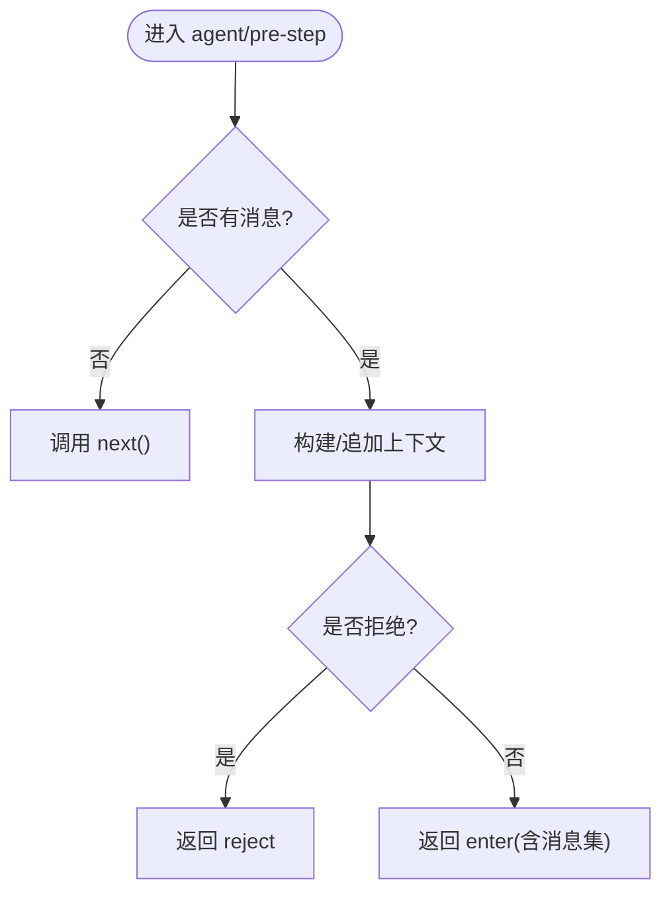
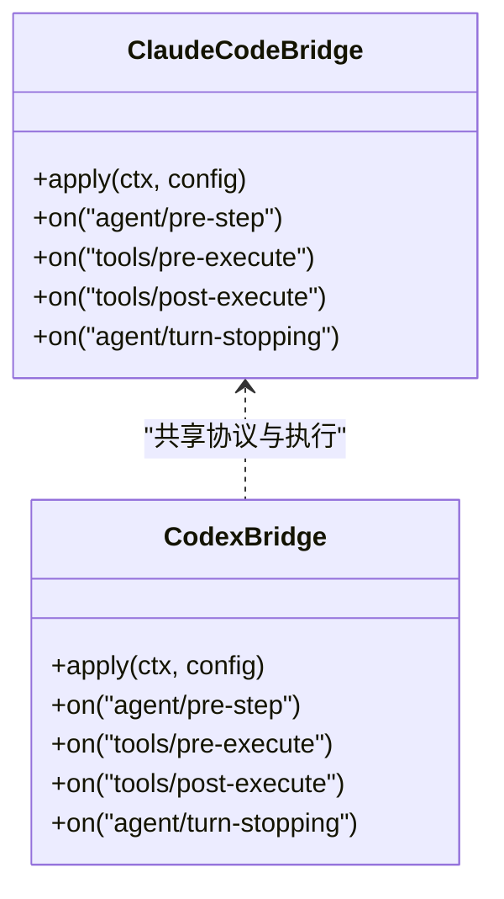
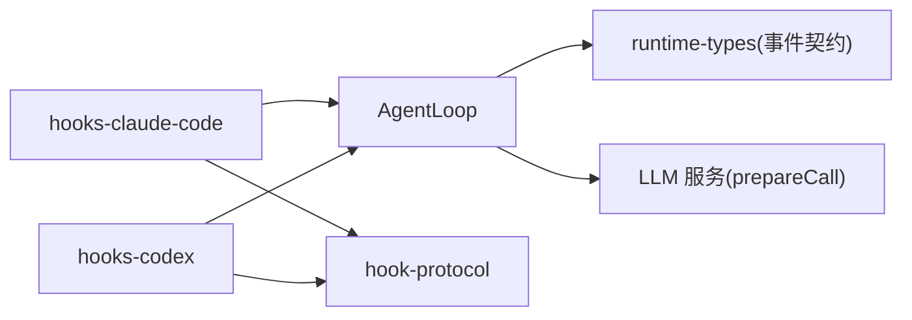

# Agent Request 钩子

<cite>
**本文引用的文件**
- [packages/core/agent/src/runtime-types.ts](file://packages/core/agent/src/runtime-types.ts)
- [packages/core/agent-loop/src/agent.ts](file://packages/core/agent-loop/src/agent.ts)
- [packages/hooks/hook-protocol/src/types.ts](file://packages/hooks/hook-protocol/src/types.ts)
- [packages/hooks/hook-protocol/src/events.ts](file://packages/hooks/hook-protocol/src/events.ts)
- [packages/hooks/hooks-codex/src/index.ts](file://packages/hooks/hooks-codex/src/index.ts)
- [packages/hooks/hooks-claude-code/src/index.ts](file://packages/hooks/hooks-claude-code/src/index.ts)
- [packages/llm/llm/src/index.ts](file://packages/llm/llm/src/index.ts)
- [packages/core/agent/src/dispatch.ts](file://packages/core/agent/src/dispatch.ts)
- [packages/core/agent-loop/tests/coverage-edges.spec.ts](file://packages/core/agent-loop/tests/coverage-edges.spec.ts)
- [packages/core/agent-loop/tests/request-error.spec.ts](file://packages/core/agent-loop/tests/request-error.spec.ts)
</cite>

## 目录
1. [简介](#简介)
2. [项目结构](#项目结构)
3. [核心组件](#核心组件)
4. [架构总览](#架构总览)
5. [详细组件分析](#详细组件分析)
6. [依赖关系分析](#依赖关系分析)
7. [性能考量](#性能考量)
8. [故障排查指南](#故障排查指南)
9. [结论](#结论)
10. [附录](#附录)

## 简介
本文件聚焦于 Agent Request 钩子在 LLM 请求发送前后的触发时机与用途，系统说明如何通过监听 agent/request 钩子拦截并修改 AI 请求，涵盖消息重写、上下文增强、请求路由等场景。文档同时解释钩子的执行顺序、请求拦截机制与响应后处理策略，并提供常见使用模式与最佳实践（如请求缓存、格式转换、敏感信息过滤）的实现思路与参考路径。

## 项目结构
围绕 agent/request 钩子的关键代码分布在以下模块：
- 事件类型与扩展点定义：Agent 运行时事件声明了 agent/request 的入参与返回值，以及错误恢复事件 agent/request-error。
- 调用链路与钩子触发点：AgentLoop 在准备模型调用前通过 waterfall 调度 agent/request，随后进行 header 构建、上下文记录与最终请求构造。
- 钩子桥接实现：hooks-claude-code 与 hooks-codex 将外部命令式 hook 映射到 harness 的扩展点，并在 pre-step 阶段注入上下文或拒绝步骤；它们也展示了如何在会话启动时注入额外上下文。
- LLM 适配层：prepareCall 负责解析模型能力、默认参数与适配器默认值，确保后续流式调用的一致性。
- 分发机制：agent 作用域下的 waterfall/serial/emit 分发器保证中间件链的执行顺序与作用域隔离。



图表来源
- [packages/core/agent-loop/src/agent.ts:417-496](file://packages/core/agent-loop/src/agent.ts#L417-L496)
- [packages/llm/llm/src/index.ts:779-798](file://packages/llm/llm/src/index.ts#L779-L798)

章节来源
- [packages/core/agent/src/runtime-types.ts:232-260](file://packages/core/agent/src/runtime-types.ts#L232-L260)
- [packages/core/agent-loop/src/agent.ts:417-496](file://packages/core/agent-loop/src/agent.ts#L417-L496)
- [packages/llm/llm/src/index.ts:779-798](file://packages/llm/llm/src/index.ts#L779-L798)

## 核心组件
- agent/request 钩子
  - 触发时机：在每次准备发起 LLM 请求之前，由 AgentLoop 以 waterfall 形式调度。
  - 输入：包含 agent、turn、step、signal 的负载。
  - 输出：可返回新的 LlmCallConfig，用于切换 provider/model 或调整 maxTokens、reasoningEffort 等。
  - 限制：不能直接修改消息内容；如需改写消息，应在 pre-step 阶段完成。
- agent/pre-step 钩子
  - 触发时机：在每步开始前，决定是否进入该步骤以及进入时的消息集合。
  - 用途：消息重写、上下文增强、基于规则的拒绝/放行。
- agent/request-error 钩子
  - 触发时机：当一次 LLM 请求失败时，在重试或关闭步骤前被调度。
  - 用途：自定义恢复策略（如重试），或记录/上报错误。

章节来源
- [packages/core/agent/src/runtime-types.ts:232-260](file://packages/core/agent/src/runtime-types.ts#L232-L260)
- [packages/core/agent-loop/src/agent.ts:417-496](file://packages/core/agent-loop/src/agent.ts#L417-L496)

## 架构总览
下图展示从用户输入到 LLM 调用的完整流程，突出 agent/request 钩子在请求前的拦截位置，以及与 pre-step、request-error 的关系。

```mermaid
sequenceDiagram
participant User as "用户"
participant Loop as "AgentLoop"
participant Hooks as "中间件链(agent/pre-step, agent/request)"
participant LLM as "LLM 服务"
participant Adapter as "适配器(Provider/Model)"
User->>Loop : 提交消息/指令
Loop->>Hooks : 触发 agent/pre-step (可重写消息/拒绝)
Hooks-->>Loop : 决定进入步骤的消息集
Loop->>Hooks : 触发 agent/request (可改配置/路由)
Hooks-->>Loop : 返回最终 LlmCallConfig
Loop->>Adapter : prepareCall(解析能力/默认值)
Adapter-->>Loop : 返回 PreparedLlmCall
Loop->>LLM : 发送请求(messages/system/tools/sessionId/signal)
LLM-->>Loop : 返回结果/流
Note over Loop : 若失败则触发 agent/request-error
```

图表来源
- [packages/core/agent-loop/src/agent.ts:417-496](file://packages/core/agent-loop/src/agent.ts#L417-L496)
- [packages/core/agent/src/runtime-types.ts:232-260](file://packages/core/agent/src/runtime-types.ts#L232-L260)
- [packages/llm/llm/src/index.ts:779-798](file://packages/llm/llm/src/index.ts#L779-L798)

## 详细组件分析

### agent/request 钩子：触发时机与职责
- 触发点：AgentLoop 在构建请求头与上下文之前，先通过 waterfall 调度 agent/request，允许中间件链对请求配置进行最终决策。
- 可修改项：provider、model、maxTokens、reasoningEffort 等 LlmCallConfig 字段。
- 不可修改项：消息内容需在 pre-step 阶段处理；此处仅能改变“如何调用”，不能改变“调用什么”。
- 典型用途：
  - 动态路由：根据 turn/step 或信号选择不同 provider/model。
  - 上下文增强：结合 pre-step 注入的上下文，调整推理强度或最大 token。
  - 请求缓存键生成：基于配置与消息摘要生成缓存键（缓存逻辑可在中间件内实现）。



图表来源
- [packages/core/agent/src/runtime-types.ts:232-244](file://packages/core/agent/src/runtime-types.ts#L232-L244)
- [packages/core/agent-loop/src/agent.ts:417-496](file://packages/core/agent-loop/src/agent.ts#L417-L496)

章节来源
- [packages/core/agent/src/runtime-types.ts:232-244](file://packages/core/agent/src/runtime-types.ts#L232-L244)
- [packages/core/agent-loop/src/agent.ts:417-496](file://packages/core/agent-loop/src/agent.ts#L417-L496)

### agent/pre-step 钩子：消息重写与上下文增强
- 触发点：每步开始前，决定是否进入该步骤及进入时的消息集合。
- 典型用法：
  - 消息重写：替换或追加系统提示、工具约束、安全策略等。
  - 上下文增强：将外部知识、会话摘要、权限策略注入为附加消息。
  - 拒绝步骤：当检测到违规或无意义输入时直接拒绝。
- 与 request 钩子协作：pre-step 负责“内容”，request 负责“配置”。



图表来源
- [packages/hooks/hooks-claude-code/src/index.ts:217-235](file://packages/hooks/hooks-claude-code/src/index.ts#L217-L235)
- [packages/hooks/hooks-codex/src/index.ts:198-222](file://packages/hooks/hooks-codex/src/index.ts#L198-L222)

章节来源
- [packages/hooks/hooks-claude-code/src/index.ts:217-235](file://packages/hooks/hooks-claude-code/src/index.ts#L217-L235)
- [packages/hooks/hooks-codex/src/index.ts:198-222](file://packages/hooks/hooks-codex/src/index.ts#L198-L222)

### agent/request-error 钩子：失败恢复与重试
- 触发点：当一次 LLM 请求失败时，在重试或关闭步骤前调度。
- 行为：
  - 不调用 next() 且返回 { kind: 'retry' }：表示自行处理恢复（例如重试）。
  - 调用 next()：委托给后续监听器或默认行为（通常终止）。
- 注意：中间件抛出的异常不会被视为可恢复的请求错误，因此不要在 request 钩子中抛出业务异常来触发此钩子。

```mermaid
sequenceDiagram
participant Loop as "AgentLoop"
participant Hook as "agent/request-error"
participant Adapter as "适配器"
Loop->>Adapter : 发起请求
Adapter-->>Loop : 失败
Loop->>Hook : 调度错误处理
alt 自定义恢复
Hook-->>Loop : { kind : 'retry' }
Loop->>Adapter : 重试
else 委托默认
Hook-->>Loop : undefined
Loop-->>Loop : 关闭步骤/结束
end
```

图表来源
- [packages/core/agent/src/runtime-types.ts:245-260](file://packages/core/agent/src/runtime-types.ts#L245-L260)
- [packages/core/agent-loop/tests/request-error.spec.ts:30-48](file://packages/core/agent-loop/tests/request-error.spec.ts#L30-L48)

章节来源
- [packages/core/agent/src/runtime-types.ts:245-260](file://packages/core/agent/src/runtime-types.ts#L245-L260)
- [packages/core/agent-loop/tests/request-error.spec.ts:30-48](file://packages/core/agent-loop/tests/request-error.spec.ts#L30-L48)

### 钩子桥接：Claude Code 与 Codex
- Claude Code 桥接
  - 在 agent/pre-step 中，将外部命令式 hook 的输出转换为附加上下文，并在 deny 时拒绝步骤。
  - 支持 tools/pre-execute/post-execute 的阻断与反馈。
  - 在 agent/turn-stopping 时，Stop 钩子可强制继续。
- Codex 桥接
  - 类似地，在 pre-step 注入上下文或拒绝步骤；在工具前后提供阻断与上下文追加。
  - 同样在 turn-stopping 边界处理 Stop 钩子。



图表来源
- [packages/hooks/hooks-claude-code/src/index.ts:191-277](file://packages/hooks/hooks-claude-code/src/index.ts#L191-L277)
- [packages/hooks/hooks-codex/src/index.ts:174-270](file://packages/hooks/hooks-codex/src/index.ts#L174-L270)
- [packages/hooks/hook-protocol/src/types.ts:89-137](file://packages/hooks/hook-protocol/src/types.ts#L89-L137)
- [packages/hooks/hook-protocol/src/events.ts:70-104](file://packages/hooks/hook-protocol/src/events.ts#L70-L104)

章节来源
- [packages/hooks/hooks-claude-code/src/index.ts:191-277](file://packages/hooks/hooks-claude-code/src/index.ts#L191-L277)
- [packages/hooks/hooks-codex/src/index.ts:174-270](file://packages/hooks/hooks-codex/src/index.ts#L174-L270)
- [packages/hooks/hook-protocol/src/types.ts:89-137](file://packages/hooks/hook-protocol/src/types.ts#L89-L137)
- [packages/hooks/hook-protocol/src/events.ts:70-104](file://packages/hooks/hook-protocol/src/events.ts#L70-L104)

### 请求头与上下文记录
- AgentLoop 在请求前会构建 canonical header，并记录 request/header 与 request/context，便于审计与调试。
- 这些记录有助于追踪 provider/model 变化、上下文窗口变更以及系统提示/工具的变更。

章节来源
- [packages/core/agent-loop/src/agent.ts:458-483](file://packages/core/agent-loop/src/agent.ts#L458-L483)

### 中间件分发与执行顺序
- agent 作用域内的 waterfall/serial/emit 分发器确保中间件按注册顺序执行，且每个监听器的异常被隔离，避免影响后续监听器。
- 对于 agent/request，waterfall 的 next() 代表默认行为；返回新配置即覆盖默认。

章节来源
- [packages/core/agent/src/dispatch.ts:49-96](file://packages/core/agent/src/dispatch.ts#L49-L96)

## 依赖关系分析
- AgentLoop 依赖 LLM 服务进行能力解析与默认值填充，并通过 prepareCall 锁定一次调用的适配器注册，避免 HMR 导致的错配。
- 钩子桥接依赖 hook-protocol 的统一执行与结果合并，确保不同方言（Claude/Codex）的行为一致。
- runtime-types 定义了 agent 生命周期与扩展点的事件契约，确保各模块间接口稳定。



图表来源
- [packages/core/agent/src/runtime-types.ts:232-260](file://packages/core/agent/src/runtime-types.ts#L232-L260)
- [packages/llm/llm/src/index.ts:779-798](file://packages/llm/llm/src/index.ts#L779-L798)
- [packages/hooks/hooks-claude-code/src/index.ts:191-277](file://packages/hooks/hooks-claude-code/src/index.ts#L191-L277)
- [packages/hooks/hooks-codex/src/index.ts:174-270](file://packages/hooks/hooks-codex/src/index.ts#L174-L270)

章节来源
- [packages/core/agent/src/runtime-types.ts:232-260](file://packages/core/agent/src/runtime-types.ts#L232-L260)
- [packages/llm/llm/src/index.ts:779-798](file://packages/llm/llm/src/index.ts#L779-L798)
- [packages/hooks/hooks-claude-code/src/index.ts:191-277](file://packages/hooks/hooks-claude-code/src/index.ts#L191-L277)
- [packages/hooks/hooks-codex/src/index.ts:174-270](file://packages/hooks/hooks-codex/src/index.ts#L174-L270)

## 性能考量
- 中间件链应尽量轻量，避免在 agent/request 中进行昂贵计算；必要时使用缓存或异步预取。
- 使用 signal 感知取消，及时中止耗时操作，避免阻塞主循环。
- 合理设置 maxTokens 与 reasoningEffort，减少不必要的长文本与高推理开销。
- 利用 request/header 与 request/context 记录进行监控与采样，定位瓶颈。

[本节为通用指导，无需具体文件引用]

## 故障排查指南
- 中间件异常不影响后续监听器：waterfall 会将同步异常与异步拒绝隔离，确保链路健壮。
- 非 Error 抛出不视为可恢复请求错误：测试表明，agent/request 中的非 Error 抛出不会被 request-error 捕获。
- 请求错误恢复：仅在 adapter 边界产生的失败才会触发 request-error；可通过返回 { kind: 'retry' } 实现自定义重试。

章节来源
- [packages/core/agent-loop/tests/coverage-edges.spec.ts:140-152](file://packages/core/agent-loop/tests/coverage-edges.spec.ts#L140-L152)
- [packages/core/agent-loop/tests/request-error.spec.ts:30-48](file://packages/core/agent-loop/tests/request-error.spec.ts#L30-L48)

## 结论
agent/request 钩子是 LLM 请求前的关键拦截点，适合进行路由、配置优化与缓存键生成；消息重写与上下文增强应在 agent/pre-step 完成；失败恢复通过 agent/request-error 实现。结合 hook-bridge（Claude/Codex）可将外部命令式 hook 无缝接入 harness 扩展点，形成统一的请求治理与审计体系。遵循上述模式与最佳实践，可实现高性能、可观测、可扩展的 AI 请求管线。

## 附录

### 常见使用模式与最佳实践
- 请求缓存
  - 在 agent/request 中基于 provider/model/messages/system/tools 生成缓存键，命中则直接返回结果（需绕过 LLM 调用）。
  - 注意：缓存键应包含 signal 与 sessionId，避免跨会话污染。
- 格式转换
  - 在 pre-step 中将多模态内容统一为模型期望的格式；在 request 中调整 maxTokens 与 stop 序列。
- 敏感信息过滤
  - 在 pre-step 中对消息进行脱敏；在 request 中屏蔽不必要的工具或系统提示。
- 请求路由
  - 根据 turn/step 或信号动态选择 provider/model，实现灰度、A/B 或成本优化。
- 上下文增强
  - 在 pre-step 注入会话摘要、权限策略、工具约束；在 request 中调整推理强度。
- 失败恢复
  - 在 request-error 中实现指数退避重试、降级到备用模型或上报告警。

[本节为通用指导，无需具体文件引用]