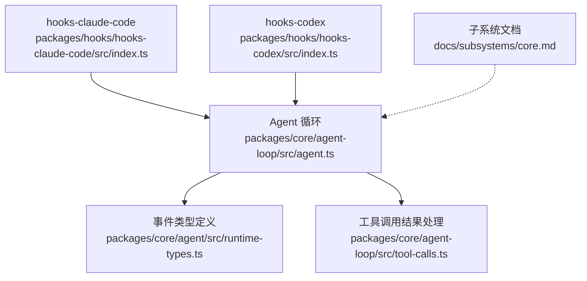
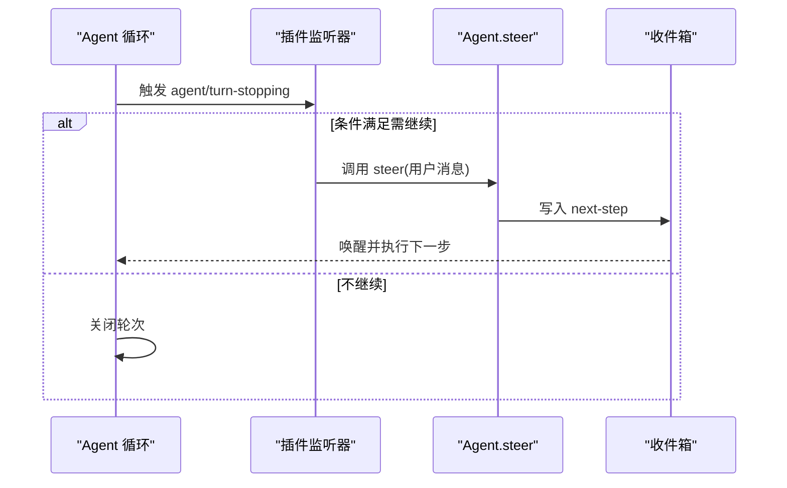
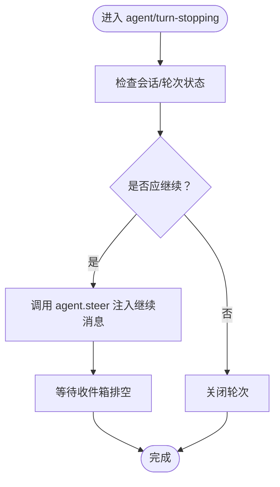
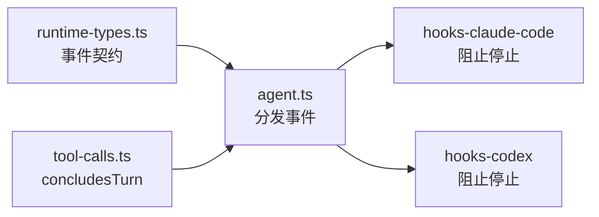

# Agent Turn Stopping 钩子

<cite>
**本文引用的文件**
- [packages/core/agent/src/runtime-types.ts](file://packages/core/agent/src/runtime-types.ts)
- [packages/core/agent-loop/src/agent.ts](file://packages/core/agent-loop/src/agent.ts)
- [packages/core/agent-loop/src/tool-calls.ts](file://packages/core/agent-loop/src/tool-calls.ts)
- [packages/hooks/hooks-claude-code/src/index.ts](file://packages/hooks/hooks-claude-code/src/index.ts)
- [packages/hooks/hooks-codex/src/index.ts](file://packages/hooks/hooks-codex/src/index.ts)
- [docs/subsystems/core.md](file://docs/subsystems/core.md)
- [packages/core/agent-loop/tests/loop.spec.ts](file://packages/core/agent-loop/tests/loop.spec.ts)
- [packages/core/agent-loop/tests/contract-regressions.spec.ts](file://packages/core/agent-loop/tests/contract-regressions.spec.ts)
- [packages/core/agent-loop/tests/cancel.spec.ts](file://packages/core/agent-loop/tests/cancel.spec.ts)
- [packages/core/tools/src/index.ts](file://packages/core/tools/src/index.ts)
</cite>

## 目录
1. [简介](#简介)
2. [项目结构](#项目结构)
3. [核心组件](#核心组件)
4. [架构总览](#架构总览)
5. [详细组件分析](#详细组件分析)
6. [依赖关系分析](#依赖关系分析)
7. [性能考量](#性能考量)
8. [故障排查指南](#故障排查指南)
9. [结论](#结论)
10. [附录](#附录)

## 简介
本文件围绕 agent/turn-stopping 钩子，系统说明其在对话轮次停止时的触发时机、用途与决策机制。该钩子在“模型不再欠响应”的边界处串行触发，允许插件在轮次关闭前进行条件判断、状态检查与流程干预（例如通过 steer 强制继续）。文档同时给出常见使用模式与最佳实践，包括对话管理、资源清理、状态持久化等。

## 项目结构
与 turn-stopping 相关的代码分布在以下位置：
- 事件类型定义与契约：packages/core/agent/src/runtime-types.ts
- 轮次循环与边界调度：packages/core/agent-loop/src/agent.ts
- 工具调用对轮次结束的标记：packages/core/agent-loop/src/tool-calls.ts
- 钩子实现示例（阻止停止并继续）：packages/hooks/hooks-claude-code/src/index.ts、packages/hooks/hooks-codex/src/index.ts
- 官方子系统文档：docs/subsystems/core.md
- 行为验证测试：packages/core/agent-loop/tests/*.spec.ts



图表来源
- [packages/core/agent-loop/src/agent.ts:99-132](file://packages/core/agent-loop/src/agent.ts#L99-L132)
- [packages/core/agent/src/runtime-types.ts:268-278](file://packages/core/agent/src/runtime-types.ts#L268-L278)
- [packages/core/agent-loop/src/tool-calls.ts:36-157](file://packages/core/agent-loop/src/tool-calls.ts#L36-L157)
- [packages/hooks/hooks-claude-code/src/index.ts:267-277](file://packages/hooks/hooks-claude-code/src/index.ts#L267-L277)
- [packages/hooks/hooks-codex/src/index.ts:255-270](file://packages/hooks/hooks-codex/src/index.ts#L255-L270)
- [docs/subsystems/core.md:994-1017](file://docs/subsystems/core.md#L994-L1017)

章节来源
- [packages/core/agent/src/runtime-types.ts:268-278](file://packages/core/agent/src/runtime-types.ts#L268-L278)
- [packages/core/agent-loop/src/agent.ts:99-132](file://packages/core/agent-loop/src/agent.ts#L99-L132)
- [packages/core/agent-loop/src/tool-calls.ts:36-157](file://packages/core/agent-loop/src/tool-calls.ts#L36-L157)
- [packages/hooks/hooks-claude-code/src/index.ts:267-277](file://packages/hooks/hooks-claude-code/src/index.ts#L267-L277)
- [packages/hooks/hooks-codex/src/index.ts:255-270](file://packages/hooks/hooks-codex/src/index.ts#L255-L270)
- [docs/subsystems/core.md:994-1017](file://docs/subsystems/core.md#L994-L1017)

## 核心组件
- 事件契约：agent/turn-stopping 为串行事件，携带当前 agent、轮次号与中止信号；监听器可在此时进行数据驱动的决策。
- 轮次边界：当模型不再欠响应（无活跃工具调用、无新 steering）时，进入 stopping 边界；若监听器通过 steer 注入消息，机器会重新读取收件箱并执行下一步，否则关闭轮次。
- 工具侧终止：工具可通过 concludeTurn 标记本轮结束，属于“数据即控制”的反向控制方式。
- 钩子实现：hooks-claude-code 与 hooks-codex 在 turn-stopping 中调用外部点（Stop），若外部决定拒绝停止，则通过 steer 强制继续。

章节来源
- [packages/core/agent/src/runtime-types.ts:268-278](file://packages/core/agent/src/runtime-types.ts#L268-L278)
- [docs/subsystems/core.md:994-1017](file://docs/subsystems/core.md#L994-L1017)
- [packages/core/agent-loop/src/tool-calls.ts:36-157](file://packages/core/agent-loop/src/tool-calls.ts#L36-L157)
- [packages/hooks/hooks-claude-code/src/index.ts:267-277](file://packages/hooks/hooks-claude-code/src/index.ts#L267-L277)
- [packages/hooks/hooks-codex/src/index.ts:255-270](file://packages/hooks/hooks-codex/src/index.ts#L255-L270)

## 架构总览
下图展示了 turn-stopping 在轮次生命周期中的位置，以及它与 steer/inject/followup、工具调用、取消/中止的关系。

```mermaid
sequenceDiagram
participant Loop as "Agent 循环"
participant Hook as "插件监听器(agent/turn-stopping)"
participant Tool as "工具执行"
participant Inbox as "收件箱(steer/inject/followup)"
Note over Loop,Tool : 模型不再欠响应，进入 stopping 边界
Loop->>Hook : 触发 agent/turn-stopping({agent, turn, signal})
alt 监听器选择继续
Hook->>Inbox : agent.steer(...)
Inbox-->>Loop : 下一轮步骤被唤醒
Loop->>Loop : 重新读取收件箱并执行下一步
else 监听器不干预
Loop->>Loop : 关闭当前轮次
end
Note over Tool,Loop : 工具也可通过 concludesTurn 提前结束轮次
```

图表来源
- [packages/core/agent-loop/src/agent.ts:99-132](file://packages/core/agent-loop/src/agent.ts#L99-L132)
- [packages/core/agent/src/runtime-types.ts:268-278](file://packages/core/agent/src/runtime-types.ts#L268-L278)
- [packages/core/agent-loop/src/tool-calls.ts:36-157](file://packages/core/agent-loop/src/tool-calls.ts#L36-L157)

## 详细组件分析

### 事件契约与触发时机
- 触发时机：轮次即将关闭，模型不再欠响应（无活跃工具调用、无新 steering）。
- 参数：包含当前 agent、轮次号与当前轮次的中止信号。
- 语义：监听器是串行执行的；若监听器通过 steer 注入消息，机器将重新读取收件箱并执行下一步，否则关闭轮次。
- 反向控制：工具可通过 concludesTurn 在工具步骤内结束轮次。

章节来源
- [packages/core/agent/src/runtime-types.ts:268-278](file://packages/core/agent/src/runtime-types.ts#L268-L278)
- [docs/subsystems/core.md:994-1017](file://docs/subsystems/core.md#L994-L1017)
- [packages/core/agent-loop/src/tool-calls.ts:36-157](file://packages/core/agent-loop/src/tool-calls.ts#L36-L157)

### 轮次边界与输入投递
- steer：投递到“下一步”，可能立即唤醒运行中的驱动。
- inject：仅注入上下文，不唤醒驱动。
- followup：投递到“下一轮”，开启新的轮次。
- 取消/中止：cancel 会清除当前轮次的 steering，避免被重入为新轮次；whenIdle 用于观察空闲。

章节来源
- [packages/core/agent-loop/src/agent.ts:99-132](file://packages/core/agent-loop/src/agent.ts#L99-L132)
- [packages/core/agent-loop/tests/cancel.spec.ts:653-679](file://packages/core/agent-loop/tests/cancel.spec.ts#L653-L679)

### 钩子实现模式（阻止停止并继续）
- hooks-claude-code 与 hooks-codex 在 turn-stopping 中调用外部点（Stop），根据合并后的决策决定是否拒绝停止。
- 若外部决定 deny（拒绝停止），则通过 steer 注入一条文本消息以强制继续。
- 注意：需要自限连续强制继续，避免无限循环。

章节来源
- [packages/hooks/hooks-claude-code/src/index.ts:267-277](file://packages/hooks/hooks-claude-code/src/index.ts#L267-L277)
- [packages/hooks/hooks-codex/src/index.ts:255-270](file://packages/hooks/hooks-codex/src/index.ts#L255-L270)

### 工具侧终止（concludesTurn）
- 工具可在执行结果中标记 concludesTurn，从而在工具步骤结束时结束轮次。
- 即使存在待处理的后续请求，只要工具标记了 concludesTurn，轮次也会在该步骤结束。

章节来源
- [packages/core/agent-loop/src/tool-calls.ts:36-157](file://packages/core/agent-loop/src/tool-calls.ts#L36-L157)
- [packages/core/tools/src/index.ts:414-420](file://packages/core/tools/src/index.ts#L414-L420)
- [packages/core/tools/src/index.ts:565-576](file://packages/core/tools/src/index.ts#L565-L576)
- [packages/core/tools/src/index.ts:1394-1859](file://packages/core/tools/src/index.ts#L1394-L1859)

### 典型流程与序列图
- 从 turn-stopping 到 steer 的继续流程如下：



图表来源
- [packages/core/agent-loop/src/agent.ts:99-132](file://packages/core/agent-loop/src/agent.ts#L99-L132)
- [packages/core/agent/src/runtime-types.ts:268-278](file://packages/core/agent/src/runtime-types.ts#L268-L278)

### 复杂逻辑流程图（条件评估与干预）
- 在 turn-stopping 中进行条件判断、状态检查与流程干预的典型流程：



图表来源
- [packages/core/agent/src/runtime-types.ts:268-278](file://packages/core/agent/src/runtime-types.ts#L268-L278)
- [packages/core/agent-loop/src/agent.ts:99-132](file://packages/core/agent-loop/src/agent.ts#L99-L132)

### 测试用例要点
- 从 turn-stopping 中 steer 会继续同一轮次。
- 抛出异常的 turn-stopping 监听器会使轮次以错误结束，但循环存活。
- 工具可通过 concludesTurn 提前结束轮次。
- cancel 会清空当前轮次的 steering，不会将其作为新轮次重入。

章节来源
- [packages/core/agent-loop/tests/contract-regressions.spec.ts:318-369](file://packages/core/agent-loop/tests/contract-regressions.spec.ts#L318-L369)
- [packages/core/agent-loop/tests/loop.spec.ts:766-842](file://packages/core/agent-loop/tests/loop.spec.ts#L766-L842)
- [packages/core/agent-loop/tests/cancel.spec.ts:653-679](file://packages/core/agent-loop/tests/cancel.spec.ts#L653-L679)

## 依赖关系分析
- 事件契约由 runtime-types 定义，agent-loop 在边界处分发事件。
- hooks 实现订阅该事件并根据外部策略决定是否继续。
- 工具层通过 concludesTurn 影响轮次结束，与 turn-stopping 形成互补的控制面。



图表来源
- [packages/core/agent/src/runtime-types.ts:268-278](file://packages/core/agent/src/runtime-types.ts#L268-L278)
- [packages/core/agent-loop/src/agent.ts:99-132](file://packages/core/agent-loop/src/agent.ts#L99-L132)
- [packages/core/agent-loop/src/tool-calls.ts:36-157](file://packages/core/agent-loop/src/tool-calls.ts#L36-L157)
- [packages/hooks/hooks-claude-code/src/index.ts:267-277](file://packages/hooks/hooks-claude-code/src/index.ts#L267-L277)
- [packages/hooks/hooks-codex/src/index.ts:255-270](file://packages/hooks/hooks-codex/src/index.ts#L255-L270)

章节来源
- [packages/core/agent/src/runtime-types.ts:268-278](file://packages/core/agent/src/runtime-types.ts#L268-L278)
- [packages/core/agent-loop/src/agent.ts:99-132](file://packages/core/agent-loop/src/agent.ts#L99-L132)
- [packages/core/agent-loop/src/tool-calls.ts:36-157](file://packages/core/agent-loop/src/tool-calls.ts#L36-L157)
- [packages/hooks/hooks-claude-code/src/index.ts:267-277](file://packages/hooks/hooks-claude-code/src/index.ts#L267-L277)
- [packages/hooks/hooks-codex/src/index.ts:255-270](file://packages/hooks/hooks-codex/src/index.ts#L255-L270)

## 性能考量
- 避免在 turn-stopping 中执行阻塞或耗时操作，以免延迟轮次关闭。
- 防止无限强制继续：hooks 应设置自限逻辑（如最大继续次数），避免陷入连续循环。
- 合理使用 steer/inject：steer 会唤醒驱动，频繁调用可能增加开销；inject 适合仅追加上下文。
- 工具 concludesTurn 能减少不必要的后续步骤，提升整体效率。

[本节为通用指导，无需特定文件引用]

## 故障排查指南
- 轮次未关闭：检查是否在 turn-stopping 中持续 steer；确认外部 Stop 决策是否为 deny。
- 轮次异常结束：捕获 turn-stopping 监听器抛出的异常，查看 session 的 turn/end 原因。
- 取消后仍有后续：确认 steer 发生在取消之前；cancel 会清空当前轮次的 steering，避免其成为新轮次。
- 工具未生效：检查工具是否正确设置 concludesTurn，并确保结果被正确传播。

章节来源
- [packages/core/agent-loop/tests/contract-regressions.spec.ts:344-369](file://packages/core/agent-loop/tests/contract-regressions.spec.ts#L344-L369)
- [packages/core/agent-loop/tests/cancel.spec.ts:653-679](file://packages/core/agent-loop/tests/cancel.spec.ts#L653-L679)
- [packages/core/agent-loop/tests/loop.spec.ts:789-842](file://packages/core/agent-loop/tests/loop.spec.ts#L789-L842)

## 结论
agent/turn-stopping 提供了在轮次关闭前的精确干预点，结合 steer/inject/followup 与工具的 concludesTurn，可实现灵活的数据驱动流程控制。使用时应遵循串行语义、避免阻塞与无限继续，并通过测试覆盖关键路径以确保稳定性。

[本节为总结性内容，无需特定文件引用]

## 附录

### 注册与使用示例（路径指引）
- 注册监听器并在必要时继续轮次：
  - [packages/hooks/hooks-claude-code/src/index.ts:267-277](file://packages/hooks/hooks-claude-code/src/index.ts#L267-L277)
  - [packages/hooks/hooks-codex/src/index.ts:255-270](file://packages/hooks/hooks-codex/src/index.ts#L255-L270)
- 在 turn-stopping 中 steer 继续同一轮次：
  - [packages/core/agent-loop/tests/contract-regressions.spec.ts:318-340](file://packages/core/agent-loop/tests/contract-regressions.spec.ts#L318-L340)
- 工具通过 concludesTurn 结束轮次：
  - [packages/core/agent-loop/tests/loop.spec.ts:789-809](file://packages/core/agent-loop/tests/loop.spec.ts#L789-L809)
  - [packages/core/tools/src/index.ts:414-420](file://packages/core/tools/src/index.ts#L414-L420)

章节来源
- [packages/hooks/hooks-claude-code/src/index.ts:267-277](file://packages/hooks/hooks-claude-code/src/index.ts#L267-L277)
- [packages/hooks/hooks-codex/src/index.ts:255-270](file://packages/hooks/hooks-codex/src/index.ts#L255-L270)
- [packages/core/agent-loop/tests/contract-regressions.spec.ts:318-340](file://packages/core/agent-loop/tests/contract-regressions.spec.ts#L318-L340)
- [packages/core/agent-loop/tests/loop.spec.ts:789-809](file://packages/core/agent-loop/tests/loop.spec.ts#L789-L809)
- [packages/core/tools/src/index.ts:414-420](file://packages/core/tools/src/index.ts#L414-L420)