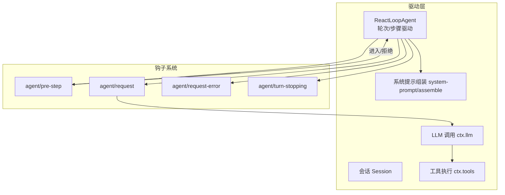
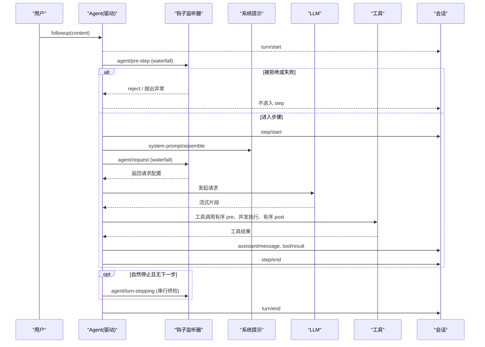
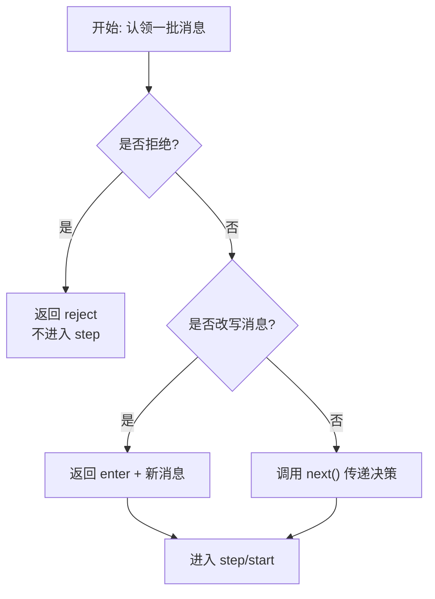
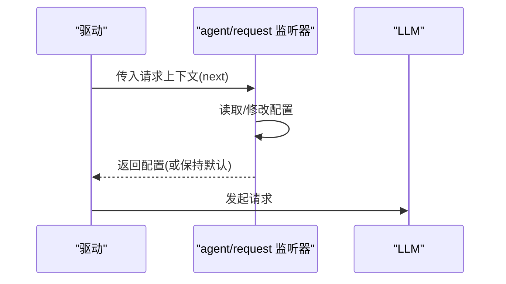
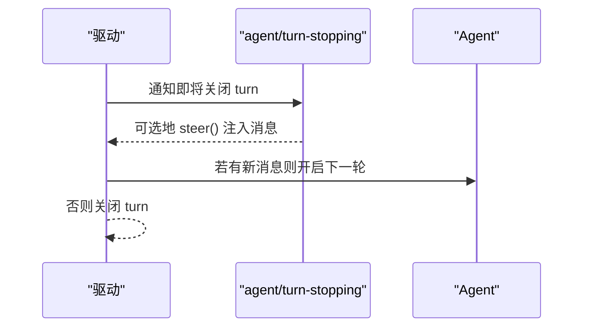
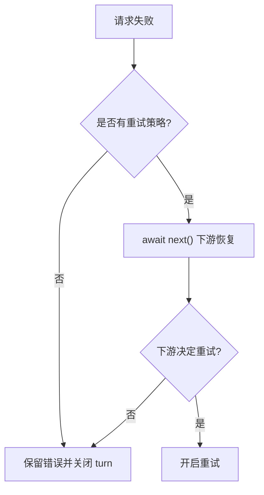
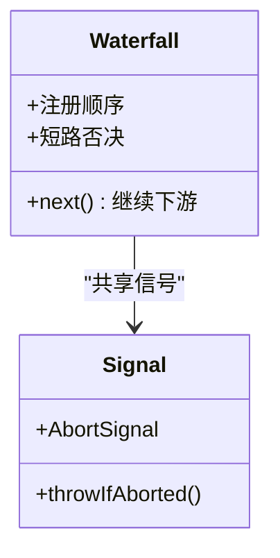
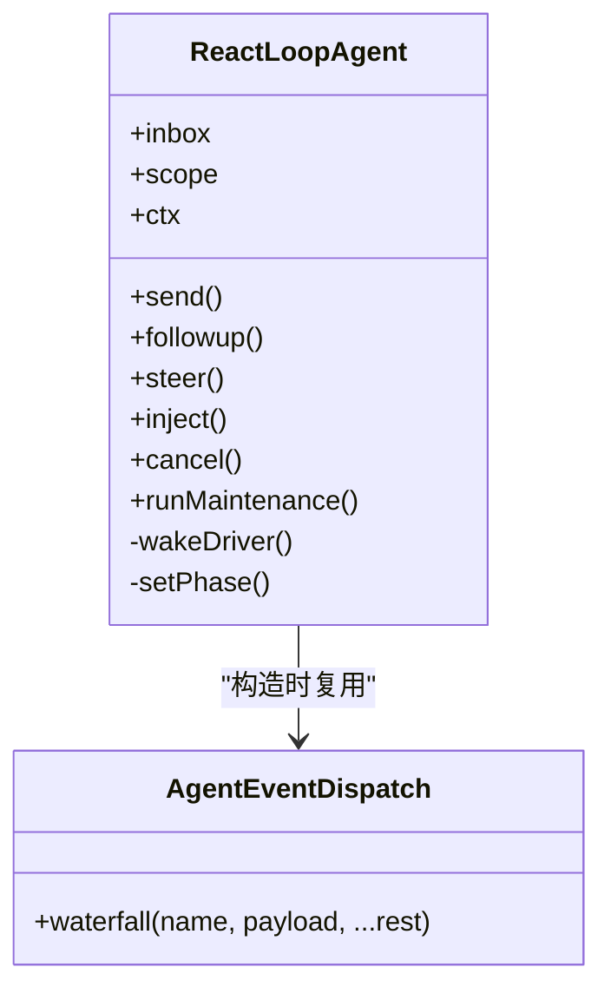
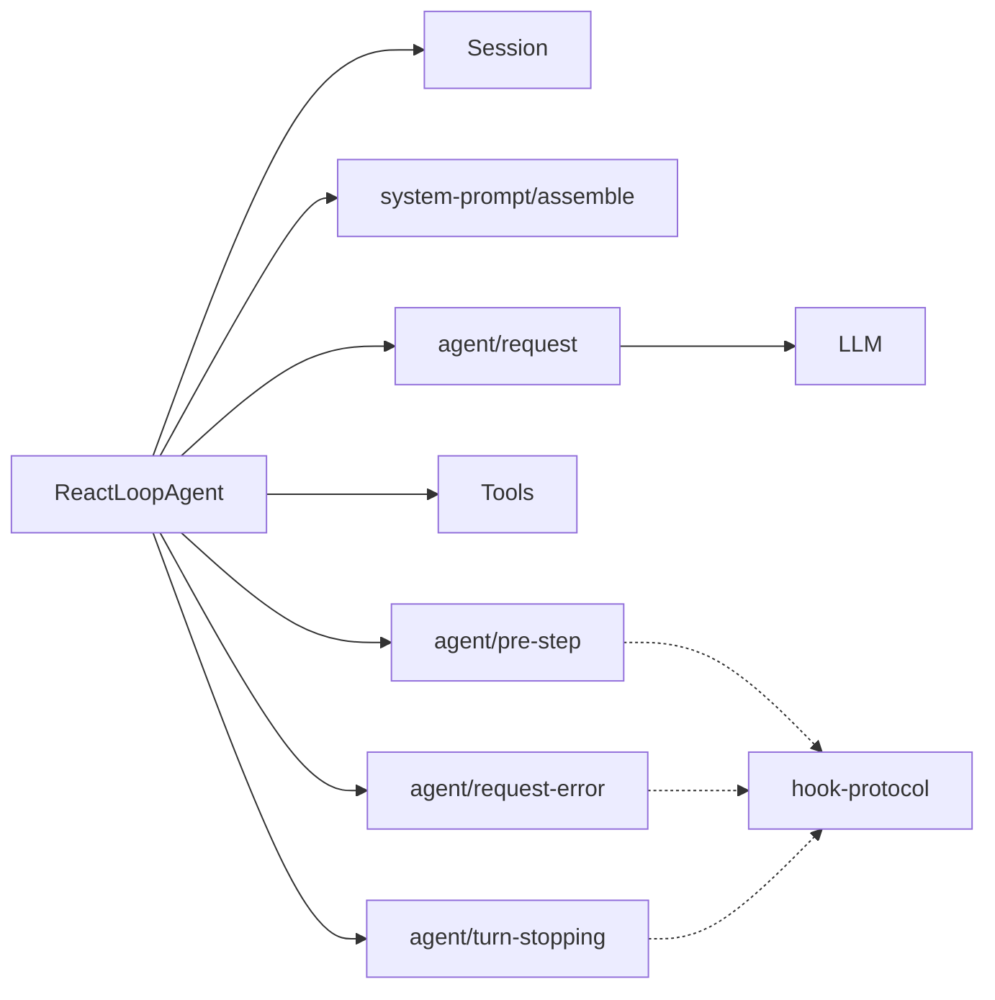
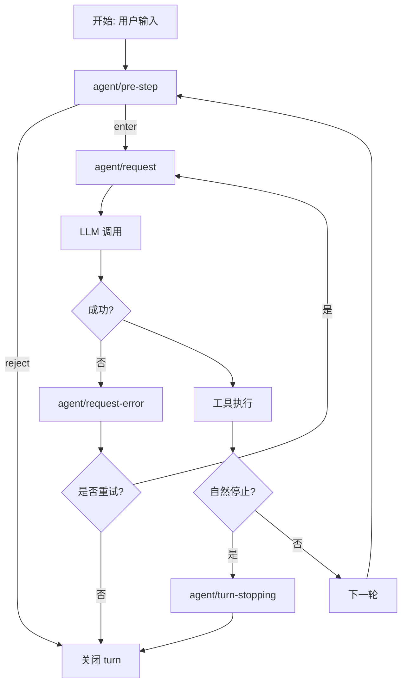

# Agent 生命周期钩子

<cite>
**本文引用的文件**
- [agent-lifecycle.md](file://docs/agent-lifecycle.md)
- [agent-lifecycle.zh.md](file://docs/agent-lifecycle.zh.md)
- [agent.ts](file://packages/core/agent-loop/src/agent.ts)
- [index.ts（agent-loop）](file://packages/core/agent-loop/src/index.ts)
- [dispatch.ts](file://packages/core/agent/src/dispatch.ts)
- [types.ts（hook-protocol）](file://packages/hooks/hook-protocol/src/types.ts)
- [invariant.ts（hook-protocol）](file://packages/hooks/hook-protocol/src/invariant.ts)
- [detached.ts（hook-protocol）](file://packages/hooks/hook-protocol/src/detached.ts)
- [index.ts（hooks-claude-code）](file://packages/hooks/hooks-claude-code/src/index.ts)
- [loop.spec.ts](file://packages/core/agent-loop/tests/loop.spec.ts)
- [interception.spec.ts](file://packages/core/agent-loop/tests/interception.spec.ts)
- [goal-round-driver.spec.ts](file://packages/goal/goal-round-driver/tests/goal-round-driver.spec.ts)
- [agent-initiator.spec.ts](file://packages/core/agent-loop/tests/agent-initiator.spec.ts)
- [coverage-edges.spec.ts](file://packages/core/agent-loop/tests/coverage-edges.spec.ts)
- [index.ts（llm-retry）](file://packages/llm/llm-retry/src/index.ts)
- [04-events.zh.md](file://docs/cordis-tutorial/04-events.zh.md)
- [hooks.e2e.ts](file://examples/acp-agent/tests/hooks.e2e.ts)
</cite>

## 目录
1. [简介](#简介)
2. [项目结构](#项目结构)
3. [核心组件](#核心组件)
4. [架构总览](#架构总览)
5. [详细组件分析](#详细组件分析)
6. [依赖关系分析](#依赖关系分析)
7. [性能考量](#性能考量)
8. [故障排查指南](#故障排查指南)
9. [结论](#结论)
10. [附录](#附录)

## 简介
本文件系统性说明 Agent 生命周期中的关键钩子：agent/pre-step、agent/request、agent/turn-stopping，以及与之配套的 agent/request-error。内容涵盖触发时机、执行顺序与优先级、并发控制、消息重写、请求拦截、流程控制、异步处理与错误恢复，并给出常见使用模式与最佳实践（日志记录、性能监控、权限验证等）。所有实现细节均基于仓库内源码与测试用例。

## 项目结构
Agent 生命周期由“驱动层”和“钩子系统”共同构成：
- 驱动层：负责轮次（turn）与步骤（step）的推进、系统提示组装、LLM 调用、工具执行与结果聚合。
- 钩子系统：通过 Cordis 事件机制以 waterfall 模式串联多个监听器，允许在关键节点进行拦截、改写或终止。

图表来源
- [agent.ts:64-200](file://packages/core/agent-loop/src/agent.ts#L64-L200)
- [agent-lifecycle.zh.md:10-74](file://docs/agent-lifecycle.zh.md#L10-L74)

章节来源
- [agent-lifecycle.md:1-83](file://docs/agent-lifecycle.md#L1-L83)
- [agent-lifecycle.zh.md:1-85](file://docs/agent-lifecycle.zh.md#L1-L85)

## 核心组件
- ReactLoopAgent：驱动单个 Agent 的 turn/step 循环，维护状态机（idle/maintenance/running），并在每个阶段触发相应钩子。
- 事件分发：通过 agentEvents/waterfall 将 agent/* 事件以链式方式分发给所有监听器，支持 next() 继续下游、短路否决或返回值改写。
- 钩子协议与不变量：hook-protocol 提供跨桥接的统一事件类型与校验；invariant 保证 hook/invoked 与 hook/result 成对出现且处于同一 open turn。
- 外部桥接：hooks-claude-code 等桥接将外部 shell 钩子映射到内部事件，并在特定钩子点（如 Stop）进行策略性转向。

章节来源
- [agent.ts:64-200](file://packages/core/agent-loop/src/agent.ts#L64-L200)
- [dispatch.ts:75-96](file://packages/core/agent/src/dispatch.ts#L75-L96)
- [types.ts:8-41](file://packages/hooks/hook-protocol/src/types.ts#L8-L41)
- [invariant.ts:87-121](file://packages/hooks/hook-protocol/src/invariant.ts#L87-L121)
- [index.ts（hooks-claude-code）:267-277](file://packages/hooks/hooks-claude-code/src/index.ts#L267-L277)

## 架构总览
下图展示一次用户输入从入队到完成的生命周期，重点标注了各钩子的触发位置与作用。

图表来源
- [agent-lifecycle.zh.md:10-74](file://docs/agent-lifecycle.zh.md#L10-L74)
- [agent.ts:64-200](file://packages/core/agent-loop/src/agent.ts#L64-L200)

章节来源
- [agent-lifecycle.zh.md:10-74](file://docs/agent-lifecycle.zh.md#L10-L74)

## 详细组件分析

### agent/pre-step：步骤前置拦截与消息重写
- 触发时机：每次拟议步骤打开之前，针对已认领的一步批次（next-step 或自动抓取的一条 prompt）运行。
- 能力与语义：
  - 可返回 { kind: 'reject' } 直接拒绝该步骤，不进入 step/start。
  - 可返回 { kind: 'enter', messages } 替换进入步骤的消息序列。
  - 若监听器抛出异常，整个步骤提议会被丢弃（fail-closed）。
- 并发与信号：每个监听器收到 AbortSignal，用于在取消时快速退出。
- 典型用途：压力控制、上下文注入、权限校验、日志埋点。

图表来源
- [loop.spec.ts:867-898](file://packages/core/agent-loop/tests/loop.spec.ts#L867-L898)
- [goal-round-driver.spec.ts:576-594](file://packages/goal/goal-round-driver/tests/goal-round-driver.spec.ts#L576-L594)
- [context/agent-instructions/index.ts:322-348](file://packages/context/agent-instructions/src/index.ts#L322-L348)

章节来源
- [loop.spec.ts:867-898](file://packages/core/agent-loop/tests/loop.spec.ts#L867-L898)
- [goal-round-driver.spec.ts:576-594](file://packages/goal/goal-round-driver/tests/goal-round-driver.spec.ts#L576-L594)
- [context/agent-instructions/index.ts:322-348](file://packages/context/agent-instructions/src/index.ts#L322-L348)

### agent/request：请求构建拦截
- 触发时机：在系统提示组装完成后、实际发起模型请求前。
- 能力与语义：
  - 接收冻结后的请求配置，可通过 next() 获取默认配置并进行包装或替换。
  - 适合做限流、采样、审计、指标上报、动态参数调整。
- 并发与信号：同样具备 AbortSignal，确保在取消路径中及时退出。

图表来源
- [agent-lifecycle.zh.md:35-39](file://docs/agent-lifecycle.zh.md#L35-L39)
- [agent.ts:64-200](file://packages/core/agent-loop/src/agent.ts#L64-L200)

章节来源
- [agent-lifecycle.zh.md:35-39](file://docs/agent-lifecycle.zh.md#L35-L39)

### agent/turn-stopping：轮次收尾时的串行检查点
- 触发时机：当一轮（turn）自然结束且没有待处理的下一步输入时。
- 能力与语义：
  - 串行执行，适合做最终检查、持久化、统计汇总。
  - 可通过 agent.steer() 注入新的用户消息，强制开启下一个步骤（注意自限连续强制继续）。
- 外部桥接示例：Claude Code 桥在 Stop 点根据策略决定是否继续。

图表来源
- [agent-lifecycle.zh.md:60-63](file://docs/agent-lifecycle.zh.md#L60-L63)
- [index.ts（hooks-claude-code）:267-277](file://packages/hooks/hooks-claude-code/src/index.ts#L267-L277)

章节来源
- [agent-lifecycle.zh.md:60-63](file://docs/agent-lifecycle.zh.md#L60-L63)
- [index.ts（hooks-claude-code）:267-277](file://packages/hooks/hooks-claude-code/src/index.ts#L267-L277)

### agent/request-error：请求错误恢复
- 触发时机：当适配器或终端发生请求失败时。
- 能力与语义：
  - 可返回重试动作（retry）或保留原始错误。
  - llm-retry 插件会按策略（always/条件码）介入恢复，并在超时/中止时安全退出。
- 行为约束：若无 retry 动作，失败 turn 将作为终端关闭。

图表来源
- [coverage-edges.spec.ts:421-440](file://packages/core/agent-loop/tests/coverage-edges.spec.ts#L421-L440)
- [index.ts（llm-retry）:156-179](file://packages/llm/llm-retry/src/index.ts#L156-L179)

章节来源
- [coverage-edges.spec.ts:421-440](file://packages/core/agent-loop/tests/coverage-edges.spec.ts#L421-L440)
- [index.ts（llm-retry）:156-179](file://packages/llm/llm-retry/src/index.ts#L156-L179)

### 钩子执行顺序、优先级与并发控制
- 执行顺序：Cordis 事件以注册顺序形成 waterfall，先注册的监听器先执行，后注册的监听器包裹其下游。
- 优先级：通过注册顺序控制；也可通过短路（不调用 next）改变后续逻辑。
- 并发控制：
  - 每个监听器持有 AbortSignal，可在取消时快速退出。
  - 工具调用采用“有序 pre、并发执行、有序 post”的模式，受最大并行度限制。
  - detached 钩子运行需跟踪并等待清理，避免进程泄漏。

图表来源
- [04-events.zh.md:94-136](file://docs/cordis-tutorial/04-events.zh.md#L94-L136)
- [agent.ts:64-200](file://packages/core/agent-loop/src/agent.ts#L64-L200)
- [detached.ts:1-32](file://packages/hooks/hook-protocol/src/detached.ts#L1-L32)

章节来源
- [04-events.zh.md:94-136](file://docs/cordis-tutorial/04-events.zh.md#L94-L136)
- [agent.ts:64-200](file://packages/core/agent-loop/src/agent.ts#L64-L200)
- [detached.ts:1-32](file://packages/hooks/hook-protocol/src/detached.ts#L1-L32)

### 代码级类图（驱动与事件分发）

图表来源
- [agent.ts:64-200](file://packages/core/agent-loop/src/agent.ts#L64-L200)
- [dispatch.ts:75-96](file://packages/core/agent/src/dispatch.ts#L75-L96)

章节来源
- [agent.ts:64-200](file://packages/core/agent-loop/src/agent.ts#L64-L200)
- [dispatch.ts:75-96](file://packages/core/agent/src/dispatch.ts#L75-L96)

## 依赖关系分析
- 驱动依赖：
  - 会话：turn/start、step/start/end、assistant/chunk、tool/call、tool/result 等。
  - 系统提示：system-prompt/assemble 瀑布组装。
  - LLM：agent/request 瀑布后发起请求。
  - 工具：有序 pre、并发执行、有序 post。
- 钩子依赖：
  - 事件：agent/pre-step、agent/request、agent/request-error、agent/turn-stopping。
  - 协议：hook-protocol 的类型与不变量保障。
  - 桥接：hooks-claude-code 等将外部钩子映射为内部事件。

图表来源
- [agent-lifecycle.zh.md:10-74](file://docs/agent-lifecycle.zh.md#L10-L74)
- [types.ts:8-41](file://packages/hooks/hook-protocol/src/types.ts#L8-L41)

章节来源
- [agent-lifecycle.zh.md:10-74](file://docs/agent-lifecycle.zh.md#L10-L74)
- [types.ts:8-41](file://packages/hooks/hook-protocol/src/types.ts#L8-L41)

## 性能考量
- 最小化阻塞：在 agent/pre-step 与 agent/request 中避免长时间同步阻塞；必要时使用 AbortSignal 快速退出。
- 控制并发：工具调用遵循“有序 pre/post + 并发执行”，注意设置合理的最大并行度以避免资源争用。
- 日志与追踪：通过 session/event 持久化回放事实，减少运行时额外开销；仅在必要处写入高成本信息。
- 钩子清理：detached 钩子需在 fiber 销毁时 drain，防止进程或回调泄漏。

[本节为通用指导，不直接分析具体文件]

## 故障排查指南
- 步骤被拒绝：检查 agent/pre-step 是否返回 reject 或抛出异常；确认消息批次的认领与注入是否符合预期。
- 请求未发出：检查 agent/request 是否短路或未调用 next()；确认系统提示组装是否成功。
- 错误恢复未生效：确认 llm-retry 策略是否匹配失败码；检查是否在超时/中止路径中被提前终止。
- 钩子不一致：通过 hook-protocol 的 invariant 校验 hook/invoked 与 hook/result 是否成对出现且处于同一 open turn。

章节来源
- [goal-round-driver.spec.ts:576-594](file://packages/goal/goal-round-driver/tests/goal-round-driver.spec.ts#L576-L594)
- [coverage-edges.spec.ts:421-440](file://packages/core/agent-loop/tests/coverage-edges.spec.ts#L421-L440)
- [invariant.ts:87-121](file://packages/hooks/hook-protocol/src/invariant.ts#L87-L121)

## 结论
Agent 生命周期钩子提供了强大而类型化的扩展点，能够在步骤前置、请求构建、错误恢复与轮次收尾等关键节点进行精细控制。通过 waterfall 模式与 AbortSignal，既能实现灵活的拦截与改写，又能保证取消路径下的安全性与一致性。结合会话持久化与协议不变量，开发者可以构建可靠的日志、监控、权限与策略体系。

[本节为总结，不直接分析具体文件]

## 附录

### 常见使用模式与最佳实践
- 日志记录：在 agent/request 中记录请求元数据，在 agent/request-error 中记录失败原因；优先消费 session/event 以获得可回放数据。
- 性能监控：在 agent/request 前后打点，计算耗时与吞吐；在 agent/pre-step 中做采样或限流。
- 权限验证：在 agent/pre-step 中校验上下文与意图，必要时返回 reject；在工具执行前通过 PreToolUse 钩子（外部桥接）进行细粒度授权。
- 错误恢复：利用 agent/request-error 与 llm-retry 策略组合，实现可控的重试与降级。

章节来源
- [04-events.zh.md:94-136](file://docs/cordis-tutorial/04-events.zh.md#L94-L136)
- [hooks.e2e.ts:38-71](file://examples/acp-agent/tests/hooks.e2e.ts#L38-L71)

### 注册自定义钩子函数与处理异步操作
- 注册方式：通过 ctx.on('agent/pre-step'|'agent/request'|'agent/request-error'|'agent/turn-stopping', handler) 订阅事件。
- 异步处理：handler 可为 async，使用 AbortSignal 响应取消；在长耗时操作中定期检查 signal.throwIfAborted()。
- 错误恢复：在 agent/request-error 中返回 retry 动作或保留错误；结合 llm-retry 的策略进行统一治理。

章节来源
- [agent-initiator.spec.ts:163-198](file://packages/core/agent-loop/tests/agent-initiator.spec.ts#L163-L198)
- [index.ts（llm-retry）:156-179](file://packages/llm/llm-retry/src/index.ts#L156-L179)

### 完整流程图（含错误恢复）

图表来源
- [agent-lifecycle.zh.md:10-74](file://docs/agent-lifecycle.zh.md#L10-L74)
- [coverage-edges.spec.ts:421-440](file://packages/core/agent-loop/tests/coverage-edges.spec.ts#L421-L440)