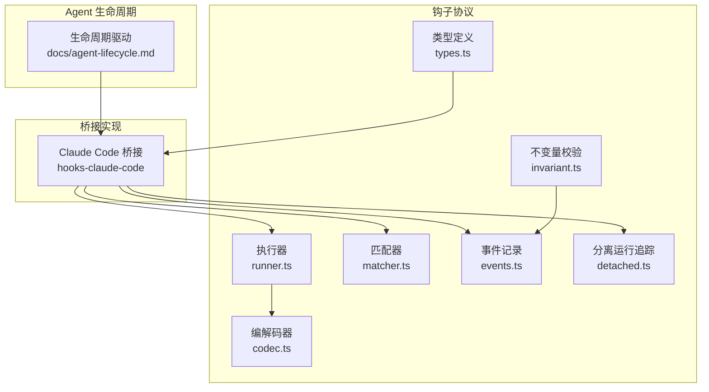
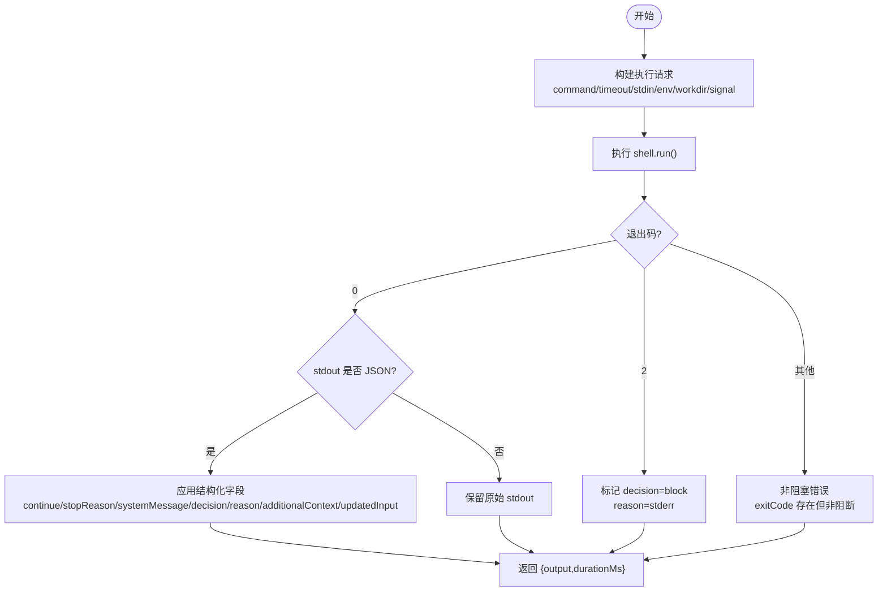
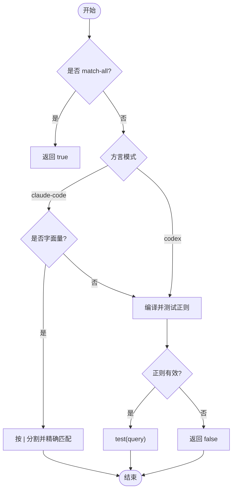
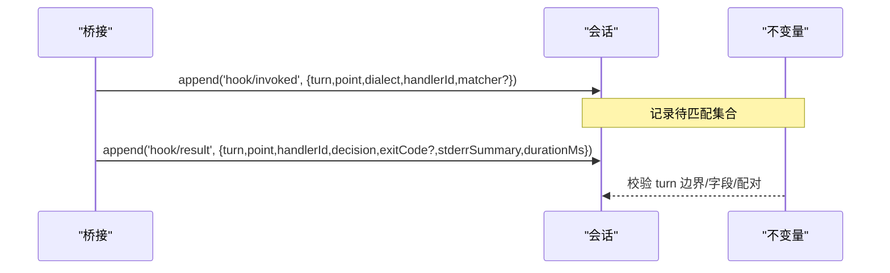
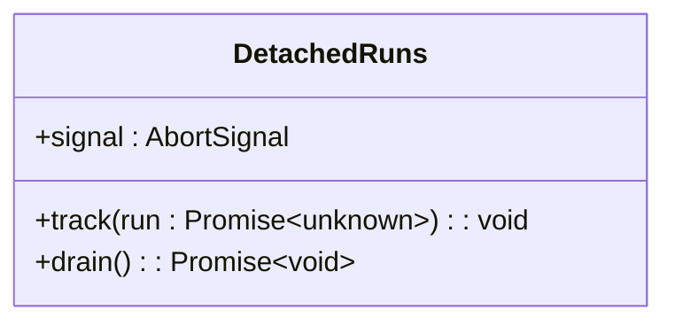
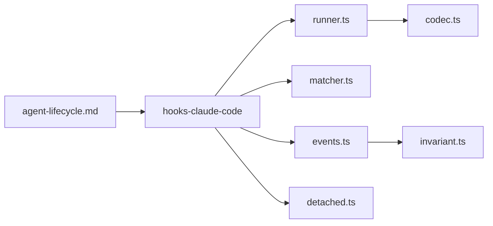

# 钩子开发最佳实践

<cite>
**本文引用的文件**
- [packages/hooks/hook-protocol/src/index.ts](file://packages/hooks/hook-protocol/src/index.ts)
- [packages/hooks/hook-protocol/src/types.ts](file://packages/hooks/hook-protocol/src/types.ts)
- [packages/hooks/hook-protocol/src/runner.ts](file://packages/hooks/hook-protocol/src/runner.ts)
- [packages/hooks/hook-protocol/src/codec.ts](file://packages/hooks/hook-protocol/src/codec.ts)
- [packages/hooks/hook-protocol/src/matcher.ts](file://packages/hooks/hook-protocol/src/matcher.ts)
- [packages/hooks/hook-protocol/src/events.ts](file://packages/hooks/hook-protocol/src/events.ts)
- [packages/hooks/hook-protocol/src/detached.ts](file://packages/hooks/hook-protocol/src/detached.ts)
- [packages/hooks/hook-protocol/tests/runner.spec.ts](file://packages/hooks/hook-protocol/tests/runner.spec.ts)
- [packages/hooks/hook-protocol/tests/invariant.spec.ts](file://packages/hooks/hook-protocol/tests/invariant.spec.ts)
- [packages/hooks/hook-protocol/src/invariant.ts](file://packages/hooks/hook-protocol/src/invariant.ts)
- [packages/hooks/hooks-claude-code/src/index.ts](file://packages/hooks/hooks-claude-code/src/index.ts)
- [docs/agent-lifecycle.md](file://docs/agent-lifecycle.md)
- [vitest.e2e.config.ts](file://vitest.e2e.config.ts)
- [vitest.web.perf.config.ts](file://vitest.web.perf.config.ts)
</cite>

## 目录
1. [简介](#简介)
2. [项目结构](#项目结构)
3. [核心组件](#核心组件)
4. [架构总览](#架构总览)
5. [详细组件分析](#详细组件分析)
6. [依赖关系分析](#依赖关系分析)
7. [性能考量](#性能考量)
8. [故障排查指南](#故障排查指南)
9. [结论](#结论)
10. [附录](#附录)

## 简介
本文件面向在 Agent 生命周期中编写“钩子”的开发者，聚焦设计原则、性能优化、错误处理与可测试性。仓库中的钩子系统由协议层（hook-protocol）与桥接实现（如 hooks-claude-code、hooks-codex）组成：协议层提供跨方言的统一执行、匹配、编解码、事件记录与资源清理；桥接层将外部命令型钩子映射到具体生命周期点（如 PreToolUse、Stop、PreStep 等）。本文基于源码与文档，给出企业级落地建议、调试技巧与性能分析方法，并配套序列图、流程图与类图帮助理解。

## 项目结构
- 协议层位于 packages/hooks/hook-protocol，提供：
  - 类型与导出入口（types.ts、index.ts）
  - 命令执行器封装（runner.ts）
  - 输出解析（codec.ts）
  - 匹配器（matcher.ts）
  - 持久化日志事件（events.ts）
  - 非等待型运行追踪（detached.ts）
  - 不变量校验（invariant.ts）
- 桥接实现位于 packages/hooks/hooks-claude-code、hooks-codex，负责把配置与上下文组装为协议所需的输入，并在生命周期点触发钩子。
- Agent 生命周期与钩子调用点参考 docs/agent-lifecycle.md。
- 测试与性能配置见 vitest.e2e.config.ts、vitest.web.perf.config.ts。



**图示来源**
- [packages/hooks/hook-protocol/src/index.ts:1-26](file://packages/hooks/hook-protocol/src/index.ts#L1-L26)
- [packages/hooks/hook-protocol/src/types.ts:1-138](file://packages/hooks/hook-protocol/src/types.ts#L1-L138)
- [packages/hooks/hook-protocol/src/runner.ts:1-107](file://packages/hooks/hook-protocol/src/runner.ts#L1-L107)
- [packages/hooks/hook-protocol/src/codec.ts:1-135](file://packages/hooks/hook-protocol/src/codec.ts#L1-L135)
- [packages/hooks/hook-protocol/src/matcher.ts:1-66](file://packages/hooks/hook-protocol/src/matcher.ts#L1-L66)
- [packages/hooks/hook-protocol/src/events.ts:1-105](file://packages/hooks/hook-protocol/src/events.ts#L1-L105)
- [packages/hooks/hook-protocol/src/detached.ts:1-32](file://packages/hooks/hook-protocol/src/detached.ts#L1-L32)
- [packages/hooks/hook-protocol/src/invariant.ts:30-59](file://packages/hooks/hook-protocol/src/invariant.ts#L30-L59)
- [packages/hooks/hooks-claude-code/src/index.ts:118-126](file://packages/hooks/hooks-claude-code/src/index.ts#L118-L126)
- [docs/agent-lifecycle.md:1-83](file://docs/agent-lifecycle.md#L1-L83)

**章节来源**
- [packages/hooks/hook-protocol/src/index.ts:1-26](file://packages/hooks/hook-protocol/src/index.ts#L1-L26)
- [docs/agent-lifecycle.md:1-83](file://docs/agent-lifecycle.md#L1-L83)

## 核心组件
- 命令执行器 runHook：通过 ShellExecutor 以 stdin 传递 JSON 负载，支持超时、工作目录、环境变量、AbortSignal 取消；捕获进程退出码与标准输出/错误，统一转为 HookOutput；异常不抛错，转为非阻塞错误记录。
- 编解码器 parseHookOutput：将进程结果解析为中立 HookOutput；exit 2 视为阻断；仅 exit 0 尝试 JSON 结构化解析；支持 hookSpecificOutput 的事件名守卫，避免误用。
- 匹配器 matchesMatcher/matcherDiagnostic：按方言模式匹配（Claude 字面量/正则，Codex 始终正则），非法正则安全降级为非匹配。
- 事件记录 appendHookInvoked/appendHookResult：写入 session 的 hook/invoked 与 hook/result，包含 turn、point、dialect、handlerId、decision、stderrSummary、durationMs 等，保证成对与审计。
- 分离运行 detached：跟踪无 await 的 emit-shaped 钩子链，dispose 时 drain 终止进程与后续回调，确保 fiber 回收。
- 不变量 invariant：校验 hook/invoked 与 hook/result 的配对、turn 边界、字段合法性，防止会话回放不一致。

**章节来源**
- [packages/hooks/hook-protocol/src/runner.ts:22-107](file://packages/hooks/hook-protocol/src/runner.ts#L22-L107)
- [packages/hooks/hook-protocol/src/codec.ts:47-135](file://packages/hooks/hook-protocol/src/codec.ts#L47-L135)
- [packages/hooks/hook-protocol/src/matcher.ts:31-66](file://packages/hooks/hook-protocol/src/matcher.ts#L31-L66)
- [packages/hooks/hook-protocol/src/events.ts:12-105](file://packages/hooks/hook-protocol/src/events.ts#L12-L105)
- [packages/hooks/hook-protocol/src/detached.ts:1-32](file://packages/hooks/hook-protocol/src/detached.ts#L1-L32)
- [packages/hooks/hook-protocol/src/invariant.ts:30-59](file://packages/hooks/hook-protocol/src/invariant.ts#L30-L59)

## 架构总览
下图展示一次 Agent 回合中，驱动如何串联钩子水线（如 agent/pre-step、agent/request-error），以及钩子如何通过协议层执行命令、记录事件并返回决策。

```mermaid
sequenceDiagram
participant U as "用户"
participant A as "Agent"
participant Dr as "驱动"
participant H as "钩子监听器"
participant P as "系统提示"
participant L as "LLM"
participant S as "会话"
participant SH as "Shell执行器"
participant RP as "协议层(runner/codec)"
participant EV as "事件(events)"
U->>A : followup(content)
A-->>S : 入队消息
Dr->>S : turn/start
Dr->>H : agent/pre-step 水线
H-->>Dr : 拒绝或进入下一步
alt 进入步骤
Dr->>S : step/start
Dr->>P : system-prompt/assemble
Dr->>L : agent/request + llm/stream
L-->>Dr : StreamChunk*
Dr->>S : assistant/chunk*
opt 模型请求失败
Dr->>S : step/end
Dr->>H : agent/request-error 水线
H-->>Dr : 重试或保留错误
else 成功
Dr->>S : assistant/message
Dr->>S : tool/call, tool/result
end
Dr->>S : step/end
end
opt 自然停止且无待处理输入
Dr->>H : agent/turn-stopping
end
Dr->>S : turn/end
Dr-->>U : 状态 idle
```

**图示来源**
- [docs/agent-lifecycle.md:8-80](file://docs/agent-lifecycle.md#L8-L80)
- [packages/hooks/hook-protocol/src/runner.ts:67-107](file://packages/hooks/hook-protocol/src/runner.ts#L67-L107)
- [packages/hooks/hook-protocol/src/events.ts:70-105](file://packages/hooks/hook-protocol/src/events.ts#L70-L105)

## 详细组件分析

### 命令执行器与输出解析（runHook + parseHookOutput）
- 职责：将桥接传入的 payload 序列化至 stdin，设置超时、工作目录与环境变量，调用 ShellExecutor；捕获退出码与输出，解析为 HookOutput；计算耗时用于审计。
- 关键行为：
  - 默认超时来自协议常量，可通过 per-hook timeoutSec 覆盖。
  - exit 2 表示阻断，reason 取自 stderr。
  - 仅 exit 0 尝试 JSON 结构化解析；非 JSON 保持纯文本 stdout。
  - 基础设施异常（如不可用工作目录）不抛错，转为非阻塞错误记录。
  - expectedEventName 保护 hookSpecificOutput 的事件名一致性，不匹配则丢弃事件域字段。



**图示来源**
- [packages/hooks/hook-protocol/src/runner.ts:67-107](file://packages/hooks/hook-protocol/src/runner.ts#L67-L107)
- [packages/hooks/hook-protocol/src/codec.ts:47-135](file://packages/hooks/hook-protocol/src/codec.ts#L47-L135)

**章节来源**
- [packages/hooks/hook-protocol/src/runner.ts:22-107](file://packages/hooks/hook-protocol/src/runner.ts#L22-L107)
- [packages/hooks/hook-protocol/src/codec.ts:1-135](file://packages/hooks/hook-protocol/src/codec.ts#L1-L135)

### 匹配器（matchesMatcher / matcherDiagnostic）
- 职责：按方言解释匹配模式，Claude 支持字面量（字母数字与下划线及管道分隔）与正则；Codex 始终使用正则。
- 关键点：
  - 空/缺失/* 表示匹配所有。
  - 非法正则运行时返回 false，配置期通过 matcherDiagnostic 上报诊断。
  - 字面量模式按 | 分割精确匹配。



**图示来源**
- [packages/hooks/hook-protocol/src/matcher.ts:12-66](file://packages/hooks/hook-protocol/src/matcher.ts#L12-L66)

**章节来源**
- [packages/hooks/hook-protocol/src/matcher.ts:1-66](file://packages/hooks/hook-protocol/src/matcher.ts#L1-L66)

### 事件记录与不变量（events + invariant）
- 职责：在 open turn 内追加 hook/invoked 与 hook/result，保证成对出现；stderr 摘要截断；durationMs 审计；校验 turn 边界、字段合法性与配对关系。
- 关键点：
  - hook/invoked 携带 turn、point、dialect、handlerId、可选 matcher。
  - hook/result 派生 decision（parsed decision 或 continue:false→stop，否则 pass），stderrSummary 截断，exitCode 可选。
  - 不变量在回放时严格校验，防止未闭合 turn 或 mismatched result。



**图示来源**
- [packages/hooks/hook-protocol/src/events.ts:70-105](file://packages/hooks/hook-protocol/src/events.ts#L70-L105)
- [packages/hooks/hook-protocol/src/invariant.ts:30-59](file://packages/hooks/hook-protocol/src/invariant.ts#L30-L59)

**章节来源**
- [packages/hooks/hook-protocol/src/events.ts:1-105](file://packages/hooks/hook-protocol/src/events.ts#L1-L105)
- [packages/hooks/hook-protocol/src/invariant.ts:30-59](file://packages/hooks/hook-protocol/src/invariant.ts#L30-L59)

### 分离运行与资源清理（detached）
- 职责：跟踪无需等待的钩子链（如 inject/warn），在 fiber 释放时 drain，中止信号并等待所有链完成，避免进程或回调泄漏。
- 关键点：
  - 每个 tracked run 需传入 AbortSignal，drain 时触发以尽快终止。
  - 捕获并吸收拒绝，但不替代调用方的错误处理。



**图示来源**
- [packages/hooks/hook-protocol/src/detached.ts:1-32](file://packages/hooks/hook-protocol/src/detached.ts#L1-L32)

**章节来源**
- [packages/hooks/hook-protocol/src/detached.ts:1-32](file://packages/hooks/hook-protocol/src/detached.ts#L1-L32)

### 桥接集成示例（Claude Code）
- 职责：在生命周期点（如 PreToolUse、Stop、PreStep）触发命令型钩子，组装 payload 与环境，调用 runner，记录事件，合并决策。
- 关键点：
  - 使用 detached 追踪 emit-shaped 运行，在 effect 释放时 drain。
  - 维护子代理生命周期关联，确保 stop 钩子在会话工作区可用期间仍能访问必要资源。

**章节来源**
- [packages/hooks/hooks-claude-code/src/index.ts:118-126](file://packages/hooks/hooks-claude-code/src/index.ts#L118-L126)

## 依赖关系分析
- 桥接依赖协议层：
  - 执行器 runner 依赖 ShellExecutor 抽象。
  - codec 提供中立输出解析。
  - events 写入 session 事件。
  - matcher 决定哪些钩子被选中。
  - detached 管理异步资源清理。
  - invariant 保障事件一致性与回放正确性。
- 生命周期驱动通过事件水线（如 agent/pre-step、agent/request-error）与钩子监听器交互，形成端到端流程。



**图示来源**
- [packages/hooks/hook-protocol/src/index.ts:1-26](file://packages/hooks/hook-protocol/src/index.ts#L1-L26)
- [packages/hooks/hook-protocol/src/runner.ts:1-107](file://packages/hooks/hook-protocol/src/runner.ts#L1-L107)
- [packages/hooks/hook-protocol/src/codec.ts:1-135](file://packages/hooks/hook-protocol/src/codec.ts#L1-L135)
- [packages/hooks/hook-protocol/src/matcher.ts:1-66](file://packages/hooks/hook-protocol/src/matcher.ts#L1-L66)
- [packages/hooks/hook-protocol/src/events.ts:1-105](file://packages/hooks/hook-protocol/src/events.ts#L1-L105)
- [packages/hooks/hook-protocol/src/detached.ts:1-32](file://packages/hooks/hook-protocol/src/detached.ts#L1-L32)
- [packages/hooks/hook-protocol/src/invariant.ts:30-59](file://packages/hooks/hook-protocol/src/invariant.ts#L30-L59)
- [docs/agent-lifecycle.md:1-83](file://docs/agent-lifecycle.md#L1-L83)

**章节来源**
- [packages/hooks/hook-protocol/src/index.ts:1-26](file://packages/hooks/hook-protocol/src/index.ts#L1-L26)
- [docs/agent-lifecycle.md:1-83](file://docs/agent-lifecycle.md#L1-L83)

## 性能考量
- 超时控制：
  - 使用 per-hook timeoutSec 覆盖默认超时，避免长耗时钩子阻塞主流程。
  - 默认超时来自协议常量，集中管理便于统一调优。
- 资源清理：
  - 分离运行必须传入 AbortSignal，并在 fiber 释放时 drain，防止进程泄漏。
- I/O 与日志：
  - stderr 摘要截断，避免大日志影响存储与回放。
  - 结构化输出仅在 exit 0 解析，减少无效开销。
- 匹配效率：
  - 字面量模式按管道分割精确匹配，避免正则编译与回溯成本。
  - 非法正则安全降级为非匹配，配置期诊断提前暴露问题。
- 并发与并行：
  - e2e 测试支持文件并行与 worker 上限，可按需调整以平衡 CI 速度与资源占用。
  - 性能测试配置提高超时，适合高基数诊断场景。

**章节来源**
- [packages/hooks/hook-protocol/src/runner.ts:13-40](file://packages/hooks/hook-protocol/src/runner.ts#L13-L40)
- [packages/hooks/hook-protocol/src/codec.ts:71-86](file://packages/hooks/hook-protocol/src/codec.ts#L71-L86)
- [packages/hooks/hook-protocol/src/matcher.ts:12-66](file://packages/hooks/hook-protocol/src/matcher.ts#L12-L66)
- [packages/hooks/hook-protocol/src/events.ts:47-68](file://packages/hooks/hook-protocol/src/events.ts#L47-L68)
- [vitest.e2e.config.ts:31-58](file://vitest.e2e.config.ts#L31-L58)
- [vitest.web.perf.config.ts:1-15](file://vitest.web.perf.config.ts#L1-L15)

## 故障排查指南
- 常见错误定位：
  - 事件不在 open turn 内：不变量会抛出“outside any open turn”，检查 turn 开启/关闭时机。
  - 字段非法：如 point/handlerId 为空、dialect 未知、durationMs 非负有限数，均会被拒绝。
  - 结果无匹配 invoked：检查 handlerId 与 point 是否一致。
- 执行异常：
  - 基础设施故障（如工作目录不存在）不会抛错，转为非阻塞错误记录，查看 stderr 摘要。
  - 进程被信号杀死：exitCode 为 null 时转为 undefined，不影响继续执行。
- 调试技巧：
  - 使用 hook/invoked 与 hook/result 的 handlerId 关联调用与结果，便于链路追踪。
  - 利用 matcherDiagnostic 在配置阶段发现非法正则。
  - 在分离运行中确保 .catch 处理拒绝，避免静默失败。

**章节来源**
- [packages/hooks/hook-protocol/tests/invariant.spec.ts:85-118](file://packages/hooks/hook-protocol/tests/invariant.spec.ts#L85-L118)
- [packages/hooks/hook-protocol/src/invariant.ts:30-59](file://packages/hooks/hook-protocol/src/invariant.ts#L30-L59)
- [packages/hooks/hook-protocol/src/runner.ts:86-107](file://packages/hooks/hook-protocol/src/runner.ts#L86-L107)
- [packages/hooks/hook-protocol/src/matcher.ts:31-44](file://packages/hooks/hook-protocol/src/matcher.ts#L31-L44)

## 结论
钩子系统通过协议层统一了命令执行、匹配、解析、事件记录与资源清理，桥接层专注生命周期集成。遵循超时控制、资源清理、I/O 限制与匹配优化，可在企业级应用中稳定扩展 Agent 生命周期。借助事件审计与不变量校验，可实现可靠的回放与排障。结合单元测试与 e2e/性能测试配置，可保障钩子的质量与稳定性。

## 附录
- 单元测试要点：
  - 验证 runHook 的 stdin 序列化、env/cwd 透传、超时覆盖、AbortSignal 传递。
  - 验证 codec 对不同退出码与结构化输出的解析路径。
  - 验证 matcher 的字面量与正则匹配、非法正则降级。
  - 验证事件记录的配对与不变量校验。
- 集成测试要点：
  - 通过桥接在真实生命周期点触发钩子，断言决策与事件。
  - 使用 e2e 配置的文件并行与 worker 上限模拟高并发。
- 模拟环境搭建：
  - 使用最小 ShellExecutor 存根记录 spec，断言请求构造。
  - 注入 clock 函数以稳定 durationMs。
  - 使用 AbortController 模拟取消。

**章节来源**
- [packages/hooks/hook-protocol/tests/runner.spec.ts:1-157](file://packages/hooks/hook-protocol/tests/runner.spec.ts#L1-L157)
- [vitest.e2e.config.ts:31-58](file://vitest.e2e.config.ts#L31-L58)
- [vitest.web.perf.config.ts:1-15](file://vitest.web.perf.config.ts#L1-L15)