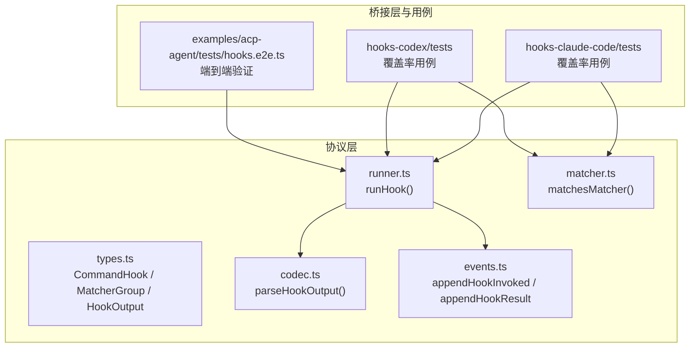
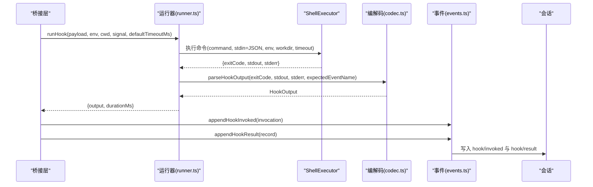
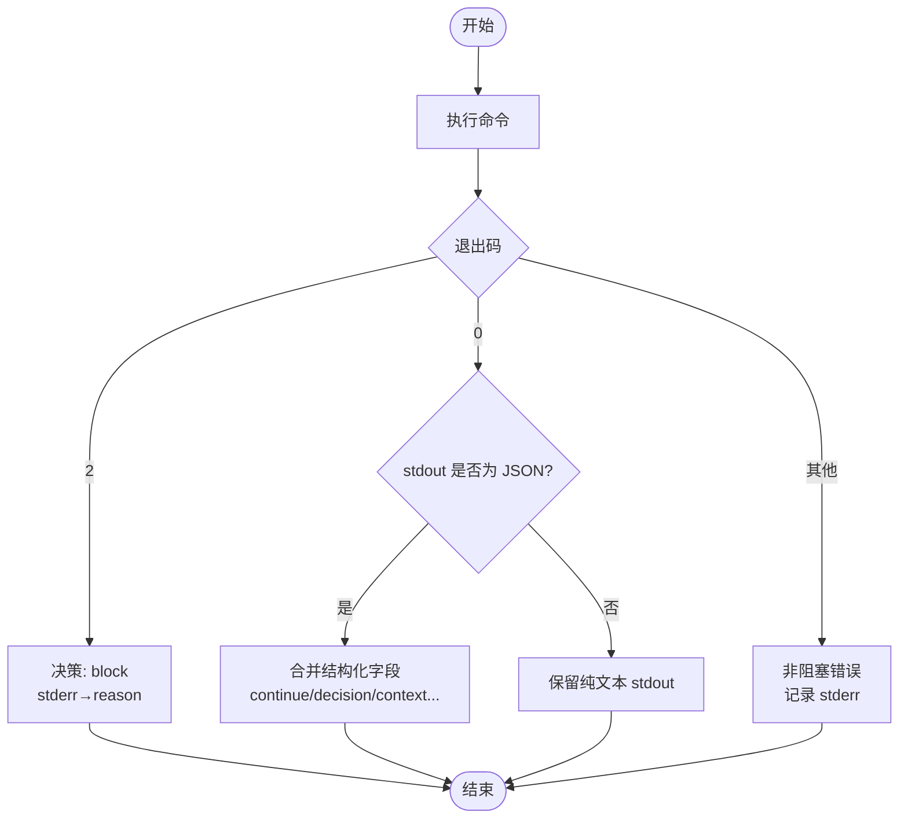
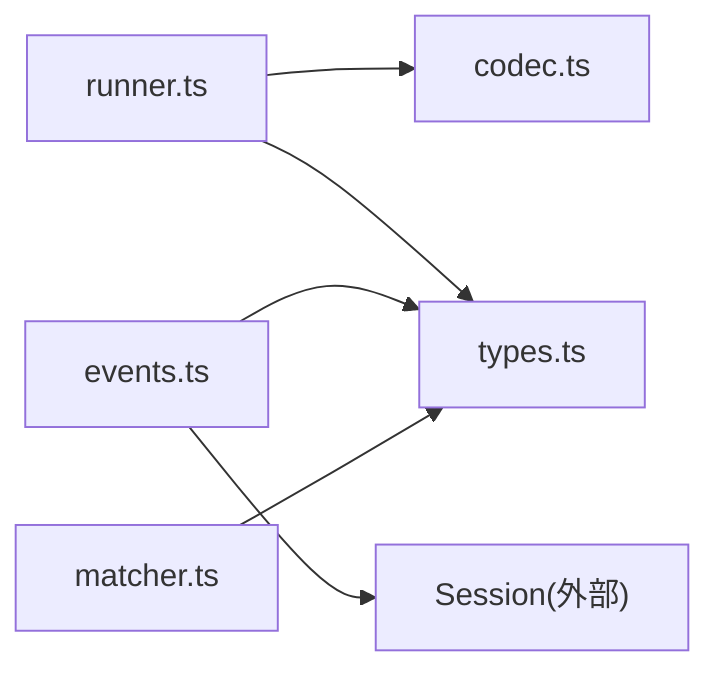

# 钩子执行上下文

<cite>
**本文引用的文件**
- [packages/hooks/hook-protocol/src/types.ts](file://packages/hooks/hook-protocol/src/types.ts)
- [packages/hooks/hook-protocol/src/runner.ts](file://packages/hooks/hook-protocol/src/runner.ts)
- [packages/hooks/hook-protocol/src/codec.ts](file://packages/hooks/hook-protocol/src/codec.ts)
- [packages/hooks/hook-protocol/src/events.ts](file://packages/hooks/hook-protocol/src/events.ts)
- [packages/hooks/hook-protocol/src/matcher.ts](file://packages/hooks/hook-protocol/src/matcher.ts)
- [examples/acp-agent/tests/hooks.e2e.ts](file://examples/acp-agent/tests/hooks.e2e.ts)
- [packages/hooks/hooks-codex/tests/coverage-cases.ts](file://packages/hooks/hooks-codex/tests/coverage-cases.ts)
- [packages/hooks/hooks-claude-code/tests/coverage-cases.ts](file://packages/hooks/hooks-claude-code/tests/coverage-cases.ts)
</cite>

## 目录
1. [简介](#简介)
2. [项目结构](#项目结构)
3. [核心组件](#核心组件)
4. [架构总览](#架构总览)
5. [详细组件分析](#详细组件分析)
6. [依赖关系分析](#依赖关系分析)
7. [性能考量](#性能考量)
8. [故障排查指南](#故障排查指南)
9. [结论](#结论)
10. [附录](#附录)

## 简介
本文件聚焦“钩子执行上下文”，系统性说明钩子在 Agent 生命周期中的执行环境、可用数据与上下文对象，明确各钩子的参数结构、返回值类型与作用域限制；并通过完整示例展示如何在不同钩子中访问 Agent 状态、会话信息与工具调用结果。同时解释钩子的执行优先级、并发控制与错误处理机制，总结常见使用模式与最佳实践（数据共享、状态同步、异常处理等）。

## 项目结构
钩子系统由协议层与桥接层组成：
- 协议层（hook-protocol）定义跨方言的通用契约：命令型钩子配置、匹配器、输出解码、事件记录与运行器。
- 桥接层（如 Claude Code、Codex）将具体引擎的事件映射为协议事件，并负责构建 stdin 载荷、环境变量与工作目录等执行上下文。
- 测试与示例覆盖典型场景：PreToolUse/PostToolUse、PromptSubmit、Stop 等拦截点，以及无 Agent 直接工具调用的边界情况。

**图表来源**
- [packages/hooks/hook-protocol/src/types.ts:50-137](file://packages/hooks/hook-protocol/src/types.ts#L50-L137)
- [packages/hooks/hook-protocol/src/runner.ts:22-66](file://packages/hooks/hook-protocol/src/runner.ts#L22-L66)
- [packages/hooks/hook-protocol/src/codec.ts:59-89](file://packages/hooks/hook-protocol/src/codec.ts#L59-L89)
- [packages/hooks/hook-protocol/src/events.ts:70-104](file://packages/hooks/hook-protocol/src/events.ts#L70-L104)
- [packages/hooks/hook-protocol/src/matcher.ts:31-65](file://packages/hooks/hook-protocol/src/matcher.ts#L31-L65)
- [examples/acp-agent/tests/hooks.e2e.ts:38-71](file://examples/acp-agent/tests/hooks.e2e.ts#L38-L71)
- [packages/hooks/hooks-codex/tests/coverage-cases.ts:414-476](file://packages/hooks/hooks-codex/tests/coverage-cases.ts#L414-L476)
- [packages/hooks/hooks-claude-code/tests/coverage-cases.ts:149-160](file://packages/hooks/hooks-claude-code/tests/coverage-cases.ts#L149-L160)

**章节来源**
- [packages/hooks/hook-protocol/src/types.ts:50-137](file://packages/hooks/hook-protocol/src/types.ts#L50-L137)
- [packages/hooks/hook-protocol/src/runner.ts:22-66](file://packages/hooks/hook-protocol/src/runner.ts#L22-L66)
- [packages/hooks/hook-protocol/src/codec.ts:59-89](file://packages/hooks/hook-protocol/src/codec.ts#L59-L89)
- [packages/hooks/hook-protocol/src/events.ts:70-104](file://packages/hooks/hook-protocol/src/events.ts#L70-L104)
- [packages/hooks/hook-protocol/src/matcher.ts:31-65](file://packages/hooks/hook-protocol/src/matcher.ts#L31-L65)
- [examples/acp-agent/tests/hooks.e2e.ts:38-71](file://examples/acp-agent/tests/hooks.e2e.ts#L38-L71)
- [packages/hooks/hooks-codex/tests/coverage-cases.ts:414-476](file://packages/hooks/hooks-codex/tests/coverage-cases.ts#L414-L476)
- [packages/hooks/hooks-claude-code/tests/coverage-cases.ts:149-160](file://packages/hooks/hooks-claude-code/tests/coverage-cases.ts#L149-L160)

## 核心组件
- 命令型钩子配置
  - CommandHook：包含 command 与可选 timeoutSec（秒），用于指定要执行的 shell 命令及超时。
  - MatcherGroup：包含 matcher 模式与一组 hooks，matcher 为空/空串/*表示匹配全部。
- 匹配器
  - Claude Code：纯字母数字下划线加管道符的模式按字面量解析（| 分隔的备选），其余按正则。
  - Codex：非空模式一律按正则匹配。
  - 运行时遇到无效正则视为不匹配；配置阶段可通过诊断函数提前拒绝非法模式。
- 运行器
  - runHook：通过 ShellExecutor 执行命令，注入 stdin（JSON 载荷）、env、cwd、信号与默认超时；捕获退出码、stdout/stderr，并解码为统一 HookOutput。
  - 基础设施失败（无法运行）不会抛出异常，而是以无 exitCode 的错误输出返回，确保不阻断主流程。
- 编解码
  - parseHookOutput：将进程输出解码为中性 HookOutput。exit 2 视为阻塞（decision=block），stderr 作为 reason；exit 0 且 stdout 为 JSON 时合并结构化字段；其他退出码为非阻塞错误。
  - hookSpecificOutput 支持 permissionDecision（allow/deny/ask）覆盖顶层 decision，并可携带 additionalContext、updatedInput 等事件级字段。
- 事件记录
  - appendHookInvoked：在会话当前 turn 追加 hook/invoked 日志（含 turn、point、dialect、handlerId、可选 matcher）。
  - appendHookResult：追加 hook/result，派生 decision（pass/stop/block）、截断 stderr 摘要、记录 durationMs。
- 类型与常量
  - HookDialect：'claude-code' | 'codex'。
  - DEFAULT_HOOK_TIMEOUT_MS：默认每钩子超时（毫秒）。
  - DEFAULT_STDERR_SUMMARY_MAX_CHARS：stderr 摘要最大字符数。

**章节来源**
- [packages/hooks/hook-protocol/src/types.ts:50-137](file://packages/hooks/hook-protocol/src/types.ts#L50-L137)
- [packages/hooks/hook-protocol/src/matcher.ts:31-65](file://packages/hooks/hook-protocol/src/matcher.ts#L31-L65)
- [packages/hooks/hook-protocol/src/runner.ts:13-66](file://packages/hooks/hook-protocol/src/runner.ts#L13-L66)
- [packages/hooks/hook-protocol/src/codec.ts:59-135](file://packages/hooks/hook-protocol/src/codec.ts#L59-L135)
- [packages/hooks/hook-protocol/src/events.ts:12-53](file://packages/hooks/hook-protocol/src/events.ts#L12-L53)
- [packages/hooks/hook-protocol/src/events.ts:70-104](file://packages/hooks/hook-protocol/src/events.ts#L70-L104)

## 架构总览
下图展示了从桥接到协议层的执行链路：桥接层根据事件点构造载荷与环境，运行器执行命令，编解码器产出中性结果，事件模块持久化审计日志。

**图表来源**
- [packages/hooks/hook-protocol/src/runner.ts:67-106](file://packages/hooks/hook-protocol/src/runner.ts#L67-L106)
- [packages/hooks/hook-protocol/src/codec.ts:59-89](file://packages/hooks/hook-protocol/src/codec.ts#L59-L89)
- [packages/hooks/hook-protocol/src/events.ts:70-104](file://packages/hooks/hook-protocol/src/events.ts#L70-L104)

## 详细组件分析

### 钩子执行上下文与可用数据
- 执行环境
  - 工作目录：可由 runner 传入 cwd；若无显式设置，回退到 ShellExecutor 默认。
  - 环境变量：由桥接层注入可信条目（如 CLAUDE_PROJECT_DIR 等），并在执行前进行凭据清理。
  - 标准输入：JSON 序列化后的 payload（由桥接层构建），是否追加换行取决于 dialect。
  - 取消与超时：通过 AbortSignal 与 per-hook/default 超时控制。
- 可用数据（stdin 载荷）
  - 由桥接层根据事件点填充，通常包含工具名、参数、会话/Agent 标识等；具体字段由桥接层决定，协议层只负责执行与解码。
- 上下文对象
  - 钩子本身是外部进程，不直接持有 Agent/Session 引用；如需读取或影响 Agent 状态，应通过桥接层提供的载荷与输出约定完成。
- 作用域限制
  - 钩子运行于独立进程，不能直接访问宿主内存；所有交互通过 stdin/stdout/stderr 与退出码约定。

**章节来源**
- [packages/hooks/hook-protocol/src/runner.ts:22-47](file://packages/hooks/hook-protocol/src/runner.ts#L22-L47)
- [packages/hooks/hook-protocol/src/runner.ts:67-106](file://packages/hooks/hook-protocol/src/runner.ts#L67-L106)

### 钩子函数参数结构与返回值
- 配置参数
  - CommandHook.command：要执行的命令行。
  - CommandHook.timeoutSec：秒级超时，覆盖默认超时。
  - MatcherGroup.matcher：匹配模式（Claude 字面量/正则，Codex 正则）。
- 运行期参数（runHook）
  - payload：JSON 载荷（由桥接层构建）。
  - env/cwd/signal/trailingNewline/defaultTimeoutMs/expectedEventName：执行上下文与约束。
- 返回值
  - RunHookResult.output：HookOutput（exitCode、stdout、stderr、continue、stopReason、decision、reason、hookEventName、additionalContext、systemMessage、updatedInput）。
  - RunHookResult.durationMs：墙钟耗时。

**章节来源**
- [packages/hooks/hook-protocol/src/types.ts:50-137](file://packages/hooks/hook-protocol/src/types.ts#L50-L137)
- [packages/hooks/hook-protocol/src/runner.ts:22-54](file://packages/hooks/hook-protocol/src/runner.ts#L22-L54)
- [packages/hooks/hook-protocol/src/codec.ts:59-135](file://packages/hooks/hook-protocol/src/codec.ts#L59-L135)

### 执行优先级与匹配规则
- 匹配顺序
  - 同一事件点可配置多个 MatcherGroup；按配置顺序依次评估，首个命中则执行对应 hooks。
- 匹配语义
  - Claude Code：纯字母数字下划线+| 的字面量模式精确匹配任一备选；否则按正则匹配。
  - Codex：非空模式一律按正则匹配。
  - 缺失/空串/*：匹配全部。
- 运行时容错
  - 无效正则不抛错，仅视为不匹配；配置阶段可使用诊断函数提前拒绝。

**章节来源**
- [packages/hooks/hook-protocol/src/matcher.ts:31-65](file://packages/hooks/hook-protocol/src/matcher.ts#L31-L65)

### 错误处理与决策流
- 退出码约定
  - 0：成功，可能附带结构化 JSON；也可输出纯文本作为附加上下文。
  - 2：阻塞（decision=block），stderr 作为 reason。
  - 其他：非阻塞错误，继续执行但记录错误信息。
- 结构化输出
  - continue=false 表示停止；stopReason 提供人类可读原因。
  - decision 可来自顶层 decision（approve/block）或 hookSpecificOutput.permissionDecision（allow/deny/ask），后者优先。
  - additionalContext/systemMessage/updatedInput 等事件级字段受 expectedEventName 保护。
- 基础设施失败
  - 无法运行（如工作目录不可用）会返回 undefined exitCode 的错误输出，不中断主流程。

**图表来源**
- [packages/hooks/hook-protocol/src/codec.ts:59-135](file://packages/hooks/hook-protocol/src/codec.ts#L59-L135)
- [packages/hooks/hook-protocol/src/runner.ts:86-106](file://packages/hooks/hook-protocol/src/runner.ts#L86-L106)

**章节来源**
- [packages/hooks/hook-protocol/src/codec.ts:59-135](file://packages/hooks/hook-protocol/src/codec.ts#L59-L135)
- [packages/hooks/hook-protocol/src/runner.ts:86-106](file://packages/hooks/hook-protocol/src/runner.ts#L86-L106)

### 并发控制与执行隔离
- 进程隔离：每个钩子作为独立进程运行，避免相互干扰。
- 超时控制：per-hook 超时优先，否则使用默认超时；防止长时间挂起。
- 取消传播：通过 AbortSignal 传递取消信号，支持上层操作取消时中断钩子。
- 资源限制：ShellExecutor 负责凭据清理与工作目录校验，降低安全风险。

**章节来源**
- [packages/hooks/hook-protocol/src/runner.ts:22-47](file://packages/hooks/hook-protocol/src/runner.ts#L22-L47)
- [packages/hooks/hook-protocol/src/runner.ts:67-106](file://packages/hooks/hook-protocol/src/runner.ts#L67-L106)

### 事件与审计
- hook/invoked：记录每次钩子调用（turn、point、dialect、handlerId、可选 matcher）。
- hook/result：记录最终决策、退出码、stderr 摘要与耗时，便于审计与排障。
- 无 Agent 场景：当直接工具调用无会话时，仍会执行钩子但不写入会话事件；PostToolUse 仍可附加上下文。

**章节来源**
- [packages/hooks/hook-protocol/src/events.ts:12-53](file://packages/hooks/hook-protocol/src/events.ts#L12-L53)
- [packages/hooks/hook-protocol/src/events.ts:70-104](file://packages/hooks/hook-protocol/src/events.ts#L70-L104)
- [packages/hooks/hooks-codex/tests/coverage-cases.ts:455-476](file://packages/hooks/hooks-codex/tests/coverage-cases.ts#L455-L476)
- [packages/hooks/hooks-claude-code/tests/coverage-cases.ts:149-160](file://packages/hooks/hooks-claude-code/tests/coverage-cases.ts#L149-L160)

### 代码示例路径（演示如何访问 Agent/会话/工具结果）
- PreToolUse 阻止 Bash 工具（端到端）：[examples/acp-agent/tests/hooks.e2e.ts:38-71](file://examples/acp-agent/tests/hooks.e2e.ts#L38-L71)
- PreToolUse deny 使用默认原因（Codex）：[packages/hooks/hooks-codex/tests/coverage-cases.ts:414-424](file://packages/hooks/hooks-codex/tests/coverage-cases.ts#L414-L424)
- 无 Agent 直接工具调用（PreToolUse/PostToolUse）：[packages/hooks/hooks-codex/tests/coverage-cases.ts:455-476](file://packages/hooks/hooks-codex/tests/coverage-cases.ts#L455-L476)
- Claude Code 无 Agent 直接工具调用（PreToolUse）：[packages/hooks/hooks-claude-code/tests/coverage-cases.ts:149-160](file://packages/hooks/hooks-claude-code/tests/coverage-cases.ts#L149-L160)

**章节来源**
- [examples/acp-agent/tests/hooks.e2e.ts:38-71](file://examples/acp-agent/tests/hooks.e2e.ts#L38-L71)
- [packages/hooks/hooks-codex/tests/coverage-cases.ts:414-476](file://packages/hooks/hooks-codex/tests/coverage-cases.ts#L414-L476)
- [packages/hooks/hooks-claude-code/tests/coverage-cases.ts:149-160](file://packages/hooks/hooks-claude-code/tests/coverage-cases.ts#L149-L160)

## 依赖关系分析
- 模块耦合
  - runner 依赖 codec 与 types；events 依赖 session 与 types；matcher 独立。
- 外部依赖
  - ShellExecutor：负责命令执行、凭据清理、工作目录与超时。
  - Session：用于追加 hook/invoked 与 hook/result 审计事件。
- 潜在循环
  - 协议层无循环依赖；桥接层与协议层通过明确接口解耦。

**图表来源**
- [packages/hooks/hook-protocol/src/runner.ts:9-11](file://packages/hooks/hook-protocol/src/runner.ts#L9-L11)
- [packages/hooks/hook-protocol/src/events.ts:9-10](file://packages/hooks/hook-protocol/src/events.ts#L9-L10)
- [packages/hooks/hook-protocol/src/matcher.ts:10](file://packages/hooks/hook-protocol/src/matcher.ts#L10)

**章节来源**
- [packages/hooks/hook-protocol/src/runner.ts:9-11](file://packages/hooks/hook-protocol/src/runner.ts#L9-L11)
- [packages/hooks/hook-protocol/src/events.ts:9-10](file://packages/hooks/hook-protocol/src/events.ts#L9-L10)
- [packages/hooks/hook-protocol/src/matcher.ts:10](file://packages/hooks/hook-protocol/src/matcher.ts#L10)

## 性能考量
- 超时与取消：合理设置 per-hook 超时，结合 AbortSignal 及时释放资源。
- 匹配优化：尽量使用精确匹配或有限集合的字面量模式，减少正则开销。
- I/O 限制：stdout/stderr 需保持精简，stderr 摘要有上限，避免过大负载。
- 进程开销：钩子为独立进程，应避免频繁启动；必要时合并逻辑或使用批处理脚本。

[本节为通用指导，无需特定文件引用]

## 故障排查指南
- 钩子未触发
  - 检查 matcher 是否正确（Claude 字面量/正则差异；Codex 始终正则）。
  - 确认事件点名称与桥接层一致（如 PreToolUse、PostToolUse）。
- 钩子被忽略或行为不符
  - 检查 expectedEventName 保护：若 hookSpecificOutput.hookEventName 不匹配，事件级字段会被丢弃。
  - 关注顶层 decision 与 permissionDecision 的优先级：后者覆盖前者。
- 阻塞但未生效
  - 确认退出码为 2；stderr 内容将作为 reason 显示。
- 无 Agent 场景
  - 无会话时不会写入 hook/* 事件；PostToolUse 仍可附加上下文。
- 参考用例定位问题
  - 端到端阻断 Bash：[examples/acp-agent/tests/hooks.e2e.ts:38-71](file://examples/acp-agent/tests/hooks.e2e.ts#L38-L71)
  - 默认原因与无 Agent 行为：[packages/hooks/hooks-codex/tests/coverage-cases.ts:414-476](file://packages/hooks/hooks-codex/tests/coverage-cases.ts#L414-L476)
  - Claude Code 无 Agent 阻断：[packages/hooks/hooks-claude-code/tests/coverage-cases.ts:149-160](file://packages/hooks/hooks-claude-code/tests/coverage-cases.ts#L149-L160)

**章节来源**
- [packages/hooks/hook-protocol/src/matcher.ts:31-65](file://packages/hooks/hook-protocol/src/matcher.ts#L31-L65)
- [packages/hooks/hook-protocol/src/codec.ts:59-135](file://packages/hooks/hook-protocol/src/codec.ts#L59-L135)
- [packages/hooks/hook-protocol/src/events.ts:70-104](file://packages/hooks/hook-protocol/src/events.ts#L70-L104)
- [examples/acp-agent/tests/hooks.e2e.ts:38-71](file://examples/acp-agent/tests/hooks.e2e.ts#L38-L71)
- [packages/hooks/hooks-codex/tests/coverage-cases.ts:414-476](file://packages/hooks/hooks-codex/tests/coverage-cases.ts#L414-L476)
- [packages/hooks/hooks-claude-code/tests/coverage-cases.ts:149-160](file://packages/hooks/hooks-claude-code/tests/coverage-cases.ts#L149-L160)

## 结论
钩子系统通过协议层统一了命令型钩子的配置、匹配、执行与结果解码，并以事件形式持久化审计。桥接层负责将具体引擎事件映射为协议事件，并构建执行上下文。借助明确的退出码约定、结构化输出与会话事件，可在不同钩子中安全地实现策略拦截、上下文注入与状态同步。遵循匹配规则、超时与取消策略，并结合测试用例的最佳实践，可构建稳定可靠的钩子扩展。

[本节为总结性内容，无需特定文件引用]

## 附录
- 关键类型速查
  - CommandHook：command、timeoutSec
  - MatcherGroup：matcher、hooks
  - HookOutput：exitCode、stdout、stderr、continue、stopReason、decision、reason、hookEventName、additionalContext、systemMessage、updatedInput
  - HookInvocation：turn、point、dialect、handlerId、matcher
  - HookResultRecord：turn、point、handlerId、output、stderrSummaryMaxChars、durationMs
- 常用常量
  - DEFAULT_HOOK_TIMEOUT_MS
  - DEFAULT_STDERR_SUMMARY_MAX_CHARS

**章节来源**
- [packages/hooks/hook-protocol/src/types.ts:50-137](file://packages/hooks/hook-protocol/src/types.ts#L50-L137)
- [packages/hooks/hook-protocol/src/events.ts:12-53](file://packages/hooks/hook-protocol/src/events.ts#L12-L53)