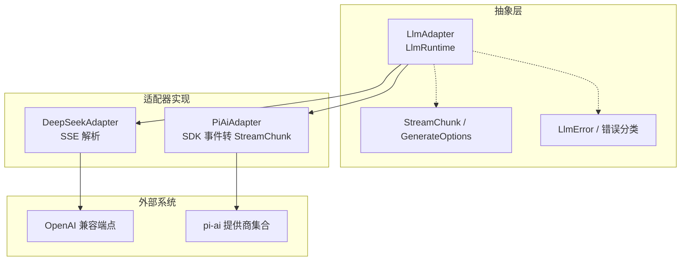
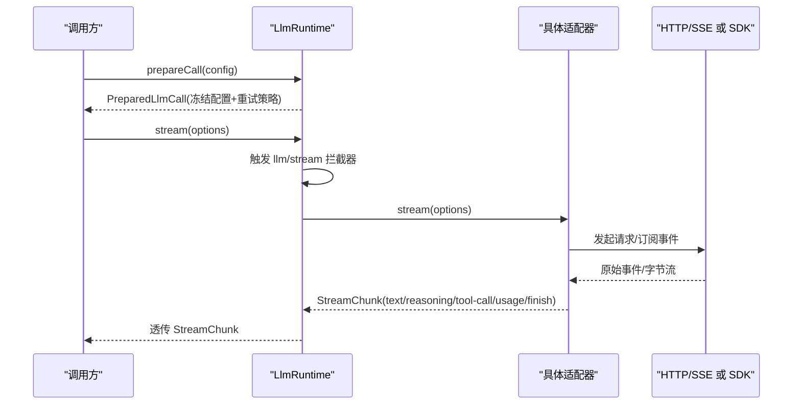
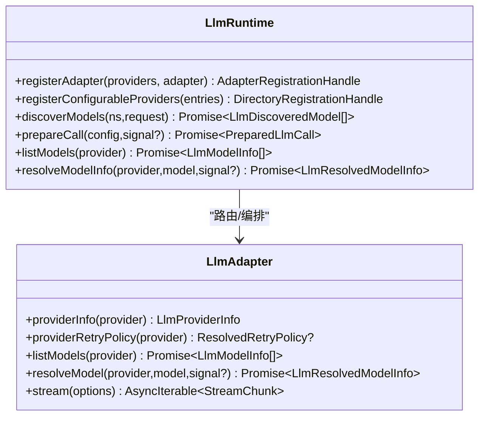
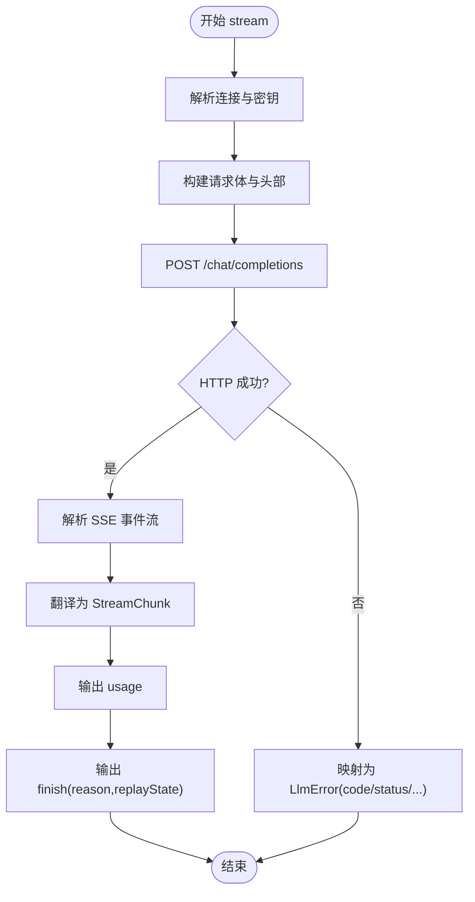
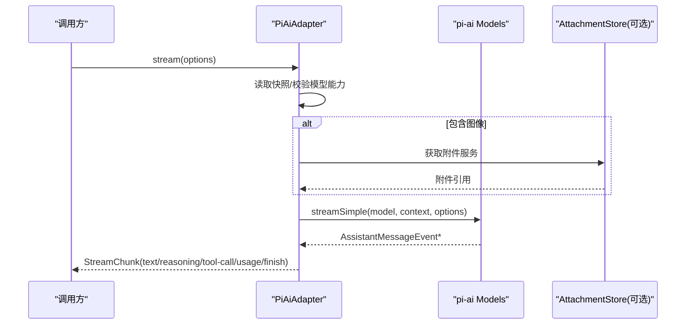
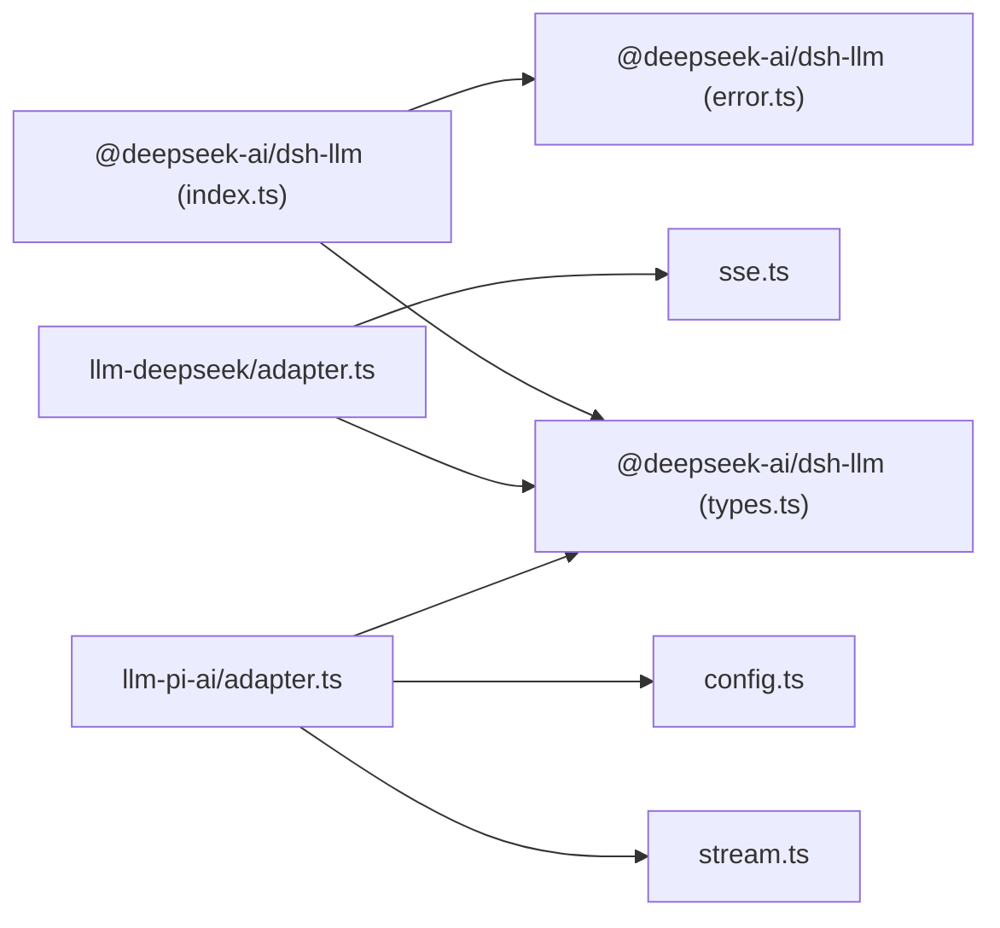

# LLM 适配器集成

<cite>
**本文引用的文件**
- [packages/llm/llm/src/index.ts](file://packages/llm/llm/src/index.ts)
- [packages/llm/llm/src/types.ts](file://packages/llm/llm/src/types.ts)
- [packages/llm/llm/src/error.ts](file://packages/llm/llm/src/error.ts)
- [packages/llm/llm-deepseek/src/adapter.ts](file://packages/llm/llm-deepseek/src/adapter.ts)
- [packages/llm/llm-deepseek/src/sse.ts](file://packages/llm/llm-deepseek/src/sse.ts)
- [packages/llm/llm-deepseek/src/types.ts](file://packages/llm/llm-deepseek/src/types.ts)
- [packages/llm/llm-pi-ai/src/adapter.ts](file://packages/llm/llm-pi-ai/src/adapter.ts)
- [packages/llm/llm-pi-ai/src/stream.ts](file://packages/llm/llm-pi-ai/src/stream.ts)
- [packages/llm/llm-pi-ai/src/config.ts](file://packages/llm/llm-pi-ai/src/config.ts)
- [docs/cookbook/adding-an-llm-adapter.md](file://docs/cookbook/adding-an-llm-adapter.md)
</cite>

## 目录
1. [简介](#简介)
2. [项目结构](#项目结构)
3. [核心组件](#核心组件)
4. [架构总览](#架构总览)
5. [详细组件分析](#详细组件分析)
6. [依赖关系分析](#依赖关系分析)
7. [性能与可靠性](#性能与可靠性)
8. [故障排查指南](#故障排查指南)
9. [结论](#结论)
10. [附录：开发清单与最佳实践](#附录：开发清单与最佳实践)

## 简介
本文件面向希望接入或扩展 LLM 适配器的开发者，系统化说明 Harness 的 LLM 适配器架构、接口规范、流式协议、多模态支持、认证与错误处理、重试与限流、以及注册与动态切换机制。文档同时给出基于 DeepSeek（直连 HTTP + SSE）和 pi-ai（封装 SDK）两种参考实现的对比与实现要点，帮助快速落地自定义模型提供商。

## 项目结构
- 抽象层与运行时
  - @deepseek-ai/dsh-llm：定义适配器抽象、类型、错误、重试策略、注册表与调用编排。
- 具体适配器
  - llm-deepseek：基于 OpenAI 兼容接口的直连 HTTP + SSE 适配器。
  - llm-pi-ai：基于 pi-ai SDK 的多提供商适配器，统一配置与发现。
- 文档与示例
  - cookbook 提供“如何添加 LLM 适配器”的规范与契约说明。

图表来源
- [packages/llm/llm/src/index.ts:174-233](file://packages/llm/llm/src/index.ts#L174-L233)
- [packages/llm/llm/src/types.ts:283-303](file://packages/llm/llm/src/types.ts#L283-L303)
- [packages/llm/llm-deepseek/src/adapter.ts:158-347](file://packages/llm/llm-deepseek/src/adapter.ts#L158-L347)
- [packages/llm/llm-pi-ai/src/adapter.ts:186-359](file://packages/llm/llm-pi-ai/src/adapter.ts#L186-L359)

章节来源
- [packages/llm/llm/src/index.ts:174-233](file://packages/llm/llm/src/index.ts#L174-L233)
- [packages/llm/llm/src/types.ts:283-303](file://packages/llm/llm/src/types.ts#L283-L303)
- [packages/llm/llm-deepseek/src/adapter.ts:158-347](file://packages/llm/llm-deepseek/src/adapter.ts#L158-L347)
- [packages/llm/llm-pi-ai/src/adapter.ts:186-359](file://packages/llm/llm-pi-ai/src/adapter.ts#L186-L359)

## 核心组件
- LlmAdapter：适配器抽象基类，要求实现 stream()，可选实现 providerInfo、providerRetryPolicy、listModels、resolveModel。
- LlmRuntime：适配器注册表与调用编排，提供 registerAdapter、registerConfigurableProviders、discoverModels、prepareCall、listModels、resolveModelInfo 等能力。
- StreamChunk：统一的流式协议块，包含文本、推理、工具调用增量、使用量统计与结束原因。
- LlmError：结构化错误，携带稳定 code、HTTP status、providerRetryAfterMs、requestId 等可序列化事实。

关键职责
- 适配器负责将提供商原始请求/响应映射到 StreamChunk 与 LlmError。
- 运行时负责路由、重试策略、能力校验、模型元数据解析与可插拔拦截（llm/stream 瀑布）。

章节来源
- [packages/llm/llm/src/index.ts:174-233](file://packages/llm/llm/src/index.ts#L174-L233)
- [packages/llm/llm/src/index.ts:284-800](file://packages/llm/llm/src/index.ts#L284-L800)
- [packages/llm/llm/src/types.ts:283-303](file://packages/llm/llm/src/types.ts#L283-L303)
- [packages/llm/llm/src/error.ts:13-117](file://packages/llm/llm/src/error.ts#L13-L117)

## 架构总览
下图展示一次模型调用的端到端流程：上层通过 LlmRuntime.prepareCall 准备并冻结配置，随后进入 llm/stream 瀑布，最终由具体适配器执行网络 I/O 并产出 StreamChunk。

图表来源
- [packages/llm/llm/src/index.ts:779-800](file://packages/llm/llm/src/index.ts#L779-L800)
- [packages/llm/llm/src/types.ts:319-356](file://packages/llm/llm/src/types.ts#L319-L356)
- [packages/llm/llm-deepseek/src/adapter.ts:214-347](file://packages/llm/llm-deepseek/src/adapter.ts#L214-L347)
- [packages/llm/llm-pi-ai/src/adapter.ts:276-359](file://packages/llm/llm-pi-ai/src/adapter.ts#L276-L359)

## 详细组件分析

### 适配器抽象与运行时
- 抽象方法
  - stream(options): 必须实现，按协议产出 StreamChunk。
  - providerInfo(provider): 返回显示信息。
  - providerRetryPolicy(provider): 返回提供商级重试策略。
  - listModels(provider)/resolveModel(provider,model): 描述可用模型与能力。
- 运行时能力
  - registerAdapter(providers, adapter): 原子注册与替换，冲突检测。
  - registerConfigurableProviders(entries): 声明可配置提供者目录。
  - discoverModels(settingsNs, request): 对端点探测模型列表。
  - prepareCall(config): 冻结配置、解析默认值、绑定重试策略。
  - listModels/resolveModelInfo: 对外暴露模型能力与上下文窗口等元数据。

图表来源
- [packages/llm/llm/src/index.ts:174-233](file://packages/llm/llm/src/index.ts#L174-L233)
- [packages/llm/llm/src/index.ts:284-800](file://packages/llm/llm/src/index.ts#L284-L800)

章节来源
- [packages/llm/llm/src/index.ts:174-233](file://packages/llm/llm/src/index.ts#L174-L233)
- [packages/llm/llm/src/index.ts:284-800](file://packages/llm/llm/src/index.ts#L284-L800)

### DeepSeek 适配器（直连 HTTP + SSE）
- 连接管理
  - 每请求解析 base URL、apiKey、用户 ID、默认参数与重试策略；避免跨请求混用凭据。
  - 使用 AbortController 与 idleWatchdog 控制超时与取消。
- 请求构建
  - 将 GenerateOptions 序列化为 OpenAI 兼容 JSON，附加 attribution 头与会话/用途标记。
- 响应解析
  - 使用 eventsource-parser 解析 SSE，遇到 [DONE] 终止；未收到则抛出 STREAM_CLOSED。
  - 将 chunk 翻译为 StreamChunk，严格遵循 usage 在 finish 前、tool-call arguments 保持原始 JSON 字符串等契约。
- 错误处理
  - 非 2xx 响应映射为稳定 LlmError.code（AUTH/RATE_LIMIT/CONTEXT_WINDOW_EXCEEDED/INVALID_REQUEST/SERVER 等），携带 status/providerRetryAfterMs/requestId。
- 流式处理
  - 外层循环消费迭代器，结合 watchdog.next 实现空闲超时保护；异常时区分 ABORTED/TIMEOUT/TRANSPORT。

图表来源
- [packages/llm/llm-deepseek/src/adapter.ts:214-347](file://packages/llm/llm-deepseek/src/adapter.ts#L214-L347)
- [packages/llm/llm-deepseek/src/sse.ts:28-40](file://packages/llm/llm-deepseek/src/sse.ts#L28-L40)
- [packages/llm/llm-deepseek/src/types.ts:12-30](file://packages/llm/llm-deepseek/src/types.ts#L12-L30)

章节来源
- [packages/llm/llm-deepseek/src/adapter.ts:158-347](file://packages/llm/llm-deepseek/src/adapter.ts#L158-L347)
- [packages/llm/llm-deepseek/src/sse.ts:28-40](file://packages/llm/llm-deepseek/src/sse.ts#L28-L40)
- [packages/llm/llm-deepseek/src/types.ts:12-30](file://packages/llm/llm-deepseek/src/types.ts#L12-L30)

### pi-ai 适配器（SDK 封装）
- 配置与快照
  - 每次操作读取当前 profiles 快照，构建不可变 Models 集合；配置变更生成新快照，保证请求一致性。
- 多模态支持
  - 若消息含图像且模型不支持 image 输入，直接拒绝；需要 AttachmentStore 参与图片上传与引用。
- 请求构建
  - 将 GenerateOptions 转换为 pi-ai 上下文与选项；合并 profile 头，保留 attribution 头优先级。
- 响应解析
  - 将 pi-ai 事件流转为 StreamChunk；工具调用参数以原始 JSON 字符串形式输出；结束时输出 usage 与 finish。
- 错误处理
  - 将终端事件中的错误映射为 finish{kind:'error'|'aborted'}；根据消息内容识别 AUTH/RATE_LIMIT/CONTEXT_WINDOW_EXCEEDED/EMPTY_RESPONSE 等。

图表来源
- [packages/llm/llm-pi-ai/src/adapter.ts:276-359](file://packages/llm/llm-pi-ai/src/adapter.ts#L276-L359)
- [packages/llm/llm-pi-ai/src/stream.ts:124-209](file://packages/llm/llm-pi-ai/src/stream.ts#L124-L209)

章节来源
- [packages/llm/llm-pi-ai/src/adapter.ts:186-359](file://packages/llm/llm-pi-ai/src/adapter.ts#L186-L359)
- [packages/llm/llm-pi-ai/src/stream.ts:124-209](file://packages/llm/llm-pi-ai/src/stream.ts#L124-L209)
- [packages/llm/llm-pi-ai/src/config.ts:254-373](file://packages/llm/llm-pi-ai/src/config.ts#L254-L373)

### 流式协议与契约
- 块索引：首次出现顺序分配 index，同一块的增量复用该 index。
- 工具调用：arguments 始终为原始 JSON 字符串；增量以 argumentsDelta 传递。
- 使用量与结束：usage 必须在 finish 之前发出；finish 之后不得再有任何块。
- 错误路径：要么从 stream() 抛出 LlmError（传输/协议失败），要么以 finish{kind:'error'|'aborted'} 结束。
- 信号与取消：必须尊重 options.signal。
- 不支持的能力：如 stop 不被某提供商支持，应抛出 UNSUPPORTED 而非静默丢弃。
- 回放状态：finish.replayState 用于历史重建，需满足同实例/同路由约束。

章节来源
- [docs/cookbook/adding-an-llm-adapter.md:25-35](file://docs/cookbook/adding-an-llm-adapter.md#L25-L35)
- [packages/llm/llm/src/types.ts:283-303](file://packages/llm/llm/src/types.ts#L283-L303)

### 多模态支持（文本、图像、音频）
- 文本：所有适配器均支持。
- 图像：
  - DeepSeek 直连适配器当前声明 text-only 输出；用户侧可携带图像但需由上游组装。
  - pi-ai 适配器在检测到图像输入时，会校验模型是否支持 image，并强制要求存在 AttachmentStore。
- 音频：仓库中未见显式音频块类型；如需扩展，需在 ContentBlockMap 及适配器中新增类型与转换逻辑。

章节来源
- [packages/llm/llm-deepseek/src/adapter.ts:175-212](file://packages/llm/llm-deepseek/src/adapter.ts#L175-L212)
- [packages/llm/llm-pi-ai/src/adapter.ts:301-312](file://packages/llm/llm-pi-ai/src/adapter.ts#L301-L312)
- [packages/llm/llm/src/types.ts:65-75](file://packages/llm/llm/src/types.ts#L65-L75)

### 认证、重试与限流
- 认证
  - DeepSeek：通过 resolveApiKey 钩子获取 Bearer Token，注入 Authorization 头。
  - pi-ai：通过 resolveApiKey(provider, profile) 获取 apiKey，最高优先级覆盖。
- 重试
  - 运行时在注册时解析 providerRetryPolicy；适配器可通过 providerRetryPolicy 返回提供商级策略。
  - 错误码驱动重试决策（如 RATE_LIMIT、QUOTA、CONTEXT_WINDOW_EXCEEDED）。
- 限流
  - 适配器不自行限速；通过 LlmError.providerRetryAfterMs 提示后端建议等待时间，交由上层重试策略处理。

章节来源
- [packages/llm/llm-deepseek/src/adapter.ts:214-235](file://packages/llm/llm-deepseek/src/adapter.ts#L214-L235)
- [packages/llm/llm-pi-ai/src/adapter.ts:276-322](file://packages/llm/llm-pi-ai/src/adapter.ts#L276-L322)
- [packages/llm/llm/src/index.ts:561-568](file://packages/llm/llm/src/index.ts#L561-L568)
- [packages/llm/llm/src/error.ts:24-48](file://packages/llm/llm/src/error.ts#L24-L48)

### 适配器注册、配置管理与动态切换
- 注册
  - registerAdapter(providers, adapter)：全有或全无校验，冲突即抛错；返回可释放句柄与 replace 能力。
  - registerConfigurableProviders(entries)：声明可配置提供者目录，支持 replace 原子替换。
- 动态切换
  - 每次请求前重新解析配置快照（DeepSeek 的 options() 与 pi-ai 的 profiles()），确保热更新生效而无需重启。
- 模型发现
  - registerModelDiscovery(settingsNs, discover) 与 discoverModels(ns, request) 支持对端点探测模型列表。

章节来源
- [packages/llm/llm/src/index.ts:330-484](file://packages/llm/llm/src/index.ts#L330-L484)
- [packages/llm/llm/src/index.ts:494-559](file://packages/llm/llm/src/index.ts#L494-L559)
- [packages/llm/llm-deepseek/src/adapter.ts:43-86](file://packages/llm/llm-deepseek/src/adapter.ts#L43-L86)
- [packages/llm/llm-pi-ai/src/adapter.ts:56-79](file://packages/llm/llm-pi-ai/src/adapter.ts#L56-L79)

### 与不同提供商的集成示例
- OpenAI 兼容（DeepSeek）
  - 直连 /chat/completions，SSE 流；注意 thinking mode 与 reasoning_effort 字段映射。
- Anthropic（通过 pi-ai）
  - 借助 pi-ai 的统一抽象，适配器仅关注事件到 StreamChunk 的转换与错误映射。
- 本地模型/网关
  - 通过 pi-ai 的 baseURL/api 配置或 DeepSeek 的 baseURL 指向自托管端点；模型目录可由 catalog 或配置覆盖。

章节来源
- [packages/llm/llm-deepseek/src/types.ts:12-30](file://packages/llm/llm-deepseek/src/types.ts#L12-L30)
- [packages/llm/llm-pi-ai/src/config.ts:64-141](file://packages/llm/llm-pi-ai/src/config.ts#L64-L141)
- [packages/llm/llm-pi-ai/src/config.ts:301-373](file://packages/llm/llm-pi-ai/src/config.ts#L301-L373)

## 依赖关系分析
- 耦合与内聚
  - 适配器与运行时解耦：适配器只关心自身协议；运行时负责路由、重试与能力校验。
  - 流式协议集中定义于 types.ts，便于多实现一致。
- 外部依赖
  - DeepSeek：eventsource-parser、fetch。
  - pi-ai：@earendil-works/pi-ai SDK、可选 AttachmentStore。
- 潜在环与风险
  - 运行时不反向依赖具体适配器；适配器仅依赖运行时导出类型与工具函数，无环。

图表来源
- [packages/llm/llm/src/index.ts:174-233](file://packages/llm/llm/src/index.ts#L174-L233)
- [packages/llm/llm/src/types.ts:283-303](file://packages/llm/llm/src/types.ts#L283-L303)
- [packages/llm/llm-deepseek/src/adapter.ts:158-347](file://packages/llm/llm-deepseek/src/adapter.ts#L158-L347)
- [packages/llm/llm-deepseek/src/sse.ts:28-40](file://packages/llm/llm-deepseek/src/sse.ts#L28-L40)
- [packages/llm/llm-pi-ai/src/adapter.ts:186-359](file://packages/llm/llm-pi-ai/src/adapter.ts#L186-L359)
- [packages/llm/llm-pi-ai/src/stream.ts:124-209](file://packages/llm/llm-pi-ai/src/stream.ts#L124-L209)
- [packages/llm/llm-pi-ai/src/config.ts:254-373](file://packages/llm/llm-pi-ai/src/config.ts#L254-L373)

章节来源
- [packages/llm/llm/src/index.ts:174-233](file://packages/llm/llm/src/index.ts#L174-L233)
- [packages/llm/llm-deepseek/src/adapter.ts:158-347](file://packages/llm/llm-deepseek/src/adapter.ts#L158-L347)
- [packages/llm/llm-pi-ai/src/adapter.ts:186-359](file://packages/llm/llm-pi-ai/src/adapter.ts#L186-L359)

## 性能与可靠性
- 流式空闲超时：两个适配器均使用 idleWatchdog 防止长时间无活动导致资源泄漏。
- 取消传播：统一通过 AbortSignal 组合 caller 与内部控制器，确保及时释放资源。
- 错误分类：将网络、鉴权、配额、上下文溢出、空响应等错误标准化，便于上层重试与降级。
- 重试策略：运行时在注册时解析并缓存策略；适配器可返回提供商级策略以覆盖默认行为。
- 模型能力前置校验：resolveModelInfo 与 prepareCall 提前拒绝不支持的参数（如 stop、reasoningEffort），减少无效请求。

章节来源
- [packages/llm/llm-deepseek/src/adapter.ts:214-269](file://packages/llm/llm-deepseek/src/adapter.ts#L214-L269)
- [packages/llm/llm-pi-ai/src/adapter.ts:276-359](file://packages/llm/llm-pi-ai/src/adapter.ts#L276-L359)
- [packages/llm/llm/src/index.ts:730-769](file://packages/llm/llm/src/index.ts#L730-L769)

## 故障排查指南
- 常见问题定位
  - 认证失败：检查 API Key 是否为空白或包含非法字符；确认 Authorization 头已注入。
  - 速率限制/配额耗尽：查看 LlmError.code 与 providerRetryAfterMs，调整重试退避。
  - 上下文溢出：识别 CONTEXT_WINDOW_EXCEEDED，缩短 prompt 或启用压缩。
  - 空响应：EMPTY_RESPONSE 表示完成但无内容，考虑重试或调整参数。
  - 流中断：STREAM_CLOSED 表示 SSE/SDK 流未正常结束，检查网络与端点。
- 诊断技巧
  - 使用 errorChain 打印完整 cause 链。
  - 记录 requestId 与 status，便于跨日志关联。
  - 在适配器中保留最小 replayState 以便历史重建。

章节来源
- [packages/llm/llm/src/error.ts:24-117](file://packages/llm/llm/src/error.ts#L24-L117)
- [packages/llm/llm-deepseek/src/adapter.ts:321-345](file://packages/llm/llm-deepseek/src/adapter.ts#L321-L345)
- [packages/llm/llm-pi-ai/src/stream.ts:39-62](file://packages/llm/llm-pi-ai/src/stream.ts#L39-L62)

## 结论
Harness 的 LLM 适配器体系通过清晰的抽象、统一的流式协议与强大的运行时能力，实现了多提供商、多模态、可配置与可观测的模型调用。DeepSeek 与 pi-ai 两种实现分别展示了直连与 SDK 封装的最佳实践。遵循契约与错误分类，可在不改动上层业务的前提下灵活切换与扩展提供商。

## 附录：开发清单与最佳实践
- 实现步骤
  - 继承 LlmAdapter，实现 stream()；必要时实现 providerInfo/providerRetryPolicy/listModels/resolveModel。
  - 严格遵循 StreamChunk 契约：usage 在 finish 前、arguments 保持原始 JSON、block index 顺序稳定。
  - 正确处理 options.signal 与空闲超时。
  - 将错误映射为 LlmError，携带稳定 code、status、providerRetryAfterMs、requestId。
- 配置与注册
  - 使用 ctx.llm.registerAdapter 注册路由；使用 registerConfigurableProviders 声明可配置项。
  - 通过 resolveModelInfo/prepareCall 进行能力校验与默认值填充。
- 多模态
  - 若支持图像，需校验模型能力并接入 AttachmentStore。
- 版本与兼容性
  - 保持向后兼容的协议扩展；新增 ContentBlockType 需同步适配器、UI 与压缩模块。
  - 通过 resolveModelInfo.reasoning.efforts 暴露推理级别，避免暴露底层拼写。

章节来源
- [docs/cookbook/adding-an-llm-adapter.md:7-39](file://docs/cookbook/adding-an-llm-adapter.md#L7-L39)
- [packages/llm/llm/src/types.ts:95-108](file://packages/llm/llm/src/types.ts#L95-L108)
- [packages/llm/llm/src/index.ts:330-484](file://packages/llm/llm/src/index.ts#L330-L484)
- [packages/llm/llm/src/index.ts:730-769](file://packages/llm/llm/src/index.ts#L730-L769)