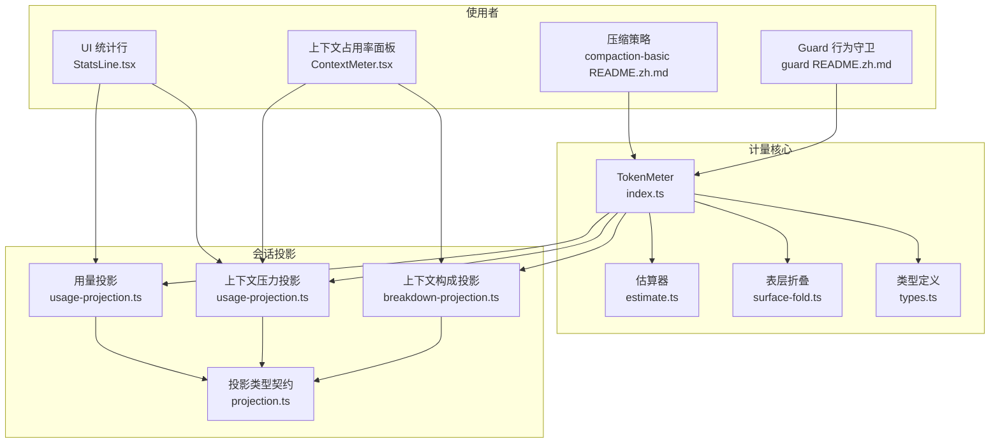
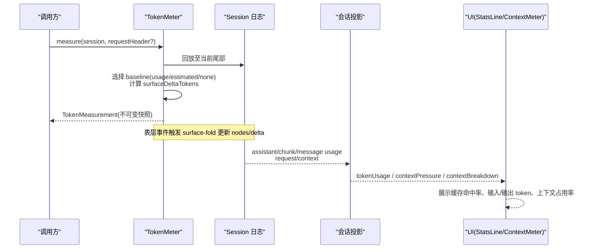
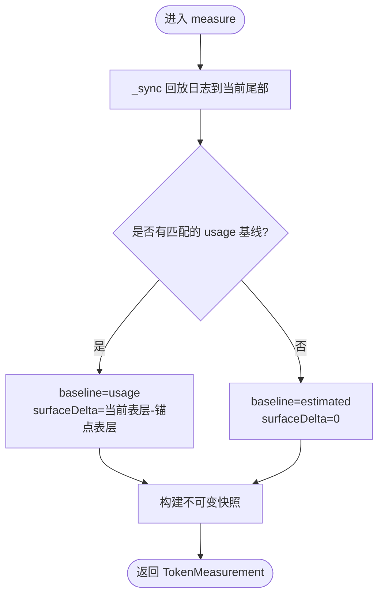
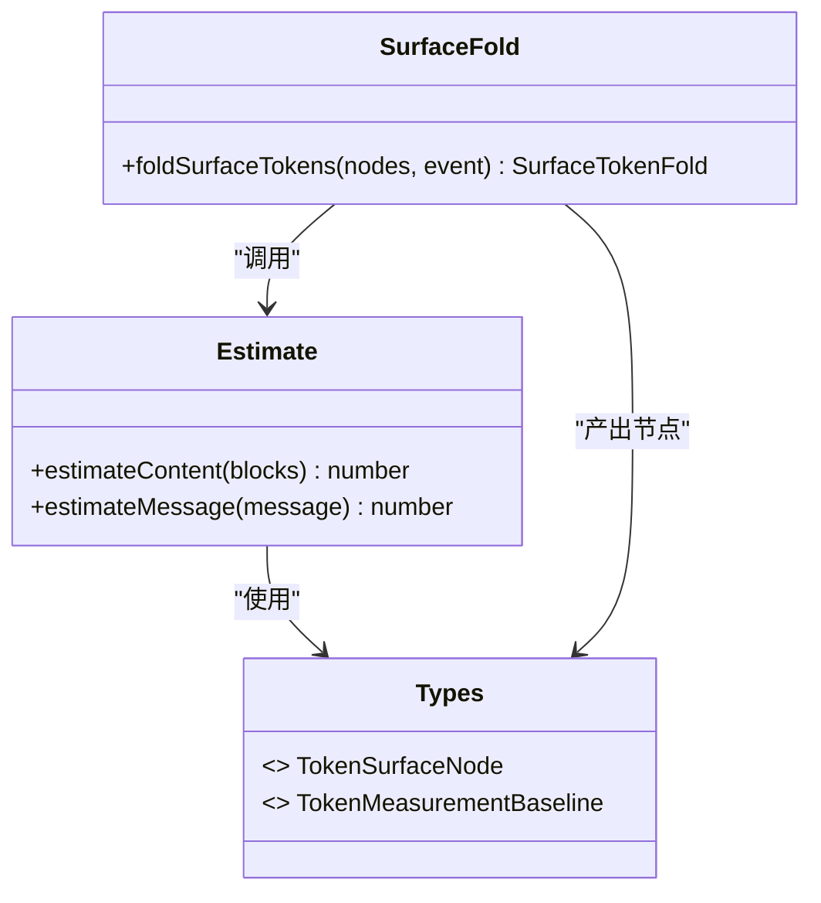
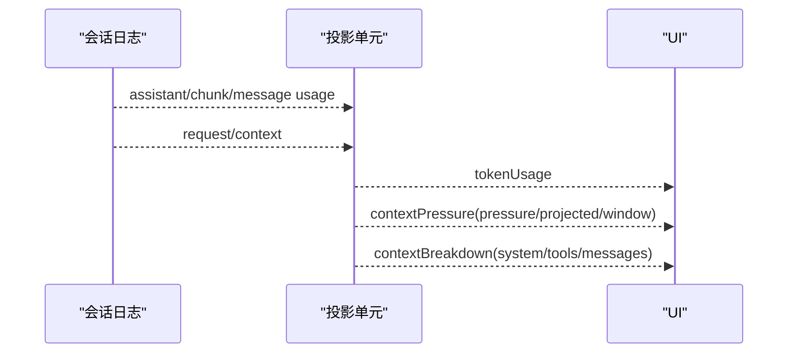
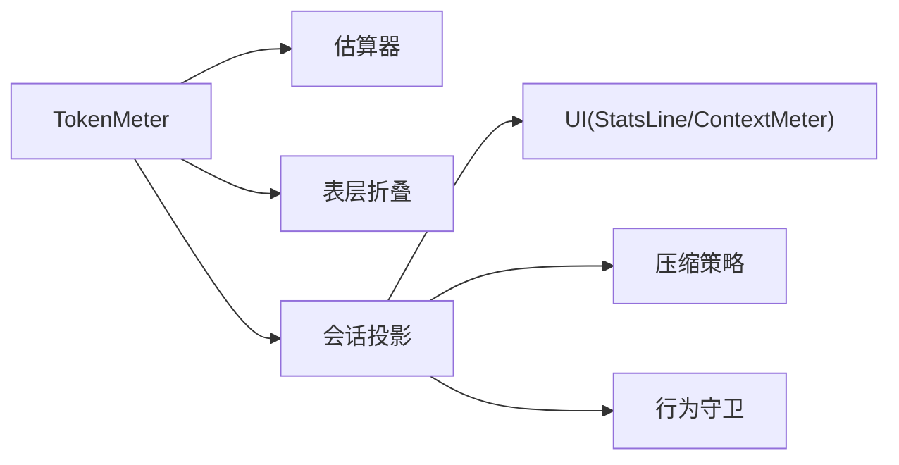

# Token 计量与成本优化

<cite>
**本文引用的文件**
- [packages/llm/token-meter/src/index.ts](file://packages/llm/token-meter/src/index.ts)
- [packages/llm/token-meter/src/types.ts](file://packages/llm/token-meter/src/types.ts)
- [packages/llm/token-meter/src/estimate.ts](file://packages/llm/token-meter/src/estimate.ts)
- [packages/llm/token-meter/src/surface-fold.ts](file://packages/llm/token-meter/src/surface-fold.ts)
- [packages/llm/token-meter/src/usage-projection.ts](file://packages/llm/token-meter/src/usage-projection.ts)
- [packages/llm/token-meter/src/breakdown-projection.ts](file://packages/llm/token-meter/src/breakdown-projection.ts)
- [packages/llm/token-meter/src/projection.ts](file://packages/llm/token-meter/src/projection.ts)
- [docs/subsystems/token-meter.md](file://docs/subsystems/token-meter.md)
- [packages/client/ui-conversation/src/client/chat/StatsLine.tsx](file://packages/client/ui-conversation/src/client/chat/StatsLine.tsx)
- [packages/client/ui-conversation/src/client/skeleton/ContextMeter.tsx](file://packages/client/ui-conversation/src/client/skeleton/ContextMeter.tsx)
- [packages/compaction/compaction-basic/README.zh.md](file://packages/compaction/compaction-basic/README.zh.md)
- [packages/guard/README.zh.md](file://packages/guard/README.zh.md)
- [.agents/notes/implemented/architecture/2026-07-15-replay-token-meter-service.zh.md](file://.agents/notes/implemented/architecture/2026-07-15-replay-token-meter-service.zh.md)
- [.agents/notes/implemented/architecture/2026-07-29-projected-token-usage-and-request-context.zh.md](file://.agents/notes/implemented/architecture/2026-07-29-projected-token-usage-and-request-context.zh.md)
</cite>

## 目录
1. [引言](#引言)
2. [项目结构](#项目结构)
3. [核心组件](#核心组件)
4. [架构总览](#架构总览)
5. [详细组件分析](#详细组件分析)
6. [依赖关系分析](#依赖关系分析)
7. [性能考量](#性能考量)
8. [故障排查指南](#故障排查指南)
9. [结论](#结论)
10. [附录](#附录)

## 引言
本文件围绕 LLM Token 计量与成本优化展开，系统阐述：
- Token 计量的工作原理：输入输出统计、上下文长度计算、成本估算。
- 不同模型的 Token 计算规则与计费方式（提供方 usage 与启发式估算的协同）。
- 成本控制策略：最大 Token 限制、预算管理与使用监控。
- Token 使用分析与优化建议：提示词优化、响应压缩技术。
- 成本报表生成与告警机制的实现思路与落地要点。

该能力由 `@deepseek-ai/dsh-token-meter` 提供，通过会话持久日志回放，为请求压力与当前表层内容提供一致、可复现的计量快照；同时暴露会话投影，用于 UI 展示与下游策略消费。

## 项目结构
Token 计量相关代码集中在 `packages/llm/token-meter`，对外暴露三类能力：
- 测量服务：`ctx.tokenMeter.measure()` 与 `estimateMessage()`，返回不可变快照。
- 会话投影：`tokenUsage`、`contextPressure`、`contextBreakdown`，供 UI 与策略消费。
- 纯函数估算器：固定密度启发式（每 token 约 4 字符）+ 结构开销，保证计量一致性。

图表来源
- [packages/llm/token-meter/src/index.ts:74-157](file://packages/llm/token-meter/src/index.ts#L74-L157)
- [packages/llm/token-meter/src/estimate.ts:1-58](file://packages/llm/token-meter/src/estimate.ts#L1-L58)
- [packages/llm/token-meter/src/surface-fold.ts:1-66](file://packages/llm/token-meter/src/surface-fold.ts#L1-L66)
- [packages/llm/token-meter/src/types.ts:1-43](file://packages/llm/token-meter/src/types.ts#L1-L43)
- [packages/llm/token-meter/src/usage-projection.ts:1-207](file://packages/llm/token-meter/src/usage-projection.ts#L1-L207)
- [packages/llm/token-meter/src/breakdown-projection.ts:1-29](file://packages/llm/token-meter/src/breakdown-projection.ts#L1-L29)
- [packages/llm/token-meter/src/projection.ts:1-78](file://packages/llm/token-meter/src/projection.ts#L1-L78)
- [packages/client/ui-conversation/src/client/chat/StatsLine.tsx:79-129](file://packages/client/ui-conversation/src/client/chat/StatsLine.tsx#L79-L129)
- [packages/client/ui-conversation/src/client/skeleton/ContextMeter.tsx:27-52](file://packages/client/ui-conversation/src/client/skeleton/ContextMeter.tsx#L27-L52)
- [packages/compaction/compaction-basic/README.zh.md:9-95](file://packages/compaction/compaction-basic/README.zh.md#L9-L95)
- [packages/guard/README.zh.md:1-13](file://packages/guard/README.zh.md#L1-L13)

章节来源
- [docs/subsystems/token-meter.md:1-91](file://docs/subsystems/token-meter.md#L1-L91)
- [packages/llm/token-meter/src/index.ts:74-157](file://packages/llm/token-meter/src/index.ts#L74-L157)

## 核心组件
- TokenMeter 服务：基于会话持久日志回放，维护每个会话的独立折叠状态，提供不可变的测量快照。支持复用最近一次成功的提供方 usage 作为基线，并结合当前表层的启发式重定价，得到稳定一致的 totalTokens。
- 估算器 estimate.ts：固定密度启发式（4 字符 ≈ 1 token），对文本、推理、工具调用/结果等块进行结构化开销计价；对未知块采用 JSON 序列化保守估计。
- 表层折叠 surface-fold.ts：将 append/replace 等表层事件映射为节点序列与 deltaTokens，确保替换范围有效性与总量一致性。
- 会话投影：
  - tokenUsage：累计 uncachedInputTokens、outputTokens、cacheReadTokens、cacheWriteTokens，去重合并同 turn/step 的样本。
  - contextPressure：pressureTokens（最新请求的提示侧用量）、projectedTokens（结合表层变化预测下一次请求的提示规模）、contextWindow（路由容量）。
  - contextBreakdown：systemTokens、toolsTokens、messageTokens，描述下次请求上下文的近似组成。
- UI 消费：StatsLine 显示缓存命中率与输入/输出 token；ContextMeter 展示上下文占用率与构成。

章节来源
- [packages/llm/token-meter/src/index.ts:74-157](file://packages/llm/token-meter/src/index.ts#L74-L157)
- [packages/llm/token-meter/src/estimate.ts:1-58](file://packages/llm/token-meter/src/estimate.ts#L1-L58)
- [packages/llm/token-meter/src/surface-fold.ts:1-66](file://packages/llm/token-meter/src/surface-fold.ts#L1-L66)
- [packages/llm/token-meter/src/usage-projection.ts:1-207](file://packages/llm/token-meter/src/usage-projection.ts#L1-L207)
- [packages/llm/token-meter/src/breakdown-projection.ts:1-29](file://packages/llm/token-meter/src/breakdown-projection.ts#L1-L29)
- [packages/client/ui-conversation/src/client/chat/StatsLine.tsx:79-129](file://packages/client/ui-conversation/src/client/chat/StatsLine.tsx#L79-L129)
- [packages/client/ui-conversation/src/client/skeleton/ContextMeter.tsx:27-52](file://packages/client/ui-conversation/src/client/skeleton/ContextMeter.tsx#L27-L52)

## 架构总览
Token 计量以“提供方精确锚点 + 启发式表层重定价”为核心思想：
- 当最近一次成功调用的提供方 usage 与规范化请求头匹配且不低于启发式锚点时，将其作为 baseline；后续表层变化以 signed delta 推进。
- 若无可用锚点或匹配失败，则对整个请求信封与当前表层执行启发式重定价。
- 会话投影将 provider usage 与 request/context 容量记录归并为持久状态，供 UI 与策略消费。

图表来源
- [packages/llm/token-meter/src/index.ts:116-147](file://packages/llm/token-meter/src/index.ts#L116-L147)
- [packages/llm/token-meter/src/surface-fold.ts:42-65](file://packages/llm/token-meter/src/surface-fold.ts#L42-L65)
- [packages/llm/token-meter/src/usage-projection.ts:107-207](file://packages/llm/token-meter/src/usage-projection.ts#L107-L207)
- [packages/client/ui-conversation/src/client/chat/StatsLine.tsx:79-129](file://packages/client/ui-conversation/src/client/chat/StatsLine.tsx#L79-L129)
- [packages/client/ui-conversation/src/client/skeleton/ContextMeter.tsx:27-52](file://packages/client/ui-conversation/src/client/skeleton/ContextMeter.tsx#L27-L52)

## 详细组件分析

### TokenMeter 服务与测量流程
- 单例服务，按会话维护 ReplayState，包含 consumedEvents、header、surface、anchor 等。
- measure() 同步一次并返回深度冻结的快照：totalTokens = max(0, baseline.tokens + surfaceDeltaTokens)，surfaceTokens 为当前表层启发式总量，nodes 为有序节点列表。
- 通过 _foldEvent 处理 request/header、step/start/end 以及 assistant/message 等事件，必要时重建 provider 输出以评估 usage 是否可作为保守基线。

图表来源
- [packages/llm/token-meter/src/index.ts:116-147](file://packages/llm/token-meter/src/index.ts#L116-L147)
- [packages/llm/token-meter/src/index.ts:188-270](file://packages/llm/token-meter/src/index.ts#L188-L270)
- [packages/llm/token-meter/src/index.ts:277-310](file://packages/llm/token-meter/src/index.ts#L277-L310)

章节来源
- [packages/llm/token-meter/src/index.ts:74-157](file://packages/llm/token-meter/src/index.ts#L74-L157)
- [packages/llm/token-meter/src/index.ts:188-310](file://packages/llm/token-meter/src/index.ts#L188-L310)
- [docs/subsystems/token-meter.md:1-91](file://docs/subsystems/token-meter.md#L1-L91)

### 估算器与表层折叠
- 估算器：对 text/reasoning/tool-call/tool-result 等块分别计价，未知块按 JSON 序列化保守估计；每条消息加角色字段开销。
- 表层折叠：append 直接追加节点；replace 需校验 start/end 区间有效性，移除旧节点并插入新节点，deltaTokens = newTokens - removedTokens。

图表来源
- [packages/llm/token-meter/src/estimate.ts:1-58](file://packages/llm/token-meter/src/estimate.ts#L1-L58)
- [packages/llm/token-meter/src/surface-fold.ts:1-66](file://packages/llm/token-meter/src/surface-fold.ts#L1-L66)
- [packages/llm/token-meter/src/types.ts:1-43](file://packages/llm/token-meter/src/types.ts#L1-L43)

章节来源
- [packages/llm/token-meter/src/estimate.ts:1-58](file://packages/llm/token-meter/src/estimate.ts#L1-L58)
- [packages/llm/token-meter/src/surface-fold.ts:1-66](file://packages/llm/token-meter/src/surface-fold.ts#L1-L66)

### 会话投影：用量、压力与构成
- tokenUsage：将 assistant/chunk 与 assistant/message 的 usage 归并为四类桶，同 turn/step 重复样本替换而非累加。
- contextPressure：pressureTokens 来自最新 usage 的提示侧；projectedTokens = pressureTokens + (当前表层 - 采样时表层)，仅在两者均存在时输出；contextWindow 来自最新 request/context。
- contextBreakdown：system/tools/messages 三部分均由相同估算器计价，呈现近似组成而非总量。

图表来源
- [packages/llm/token-meter/src/usage-projection.ts:107-207](file://packages/llm/token-meter/src/usage-projection.ts#L107-L207)
- [packages/llm/token-meter/src/breakdown-projection.ts:1-29](file://packages/llm/token-meter/src/breakdown-projection.ts#L1-L29)
- [packages/llm/token-meter/src/projection.ts:1-78](file://packages/llm/token-meter/src/projection.ts#L1-L78)

章节来源
- [packages/llm/token-meter/src/usage-projection.ts:1-207](file://packages/llm/token-meter/src/usage-projection.ts#L1-L207)
- [packages/llm/token-meter/src/breakdown-projection.ts:1-29](file://packages/llm/token-meter/src/breakdown-projection.ts#L1-L29)
- [packages/llm/token-meter/src/projection.ts:1-78](file://packages/llm/token-meter/src/projection.ts#L1-L78)

### UI 展示与成本报表
- StatsLine：展示缓存命中率、输入/输出 token 计数，仅在有实际 token 活动时显示。
- ContextMeter：展示上下文占用率与 system/tools/messages 构成，模型切换时自动关闭不可用面板。
- 报表生成：通过 sessionProjections 的持久化 checkpoint 恢复 tokenUsage/contextPressure/contextBreakdown，可在后端或前端聚合为报表。

章节来源
- [packages/client/ui-conversation/src/client/chat/StatsLine.tsx:79-129](file://packages/client/ui-conversation/src/client/chat/StatsLine.tsx#L79-L129)
- [packages/client/ui-conversation/src/client/skeleton/ContextMeter.tsx:27-52](file://packages/client/ui-conversation/src/client/skeleton/ContextMeter.tsx#L27-L52)
- [packages/llm/token-meter/src/usage-projection.ts:107-207](file://packages/llm/token-meter/src/usage-projection.ts#L107-L207)

### 成本控制策略：最大 Token 限制、预算管理、使用监控
- 最大 Token 限制：通过 compaction-basic 读取 ctx.tokenMeter 的最新压力，结合适配器提供的模型容量，应用阈值比例与保留策略，在压力接近或超过窗口时触发压缩。
- 预算管理：guard 家族可监视循环中的无效模式并强制执行单次调用预算；配合 token 计量可实现“按调用次数/轮次”的预算控制。
- 使用监控：通过 tokenUsage 累计各桶，结合 projectedTokens 与 contextWindow 计算占用率，实现实时看板与历史报表。

章节来源
- [packages/compaction/compaction-basic/README.zh.md:9-95](file://packages/compaction/compaction-basic/README.zh.md#L9-L95)
- [packages/guard/README.zh.md:1-13](file://packages/guard/README.zh.md#L1-L13)
- [packages/llm/token-meter/src/usage-projection.ts:107-207](file://packages/llm/token-meter/src/usage-projection.ts#L107-L207)

### 提示词优化与响应压缩技术
- 提示词优化：减少不必要的 system/tools 内容；拆分长工具 schema；避免冗余对话历史；利用上下文构成投影定位高占比部分。
- 响应压缩：启用 compaction-basic 自动压缩；对超大工具结果使用可选 pruner 在不依赖模型的前提下剪枝；压缩后重新测量压力，确认回到安全范围。

章节来源
- [packages/compaction/compaction-basic/README.zh.md:9-95](file://packages/compaction/compaction-basic/README.zh.md#L9-L95)
- [packages/llm/token-meter/src/breakdown-projection.ts:1-29](file://packages/llm/token-meter/src/breakdown-projection.ts#L1-L29)

### 成本报表生成与告警机制
- 报表生成：基于 sessionProjections 的 tokenUsage 与 contextPressure，导出累计输入/输出、缓存命中、占用率趋势；可通过 checkpoint 恢复跨进程/重启后的数据。
- 告警机制：
  - 基于 projectedTokens 与 contextWindow 的占用率阈值触发告警（例如 >80% 预警，>95% 阻断）。
  - 基于 guard 的重复工具提醒与超时策略，防止无效循环导致成本飙升。
  - 结合 UI 的 StatsLine/ContextMeter 实时反馈，便于快速定位异常会话。

章节来源
- [packages/llm/token-meter/src/usage-projection.ts:107-207](file://packages/llm/token-meter/src/usage-projection.ts#L107-L207)
- [packages/guard/README.zh.md:1-13](file://packages/guard/README.zh.md#L1-L13)
- [packages/client/ui-conversation/src/client/chat/StatsLine.tsx:79-129](file://packages/client/ui-conversation/src/client/chat/StatsLine.tsx#L79-L129)
- [packages/client/ui-conversation/src/client/skeleton/ContextMeter.tsx:27-52](file://packages/client/ui-conversation/src/client/skeleton/ContextMeter.tsx#L27-L52)

## 依赖关系分析
- TokenMeter 依赖会话事件流与 LLM 消息结构，通过估算器与表层折叠保持一致性。
- 投影单元依赖会话日志中的 usage 与 request/context 事件，输出稳定的持久化视图。
- UI 层消费投影值，不持有本地指标缓存，避免分页与压缩导致的失真。
- 压缩与 guard 策略消费 TokenMeter 与投影，形成闭环的成本控制。

图表来源
- [packages/llm/token-meter/src/index.ts:74-157](file://packages/llm/token-meter/src/index.ts#L74-L157)
- [packages/llm/token-meter/src/usage-projection.ts:107-207](file://packages/llm/token-meter/src/usage-projection.ts#L107-L207)
- [packages/client/ui-conversation/src/client/chat/StatsLine.tsx:79-129](file://packages/client/ui-conversation/src/client/chat/StatsLine.tsx#L79-L129)
- [packages/client/ui-conversation/src/client/skeleton/ContextMeter.tsx:27-52](file://packages/client/ui-conversation/src/client/skeleton/ContextMeter.tsx#L27-L52)
- [packages/compaction/compaction-basic/README.zh.md:9-95](file://packages/compaction/compaction-basic/README.zh.md#L9-L95)
- [packages/guard/README.zh.md:1-13](file://packages/guard/README.zh.md#L1-L13)

章节来源
- [packages/llm/token-meter/src/index.ts:74-157](file://packages/llm/token-meter/src/index.ts#L74-L157)
- [packages/llm/token-meter/src/usage-projection.ts:107-207](file://packages/llm/token-meter/src/usage-projection.ts#L107-L207)

## 性能考量
- 测量复杂度：measure() 每次克隆位置节点，时间复杂度 O(surface)；但保证结果一致性与不可变性。
- 投影状态：tokenUsage/contextPressure/contextBreakdown 使用 O(1) 运行态与 shadow-price 协议，避免全量复制。
- 缓存命中：通过 cacheReadTokens/cacheWriteTokens 统计 KV 缓存效果，降低重复提示成本。
- 压缩收益：压缩会缩小表层，从而降低下一次请求的 projectedTokens；pruner 可在不依赖模型的情况下修复工具对。

章节来源
- [packages/llm/token-meter/src/index.ts:116-147](file://packages/llm/token-meter/src/index.ts#L116-L147)
- [packages/llm/token-meter/src/usage-projection.ts:107-207](file://packages/llm/token-meter/src/usage-projection.ts#L107-L207)
- [packages/compaction/compaction-basic/README.zh.md:9-95](file://packages/compaction/compaction-basic/README.zh.md#L9-L95)

## 故障排查指南
- 事件顺序错误：step/end 无对应 step/start、assistant/message 无对应 step/start 会抛出明确错误，便于定位日志损坏或逻辑错误。
- 替换范围无效：replace 操作的 start/end 不在当前 nodes 中会报错，表明日志被篡改或序列不一致。
- 配置键拒绝：TokenMeterConfig 不接受任何配置键，误配将立即失败，避免静默降级。
- 投影未注册：卸载 token-meter 后会移除三个投影键；若 UI 或策略依赖这些键，需确保插件已加载。

章节来源
- [packages/llm/token-meter/src/index.ts:188-270](file://packages/llm/token-meter/src/index.ts#L188-L270)
- [packages/llm/token-meter/src/surface-fold.ts:42-65](file://packages/llm/token-meter/src/surface-fold.ts#L42-L65)
- [packages/llm/token-meter/src/index.ts:60-65](file://packages/llm/token-meter/src/index.ts#L60-L65)

## 结论
- Token 计量以“提供方 usage 锚点 + 启发式表层重定价”为核心，兼顾准确性与一致性。
- 会话投影提供持久、可恢复的用量与上下文占用视图，支撑 UI 展示与策略决策。
- 成本控制通过压缩、pruner 与 guard 策略形成闭环；结合 UI 实时监控与报表，可实现从预防到治理的全链路成本管理。
- 建议在工程实践中优先优化提示词与工具 schema，其次启用自动压缩与 pruner，最后通过告警与预算策略兜底。

## 附录
- 设计要点回顾：
  - 计量快照不可变且带 logRevision，便于审计与回放。
  - 上下文占用率为近似值，面向用户参考，不作为门控输入。
  - 投影与 UI 解耦，避免分页与压缩带来的失真。
- 扩展方向：
  - 接入更精细的分词器以替代固定密度启发式。
  - 增加多模型成本权重与预算分配策略。
  - 引入外部告警通道（邮件/IM）与自动化回滚策略。