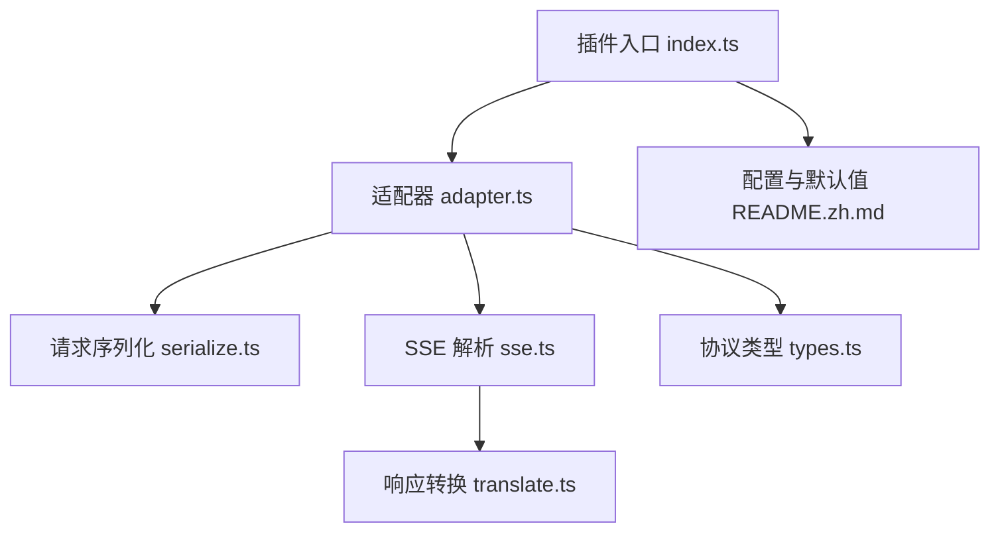
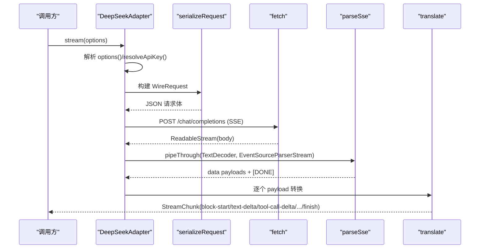
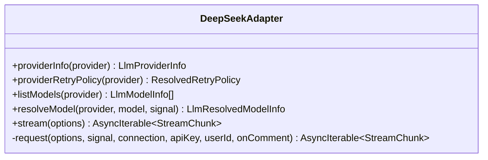
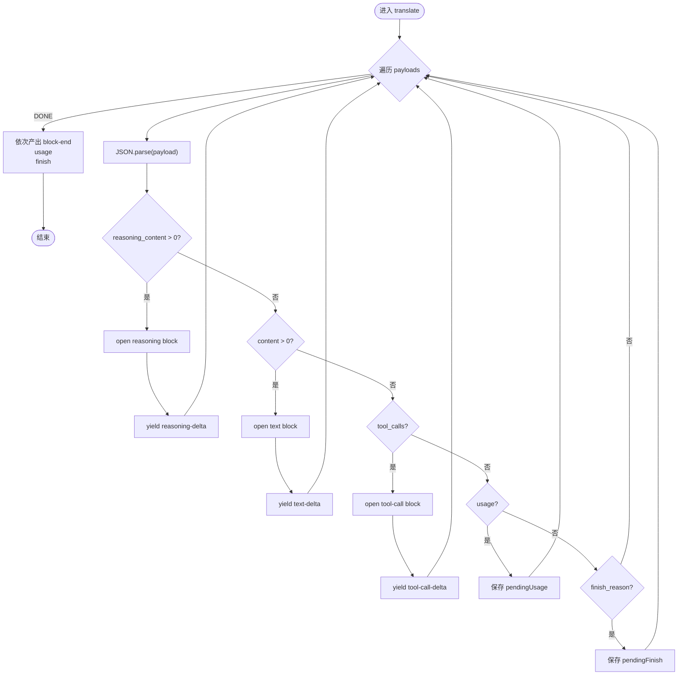
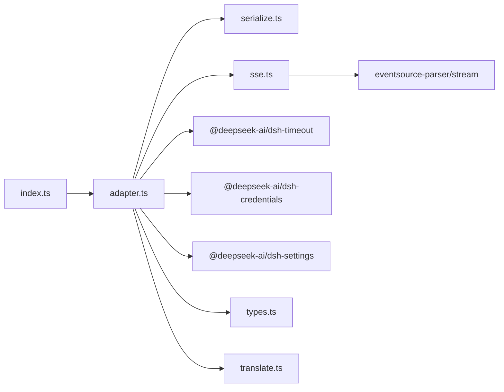

# DeepSeek 适配器实现

<cite>
**本文引用的文件**
- [adapter.ts](file://packages/llm/llm-deepseek/src/adapter.ts)
- [index.ts](file://packages/llm/llm-deepseek/src/index.ts)
- [serialize.ts](file://packages/llm/llm-deepseek/src/serialize.ts)
- [sse.ts](file://packages/llm/llm-deepseek/src/sse.ts)
- [translate.ts](file://packages/llm/llm-deepseek/src/translate.ts)
- [types.ts](file://packages/llm/llm-deepseek/src/types.ts)
- [README.zh.md](file://packages/llm/llm-deepseek/README.zh.md)
- [adapter.spec.ts](file://packages/llm/llm-deepseek/tests/adapter.spec.ts)
</cite>

## 目录
1. [简介](#简介)
2. [项目结构](#项目结构)
3. [核心组件](#核心组件)
4. [架构总览](#架构总览)
5. [详细组件分析](#详细组件分析)
6. [依赖关系分析](#依赖关系分析)
7. [性能考虑](#性能考虑)
8. [故障排除指南](#故障排除指南)
9. [结论](#结论)
10. [附录：配置与使用示例](#附录配置与使用示例)

## 简介
本文件面向 DeepSeek 提供商适配器的实现，系统性说明其 API 调用封装、请求序列化、响应反序列化与流式事件处理机制；重点解释 SSE（Server-Sent Events）的连接管理、消息解析与错误处理；文档化模型配置选项、参数映射规则与认证流程；并提供文本生成、多模态输入限制与工具调用的使用方法与最佳实践。该适配器基于 OpenAI 兼容的 chat-completions 端点，采用直接 fetch + SSE 的方式实现流式输出，并通过内部转换器将 DeepSeek 协议格式转换为 harness 统一的 StreamChunk 协议。

## 项目结构
DeepSeek 适配器位于 packages/llm/llm-deepseek 下，核心由以下模块组成：
- 适配器与插件注册：adapter.ts、index.ts
- 请求序列化：serialize.ts
- SSE 解析：sse.ts
- 响应转换：translate.ts
- 协议类型定义：types.ts
- 中文文档与行为约定：README.zh.md
- 测试与行为验证：tests/adapter.spec.ts 等



图表来源
- [index.ts:1-277](file://packages/llm/llm-deepseek/src/index.ts#L1-L277)
- [adapter.ts:1-347](file://packages/llm/llm-deepseek/src/adapter.ts#L1-L347)
- [serialize.ts:1-188](file://packages/llm/llm-deepseek/src/serialize.ts#L1-L188)
- [sse.ts:1-41](file://packages/llm/llm-deepseek/src/sse.ts#L1-L41)
- [translate.ts:1-186](file://packages/llm/llm-deepseek/src/translate.ts#L1-L186)
- [types.ts:1-153](file://packages/llm/llm-deepseek/src/types.ts#L1-L153)
- [README.zh.md:1-115](file://packages/llm/llm-deepseek/README.zh.md#L1-L115)

章节来源
- [index.ts:1-277](file://packages/llm/llm-deepseek/src/index.ts#L1-L277)
- [adapter.ts:1-347](file://packages/llm/llm-deepseek/src/adapter.ts#L1-L347)

## 核心组件
- 适配器类 DeepSeekAdapter：负责建立连接、发送请求、读取并转发 SSE 流、超时与取消控制、错误码归一化。
- 插件入口 apply：注册 provider 路由、动态配置、凭据解析、重试策略注入。
- 序列化器 serializeRequest：将 harness 消息与工具定义序列化为 DeepSeek wire 请求体。
- SSE 解析器 parseSse：基于 eventsource-parser/stream 对字节流进行分帧，产出 data 载荷并在 [DONE] 时结束。
- 转换器 translate：将 DeepSeek 流式 chunk 组装为 harness 的 StreamChunk（文本、推理、工具调用块），延迟 usage 与 finish。
- 协议类型 types：定义 wire 请求、消息、工具、chunk、usage、error 等类型。

章节来源
- [adapter.ts:158-347](file://packages/llm/llm-deepseek/src/adapter.ts#L158-L347)
- [index.ts:200-277](file://packages/llm/llm-deepseek/src/index.ts#L200-L277)
- [serialize.ts:151-188](file://packages/llm/llm-deepseek/src/serialize.ts#L151-L188)
- [sse.ts:20-41](file://packages/llm/llm-deepseek/src/sse.ts#L20-L41)
- [translate.ts:86-186](file://packages/llm/llm-deepseek/src/translate.ts#L86-L186)
- [types.ts:12-153](file://packages/llm/llm-deepseek/src/types.ts#L12-L153)

## 架构总览
适配器通过插件入口暴露可配置的 provider 路由 deepseek-official。每次 stream 调用会：
- 解析连接事实（baseURL、默认 thinking/reasoningEffort、maxTokens、contextWindow、models、streamIdleTimeoutMs、retryPolicy）。
- 解析当前请求的 API Key（来自凭据服务或环境变量）。
- 构造请求头（包含授权、应用归因、用户与会话标识、压缩标记）。
- 发起 POST /chat/completions，接收 SSE 流。
- 通过 parseSse 分帧，translate 组装成 StreamChunk 并逐条 yield。
- 使用 idleWatchdog 在空闲超时时抛出 TIMEOUT，并在调用方 abort 时抛出 ABORTED。



图表来源
- [adapter.ts:214-347](file://packages/llm/llm-deepseek/src/adapter.ts#L214-L347)
- [serialize.ts:151-188](file://packages/llm/llm-deepseek/src/serialize.ts#L151-L188)
- [sse.ts:20-41](file://packages/llm/llm-deepseek/src/sse.ts#L20-L41)
- [translate.ts:86-186](file://packages/llm/llm-deepseek/src/translate.ts#L86-L186)

## 详细组件分析

### 适配器 DeepSeekAdapter
- 职责：提供 providerInfo、listModels、resolveModel、stream。
- 关键行为：
  - listModels 返回配置的 models 列表（仅用于发现）。
  - resolveModel 根据配置与 defaults 计算 contextWindow、defaultMaxTokens、reasoning efforts。
  - stream 使用 AbortSignal.any 合并上游信号与内部控制器，使用 idleWatchdog 监控空闲超时。
  - request 内完成序列化、设置头部、发起 fetch、错误码映射、SSE 管道与转换。
- 错误处理：
  - 非 2xx 响应通过 httpErrorCode 映射为 AUTH、QUOTA、RATE_LIMIT、CONTEXT_WINDOW_EXCEEDED、INVALID_REQUEST、SERVER 等稳定 code。
  - 传输层失败包装为 TRANSPORT，携带 cause。
  - 超时与取消分别抛出 TIMEOUT 与 ABORTED。



图表来源
- [adapter.ts:158-347](file://packages/llm/llm-deepseek/src/adapter.ts#L158-L347)

章节来源
- [adapter.ts:107-212](file://packages/llm/llm-deepseek/src/adapter.ts#L107-L212)
- [adapter.ts:214-347](file://packages/llm/llm-deepseek/src/adapter.ts#L214-L347)

### 插件入口与配置解析
- 注册 provider 路由 deepseek-official，暴露 settings namespace llm-deepseek。
- 配置项包括 apiKeyEnv、baseURL、thinking、reasoningEffort、maxTokens、defaultContextWindow、models、streamIdleTimeoutMs、retryPolicy。
- 动态配置：settings 变更即时生效；credentials 每请求解析；唯一在注册期捕获的是 retryPolicy，变化时会原地替换注册。
- 默认模型：deepseek-v4-flash、deepseek-v4-pro，上下文窗口默认 1,000,000。

章节来源
- [index.ts:41-104](file://packages/llm/llm-deepseek/src/index.ts#L41-L104)
- [index.ts:117-198](file://packages/llm/llm-deepseek/src/index.ts#L117-L198)
- [index.ts:200-277](file://packages/llm/llm-deepseek/src/index.ts#L200-L277)
- [README.zh.md:11-59](file://packages/llm/llm-deepseek/README.zh.md#L11-L59)

### 请求序列化 serializeRequest
- 将 harness 消息转为 DeepSeek wire messages：
  - system 转 system message。
  - assistant 保留 reasoning_content 仅在含 tool_calls 的轮次回传。
  - user 中的 tool-result 展开为独立的 role:'tool' 消息。
- 工具定义 tools 以 function schema 形式传递。
- 思考模式与推理强度：
  - off → thinking.type: disabled，不发送 reasoning_effort。
  - high/max → thinking.type: enabled，并发送 reasoning_effort。
  - session-title 强制禁用思考。
- 其他字段：temperature、max_tokens、stop。

章节来源
- [serialize.ts:14-53](file://packages/llm/llm-deepseek/src/serialize.ts#L14-L53)
- [serialize.ts:55-141](file://packages/llm/llm-deepseek/src/serialize.ts#L55-L141)
- [serialize.ts:151-188](file://packages/llm/llm-deepseek/src/serialize.ts#L151-L188)

### SSE 解析与连接管理
- 使用 eventsource-parser/stream 的 EventSourceParserStream 进行标准 SSE 分帧（UTF-8/CRLF/BOM、注释跳过、多条 data 拼接）。
- 产出每个事件的 data 载荷，遇到 [DONE] 终止；若 EOF 前未收到 [DONE]，抛出 STREAM_CLOSED。
- 可选 onComment 回调用于记录传输活动（如 keep-alive 注释），不影响业务数据流。
- 适配器侧使用 idleWatchdog 在流空闲超时后中断读取，避免资源泄漏。

```mermaid
flowchart TD
Start(["开始读取 SSE"]) --> Pipe["TextDecoderStream -> EventSourceParserStream"]
Pipe --> ForEach{"收到 data?"}
ForEach --> |是| CheckDone{"data == '[DONE]'?"}
CheckDone --> |是| End(["结束"])
CheckDone --> |否| Yield["yield data"] --> ForEach
ForEach --> |否(EOF)| Error["抛出 STREAM_CLOSED"]
```

图表来源
- [sse.ts:20-41](file://packages/llm/llm-deepseek/src/sse.ts#L20-L41)
- [adapter.ts:214-269](file://packages/llm/llm-deepseek/src/adapter.ts#L214-L269)

章节来源
- [sse.ts:1-41](file://packages/llm/llm-deepseek/src/sse.ts#L1-L41)
- [adapter.ts:214-269](file://packages/llm/llm-deepseek/src/adapter.ts#L214-L269)

### 响应转换 translate
- 状态机维护 text、reasoning、tool-call 三类 open block，按到达顺序产出 block-start、delta、block-end。
- reasoning 优先于 text 处理；首个空 reasoning 片段不打开 block。
- tool-call 按 index 聚合，首 delta 携带 id/name，后续 arguments 片段拼接。
- finish_reason 与 usage 延迟到 [DONE] 时统一产出，确保 finish 之后无内容。
- 空响应（无开启任何 block 即 finish）映射为 EMPTY_RESPONSE 错误。



图表来源
- [translate.ts:86-186](file://packages/llm/llm-deepseek/src/translate.ts#L86-L186)

章节来源
- [translate.ts:1-186](file://packages/llm/llm-deepseek/src/translate.ts#L1-L186)

### 认证流程
- 每请求从同一份连接快照中解析 API Key：优先 ctx.credentials.resolve(ref)，否则回退到受信环境层。
- 校验密钥可用性，非法密钥抛出 INVALID_CREDENTIAL；缺失密钥抛出 MISSING_CREDENTIAL。
- 请求头携带 authorization: Bearer <key>，以及 x-deepseek-harness-user-id 与可选的 x-deepseek-harness-session-id。

章节来源
- [index.ts:225-246](file://packages/llm/llm-deepseek/src/index.ts#L225-L246)
- [adapter.ts:271-295](file://packages/llm/llm-deepseek/src/adapter.ts#L271-L295)

### 模型配置与参数映射
- 模型目录 models：仅建议性展示，未列出模型仍可原样传递。
- contextWindow：精确模型值优先，否则回退 defaultContextWindow。
- maxTokens：模型级 maxTokens 优先，其次 profile 默认值，最后显式请求覆盖。
- thinking/reasoningEffort：
  - off → thinking.type: disabled，不发送 reasoning_effort。
  - high/max → thinking.type: enabled，并发送 reasoning_effort。
  - session-title 强制禁用思考。
- 工具定义：function schema 透传。

章节来源
- [index.ts:117-198](file://packages/llm/llm-deepseek/src/index.ts#L117-L198)
- [adapter.ts:175-212](file://packages/llm/llm-deepseek/src/adapter.ts#L175-L212)
- [serialize.ts:25-53](file://packages/llm/llm-deepseek/src/serialize.ts#L25-L53)
- [serialize.ts:151-188](file://packages/llm/llm-deepseek/src/serialize.ts#L151-L188)

## 依赖关系分析
- 运行时依赖：eventsource-parser/stream（SSE 分帧）、dsh-timeout（idleWatchdog）、dsh-credentials（凭据解析）、dsh-settings（动态配置）、dsh-anonymous-user-id（匿名用户 ID）。
- 外部接口：fetch 直接调用 DeepSeek /chat/completions。
- 内部依赖：serialize.ts、sse.ts、translate.ts、types.ts。



图表来源
- [index.ts:14-29](file://packages/llm/llm-deepseek/src/index.ts#L14-L29)
- [adapter.ts:11-27](file://packages/llm/llm-deepseek/src/adapter.ts#L11-L27)
- [sse.ts:14-15](file://packages/llm/llm-deepseek/src/sse.ts#L14-L15)

章节来源
- [index.ts:14-29](file://packages/llm/llm-deepseek/src/index.ts#L14-L29)
- [adapter.ts:11-27](file://packages/llm/llm-deepseek/src/adapter.ts#L11-L27)
- [sse.ts:14-15](file://packages/llm/llm-deepseek/src/sse.ts#L14-L15)

## 性能考虑
- 流式处理：SSE 分帧与转换均为流式，减少内存占用与端到端延迟。
- 空闲超时：streamIdleTimeoutMs 防止长连接空闲导致资源占用；SSE 注释（keep-alive）可视为传输活动保持活跃。
- 最小化请求体：仅发送必要字段，避免 null 值；assistant 推理内容仅在含 tool_calls 的轮次回传，节省 token。
- 缓存命中：usage 中报告 cacheReadTokens，有助于评估 KV Cache 复用效果。
- 重试策略：provider 级 retryPolicy 在 agent 步骤边界执行，避免重复请求风暴。

[本节为通用指导，无需具体文件引用]

## 故障排除指南
- 认证失败：检查 credentials 是否挂载且可用；确认 apiKeyEnv 指向的环境变量或凭据存储正确。
- 配额/限流：429 或提供方详细信息指示配额耗尽时，遵循 Retry-After 或指数退避策略。
- 上下文溢出：400 且提供方信息指示上下文超限，需缩短历史或降低 maxTokens。
- 传输错误：DNS/TLS/代理失败会抛出 TRANSPORT，附带 cause；检查网络与代理配置。
- 流异常：STREAM_CLOSED（缺少 [DONE]）或 MALFORMED_RESPONSE（JSON 解析失败）；检查服务端 SSE 规范符合性。
- 空响应：finish 无内容块时映射为 EMPTY_RESPONSE，默认策略会重试；检查模型是否返回有效内容。

章节来源
- [adapter.ts:138-149](file://packages/llm/llm-deepseek/src/adapter.ts#L138-L149)
- [adapter.ts:321-344](file://packages/llm/llm-deepseek/src/adapter.ts#L321-L344)
- [translate.ts:101-118](file://packages/llm/llm-deepseek/src/translate.ts#L101-L118)
- [translate.ts:120-125](file://packages/llm/llm-deepseek/src/translate.ts#L120-L125)
- [sse.ts:20-41](file://packages/llm/llm-deepseek/src/sse.ts#L20-L41)

## 结论
DeepSeek 适配器以简洁可靠的 fetch + SSE 方式对接官方 chat-completions 端点，通过严格的序列化与转换逻辑，将 DeepSeek 协议无缝映射到 harness 的 StreamChunk 协议。其动态配置、凭据解析、空闲超时与错误码归一化能力，为上层应用提供了稳定、可观测、易扩展的 LLM 接入层。

[本节为总结，无需具体文件引用]

## 附录：配置与使用示例
- 配置项参考：apiKeyEnv、baseURL、thinking、reasoningEffort、maxTokens、defaultContextWindow、models、streamIdleTimeoutMs、retryPolicy。
- 文本生成：使用 provider: deepseek-official，model 为已配置或原样传递的模型名；messages 包含 system/user/assistant 历史；tools 可选。
- 多模态输入：当前 chat-completions 适配器仅支持文本；若消息包含图像内容，将抛出 UNSUPPORTED_CONTENT。
- 工具调用：在 messages 中回放 assistant 的 tool_calls，并将结果以 role:'tool' 消息追加；适配器会正确处理 reasoning_content 的回传。
- 流式消费：订阅 ctx.llm.stream 或 adapter.stream，依次处理 block-start、text-delta/reasoning-delta/tool-call-delta、block-end、usage、finish。

章节来源
- [README.zh.md:11-59](file://packages/llm/llm-deepseek/README.zh.md#L11-L59)
- [serialize.ts:63-68](file://packages/llm/llm-deepseek/src/serialize.ts#L63-L68)
- [adapter.spec.ts:59-109](file://packages/llm/llm-deepseek/tests/adapter.spec.ts#L59-L109)
- [adapter.spec.ts:111-142](file://packages/llm/llm-deepseek/tests/adapter.spec.ts#L111-L142)
- [adapter.spec.ts:144-200](file://packages/llm/llm-deepseek/tests/adapter.spec.ts#L144-L200)