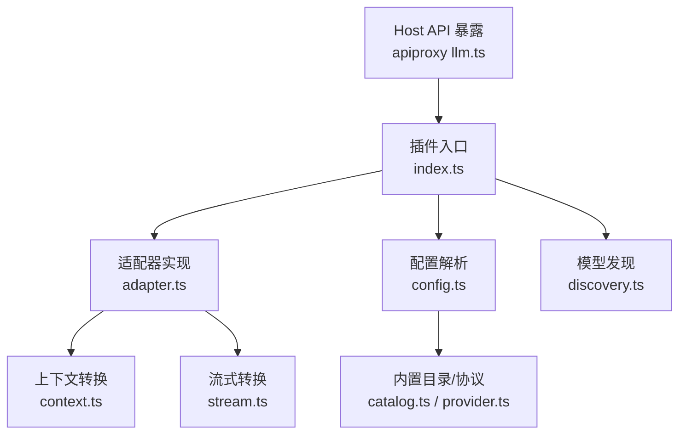
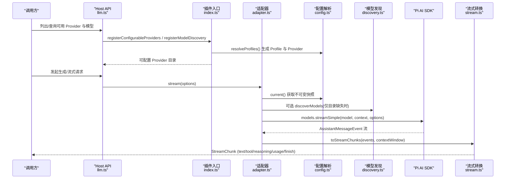
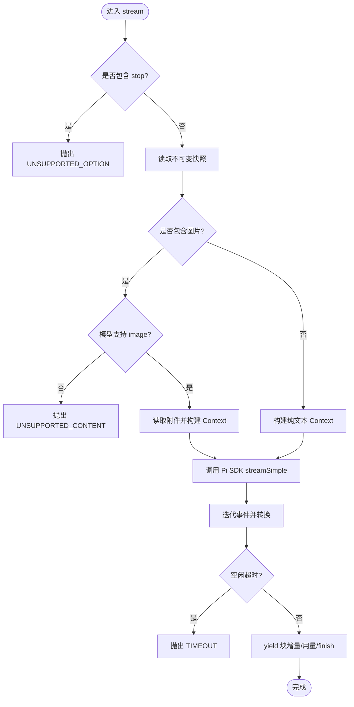
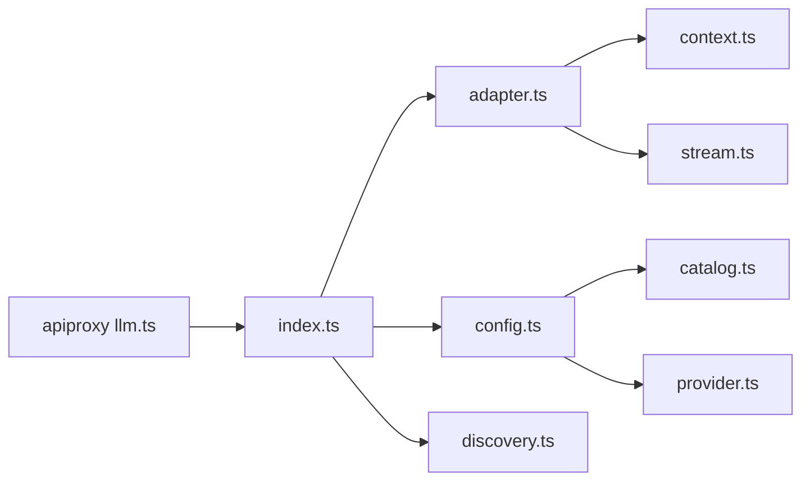

# Pi AI 适配器实现

<cite>
**本文引用的文件**
- [packages/llm/llm-pi-ai/src/index.ts](file://packages/llm/llm-pi-ai/src/index.ts)
- [packages/llm/llm-pi-ai/src/adapter.ts](file://packages/llm/llm-pi-ai/src/adapter.ts)
- [packages/llm/llm-pi-ai/src/config.ts](file://packages/llm/llm-pi-ai/src/config.ts)
- [packages/llm/llm-pi-ai/src/discovery.ts](file://packages/llm/llm-pi-ai/src/discovery.ts)
- [packages/llm/llm-pi-ai/src/context.ts](file://packages/llm/llm-pi-ai/src/context.ts)
- [packages/llm/llm-pi-ai/src/stream.ts](file://packages/llm/llm-pi-ai/src/stream.ts)
- [packages/llm/llm-pi-ai/src/catalog.ts](file://packages/llm/llm-pi-ai/src/catalog.ts)
- [packages/llm/llm-pi-ai/src/provider.ts](file://packages/llm/llm-pi-ai/src/provider.ts)
- [packages/llm/llm/src/retry-policy.ts](file://packages/llm/llm/src/retry-policy.ts)
- [packages/host/apiproxy/src/api/llm.ts](file://packages/host/apiproxy/src/api/llm.ts)
</cite>

## 目录
1. [简介](#简介)
2. [项目结构](#项目结构)
3. [核心组件](#核心组件)
4. [架构总览](#架构总览)
5. [详细组件分析](#详细组件分析)
6. [依赖关系分析](#依赖关系分析)
7. [性能与可靠性](#性能与可靠性)
8. [故障排查指南](#故障排查指南)
9. [结论](#结论)
10. [附录：配置示例与最佳实践](#附录：配置示例与最佳实践)

## 简介
本文件面向需要在 Harness LLM 层接入 Pi AI 的开发者，系统性说明 Pi AI 提供商适配器的架构设计、Provider 接口实现、模型目录管理与动态发现机制，以及与 Pi AI SDK 的集成方式（客户端初始化、会话管理、流式响应处理）。文档还覆盖支持的模型类型、功能特性与限制条件，提供完整的配置示例（认证设置、模型选择、高级选项），并总结错误处理策略、重试机制与性能监控的最佳实践。

## 项目结构
Pi AI 适配器位于 packages/llm/llm-pi-ai 下，采用“插件 + 适配器”的分层组织：
- index.ts：插件入口，负责注册可配置 Provider 目录、模型发现、动态路由与配置热更新。
- adapter.ts：实现 Harness LlmAdapter 接口，封装对 Pi AI SDK 的调用、快照化配置、流式输出转换。
- config.ts：配置 Schema、校验与解析，产出每个 Provider 的 ResolvedProfile 与内置 Provider 实例。
- discovery.ts：模型目录动态发现（OpenAI 兼容 /models 列表），或回退到本地已安装目录。
- context.ts：将 Harness 消息历史转换为 Pi AI Context（支持图片附件与工具调用）。
- stream.ts：将 Pi AI 事件流映射为 Harness StreamChunk，统一错误与用量上报。
- catalog.ts / provider.ts：内置 Provider 目录与构建逻辑。

图表来源
- [packages/llm/llm-pi-ai/src/index.ts:150-313](file://packages/llm/llm-pi-ai/src/index.ts#L150-L313)
- [packages/llm/llm-pi-ai/src/adapter.ts:186-359](file://packages/llm/llm-pi-ai/src/adapter.ts#L186-L359)
- [packages/llm/llm-pi-ai/src/config.ts:254-373](file://packages/llm/llm-pi-ai/src/config.ts#L254-L373)
- [packages/llm/llm-pi-ai/src/discovery.ts:195-285](file://packages/llm/llm-pi-ai/src/discovery.ts#L195-L285)
- [packages/llm/llm-pi-ai/src/context.ts:124-190](file://packages/llm/llm-pi-ai/src/context.ts#L124-L190)
- [packages/llm/llm-pi-ai/src/stream.ts:124-209](file://packages/llm/llm-pi-ai/src/stream.ts#L124-L209)
- [packages/host/apiproxy/src/api/llm.ts:34-49](file://packages/host/apiproxy/src/api/llm.ts#L34-L49)

章节来源
- [packages/llm/llm-pi-ai/src/index.ts:1-313](file://packages/llm/llm-pi-ai/src/index.ts#L1-L313)
- [packages/llm/llm-pi-ai/src/adapter.ts:1-359](file://packages/llm/llm-pi-ai/src/adapter.ts#L1-L359)
- [packages/llm/llm-pi-ai/src/config.ts:1-373](file://packages/llm/llm-pi-ai/src/config.ts#L1-L373)

## 核心组件
- 插件入口（apply）：注册可配置 Provider 目录、模型发现回调、动态路由；监听配置变更并原子替换注册表与目录。
- 适配器（PiAiAdapter）：实现 listModels、resolveModel、stream；维护不可变快照，保证请求期间配置一致性。
- 配置解析（resolveProfiles/assertServiceable）：Schema 校验、默认值填充、构建 pi-ai Provider、捕获重试策略。
- 模型发现（discoverModels）：优先使用内置目录；否则通过 OpenAI 兼容 /models 端点探测，带大小限制与鉴权。
- 上下文转换（toPiContext）：文本/图片/工具结果转 Pi AI Context；系统提示折叠；工具名恢复。
- 流式转换（toStreamChunks）：事件到块增量、用量、结束原因映射；统一错误分类与上下文溢出检测。

章节来源
- [packages/llm/llm-pi-ai/src/index.ts:150-313](file://packages/llm/llm-pi-ai/src/index.ts#L150-L313)
- [packages/llm/llm-pi-ai/src/adapter.ts:186-359](file://packages/llm/llm-pi-ai/src/adapter.ts#L186-L359)
- [packages/llm/llm-pi-ai/src/config.ts:254-373](file://packages/llm/llm-pi-ai/src/config.ts#L254-L373)
- [packages/llm/llm-pi-ai/src/discovery.ts:195-285](file://packages/llm/llm-pi-ai/src/discovery.ts#L195-L285)
- [packages/llm/llm-pi-ai/src/context.ts:124-190](file://packages/llm/llm-pi-ai/src/context.ts#L124-L190)
- [packages/llm/llm-pi-ai/src/stream.ts:124-209](file://packages/llm/llm-pi-ai/src/stream.ts#L124-L209)

## 架构总览
下图展示了从 Host API 到 Pi AI SDK 的完整调用链，包括配置热更新、目录注册、模型发现、适配器流式推理与事件转换。

图表来源
- [packages/host/apiproxy/src/api/llm.ts:34-49](file://packages/host/apiproxy/src/api/llm.ts#L34-L49)
- [packages/llm/llm-pi-ai/src/index.ts:200-247](file://packages/llm/llm-pi-ai/src/index.ts#L200-L247)
- [packages/llm/llm-pi-ai/src/adapter.ts:238-359](file://packages/llm/llm-pi-ai/src/adapter.ts#L238-L359)
- [packages/llm/llm-pi-ai/src/discovery.ts:195-285](file://packages/llm/llm-pi-ai/src/discovery.ts#L195-L285)
- [packages/llm/llm-pi-ai/src/stream.ts:124-209](file://packages/llm/llm-pi-ai/src/stream.ts#L124-L209)

## 详细组件分析

### 插件入口与动态目录/路由注册
- 可配置 Provider 目录：合并“已安装目录中需要 apiKey 的 Provider”和“当前 profiles 声明的路由”，提供 settingsNs 与 settingsPath，使 UI 能编辑与删除。
- 模型发现：注册 NS 的发现回调，优先返回内置目录；未命中则按 OpenAI 兼容协议探测 /models。
- 路由注册：根据 profiles 键集合注册适配器；当路由集或 retryPolicy 变化时原子替换，避免服务中断。
- 配置热更新：installSettingsSection 监听变更，先 validate 再 replace 目录与路由，失败保留上一份有效状态。

章节来源
- [packages/llm/llm-pi-ai/src/index.ts:120-147](file://packages/llm/llm-pi-ai/src/index.ts#L120-L147)
- [packages/llm/llm-pi-ai/src/index.ts:200-247](file://packages/llm/llm-pi-ai/src/index.ts#L200-L247)
- [packages/llm/llm-pi-ai/src/index.ts:251-313](file://packages/llm/llm-pi-ai/src/index.ts#L251-L313)

### 适配器实现（LlmAdapter 接口）
- 不可变快照：每次操作前读取 profiles 并构建 Models 集合；配置变更后创建新快照，保证在途请求不受影响。
- 模型清单与描述：listModels 直接读 snapshot.models；resolveModel 补充 contextWindow、defaultMaxTokens、reasoning 能力。
- 流式生成：
  - 参数校验：不支持 stop；图片输入需 durable attachment；模型需支持 image 模态。
  - 上下文构建：toPiContext 将消息转为 Pi AI Context（含工具调用与图片）。
  - 调用 SDK：streamSimple(model, context, options)，注入 reasoning、temperature、maxTokens、sessionId、headers、signal 等。
  - 流转换：toStreamChunks 将事件映射为块增量、用量与 finish；空闲超时保护。
  - 错误处理：区分超时、中止、内容不支持、未知模型等，抛出 LlmError。

图表来源
- [packages/llm/llm-pi-ai/src/adapter.ts:276-359](file://packages/llm/llm-pi-ai/src/adapter.ts#L276-L359)
- [packages/llm/llm-pi-ai/src/context.ts:124-190](file://packages/llm/llm-pi-ai/src/context.ts#L124-L190)
- [packages/llm/llm-pi-ai/src/stream.ts:124-209](file://packages/llm/llm-pi-ai/src/stream.ts#L124-L209)

章节来源
- [packages/llm/llm-pi-ai/src/adapter.ts:186-359](file://packages/llm/llm-pi-ai/src/adapter.ts#L186-L359)

### 配置与模型目录
- 配置 Schema：providers 字典，每项支持 apiKeyEnv、displayName、api、baseURL、models、modelOverrides、compat、默认容量与传输选项、headers、reasoning/thinkingBudgets/cacheRetention/transport/timeout/websocketConnectTimeout/streamIdleTimeout/retryPolicy。
- 解析流程：rejectRemovedFields -> 校验必填与范围 -> 构建 catalog 模型 -> 构建 pi-ai Provider -> 固化 retryPolicy。
- 内置目录：catalog.ts 提供 MODALITIES、SUPPORTED_THINKING_FORMATS、THINKING_LEVELS 等常量；provider.ts 构建 Provider。

章节来源
- [packages/llm/llm-pi-ai/src/config.ts:64-179](file://packages/llm/llm-pi-ai/src/config.ts#L64-L179)
- [packages/llm/llm-pi-ai/src/config.ts:232-373](file://packages/llm/llm-pi-ai/src/config.ts#L232-L373)
- [packages/llm/llm-pi-ai/src/catalog.ts:1-200](file://packages/llm/llm-pi-ai/src/catalog.ts#L1-L200)
- [packages/llm/llm-pi-ai/src/provider.ts:1-200](file://packages/llm/llm-pi-ai/src/provider.ts#L1-L200)

### 模型动态发现
- 策略：若 provider 属于已安装目录，直接返回内置模型元信息；否则要求 baseURL 且协议为 openai-completions/openai-responses，GET /models 拉取。
- 安全与健壮性：响应体上限 4MB；只接受 JSON；空 id 条目跳过；支持信号取消；鉴权头携带 attribution。
- 错误语义：DISCOVERY_FAILED、DISCOVERY_UNSUPPORTED、ABORTED 等。

章节来源
- [packages/llm/llm-pi-ai/src/discovery.ts:195-285](file://packages/llm/llm-pi-ai/src/discovery.ts#L195-L285)

### 上下文与流式转换
- 上下文转换：支持 text/image/tool-result；系统提示折叠到 user；工具名从 assistant toolCall 恢复；图片通过 AttachmentStore 读取并 base64 编码。
- 流式转换：
  - 事件映射：text_start/delta/end、thinking_start/delta/end、toolcall_*、done/error。
  - 用量映射：input/output/cacheRead/cacheWrite。
  - 结束原因：stop/length/toolUse/aborted/error；上下文溢出识别；空响应视为错误。
  - 错误分类：AUTH/RATE_LIMIT/INVALID_REQUEST/SERVER/TIMEOUT/TRANSPORT 等。

章节来源
- [packages/llm/llm-pi-ai/src/context.ts:124-190](file://packages/llm/llm-pi-ai/src/context.ts#L124-L190)
- [packages/llm/llm-pi-ai/src/stream.ts:17-113](file://packages/llm/llm-pi-ai/src/stream.ts#L17-L113)
- [packages/llm/llm-pi-ai/src/stream.ts:124-209](file://packages/llm/llm-pi-ai/src/stream.ts#L124-L209)

## 依赖关系分析
- 插件入口依赖：@deepseek-ai/cordis（Context）、@deepseek-ai/dsh-settings（settingsNamespace/installSettingsSection）、@deepseek-ai/dsh-launch-environment（环境变量）、@deepseek-ai/dsh-llm（LlmError/重试策略/认证校验）。
- 适配器依赖：@earendil-works/pi-ai（createModels/streamSimple/getSupportedThinkingLevels/isContextOverflow）、@deepseek-ai/dsh-timeout（idleWatchdog/timeoutOf）。
- 配置依赖：@deepseek-ai/schemastery（Schema）、@deepseek-ai/dsh-credentials（credentialRef）、@deepseek-ai/dsh-llm（retry policy）。
- 宿主 API：apiproxy 暴露 providers/models 接口供前端消费。

图表来源
- [packages/llm/llm-pi-ai/src/index.ts:58-85](file://packages/llm/llm-pi-ai/src/index.ts#L58-L85)
- [packages/llm/llm-pi-ai/src/adapter.ts:24-54](file://packages/llm/llm-pi-ai/src/adapter.ts#L24-L54)
- [packages/llm/llm-pi-ai/src/config.ts:17-32](file://packages/llm/llm-pi-ai/src/config.ts#L17-L32)
- [packages/host/apiproxy/src/api/llm.ts:34-49](file://packages/host/apiproxy/src/api/llm.ts#L34-L49)

章节来源
- [packages/llm/llm-pi-ai/src/index.ts:58-85](file://packages/llm/llm-pi-ai/src/index.ts#L58-L85)
- [packages/llm/llm-pi-ai/src/adapter.ts:24-54](file://packages/llm/llm-pi-ai/src/adapter.ts#L24-L54)
- [packages/llm/llm-pi-ai/src/config.ts:17-32](file://packages/llm/llm-pi-ai/src/config.ts#L17-L32)
- [packages/host/apiproxy/src/api/llm.ts:34-49](file://packages/host/apiproxy/src/api/llm.ts#L34-L49)

## 性能与可靠性
- 不可变快照：避免并发配置切换导致请求串扰，保障 per-step 冻结语义。
- 流式空闲超时：idleWatchdog + timeoutOf 防止长连接挂起；可配置 streamIdleTimeoutMs。
- 头部合并：部署级 headers 与 Harness attribution 冲突时，Harness 优先，避免误覆盖。
- 重试策略：
  - 适配器层 maxRetries=0，交由上层 agent 恢复层控制可见重试次数。
  - 每 Provider 可配置 retryPolicy（mode/backoff/retryableCodes），在配置解析阶段固化。
- 资源限制：模型发现响应体上限 4MB，避免大响应拖垮内存。
- 观测性：usage 字段透传 input/output/cache 用量；finish 原因标准化便于埋点。

章节来源
- [packages/llm/llm-pi-ai/src/adapter.ts:81-99](file://packages/llm/llm-pi-ai/src/adapter.ts#L81-L99)
- [packages/llm/llm-pi-ai/src/adapter.ts:294-359](file://packages/llm/llm-pi-ai/src/adapter.ts#L294-L359)
- [packages/llm/llm-pi-ai/src/config.ts:350-373](file://packages/llm/llm-pi-ai/src/config.ts#L350-L373)
- [packages/llm/llm/src/retry-policy.ts:145-191](file://packages/llm/llm/src/retry-policy.ts#L145-L191)
- [packages/llm/llm-pi-ai/src/discovery.ts:43-50](file://packages/llm/llm-pi-ai/src/discovery.ts#L43-L50)

## 故障排查指南
- 缺少凭据：MISSING_CREDENTIAL。检查 credentials 服务或环境变量是否设置了 apiKeyEnv 指向的键。
- 未知模型：UNKNOWN_MODEL。确认模型存在于目录或自定义 models 列表中。
- 不支持的内容：UNSUPPORTED_CONTENT。图片输入需启用 durable attachment 且模型支持 image。
- 不支持的选项：UNSUPPORTED_OPTION。例如 stop 序列不被支持。
- 不支持的思考级别：UNSUPPORTED_REASONING_EFFORT。仅在模型支持时才允许。
- 发现失败：DISCOVERY_FAILED/DISCOVERY_UNSUPPORTED。检查 baseURL、协议是否为 OpenAI 兼容；网络可达性与鉴权。
- 流关闭异常：STREAM_CLOSED。上游事件流未正常结束，检查网络与 Provider 行为。
- 超时与中止：TIMEOUT/ABORTED。检查 streamIdleTimeoutMs、上游响应时间与调用方 AbortSignal。

章节来源
- [packages/llm/llm-pi-ai/src/adapter.ts:217-225](file://packages/llm/llm-pi-ai/src/adapter.ts#L217-L225)
- [packages/llm/llm-pi-ai/src/adapter.ts:276-359](file://packages/llm/llm-pi-ai/src/adapter.ts#L276-L359)
- [packages/llm/llm-pi-ai/src/discovery.ts:195-285](file://packages/llm/llm-pi-ai/src/discovery.ts#L195-L285)
- [packages/llm/llm-pi-ai/src/stream.ts:17-113](file://packages/llm/llm-pi-ai/src/stream.ts#L17-L113)

## 结论
Pi AI 适配器以“不可变快照 + 动态目录/路由 + 流式转换”为核心，实现了高内聚、低耦合的 LLM 接入方案。它既支持开箱即用的内置 Provider 目录，也支持网关/自托管服务的动态发现；通过严格的配置校验与错误分类，确保稳定性与可观测性。结合合理的重试策略与超时保护，可在生产环境中稳定运行。

## 附录：配置示例与最佳实践
- 认证设置
  - 使用 apiKeyEnv 引用凭证（环境变量或 credentials 服务）。
  - 若希望完全交由 Pi AI 自身环境发现，可不设置 apiKeyEnv（仅限未显式命名凭据的路线）。
- 模型选择
  - 使用 models 列表覆盖内置目录，或通过 modelOverrides 微调单个模型能力。
  - 合理设置 defaultContextWindow/defaultMaxTokens 以匹配实际网关能力。
- 高级选项
  - reasoning/thinkingBudgets/cacheRetention/transport/timeout/websocketConnectTimeout/streamIdleTimeout。
  - headers 用于注入部署级请求头；注意 Harness attribution 会覆盖同名保留字段。
  - retryPolicy 配置 Provider 级重试策略（mode/backoff/retryableCodes）。
- 最佳实践
  - 保持 streamIdleTimeoutMs 合理，避免长连接泄漏。
  - 使用不可变快照语义，不要在请求中途修改配置。
  - 对图片输入务必启用 durable attachment，并在模型层面声明 image 模态。
  - 利用 discoverModels 快速验证网关连通性与模型列表。
  - 通过 usage 与 finish reason 进行埋点与告警。

章节来源
- [packages/llm/llm-pi-ai/src/config.ts:64-179](file://packages/llm/llm-pi-ai/src/config.ts#L64-L179)
- [packages/llm/llm-pi-ai/src/config.ts:232-373](file://packages/llm/llm-pi-ai/src/config.ts#L232-L373)
- [packages/llm/llm/src/retry-policy.ts:145-191](file://packages/llm/llm/src/retry-policy.ts#L145-L191)
- [packages/llm/llm-pi-ai/src/discovery.ts:195-285](file://packages/llm/llm-pi-ai/src/discovery.ts#L195-L285)
- [packages/llm/llm-pi-ai/src/adapter.ts:81-99](file://packages/llm/llm-pi-ai/src/adapter.ts#L81-L99)
- [packages/llm/llm-pi-ai/src/adapter.ts:294-359](file://packages/llm/llm-pi-ai/src/adapter.ts#L294-L359)