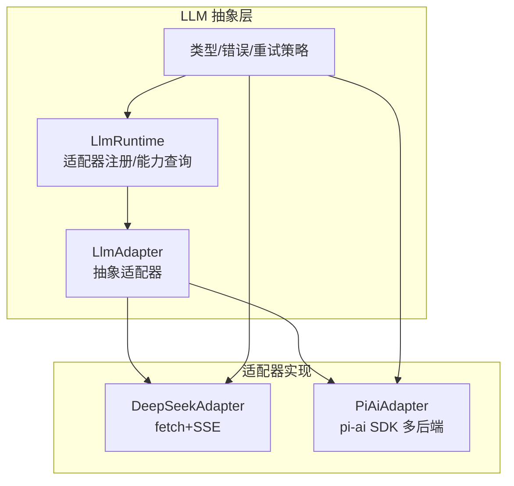
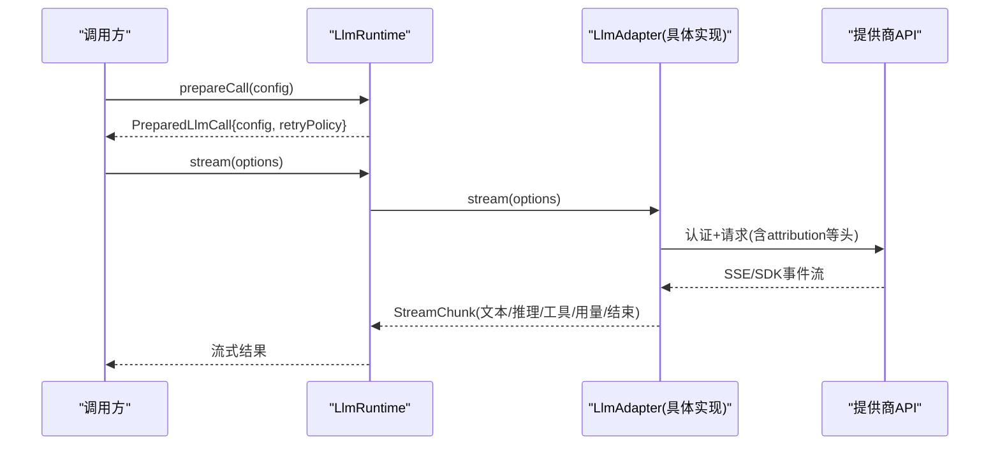
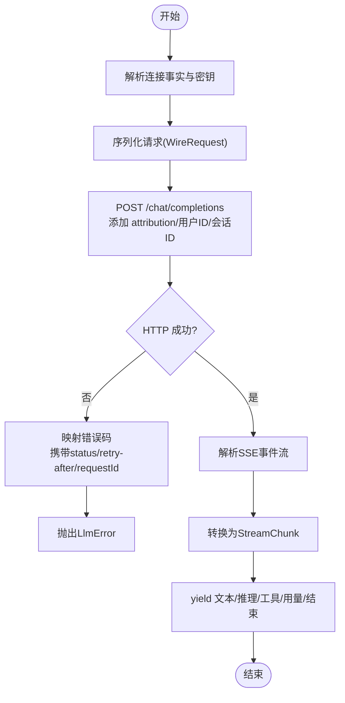
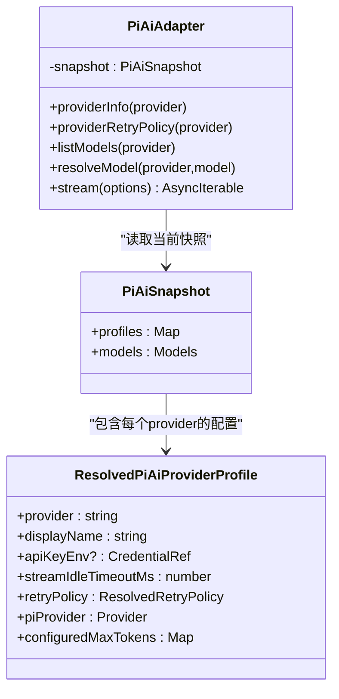
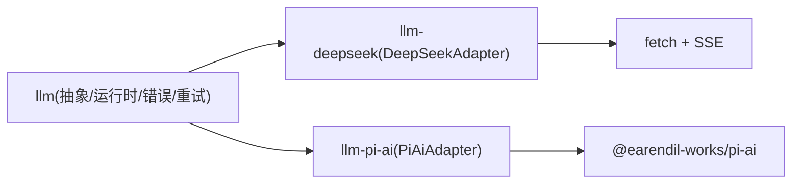

# 提供商适配器实现

<cite>
**本文引用的文件**
- [packages/llm/llm/src/index.ts](file://packages/llm/llm/src/index.ts)
- [packages/llm/llm/src/types.ts](file://packages/llm/llm/src/types.ts)
- [packages/llm/llm/src/error.ts](file://packages/llm/llm/src/error.ts)
- [packages/llm/llm/src/retry-policy.ts](file://packages/llm/llm/src/retry-policy.ts)
- [packages/llm/llm-deepseek/src/adapter.ts](file://packages/llm/llm-deepseek/src/adapter.ts)
- [packages/llm/llm-deepseek/src/types.ts](file://packages/llm/llm-deepseek/src/types.ts)
- [packages/llm/llm-pi-ai/src/adapter.ts](file://packages/llm/llm-pi-ai/src/adapter.ts)
- [packages/llm/llm-pi-ai/src/config.ts](file://packages/llm/llm-pi-ai/src/config.ts)
- [packages/llm/llm-pi-ai/src/provider.ts](file://packages/llm/llm-pi-ai/src/provider.ts)
- [packages/llm/llm-pi-ai/src/index.ts](file://packages/llm/llm-pi-ai/src/index.ts)
</cite>

## 目录
1. [简介](#简介)
2. [项目结构](#项目结构)
3. [核心组件](#核心组件)
4. [架构总览](#架构总览)
5. [详细组件分析](#详细组件分析)
6. [依赖关系分析](#依赖关系分析)
7. [性能与可靠性](#性能与可靠性)
8. [故障排查指南](#故障排查指南)
9. [结论](#结论)
10. [附录：自定义提供商适配器开发指南](#附录自定义提供商适配器开发指南)

## 简介
本文件面向需要在 DeepSeek Harness 中接入不同 LLM 提供商的开发者，系统性说明内置适配器的实现方式、数据流、错误处理与配置选项，并给出扩展新提供商的实践指南。重点覆盖：
- 抽象适配器契约与运行时编排（注册、路由、重试、能力发现）
- DeepSeek 直连适配器：SSE 流式调用、认证、请求/响应转换、工具调用与推理努力
- Pi AI 多提供商适配器：基于 pi-ai SDK 的多后端统一封装、模型能力描述、附件与多模态输入支持
- 错误映射、重试策略、限流与超时控制
- 配置项、参数映射与最佳实践

## 项目结构
本项目在 packages/llm 下提供统一的 LLM 抽象层与多个具体适配器：
- llm：抽象接口、类型、错误体系、重试策略、运行时服务（LlmRuntime、LlmAdapter）
- llm-deepseek：DeepSeek OpenAI 兼容端点的直连适配器（fetch + SSE）
- llm-pi-ai：基于 @earendil-works/pi-ai 的多提供商适配器，支持多种协议与模型能力

图表来源
- [packages/llm/llm/src/index.ts:174-233](file://packages/llm/llm/src/index.ts#L174-L233)
- [packages/llm/llm-deepseek/src/adapter.ts:151-173](file://packages/llm/llm-deepseek/src/adapter.ts#L151-L173)
- [packages/llm/llm-pi-ai/src/adapter.ts:181-249](file://packages/llm/llm-pi-ai/src/adapter.ts#L181-L249)

章节来源
- [packages/llm/llm/src/index.ts:174-233](file://packages/llm/llm/src/index.ts#L174-L233)
- [packages/llm/llm/src/types.ts:283-357](file://packages/llm/llm/src/types.ts#L283-L357)

## 核心组件
- LlmRuntime：适配器注册表、可配置提供者目录、模型发现、能力解析与准备调用（prepareCall），对外暴露流式调用入口与事件拦截点。
- LlmAdapter：抽象适配器，要求实现 stream()，可选实现 providerInfo、listModels、resolveModel、providerRetryPolicy 等。
- GenerateOptions/StreamChunk：统一的请求与流式块语义，包含文本、推理、工具调用、用量统计与结束原因。
- 错误体系：HarnessError/LlmError 及稳定错误码（如 AUTH、RATE_LIMIT、CONTEXT_WINDOW_EXCEEDED 等）。
- 重试策略：normal/always 两种模式，含退避与抖动参数，按 provider 维度捕获。

章节来源
- [packages/llm/llm/src/index.ts:174-233](file://packages/llm/llm/src/index.ts#L174-L233)
- [packages/llm/llm/src/index.ts:280-800](file://packages/llm/llm/src/index.ts#L280-L800)
- [packages/llm/llm/src/types.ts:283-357](file://packages/llm/llm/src/types.ts#L283-L357)
- [packages/llm/llm/src/error.ts:1-164](file://packages/llm/llm/src/error.ts#L1-L164)
- [packages/llm/llm/src/retry-policy.ts:73-156](file://packages/llm/llm/src/retry-policy.ts#L73-L156)

## 架构总览
下图展示一次流式调用的端到端流程：上层通过 LlmRuntime.prepareCall 获取 PreparedLlmCall，再调用其 stream 进入适配器；适配器负责认证、请求构建、网络传输、SSE/SDK 流解析与块组装，最终返回 StreamChunk。

图表来源
- [packages/llm/llm/src/index.ts:771-800](file://packages/llm/llm/src/index.ts#L771-L800)
- [packages/llm/llm-deepseek/src/adapter.ts:214-345](file://packages/llm/llm-deepseek/src/adapter.ts#L214-L345)
- [packages/llm/llm-pi-ai/src/adapter.ts:276-357](file://packages/llm/llm-pi-ai/src/adapter.ts#L276-L357)

## 详细组件分析

### DeepSeek 适配器（llm-deepseek）
职责与特性
- 直连 OpenAI 兼容的 /chat/completions 端点，使用 fetch + SSE 流式读取。
- 认证：Bearer Token 由 per-request 解析器注入，连接事实（baseURL、默认值、模型目录、重试策略等）由插件一次性解析并冻结到本次操作。
- 请求格式：将 GenerateOptions 序列化为 WireRequest，包含 thinking/reasoning_effort、tools、stop、max_tokens 等。
- 响应处理：解析 SSE chunk，转换为 StreamChunk；处理 usage 统计、tool-call 增量、finish reason。
- 错误映射：HTTP 状态与错误体映射为稳定错误码（AUTH、QUOTA、RATE_LIMIT、CONTEXT_WINDOW_EXCEEDED、SERVER 等），并携带 providerRetryAfterMs 与 requestId。
- 能力描述：listModels/resolveModel 输出 text-only 输入模态；根据配置声明 reasoning efforts 与默认值。
- 超时与取消：idle watchdog 监控读空闲，结合 AbortSignal 实现取消与超时。

图表来源
- [packages/llm/llm-deepseek/src/adapter.ts:214-345](file://packages/llm/llm-deepseek/src/adapter.ts#L214-L345)
- [packages/llm/llm-deepseek/src/types.ts:12-30](file://packages/llm/llm-deepseek/src/types.ts#L12-L30)

章节来源
- [packages/llm/llm-deepseek/src/adapter.ts:29-105](file://packages/llm/llm-deepseek/src/adapter.ts#L29-L105)
- [packages/llm/llm-deepseek/src/adapter.ts:151-212](file://packages/llm/llm-deepseek/src/adapter.ts#L151-L212)
- [packages/llm/llm-deepseek/src/adapter.ts:214-345](file://packages/llm/llm-deepseek/src/adapter.ts#L214-L345)
- [packages/llm/llm-deepseek/src/types.ts:12-30](file://packages/llm/llm-deepseek/src/types.ts#L12-L30)
- [packages/llm/llm-deepseek/src/types.ts:92-147](file://packages/llm/llm-deepseek/src/types.ts#L92-L147)

### Pi AI 适配器（llm-pi-ai）
职责与特性
- 基于 @earendil-works/pi-ai 的统一 SDK，支持多种后端（OpenAI、Anthropic 等）与协议。
- 配置快照：每次操作前创建不可变快照（profiles + Models 集合），避免并发配置变更导致请求漂移。
- 能力描述：从 pi-ai Model 对象读取 input 模态、contextWindow、reasoning levels；对不支持的能力进行拒绝或降级。
- 多模态输入：检测消息是否包含图片，若需要则通过 AttachmentStore 持久化引用后传入上下文。
- 流式调用：使用 models.streamSimple(model, context, options)，将事件转换为 StreamChunk。
- 错误与限制：显式拒绝不支持的选项（如 stop），对图片输入缺失附件服务报错；超时与取消通过 idle watchdog 与 AbortSignal 管理。
- 头部合并：合并部署级 headers 并保留 attribution 头优先权。

图表来源
- [packages/llm/llm-pi-ai/src/adapter.ts:56-79](file://packages/llm/llm-pi-ai/src/adapter.ts#L56-L79)
- [packages/llm/llm-pi-ai/src/adapter.ts:181-249](file://packages/llm/llm-pi-ai/src/adapter.ts#L181-L249)
- [packages/llm/llm-pi-ai/src/config.ts:143-168](file://packages/llm/llm-pi-ai/src/config.ts#L143-L168)

章节来源
- [packages/llm/llm-pi-ai/src/adapter.ts:171-179](file://packages/llm/llm-pi-ai/src/adapter.ts#L171-L179)
- [packages/llm/llm-pi-ai/src/adapter.ts:276-357](file://packages/llm/llm-pi-ai/src/adapter.ts#L276-L357)
- [packages/llm/llm-pi-ai/src/config.ts:339-372](file://packages/llm/llm-pi-ai/src/config.ts#L339-L372)
- [packages/llm/llm-pi-ai/src/provider.ts:1-27](file://packages/llm/llm-pi-ai/src/provider.ts#L1-L27)
- [packages/llm/llm-pi-ai/src/index.ts:84-105](file://packages/llm/llm-pi-ai/src/index.ts#L84-L105)

### 抽象运行时与通用能力
- 适配器注册与替换：registerAdapter 支持原子替换路由，保证无间隙切换；registerConfigurableProviders 管理可配置提供者目录。
- 模型能力解析：resolveModelInfo/listModels 校验并剥离 adapter-owned 元数据，确保下游安全消费。
- 调用准备：prepareCall 冻结配置与上下文，记录 adapterDefaults（哪些字段由适配器补齐），并将重试策略绑定到该次调用。
- 事件拦截：'llm/stream' 水门事件允许在流式调用前后插入重试、重放、路由等逻辑。

章节来源
- [packages/llm/llm/src/index.ts:280-800](file://packages/llm/llm/src/index.ts#L280-L800)
- [packages/llm/llm/src/types.ts:12-25](file://packages/llm/llm/src/types.ts#L12-L25)

## 依赖关系分析
- 适配器均依赖 LlmAdapter 抽象与 LlmRuntime 提供的注册/能力查询机制。
- DeepSeek 适配器直接依赖 fetch/SSE 解析与本地序列化模块。
- Pi AI 适配器依赖 pi-ai SDK 的 createModels/createProvider/streamSimple 以及附件服务。
- 错误与重试策略来自 llm 包，被两个适配器复用。

图表来源
- [packages/llm/llm/src/index.ts:174-233](file://packages/llm/llm/src/index.ts#L174-L233)
- [packages/llm/llm-deepseek/src/adapter.ts:214-345](file://packages/llm/llm-deepseek/src/adapter.ts#L214-L345)
- [packages/llm/llm-pi-ai/src/adapter.ts:276-357](file://packages/llm/llm-pi-ai/src/adapter.ts#L276-L357)

章节来源
- [packages/llm/llm/src/index.ts:174-233](file://packages/llm/llm/src/index.ts#L174-L233)
- [packages/llm/llm-deepseek/src/adapter.ts:214-345](file://packages/llm/llm-deepseek/src/adapter.ts#L214-L345)
- [packages/llm/llm-pi-ai/src/adapter.ts:276-357](file://packages/llm/llm-pi-ai/src/adapter.ts#L276-L357)

## 性能与可靠性
- 流式处理：两者均采用流式读取，减少首字节延迟；DeepSeek 使用 SSE 解析，Pi AI 使用 SDK 流式接口。
- 空闲超时：均使用 idle watchdog 监控单次读取的空闲时间，防止挂起；超时映射为 TIMEOUT。
- 取消传播：组合 AbortSignal 并在 finally 中清理资源，确保取消及时生效。
- 重试策略：provider 维度捕获 retryPolicy（normal/always），适配器内部不自行重试，交由上层策略控制。
- 头部与追踪：统一注入 attributionHeaders，便于链路追踪与审计。

章节来源
- [packages/llm/llm-deepseek/src/adapter.ts:214-269](file://packages/llm/llm-deepseek/src/adapter.ts#L214-L269)
- [packages/llm/llm-pi-ai/src/adapter.ts:276-357](file://packages/llm/llm-pi-ai/src/adapter.ts#L276-L357)
- [packages/llm/llm/src/retry-policy.ts:73-156](file://packages/llm/llm/src/retry-policy.ts#L73-L156)

## 故障排查指南
常见错误与定位要点
- 认证失败（AUTH）：检查 API Key 是否正确且可用；DeepSeek/Pi AI 均在请求前解析密钥并注入。
- 配额耗尽（QUOTA）：账户余额/额度不足，需充值或调整用量。
- 速率限制（RATE_LIMIT）：短期高频触发，建议退避重试。
- 上下文超限（CONTEXT_WINDOW_EXCEEDED）：请求过长超过模型上下文窗口，需压缩历史或拆分任务。
- 空响应（EMPTY_RESPONSE）：完成但无内容块，视为可重试的安全失败。
- 不支持的内容/选项：例如 Pi AI 不支持 stop 参数或图片输入未提供附件服务。

诊断工具
- errorChain：渲染完整 cause 链，便于日志与 UI 展示。
- isContextWindowExceededError/isQuotaExceededError：识别特定错误语义。
- LlmError.failure：携带 status、providerRetryAfterMs、requestId 等结构化信息。

章节来源
- [packages/llm/llm/src/error.ts:1-164](file://packages/llm/llm/src/error.ts#L1-L164)
- [packages/llm/llm-deepseek/src/adapter.ts:132-149](file://packages/llm/llm-deepseek/src/adapter.ts#L132-L149)
- [packages/llm/llm-pi-ai/src/adapter.ts:276-357](file://packages/llm/llm-pi-ai/src/adapter.ts#L276-L357)

## 结论
- DeepSeek 适配器以轻量直连方式实现 OpenAI 兼容端点，适合快速接入与细粒度控制。
- Pi AI 适配器通过 SDK 统一多后端能力，提供更丰富的模型能力描述与多模态支持。
- 两者均遵循统一的抽象契约与错误/重试体系，便于在 Harness 中统一管理、观测与扩展。

## 附录：自定义提供商适配器开发指南
目标
- 新增一个提供商适配器，满足 Harness 的 LlmAdapter 契约，并正确集成认证、请求转换、流式响应、错误映射、重试与限流。

步骤与要点
1. 定义适配器类
   - 继承 LlmAdapter，实现 stream(options): AsyncIterable<StreamChunk>。
   - 可选实现 providerInfo、listModels、resolveModel、providerRetryPolicy。

2. 认证机制
   - 通过 per-request 解析器获取密钥（如 resolveApiKey），避免配置泄漏。
   - 注入 attributionHeaders 与必要的业务头（如用户ID、会话ID）。

3. 请求格式转换
   - 将 GenerateOptions 转换为提供商要求的请求体（消息、工具、系统提示、停止序列、温度、最大 token 等）。
   - 对于多模态输入，按提供商要求构造媒体引用或上传流程。

4. 流式响应处理
   - 解析提供商的流式协议（SSE、WebSocket、SDK 事件），转换为 StreamChunk。
   - 正确处理文本、推理、工具调用增量、用量统计与结束原因。

5. 错误映射
   - 将 HTTP 状态与错误体映射为稳定的 LlmError 代码（AUTH、RATE_LIMIT、CONTEXT_WINDOW_EXCEEDED、QUOTA、SERVER 等）。
   - 携带 status、providerRetryAfterMs、requestId 以便重试与诊断。

6. 重试策略与限流
   - 使用 providerRetryPolicy 返回重试策略（normal/always），由上层策略驱动重试。
   - 遵守提供商的 rate limit，必要时在适配器内做简单退避（推荐由上层策略处理）。

7. 能力描述与配置
   - listModels/resolveModel 返回准确的输入模态、上下文窗口、默认 maxTokens 与推理能力。
   - 配置项应清晰分离“部署级默认”和“请求级覆盖”，避免混淆。

8. 测试与验证
   - 单元测试：序列化/反序列化、错误映射、能力描述。
   - 集成测试：真实或模拟端点下的流式行为、取消与超时、工具调用与多模态。

参考路径
- 抽象与运行时：[packages/llm/llm/src/index.ts:174-233](file://packages/llm/llm/src/index.ts#L174-L233)、[packages/llm/llm/src/index.ts:280-800](file://packages/llm/llm/src/index.ts#L280-L800)
- 类型与错误：[packages/llm/llm/src/types.ts:283-357](file://packages/llm/llm/src/types.ts#L283-L357)、[packages/llm/llm/src/error.ts:1-164](file://packages/llm/llm/src/error.ts#L1-L164)
- 重试策略：[packages/llm/llm/src/retry-policy.ts:73-156](file://packages/llm/llm/src/retry-policy.ts#L73-L156)
- DeepSeek 示例：[packages/llm/llm-deepseek/src/adapter.ts:151-345](file://packages/llm/llm-deepseek/src/adapter.ts#L151-L345)
- Pi AI 示例：[packages/llm/llm-pi-ai/src/adapter.ts:181-357](file://packages/llm/llm-pi-ai/src/adapter.ts#L181-L357)