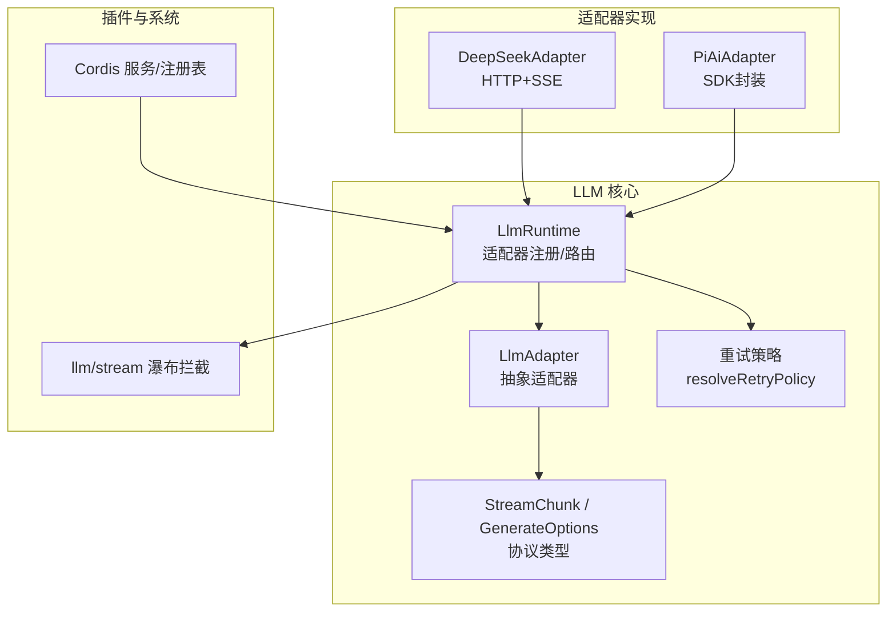
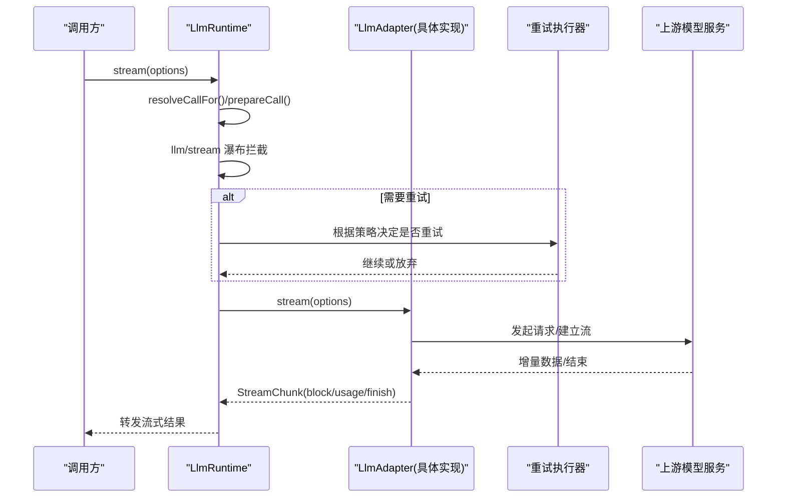
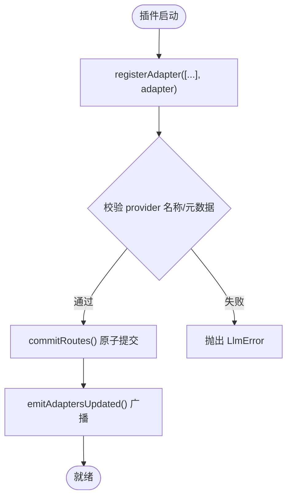
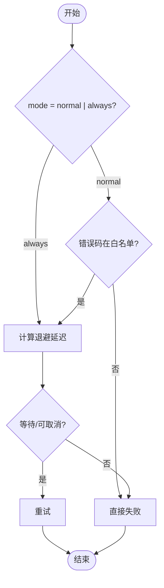
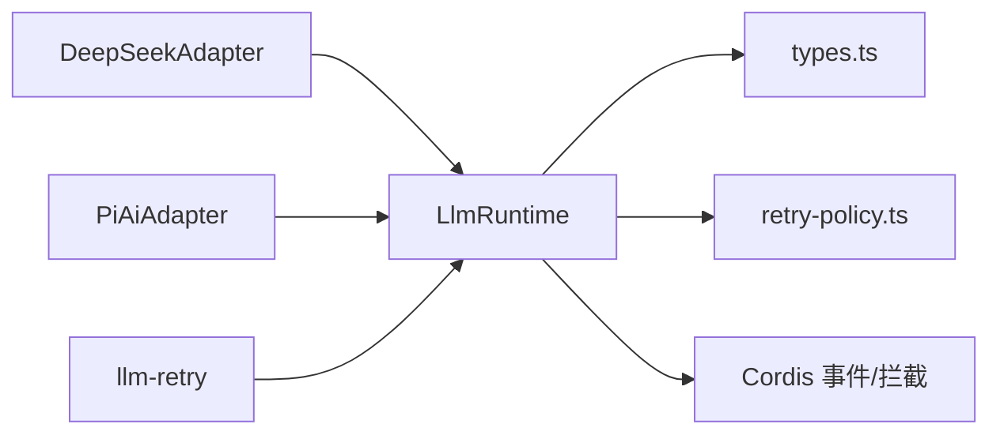

# 自定义提供商适配器开发

<cite>
**本文引用的文件**
- [packages/llm/llm/src/index.ts](file://packages/llm/llm/src/index.ts)
- [packages/llm/llm/src/types.ts](file://packages/llm/llm/src/types.ts)
- [packages/llm/llm/src/retry-policy.ts](file://packages/llm/llm/src/retry-policy.ts)
- [packages/llm/llm-retry/src/index.ts](file://packages/llm/llm-retry/src/index.ts)
- [packages/llm/llm-deepseek/src/adapter.ts](file://packages/llm/llm-deepseek/src/adapter.ts)
- [packages/llm/llm-pi-ai/src/adapter.ts](file://packages/llm/llm-pi-ai/src/adapter.ts)
- [docs/cookbook/adding-an-llm-adapter.md](file://docs/cookbook/adding-an-llm-adapter.md)
- [docs/subsystems/llm-streaming.md](file://docs/subsystems/llm-streaming.md)
- [docs/cordis-api/service.md](file://docs/cordis-api/service.md)
- [docs/cordis-api/registry.md](file://docs/cordis-api/registry.md)
</cite>

## 目录
1. [简介](#简介)
2. [项目结构](#项目结构)
3. [核心组件](#核心组件)
4. [架构总览](#架构总览)
5. [详细组件分析](#详细组件分析)
6. [依赖关系分析](#依赖关系分析)
7. [性能考虑](#性能考虑)
8. [故障排查指南](#故障排查指南)
9. [结论](#结论)
10. [附录](#附录)

## 简介
本指南面向希望为 DeepSeek Harness 开发自定义 LLM 提供商适配器的工程师。内容覆盖：
- 适配器接口与契约（流式协议、事件、错误）
- 适配器注册与服务发现（插件系统、可配置提供者目录）
- 重试策略（指数退避、超时控制、失败恢复）
- 从简单文本到多模态的完整实现路径
- 调试、测试与性能优化
- 发布与维护自定义适配器包

## 项目结构
围绕 LLM 适配的核心代码位于 packages/llm 下，其中：
- llm：抽象适配器、运行时、类型定义、重试策略
- llm-deepseek：基于 HTTP + SSE 的直接适配器示例
- llm-pi-ai：基于第三方 SDK 的多提供商适配器示例
- llm-retry：重试执行器（由上层插件集成）

图表来源
- [packages/llm/llm/src/index.ts:284-947](file://packages/llm/llm/src/index.ts#L284-L947)
- [packages/llm/llm/src/types.ts:283-357](file://packages/llm/llm/src/types.ts#L283-L357)
- [packages/llm/llm/src/retry-policy.ts:14-192](file://packages/llm/llm/src/retry-policy.ts#L14-L192)
- [docs/cordis-api/service.md:1-103](file://docs/cordis-api/service.md#L1-L103)

章节来源
- [packages/llm/llm/src/index.ts:284-947](file://packages/llm/llm/src/index.ts#L284-L947)
- [packages/llm/llm/src/types.ts:283-357](file://packages/llm/llm/src/types.ts#L283-L357)
- [docs/cordis-api/service.md:1-103](file://docs/cordis-api/service.md#L1-L103)

## 核心组件
- LlmAdapter 抽象类：定义 providerInfo、listModels、resolveModel、providerRetryPolicy、stream 等契约。
- LlmRuntime 运行时：提供 registerAdapter、listProviders、listModels、resolveModelInfo、prepareCall、stream 等能力，并维护适配器注册表与可配置提供者目录。
- StreamChunk 协议：块级增量（文本、推理、工具调用）、usage、finish（stop/tool-calls/max-tokens/error/aborted）。
- 重试策略：normal（有限次+白名单）与 always（无限重试），支持指数退避与抖动。
- Cordis 服务与事件：通过 Service 基类注册 ctx.llm；通过 'llm/adapters-updated' 通知拓扑变更；通过 'llm/stream' 瀑布拦截。

章节来源
- [packages/llm/llm/src/index.ts:174-233](file://packages/llm/llm/src/index.ts#L174-L233)
- [packages/llm/llm/src/index.ts:284-421](file://packages/llm/llm/src/index.ts#L284-L421)
- [packages/llm/llm/src/types.ts:283-357](file://packages/llm/llm/src/types.ts#L283-L357)
- [packages/llm/llm/src/retry-policy.ts:14-192](file://packages/llm/llm/src/retry-policy.ts#L14-L192)
- [docs/cordis-api/service.md:1-103](file://docs/cordis-api/service.md#L1-L103)

## 架构总览
适配器通过 Cordis 插件机制注入 ctx.llm，并在运行时被选择、调用与拦截。请求流程如下：

图表来源
- [packages/llm/llm/src/index.ts:838-927](file://packages/llm/llm/src/index.ts#L838-L927)
- [packages/llm/llm-retry/src/index.ts:78-109](file://packages/llm/llm-retry/src/index.ts#L78-L109)

章节来源
- [packages/llm/llm/src/index.ts:838-927](file://packages/llm/llm/src/index.ts#L838-L927)
- [packages/llm/llm-retry/src/index.ts:78-109](file://packages/llm/llm-retry/src/index.ts#L78-L109)

## 详细组件分析

### 适配器接口与协议
- 必须实现 stream(options): AsyncIterable<StreamChunk>
- 可选实现 providerInfo、listModels、resolveModel、providerRetryPolicy
- 协议约定：
  - usage 必须在 finish 之前发出；finish 之后不得再发任何块
  - 工具调用参数以原始 JSON 字符串传递，增量使用 argumentsDelta
  - block index 按首次出现顺序分配，同一块复用
  - 错误两种合法路径：throw LlmError（传输/协议失败）或 finish {kind:'error'|'aborted'}（提供方内联失败）
  - 必须尊重 options.signal
  - 不支持的选项应抛出 UNSUPPORTED 而非静默丢弃
  - 如需原生元数据用于重放，应在 finish.replayState 中携带最小无损 JSON 投影

章节来源
- [packages/llm/llm/src/types.ts:283-357](file://packages/llm/llm/src/types.ts#L283-L357)
- [docs/cookbook/adding-an-llm-adapter.md:25-35](file://docs/cookbook/adding-an-llm-adapter.md#L25-L35)

### 适配器注册与发现
- 注册：ctx.llm.registerAdapter(['provider'], adapter)，返回可替换/释放的句柄
- 列表：listProviders()、listModels(provider)、resolveModelInfo(provider, model)
- 可配置提供者目录：registerConfigurableProviders(entries) 声明可由配置激活的路由
- 模型发现：registerModelDiscovery(settingsNs, discover) + discoverModels(settingsNs, request)
- 事件：'llm/adapters-updated' 在每次提交时广播拓扑变化

图表来源
- [packages/llm/llm/src/index.ts:330-413](file://packages/llm/llm/src/index.ts#L330-L413)
- [packages/llm/llm/src/index.ts:423-492](file://packages/llm/llm/src/index.ts#L423-L492)
- [packages/llm/llm/src/index.ts:494-559](file://packages/llm/llm/src/index.ts#L494-L559)

章节来源
- [packages/llm/llm/src/index.ts:330-492](file://packages/llm/llm/src/index.ts#L330-L492)
- [packages/llm/llm/src/index.ts:494-559](file://packages/llm/llm/src/index.ts#L494-L559)

### 重试策略与超时
- 策略模式：
  - normal：仅对配置的 transient 错误码重试，最多 maxRetries 次
  - always：对所有失败重试直到成功/取消/释放
- 退避：initialDelayMs、maxDelayMs、jitterRatio（对称抖动）
- 默认可重试码包含空响应、限流、服务端错误、超时、传输错误
- 执行器：llm-retry 安装 provider-routed 的正常或无界恢复，支持取消信号与活跃操作追踪

图表来源
- [packages/llm/llm/src/retry-policy.ts:14-192](file://packages/llm/llm/src/retry-policy.ts#L14-L192)
- [packages/llm/llm-retry/src/index.ts:78-109](file://packages/llm/llm-retry/src/index.ts#L78-L109)

章节来源
- [packages/llm/llm/src/retry-policy.ts:14-192](file://packages/llm/llm/src/retry-policy.ts#L14-L192)
- [packages/llm/llm-retry/src/index.ts:78-109](file://packages/llm/llm-retry/src/index.ts#L78-L109)

### 错误处理机制
- LlmError：结构化错误，包含 message、code、status、providerRetryAfterMs、requestId
- 适配器边界：最终将 throw 转换为 finish {kind:'error'|'aborted'}，消费者统一处理
- 认证与密钥：assertUsableApiKey 校验密钥可用性，避免泄露敏感信息

章节来源
- [packages/llm/llm/src/index.ts:69-152](file://packages/llm/llm/src/index.ts#L69-L152)
- [packages/llm/llm/src/index.ts:930-939](file://packages/llm/llm/src/index.ts#L930-L939)

### 参考实现：DeepSeek 适配器
- 直接 HTTP + SSE，解析事件流并映射为 StreamChunk
- 支持 reasoning effort 与上下文窗口、最大输出 token 等元数据
- 超时与空闲监控：idleWatchdog + timeoutOf
- 错误映射：HTTP 状态与提供方错误体映射为稳定错误码

章节来源
- [packages/llm/llm-deepseek/src/adapter.ts:158-347](file://packages/llm/llm-deepseek/src/adapter.ts#L158-L347)

### 参考实现：pi-ai 适配器
- 基于 SDK 的多提供商封装，支持多输入模态（文本/图像）
- 快照化配置：每次操作冻结 profiles/models，避免并发配置漂移
- 图片输入：需 AttachmentStore，且模型需声明 image 输入能力
- 推理级别：按模型能力过滤并提供默认值

章节来源
- [packages/llm/llm-pi-ai/src/adapter.ts:186-359](file://packages/llm/llm-pi-ai/src/adapter.ts#L186-L359)

### 插件系统集成与服务发现
- 通过 Cordis Service 基类将 LlmRuntime 挂载到 ctx.llm
- 使用 Inject 声明依赖，支持数组或对象形式
- 可配置提供者目录允许“未激活”的配置项存在，便于用户编辑与预览

章节来源
- [docs/cordis-api/service.md:1-103](file://docs/cordis-api/service.md#L1-L103)
- [docs/cordis-api/registry.md:121-153](file://docs/cordis-api/registry.md#L121-L153)

## 依赖关系分析
- LlmRuntime 依赖：
  - types.ts 中的协议类型
  - retry-policy.ts 的重试策略解析
  - Cordis 的事件与瀑布拦截
- 适配器实现依赖：
  - DeepSeekAdapter 依赖 fetch/SSE 解析与超时工具
  - PiAiAdapter 依赖 pi-ai SDK、附件服务与超时工具
- 重试执行器依赖：
  - 读取 provider 注册的 ResolvedRetryPolicy，结合 AbortSignal 管理活跃重试

图表来源
- [packages/llm/llm/src/index.ts:284-947](file://packages/llm/llm/src/index.ts#L284-L947)
- [packages/llm/llm/src/types.ts:283-357](file://packages/llm/llm/src/types.ts#L283-L357)
- [packages/llm/llm/src/retry-policy.ts:14-192](file://packages/llm/llm/src/retry-policy.ts#L14-L192)
- [packages/llm/llm-retry/src/index.ts:78-109](file://packages/llm/llm-retry/src/index.ts#L78-L109)

章节来源
- [packages/llm/llm/src/index.ts:284-947](file://packages/llm/llm/src/index.ts#L284-L947)
- [packages/llm/llm/src/types.ts:283-357](file://packages/llm/llm/src/types.ts#L283-L357)
- [packages/llm/llm/src/retry-policy.ts:14-192](file://packages/llm/llm/src/retry-policy.ts#L14-L192)
- [packages/llm/llm-retry/src/index.ts:78-109](file://packages/llm/llm-retry/src/index.ts#L78-L109)

## 性能考虑
- 流式处理：适配器应尽早 yield 增量，减少内存占用
- 超时与空闲：使用 idleWatchdog 防止长时间无数据导致资源泄漏
- 快照化配置：如 pi-ai 适配器，冻结配置快照避免并发竞争
- 重试退避：合理设置 initialDelayMs 与 maxDelayMs，配合 jitterRatio 降低雪崩风险
- 头部与鉴权：确保 attributionHeaders 正确添加，避免重复或冲突头

[本节为通用指导，不直接分析具体文件]

## 故障排查指南
- 常见问题定位：
  - 重复注册：DUPLICATE_ADAPTER
  - 无效适配器/目录：INVALID_ADAPTER / INVALID_DIRECTORY
  - 未知模型/能力：UNKNOWN_MODEL / UNSUPPORTED_*
  - 传输/超时：TRANSPORT / TIMEOUT
  - 认证失败：AUTH / INVALID_CREDENTIAL
- 诊断要点：
  - 检查 listProviders/listModels 是否返回预期元数据
  - 确认 'llm/adapters-updated' 事件触发后重新读取拓扑
  - 查看 finish.reason 与 LlmError.failure 中的 code/status/requestId
  - 使用 prepareCall 固定一次调用的注册与配置，避免 HMR 导致的错配

章节来源
- [packages/llm/llm/src/index.ts:330-413](file://packages/llm/llm/src/index.ts#L330-L413)
- [packages/llm/llm/src/index.ts:575-718](file://packages/llm/llm/src/index.ts#L575-L718)
- [packages/llm/llm/src/index.ts:838-927](file://packages/llm/llm/src/index.ts#L838-L927)

## 结论
通过遵循统一的适配器契约、利用运行时提供的注册/发现与重试能力，并结合两个参考实现（DeepSeek 与 pi-ai），可以快速构建稳定、可扩展的自定义 LLM 提供商适配器。建议在开发过程中严格遵循流式协议、错误分类与超时控制，并通过插件系统与事件机制完成集成与观测。

[本节为总结性内容，不直接分析具体文件]

## 附录

### 从零到一：开发步骤清单
- 定义适配器类并实现 stream（必需）与可选方法
- 在插件 apply(ctx, config) 中调用 ctx.llm.registerAdapter(['your-provider'], new YourAdapter(...))
- 若需提供可配置路由，使用 registerConfigurableProviders 声明
- 若支持动态模型发现，使用 registerModelDiscovery + discoverModels
- 配置重试策略（normal/always）与退避参数
- 编写单元测试与端到端测试，覆盖流式协议、错误路径与超时

章节来源
- [docs/cookbook/adding-an-llm-adapter.md:7-23](file://docs/cookbook/adding-an-llm-adapter.md#L7-L23)
- [docs/subsystems/llm-streaming.md:653-836](file://docs/subsystems/llm-streaming.md#L653-L836)

### 关键 API 速查
- 适配器抽象：LlmAdapter（stream/providerInfo/listModels/resolveModel/providerRetryPolicy）
- 运行时：LlmRuntime（registerAdapter/listProviders/listModels/resolveModelInfo/prepareCall/stream/registerConfigurableProviders/registerModelDiscovery/discoverModels）
- 类型：GenerateOptions、StreamChunk、LlmModelInfo、LlmResolvedModelInfo、LlmFailure
- 重试：resolveRetryPolicy、RetryPolicySchema

章节来源
- [packages/llm/llm/src/index.ts:174-233](file://packages/llm/llm/src/index.ts#L174-L233)
- [packages/llm/llm/src/index.ts:284-947](file://packages/llm/llm/src/index.ts#L284-L947)
- [packages/llm/llm/src/types.ts:283-357](file://packages/llm/llm/src/types.ts#L283-L357)
- [packages/llm/llm/src/retry-policy.ts:14-192](file://packages/llm/llm/src/retry-policy.ts#L14-L192)