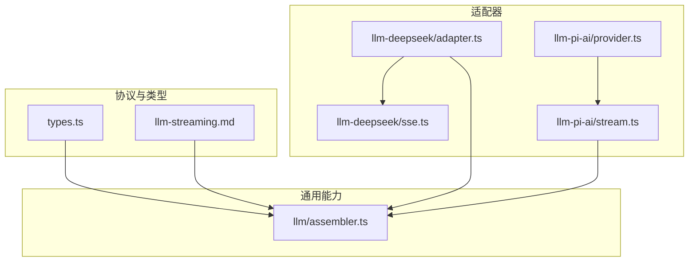
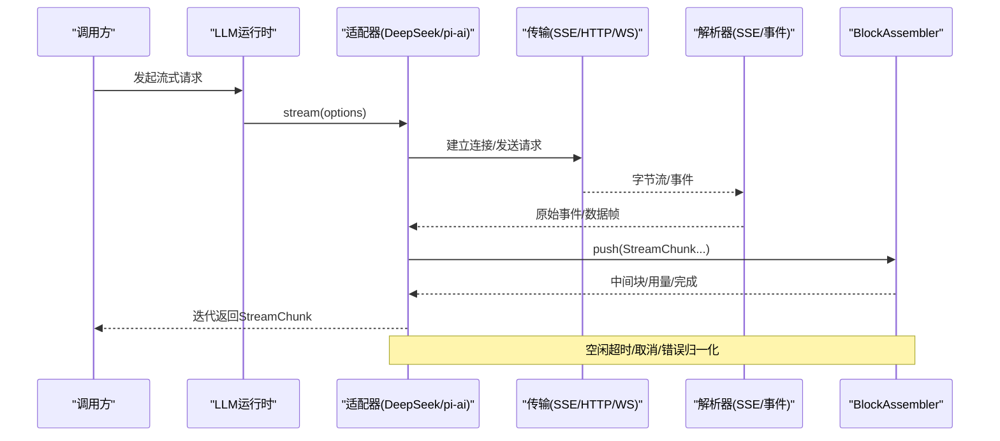
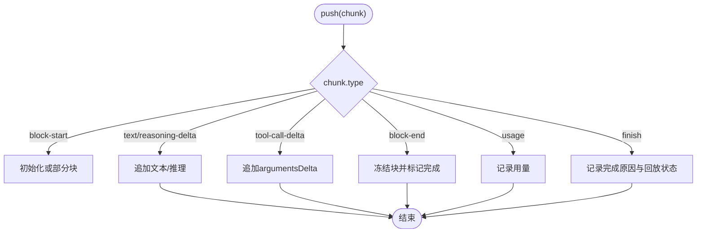
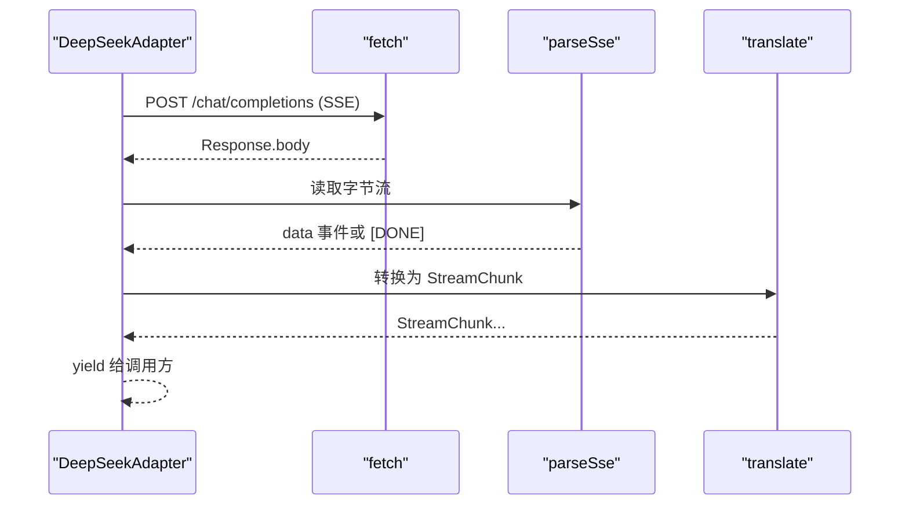
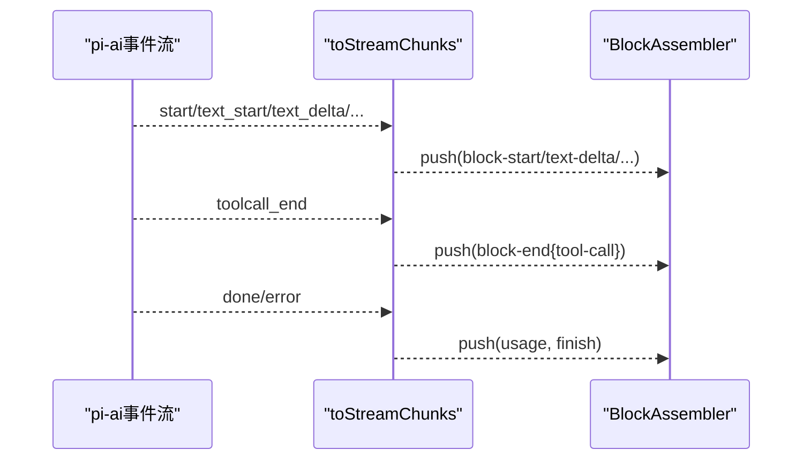
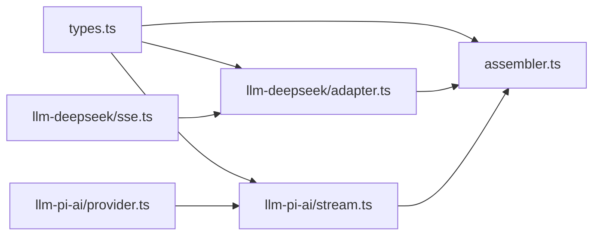

# 流式处理支持

<cite>
**本文引用的文件**
- [llm-streaming.md](file://docs/subsystems/llm-streaming.md)
- [assembler.ts](file://packages/llm/llm/src/assembler.ts)
- [types.ts](file://packages/llm/llm/src/types.ts)
- [sse.ts](file://packages/llm/llm-deepseek/src/sse.ts)
- [adapter.ts](file://packages/llm/llm-deepseek/src/adapter.ts)
- [stream.ts](file://packages/llm/llm-pi-ai/src/stream.ts)
- [provider.ts](file://packages/llm/llm-pi-ai/src/provider.ts)
</cite>

## 目录
1. [简介](#简介)
2. [项目结构](#项目结构)
3. [核心组件](#核心组件)
4. [架构总览](#架构总览)
5. [详细组件分析](#详细组件分析)
6. [依赖关系分析](#依赖关系分析)
7. [性能考虑](#性能考虑)
8. [故障排查指南](#故障排查指南)
9. [结论](#结论)
10. [附录](#附录)

## 简介
本文件系统性说明 LLM 流式处理在 Harness 中的设计与实现，重点覆盖：
- 服务器发送事件（SSE）与 WebSocket 流式连接的处理机制
- 流式数据的解析、组装与传输优化策略
- 增量响应的处理流程：消息分片、状态管理与错误恢复
- 背压控制、内存管理与并发处理等性能优化技巧
- 流式接口的使用示例与调试方法

## 项目结构
围绕流式处理的核心代码分布在以下模块：
- 协议与类型定义：统一的消息、块、流式片段与完成原因
- 适配器层：DeepSeek 适配器（SSE）、pi-ai 适配器（多协议流）
- 通用装配器：将原始流片段拼装为完整内容块与最终消息
- 文档与契约：对适配器行为、错误与重试策略的约束

图表来源
- [types.ts:283-303](file://packages/llm/llm/src/types.ts#L283-L303)
- [llm-streaming.md:154-216](file://docs/subsystems/llm-streaming.md#L154-L216)
- [adapter.ts:214-345](file://packages/llm/llm-deepseek/src/adapter.ts#L214-L345)
- [sse.ts:14-40](file://packages/llm/llm-deepseek/src/sse.ts#L14-L40)
- [stream.ts:124-208](file://packages/llm/llm-pi-ai/src/stream.ts#L124-L208)
- [provider.ts:167-192](file://packages/llm/llm-pi-ai/src/provider.ts#L167-L192)
- [assembler.ts:36-163](file://packages/llm/llm/src/assembler.ts#L36-L163)

章节来源
- [llm-streaming.md:1-216](file://docs/subsystems/llm-streaming.md#L1-L216)
- [types.ts:283-303](file://packages/llm/llm/src/types.ts#L283-L303)

## 核心组件
- 流式协议 StreamChunk：以 index 关联交错的内容块增量，block-end 携带已组装块，usage 在 finish 之前，finish 携带完成原因与可选回放状态。
- BlockAssembler：统一的增量装配器，将 StreamChunk 流折叠为 ContentBlock[]、TokenUsage、FinishReason 与 replayState。
- DeepSeek 适配器：基于 fetch + SSE 的 chat-completions 流，提供空闲超时保护与错误归一化。
- pi-ai 适配器：将多种上游事件流转换为 StreamChunk，并映射终止事件为 finish。
- 适配器契约与重试策略：规定 usage/finish 顺序、工具调用参数保持原始 JSON、错误路径、上下文溢出码、空响应可重试等。

章节来源
- [types.ts:283-303](file://packages/llm/llm/src/types.ts#L283-L303)
- [assembler.ts:36-163](file://packages/llm/llm/src/assembler.ts#L36-L163)
- [adapter.ts:214-345](file://packages/llm/llm-deepseek/src/adapter.ts#L214-L345)
- [stream.ts:124-208](file://packages/llm/llm-pi-ai/src/stream.ts#L124-L208)
- [llm-streaming.md:204-224](file://docs/subsystems/llm-streaming.md#L204-L224)

## 架构总览
下图展示从请求到流式返回的整体流程，包括适配器选择、SSE/WS 读取、事件转换、装配与完成。

图表来源
- [adapter.ts:214-345](file://packages/llm/llm-deepseek/src/adapter.ts#L214-L345)
- [sse.ts:14-40](file://packages/llm/llm-deepseek/src/sse.ts#L14-L40)
- [stream.ts:124-208](file://packages/llm/llm-pi-ai/src/stream.ts#L124-L208)
- [assembler.ts:36-163](file://packages/llm/llm/src/assembler.ts#L36-L163)

## 详细组件分析

### 流式协议与类型（StreamChunk、FinishReason、TokenUsage）
- StreamChunk 是闭联合，包含 block-start/text-delta/reasoning-delta/tool-call-delta/block-end/usage/finish。
- FinishReason 支持 stop、tool-calls、max-tokens、aborted、error。
- TokenUsage 字段互斥统计输入/输出/缓存/推理 token。

章节来源
- [types.ts:112-141](file://packages/llm/llm/src/types.ts#L112-L141)
- [types.ts:283-303](file://packages/llm/llm/src/types.ts#L283-L303)

### BlockAssembler：增量装配器
- 维护每个 index 的部分块与顺序，处理 text/reasoning/tool-call 增量与 block-end 权威块。
- 支持“仅增量”协议（无 block-start/end），忽略已关闭块的后续增量，防止畸形流膨胀内存。
- 暴露 blocks()/message()/usage/finish/replayState 供消费端读取。

图表来源
- [assembler.ts:47-93](file://packages/llm/llm/src/assembler.ts#L47-L93)
- [assembler.ts:106-139](file://packages/llm/llm/src/assembler.ts#L106-L139)

章节来源
- [assembler.ts:36-163](file://packages/llm/llm/src/assembler.ts#L36-L163)

### DeepSeek 适配器：SSE 流式
- 通过 fetch 发起 POST /chat/completions，accept: text/event-stream。
- 使用 parseSse 将字节流解析为 data 事件，遇到 [DONE] 结束；若未收到则抛出 STREAM_CLOSED。
- 使用 idleWatchdog 监控每次 next() 的空闲超时，超时映射为 TIMEOUT；调用方 abort 映射为 ABORTED。
- 非 2xx 响应按 HTTP 状态与错误体归一化为 LlmError（含 AUTH/RATE_LIMIT/CONTEXT_WINDOW_EXCEEDED/SERVER 等）。

图表来源
- [adapter.ts:271-345](file://packages/llm/llm-deepseek/src/adapter.ts#L271-L345)
- [sse.ts:14-40](file://packages/llm/llm-deepseek/src/sse.ts#L14-L40)

章节来源
- [adapter.ts:214-345](file://packages/llm/llm-deepseek/src/adapter.ts#L214-L345)
- [sse.ts:14-40](file://packages/llm/llm-deepseek/src/sse.ts#L14-L40)

### pi-ai 适配器：事件转 StreamChunk
- 将 pi-ai 的事件流（text/thinking/toolcall/done/error）映射为 StreamChunk。
- 工具调用参数在 block-end 时序列化为原始 JSON 字符串，保持端到端原始性。
- 终止事件映射为 finish，包含 usage 与完成原因；错误事件直接产出 error finish。
- 未到达 done/error 则抛出 STREAM_CLOSED。

图表来源
- [stream.ts:124-208](file://packages/llm/llm-pi-ai/src/stream.ts#L124-L208)

章节来源
- [stream.ts:124-208](file://packages/llm/llm-pi-ai/src/stream.ts#L124-L208)
- [provider.ts:167-192](file://packages/llm/llm-pi-ai/src/provider.ts#L167-L192)

### 适配器契约与错误恢复
- usage 必须在 finish 之前，finish 之后不得再发任何 chunk。
- 工具调用 arguments 始终为原始 JSON 字符串；block-end 才提供完整块。
- 两种错误路径：throw（传输/协议错误）或 finish {kind:'error'|'aborted', failure}。
- 上下文溢出统一为 CONTEXT_WINDOW_EXCEEDED；空完成视为可重试错误 EMPTY_RESPONSE。
- 每请求携带应用标识头；重放状态由适配器拥有并在特定条件下传递。

章节来源
- [llm-streaming.md:204-224](file://docs/subsystems/llm-streaming.md#L204-L224)
- [types.ts:112-141](file://packages/llm/llm/src/types.ts#L112-L141)

## 依赖关系分析
- types.ts 定义了所有跨模块共享的类型与协议，被 assembler、各适配器与文档引用。
- assembler 不依赖具体适配器，仅消费 StreamChunk。
- DeepSeek 适配器依赖 sse 解析与 translate 转换，并通过 idleWatchdog 管理空闲超时。
- pi-ai 适配器依赖 provider 构建 Provider，并将事件转为 StreamChunk。

图表来源
- [types.ts:283-303](file://packages/llm/llm/src/types.ts#L283-L303)
- [assembler.ts:36-163](file://packages/llm/llm/src/assembler.ts#L36-L163)
- [adapter.ts:214-345](file://packages/llm/llm-deepseek/src/adapter.ts#L214-L345)
- [sse.ts:14-40](file://packages/llm/llm-deepseek/src/sse.ts#L14-L40)
- [stream.ts:124-208](file://packages/llm/llm-pi-ai/src/stream.ts#L124-L208)
- [provider.ts:167-192](file://packages/llm/llm-pi-ai/src/provider.ts#L167-L192)

章节来源
- [types.ts:283-303](file://packages/llm/llm/src/types.ts#L283-L303)

## 性能考虑
- 背压控制
  - 使用异步迭代器逐块消费，避免一次性缓冲整个响应。
  - 在 DeepSeek 适配器中，通过 idleWatchdog 包装 iterator.next()，确保在空闲时及时释放资源。
- 内存管理
  - BlockAssembler 仅在 block-end 前累积增量，且对已关闭块忽略后续增量，防止畸形流导致内存增长。
  - 工具调用参数保持原始字符串拼接，避免重复解析开销。
- 并发与取消
  - 支持 AbortSignal 组合，上层取消可快速中断底层 I/O。
  - 适配器内部构造独立控制器信号，保证流生命周期可控。
- 网络与超时
  - 空闲超时默认值与可配置，避免长时间挂起占用连接。
  - 非 2xx 响应立即归一化错误，减少无效等待。

章节来源
- [adapter.ts:214-269](file://packages/llm/llm-deepseek/src/adapter.ts#L214-L269)
- [assembler.ts:47-93](file://packages/llm/llm/src/assembler.ts#L47-L93)

## 故障排查指南
- 常见错误码与含义
  - AUTH：认证失败（401/403）
  - RATE_LIMIT：限流（429）
  - INVALID_REQUEST：请求非法（400）
  - CONTEXT_WINDOW_EXCEEDED：上下文窗口超限
  - SERVER：服务端错误（5xx）
  - TRANSPORT：传输层异常（DNS/TLS/代理/连接断开）
  - STREAM_CLOSED：流提前结束（缺少 [DONE]/done/error）
  - ABORTED：调用方主动中止
  - TIMEOUT：空闲超时
  - EMPTY_RESPONSE：模型返回空内容（可重试）
- 定位步骤
  - 检查适配器日志中的错误码与消息，确认是否来自 HTTP 状态或上游事件。
  - 确认 usage 是否在 finish 之前出现，是否符合适配器契约。
  - 核对 block-start/index 与 block-end/index 是否匹配，避免索引错乱。
  - 对于 pi-ai 适配器，关注 done/error 事件是否到达，否则视为 STREAM_CLOSED。
  - 对于 DeepSeek SSE，确认是否收到 [DONE]，否则视为截断。
- 恢复策略
  - 根据 ResolvedRetryPolicy 决定是否重试，注意 providerRetryAfterMs 与退避策略。
  - 空响应与上下文溢出通常可重试；认证/限流需结合业务策略。

章节来源
- [llm-streaming.md:184-224](file://docs/subsystems/llm-streaming.md#L184-L224)
- [adapter.ts:138-149](file://packages/llm/llm-deepseek/src/adapter.ts#L138-L149)
- [sse.ts:28-40](file://packages/llm/llm-deepseek/src/sse.ts#L28-L40)
- [stream.ts:39-62](file://packages/llm/llm-pi-ai/src/stream.ts#L39-L62)

## 结论
Harness 的 LLM 流式处理通过统一的 StreamChunk 协议与 BlockAssembler 装配器，屏蔽了不同上游（SSE、WebSocket、多协议事件）的差异，提供了稳定、可扩展且高性能的增量响应能力。适配器严格遵循契约，确保错误可诊断、可恢复，并通过空闲超时、取消传播与内存保护提升鲁棒性。

## 附录

### 使用示例（概念性）
- 订阅流式响应
  - 调用 ctx.llm.stream(options)，遍历 AsyncIterable<StreamChunk>。
  - 对 text-delta/reasoning-delta 进行增量渲染；对 tool-call-delta 累积参数；在 block-end 处更新完整块。
  - 在 finish 后读取 usage 与 replayState，用于计量与回放。
- 装配完整消息
  - 将收到的 StreamChunk 依次传入 BlockAssembler.push，结束后调用 message() 获取助手消息。

章节来源
- [llm-streaming.md:266-308](file://docs/subsystems/llm-streaming.md#L266-L308)
- [assembler.ts:128-163](file://packages/llm/llm/src/assembler.ts#L128-L163)

### 调试方法
- 启用注释回调（DeepSeek SSE）
  - 在 parseSse 中传入 onComment，观察心跳/保活信息，辅助判断连接活性。
- 校验协议合规
  - 验证 usage 出现在 finish 之前；finish 之后无额外 chunk。
  - 检查 block-start/index 与 block-end/index 一致，避免索引漂移。
- 捕获错误链
  - 记录 LlmError 的 code、message、status、providerRetryAfterMs、requestId，便于定位上游问题。

章节来源
- [sse.ts:14-40](file://packages/llm/llm-deepseek/src/sse.ts#L14-L40)
- [llm-streaming.md:184-224](file://docs/subsystems/llm-streaming.md#L184-L224)