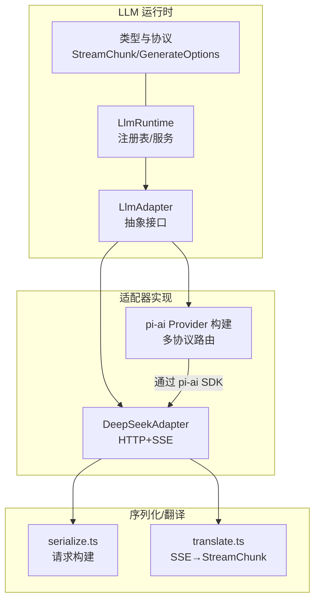
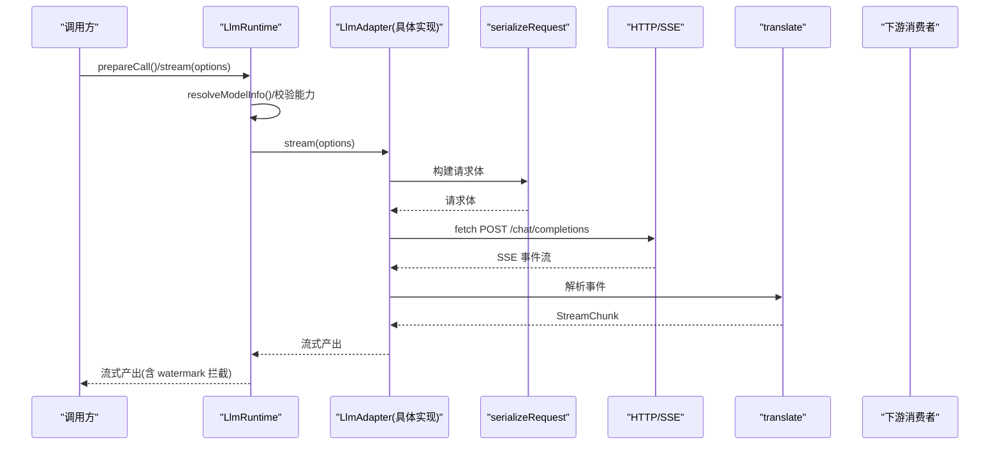
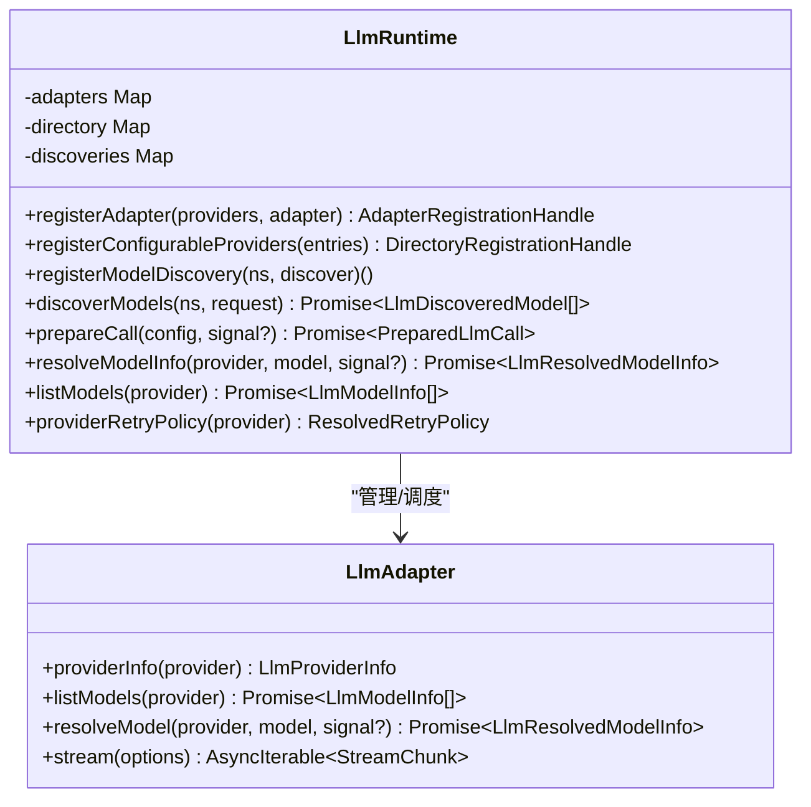
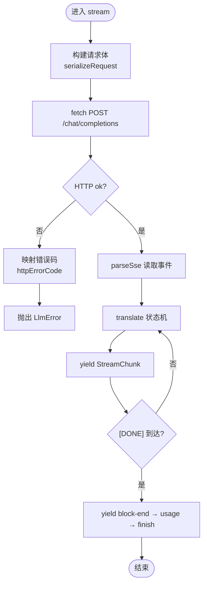
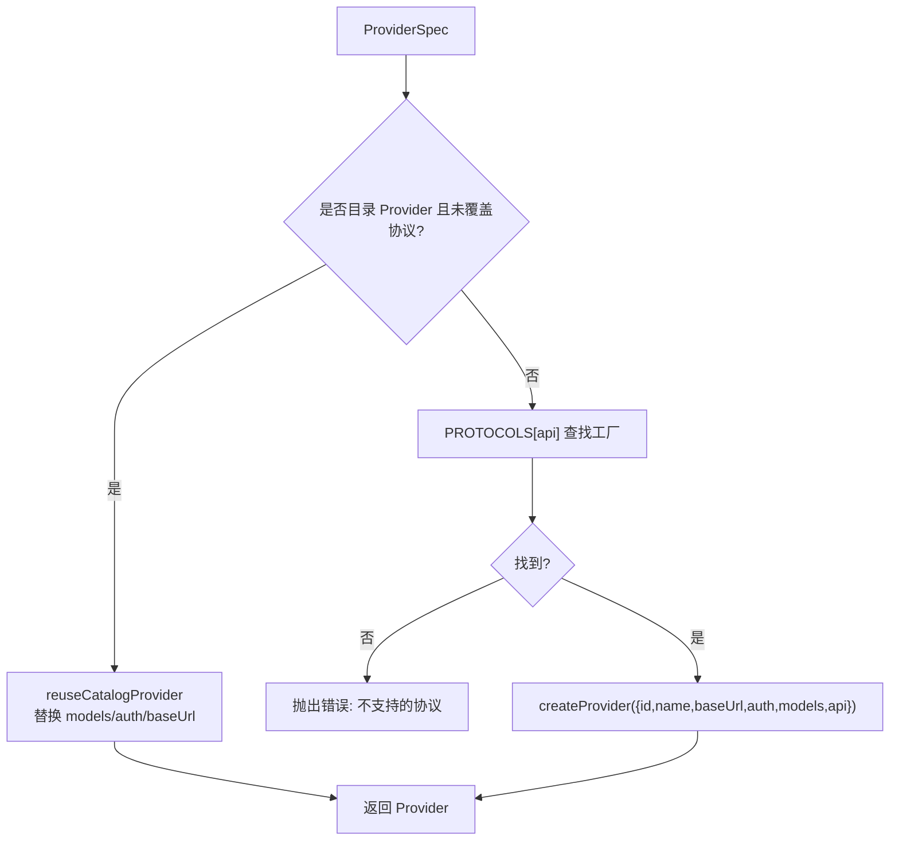
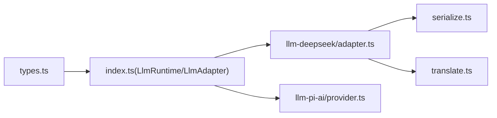

# 适配器架构设计

<cite>
**本文引用的文件**
- [packages/llm/llm/src/index.ts](file://packages/llm/llm/src/index.ts)
- [packages/llm/llm/src/types.ts](file://packages/llm/llm/src/types.ts)
- [packages/llm/llm-deepseek/src/adapter.ts](file://packages/llm/llm-deepseek/src/adapter.ts)
- [packages/llm/llm-deepseek/src/serialize.ts](file://packages/llm/llm-deepseek/src/serialize.ts)
- [packages/llm/llm-deepseek/src/translate.ts](file://packages/llm/llm-deepseek/src/translate.ts)
- [packages/llm/llm-pi-ai/src/provider.ts](file://packages/llm/llm-pi-ai/src/provider.ts)
- [docs/cookbook/adding-an-llm-adapter.md](file://docs/cookbook/adding-an-llm-adapter.md)
</cite>

## 目录
1. [简介](#简介)
2. [项目结构](#项目结构)
3. [核心组件](#核心组件)
4. [架构总览](#架构总览)
5. [详细组件分析](#详细组件分析)
6. [依赖关系分析](#依赖关系分析)
7. [性能考量](#性能考量)
8. [故障诊断与排错指南](#故障诊断与排错指南)
9. [结论](#结论)
10. [附录](#附录)

## 简介
本文件面向 LLM 适配器的架构设计与实现，聚焦以下目标：
- 适配器接口定义、生命周期管理、配置系统与错误处理机制
- 适配器注册表的工作原理：动态加载、依赖注入与服务发现
- 请求构建器、响应解析器与流式处理管道的实现原理
- 适配器间通信协议与数据转换机制
- 性能监控、调试与故障诊断方案

该架构以“适配器抽象 + 运行时注册表 + 流式协议”为核心，将不同后端（如 DeepSeek 直连 HTTP/SSE、pi-ai 库封装）统一为一致的生成调用与流式输出契约。

## 项目结构
仓库中与 LLM 适配器相关的关键代码集中在 packages/llm 下，并辅以 cookbook 文档指导如何新增适配器。

图表来源
- [packages/llm/llm/src/index.ts:174-233](file://packages/llm/llm/src/index.ts#L174-L233)
- [packages/llm/llm/src/types.ts:283-357](file://packages/llm/llm/src/types.ts#L283-L357)
- [packages/llm/llm-deepseek/src/adapter.ts:151-269](file://packages/llm/llm-deepseek/src/adapter.ts#L151-L269)
- [packages/llm/llm-deepseek/src/serialize.ts:151-188](file://packages/llm/llm-deepseek/src/serialize.ts#L151-L188)
- [packages/llm/llm-deepseek/src/translate.ts:86-185](file://packages/llm/llm-deepseek/src/translate.ts#L86-L185)
- [packages/llm/llm-pi-ai/src/provider.ts:167-193](file://packages/llm/llm-pi-ai/src/provider.ts#L167-L193)

章节来源
- [packages/llm/llm/src/index.ts:1-800](file://packages/llm/llm/src/index.ts#L1-L800)
- [packages/llm/llm/src/types.ts:1-357](file://packages/llm/llm/src/types.ts#L1-L357)
- [packages/llm/llm-deepseek/src/adapter.ts:1-347](file://packages/llm/llm-deepseek/src/adapter.ts#L1-L347)
- [packages/llm/llm-deepseek/src/serialize.ts:1-188](file://packages/llm/llm-deepseek/src/serialize.ts#L1-L188)
- [packages/llm/llm-deepseek/src/translate.ts:1-186](file://packages/llm/llm-deepseek/src/translate.ts#L1-L186)
- [packages/llm/llm-pi-ai/src/provider.ts:1-193](file://packages/llm/llm-pi-ai/src/provider.ts#L1-L193)
- [docs/cookbook/adding-an-llm-adapter.md:1-44](file://docs/cookbook/adding-an-llm-adapter.md#L1-L44)

## 核心组件
- LlmAdapter 抽象接口：定义 providerInfo、listModels、resolveModel、stream 等能力，要求所有适配器实现统一的流式协议。
- LlmRuntime 运行时：提供适配器注册表、可配置提供者目录、模型发现、重试策略查询、以及 waterfall 拦截点 llm/stream。
- 流式协议 StreamChunk：定义块级增量（文本、推理、工具调用）、用量 usage、结束 finish 的规范，确保下游组装与消费一致。
- 请求构建器 serializeRequest：将通用消息与选项序列化为后端特定请求体（如 DeepSeek chat-completions）。
- 响应解析器 translate：将后端 SSE 事件转换为 StreamChunk，严格保证 usage 在 finish 之前、finish 之后无额外事件。
- pi-ai Provider 构建：按协议路由选择具体 SDK 实现，支持复用已安装目录中的 Provider 或按需创建。

章节来源
- [packages/llm/llm/src/index.ts:174-233](file://packages/llm/llm/src/index.ts#L174-L233)
- [packages/llm/llm/src/index.ts:284-800](file://packages/llm/llm/src/index.ts#L284-L800)
- [packages/llm/llm/src/types.ts:283-357](file://packages/llm/llm/src/types.ts#L283-L357)
- [packages/llm/llm-deepseek/src/serialize.ts:151-188](file://packages/llm/llm-deepseek/src/serialize.ts#L151-L188)
- [packages/llm/llm-deepseek/src/translate.ts:86-185](file://packages/llm/llm-deepseek/src/translate.ts#L86-L185)
- [packages/llm/llm-pi-ai/src/provider.ts:167-193](file://packages/llm/llm-pi-ai/src/provider.ts#L167-L193)

## 架构总览
下图展示从调用方到适配器实现的端到端流程，包括注册表查找、请求构建、网络传输、SSE 解析与块组装。

图表来源
- [packages/llm/llm/src/index.ts:779-800](file://packages/llm/llm/src/index.ts#L779-L800)
- [packages/llm/llm-deepseek/src/adapter.ts:214-345](file://packages/llm/llm-deepseek/src/adapter.ts#L214-L345)
- [packages/llm/llm-deepseek/src/serialize.ts:151-188](file://packages/llm/llm-deepseek/src/serialize.ts#L151-L188)
- [packages/llm/llm-deepseek/src/translate.ts:86-185](file://packages/llm/llm-deepseek/src/translate.ts#L86-L185)

## 详细组件分析

### 适配器抽象与运行时注册表
- 抽象接口 LlmAdapter
  - providerInfo：声明提供者元信息（id/name），用于 UI 与诊断。
  - listModels：列出当前可发现的模型（建议性，不控制路由）。
  - resolveModel：精确模型元数据（上下文窗口、默认 maxTokens、推理努力级别等）。
  - stream：唯一必需方法，产出 StreamChunk 流。
- 运行时 LlmRuntime
  - registerAdapter：原子化注册多个 provider 路由，冲突检测与全有或全无语义。
  - replace：同一实例的路由替换，保证无观察间隙。
  - registerConfigurableProviders：声明可通过配置激活的提供者目录项。
  - discoverModels/registerModelDiscovery：为设置命名空间提供端点探测能力。
  - providerRetryPolicy/listModels/resolveModelInfo：查询与校验适配器能力。
  - prepareCall：冻结配置与上下文，绑定一次注册，避免 HMR 导致的错位。
  - llm/stream Waterfall：允许重试、重放、路由等横切逻辑拦截。

图表来源
- [packages/llm/llm/src/index.ts:174-233](file://packages/llm/llm/src/index.ts#L174-L233)
- [packages/llm/llm/src/index.ts:284-800](file://packages/llm/llm/src/index.ts#L284-L800)

章节来源
- [packages/llm/llm/src/index.ts:174-800](file://packages/llm/llm/src/index.ts#L174-L800)

### DeepSeek 适配器：请求构建、传输与流式解析
- 请求构建（serialize.ts）
  - 将通用 Message 与 GenerateOptions 序列化为 DeepSeek chat-completions 请求体。
  - 处理 thinking/reasoningEffort 映射；拒绝不支持的内容（如图片）。
  - 工具调用参数保持原始 JSON 字符串，遵循端到端契约。
- 传输与超时（adapter.ts）
  - 使用 fetch 发起 POST，附加授权头与追踪头。
  - 使用 idleWatchdog 保护长连接空闲超时；合并 caller 的 AbortSignal。
  - 非 2xx 响应映射为稳定错误码（AUTH/RATE_LIMIT/CONTEXT_WINDOW_EXCEEDED 等）。
- 流式解析（translate.ts）
  - 维护 open blocks（text/reasoning/tool-call），按首次出现顺序分配 index。
  - 严格约定：usage 必须在 finish 之前；finish 之后不得再有任何事件。
  - 空完成且无内容时返回 EMPTY_RESPONSE 错误 finish。

图表来源
- [packages/llm/llm-deepseek/src/adapter.ts:214-345](file://packages/llm/llm-deepseek/src/adapter.ts#L214-L345)
- [packages/llm/llm-deepseek/src/serialize.ts:151-188](file://packages/llm/llm-deepseek/src/serialize.ts#L151-L188)
- [packages/llm/llm-deepseek/src/translate.ts:86-185](file://packages/llm/llm-deepseek/src/translate.ts#L86-L185)

章节来源
- [packages/llm/llm-deepseek/src/adapter.ts:1-347](file://packages/llm/llm-deepseek/src/adapter.ts#L1-L347)
- [packages/llm/llm-deepseek/src/serialize.ts:1-188](file://packages/llm/llm-deepseek/src/serialize.ts#L1-L188)
- [packages/llm/llm-deepseek/src/translate.ts:1-186](file://packages/llm/llm-deepseek/src/translate.ts#L1-L186)

### pi-ai 适配器：多协议路由与 Provider 复用
- 协议表：openai-completions/openai-responses/anthropic-messages 等通过懒加载 API 工厂接入。
- 目录复用：若配置未覆盖协议，则复用已安装目录的 Provider，保留其原生鉴权与行为。
- 鉴权注入：为目录中不提供 apiKey 方法的 Provider 注入 harnessApiKeyAuth，使显式 key 生效。
- 构建决策：当显式指定 api 时，必须匹配受支持的协议表，否则报错。

图表来源
- [packages/llm/llm-pi-ai/src/provider.ts:167-193](file://packages/llm/llm-pi-ai/src/provider.ts#L167-L193)
- [packages/llm/llm-pi-ai/src/provider.ts:47-85](file://packages/llm/llm-pi-ai/src/provider.ts#L47-L85)

章节来源
- [packages/llm/llm-pi-ai/src/provider.ts:1-193](file://packages/llm/llm-pi-ai/src/provider.ts#L1-L193)

### 流式协议与数据转换机制
- StreamChunk 协议要点
  - 块索引：按首次出现顺序分配，同块增量复用同一 index。
  - 工具调用参数：始终为原始 JSON 字符串片段 argumentsDelta。
  - 用量与结束：usage 必须在 finish 之前；finish 后不得再有事件。
  - 错误路径：throw LlmError（传输/协议失败）或 finish{kind:'error'|'aborted'}（提供商内联失败）。
- 适配器间通信
  - 通过 LlmRuntime 暴露的统一接口进行路由与能力查询，屏蔽后端差异。
  - 通过 llm/stream Waterfall 实现跨适配器的横切逻辑（重试、重放、日志等）。

章节来源
- [packages/llm/llm/src/types.ts:283-357](file://packages/llm/llm/src/types.ts#L283-L357)
- [docs/cookbook/adding-an-llm-adapter.md:25-35](file://docs/cookbook/adding-an-llm-adapter.md#L25-L35)

### 生命周期管理与配置系统
- 生命周期
  - registerAdapter/registerConfigurableProviders 均基于 effect 管理生命周期，dispose 时释放路由并通知拓扑变更。
  - replace 提供原子替换，避免观察者看到中间态。
- 配置系统
  - 可配置提供者目录（settingsNs/settingsPath）驱动 UI 与配置源。
  - 模型发现（discoverModels）允许对草稿配置进行端点探测，不持久化凭据。
  - 推理努力级别与默认值由适配器 resolveModel 声明，运行时校验并冻结。

章节来源
- [packages/llm/llm/src/index.ts:330-521](file://packages/llm/llm/src/index.ts#L330-L521)
- [packages/llm/llm/src/index.ts:561-718](file://packages/llm/llm/src/index.ts#L561-L718)

### 错误处理机制
- 统一错误类型 LlmError：携带稳定 code、可选 status/providerRetryAfterMs/requestId。
- 错误分类
  - 传输层：fetch 失败、SSE 解析失败、空响应等。
  - 业务层：认证失败、配额超限、速率限制、上下文窗口超限、不支持的能力等。
- 适配器职责
  - 将后端错误映射为稳定 code；尊重 options.signal；对不支持的字段抛 UNSUPPORTED。
  - 在 finish 前 flush usage，finish 后不再发送任何事件。

章节来源
- [packages/llm/llm/src/index.ts:69-117](file://packages/llm/llm/src/index.ts#L69-L117)
- [packages/llm/llm-deepseek/src/adapter.ts:117-149](file://packages/llm/llm-deepseek/src/adapter.ts#L117-L149)
- [packages/llm/llm-deepseek/src/translate.ts:31-62](file://packages/llm/llm-deepseek/src/translate.ts#L31-L62)
- [docs/cookbook/adding-an-llm-adapter.md:25-35](file://docs/cookbook/adding-an-llm-adapter.md#L25-L35)

## 依赖关系分析
- LlmRuntime 依赖 LlmAdapter 抽象，解耦具体后端实现。
- DeepSeek 适配器依赖 serialize/translate 模块，将通用协议与后端协议桥接。
- pi-ai 适配器通过协议表与 SDK 工厂组合，复用目录 Provider 或按需创建。
- 类型与协议集中定义于 types.ts，确保各组件一致性。

图表来源
- [packages/llm/llm/src/types.ts:1-357](file://packages/llm/llm/src/types.ts#L1-L357)
- [packages/llm/llm/src/index.ts:174-800](file://packages/llm/llm/src/index.ts#L174-L800)
- [packages/llm/llm-deepseek/src/adapter.ts:1-347](file://packages/llm/llm-deepseek/src/adapter.ts#L1-L347)
- [packages/llm/llm-deepseek/src/serialize.ts:1-188](file://packages/llm/llm-deepseek/src/serialize.ts#L1-L188)
- [packages/llm/llm-deepseek/src/translate.ts:1-186](file://packages/llm/llm-deepseek/src/translate.ts#L1-L186)
- [packages/llm/llm-pi-ai/src/provider.ts:1-193](file://packages/llm/llm-pi-ai/src/provider.ts#L1-L193)

章节来源
- [packages/llm/llm/src/index.ts:174-800](file://packages/llm/llm/src/index.ts#L174-L800)
- [packages/llm/llm-deepseek/src/adapter.ts:1-347](file://packages/llm/llm-deepseek/src/adapter.ts#L1-L347)
- [packages/llm/llm-pi-ai/src/provider.ts:1-193](file://packages/llm/llm-pi-ai/src/provider.ts#L1-L193)

## 性能考量
- 流式零拷贝与增量组装：translate 维护最小状态（OpenBlock 集合），按块增量 yield，减少内存峰值。
- 空闲超时保护：idleWatchdog 防止长连接挂起，结合 AbortSignal 快速回收资源。
- 原子替换与冻结：prepareCall 冻结配置与上下文，避免并发修改与 HMR 带来的不一致。
- 重试策略：providerRetryPolicy 由适配器或运行时解析，支持幂等与退避。
- 模型能力预检：resolveModelInfo 提前校验上下文窗口、maxTokens、推理努力级别，降低无效请求。

## 故障诊断与排错指南
- 常见错误码与定位
  - AUTH/INVALID_CREDENTIAL：检查凭据解析与规范化（assertUsableApiKey）。
  - RATE_LIMIT/QUOTA_EXCEEDED：关注 retry-after 与退避策略。
  - CONTEXT_WINDOW_EXCEEDED：调整消息长度或启用压缩/摘要。
  - MALFORMED_RESPONSE/STREAM_CLOSED：检查 SSE 格式与 [DONE] 哨兵。
  - UNSUPPORTED_*：确认适配器能力与选项兼容性。
- 诊断要点
  - 记录 requestId/status/providerRetryAfterMs 以便链路追踪。
  - 在 llm/stream Waterfall 中插入日志/指标采集，统计延迟与吞吐。
  - 使用 listProviders/listModels/resolveModelInfo 验证路由与能力。
  - 对于 pi-ai 路由，确认 api 字段是否在受支持协议表中。

章节来源
- [packages/llm/llm/src/index.ts:69-117](file://packages/llm/llm/src/index.ts#L69-L117)
- [packages/llm/llm-deepseek/src/adapter.ts:117-149](file://packages/llm/llm-deepseek/src/adapter.ts#L117-L149)
- [packages/llm/llm-deepseek/src/translate.ts:120-185](file://packages/llm/llm-deepseek/src/translate.ts#L120-L185)
- [packages/llm/llm-pi-ai/src/provider.ts:167-193](file://packages/llm/llm-pi-ai/src/provider.ts#L167-L193)

## 结论
该适配器架构通过清晰的抽象边界、严格的流式协议与健壮的运行时注册表，实现了多后端统一接入与高内聚低耦合。DeepSeek 直连与 pi-ai 库封装两种实现展示了“直连协议”和“SDK 封装”两条路线的可行性。配合 Waterfall 拦截、原子替换与能力预检，系统在可扩展性、可观测性与稳定性方面具备良好基础。

## 附录
- 新增适配器步骤概览
  - 实现 LlmAdapter.stream 并遵守 StreamChunk 协议
  - 实现 providerInfo/listModels/resolveModel（可选）
  - 在插件 apply 中通过 ctx.llm.registerAdapter 注册
  - 如需可配置提供者目录，使用 registerConfigurableProviders
  - 参考 cookbook 与现有实现（llm-deepseek、llm-pi-ai）

章节来源
- [docs/cookbook/adding-an-llm-adapter.md:1-44](file://docs/cookbook/adding-an-llm-adapter.md#L1-L44)
- [packages/llm/llm/src/index.ts:330-521](file://packages/llm/llm/src/index.ts#L330-L521)