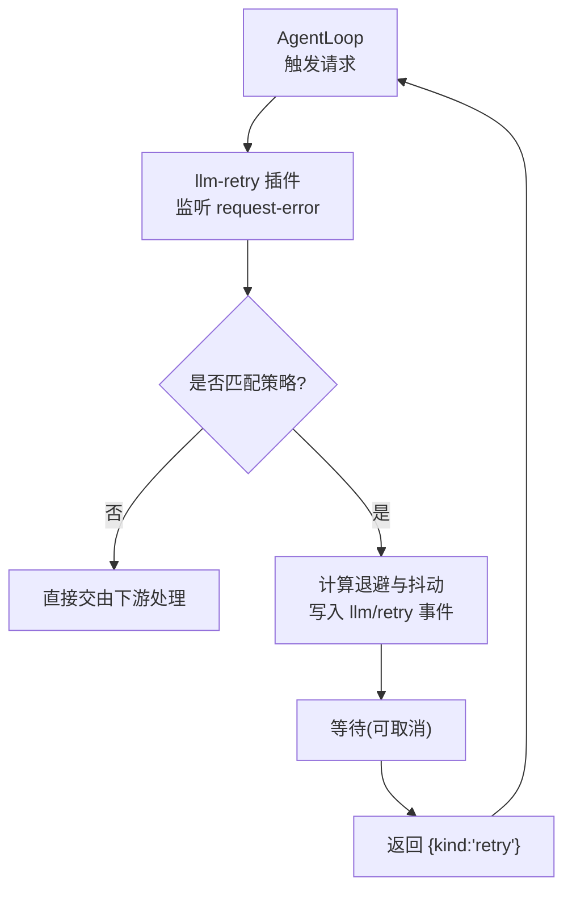
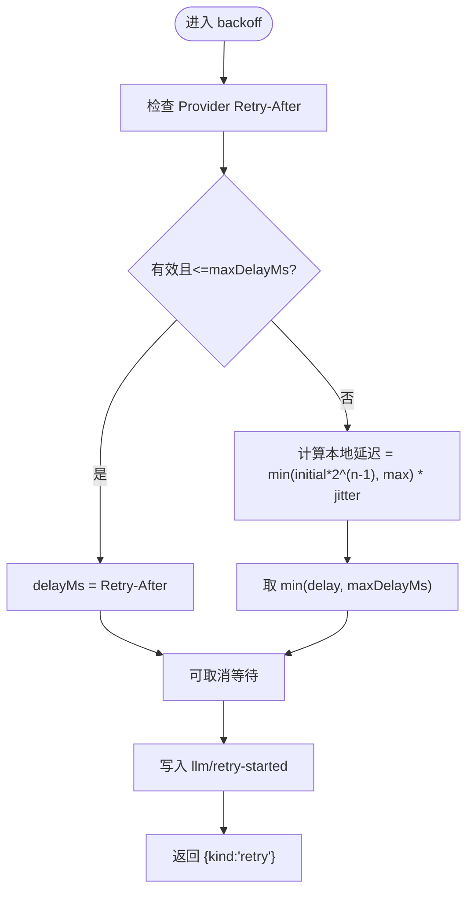
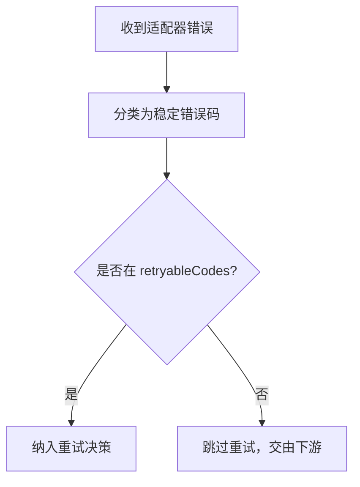
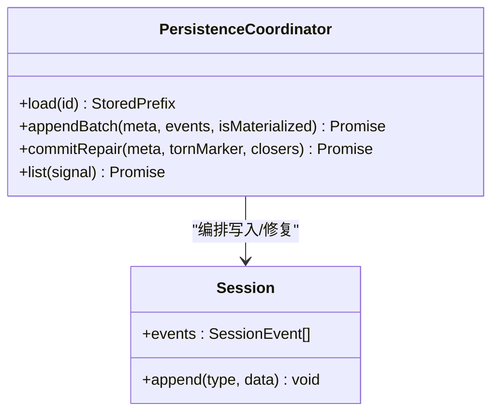
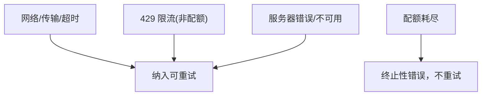
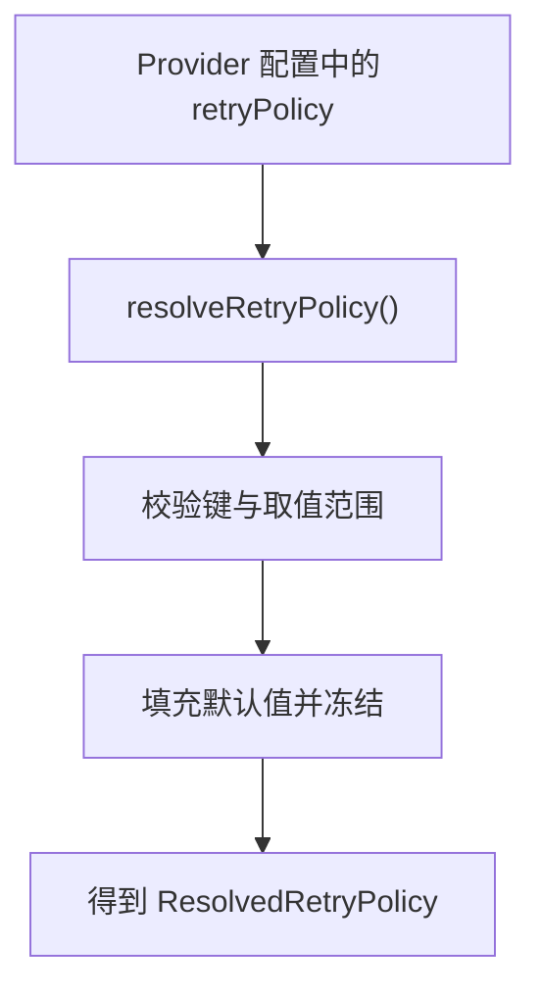
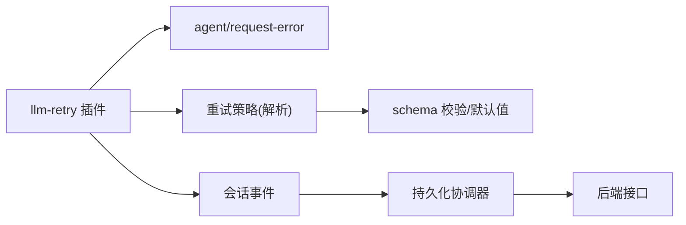

# 重试与恢复机制

<cite>
**本文引用的文件**
- [packages/llm/llm/src/retry-policy.ts](file://packages/llm/llm/src/retry-policy.ts)
- [packages/llm/llm-retry/src/index.ts](file://packages/llm/llm-retry/src/index.ts)
- [packages/core/agent-loop/tests/request-error.spec.ts](file://packages/core/agent-loop/tests/request-error.spec.ts)
- [packages/llm/llm-deepseek/tests/adapter.spec.ts](file://packages/llm/llm-deepseek/tests/adapter.spec.ts)
- [packages/test-support/llm-mock-server/src/index.ts](file://packages/test-support/llm-mock-server/src/index.ts)
- [packages/session/session-persistence/src/coordinator.ts](file://packages/session/session-persistence/src/coordinator.ts)
- [packages/session/session-persistence/tests/persistence.spec.ts](file://packages/session/session-persistence/tests/persistence.spec.ts)
</cite>

## 目录
1. [简介](#简介)
2. [项目结构](#项目结构)
3. [核心组件](#核心组件)
4. [架构总览](#架构总览)
5. [详细组件分析](#详细组件分析)
6. [依赖关系分析](#依赖关系分析)
7. [性能考量](#性能考量)
8. [故障排查指南](#故障排查指南)
9. [结论](#结论)
10. [附录](#附录)

## 简介
本文件系统性阐述 LLM 适配器的重试与恢复机制，覆盖智能重试策略（指数退避、抖动算法、失败分类）、会话持久化与状态恢复、网络异常/API 限流/模型服务不可用等场景处理、重试配置自定义、监控指标采集，以及故障转移与负载均衡的实现思路。文档以仓库中的实际实现为依据，提供可追溯的源码路径与图示，帮助读者从高层到代码层全面理解该子系统。

## 项目结构
围绕重试与恢复的关键代码分布在以下模块：
- 重试策略定义与解析：位于 llm 包的 retry-policy.ts，负责定义 normal/always 两种模式、退避参数校验与默认值填充。
- 重试执行器插件：位于 llm-retry 包的 index.ts，监听 agent/request-error 事件，按策略计算延迟并写入会话事件，最终返回重试动作。
- 适配器错误分类：deepseek 适配器测试中体现对 HTTP 状态码与错误体字段的分类逻辑（如 RATE_LIMIT、QUOTA_EXCEEDED、CONTEXT_WINDOW_EXCEEDED）。
- 会话持久化协调器：session-persistence 包的 coordinator.ts 提供跨后端一致的加载、追加、修复与批写编排，保障长时间任务的可恢复性。
- 端到端行为验证：core/agent-loop 的 request-error 测试展示了请求级错误如何进入恢复管线，以及取消优先于重试的语义。



**图表来源**
- [packages/llm/llm-retry/src/index.ts:99-227](file://packages/llm/llm-retry/src/index.ts#L99-L227)
- [packages/core/agent-loop/tests/request-error.spec.ts:50-99](file://packages/core/agent-loop/tests/request-error.spec.ts#L50-L99)

**章节来源**
- [packages/llm/llm/src/retry-policy.ts:14-192](file://packages/llm/llm/src/retry-policy.ts#L14-L192)
- [packages/llm/llm-retry/src/index.ts:99-227](file://packages/llm/llm-retry/src/index.ts#L99-L227)
- [packages/core/agent-loop/tests/request-error.spec.ts:50-99](file://packages/core/agent-loop/tests/request-error.spec.ts#L50-L99)

## 核心组件
- 重试策略配置与解析
  - 支持 normal（有界重试）与 always（无界重试）两种模式。
  - 退避参数包括 initialDelayMs、maxDelayMs、jitterRatio，均带严格校验与默认值。
  - normal 模式还包含 maxRetries 与 retryableCodes 白名单控制。
- 重试执行器
  - 通过 agent/request-error 扩展点接入，按策略决定是否重试、何时重试。
  - 使用指数退避与对称抖动计算本地延迟；尊重 Provider 返回的 Retry-After（在策略上限内）。
  - 将每次重试计划与开始写入会话事件（llm/retry、llm/retry-started），便于追踪与回放。
- 会话持久化协调器
  - 统一编排加载、追加、修复与批写，确保崩溃后能恢复至一致状态。
  - 提供 per-id 串行化队列，避免并发写入交错；支持冷启动预留 ID 与损坏尾部修复。
- 适配器错误分类
  - 将 HTTP 状态码与错误体字段映射为稳定错误码（如 RATE_LIMIT、QUOTA_EXCEEDED、CONTEXT_WINDOW_EXCEEDED），供策略匹配。

**章节来源**
- [packages/llm/llm/src/retry-policy.ts:14-192](file://packages/llm/llm/src/retry-policy.ts#L14-L192)
- [packages/llm/llm-retry/src/index.ts:58-208](file://packages/llm/llm-retry/src/index.ts#L58-L208)
- [packages/session/session-persistence/src/coordinator.ts:83-200](file://packages/session/session-persistence/src/coordinator.ts#L83-L200)
- [packages/llm/llm-deepseek/tests/adapter.spec.ts:361-396](file://packages/llm/llm-deepseek/tests/adapter.spec.ts#L361-L396)

## 架构总览
下图展示一次失败的模型请求如何进入重试管线，并在满足条件时进行指数退避与抖动，最终返回重试动作或放弃。

```mermaid
sequenceDiagram
participant Agent as "Agent"
participant Loop as "AgentLoop"
participant Retry as "llm-retry 插件"
participant Policy as "重试策略"
participant Session as "会话持久化"
participant Adapter as "LLM 适配器"
Agent->>Loop : 发起请求
Loop->>Adapter : 调用适配器
Adapter-->>Loop : 抛出失败(LlmFailure)
Loop->>Retry : 触发 agent/request-error
Retry->>Policy : 判断是否可重试/次数限制
alt 可重试
Retry->>Session : 写入 llm/retry(含 delayMs, policyKey)
Retry->>Retry : 计算指数退避+抖动
Retry->>Session : 等待(可取消)
Retry->>Session : 写入 llm/retry-started
Retry-->>Loop : 返回 {kind : 'retry'}
Loop->>Adapter : 再次发起请求
else 不可重试
Retry-->>Loop : 不干预(交由下游)
end
```

**图表来源**
- [packages/llm/llm-retry/src/index.ts:156-208](file://packages/llm/llm-retry/src/index.ts#L156-L208)
- [packages/llm/llm/src/retry-policy.ts:145-192](file://packages/llm/llm/src/retry-policy.ts#L145-L192)
- [packages/core/agent-loop/tests/request-error.spec.ts:50-99](file://packages/core/agent-loop/tests/request-error.spec.ts#L50-L99)

## 详细组件分析

### 智能重试策略：指数退避与抖动
- 指数退避
  - 基于重试次数递增幂次，乘以初始延迟，并以最大延迟封顶。
  - 若 Provider 返回有效的 Retry-After（且不超过策略上限），则优先采用其值。
- 抖动算法
  - 在每个本地延迟上应用对称抖动，范围由 jitterRatio 控制，降低突发重试风暴。
- 策略模式
  - normal：受 maxRetries 与 retryableCodes 约束，超出即停止。
  - always：对所有失败持续重试，直到成功、取消或生命周期结束。



**图表来源**
- [packages/llm/llm-retry/src/index.ts:58-63](file://packages/llm/llm-retry/src/index.ts#L58-L63)
- [packages/llm/llm-retry/src/index.ts:193-207](file://packages/llm/llm-retry/src/index.ts#L193-L207)

**章节来源**
- [packages/llm/llm-retry/src/index.ts:58-63](file://packages/llm/llm-retry/src/index.ts#L58-L63)
- [packages/llm/llm-retry/src/index.ts:193-207](file://packages/llm/llm-retry/src/index.ts#L193-L207)

### 失败分类与可重试判定
- 适配器侧将 HTTP 状态码与错误体字段映射为稳定错误码：
  - 429 + insufficient_quota → QUOTA_EXCEEDED（终止性配额耗尽）
  - 429 其他 → RATE_LIMIT（瞬时限流）
  - 400 + context overflow → CONTEXT_WINDOW_EXCEEDED
- 策略层依据 retryableCodes 白名单决定是否纳入重试。



**图表来源**
- [packages/llm/llm-deepseek/tests/adapter.spec.ts:361-396](file://packages/llm/llm-deepseek/tests/adapter.spec.ts#L361-L396)
- [packages/llm/llm/src/retry-policy.ts:18-24](file://packages/llm/llm/src/retry-policy.ts#L18-L24)

**章节来源**
- [packages/llm/llm-deepseek/tests/adapter.spec.ts:361-396](file://packages/llm/llm-deepseek/tests/adapter.spec.ts#L361-L396)
- [packages/llm/llm/src/retry-policy.ts:18-24](file://packages/llm/llm/src/retry-policy.ts#L18-L24)

### 会话持久化与状态恢复
- 协调器职责
  - 管理 per-id 的串行化写入链，避免并发交错。
  - 提供 load/appendBatch/commitRepair 等原语，保证崩溃后可恢复。
  - 支持冷启动时预留 session id，防止并发创建冲突。
- 合成关闭事件与修复
  - 当检测到存储尾部损坏时，协调器会生成合成关闭事件并持久化，使会话处于一致状态。
- 观察与准备
  - inspect 仅读取并合成关闭事件，prepare 时才真正提交修复，减少不必要的写放大。



**图表来源**
- [packages/session/session-persistence/src/coordinator.ts:83-200](file://packages/session/session-persistence/src/coordinator.ts#L83-L200)
- [packages/session/session-persistence/src/coordinator.ts:575-603](file://packages/session/session-persistence/src/coordinator.ts#L575-L603)

**章节来源**
- [packages/session/session-persistence/src/coordinator.ts:83-200](file://packages/session/session-persistence/src/coordinator.ts#L83-L200)
- [packages/session/session-persistence/src/coordinator.ts:575-603](file://packages/session/session-persistence/src/coordinator.ts#L575-L603)
- [packages/session/session-persistence/tests/persistence.spec.ts:428-458](file://packages/session/session-persistence/tests/persistence.spec.ts#L428-L458)
- [packages/session/session-persistence/tests/persistence.spec.ts:962-1004](file://packages/session/session-persistence/tests/persistence.spec.ts#L962-L1004)

### 网络异常、API 限流与模型服务不可用
- 网络异常/超时/传输错误：属于 TRANSPORT/TIMEOUT，默认纳入可重试集合。
- API 限流：429 且非配额耗尽时归类为 RATE_LIMIT，可重试。
- 模型服务不可用：SERVER/SERVICE_UNAVAILABLE 等服务器侧错误，默认可重试。
- 配额耗尽：insufficient_quota 视为终止性错误，不应无限重试。



**图表来源**
- [packages/llm/llm/src/retry-policy.ts:18-24](file://packages/llm/llm/src/retry-policy.ts#L18-L24)
- [packages/test-support/llm-mock-server/src/index.ts:537-558](file://packages/test-support/llm-mock-server/src/index.ts#L537-L558)
- [packages/llm/llm-deepseek/tests/adapter.spec.ts:392-396](file://packages/llm/llm-deepseek/tests/adapter.spec.ts#L392-L396)

**章节来源**
- [packages/llm/llm/src/retry-policy.ts:18-24](file://packages/llm/llm/src/retry-policy.ts#L18-L24)
- [packages/test-support/llm-mock-server/src/index.ts:537-558](file://packages/test-support/llm-mock-server/src/index.ts#L537-L558)
- [packages/llm/llm-deepseek/tests/adapter.spec.ts:392-396](file://packages/llm/llm-deepseek/tests/adapter.spec.ts#L392-L396)

### 重试配置的自定义方法
- 在 provider 配置中声明 retryPolicy：
  - mode: 'normal' | 'always'
  - normal 下可配置 maxRetries、retryableCodes、backoff
  - backoff 可配置 initialDelayMs、maxDelayMs、jitterRatio
- 解析过程会做严格校验与默认值填充，并冻结结果对象，确保注册态不可变。



**图表来源**
- [packages/llm/llm/src/retry-policy.ts:81-192](file://packages/llm/llm/src/retry-policy.ts#L81-L192)

**章节来源**
- [packages/llm/llm/src/retry-policy.ts:81-192](file://packages/llm/llm/src/retry-policy.ts#L81-L192)

### 监控指标收集
- 通过会话事件暴露关键指标：
  - llm/retry：记录每次重试计划（含 turn、step、provider、policyKey、retry、maxRetries、delayMs、failure）
  - llm/retry-started：记录实际开始重试的时间点
- 这些事件可用于构建仪表盘：重试次数、平均延迟、失败码分布、策略命中率等。

**章节来源**
- [packages/llm/llm-retry/src/index.ts:126-153](file://packages/llm/llm-retry/src/index.ts#L126-L153)

### 故障转移与负载均衡实现方案
- 故障转移
  - 利用 always 模式配合多路由/多 provider 注册，当某一路由持续失败时，上层调度可在更高层面切换到备用路由。
  - 结合会话事件与外部监控系统，自动触发切换。
- 负载均衡
  - 在 provider 注册阶段为不同模型/路由分配权重，结合重试统计动态调整流量。
  - 注意：当前重试执行器聚焦单请求级恢复；跨实例/多模型的负载分担需在上层编排层实现。

[本节为概念性说明，不直接分析具体文件]

## 依赖关系分析
- llm-retry 插件依赖：
  - agent/request-error 事件总线
  - 会话系统（写入 llm/retry、llm/retry-started）
  - 重试策略（来自 llm 包）
- 策略解析依赖：
  - 配置 schema 校验与默认值
  - 定时器上限常量
- 持久化协调器依赖：
  - 会话事件类型与格式版本
  - 各后端实现的 appendBatch/commitRepair/list



**图表来源**
- [packages/llm/llm-retry/src/index.ts:20-27](file://packages/llm/llm-retry/src/index.ts#L20-L27)
- [packages/llm/llm/src/retry-policy.ts:10-13](file://packages/llm/llm/src/retry-policy.ts#L10-L13)
- [packages/session/session-persistence/src/coordinator.ts:117-200](file://packages/session/session-persistence/src/coordinator.ts#L117-L200)

**章节来源**
- [packages/llm/llm-retry/src/index.ts:20-27](file://packages/llm/llm-retry/src/index.ts#L20-L27)
- [packages/llm/llm/src/retry-policy.ts:10-13](file://packages/llm/llm/src/retry-policy.ts#L10-L13)
- [packages/session/session-persistence/src/coordinator.ts:117-200](file://packages/session/session-persistence/src/coordinator.ts#L117-L200)

## 性能考量
- 指数退避与抖动可有效缓解雪崩与重试风暴，建议根据业务 SLA 合理设置 initialDelayMs 与 maxDelayMs。
- 使用 jitterRatio=0 可获得确定性延迟，便于压测与回归；生产环境建议保留一定抖动。
- 会话事件写入应批量合并，避免频繁落盘造成 I/O 压力；协调器已内置批写窗口。
- 对于 always 模式，需关注长期运行下的资源占用与日志量增长，建议配合外部监控与告警。

[本节提供通用指导，不直接分析具体文件]

## 故障排查指南
- 现象：请求反复重试但未成功
  - 检查 retryableCodes 是否包含对应错误码；确认 Provider 返回的错误分类是否符合预期。
  - 查看会话事件 llm/retry 与 llm/retry-started，确认 delayMs 与 policyKey 是否符合预期。
- 现象：取消未生效
  - 确认上游取消信号是否正确传递；重试等待使用可取消延迟，取消应优先于重试。
- 现象：崩溃后无法恢复
  - 检查持久化协调器是否完成 commitRepair；必要时通过 inspect/prepare 流程诊断。

**章节来源**
- [packages/core/agent-loop/tests/request-error.spec.ts:101-119](file://packages/core/agent-loop/tests/request-error.spec.ts#L101-L119)
- [packages/session/session-persistence/tests/persistence.spec.ts:962-1004](file://packages/session/session-persistence/tests/persistence.spec.ts#L962-L1004)

## 结论
本机制通过“策略解析 + 插件执行 + 会话持久化”的分层设计，实现了健壮的重试与恢复能力：
- 策略层提供可配置的指数退避与抖动，支持正常与无界两种模式。
- 执行层在 agent/request-error 扩展点上精准介入，写入可观测事件并返回重试动作。
- 持久化层确保长时间任务在崩溃后仍可恢复至一致状态。
- 适配器错误分类将网络异常、API 限流与服务不可用等场景标准化，便于策略匹配与治理。
- 监控指标通过会话事件自然沉淀，便于可视化与告警。
- 故障转移与负载均衡可在上层编排层结合策略与监控实现。

[本节总结性内容，不直接分析具体文件]

## 附录
- 关键配置项速查
  - mode: 'normal' | 'always'
  - normal: maxRetries, retryableCodes, backoff
  - backoff: initialDelayMs, maxDelayMs, jitterRatio
- 关键事件
  - llm/retry：计划重试（含 delayMs、policyKey、failure）
  - llm/retry-started：实际开始重试

[本节为补充信息，不直接分析具体文件]