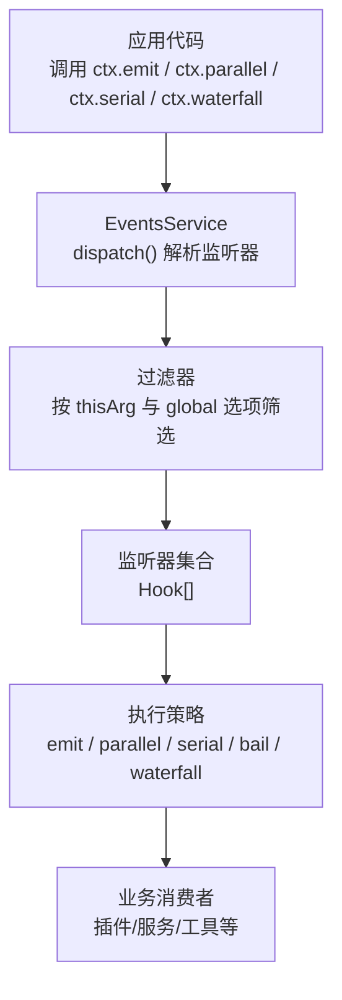
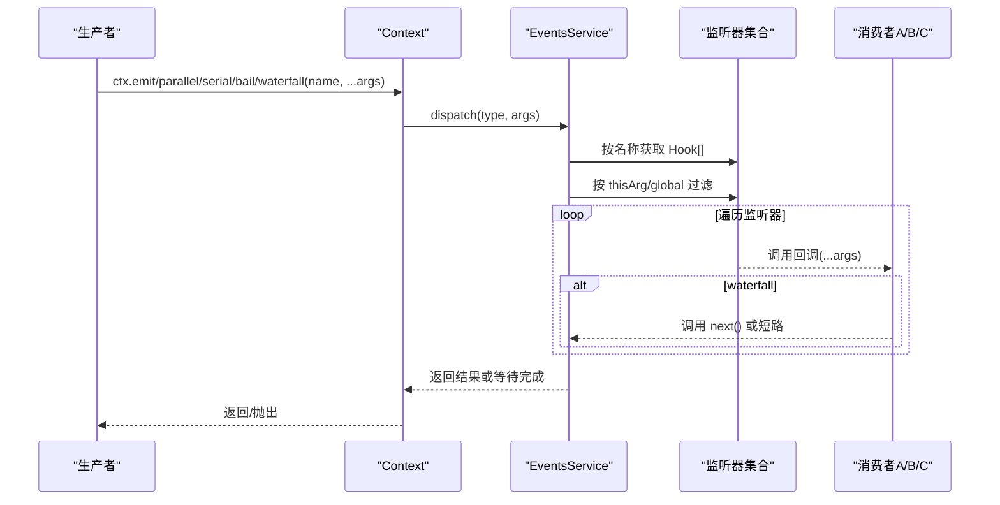
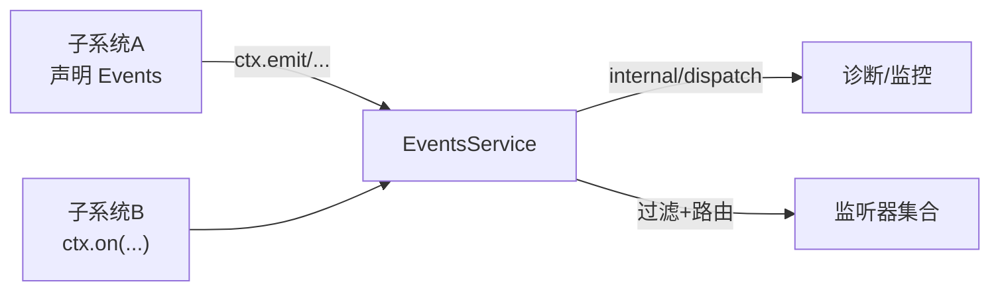

# 事件扩展

<cite>
**本文引用的文件**
- [vendor/cordis/src/events.ts](file://vendor/cordis/src/events.ts)
- [docs/cordis-api/events.md](file://docs/cordis-api/events.md)
- [docs/event-producer-consumer.md](file://docs/event-producer-consumer.md)
- [docs/cordis-tutorial/04-events.md](file://docs/cordis-tutorial/04-events.md)
- [packages/core/agent/src/dispatch.ts](file://packages/core/agent/src/dispatch.ts)
- [scripts/gen-doc-graphs.ts](file://scripts/gen-doc-graphs.ts)
- [packages/session-query/session-query/src/tracing.ts](file://packages/session-query/session-query/src/tracing.ts)
- [packages/runtime-diagnostics/invariants/tests/service.spec.ts](file://packages/runtime-diagnostics/invariants/tests/service.spec.ts)
</cite>

## 目录
1. [简介](#简介)
2. [项目结构](#项目结构)
3. [核心组件](#核心组件)
4. [架构总览](#架构总览)
5. [详细组件分析](#详细组件分析)
6. [依赖关系分析](#依赖关系分析)
7. [性能考量](#性能考量)
8. [故障排查指南](#故障排查指南)
9. [结论](#结论)
10. [附录](#附录)

## 简介
本文件系统化说明 DeepSeek Harness 的事件扩展机制，覆盖事件生产者、消费者与中间件（waterfall）处理流程；文档化发布订阅模式、事件过滤与路由机制；提供自定义事件类型、事件处理器与事件链的扩展开发指南；并给出事件调试、性能监控与错误处理的实用技巧，以及常见事件驱动场景的实现示例。

## 项目结构
Harness 的事件系统以 Cordis 为核心：每个上下文 Context 混入事件分发 API（emit/parallel/serial/bail/waterfall/on/once），并通过 EventsService 统一调度监听器。各子系统通过声明式合并接口 Events 注册事件名与签名，生产者在业务逻辑中调用 ctx.* 方法派发事件，消费者在插件生命周期内用 ctx.on 订阅。

图表来源
- [vendor/cordis/src/events.ts:165-243](file://vendor/cordis/src/events.ts#L165-L243)
- [docs/cordis-api/events.md:8-123](file://docs/cordis-api/events.md#L8-L123)

章节来源
- [vendor/cordis/src/events.ts:119-319](file://vendor/cordis/src/events.ts#L119-L319)
- [docs/cordis-api/events.md:8-123](file://docs/cordis-api/events.md#L8-L123)

## 核心组件
- 事件总线与分发器
  - EventsService：维护 Hook 列表，实现 dispatch、emit、parallel、serial、bail、waterfall、on、once 等方法，支持 fiber 自动释放与上下文过滤。
  - 内置内部事件：internal/plugin、internal/status、internal/config、internal/service、internal/update、internal/get、internal/set、internal/listener、internal/dispatch，用于框架级钩子与诊断。
- 上下文 API
  - ctx.emit：同步广播，忽略返回值与 Promise。
  - ctx.parallel：并发执行所有监听器，聚合异常。
  - ctx.serial：顺序执行，首个“非空/非false/非undefined”返回值即停止后续。
  - ctx.bail：同步版 serial。
  - ctx.waterfall：around 中间件风格，最后一个参数为 next，可转换或短路。
  - ctx.on / ctx.once：在当前 fiber 下注册监听器，支持 prepend 与 global 选项。
- Agent 专用分发器
  - agentEvents：将 agent 注入 payload.agent，并以 agent 作用域作为 thisArg 进行分发，保证主题与作用域键一致。
  - emitAgentEvent：轻量一次性通知。

章节来源
- [vendor/cordis/src/events.ts:119-353](file://vendor/cordis/src/events.ts#L119-L353)
- [docs/cordis-api/events.md:8-123](file://docs/cordis-api/events.md#L8-L123)
- [packages/core/agent/src/dispatch.ts:49-165](file://packages/core/agent/src/dispatch.ts#L49-L165)

## 架构总览
事件系统的职责边界清晰：
- 生产者：业务模块在关键路径上调用 ctx.* 派发事件。
- 路由器：EventsService.dispatch 根据名称查找监听器，结合 thisArg 与 global 选项做上下文过滤。
- 消费者：插件/服务/工具等通过 ctx.on 订阅事件，实现横切关注点（日志、指标、策略、UI 更新等）。
- 中间件：waterfall 事件构成 around 拦截链，允许转换结果或短路决策。

图表来源
- [vendor/cordis/src/events.ts:165-243](file://vendor/cordis/src/events.ts#L165-L243)
- [docs/cordis-api/events.md:8-123](file://docs/cordis-api/events.md#L8-L123)

## 详细组件分析

### 事件分发模式与语义
- emit：同步广播，不等待 Promise，适合无副作用的通知。
- parallel：并发执行，全部完成后返回，任一失败会聚合异常。
- serial：顺序执行，首个“有效返回值”短路。
- bail：同步版 serial。
- waterfall：around 中间件，最后一个参数是 next，可包装或否决后续。

章节来源
- [docs/cordis-api/events.md:8-123](file://docs/cordis-api/events.md#L8-L123)
- [vendor/cordis/src/events.ts:183-243](file://vendor/cordis/src/events.ts#L183-L243)

### 事件过滤与路由
- 路由：按事件名从 _hooks 表中取 Hook[]。
- 过滤：若 thisArg 存在且未设置 global，则通过 Context.filter 函数过滤仅对当前作用域有效的监听器。
- 诊断：非 internal 事件派发前触发 internal/dispatch(mode, name, args, thisArg)，可用于观测与统计。

章节来源
- [vendor/cordis/src/events.ts:165-175](file://vendor/cordis/src/events.ts#L165-L175)

### Agent 作用域事件
- agentEvents 将 agent 注入 payload.agent，并以 agent 作用域作为 thisArg 分发，确保主题与作用域一致。
- emit 封装了 per-listener 的错误捕获与警告记录，避免单个监听器异常影响其他监听器。
- serial/waterfall 直接复用 ctx 的分发能力，保持类型安全。

章节来源
- [packages/core/agent/src/dispatch.ts:49-165](file://packages/core/agent/src/dispatch.ts#L49-L165)

### 事件矩阵与跨包协作
Harness 定义了丰富的自有事件，涵盖 agent、session、tools、llm、fs、workflow 等子系统。每个事件标注了派发模式、声明位置、派发方与监听方，便于理解耦合关系与扩展点。

章节来源
- [docs/event-producer-consumer.md:8-77](file://docs/event-producer-consumer.md#L8-L77)

### 事件扩展开发指南

#### 创建自定义事件类型
- 在目标包的类型文件中通过 declare module '@deepseek-ai/cordis' 合并 Events 接口，声明事件名与监听器签名。
- 使用命名空间/动作风格（如 'stats/report'）保持可读性。
- 明确事件派发模式（emit/parallel/serial/bail/waterfall），并在文档中注明。

章节来源
- [docs/cordis-tutorial/04-events.md:7-44](file://docs/cordis-tutorial/04-events.md#L7-L44)

#### 实现事件生产者
- 在业务逻辑合适的位置调用 ctx.emit/parallel/serial/bail/waterfall 派发事件。
- 对于 Agent 相关事件，优先使用 agentEvents 或 emitAgentEvent，确保 agent 注入与作用域正确。
- 对高频通知建议使用 emit，避免阻塞主流程。

章节来源
- [docs/cordis-tutorial/04-events.md:30-44](file://docs/cordis-tutorial/04-events.md#L30-L44)
- [packages/core/agent/src/dispatch.ts:120-165](file://packages/core/agent/src/dispatch.ts#L120-L165)

#### 实现事件消费者与中间件
- 使用 ctx.on 订阅事件，监听器随 fiber 生命周期自动释放。
- 对于需要转换或决策的场景，使用 ctx.waterfall，并确保观察型监听器调用 next()。
- 可使用 prepend: true 调整监听器顺序，或使用 global: true 绕过上下文过滤。

章节来源
- [docs/cordis-tutorial/04-events.md:46-78](file://docs/cordis-tutorial/04-events.md#L46-L78)
- [docs/cordis-tutorial/04-events.md:94-141](file://docs/cordis-tutorial/04-events.md#L94-L141)
- [vendor/cordis/src/events.ts:111-117](file://vendor/cordis/src/events.ts#L111-L117)

#### 构建事件链
- 使用 waterfall 构建 around 拦截链：外层监听器可包装 next() 的返回值，或在条件满足时短路。
- 典型用途：请求配置改写、审批策略决策、流式内容截断等。

章节来源
- [docs/cordis-tutorial/04-events.md:94-141](file://docs/cordis-tutorial/04-events.md#L94-L141)

### 常见事件驱动场景示例
- 工具执行前后钩子：tools/pre-execute、tools/post-execute 用于埋点、限流、重试等。
- 会话生命周期：session/created、session/disposed、session/event、session/flush 用于持久化、遥测、标题生成等。
- 模型流式输出：llm/stream 用于检查点、标题生成、回放等。
- 工作流阶段：workflow/start、workflow/phase、workflow/end 用于编排与追踪。

章节来源
- [docs/event-producer-consumer.md:8-77](file://docs/event-producer-consumer.md#L8-L77)

## 依赖关系分析
- 低耦合：生产者与消费者通过事件名解耦，无需直接引用。
- 强类型：通过 Events 接口合并与 TypeScript 类型推导，编译期校验事件签名。
- 可观测性：internal/dispatch 暴露事件总线层面的观测点，便于全局监控。
- 作用域隔离：thisArg + filter 确保事件仅在合适的上下文中被消费。

图表来源
- [vendor/cordis/src/events.ts:165-175](file://vendor/cordis/src/events.ts#L165-L175)
- [docs/event-producer-consumer.md:8-77](file://docs/event-producer-consumer.md#L8-L77)

章节来源
- [vendor/cordis/src/events.ts:165-175](file://vendor/cordis/src/events.ts#L165-L175)
- [docs/event-producer-consumer.md:8-77](file://docs/event-producer-consumer.md#L8-L77)

## 性能考量
- 选择合适模式：通知类用 emit，并行无关任务用 parallel，决策类用 serial/bail，拦截转换用 waterfall。
- 避免热点分配：Agent 分发器可复用 carrier，减少重复构造。
- 控制监听器数量：过多监听器会增加分发开销，必要时合并或分层。
- 利用 internal/dispatch 做采样统计，避免全量打点。

章节来源
- [packages/core/agent/src/dispatch.ts:84-107](file://packages/core/agent/src/dispatch.ts#L84-L107)
- [vendor/cordis/src/events.ts:165-175](file://vendor/cordis/src/events.ts#L165-L175)

## 故障排查指南
- 事件未触发
  - 检查事件名是否一致，是否在正确的上下文中派发（thisArg）。
  - 确认监听器已注册且未被 dispose。
  - 使用 internal/dispatch 观测派发是否到达。
- 监听器异常
  - emit 模式下异常会被捕获并记录，不影响其他监听器。
  - parallel 模式会聚合异常，需逐一排查。
  - serial/bail 会在首个“有效返回值”后停止，注意短路逻辑。
- 作用域问题
  - 使用 global: true 绕过上下文过滤，但需谨慎。
  - Agent 事件务必通过 agentEvents/emitAgentEvent 保证作用域一致。
- 调试与追踪
  - 使用 session query 的事件追踪能力定位事件序列与来源。
  - 在测试中验证监听器的注册与释放行为。

章节来源
- [vendor/cordis/src/events.ts:183-243](file://vendor/cordis/src/events.ts#L183-L243)
- [packages/session-query/session-query/src/tracing.ts:175-248](file://packages/session-query/session-query/src/tracing.ts#L175-L248)
- [packages/runtime-diagnostics/invariants/tests/service.spec.ts:189-224](file://packages/runtime-diagnostics/invariants/tests/service.spec.ts#L189-L224)

## 结论
DeepSeek Harness 的事件系统以 Cordis 为基础，提供了灵活而强大的发布订阅、中间件与上下文过滤能力。通过声明式事件定义、多种分发模式与 Agent 作用域分发，开发者可以以低耦合方式扩展系统行为。配合 internal/dispatch 与事件追踪工具，可实现完善的调试与性能监控。遵循最佳实践选择合适的分发模式与监听器组织方式，可在保证性能的同时提升可维护性与可扩展性。

## 附录

### 事件矩阵与生成机制
- 事件矩阵由脚本扫描仓库源码生成，包含事件名、模式、声明位置、派发方与监听方。
- 脚本还识别非 harness 或未声明事件字符串的使用情况，辅助维护一致性。

章节来源
- [docs/event-producer-consumer.md:1-77](file://docs/event-producer-consumer.md#L1-L77)
- [scripts/gen-doc-graphs.ts:918-1010](file://scripts/gen-doc-graphs.ts#L918-L1010)

### 快速上手示例
- 教程展示了如何声明事件、发射事件与订阅事件，以及 waterfall 的转换与短路用法。
- 建议从简单 notify 开始，逐步引入复杂中间件链。

章节来源
- [docs/cordis-tutorial/04-events.md:7-141](file://docs/cordis-tutorial/04-events.md#L7-L141)