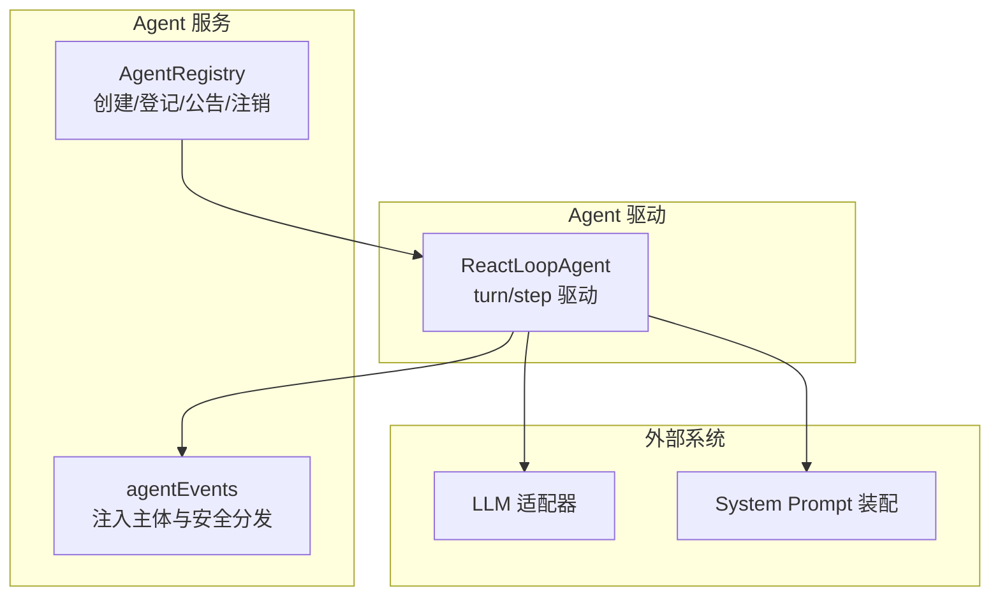
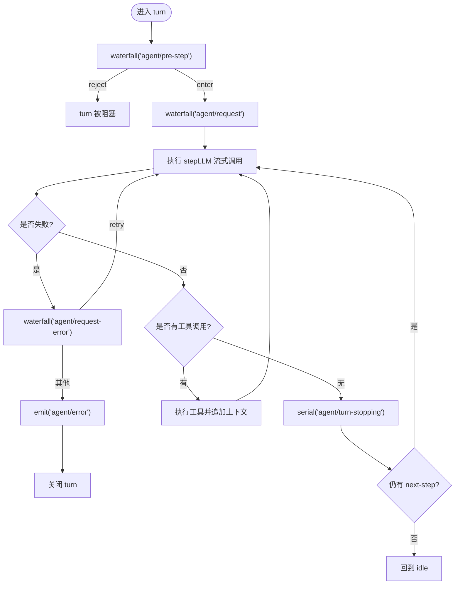
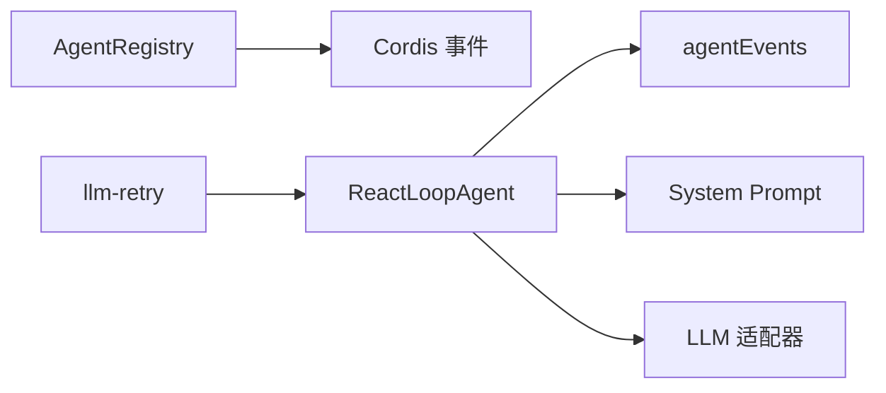

# Agent事件

<cite>
**本文引用的文件**
- [packages/core/agent/src/index.ts](file://packages/core/agent/src/index.ts)
- [packages/core/agent/src/dispatch.ts](file://packages/core/agent/src/dispatch.ts)
- [packages/core/agent-loop/src/agent.ts](file://packages/core/agent-loop/src/agent.ts)
- [packages/core/agent/tests/agent.spec.ts](file://packages/core/agent/tests/agent.spec.ts)
- [packages/core/agent-loop/tests/request-error.spec.ts](file://packages/core/agent-loop/tests/request-error.spec.ts)
- [packages/llm/llm-retry/src/index.ts](file://packages/llm/llm-retry/src/index.ts)
- [docs/cordis-api/events.md](file://docs/cordis-api/events.md)
</cite>

## 目录
1. [简介](#简介)
2. [项目结构](#项目结构)
3. [核心组件](#核心组件)
4. [架构总览](#架构总览)
5. [详细组件分析](#详细组件分析)
6. [依赖关系分析](#依赖关系分析)
7. [性能考量](#性能考量)
8. [故障排查指南](#故障排查指南)
9. [结论](#结论)
10. [附录](#附录)

## 简介
本文件系统性梳理 Agent 生命周期、消息传递与执行流程中的关键事件，覆盖 agent/created、agent/disposed、agent/status、agent/error 等生命周期与状态事件；说明 agent/inbox/inserted、agent/inbox/claimed、agent/inbox/discarded 等消息投递与领取事件；并解释 agent/pre-step、agent/request、agent/request-error、agent/turn-stopping 在执行流水线中的作用。文末提供事件监听与处理的最佳实践，包括错误隔离、重试策略与取消优先原则的实现要点。

## 项目结构
围绕 Agent 事件的关键实现分布在以下模块：
- Agent 注册与生命周期：AgentRegistry（创建、登记、公告、注销）
- Agent 驱动循环：ReactLoopAgent（轮次/步骤推进、状态切换、事件发射）
- 事件分发器：agentEvents（注入 agent 主体、安全 emit/serial/waterfall）
- 文档与事件模型：Cordis 事件 API（emit/parallel/serial/bail/waterfall）



图表来源
- [packages/core/agent/src/index.ts:450-576](file://packages/core/agent/src/index.ts#L450-L576)
- [packages/core/agent/src/dispatch.ts:107-149](file://packages/core/agent/src/dispatch.ts#L107-L149)
- [packages/core/agent-loop/src/agent.ts:80-111](file://packages/core/agent-loop/src/agent.ts#L80-L111)

章节来源
- [packages/core/agent/src/index.ts:450-576](file://packages/core/agent/src/index.ts#L450-L576)
- [packages/core/agent/src/dispatch.ts:107-149](file://packages/core/agent/src/dispatch.ts#L107-L149)
- [packages/core/agent-loop/src/agent.ts:80-111](file://packages/core/agent-loop/src/agent.ts#L80-L111)
- [docs/cordis-api/events.md:8-123](file://docs/cordis-api/events.md#L8-L123)

## 核心组件
- AgentRegistry：负责 Agent 的进入、公告、分离与销毁，确保 agent/created 与 agent/disposed 成对出现，并在创建失败时回滚。
- ReactLoopAgent：维护 idle/maintenance/running 三态，驱动 turn/step 边界，发射 agent/status、agent/error、agent/pre-step、agent/request、agent/request-error、agent/turn-stopping 等事件。
- agentEvents：为每个 Agent 构建“带主体的”事件分发器，自动注入 agent 到 payload，并提供 emit/serial/waterfall 三种模式，保证通知不阻塞、串行可编排、水帘可拦截。

章节来源
- [packages/core/agent/src/index.ts:450-576](file://packages/core/agent/src/index.ts#L450-L576)
- [packages/core/agent-loop/src/agent.ts:80-111](file://packages/core/agent-loop/src/agent.ts#L80-L111)
- [packages/core/agent/src/dispatch.ts:107-149](file://packages/core/agent/src/dispatch.ts#L107-L149)

## 架构总览
下图展示 Agent 从创建到运行、再到销毁的事件流，以及 Inbox 消息在插入、领取、丢弃时的实时通知。

```mermaid
sequenceDiagram
participant Owner as "调用方"
participant Reg as "AgentRegistry"
participant Loop as "ReactLoopAgent"
participant Inbox as "Inbox"
participant Ctx as "事件总线"
Owner->>Reg : register(agent) / announce()
Reg-->>Ctx : emit("agent/created", {agent})
Note over Reg,Ctx : 若创建监听抛出或异步拒绝，仍会配对发出 disposed
Owner->>Loop : followup()/steer()/inject()
Loop->>Inbox : splice(target, message)
Inbox-->>Ctx : emit("agent/inbox/inserted", {message})
Loop->>Loop : turn() -> preStep()
Loop->>Inbox : claim(target, turn)
Inbox-->>Ctx : emit("agent/inbox/claimed", {message, turn})
Loop->>Ctx : waterfall("agent/pre-step", {messages,...})
alt 拒绝
Ctx-->>Loop : reject
else 进入
Ctx-->>Loop : enter({messages,...})
Loop->>Ctx : waterfall("agent/request", {turn, step})
Loop->>Loop : step()
opt 请求失败
Loop->>Ctx : waterfall("agent/request-error", {failure,...})
alt 返回 retry
Loop->>Loop : 重试当前 step
else 其他
Loop->>Ctx : emit("agent/error", {error})
Loop->>Loop : 关闭 turn
end
end
Loop->>Ctx : serial("agent/turn-stopping", {turn})
end
Owner->>Reg : dispose()
Reg-->>Ctx : emit("agent/disposed", {agent})
```

图表来源
- [packages/core/agent/src/index.ts:450-576](file://packages/core/agent/src/index.ts#L450-L576)
- [packages/core/agent-loop/src/agent.ts:113-140](file://packages/core/agent-loop/src/agent.ts#L113-L140)
- [packages/core/agent-loop/src/agent.ts:225-330](file://packages/core/agent-loop/src/agent.ts#L225-L330)
- [packages/core/agent-loop/src/agent.ts:332-401](file://packages/core/agent-loop/src/agent.ts#L332-L401)

## 详细组件分析

### 生命周期事件：agent/created、agent/disposed
- agent/created：在 Agent 被登记并公告时发出，携带 agent 对象。若任何监听同步抛出或异步拒绝，注册会被回滚，且仍会配对发出 agent/disposed，保证观察者可见性一致。
- agent/disposed：在 Agent 从注册表移除时发出，用于资源清理与收尾。

最佳实践
- 将创建监听视为“可否决”的钩子：如需阻止发布，应抛出异常；但需意识到后续可能触发 disposed。
- 在 disposed 中释放与 agent 绑定的资源（定时器、订阅、缓存），避免泄漏。

章节来源
- [packages/core/agent/src/index.ts:450-576](file://packages/core/agent/src/index.ts#L450-L576)
- [packages/core/agent/tests/agent.spec.ts:221-232](file://packages/core/agent/tests/agent.spec.ts#L221-L232)

### 状态事件：agent/status
- 当 Agent 状态在 idle 与 running 之间切换时发出。status 仅反映整体活动维度，不区分 maintenance 阶段。
- 监听器抛错或被拒绝不会阻断状态流转，仅记录警告。

最佳实践
- 使用 agent/status 做 UI 或指标上报，不要依赖它做业务控制流。
- 对状态监听进行幂等设计，避免重复统计。

章节来源
- [packages/core/agent-loop/src/agent.ts:99-111](file://packages/core/agent-loop/src/agent.ts#L99-L111)
- [packages/core/agent/tests/agent.spec.ts:301-319](file://packages/core/agent/tests/agent.spec.ts#L301-L319)

### 错误事件：agent/error
- 当 turn/step 发生未捕获错误时发出，包含 turn、step 与结构化 error。
- 该事件是“报告型”，不改变控制流；真正的恢复由 agent/request-error 决定。

最佳实践
- 在 agent/error 中记录诊断信息（堆栈、上下文），便于定位问题。
- 不要在 agent/error 中尝试恢复逻辑，交由 request-error 统一处理。

章节来源
- [packages/core/agent-loop/src/agent.ts:202-208](file://packages/core/agent-loop/src/agent.ts#L202-L208)
- [packages/core/agent-loop/src/agent.ts:302-323](file://packages/core/agent-loop/src/agent.ts#L302-L323)

### 消息传递事件：agent/inbox/inserted、agent/inbox/claimed、agent/inbox/discarded
- inserted：消息入队时发出，携带 message。
- claimed：原子领取时发出，携带 message 与 turn，表示该消息已转入当前 turn 的处理。
- discarded：普通删除或取消时发出，携带 message，表示消息被丢弃。

注意
- 这些是“最小实时通知”，持久化坐标由 spliced 事件持有；消费者应以 MessageId 关联消息。

最佳实践
- 用 inserted 做增量索引或审计；用 claimed 标记“开始处理”；用 discarded 清理待办。
- 避免在 listener 中修改同一 inbox 导致重入竞争，必要时延后到下一轮。

章节来源
- [packages/core/agent-loop/src/agent.ts:87-91](file://packages/core/agent-loop/src/agent.ts#L87-L91)
- [.agents/notes/implemented/architecture/2026-07-22-unified-send-and-coalesced-user-messages.md:21-25](file://.agents/notes/implemented/architecture/2026-07-22-unified-send-and-coalesced-user-messages.md#L21-L25)

### 执行流程事件：agent/pre-step、agent/request、agent/request-error、agent/turn-stopping
- agent/pre-step：每步开始前的水帘事件，可拒绝进入或改写输入消息。默认行为是进入并合并上下文。
- agent/request：组装最终请求配置的水帘事件，可调整 provider/model/maxTokens 等。
- agent/request-error：请求失败时的水帘事件，可返回 retry 以在当前 step 内重试；否则按错误路径关闭 turn。
- agent/turn-stopping：turn 无更多工作时的串行事件，适合做收尾或调度下一步。



图表来源
- [packages/core/agent-loop/src/agent.ts:225-330](file://packages/core/agent-loop/src/agent.ts#L225-L330)
- [packages/core/agent-loop/src/agent.ts:332-401](file://packages/core/agent-loop/src/agent.ts#L332-L401)

章节来源
- [packages/core/agent-loop/src/agent.ts:225-330](file://packages/core/agent-loop/src/agent.ts#L225-L330)
- [packages/core/agent-loop/src/agent.ts:332-401](file://packages/core/agent-loop/src/agent.ts#L332-L401)

### 事件分发器：agentEvents
- emit：非阻塞通知，逐个监听器独立捕获同步抛错与异步拒绝，并记录警告。
- serial：顺序等待，直到某个监听器返回“bail”值。
- waterfall：水帘模式，最后一个参数为 next，允许拦截或增强默认行为。

最佳实践
- 通知类事件（如 status、inbox/*）使用 emit，避免互相阻塞。
- 需要决策或拦截（如 pre-step、request）使用 waterfall。
- 需要有序收敛（如 turn-stopping）使用 serial。

章节来源
- [packages/core/agent/src/dispatch.ts:107-149](file://packages/core/agent/src/dispatch.ts#L107-L149)
- [docs/cordis-api/events.md:8-123](file://docs/cordis-api/events.md#L8-L123)

## 依赖关系分析
- AgentRegistry 依赖 Cordis 事件系统与 Scope，负责生命周期事件。
- ReactLoopAgent 依赖 agentEvents、Session、SystemPrompt、LLM 适配器，驱动执行并产生大量领域事件。
- llm-retry 通过监听 agent/request-error 实现可配置的自动重试策略。



图表来源
- [packages/core/agent/src/index.ts:450-576](file://packages/core/agent/src/index.ts#L450-L576)
- [packages/core/agent/src/dispatch.ts:107-149](file://packages/core/agent/src/dispatch.ts#L107-L149)
- [packages/core/agent-loop/src/agent.ts:80-111](file://packages/core/agent-loop/src/agent.ts#L80-L111)
- [packages/llm/llm-retry/src/index.ts:156-179](file://packages/llm/llm-retry/src/index.ts#L156-L179)

章节来源
- [packages/core/agent/src/index.ts:450-576](file://packages/core/agent/src/index.ts#L450-L576)
- [packages/core/agent/src/dispatch.ts:107-149](file://packages/core/agent/src/dispatch.ts#L107-L149)
- [packages/core/agent-loop/src/agent.ts:80-111](file://packages/core/agent-loop/src/agent.ts#L80-L111)
- [packages/llm/llm-retry/src/index.ts:156-179](file://packages/llm/llm-retry/src/index.ts#L156-L179)

## 性能考量
- 事件分发尽量使用 emit 降低耦合与开销；仅在需要决策时使用 waterfall。
- 避免在高频事件（如 inbox/inserted）中执行昂贵操作，必要时批处理或落盘。
- 在 request-error 中实现指数退避或速率限制，避免雪崩重试。
- 利用 whenIdle 聚合后台任务，减少频繁唤醒。

[本节为通用指导，无需具体文件引用]

## 故障排查指南
常见问题与定位建议
- 监听器抛错或异步拒绝：
  - 现象：日志中出现 “listener threw/rejected”。
  - 处理：检查对应事件的监听器实现，确保 try/catch 或返回 Promise 正确。
  - 参考：
    - [packages/core/agent/src/dispatch.ts:120-137](file://packages/core/agent/src/dispatch.ts#L120-L137)
    - [packages/core/agent/tests/agent.spec.ts:301-319](file://packages/core/agent/tests/agent.spec.ts#L301-L319)

- 创建被否决但仍收到 disposed：
  - 现象：先 created 后 disposed，但 Agent 不在注册表。
  - 原因：创建监听抛出或异步拒绝触发回滚，但仍配对发出 disposed。
  - 参考：
    - [packages/core/agent/tests/agent.spec.ts:221-232](file://packages/core/agent/tests/agent.spec.ts#L221-L232)

- 请求错误与重试：
  - 现象：多次失败后成功或最终放弃。
  - 处理：在 agent/request-error 中根据 failure.code 决定是否 retry；注意取消优先于重试。
  - 参考：
    - [packages/core/agent-loop/tests/request-error.spec.ts:50-99](file://packages/core/agent-loop/tests/request-error.spec.ts#L50-L99)
    - [packages/core/agent-loop/tests/request-error.spec.ts:101-111](file://packages/core/agent-loop/tests/request-error.spec.ts#L101-L111)
    - [packages/llm/llm-retry/src/index.ts:156-179](file://packages/llm/llm-retry/src/index.ts#L156-L179)

- 取消优先：
  - 现象：cancel 后仍尝试重试。
  - 处理：在 request-error 中检测 signal.aborted，直接放弃重试。
  - 参考：
    - [packages/core/agent-loop/tests/request-error.spec.ts:101-111](file://packages/core/agent-loop/tests/request-error.spec.ts#L101-L111)

章节来源
- [packages/core/agent/src/dispatch.ts:120-137](file://packages/core/agent/src/dispatch.ts#L120-L137)
- [packages/core/agent/tests/agent.spec.ts:221-232](file://packages/core/agent/tests/agent.spec.ts#L221-L232)
- [packages/core/agent/tests/agent.spec.ts:301-319](file://packages/core/agent/tests/agent.spec.ts#L301-L319)
- [packages/core/agent-loop/tests/request-error.spec.ts:50-99](file://packages/core/agent-loop/tests/request-error.spec.ts#L50-L99)
- [packages/core/agent-loop/tests/request-error.spec.ts:101-111](file://packages/core/agent-loop/tests/request-error.spec.ts#L101-L111)
- [packages/llm/llm-retry/src/index.ts:156-179](file://packages/llm/llm-retry/src/index.ts#L156-L179)

## 结论
Agent 事件体系以“生命周期—消息—执行”三层为主线：
- 生命周期事件确保创建/销毁成对出现，支持回滚与观测一致性。
- 消息事件提供最小、稳定的实时通知，配合持久投影形成可靠状态源。
- 执行事件构成水帘式扩展点，使策略（请求配置、错误恢复、收尾）可插拔。
遵循 emit/serial/waterfall 的语义选择、错误隔离与取消优先原则，可获得高可靠、可扩展的 Agent 运行时。

[本节为总结性内容，无需具体文件引用]

## 附录
- 事件分发模式速查
  - emit：并发通知，容错日志，不阻塞。
  - serial：顺序等待，首个 bail 终止。
  - waterfall：水帘链，next 控制默认行为。
- 参考
  - [docs/cordis-api/events.md:8-123](file://docs/cordis-api/events.md#L8-L123)

[本节为补充信息，无需具体文件引用]