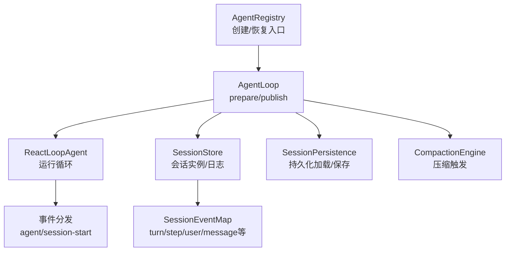
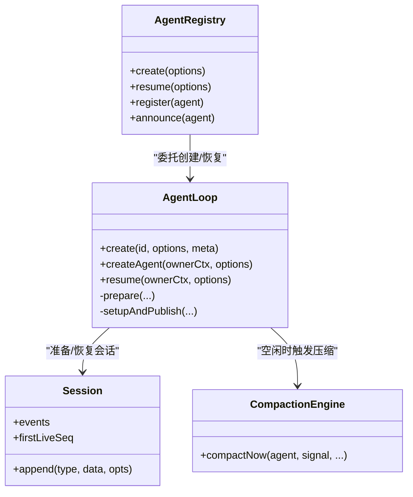

# Agent会话事件

<cite>
**本文引用的文件**
- [packages/core/agent/src/runtime-types.ts](file://packages/core/agent/src/runtime-types.ts)
- [packages/core/agent-loop/src/index.ts](file://packages/core/agent-loop/src/index.ts)
- [packages/core/agent/src/index.ts](file://packages/core/agent/src/index.ts)
- [packages/core/agent-loop/tests/interception.spec.ts](file://packages/core/agent-loop/tests/interception.spec.ts)
- [packages/core/agent-loop/tests/resume.spec.ts](file://packages/core/agent-loop/tests/resume.spec.ts)
- [packages/core/session/src/index.ts](file://packages/core/session/src/index.ts)
- [docs/subsystems/session.zh.md](file://docs/subsystems/session.zh.md)
- [packages/compaction/compaction-basic/src/index.ts](file://packages/compaction/compaction-basic/src/index.ts)
</cite>

## 目录
1. [简介](#简介)
2. [项目结构](#项目结构)
3. [核心组件](#核心组件)
4. [架构总览](#架构总览)
5. [详细组件分析](#详细组件分析)
6. [依赖关系分析](#依赖关系分析)
7. [性能考量](#性能考量)
8. [故障排查指南](#故障排查指南)
9. [结论](#结论)
10. [附录](#附录)

## 简介
本文件聚焦于Agent会话事件的完整说明，围绕 agent/session-start 会话启动事件展开，解释 SessionStartSource 类型及其不同来源（startup、resume、clear、compact），阐述会话生命周期与Agent生命周期的关系，提供监听与处理示例（含上下文注入与初始化逻辑），并说明会话恢复机制、数据持久化注意事项以及与其他子系统的事件集成方式。

## 项目结构
与Agent会话事件相关的核心代码分布在以下模块：
- 事件类型与Agent接口定义：@deepseek-ai/dsh-agent
- Agent循环与发布流程：@deepseek-ai/dsh-agent-loop
- 会话存储与事件日志：@deepseek-ai/dsh-session
- 压缩（Compaction）子系统：@deepseek-ai/dsh-compaction-*
- 文档与测试用例：docs 与 packages/*/tests



图表来源
- [packages/core/agent/src/index.ts:256-430](file://packages/core/agent/src/index.ts#L256-L430)
- [packages/core/agent-loop/src/index.ts:296-714](file://packages/core/agent-loop/src/index.ts#L296-L714)
- [packages/core/session/src/index.ts:417-448](file://packages/core/session/src/index.ts#L417-L448)
- [docs/subsystems/session.zh.md:20-125](file://docs/subsystems/session.zh.md#L20-L125)

章节来源
- [packages/core/agent/src/index.ts:256-430](file://packages/core/agent/src/index.ts#L256-L430)
- [packages/core/agent-loop/src/index.ts:296-714](file://packages/core/agent-loop/src/index.ts#L296-L714)
- [packages/core/session/src/index.ts:417-448](file://packages/core/session/src/index.ts#L417-L448)
- [docs/subsystems/session.zh.md:20-125](file://docs/subsystems/session.zh.md#L20-L125)

## 核心组件
- AgentRegistry：对外暴露 create/resume 能力，负责注册工厂、维护活跃Agent集合、发出 agent/created 与 agent/disposed。
- AgentLoop：具体实现Agent的创建、恢复、发布与生命周期管理；在 publish 阶段进入会话、宣布Agent、发出 agent/session-start，然后驱动循环。
- Session：事件溯源的会话对象，维护不可变事件日志、表面投影、请求头/路由元数据等。
- CompactionEngine：在空闲或压力条件下对会话历史进行压缩，产生 compaction/* 事件并入 SessionEventMap。

章节来源
- [packages/core/agent/src/index.ts:256-430](file://packages/core/agent/src/index.ts#L256-L430)
- [packages/core/agent-loop/src/index.ts:296-714](file://packages/core/agent-loop/src/index.ts#L296-L714)
- [packages/core/session/src/index.ts:417-448](file://packages/core/session/src/index.ts#L417-L448)
- [packages/compaction/compaction-basic/src/index.ts:360-394](file://packages/compaction/compaction-basic/src/index.ts#L360-L394)

## 架构总览
下图展示了从创建/恢复到发布、再到首次请求的调用序列，以及 agent/session-start 的发出时机与来源。

```mermaid
sequenceDiagram
participant Caller as "调用方"
participant Reg as "AgentRegistry"
participant Loop as "AgentLoop"
participant Sess as "SessionStore"
participant Pers as "SessionPersistence"
participant Agent as "ReactLoopAgent"
participant Events as "事件分发"
Caller->>Reg : create()/resume()
Reg->>Loop : createAgent()/resume()
alt 新建
Loop->>Sess : prepare(id, meta)
Loop->>Loop : prepare(ownerCtx, id, options, session)
Loop->>Events : announce(session), announce(agent)
Loop->>Events : emit('agent/session-start', {source : 'startup'})
else 恢复
Loop->>Pers : prepare(id, signal)
Loop->>Sess : fromRestore(loaded events/header)
Loop->>Loop : setupAndPublish(..., source : 'resume')
Loop->>Events : announce(session), announce(agent)
Loop->>Events : emit('agent/session-start', {source : 'resume'})
end
Note over Events : 随后驱动循环，进入首个turn/step
```

图表来源
- [packages/core/agent/src/index.ts:405-430](file://packages/core/agent/src/index.ts#L405-L430)
- [packages/core/agent-loop/src/index.ts:589-714](file://packages/core/agent-loop/src/index.ts#L589-L714)
- [packages/core/agent-loop/src/index.ts:556-570](file://packages/core/agent-loop/src/index.ts#L556-L570)

## 详细组件分析

### 会话启动事件 agent/session-start
- 事件含义：会话生命周期开始，位于首次turn之前，用于注入模型可见上下文或执行初始化。
- 参数：{ agent, source }，其中 source 为 SessionStartSource。
- 语义：通知型事件，不具否决权；若监听器中请求释放，会在驱动开始前再次检查存活。
- 来源区分：
  - startup：全新创建的会话（create/createAgent）。
  - resume：从持久化恢复的会话（resume）。
  - clear：清空工作区后重新开始的会话（由上层策略触发，见下方“会话恢复与持久化”）。
  - compact：压缩完成后恢复的会话（由压缩子系统触发，见下方“压缩与compact来源”）。

章节来源
- [packages/core/agent/src/runtime-types.ts:60-62](file://packages/core/agent/src/runtime-types.ts#L60-L62)
- [packages/core/agent/src/runtime-types.ts:207-217](file://packages/core/agent/src/runtime-types.ts#L207-L217)
- [packages/core/agent-loop/src/index.ts:556-570](file://packages/core/agent-loop/src/index.ts#L556-L570)
- [packages/core/agent-loop/tests/resume.spec.ts:258-286](file://packages/core/agent-loop/tests/resume.spec.ts#L258-L286)

### 监听与处理示例（上下文注入与初始化）
- 在 agent/session-start 监听器中通过 agent.inject() 注入模型可见上下文，该上下文将在第一次请求中被看到，并以插件来源记录，不会误标为用户消息。
- 抛出异常不会中止Agent构造，错误会被捕获并记录，Agent仍可继续运行。
- 典型用法：根据 source 分支执行不同的初始化逻辑（如 startup 时加载默认指令，resume 时恢复状态，compact/clear 时清理缓存）。

章节来源
- [packages/core/agent-loop/tests/interception.spec.ts:556-609](file://packages/core/agent-loop/tests/interception.spec.ts#L556-L609)
- [packages/core/agent/src/runtime-types.ts:207-217](file://packages/core/agent/src/runtime-types.ts#L207-L217)

### 会话生命周期与Agent生命周期关系
- 顺序：session/created → agent/created → agent/session-start → 驱动循环进入首个turn/step。
- 发布边界：setup 在发布前等待完成，commit 在发布前同步执行；任何失败都会回滚，确保观察者不会看到部分配置的世界。
- 销毁：agent/disposed 在驱动静默、作用域解绑之后、会话分离之前发出。

章节来源
- [packages/core/agent-loop/tests/resume.spec.ts:288-352](file://packages/core/agent-loop/tests/resume.spec.ts#L288-L352)
- [packages/core/agent/src/index.ts:450-576](file://packages/core/agent/src/index.ts#L450-L576)
- [packages/core/agent-loop/src/index.ts:497-570](file://packages/core/agent-loop/src/index.ts#L497-L570)

### 会话恢复机制与数据持久化注意事项
- 恢复路径：AgentLoop.resumeWith 通过 SessionPersistence.prepare 加载已持久化的会话，再经 setupAndPublish 以 source='resume' 发布。
- 首活边界：Session.firstLiveSeq 标记当前进程追加的起点；对于仅读/重放场景，使用 session/end-seed 事件定位种子历史结束位置。
- 完整性：load() 会补全未闭合的 turn 边界，保证日志平衡；prepare 仅在必要时提交修复，避免重复写入。
- 并发与幂等：fork/adopt 路径也会经过构造函数边界，确保能正确分类 compaction/start 等事件。

章节来源
- [packages/core/agent-loop/src/index.ts:653-714](file://packages/core/agent-loop/src/index.ts#L653-L714)
- [docs/subsystems/session.zh.md:20-125](file://docs/subsystems/session.zh.md#L20-L125)
- [packages/core/session/src/index.ts:417-448](file://packages/core/session/src/index.ts#L417-L448)

### 压缩与 compact 来源
- 压缩引擎在空闲或压力下选择可压缩范围，生成 compaction/* 事件并入 SessionEventMap，并在完成后可能以 source='compact' 触发 agent/session-start，以便订阅者感知压缩后的新会话状态。
- 压缩过程通过 runMaintenance 安全地占用空闲阶段，避免干扰正常对话流。

章节来源
- [packages/compaction/compaction-basic/src/index.ts:360-394](file://packages/compaction/compaction-basic/src/index.ts#L360-L394)
- [docs/subsystems/session.zh.md:20-125](file://docs/subsystems/session.zh.md#L20-L125)

### 与其他子系统的事件集成
- 系统提示变量：AgentLoop 将 provider、model、cwd 注入系统提示变量，供后续请求组装使用。
- 工具调用：tools/pre-execute/post-execute 等钩子可与 agent/session-start 配合，在会话启动时注入审计/策略上下文。
- 设置项：agent-loop 的设置项（如 maxParallelToolCalls）可在运行时动态调整，影响工具调用并行度。

章节来源
- [packages/core/agent-loop/src/index.ts:319-354](file://packages/core/agent-loop/src/index.ts#L319-L354)
- [packages/core/agent-loop/tests/interception.spec.ts:719-755](file://packages/core/agent-loop/tests/interception.spec.ts#L719-L755)

## 依赖关系分析


图表来源
- [packages/core/agent/src/index.ts:256-430](file://packages/core/agent/src/index.ts#L256-L430)
- [packages/core/agent-loop/src/index.ts:296-714](file://packages/core/agent-loop/src/index.ts#L296-L714)
- [packages/core/session/src/index.ts:417-448](file://packages/core/session/src/index.ts#L417-L448)
- [packages/compaction/compaction-basic/src/index.ts:360-394](file://packages/compaction/compaction-basic/src/index.ts#L360-L394)

章节来源
- [packages/core/agent/src/index.ts:256-430](file://packages/core/agent/src/index.ts#L256-L430)
- [packages/core/agent-loop/src/index.ts:296-714](file://packages/core/agent-loop/src/index.ts#L296-L714)
- [packages/core/session/src/index.ts:417-448](file://packages/core/session/src/index.ts#L417-L448)
- [packages/compaction/compaction-basic/src/index.ts:360-394](file://packages/compaction/compaction-basic/src/index.ts#L360-L394)

## 性能考量
- 事件追加与观察：Session.append 是热路径，异步持久化缓冲，不阻塞主流程；监听器失败被隔离记录，不影响后续事件。
- 恢复与修复：prepare/load 仅在必要时提交修复，避免重复写入；合成边界（如未闭合的 turn）在 load 时补齐，保证日志一致性。
- 压缩：在空闲阶段通过 runMaintenance 执行，避免抢占对话资源；压缩范围选择基于 token 计量与策略。

章节来源
- [packages/core/session/src/index.ts:417-448](file://packages/core/session/src/index.ts#L417-L448)
- [packages/compaction/compaction-basic/src/index.ts:360-394](file://packages/compaction/compaction-basic/src/index.ts#L360-L394)

## 故障排查指南
- 监听器抛错：agent/session-start 监听器抛出异常不会中止Agent构造，错误会被捕获并记录，Agent仍可运行。
- 恢复失败：resume 过程中若持久化加载或 setup 失败，不会发布任何事件，身份会被释放，可重试。
- 并发冲突：同一 exact identity 的并发 create/resume 会在注册边界拒绝重复；需确保唯一性。
- 日志不一致：若发现 turn 未闭合，检查 load/prepare 是否成功补齐；确认 compaction/* 事件是否按预期写入。

章节来源
- [packages/core/agent-loop/tests/interception.spec.ts:594-609](file://packages/core/agent-loop/tests/interception.spec.ts#L594-L609)
- [packages/core/agent-loop/tests/resume.spec.ts:370-424](file://packages/core/agent-loop/tests/resume.spec.ts#L370-L424)
- [packages/core/agent/src/index.ts:450-576](file://packages/core/agent/src/index.ts#L450-L576)

## 结论
agent/session-start 是Agent会话生命周期的关键扩展点，用于在首次请求前注入上下文与执行初始化。通过 SessionStartSource 明确区分了 startup、resume、clear、compact 四种来源，便于订阅者采取差异化策略。结合 Session 的事件溯源与持久化机制，系统在恢复、压缩、并发等场景下保持了强一致性与可观测性。建议在生产环境中充分利用该事件点进行策略注入、审计与监控，同时关注恢复与压缩带来的副作用与性能影响。

## 附录
- 事件类型参考：SessionEventMap 定义了会话日志中的各类事件（turn/start、turn/end、user/message、assistant/chunk、tool/call、tool/result、request/header/context、session/end-seed 等）。
- 最佳实践：
  - 在 agent/session-start 中根据 source 分支执行初始化，避免重复操作。
  - 使用 agent.inject() 注入模型可见上下文，并确保 source.kind 正确标识。
  - 对恢复路径做好幂等性设计，避免重复写入或状态漂移。
  - 关注压缩与清空后的会话状态变化，及时更新本地缓存或指标。

章节来源
- [docs/subsystems/session.zh.md:20-125](file://docs/subsystems/session.zh.md#L20-L125)
- [packages/core/agent-loop/tests/interception.spec.ts:556-609](file://packages/core/agent-loop/tests/interception.spec.ts#L556-L609)