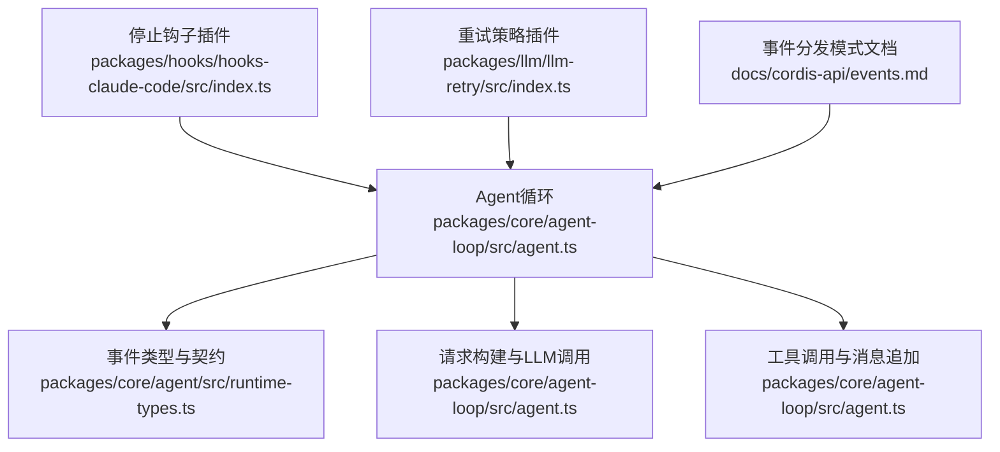
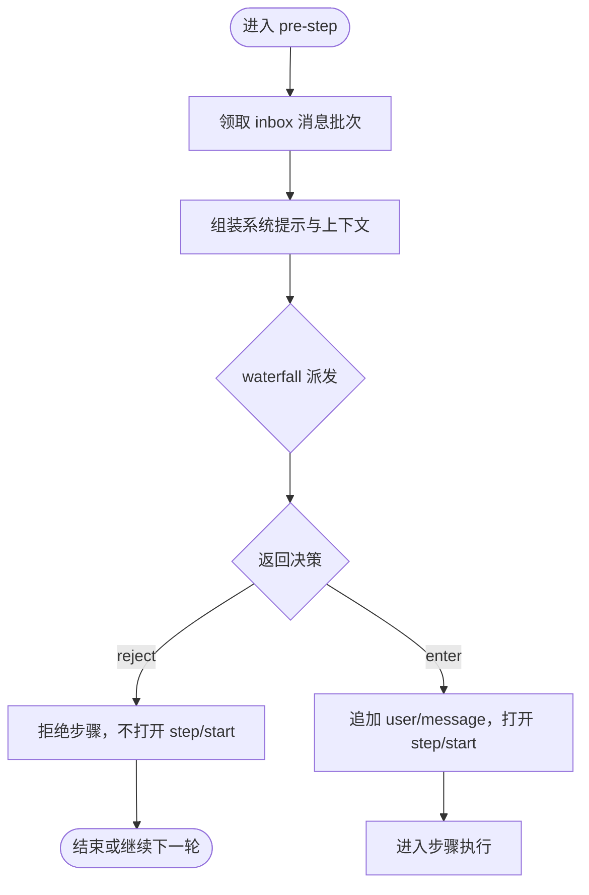
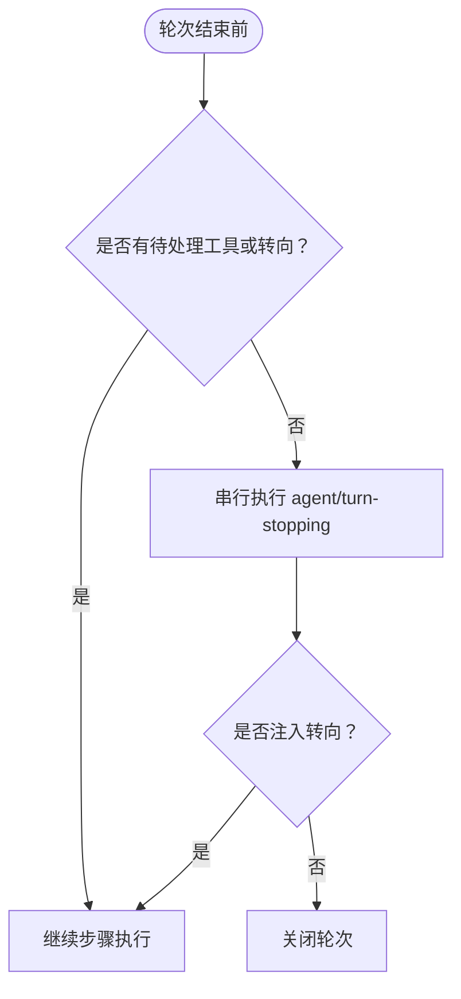
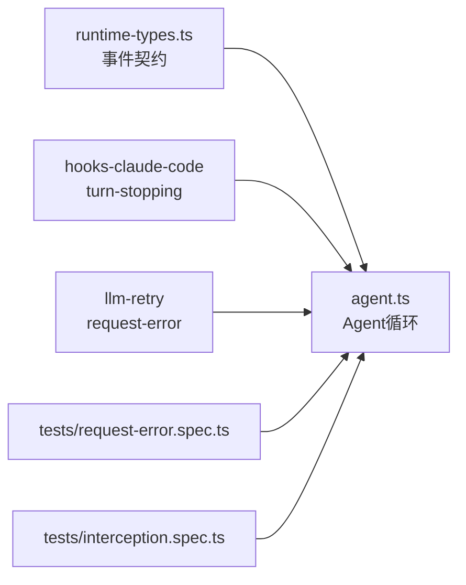

# Agent执行事件

<cite>
**本文引用的文件**
- [packages/core/agent/src/runtime-types.ts](file://packages/core/agent/src/runtime-types.ts)
- [packages/core/agent-loop/src/agent.ts](file://packages/core/agent-loop/src/agent.ts)
- [packages/hooks/hooks-claude-code/src/index.ts](file://packages/hooks/hooks-claude-code/src/index.ts)
- [packages/llm/llm-retry/src/index.ts](file://packages/llm/llm-retry/src/index.ts)
- [packages/core/agent-loop/tests/request-error.spec.ts](file://packages/core/agent-loop/tests/request-error.spec.ts)
- [packages/core/agent-loop/tests/interception.spec.ts](file://packages/core/agent-loop/tests/interception.spec.ts)
- [docs/cordis-api/events.md](file://docs/cordis-api/events.md)
- [docs/cordis-tutorial/04-events.zh.md](file://docs/cordis-tutorial/04-events.zh.md)
- [docs/subsystems/core.md](file://docs/subsystems/core.md)
</cite>

## 目录
1. [简介](#简介)
2. [项目结构](#项目结构)
3. [核心组件](#核心组件)
4. [架构总览](#架构总览)
5. [详细组件分析](#详细组件分析)
6. [依赖关系分析](#依赖关系分析)
7. [性能考量](#性能考量)
8. [故障排查指南](#故障排查指南)
9. [结论](#结论)
10. [附录](#附录)

## 简介
本文件聚焦于Agent执行流程中的关键扩展点与事件：agent/pre-step、agent/request、agent/request-error、agent/turn-stopping。我们将解释每个扩展点的触发时机、参数含义、返回值处理，并说明PreStepDecision、LlmCallConfig、RequestErrorAction等关键类型的使用方式。同时提供实现示例（步骤拒绝、请求配置修改、错误重试、轮次控制），并对比事件的水流模式（waterfall）与串行模式（serial）的差异。

## 项目结构
围绕Agent执行事件的核心代码分布在以下位置：
- 事件类型与契约定义：packages/core/agent/src/runtime-types.ts
- Agent循环驱动与事件派发：packages/core/agent-loop/src/agent.ts
- 具体插件实现示例（如停止钩子、重试策略）：packages/hooks/hooks-claude-code/src/index.ts、packages/llm/llm-retry/src/index.ts
- 测试用例验证行为边界：packages/core/agent-loop/tests/*.spec.ts
- 事件分发模式文档：docs/cordis-api/events.md、docs/cordis-tutorial/04-events.zh.md



**图表来源**
- [packages/core/agent-loop/src/agent.ts:225-300](file://packages/core/agent-loop/src/agent.ts#L225-L300)
- [packages/core/agent/src/runtime-types.ts:219-278](file://packages/core/agent/src/runtime-types.ts#L219-L278)
- [packages/hooks/hooks-claude-code/src/index.ts:267-277](file://packages/hooks/hooks-claude-code/src/index.ts#L267-L277)
- [packages/llm/llm-retry/src/index.ts:156-179](file://packages/llm/llm-retry/src/index.ts#L156-L179)
- [docs/cordis-api/events.md:193-208](file://docs/cordis-api/events.md#L193-L208)

**章节来源**
- [packages/core/agent/src/runtime-types.ts:219-278](file://packages/core/agent/src/runtime-types.ts#L219-L278)
- [packages/core/agent-loop/src/agent.ts:225-300](file://packages/core/agent-loop/src/agent.ts#L225-L300)
- [docs/cordis-api/events.md:193-208](file://docs/cordis-api/events.md#L193-L208)

## 核心组件
- Agent循环驱动：负责按轮次（turn）和步骤（step）推进执行，维护入队消息、系统提示组装、请求构建、LLM流式响应、工具调用以及事件派发。
- 事件类型与契约：定义了agent/pre-step、agent/request、agent/request-error、agent/turn-stopping的签名、参数、返回值及分发模式。
- 插件实现：
  - hooks-claude-code：在turn即将结束时注入“Stop”钩子，若被拒绝则通过steer强制继续。
  - llm-retry：监听request-error，根据策略进行退避重试，返回{ kind: 'retry' }以驱动重试。

**章节来源**
- [packages/core/agent/src/runtime-types.ts:219-278](file://packages/core/agent/src/runtime-types.ts#L219-L278)
- [packages/hooks/hooks-claude-code/src/index.ts:267-277](file://packages/hooks/hooks-claude-code/src/index.ts#L267-L277)
- [packages/llm/llm-retry/src/index.ts:156-179](file://packages/llm/llm-retry/src/index.ts#L156-L179)

## 架构总览
下图展示了Agent循环在一次轮次内的关键阶段与事件交汇点：pre-step决定进入或拒绝；request用于替换请求配置；request-error处理失败并可能重试；turn-stopping在轮次关闭前收集最终决策。

```mermaid
sequenceDiagram
participant Loop as "Agent循环"
participant PreStep as "agent/pre-step"
participant Request as "agent/request"
participant LLM as "LLM适配器"
participant Error as "agent/request-error"
participant Stop as "agent/turn-stopping"
Loop->>PreStep : "提议步骤(claimed messages, turn, step, signal)"
PreStep-->>Loop : "PreStepDecision(reject|enter with messages)"
alt 进入步骤
Loop->>Request : "构建请求(LlmCallConfig)"
Request-->>Loop : "LlmCallConfig(可替换)"
Loop->>LLM : "stream(request)"
alt 成功
LLM-->>Loop : "assistant/message + tool calls?"
Loop->>Stop : "轮次结束前检查"
Stop-->>Loop : "void"
else 失败
Loop->>Error : "failure, provider, retryPolicy, signal"
Error-->>Loop : "{kind : 'retry'} | undefined"
opt 重试
Loop->>LLM : "再次尝试"
end
end
else 拒绝步骤
Loop->>Stop : "轮次结束前检查"
Stop-->>Loop : "void"
end
```

**图表来源**
- [packages/core/agent-loop/src/agent.ts:225-300](file://packages/core/agent-loop/src/agent.ts#L225-L300)
- [packages/core/agent-loop/src/agent.ts:332-401](file://packages/core/agent-loop/src/agent.ts#L332-L401)
- [packages/core/agent/src/runtime-types.ts:219-278](file://packages/core/agent/src/runtime-types.ts#L219-L278)

## 详细组件分析

### agent/pre-step（瀑布式事件）
- 触发时机：每轮首次步骤前，以及工具调用后准备下一个步骤时。
- 参数：
  - agent：当前Agent实例
  - messages：从inbox中独占领取的消息批次
  - turn：所属轮次编号
  - step：步骤编号
  - signal：当前轮次的取消信号
- 返回值：PreStepDecision
  - reject：拒绝该步骤，不打开step/start，轮次可能因blocked而结束
  - enter：携带要追加到会话的消息列表，随后打开step/start并发送user/message
- 默认逻辑：若无拦截，将claimed消息与运行时上下文合并后进入步骤
- 典型用法：
  - 步骤拒绝：当检测到敏感内容或不符合策略时返回reject
  - 消息改写：在enter中插入额外上下文或调整消息顺序
  - 注入上下文：使用agent.inject()在不唤醒的情况下为后续步骤准备上下文



**图表来源**
- [packages/core/agent-loop/src/agent.ts:225-243](file://packages/core/agent-loop/src/agent.ts#L225-L243)
- [packages/core/agent-loop/src/agent.ts:263-281](file://packages/core/agent-loop/src/agent.ts#L263-L281)

**章节来源**
- [packages/core/agent/src/runtime-types.ts:219-231](file://packages/core/agent/src/runtime-types.ts#L219-L231)
- [packages/core/agent-loop/src/agent.ts:225-243](file://packages/core/agent-loop/src/agent.ts#L225-L243)
- [packages/core/agent-loop/tests/interception.spec.ts:365-400](file://packages/core/agent-loop/tests/interception.spec.ts#L365-L400)

### agent/request（瀑布式事件）
- 触发时机：每次构建模型请求之前，用于替换最终的LlmCallConfig。
- 参数：
  - agent：当前Agent实例
  - turn：轮次编号
  - step：步骤编号
  - signal：当前轮次的取消信号
- 返回值：LlmCallConfig
  - 可替换provider/model、maxTokens、reasoningEffort等
  - 注意：模型可见内容必须通过已记录通道（如user/message）添加，不能在此处直接修改消息
- 默认逻辑：首次请求使用AgentOptions，后续请求复用已记录的请求头
- 典型用法：
  - 动态切换模型或提供商
  - 基于上下文窗口或成本策略调整maxTokens
  - 注入请求级元数据（如sessionId、traceId）

```mermaid
sequenceDiagram
participant Loop as "Agent循环"
participant Req as "agent/request"
participant LLM as "LLM适配器"
Loop->>Req : "请求构建前(LlmCallConfig种子)"
Req-->>Loop : "LlmCallConfig(可替换)"
Loop->>LLM : "prepareCall(config)"
LLM-->>Loop : "preparedCall.config"
Loop->>Loop : "canonicalHeader(system/tools/config)"
Loop->>LLM : "stream(request)"
```

**图表来源**
- [packages/core/agent-loop/src/agent.ts:407-495](file://packages/core/agent-loop/src/agent.ts#L407-L495)
- [packages/core/agent/src/runtime-types.ts:232-244](file://packages/core/agent/src/runtime-types.ts#L232-L244)

**章节来源**
- [packages/core/agent/src/runtime-types.ts:232-244](file://packages/core/agent/src/runtime-types.ts#L232-L244)
- [packages/core/agent-loop/src/agent.ts:407-495](file://packages/core/agent-loop/src/agent.ts#L407-L495)

### agent/request-error（瀑布式事件）
- 触发时机：模型请求失败后，关闭当前步骤但尚未关闭轮次时。
- 参数：
  - agent：当前Agent实例
  - turn：轮次编号
  - step：步骤编号
  - provider：失败的提供商
  - failure：标准化的LlmFailure（包含message、code、可选status/providerRetryAfterMs/requestId）
  - retryPolicy：服务注册的不可变重试策略
  - signal：当前轮次的取消信号
- 返回值：RequestErrorAction
  - { kind: 'retry' }：表示拥有恢复权，循环将关闭失败轮次并开启一次重试轮次
  - undefined：委托给下游或保持失败为终态
- 默认逻辑：未处理则失败为终态，抛出LlmError
- 典型用法：
  - 指数退避重试（llm-retry插件）
  - 上下文溢出时的压缩策略
  - 鉴权失败时的凭据刷新
- 注意事项：
  - 仅在适配器边界归一化的终端失败才会进入此事件
  - 中间件或结果处理缺陷仍会抛出异常，不会进入此事件
  - 取消优先：若在恢复期间取消，重试将被忽略

```mermaid
sequenceDiagram
participant Loop as "Agent循环"
participant Err as "agent/request-error"
participant Retry as "重试策略"
Loop->>Err : "failure, provider, retryPolicy, signal"
alt 拥有恢复权
Err->>Retry : "await 恢复工作"
Retry-->>Err : "{kind : 'retry'}"
Err-->>Loop : "{kind : 'retry'}"
Loop->>Loop : "关闭失败轮次，开启重试轮次"
else 无恢复权
Err-->>Loop : "undefined"
Loop->>Loop : "抛出LlmError，轮次结束"
end
```

**图表来源**
- [packages/core/agent-loop/src/agent.ts:354-371](file://packages/core/agent-loop/src/agent.ts#L354-L371)
- [packages/llm/llm-retry/src/index.ts:156-179](file://packages/llm/llm-retry/src/index.ts#L156-L179)
- [packages/core/agent/src/runtime-types.ts:245-260](file://packages/core/agent/src/runtime-types.ts#L245-L260)

**章节来源**
- [packages/core/agent/src/runtime-types.ts:245-260](file://packages/core/agent/src/runtime-types.ts#L245-L260)
- [packages/core/agent-loop/src/agent.ts:354-371](file://packages/core/agent-loop/src/agent.ts#L354-L371)
- [packages/llm/llm-retry/src/index.ts:156-179](file://packages/llm/llm-retry/src/index.ts#L156-L179)
- [packages/core/agent-loop/tests/request-error.spec.ts:50-111](file://packages/core/agent-loop/tests/request-error.spec.ts#L50-L111)

### agent/turn-stopping（串行事件）
- 触发时机：轮次即将关闭时，当没有待处理的工具调用或转向输入（steering）。
- 参数：
  - agent：当前Agent实例
  - turn：轮次编号
  - signal：当前轮次的取消信号
- 返回值：void（串行等待所有监听器完成）
- 语义：数据决定终止，监听器顺序不影响结果；可通过steer注入新输入以继续步骤
- 典型用法：
  - 外部钩子（如Claude Code Stop）在轮次结束时决定是否强制继续
  - 审计或清理操作



**图表来源**
- [packages/core/agent-loop/src/agent.ts:295-300](file://packages/core/agent-loop/src/agent.ts#L295-L300)
- [packages/hooks/hooks-claude-code/src/index.ts:267-277](file://packages/hooks/hooks-claude-code/src/index.ts#L267-L277)
- [packages/core/agent/src/runtime-types.ts:261-278](file://packages/core/agent/src/runtime-types.ts#L261-L278)

**章节来源**
- [packages/core/agent/src/runtime-types.ts:261-278](file://packages/core/agent/src/runtime-types.ts#L261-L278)
- [packages/hooks/hooks-claude-code/src/index.ts:267-277](file://packages/hooks/hooks-claude-code/src/index.ts#L267-L277)
- [packages/core/agent-loop/src/agent.ts:295-300](file://packages/core/agent-loop/src/agent.ts#L295-L300)

## 依赖关系分析
- Agent循环依赖事件类型定义，并通过dispatch.waterfall和dispatch.serial派发事件。
- 插件通过ctx.on注册监听器，影响执行流程：
  - hooks-claude-code：在turn-stopping时注入steer，强制继续
  - llm-retry：在request-error时根据策略返回retry
- 测试用例验证了事件行为的边界条件，如取消优先、重试链式、步骤拒绝后的消息保留等。



**图表来源**
- [packages/core/agent/src/runtime-types.ts:219-278](file://packages/core/agent/src/runtime-types.ts#L219-L278)
- [packages/core/agent-loop/src/agent.ts:225-300](file://packages/core/agent-loop/src/agent.ts#L225-L300)
- [packages/hooks/hooks-claude-code/src/index.ts:267-277](file://packages/hooks/hooks-claude-code/src/index.ts#L267-L277)
- [packages/llm/llm-retry/src/index.ts:156-179](file://packages/llm/llm-retry/src/index.ts#L156-L179)
- [packages/core/agent-loop/tests/request-error.spec.ts:50-111](file://packages/core/agent-loop/tests/request-error.spec.ts#L50-L111)
- [packages/core/agent-loop/tests/interception.spec.ts:365-400](file://packages/core/agent-loop/tests/interception.spec.ts#L365-L400)

**章节来源**
- [packages/core/agent/src/runtime-types.ts:219-278](file://packages/core/agent/src/runtime-types.ts#L219-L278)
- [packages/core/agent-loop/src/agent.ts:225-300](file://packages/core/agent-loop/src/agent.ts#L225-L300)
- [packages/hooks/hooks-claude-code/src/index.ts:267-277](file://packages/hooks/hooks-claude-code/src/index.ts#L267-L277)
- [packages/llm/llm-retry/src/index.ts:156-179](file://packages/llm/llm-retry/src/index.ts#L156-L179)
- [packages/core/agent-loop/tests/request-error.spec.ts:50-111](file://packages/core/agent-loop/tests/request-error.spec.ts#L50-L111)
- [packages/core/agent-loop/tests/interception.spec.ts:365-400](file://packages/core/agent-loop/tests/interception.spec.ts#L365-L400)

## 性能考量
- waterfall模式适合拦截和转换，监听器需显式调用next()，避免遗漏下游处理。
- serial模式适合有序检查点，确保所有监听器按序完成后再继续。
- 在request-error中，重试策略应避免无限重试，结合signal检查取消状态。
- 在pre-step中，避免频繁注入大量上下文，以免增加token压力。

[本节提供一般性指导，无需特定文件分析]

## 故障排查指南
- 步骤被拒绝：检查pre-step监听器是否正确返回enter或reject，确认messages内容是否符合策略。
- 请求配置未生效：确认request监听器是否正确返回LlmCallConfig，并确保provider/model已设置。
- 重试未触发：检查request-error监听器是否返回{kind:'retry'}，并确认retryPolicy是否允许重试。
- 轮次未关闭：检查turn-stopping监听器是否意外注入steer，导致轮次继续。

**章节来源**
- [packages/core/agent-loop/tests/request-error.spec.ts:50-111](file://packages/core/agent-loop/tests/request-error.spec.ts#L50-L111)
- [packages/core/agent-loop/tests/interception.spec.ts:365-400](file://packages/core/agent-loop/tests/interception.spec.ts#L365-L400)

## 结论
Agent执行事件提供了灵活的扩展点，允许在步骤前、请求构建、错误处理和轮次结束时进行干预。通过理解PreStepDecision、LlmCallConfig、RequestErrorAction等类型，以及waterfall和serial模式的差异，可以构建健壮且可定制的Agent执行流程。

[本节总结发现与建议，无需特定文件分析]

## 附录

### 关键类型说明
- PreStepDecision：决定步骤是否进入及进入时的消息列表
- LlmCallConfig：模型请求的配置对象，可替换provider/model/maxTokens等
- RequestErrorAction：错误处理动作，{kind:'retry'}表示重试

**章节来源**
- [packages/core/agent/src/runtime-types.ts:52-58](file://packages/core/agent/src/runtime-types.ts#L52-L58)
- [docs/subsystems/core.md:211-235](file://docs/subsystems/core.md#L211-L235)

### 事件分发模式对比
- waterfall：监听器可转换或短路，必须调用next()传递下游结果
- serial：监听器按序执行并等待，第一个非空返回值终止后续执行

**章节来源**
- [docs/cordis-api/events.md:193-208](file://docs/cordis-api/events.md#L193-L208)
- [docs/cordis-tutorial/04-events.zh.md:94-136](file://docs/cordis-tutorial/04-events.zh.md#L94-L136)