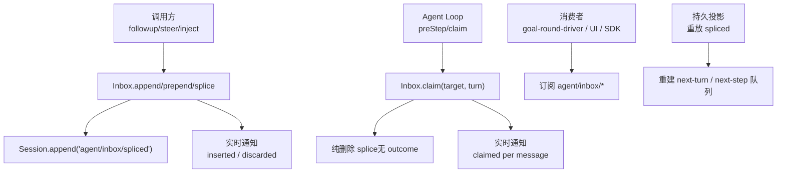
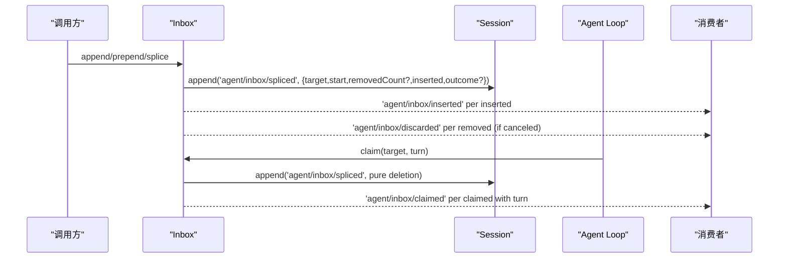
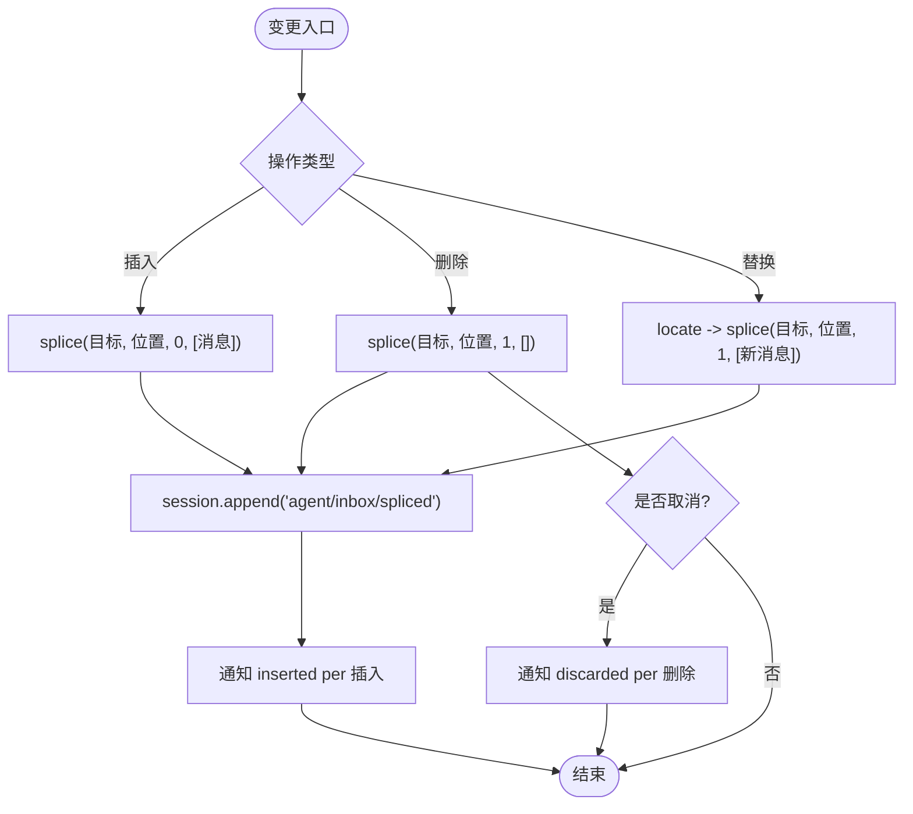
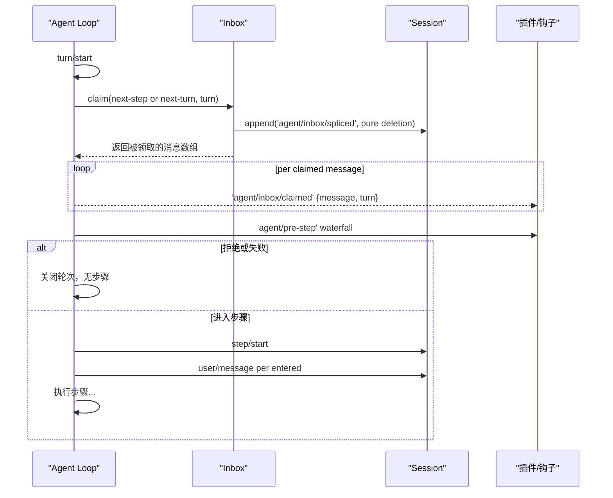
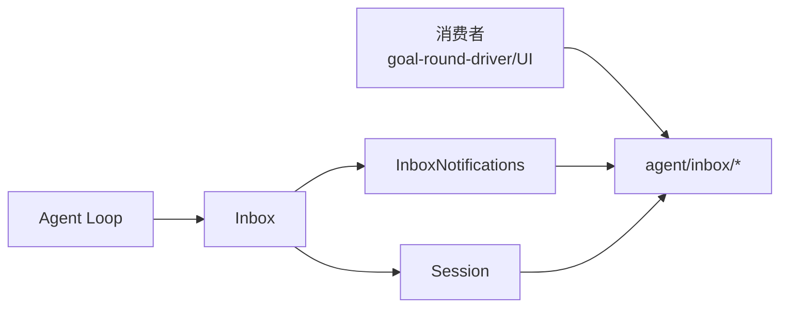

# Agent收件箱事件

<cite>
**本文引用的文件**
- [packages/core/agent/src/inbox.ts](file://packages/core/agent/src/inbox.ts)
- [packages/core/agent/src/types.ts](file://packages/core/agent/src/types.ts)
- [packages/core/agent-loop/src/agent.ts](file://packages/core/agent-loop/src/agent.ts)
- [packages/goal/goal-round-driver/src/index.ts](file://packages/goal/goal-round-driver/src/index.ts)
- [packages/core/agent-loop/tests/agent.spec.ts](file://packages/core/agent-loop/tests/agent.spec.ts)
- [docs/agent-lifecycle.md](file://docs/agent-lifecycle.md)
- [docs/event-producer-consumer.md](file://docs/event-producer-consumer.md)
</cite>

## 目录
1. [简介](#简介)
2. [项目结构](#项目结构)
3. [核心组件](#核心组件)
4. [架构总览](#架构总览)
5. [详细组件分析](#详细组件分析)
6. [依赖关系分析](#依赖关系分析)
7. [性能与并发](#性能与并发)
8. [故障排查](#故障排查)
9. [结论](#结论)
10. [附录：监听与处理示例](#附录监听与处理示例)

## 简介
本文件系统性说明 Agent 收件箱（Inbox）事件模型与消息生命周期，覆盖插入、认领与丢弃三类事件：agent/inbox/inserted、agent/inbox/claimed、agent/inbox/discarded。文档解释 InboxTarget 类型与消息路由机制，给出事件监听与处理的实践要点，包括优先级管理、并发策略以及与会话生命周期的集成方式。

## 项目结构
Agent 收件箱由持久化会话事件与实时通知共同构成：
- 持久投影：通过 session 事件 agent/inbox/spliced 记录所有变更坐标（目标列表、起始位置、删除数量、插入消息、取消结果）。
- 实时通知：对每条插入发出 agent/inbox/inserted；普通删除发出 agent/inbox/discarded；在步骤边界原子领取时发出 agent/inbox/claimed。

图表来源
- [packages/core/agent/src/inbox.ts:157-192](file://packages/core/agent/src/inbox.ts#L157-L192)
- [packages/core/agent/src/types.ts:12-27](file://packages/core/agent/src/types.ts#L12-L27)
- [packages/core/agent-loop/src/agent.ts:250-330](file://packages/core/agent-loop/src/agent.ts#L250-L330)

章节来源
- [packages/core/agent/src/inbox.ts:1-40](file://packages/core/agent/src/inbox.ts#L1-L40)
- [packages/core/agent/src/types.ts:1-28](file://packages/core/agent/src/types.ts#L1-L28)
- [packages/core/agent-loop/src/agent.ts:250-330](file://packages/core/agent-loop/src/agent.ts#L250-L330)

## 核心组件
- InboxTarget：定义两条有序待处理消息列表的目标标识 next-turn 与 next-step。
- Inbox：维护两份 UserMessage[] 的增量投影，提供 append/prepend/splice/replace/remove/clear/claim 等能力，并通过 Session 持久化每次变更。
- 事件契约：
  - agent/inbox/spliced：规范化变更坐标，包含 target、start、removedCount、inserted、outcome（取消时为 canceled）。
  - agent/inbox/inserted：单条插入的实时通知。
  - agent/inbox/discarded：普通删除的实时通知。
  - agent/inbox/claimed：步骤边界原子领取时的实时通知，附带所属 turn。

章节来源
- [packages/core/agent/src/types.ts:9-27](file://packages/core/agent/src/types.ts#L9-L27)
- [packages/core/agent/src/inbox.ts:14-22](file://packages/core/agent/src/inbox.ts#L14-L22)
- [packages/core/agent/src/inbox.ts:139-192](file://packages/core/agent/src/inbox.ts#L139-L192)

## 架构总览
收件箱事件遵循“一份持久投影 + 三种最小实时通知”的设计：
- 所有插入、编辑、移除、取消与领取都记录为规范的 spliced 坐标。
- 插入发出 inserted；普通删除携带 outcome: canceled 并发出 discarded；原子领取发出 claimed。
- MessageId 是单条消息的唯一出现标识，跨两个待处理列表保持唯一。
- 实时载荷不重复 placement/outcome/batch 等元数据，这些事实由持久 splice 持有。

图表来源
- [packages/core/agent/src/inbox.ts:157-192](file://packages/core/agent/src/inbox.ts#L157-L192)
- [packages/core/agent-loop/src/agent.ts:250-330](file://packages/core/agent-loop/src/agent.ts#L250-L330)

章节来源
- [docs/agent-lifecycle.md:8-72](file://docs/agent-lifecycle.md#L8-L72)
- [docs/event-producer-consumer.md:15-17](file://docs/event-producer-consumer.md#L15-L17)

## 详细组件分析

### InboxTarget 与消息路由
- next-turn：等待单个轮次处理的提示词队列。
- next-step：等待下一步边界的输入队列。
- 路由语义：
  - followup 追加到 next-turn 并唤醒驱动器。
  - steer 与 inject 均追加到 next-step；steer 会唤醒驱动器，inject 不会。
  - 在轮次边界，驱动器先打开持久 turn/start，再原子领取 next-step 全部消息以及一条 next-turn 消息；步骤之间仅领取 next-step。

章节来源
- [packages/core/agent/src/types.ts:9-10](file://packages/core/agent/src/types.ts#L9-L10)
- [packages/core/agent-loop/src/agent.ts:250-330](file://packages/core/agent-loop/src/agent.ts#L250-L330)

### 消息生命周期：插入、认领、丢弃
- 插入：append/prepend/splice 提交 spliced 后，对每条插入消息发出 inserted。
- 丢弃：普通 remove/splice 删除时，若带取消语义则 outcome 为 canceled，并发出 discarded。
- 认领：claim 执行纯删除 splice（无 outcome），随后对每条被领取的消息发出 claimed，并附带所属 turn。

图表来源
- [packages/core/agent/src/inbox.ts:139-192](file://packages/core/agent/src/inbox.ts#L139-L192)

章节来源
- [packages/core/agent/src/inbox.ts:80-126](file://packages/core/agent/src/inbox.ts#L80-L126)
- [packages/core/agent/src/inbox.ts:157-192](file://packages/core/agent/src/inbox.ts#L157-L192)

### 步骤边界与认领流程
- preStep 前，循环调用 Inbox.claim(target, turn) 原子移除完整批次：
  - 总是移除 next-step 的全部消息。
  - 当 target 为 next-turn 时，额外移除一条 next-turn 消息。
- 领取记录为不带 outcome 的纯删除 splice，随后对每条消息发出 claimed{message, turn}。
- 若 preStep 拒绝或失败，已领取批次保持已删除，轮次关闭且不产生步骤事件。

图表来源
- [packages/core/agent-loop/src/agent.ts:250-330](file://packages/core/agent-loop/src/agent.ts#L250-L330)
- [packages/core/agent/src/inbox.ts:71-78](file://packages/core/agent/src/inbox.ts#L71-L78)

章节来源
- [packages/core/agent-loop/src/agent.ts:250-330](file://packages/core/agent-loop/src/agent.ts#L250-L330)
- [docs/agent-lifecycle.md:24-67](file://docs/agent-lifecycle.md#L24-L67)

### 事件生产者与消费者
- 生产者：agent-loop 在步骤边界 emit claimed；Inbox 在变更时 emit inserted/discarded。
- 消费者：goal-round-driver、subagent、tool-jobs、UI 队列投影等订阅相应事件以驱动状态机或界面更新。

章节来源
- [docs/event-producer-consumer.md:15-17](file://docs/event-producer-consumer.md#L15-L17)

## 依赖关系分析
- Inbox 依赖 Session 写入持久事件，并通过 InboxNotifications 回调向外部发布实时事件。
- Agent Loop 依赖 Inbox 的 claim 进行步骤边界协调，并在 preStep 前后控制轮次与步骤。
- 消费者通过 ctx.on 订阅 agent/inbox/* 事件，实现业务逻辑与 UI 同步。

图表来源
- [packages/core/agent/src/inbox.ts:14-22](file://packages/core/agent/src/inbox.ts#L14-L22)
- [packages/core/agent/src/inbox.ts:157-192](file://packages/core/agent/src/inbox.ts#L157-L192)
- [packages/core/agent-loop/src/agent.ts:250-330](file://packages/core/agent-loop/src/agent.ts#L250-L330)

章节来源
- [packages/core/agent/src/inbox.ts:14-22](file://packages/core/agent/src/inbox.ts#L14-L22)
- [packages/core/agent-loop/src/agent.ts:250-330](file://packages/core/agent-loop/src/agent.ts#L250-L330)

## 性能与并发
- 持久优先：所有变更先写入 session 事件，再更新内存投影，保证观察者可基于 splice 坐标重建变化。
- 原子领取：claim 一次性移除整批 next-step 与可选的一条 next-turn，避免竞态。
- 去重校验：validate 确保 MessageId 在两个列表间唯一，防止重复投递。
- 建议：
  - 批量插入使用 splice 而非多次 append，减少事件与锁竞争。
  - 高并发场景下，尽量将插入合并到同一 splice，降低持久化开销。
  - 对高频消费端（如 UI 队列）优先消费持久 spliced 流，保证一致性。

[本节为通用指导，无需特定文件引用]

## 故障排查
- 无效 splice：replay 阶段遇到非法 start/removedCount 或越界会抛出错误，需检查历史事件一致性。
- 重复 MessageId：替换或插入导致重复时会抛错，应确保生成稳定且唯一的消息标识。
- 丢失事件：若未收到 claimed/discarded，检查是否在正确的 agent 实例上订阅，或确认事件源是否为该 agent。
- 轮次未推进：若 preStep 拒绝或失败，轮次可能关闭而无步骤事件，需检查拦截器返回值与异常路径。

章节来源
- [packages/core/agent/src/inbox.ts:195-219](file://packages/core/agent/src/inbox.ts#L195-L219)
- [packages/core/agent-loop/tests/agent.spec.ts:53-83](file://packages/core/agent-loop/tests/agent.spec.ts#L53-L83)

## 结论
Agent 收件箱通过“持久 spliced + 最小实时通知”实现了强一致、低耦合的消息生命周期管理。next-turn 与 next-step 的双队列设计清晰分离了轮次级与步骤级输入，配合原子领取与严格去重，保障了高并发下的正确性与可观测性。插件与 UI 可通过统一的事件接口可靠地构建状态机与界面投影。

[本节为总结，无需特定文件引用]

## 附录：监听与处理示例
以下示例展示如何订阅并处理收件箱事件，涵盖优先级管理与并发策略。

- 基本监听模式
  - 订阅 agent/inbox/inserted：用于追踪新插入消息，可用于入队显示或优先级排序。
  - 订阅 agent/inbox/claimed：用于标记消息已被当前轮次/步骤独占处理，可更新 UI 状态。
  - 订阅 agent/inbox/discarded：用于清理 UI 或取消后台任务。

- 优先级管理
  - 使用 prepend 将高优先级消息插入 next-step 头部，使其在步骤边界优先被领取。
  - 对于 next-turn，通常使用 append 保持 FIFO；必要时可用 splice 调整顺序。

- 并发处理策略
  - 在 goal-round-driver 中，根据 inserted/claimed/discarded 更新尝试状态（如 competingQueued、stale、cancelled），避免重复处理相同内容。
  - 对高频插入场景，合并为一次 splice，减少事件风暴。

- 与会话生命周期集成
  - 在 turn/start 之后、preStep 之前，循环会原子领取并广播 claimed；消费者可据此判断消息归属的 turn。
  - 若 preStep 拒绝，已领取消息保持已删除，轮次关闭；后续插入等待下一边界。

章节来源
- [packages/goal/goal-round-driver/src/index.ts:284-305](file://packages/goal/goal-round-driver/src/index.ts#L284-L305)
- [packages/core/agent-loop/tests/agent.spec.ts:53-83](file://packages/core/agent-loop/tests/agent.spec.ts#L53-L83)
- [docs/agent-lifecycle.md:24-67](file://docs/agent-lifecycle.md#L24-L67)