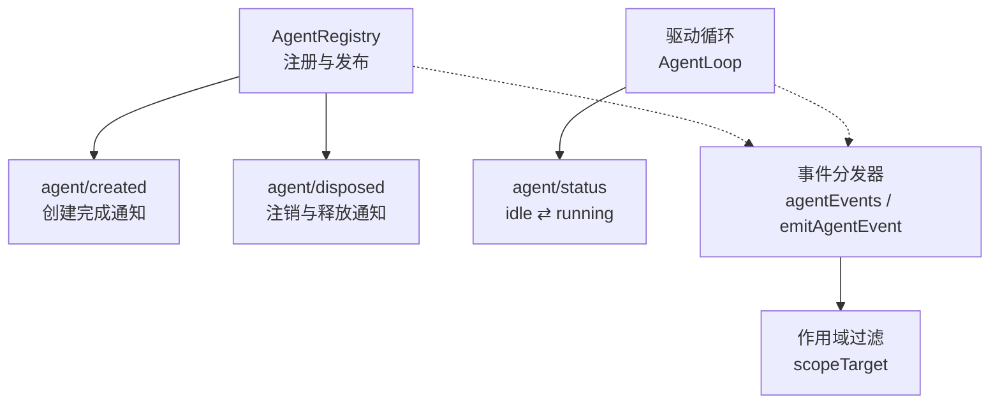
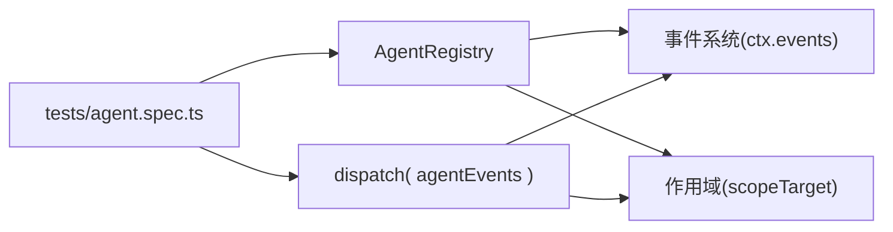

# Agent生命周期事件

<cite>
**本文引用的文件**
- [packages/core/agent/src/runtime-types.ts](file://packages/core/agent/src/runtime-types.ts)
- [packages/core/agent/src/index.ts](file://packages/core/agent/src/index.ts)
- [packages/core/agent/src/dispatch.ts](file://packages/core/agent/src/dispatch.ts)
- [packages/core/scope/src/index.ts](file://packages/core/scope/src/index.ts)
- [packages/core/agent/tests/agent.spec.ts](file://packages/core/agent/tests/agent.spec.ts)
- [docs/agent-lifecycle.zh.md](file://docs/agent-lifecycle.zh.md)
</cite>

## 目录
1. [简介](#简介)
2. [项目结构](#项目结构)
3. [核心组件](#核心组件)
4. [架构总览](#架构总览)
5. [详细组件分析](#详细组件分析)
6. [依赖关系分析](#依赖关系分析)
7. [性能考虑](#性能考虑)
8. [故障排查指南](#故障排查指南)
9. [结论](#结论)

## 简介
本文聚焦 Agent 的核心生命周期事件：agent/created、agent/disposed、agent/status。我们将解释每个事件的触发时机、参数结构、处理流程，以及 AgentOptions、AgentStatus 类型定义与状态转换机制。同时给出监听器实现的最佳实践（错误处理与资源清理），并说明事件的作用域过滤机制与性能考量。

## 项目结构
围绕 Agent 生命周期事件的关键代码集中在 agent 包中：
- 类型与事件声明：runtime-types.ts
- 注册表与生命周期编排：index.ts（AgentRegistry）
- 事件分发与作用域载体：dispatch.ts（agentEvents、agentCarrier、emitAgentEvent）
- 作用域过滤实现：scope/src/index.ts（scopeTarget）
- 行为验证与边界用例：tests/agent.spec.ts
- 轮次与步骤生命周期时序参考：docs/agent-lifecycle.zh.md



图表来源
- [packages/core/agent/src/index.ts:450-576](file://packages/core/agent/src/index.ts#L450-L576)
- [packages/core/agent/src/dispatch.ts:107-149](file://packages/core/agent/src/dispatch.ts#L107-L149)
- [packages/core/scope/src/index.ts:158-185](file://packages/core/scope/src/index.ts#L158-L185)

章节来源
- [packages/core/agent/src/runtime-types.ts:24-50](file://packages/core/agent/src/runtime-types.ts#L24-L50)
- [packages/core/agent/src/index.ts:256-576](file://packages/core/agent/src/index.ts#L256-L576)
- [packages/core/agent/src/dispatch.ts:1-177](file://packages/core/agent/src/dispatch.ts#L1-L177)
- [packages/core/scope/src/index.ts:158-185](file://packages/core/scope/src/index.ts#L158-L185)
- [docs/agent-lifecycle.zh.md:1-85](file://docs/agent-lifecycle.zh.md#L1-L85)

## 核心组件
- AgentOptions：创建 Agent 时的可选配置，包含 provider、model、maxTokens。
- AgentStatus：Agent 的运行时活动状态，仅包含 idle 与 running；dispose 不属于 AgentStatus，而是注册表生命周期边界。
- AgentRegistry：维护已注册 Agent 的集合，负责 enter/announce/register 等有序生命周期操作，并在合适时机发出 agent/created 与 agent/disposed。
- agentEvents/emitAgentEvent：将 Agent 作为事件主体注入到 payload.agent，并通过 scopeTarget 绑定作用域，确保事件按 Agent 作用域路由。
- scopeTarget：构建 Scoped 接收器，基于作用域键与祖先链进行过滤，使“属于某 Agent 的事件”只被该 Agent 及其祖先上下文中的监听器收到。

章节来源
- [packages/core/agent/src/runtime-types.ts:24-50](file://packages/core/agent/src/runtime-types.ts#L24-L50)
- [packages/core/agent/src/index.ts:450-576](file://packages/core/agent/src/index.ts#L450-L576)
- [packages/core/agent/src/dispatch.ts:94-149](file://packages/core/agent/src/dispatch.ts#L94-L149)
- [packages/core/scope/src/index.ts:158-185](file://packages/core/scope/src/index.ts#L158-L185)

## 架构总览
Agent 的生命周期由“注册表 + 驱动循环 + 事件分发”三部分协作完成：
- 创建阶段：工厂准备 Agent 与 Session，调用 AgentRegistry.enter 插入未发布的条目，再调用 announce 发出 agent/created。若同步监听器抛出异常，则回滚并发布 agent/disposed 配对。
- 运行阶段：驱动循环在唤醒输入时进入 running，并在空闲时回到 idle，通过 agent/status 广播状态变化。
- 销毁阶段：当所有者释放或进程卸载时，注册表移除条目并发出 agent/disposed。

```mermaid
sequenceDiagram
participant Owner as "所有者"
participant Reg as "AgentRegistry"
participant Loop as "驱动循环"
participant Ev as "事件分发"
Owner->>Reg : enter(agent, owner)
Reg-->>Owner : detach()
Owner->>Reg : announce(agent)
Reg->>Ev : emit("agent/created", {agent})
Note over Reg,Ev : 同步失败会回滚并配对 disposed
Loop->>Ev : emit("agent/status", {agent, status : "running"})
Loop->>Ev : emit("agent/status", {agent, status : "idle"})
Owner->>Reg : detach()
Reg->>Ev : emit("agent/disposed", {agent})
```

图表来源
- [packages/core/agent/src/index.ts:450-576](file://packages/core/agent/src/index.ts#L450-L576)
- [packages/core/agent/src/index.ts:527-540](file://packages/core/agent/src/index.ts#L527-L540)
- [docs/agent-lifecycle.zh.md:10-74](file://docs/agent-lifecycle.zh.md#L10-L74)

## 详细组件分析

### 事件：agent/created
- 触发时机：Agent 与 Session 已完成全部 setup，且即将对外可见时。
- 参数结构：payload.agent 为刚注册的 Agent 实例。
- 处理流程：
  - 注册表先标记 announcing/announced，再使用作用域载体派发事件。
  - 同步监听器抛错会阻止发布并回滚（不会保留该 Agent）。
  - 异步监听器拒绝会被捕获并记录警告，不影响后续监听器执行。
  - 若在创建派发期间请求 detach，将在派发结束后延迟执行，保证所有创建监听器都看到稳定入口。
- 最佳实践：
  - 在 created 中做一次性初始化（如订阅会话事件、建立外部连接）。
  - 避免阻塞或长时间计算；耗时逻辑应放入后台任务或维护任务。
  - 对异步监听器的拒绝进行 try/catch 或日志记录，避免静默失败。

章节来源
- [packages/core/agent/src/index.ts:549-576](file://packages/core/agent/src/index.ts#L549-L576)
- [packages/core/agent/tests/agent.spec.ts:221-232](file://packages/core/agent/tests/agent.spec.ts#L221-L232)
- [packages/core/agent/tests/agent.spec.ts:234-256](file://packages/core/agent/tests/agent.spec.ts#L234-L256)

### 事件：agent/disposed
- 触发时机：Agent 从注册表中移除时，发生在驱动退出与 scoped-registration 展开之后、Session 解绑之前。
- 参数结构：payload.agent 为即将被移除的 Agent。
- 处理流程：
  - 注册表删除条目后，若已 announced，则派发 agent/disposed。
  - 监听器同步抛错或异步拒绝均被捕获并记录警告，不中断其他监听器。
- 最佳实践：
  - 用于资源清理（关闭连接、取消定时器、释放句柄）。
  - 不要在此处发起新的长耗时 I/O；如需持久化，尽量提前或在 whenIdle 中完成。
  - 注意幂等性：多次 dispose 调用需安全。

章节来源
- [packages/core/agent/src/index.ts:511-540](file://packages/core/agent/src/index.ts#L511-L540)
- [packages/core/agent/tests/agent.spec.ts:234-256](file://packages/core/agent/tests/agent.spec.ts#L234-L256)

### 事件：agent/status
- 触发时机：驱动在唤醒输入后进入 running；当无活跃驱动或维护任务时回到 idle。
- 参数结构：payload.agent 与 payload.status（'idle' | 'running'）。
- 状态转换机制：
  - AgentStatus 仅表示活动态，不包含 dispose；dispose 是注册表生命周期边界。
  - 驱动在 claim 可取消的 pre-step 前即进入 running，直到 turn 关闭或检查点完成。
- 最佳实践：
  - 用于 UI 显示、指标上报、节流控制。
  - 避免在 status 监听器中做重计算；必要时缓存或去抖。
  - 注意：status 为实时协调接口，非持久转录数据；需要回放事实请消费 session/event。

章节来源
- [packages/core/agent/src/runtime-types.ts:43-50](file://packages/core/agent/src/runtime-types.ts#L43-L50)
- [docs/agent-lifecycle.zh.md:21-74](file://docs/agent-lifecycle.zh.md#L21-L74)

### AgentOptions 与 AgentStatus 类型
- AgentOptions：
  - provider：模型提供方路由（调用时需有适配器）。
  - model：提供方解释的模型标识。
  - maxTokens：每次对话模型请求的最大输出 token。
- AgentStatus：
  - 'idle'：无驱动活跃。
  - 'running'：驱动正在处理唤醒输入、步骤、关闭或检查点。

章节来源
- [packages/core/agent/src/runtime-types.ts:24-50](file://packages/core/agent/src/runtime-types.ts#L24-L50)

### 作用域过滤机制
- 事件主体与范围绑定：
  - agentEvents/emitAgentEvent 将 agent 注入 payload.agent，并使用 agentCarrier 构造 Scoped 载体。
  - scopeTarget 根据作用域键与祖先链决定哪些监听器能收到事件：事件沿作用域链向上流动，子作用域无法收到父作用域的过滤排除。
- 效果：
  - 关于 Agent A 的事件会被 A 及其祖先上下文的监听器收到，不会被兄弟 Agent B 的监听器收到。
  - 无 Agent 主体的事件仅到达全局监听器。

章节来源
- [packages/core/agent/src/dispatch.ts:94-149](file://packages/core/agent/src/dispatch.ts#L94-L149)
- [packages/core/scope/src/index.ts:158-185](file://packages/core/scope/src/index.ts#L158-L185)

### 监听器实现示例与最佳实践
- 基本模式：
  - 在 agent/created 中完成一次性初始化。
  - 在 agent/status 中更新 UI/指标。
  - 在 agent/disposed 中释放资源。
- 错误处理：
  - 同步抛错会阻断同批次后续监听器（如 created 同步失败会回滚）。
  - 异步拒绝会被捕获并记录警告，不会传播给调用方。
- 资源清理：
  - 使用 whenIdle 等待当前活动收敛后再做收尾。
  - 避免在 dispose 中启动新任务；如需持久化，提前安排。

章节来源
- [packages/core/agent/tests/agent.spec.ts:221-256](file://packages/core/agent/tests/agent.spec.ts#L221-L256)
- [packages/core/agent/src/runtime-types.ts:87-104](file://packages/core/agent/src/runtime-types.ts#L87-L104)

## 依赖关系分析
- AgentRegistry 依赖：
  - Cordis Context/Service/Fiber 生命周期管理。
  - dsh-scope 的作用域过滤能力。
  - 事件系统（ctx.events.dispatch）进行 emit/serial/waterfall。
- dispatch 层：
  - 提供 agentEvents 与 emitAgentEvent，统一注入 agent 主体与作用域载体。
- 测试覆盖：
  - 验证了创建 veto、异步拒绝、dispose 监听器异常、重复 announce 保护、延迟 detach 等行为。



图表来源
- [packages/core/agent/src/index.ts:256-576](file://packages/core/agent/src/index.ts#L256-L576)
- [packages/core/agent/src/dispatch.ts:107-149](file://packages/core/agent/src/dispatch.ts#L107-L149)
- [packages/core/agent/tests/agent.spec.ts:178-310](file://packages/core/agent/tests/agent.spec.ts#L178-L310)

章节来源
- [packages/core/agent/src/index.ts:256-576](file://packages/core/agent/src/index.ts#L256-L576)
- [packages/core/agent/src/dispatch.ts:1-177](file://packages/core/agent/src/dispatch.ts#L1-L177)
- [packages/core/agent/tests/agent.spec.ts:178-310](file://packages/core/agent/tests/agent.spec.ts#L178-L310)

## 性能考虑
- 事件分发：
  - emit 模式下，每个监听器独立 try/catch 与 Promise 捕获，避免单点失败影响整体。
  - serial 与 waterfall 用于需要顺序或中间件语义的场景，谨慎使用以避免串行瓶颈。
- 作用域过滤：
  - scopeTarget 是无状态的过滤器，复用 carrier 可减少分配（agentEvents 支持传入预构建 carrier）。
- 状态变更：
  - agent/status 频繁触发，监听器应保持轻量；UI 渲染建议合并或去抖。
- 资源清理：
  - 在 dispose 中避免阻塞；必要时使用 whenIdle 等待收敛。

[本节为通用指导，无需特定文件引用]

## 故障排查指南
- 常见问题定位：
  - 创建被否决：检查 agent/created 同步监听器是否抛错；确认回滚后没有残留状态。
  - 异步拒绝未生效：确认监听器返回 Promise 且未被吞掉；查看日志中的 rejected 警告。
  - 重复 announce：确保 enter 与 announce 成对且唯一；避免重入。
  - 状态不一致：确认驱动正确切换 running/idle；避免在 status 监听器中做重工作。
- 调试技巧：
  - 在 created/disposed 中打印 agent.id 与时间戳，核对配对关系。
  - 使用 whenIdle 等待活动收敛后再断言。
  - 关注日志中的 listener threw/rejected 提示，快速定位问题监听器。

章节来源
- [packages/core/agent/tests/agent.spec.ts:221-310](file://packages/core/agent/tests/agent.spec.ts#L221-L310)
- [packages/core/agent/src/index.ts:527-576](file://packages/core/agent/src/index.ts#L527-L576)

## 结论
Agent 生命周期事件以 agent/created、agent/disposed、agent/status 为核心，配合 AgentOptions 与 AgentStatus 类型，形成了清晰、可组合、可观察的 Agent 运行模型。通过作用域过滤，事件精准路由到相关 Agent 及其祖先上下文；通过严格的错误隔离与回滚机制，保证了生命周期的一致性与健壮性。遵循本文的最佳实践，可在创建、运行与销毁各阶段实现可靠的监听器与资源管理。