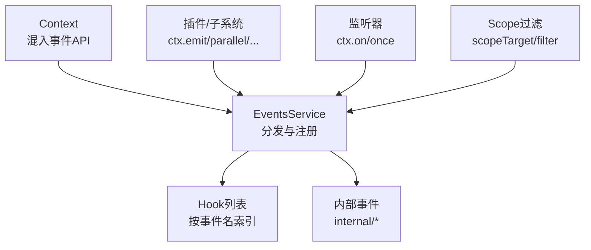
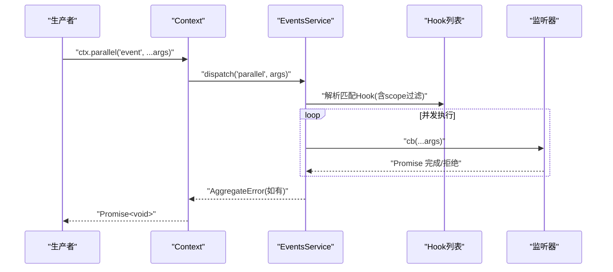
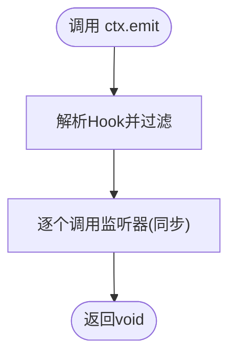
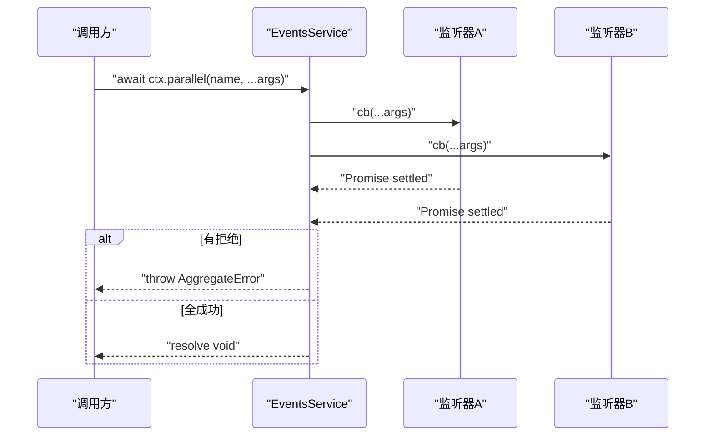
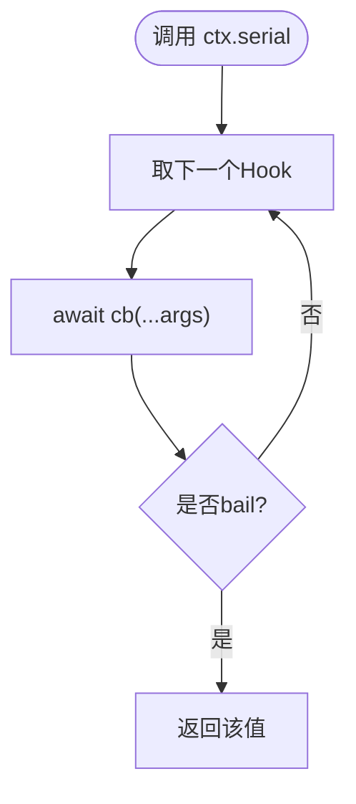
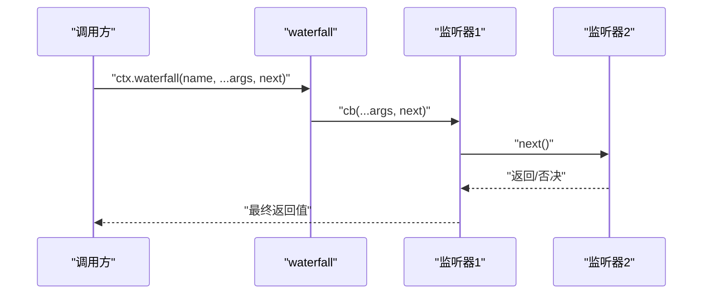
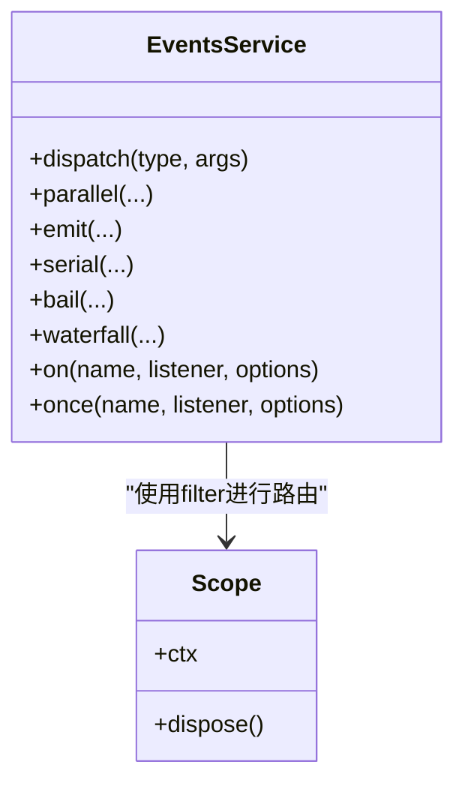
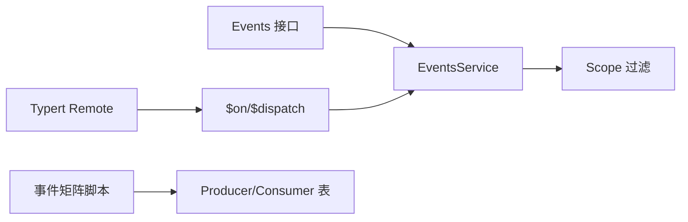

# 事件模式与最佳实践

<cite>
**本文引用的文件**
- [vendor/cordis/src/events.ts](file://vendor/cordis/src/events.ts)
- [docs/cordis-api/events.md](file://docs/cordis-api/events.md)
- [docs/cordis-tutorial/04-events.md](file://docs/cordis-tutorial/04-events.md)
- [docs/event-producer-consumer.md](file://docs/event-producer-consumer.md)
- [packages/core/scope/src/index.ts](file://packages/core/scope/src/index.ts)
- [packages/util/timeout/README.md](file://packages/util/timeout/README.md)
- [packages/guard/timeout-policy/tests/timeout-policy.spec.ts](file://packages/guard/timeout-policy/tests/timeout-policy.spec.ts)
- [packages/session-query/session-query/src/tracing.ts](file://packages/session-query/session-query/src/tracing.ts)
- [packages/typert/protocol/src/types.ts](file://packages/typert/protocol/src/types.ts)
- [packages/api/gateway/tests/gateway.client.spec.ts](file://packages/api/gateway/tests/gateway.client.spec.ts)
</cite>

## 目录
1. [简介](#简介)
2. [项目结构](#项目结构)
3. [核心组件](#核心组件)
4. [架构总览](#架构总览)
5. [详细组件分析](#详细组件分析)
6. [依赖关系分析](#依赖关系分析)
7. [性能考量](#性能考量)
8. [故障排查指南](#故障排查指南)
9. [结论](#结论)
10. [附录](#附录)

## 简介
本指南系统性梳理 Cordis 事件框架的五大分发模式：emit（发布订阅）、parallel（并行处理）、serial（串行处理，首个“非空/非假”返回值即停止）、bail（同步版 serial）、waterfall（瀑布流，监听器可包装或否决后续链）。文档面向插件作者与子系统维护者，覆盖适用场景、性能特征、实现细节、设计模式与反模式、事件去重、错误传播、超时处理、调试监控、跨进程通信与分布式事件处理等主题。

## 项目结构
Cordis 的事件能力由统一的 EventsService 提供，并通过 Context 混入 ctx.emit / ctx.parallel / ctx.serial / ctx.bail / ctx.waterfall / ctx.on / ctx.once 等方法；所有事件声明通过 TypeScript 模块合并扩展 Events 接口，并由生成式文档汇总到各子系统页面。事件生产者与消费者矩阵由脚本从仓库 TypeScript Program 中抽取，形成可维护的引用关系表。

图表来源
- [vendor/cordis/src/events.ts:125-175](file://vendor/cordis/src/events.ts#L125-L175)
- [packages/core/scope/src/index.ts:158-185](file://packages/core/scope/src/index.ts#L158-L185)

章节来源
- [docs/cordis-api/events.md:1-208](file://docs/cordis-api/events.md#L1-L208)
- [docs/event-producer-consumer.md:1-77](file://docs/event-producer-consumer.md#L1-L77)

## 核心组件
- EventsService：集中管理 Hook 注册、上下文过滤、五种分发模式、一次性监听器、内部事件总线。
- Context 扩展：为每个上下文注入 emit/parallel/serial/bail/waterfall/on/once 方法，并支持 thisArg 用于过滤。
- Scope 过滤：通过 context.filter 与 scopeTarget 实现事件路由隔离，使同一事件仅被目标作用域内的监听器接收。
- 类型系统：Events 接口通过模块合并声明事件签名，配合生成式文档保证 API 一致性。

章节来源
- [vendor/cordis/src/events.ts:125-353](file://vendor/cordis/src/events.ts#L125-L353)
- [packages/core/scope/src/index.ts:158-185](file://packages/core/scope/src/index.ts#L158-L185)
- [docs/cordis-api/events.md:1-208](file://docs/cordis-api/events.md#L1-L208)

## 架构总览
下图展示了事件从调用方到监听器的完整路径，包括过滤、分发模式选择与结果聚合。

图表来源
- [vendor/cordis/src/events.ts:165-187](file://vendor/cordis/src/events.ts#L165-L187)

章节来源
- [vendor/cordis/src/events.ts:165-243](file://vendor/cordis/src/events.ts#L165-L243)

## 详细组件分析

### 模式一：emit（发布订阅）
- 语义：同步广播，不等待监听器返回的 Promise，忽略返回值。
- 适用场景：日志记录、指标上报、副作用通知等无需回传结果的广播。
- 性能特点：开销最小，无等待；但无法感知失败或结果。
- 错误传播：监听器抛错不会中断其他监听器，也不会被捕获（除非外部 try/catch 包裹）。
- 典型用法：工具执行结果、会话状态变更通知等。

图表来源
- [vendor/cordis/src/events.ts:194-196](file://vendor/cordis/src/events.ts#L194-L196)

章节来源
- [docs/cordis-api/events.md:31-49](file://docs/cordis-api/events.md#L31-L49)
- [docs/event-producer-consumer.md:10-66](file://docs/event-producer-consumer.md#L10-L66)

### 模式二：parallel（并行处理）
- 语义：所有监听器并发执行，使用 Promise.allSettled 收集结果；任一拒绝则抛出 AggregateError。
- 适用场景：多个独立副作用需要统一收敛点（如持久化、遥测、缓存失效）。
- 性能特点：吞吐高；注意监听器间无共享状态竞争。
- 错误传播：全部拒绝会被聚合为一个 AggregateError；成功与失败并存时仍会抛出。
- 最佳实践：监听器应幂等且快速失败；对 I/O 密集任务进行限流。

图表来源
- [vendor/cordis/src/events.ts:183-187](file://vendor/cordis/src/events.ts#L183-L187)

章节来源
- [docs/cordis-api/events.md:8-29](file://docs/cordis-api/events.md#L8-L29)

### 模式三：serial（串行处理）
- 语义：按顺序 await 监听器，遇到第一个“非 null/false/undefined”的返回值即停止（bail）。
- 适用场景：策略选择、优先级决策、短路求值。
- 性能特点：最坏 O(n) 顺序等待；可通过 early exit 优化。
- 错误传播：监听器抛错会向上传播；建议外层捕获或在上游 waterfall 中兜底。
- 常见反模式：将本应并发的工作误用 serial，导致端到端延迟叠加。

图表来源
- [vendor/cordis/src/events.ts:204-209](file://vendor/cordis/src/events.ts#L204-L209)

章节来源
- [docs/cordis-api/events.md:51-72](file://docs/cordis-api/events.md#L51-L72)

### 模式四：bail（同步串行）
- 语义：同 serial，但同步执行，遇到第一个 bail 值立即返回。
- 适用场景：纯函数校验、配置合并、快速否决。
- 性能特点：零异步开销；避免在监听器内做阻塞操作。
- 错误传播：抛错直接上抛；无聚合。

章节来源
- [docs/cordis-api/events.md:74-95](file://docs/cordis-api/events.md#L74-L95)

### 模式五：waterfall（瀑布流）
- 语义：最后一个参数为 next() 延续；监听器可转换下游结果或不调用 next() 进行否决（veto）。
- 适用场景：拦截与增强（如鉴权、缓存命中、重试、格式化）、组合式中间件。
- 性能特点：链式调用；否决可短路后续链。
- 错误传播：next() 抛错会沿链向上冒泡；建议在关键节点捕获并转换为业务错误。
- 纪律：观察型监听器必须调用 next()，否则静默吞掉默认行为。

图表来源
- [vendor/cordis/src/events.ts:234-243](file://vendor/cordis/src/events.ts#L234-L243)

章节来源
- [docs/cordis-tutorial/04-events.md:94-141](file://docs/cordis-tutorial/04-events.md#L94-L141)
- [docs/cordis-api/events.md:97-123](file://docs/cordis-api/events.md#L97-L123)

### 事件注册与作用域过滤
- ctx.on/ctx.once：在当前 fiber 下注册监听器，自动随 fiber 生命周期清理；支持 prepend 与 global 选项。
- Scope：通过 createScope 与 scopeTarget 构建带标签的上下文，事件分发时依据 context.filter 与 scope 层级进行路由隔离。{ global: true } 的监听器可绕过作用域过滤。

图表来源
- [vendor/cordis/src/events.ts:288-318](file://vendor/cordis/src/events.ts#L288-L318)
- [packages/core/scope/src/index.ts:158-185](file://packages/core/scope/src/index.ts#L158-L185)

章节来源
- [vendor/cordis/src/events.ts:119-175](file://vendor/cordis/src/events.ts#L119-L175)
- [packages/core/scope/src/index.ts:1-185](file://packages/core/scope/src/index.ts#L1-L185)

## 依赖关系分析
- 事件声明与分发：Events 接口定义事件签名，EventsService 提供运行时分发；两者解耦，便于扩展。
- 作用域与过滤：Scope 通过 context.filter 与 scopeTarget 组合，确保事件仅在目标作用域内可见。
- 远程转发：Typert 协议定义了可转发的单向事件类型，Host 侧选择允许转发的 event 集合，Client 侧通过 $on/$dispatch 消费。
- 生产消费矩阵：仓库脚本从 TS Program 抽取事件的生产者与消费者，形成可维护的关系表。

图表来源
- [packages/typert/protocol/src/types.ts:64-93](file://packages/typert/protocol/src/types.ts#L64-L93)
- [docs/event-producer-consumer.md:1-77](file://docs/event-producer-consumer.md#L1-L77)

章节来源
- [packages/typert/protocol/src/types.ts:64-93](file://packages/typert/protocol/src/types.ts#L64-L93)
- [docs/event-producer-consumer.md:1-77](file://docs/event-producer-consumer.md#L1-L77)

## 性能考量
- 选择合适模式：
  - 广播副作用优先 emit；需收敛结果用 parallel；需要优先级决策用 serial/bail；需要拦截/改写用 waterfall。
- 并发控制：
  - parallel 适合 I/O 密集型；CPU 密集型需限制并发度，避免阻塞事件循环。
- 短路优化：
  - serial/bail 尽早返回有效值；waterfall 中合理否决减少下游开销。
- 监听器职责单一：
  - 避免在监听器中进行重型计算；必要时拆分为后台任务。
- 作用域过滤：
  - 使用 Scope 缩小事件受众，降低无关监听器的触发成本。

[本节为通用指导，不直接分析具体文件]

## 故障排查指南
- 事件未触发：
  - 检查事件名拼写与 Events 类型声明；确认监听器已正确注册且在 fiber 生命周期内。
  - 若使用 Scope，确认 dispatch 使用了 scopeTarget 构造的载体，或监听器标记了 { global: true }。
- 监听器抛错：
  - emit：错误不会被捕获，可能导致未处理异常；建议外层 try/catch 或改用 parallel。
  - parallel：AggregateError 包含所有拒绝原因；定位具体监听器后修复。
  - serial/bail：首个 bail 值之后的监听器不再执行；检查上游逻辑。
  - waterfall：next() 抛错会冒泡；在关键节点捕获并转换为业务错误。
- 超时与取消：
  - 使用 dsh-timeout 的 deadline/idleWatchdog 将超时与上游取消融合为 AbortSignal；在监听器中响应 abort 信号及时退出。
  - 工具执行层会将超时归类为 TOOL_TIMEOUT 等错误码，便于上层统一处理。
- 调试与追踪：
  - 利用 internal/dispatch 钩子记录事件分发轨迹；结合 session-query 的事件追踪能力，定位事件替换链与派生关系。
  - 使用 once 临时订阅一次事件，避免长期监听干扰。

章节来源
- [vendor/cordis/src/events.ts:165-243](file://vendor/cordis/src/events.ts#L165-L243)
- [packages/util/timeout/README.md:17-28](file://packages/util/timeout/README.md#L17-L28)
- [packages/guard/timeout-policy/tests/timeout-policy.spec.ts:97-129](file://packages/guard/timeout-policy/tests/timeout-policy.spec.ts#L97-L129)
- [packages/session-query/session-query/src/tracing.ts:58-91](file://packages/session-query/session-query/src/tracing.ts#L58-L91)
- [packages/session-query/session-query/src/tracing.ts:175-218](file://packages/session-query/session-query/src/tracing.ts#L175-L218)

## 结论
Cordis 事件框架通过五种分发模式覆盖了从简单广播到复杂拦截的广泛场景。选择合适的模式、遵循监听器职责单一与短路原则、结合 Scope 的作用域过滤与 dsh-timeout 的超时/取消机制，可以构建高性能、可观测、易维护的事件驱动系统。对于跨进程与分布式场景，借助 Typert 的远程事件转发能力，可在 Host/Client 之间安全地传递事件。

[本节为总结性内容，不直接分析具体文件]

## 附录

### 事件模式速查
- emit：同步广播，忽略返回值与 Promise。
- parallel：并发执行，聚合结果，任一拒绝抛出 AggregateError。
- serial：顺序执行，首个非空/非假返回值即停止。
- bail：同步版 serial。
- waterfall：监听器包装 next()，可转换或否决下游。

章节来源
- [docs/cordis-api/events.md:8-123](file://docs/cordis-api/events.md#L8-L123)

### 跨进程事件通信与分布式方案
- 单向转发：Host 侧选择允许转发的 event 集合，Client 侧通过 $on 订阅，$dispatch 投递。
- 无订阅丢弃：无人订阅的事件帧将被静默丢弃，避免无效网络负载。
- 类型安全：基于 Events 接口与 Typert 生成的类型约束，确保参数形状一致。

章节来源
- [packages/typert/protocol/src/types.ts:64-93](file://packages/typert/protocol/src/types.ts#L64-L93)
- [packages/api/gateway/tests/gateway.client.spec.ts:820-829](file://packages/api/gateway/tests/gateway.client.spec.ts#L820-L829)